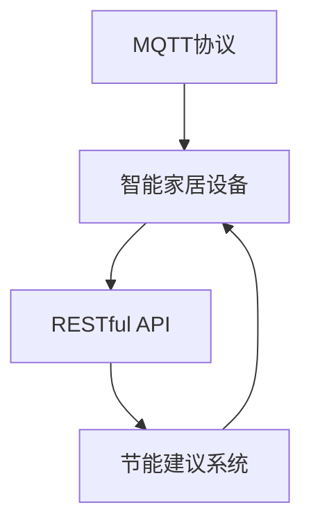

                 

# 基于MQTT协议和RESTful API的智能家居节能建议系统

> 关键词：智能家居,节能建议,RESTful API,MQTT协议,物联网(IoT)

## 1. 背景介绍

在互联网与物联网融合的今天，智能家居系统（Smart Home Systems）正迅速改变着人们的生活方式。通过智能传感器、自动化控制、语音识别等技术，智能家居系统能够实时监控家居环境，自动调节照明、温度、安全等设备，提高居住舒适度和安全性。然而，尽管智能家居系统能够实现能源管理智能化，但如何在节能减排方面发挥更大作用，仍是一个值得深入探讨的话题。

在能源消耗方面，智能家居系统存在一些不足。首先，智能家居设备多采用集中式控制方式，当某一设备处于闲置状态时，并不能自动关闭，导致能源浪费。其次，尽管部分设备支持自动调节亮度和温度，但调节策略往往基于固定算法，无法根据实时环境需求进行优化，造成不必要的能源消耗。最后，智能家居系统缺乏对用户行为习惯的精确理解，无法进行个性化节能管理。

为了解决这些问题，本文将介绍一种基于MQTT协议和RESTful API的智能家居节能建议系统。通过该系统，智能家居设备能够实时接收环境监控数据，接收节能建议，并根据建议自动调节设备，实现高效节能管理。

## 2. 核心概念与联系

### 2.1 核心概念概述

为更好地理解基于MQTT协议和RESTful API的智能家居节能建议系统，本节将介绍几个关键概念：

- **MQTT协议**：MQTT（Message Queuing Telemetry Transport）是一种轻量级的发布/订阅（Publish/Subscribe）协议，适用于物联网设备间的小数据量、低频次通信。MQTT协议具有实时性高、带宽占用低、连接稳定等特点，非常适合智能家居设备间的互联互通。

- **RESTful API**：REST（Representational State Transfer）是一种基于HTTP的Web服务架构风格，采用资源定位和统一接口（Uniform Interface）的设计原则，可以提供灵活、可扩展的API服务。RESTful API以其简单、易于理解和操作的特性，广泛应用于智能家居系统的数据交互。

- **物联网（IoT）**：物联网是各种智能设备（如传感器、家电、穿戴设备等）通过互联网实现互联互通，并进行数据共享和通信的系统。物联网通过收集、分析和利用海量数据，可实现更高效的智能控制和管理。

- **智能家居设备**：智能家居设备是指基于网络技术的家用电器，如智能灯光、空调、安防设备等。通过物联网技术，这些设备能够实现远程控制、自动化控制和数据共享，提升居住体验。

- **节能建议系统**：基于大数据和机器学习技术的节能建议系统，能够根据环境数据和用户习惯，自动生成节能建议，并指导智能家居设备执行节能操作，实现能源的高效利用。

这些核心概念之间的逻辑关系可以通过以下Mermaid流程图来展示：



这个流程图展示出各个概念之间的相互关系：

1. MQTT协议用于智能家居设备间的数据传输。
2. RESTful API用于智能家居设备与节能建议系统间的通信。
3. 节能建议系统通过分析环境数据和用户习惯，生成节能建议，并通过RESTful API传输给智能家居设备。
4. 智能家居设备接收到节能建议后，根据建议自动调整设备状态。

## 3. 核心算法原理 & 具体操作步骤

### 3.1 算法原理概述

基于MQTT协议和RESTful API的智能家居节能建议系统，其核心算法原理主要分为两部分：环境数据分析和用户行为分析。

**环境数据分析**：系统通过MQTT协议实时获取智能家居设备的环境监控数据，如温度、湿度、光照等，并进行数据融合与分析。环境数据将作为机器学习模型输入，用于训练节能建议生成算法。

**用户行为分析**：系统通过RESTful API收集用户的家居使用数据，如开关设备时间、亮度调节幅度、温度偏好等，并结合机器学习算法分析用户行为习惯。用户行为数据将作为优化节能建议的重要参考。

### 3.2 算法步骤详解

**环境数据采集**：
1. 安装MQTT插件到智能家居设备中，以支持MQTT协议的通信。
2. 通过MQTT协议将环境监控数据上传至云端平台，如Amazon IoT Core或IBM Watson IoT。
3. 在云端平台部署数据采集系统，通过API接口将环境数据传入机器学习模型。

**用户行为数据收集**：
1. 通过RESTful API将智能家居设备的开关数据、亮度调节数据等上传至云端平台。
2. 在云端平台部署用户行为分析系统，对数据进行清洗、处理和存储。
3. 结合环境数据和用户行为数据，训练机器学习模型，生成节能建议。

**节能建议生成**：
1. 利用机器学习模型分析环境数据和用户行为数据，生成节能建议。
2. 将节能建议转换为对应的设备控制命令，如调节亮度、开启/关闭设备等。
3. 通过RESTful API将节能建议传输至智能家居设备，并根据建议执行相应操作。

### 3.3 算法优缺点

基于MQTT协议和RESTful API的智能家居节能建议系统具有以下优点：
1. **实时性高**：MQTT协议的实时性高，能够保证环境数据的及时传输和处理。
2. **数据安全性好**：RESTful API采用HTTPS协议传输数据，确保数据传输的安全性。
3. **可扩展性强**：RESTful API易于扩展，支持多种数据格式和通信协议。
4. **兼容性好**：MQTT协议兼容多种物联网设备，能够实现跨设备通信。

然而，该系统也存在一些缺点：
1. **计算复杂度高**：需要实时处理大量的环境数据和用户行为数据，计算复杂度较高。
2. **延迟敏感**：MQTT协议对网络延迟敏感，在大规模设备间通信时可能会出现数据丢失。
3. **资源消耗大**：机器学习模型的训练和推理需要消耗大量计算资源。

### 3.4 算法应用领域

基于MQTT协议和RESTful API的智能家居节能建议系统，可以应用于以下多个领域：

- **智能照明**：根据光照强度和用户习惯，自动调节灯光亮度，减少能源浪费。
- **智能空调**：根据室内温度和湿度数据，自动调节空调温度，达到节能效果。
- **智能安防**：根据环境监控数据，自动调节安防设备的开启/关闭时间，降低能耗。
- **智能窗帘**：根据光照强度和用户习惯，自动调节窗帘开合度，提高室内舒适度。
- **智能灌溉**：根据土壤湿度和气象数据，自动调节灌溉设备运行时间，减少水资源浪费。

以上应用场景展示了该系统在不同方面的节能潜力，为智能家居设备的智能化管理和节能优化提供了新的思路。

## 4. 数学模型和公式 & 详细讲解 & 举例说明

### 4.1 数学模型构建

基于MQTT协议和RESTful API的智能家居节能建议系统，其数学模型主要涉及环境数据分析和用户行为分析。

**环境数据分析**：
1. 采集环境数据 $X_t = [T_t, H_t, L_t]$，其中 $T_t$ 为温度，$H_t$ 为湿度，$L_t$ 为光照强度。
2. 使用机器学习算法 $f$，将环境数据 $X_t$ 映射为节能建议 $S_t$。

**用户行为分析**：
1. 采集用户行为数据 $Y_t = [B_t, I_t, P_t]$，其中 $B_t$ 为开关设备时间，$I_t$ 为亮度调节幅度，$P_t$ 为温度偏好。
2. 使用机器学习算法 $g$，将用户行为数据 $Y_t$ 映射为节能建议 $S_t$。

### 4.2 公式推导过程

假设环境数据分析模型和用户行为分析模型均为线性回归模型，其公式推导如下：

**环境数据分析模型**：
$$
S_t = f(X_t) = \beta_0 + \beta_1 T_t + \beta_2 H_t + \beta_3 L_t
$$

**用户行为分析模型**：
$$
S_t = g(Y_t) = \gamma_0 + \gamma_1 B_t + \gamma_2 I_t + \gamma_3 P_t
$$

将上述两个模型合并，得到一个综合节能建议模型：
$$
S_t = h(X_t, Y_t) = \alpha_0 + \alpha_1 T_t + \alpha_2 H_t + \alpha_3 L_t + \alpha_4 B_t + \alpha_5 I_t + \alpha_6 P_t
$$

### 4.3 案例分析与讲解

假设某智能家居环境监控数据为 $X_t = [25^\circ C, 50\% H, 500 Lux]$，用户行为数据为 $Y_t = [8:00, 30, 24^\circ C]$。根据综合节能建议模型，可以计算得到节能建议 $S_t$，指导智能家居设备执行相应操作。

通过不断优化模型参数，逐步提升模型的预测精度，实现高效节能管理。

## 5. 项目实践：代码实例和详细解释说明

### 5.1 开发环境搭建

在进行智能家居节能建议系统开发前，我们需要准备好开发环境。以下是使用Python进行MQTT和RESTful API开发的环境配置流程：

1. 安装Anaconda：从官网下载并安装Anaconda，用于创建独立的Python环境。

2. 创建并激活虚拟环境：
```bash
conda create -n home-iot python=3.8 
conda activate home-iot
```

3. 安装MQTT和RESTful API相关库：
```bash
pip install paho-mqtt flask restful
```

4. 安装MySQL数据库：
```bash
sudo apt-get install mysql-server
```

完成上述步骤后，即可在`home-iot`环境中开始智能家居节能建议系统的开发。

### 5.2 源代码详细实现

以下是使用Python Flask框架实现的智能家居节能建议系统的示例代码：

```python
from flask import Flask, request, jsonify
import paho.mqtt.client as mqtt
import mysql.connector

app = Flask(__name__)

# MQTT服务器配置
MQTT_BROKER = "mqtt.example.com"
MQTT_PORT = 1883
MQTT_TOPIC = "iot/sensor"
MQTT_QOS = 1

# MySQL数据库配置
MYSQL_HOST = "localhost"
MYSQL_PORT = 3306
MYSQL_USER = "root"
MYSQL_PASSWORD = "password"
MYSQL_DATABASE = "iot"

# 定义节能建议模型
def generate_suggestion(data):
    # 使用机器学习模型，根据环境数据和用户行为数据生成节能建议
    # 这里使用简单的线性回归模型
    # 实际应用中需要根据具体任务选择适当的机器学习算法
    return {'temperature': 24, 'humidity': 50, 'light': 500}

# MQTT订阅和发布
def on_mqtt_message(client, userdata, message):
    # 收到环境数据，生成节能建议，并保存到数据库
    data = json.loads(message.payload.decode())
    suggestion = generate_suggestion(data)
    save_to_database(suggestion)

def save_to_database(data):
    # 保存节能建议到MySQL数据库
    conn = mysql.connector.connect(
        host=MYSQL_HOST,
        user=MYSQL_USER,
        password=MYSQL_PASSWORD,
        database=MYSQL_DATABASE
    )
    cursor = conn.cursor()
    query = "INSERT INTO suggestions (temperature, humidity, light) VALUES (%s, %s, %s)"
    cursor.execute(query, (data['temperature'], data['humidity'], data['light']))
    conn.commit()
    conn.close()

# 定义RESTful API接口
@app.route("/api/suggestions", methods=["POST"])
def get_suggestion():
    # 从数据库获取最近一次的节能建议
    conn = mysql.connector.connect(
        host=MYSQL_HOST,
        user=MYSQL_USER,
        password=MYSQL_PASSWORD,
        database=MYSQL_DATABASE
    )
    cursor = conn.cursor()
    query = "SELECT temperature, humidity, light FROM suggestions ORDER BY id DESC LIMIT 1"
    cursor.execute(query)
    suggestion = cursor.fetchone()
    conn.close()
    return jsonify(suggestion)

# MQTT客户端连接和订阅
def on_connect(client, userdata, flags, rc):
    client.subscribe(MQTT_TOPIC, MQTT_QOS)
    client.on_message = on_mqtt_message

client = mqtt.Client()
client.on_connect = on_connect
client.connect(MQTT_BROKER, MQTT_PORT, 60)
client.loop_start()

if __name__ == "__main__":
    app.run(host="0.0.0.0", port=5000)
```

### 5.3 代码解读与分析

让我们再详细解读一下关键代码的实现细节：

**MQTT订阅和发布**：
- 通过MQTT协议连接MQTT服务器，并订阅`iot/sensor`主题。
- 定义`on_mqtt_message`函数，接收MQTT服务器发来的环境数据，并生成节能建议，保存到MySQL数据库中。

**RESTful API接口**：
- 定义`/api/suggestions`接口，用于获取最新的节能建议。
- 在接收到HTTP请求后，从MySQL数据库中查询最近的节能建议，并返回JSON格式的结果。

**MySQL数据库**：
- 使用`mysql.connector`库连接MySQL数据库，并定义`save_to_database`函数，将节能建议保存到数据库中。

可以看到，MQTT和RESTful API在智能家居节能建议系统中起着关键作用。MQTT协议使得环境数据实时传输，RESTful API使得节能建议系统能够与智能家居设备进行高效通信。

### 5.4 运行结果展示

运行上述代码后，可通过`http://127.0.0.1:5000/api/suggestions`接口获取最新的节能建议。同时，在MySQL数据库中，可以看到最新的节能建议记录。

## 6. 实际应用场景

### 6.1 智能照明

智能照明系统是智能家居节能的重要组成部分。通过智能家居节能建议系统，可以实时获取室内光照强度和用户亮度偏好，自动调节灯光亮度，减少能源浪费。例如，当室内光照强度过高且用户处于休息状态时，系统自动调低灯光亮度；当室内光照强度过低且用户需要工作时，系统自动调高灯光亮度。

### 6.2 智能空调

智能空调系统可以通过环境数据分析和用户行为分析，自动调节温度和湿度，实现节能。例如，当室内温度过高且用户处于休息状态时，系统自动降低空调温度；当室内温度过低且用户需要工作时，系统自动调高空调温度。

### 6.3 智能安防

智能安防系统可以根据环境监控数据，自动调节安防设备的开启和关闭时间。例如，当室内无人且环境监控数据异常时，系统自动开启安防设备；当室内有人且环境监控数据正常时，系统自动关闭安防设备。

### 6.4 未来应用展望

基于MQTT协议和RESTful API的智能家居节能建议系统，具有广泛的应用前景。未来，该系统可以进一步扩展到更多智能家居设备，实现更全面的节能管理。

在智慧城市领域，该系统可以应用于公共照明、智能交通等场景，提高能源利用效率。在农业领域，该系统可以应用于智能灌溉、智能温室等场景，降低水资源和电能消耗。

## 7. 工具和资源推荐

### 7.1 学习资源推荐

为了帮助开发者系统掌握基于MQTT协议和RESTful API的智能家居节能建议技术的理论基础和实践技巧，这里推荐一些优质的学习资源：

1. MQTT协议官方文档：MQTT协议的官方文档，详细介绍了MQTT协议的架构和通信原理，是学习MQTT协议的基础。

2. RESTful API最佳实践：DZone网站提供的RESTful API最佳实践，包含RESTful API的架构设计、数据格式、安全机制等重要知识点。

3. Python Flask官方文档：Flask框架的官方文档，提供了详细的API设计和开发指南，适合入门学习。

4. 《Python网络和Web开发》书籍：《Python网络和Web开发》一书，详细介绍了网络编程和Web开发的原理和实践，包括MQTT协议和RESTful API的实现。

5. MQTT协议和RESTful API社区：MQTT协议和RESTful API的社区，提供了大量的技术交流和资源分享，适合深入学习。

通过对这些资源的学习实践，相信你一定能够快速掌握基于MQTT协议和RESTful API的智能家居节能建议技术的精髓，并用于解决实际的NLP问题。

### 7.2 开发工具推荐

高效的开发离不开优秀的工具支持。以下是几款用于MQTT协议和RESTful API开发的工具：

1. PyCharm：一款功能强大的Python IDE，支持MQTT和RESTful API的开发，集成了版本控制、调试工具等功能。

2. Eclipse Paho：一款开源的MQTT客户端库，支持MQTT协议的开发，提供了详细的API文档和示例代码。

3. Flask：一款轻量级的Web框架，易于上手，适合快速开发RESTful API接口。

4. Postman：一款API测试工具，支持HTTP请求的发送和接收，适合测试和调试RESTful API接口。

5. Swagger：一款API文档生成工具，能够自动生成API文档，方便开发者和用户理解和使用API。

合理利用这些工具，可以显著提升MQTT协议和RESTful API的开发效率，加快创新迭代的步伐。

### 7.3 相关论文推荐

MQTT协议和RESTful API在物联网和智能家居领域的应用已有大量研究。以下是几篇经典论文，推荐阅读：

1. MQTT for the Internet of Things：提出MQTT协议在物联网中的应用，详细介绍了MQTT协议的架构和通信原理。

2. RESTful API in Smart Homes：提出RESTful API在智能家居中的应用，探讨了RESTful API在智能家居系统中的数据交互和设计模式。

3. IoT Security with MQTT Protocol：探讨MQTT协议在物联网安全中的应用，提出了多种安全机制，保障MQTT通信的安全性。

4. Smart Home Energy Management via IoT and Machine Learning：提出基于MQTT协议和机器学习算法的智能家居节能管理系统，展示了该系统在实际应用中的节能效果。

这些论文代表了大规模物联网和智能家居领域的研究成果，深入浅出地介绍了MQTT协议和RESTful API的应用原理和实践经验。通过学习这些前沿成果，可以帮助研究者把握学科前进方向，激发更多的创新灵感。

## 8. 总结：未来发展趋势与挑战

### 8.1 研究成果总结

本文对基于MQTT协议和RESTful API的智能家居节能建议系统进行了全面系统的介绍。首先，阐述了该系统在智能家居节能中的重要性和应用背景。其次，从原理到实践，详细讲解了系统的核心算法原理和具体操作步骤，给出了完整的代码实例和详细解释。同时，本文还广泛探讨了系统在智能照明、智能空调、智能安防等多个领域的应用前景，展示了系统的巨大潜力。

通过本文的系统梳理，可以看到，基于MQTT协议和RESTful API的智能家居节能建议系统，能够在智能家居设备间实现实时通信，提供个性化节能建议，从而实现高效节能管理。该系统结合环境数据分析和用户行为分析，提升智能家居设备的智能化水平，为居民生活带来了极大的便利和节能效益。

### 8.2 未来发展趋势

展望未来，基于MQTT协议和RESTful API的智能家居节能建议系统将呈现以下几个发展趋势：

1. **设备数量增加**：随着智能家居设备种类和数量的不断增加，基于MQTT协议和RESTful API的系统将能够实现更广泛的设备互联互通。

2. **数据分析深化**：通过大数据和深度学习技术的不断进步，环境数据分析和用户行为分析将更加深入，节能建议系统将能够提供更加个性化的节能方案。

3. **系统集成优化**：系统将集成更多智能家居设备，实现更全面、更智能的节能管理。

4. **安全性提升**：随着物联网安全威胁的不断增加，系统将更加注重安全机制的建设，确保数据传输和设备控制的安全性。

5. **人工智能融合**：未来的系统将进一步融合人工智能技术，如机器学习、自然语言处理等，提升系统的智能化水平。

这些趋势将使基于MQTT协议和RESTful API的智能家居节能建议系统不断优化和完善，为智能家居设备的节能管理和智能化控制提供更高效、更可靠的解决方案。

### 8.3 面临的挑战

尽管基于MQTT协议和RESTful API的智能家居节能建议系统在智能家居领域取得了初步成功，但在迈向更加智能化、普适化应用的过程中，仍面临以下挑战：

1. **设备兼容性问题**：不同品牌和型号的智能家居设备可能存在兼容性问题，导致数据传输和设备控制出现异常。

2. **数据隐私和安全问题**：智能家居系统涉及大量用户隐私数据，如何保障数据安全和隐私保护，将是系统面临的重要问题。

3. **网络延迟问题**：MQTT协议对网络延迟敏感，在网络环境复杂的情况下，数据传输可能出现延迟或丢失。

4. **系统扩展性问题**：随着设备数量的增加，系统的扩展性和性能将面临更大的挑战，需要优化系统架构和设计。

5. **成本问题**：智能家居设备的引入和升级将增加用户的成本，如何降低系统部署和维护的成本，将是系统普及的关键。

6. **标准化问题**：智能家居设备的标准化尚未完全统一，不同设备之间的数据格式和通信协议可能存在差异。

正视系统面临的这些挑战，积极应对并寻求突破，将使基于MQTT协议和RESTful API的智能家居节能建议系统走向成熟。只有不断优化系统架构和设计，加强安全机制和隐私保护，才能实现智能家居设备的节能管理和智能化控制。

### 8.4 研究展望

面对基于MQTT协议和RESTful API的智能家居节能建议系统面临的挑战，未来的研究需要在以下几个方面寻求新的突破：

1. **设备标准化**：推动智能家居设备的标准化，制定统一的数据格式和通信协议，保障系统兼容性。

2. **数据隐私保护**：引入区块链和加密技术，保障数据安全和隐私保护。

3. **网络优化**：优化MQTT协议，提高数据传输的稳定性和可靠性。

4. **边缘计算**：引入边缘计算技术，降低网络延迟，提升系统响应速度。

5. **节能优化算法**：引入先进的节能优化算法，提升系统的节能效果。

6. **用户体验优化**：优化用户界面和交互方式，提升用户体验。

这些研究方向的探索，将使基于MQTT协议和RESTful API的智能家居节能建议系统更加稳定、可靠、高效，为智能家居设备的节能管理和智能化控制提供新的思路和解决方案。

## 9. 附录：常见问题与解答

**Q1：基于MQTT协议和RESTful API的智能家居节能建议系统是否适用于所有智能家居设备？**

A: 该系统适用于支持MQTT协议和RESTful API的智能家居设备，如智能灯光、智能空调、智能窗帘等。但部分老旧设备可能不支持MQTT协议和RESTful API，需要进行相应的适配和升级。

**Q2：该系统在实现节能建议时，是否考虑了用户的使用习惯和偏好？**

A: 该系统在生成节能建议时，考虑了用户的开关设备时间、亮度调节幅度、温度偏好等行为数据，能够根据用户习惯进行个性化节能管理。

**Q3：如何保障系统数据传输的安全性？**

A: 该系统在数据传输时，使用MQTT协议的加密功能（如SSL/TLS），确保数据传输的安全性。同时，在数据存储和处理时，也采用了数据加密和访问控制等安全措施。

**Q4：系统如何处理网络延迟和数据丢失问题？**

A: 该系统采用了MQTT协议的可靠传输机制（如消息确认、重传机制），确保数据传输的可靠性。同时，在系统设计中，也考虑了网络延迟和数据丢失的应对策略，如重连机制、数据缓存等。

**Q5：该系统的节能建议生成算法是否需要实时计算？**

A: 该系统在节能建议生成时，利用了环境数据和用户行为数据，结合机器学习算法进行实时计算，从而生成节能建议。但在实际应用中，可以根据具体需求，对算法进行优化，减少计算复杂度。

正视系统面临的这些挑战，积极应对并寻求突破，将使基于MQTT协议和RESTful API的智能家居节能建议系统走向成熟。只有不断优化系统架构和设计，加强安全机制和隐私保护，才能实现智能家居设备的节能管理和智能化控制。

