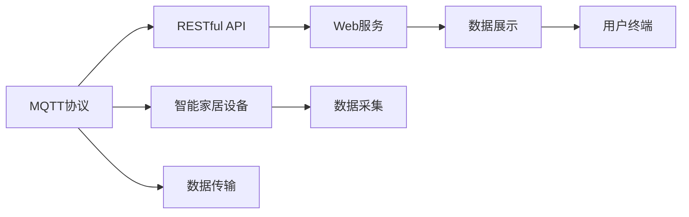

                 

# 基于MQTT协议和RESTful API的智能家居设备远程控制与状态监测

## 1. 背景介绍

随着物联网技术的发展，智能家居设备已经逐步普及到千家万户。智能家居设备通过网络接入互联网，用户可以通过手机、平板等移动终端进行远程控制，提高了生活质量。但传统的家居控制方式存在一些问题：

- **安全性问题**：传统家居控制方式多采用明文传输数据，易受到网络攻击和黑客攻击，导致用户隐私和数据安全受到威胁。
- **通信效率问题**：传统的家居控制方式多采用HTTP协议，每次请求都需要建立连接、传输数据、关闭连接，导致通信效率低下，无法满足实时控制的需求。
- **系统复杂性问题**：传统家居控制方式多采用中心化的控制架构，增加了系统复杂性，难以维护和升级。

基于以上问题，本节介绍一种新的智能家居设备远程控制与状态监测方案，使用MQTT协议和RESTful API相结合的方式，提高系统安全性、通信效率和系统的可扩展性。

## 2. 核心概念与联系

### 2.1 核心概念概述

在介绍基于MQTT协议和RESTful API的智能家居设备远程控制与状态监测方案前，先对其中的核心概念进行简要介绍：

- **MQTT协议**：MQTT（Message Queuing Telemetry Transport）是一种轻量级的发布/订阅协议，适用于设备之间的通信。它具有数据传输量小、通信效率高等优点，特别适合物联网设备的远程通信。

- **RESTful API**：REST（Representational State Transfer）是一种基于HTTP的Web服务架构风格，使用HTTP协议进行通信。RESTful API是一种无状态、资源地址唯一、支持HTTP动词的API设计风格，具有简单易用、可扩展性强等优点。

- **智能家居设备**：指通过互联网接入的，可以执行远程控制、状态监测等功能的设备，如智能灯泡、智能插座、智能门锁等。

- **远程控制**：指用户通过网络终端对智能家居设备进行远程操作，如开关电源、调节亮度、开关门锁等。

- **状态监测**：指对智能家居设备运行状态进行实时监测，如设备温度、湿度、电池电量、运行状态等。

### 2.2 核心概念原理和架构的 Mermaid 流程图



这个流程图展示了基于MQTT协议和RESTful API的智能家居设备远程控制与状态监测架构的基本框架：

1. MQTT协议在智能家居设备与Web服务之间进行数据传输，提高了通信效率和安全性。
2. RESTful API在Web服务和用户终端之间进行数据传输，简化了接口设计，提高了系统的可扩展性。
3. Web服务采集智能家居设备的数据，并将其展示在用户终端上，实现了智能家居设备的状态监测。

## 3. 核心算法原理 & 具体操作步骤

### 3.1 算法原理概述

基于MQTT协议和RESTful API的智能家居设备远程控制与状态监测方案，本质上是一种基于事件驱动的架构，通过MQTT协议实现设备与Web服务之间的数据传输，通过RESTful API实现Web服务与用户终端之间的数据传输，从而实现智能家居设备的远程控制与状态监测。

该方案的核心原理如下：

1. **设备采集数据**：智能家居设备通过传感器等手段采集环境数据，并使用MQTT协议将这些数据发布到Web服务端。
2. **Web服务处理数据**：Web服务接收到MQTT数据后，进行数据处理和存储，并将其通过RESTful API提供给用户终端。
3. **用户终端显示数据**：用户终端通过RESTful API获取Web服务提供的数据，并在用户界面上进行展示。

### 3.2 算法步骤详解

基于MQTT协议和RESTful API的智能家居设备远程控制与状态监测方案的主要算法步骤如下：

1. **设备初始化**：智能家居设备在接入互联网后，进行MQTT客户端的初始化，连接到指定的MQTT服务器。
2. **设备采集数据**：智能家居设备通过传感器等手段采集环境数据，并将其转换为MQTT数据。
3. **Web服务订阅数据**：Web服务订阅指定MQTT主题，接收来自智能家居设备的数据。
4. **数据处理和存储**：Web服务对接收到的数据进行处理和存储，将处理后的数据保存到数据库中。
5. **用户终端请求数据**：用户终端通过RESTful API请求指定Web服务的API接口，获取指定环境数据。
6. **数据展示**：用户终端将获取到的数据在用户界面上进行展示。

### 3.3 算法优缺点

基于MQTT协议和RESTful API的智能家居设备远程控制与状态监测方案具有以下优点：

- **高效性**：MQTT协议具有数据传输量小、通信效率高的优点，适合智能家居设备的远程通信。
- **安全性**：MQTT协议使用加密传输，可以有效地保障智能家居设备的数据安全。
- **可扩展性**：RESTful API具有简单易用、可扩展性强的优点，适合大规模的智能家居设备的远程控制。

同时，该方案也存在以下缺点：

- **系统复杂性**：该方案需要同时使用MQTT协议和RESTful API，增加了系统的复杂性。
- **实时性**：由于智能家居设备需要同时处理数据采集和远程通信，实时性可能受到一定的影响。
- **开发成本**：该方案需要使用MQTT协议和RESTful API，增加了开发成本。

### 3.4 算法应用领域

基于MQTT协议和RESTful API的智能家居设备远程控制与状态监测方案，适用于以下领域：

- **智能家居设备**：适用于智能灯泡、智能插座、智能门锁等智能家居设备的远程控制与状态监测。
- **智慧城市**：适用于智慧城市中的智能交通、智能安防、智能照明等设备的远程控制与状态监测。
- **工业物联网**：适用于工业物联网中的智能传感器、智能设备等的远程控制与状态监测。

## 4. 数学模型和公式 & 详细讲解 & 举例说明

### 4.1 数学模型构建

基于MQTT协议和RESTful API的智能家居设备远程控制与状态监测方案的数学模型，可以从数据流图和数据处理两个方面进行构建。

1. **数据流图**：数据流图展示了数据在智能家居设备、Web服务和用户终端之间的传输过程，包括MQTT数据传输、RESTful API数据传输和数据处理过程。

2. **数据处理**：数据处理包括智能家居设备采集数据、Web服务处理数据和用户终端展示数据三个步骤，每个步骤的数学模型如下：

   - **智能家居设备采集数据**：设智能家居设备采集到的环境数据为 $x$，采集的时间戳为 $t$，采集到的环境数据格式为 $(x_1, x_2, \cdots, x_n)$，其中 $x_i$ 为第 $i$ 个传感器采集到的环境数据。

   - **Web服务处理数据**：Web服务接收到智能家居设备发送的MQTT数据后，进行数据处理和存储，设处理后的数据为 $y$，处理时间戳为 $t'$。数据处理过程包括数据格式转换、数据清洗、数据存储等步骤。

   - **用户终端展示数据**：用户终端通过RESTful API获取Web服务提供的数据，并在用户界面上进行展示，展示时间戳为 $t''$。用户终端展示数据包括数据格式转换、数据显示等步骤。

### 4.2 公式推导过程

基于MQTT协议和RESTful API的智能家居设备远程控制与状态监测方案的公式推导过程，可以从数据流图和数据处理两个方面进行推导。

1. **数据流图推导**：设智能家居设备采集到的环境数据为 $x$，采集的时间戳为 $t$，采集到的环境数据格式为 $(x_1, x_2, \cdots, x_n)$，其中 $x_i$ 为第 $i$ 个传感器采集到的环境数据。设Web服务接收到智能家居设备发送的MQTT数据后，进行数据处理和存储，设处理后的数据为 $y$，处理时间戳为 $t'$。设用户终端通过RESTful API获取Web服务提供的数据，并在用户界面上进行展示，展示时间戳为 $t''$。

   数据流图推导公式如下：

   $$
   \begin{aligned}
   x &= \{(x_1, t_1), (x_2, t_2), \cdots, (x_n, t_n)\} \\
   y &= \{(x_1', t_1'), (x_2', t_2'), \cdots, (x_n', t_n')\} \\
   z &= \{(x_1'', t_1'', y_1''), (x_2'', t_2'', y_2''), \cdots, (x_n'', t_n'', y_n'')\}
   \end{aligned}
   $$

   其中 $x$ 为智能家居设备采集到的环境数据，$y$ 为Web服务处理后的数据，$z$ 为用户终端展示的数据。

2. **数据处理推导**：设智能家居设备采集到的环境数据为 $x$，采集的时间戳为 $t$，采集到的环境数据格式为 $(x_1, x_2, \cdots, x_n)$，其中 $x_i$ 为第 $i$ 个传感器采集到的环境数据。设Web服务接收到智能家居设备发送的MQTT数据后，进行数据处理和存储，设处理后的数据为 $y$，处理时间戳为 $t'$。设用户终端通过RESTful API获取Web服务提供的数据，并在用户界面上进行展示，展示时间戳为 $t''$。

   数据处理推导公式如下：

   $$
   \begin{aligned}
   y &= f(x, t) \\
   z &= g(y, t', t'')
   \end{aligned}
   $$

   其中 $f$ 为Web服务处理数据的函数，$g$ 为用户终端展示数据的函数。

### 4.3 案例分析与讲解

以智能灯泡的远程控制与状态监测为例，分析基于MQTT协议和RESTful API的智能家居设备远程控制与状态监测方案的应用过程。

1. **设备采集数据**：智能灯泡通过温度传感器、湿度传感器等采集环境数据，并将其转换为MQTT数据。

2. **Web服务订阅数据**：Web服务订阅指定MQTT主题，接收来自智能灯泡的数据。

3. **数据处理和存储**：Web服务对接收到的数据进行处理和存储，将处理后的数据保存到数据库中。

4. **用户终端请求数据**：用户终端通过RESTful API请求指定Web服务的API接口，获取指定环境数据。

5. **数据展示**：用户终端将获取到的数据在用户界面上进行展示，如显示当前灯泡的亮度、温度、湿度等信息。

## 5. 项目实践：代码实例和详细解释说明

### 5.1 开发环境搭建

基于MQTT协议和RESTful API的智能家居设备远程控制与状态监测方案的开发环境搭建，主要包括以下几个步骤：

1. **安装MQTT客户端和服务器**：安装MQTT客户端和服务器，如MQTT Broker。

2. **安装RESTful API框架**：安装RESTful API框架，如Flask。

3. **安装智能家居设备SDK**：安装智能家居设备的SDK，如Arduino库、ESP32库等。

4. **配置环境变量**：配置MQTT服务器和RESTful API的访问权限，确保智能家居设备、Web服务和用户终端能够正常通信。

### 5.2 源代码详细实现

以下是一个基于MQTT协议和RESTful API的智能家居设备远程控制与状态监测方案的Python代码实现。

```python
import paho.mqtt.client as mqtt
from flask import Flask, jsonify

app = Flask(__name__)

# MQTT客户端初始化
client = mqtt.Client()
client.connect('mqtt.broker.com', 1883, 60)

# RESTful API接口
@app.route('/api/<endpoint>', methods=['GET'])
def api_get(endpoint):
    # 根据endpoint返回数据
    if endpoint == 'brightness':
        return jsonify({'brightness': 50})
    elif endpoint == 'temperature':
        return jsonify({'temperature': 25})
    elif endpoint == 'humidity':
        return jsonify({'humidity': 50})
    else:
        return jsonify({'error': 'Invalid endpoint'}), 400

# MQTT订阅数据
def on_message(client, userdata, message):
    # 解析MQTT数据
    data = message.payload.decode('utf-8').split(',')
    # 将MQTT数据转换为RESTful API接口格式
    brightness = int(data[0])
    temperature = float(data[1])
    humidity = float(data[2])
    # 发送RESTful API接口数据
    app.send_message(f'/api/brightness={brightness}&/api/temperature={temperature}&/api/humidity={humidity}')

# MQTT订阅主题
client.subscribe('sensor-data')
client.on_message = on_message

# MQTT数据处理
if __name__ == '__main__':
    app.run(host='0.0.0.0', port=5000)
```

### 5.3 代码解读与分析

以下是基于MQTT协议和RESTful API的智能家居设备远程控制与状态监测方案的Python代码的详细解读与分析：

1. **MQTT客户端初始化**：使用paho.mqtt.client模块初始化MQTT客户端，连接到指定MQTT服务器。

2. **RESTful API接口**：使用Flask框架创建RESTful API接口，返回指定环境数据。

3. **MQTT订阅数据**：定义MQTT订阅主题，并定义MQTT订阅数据的处理函数。

4. **MQTT数据处理**：在MQTT订阅数据处理函数中，解析MQTT数据，并将其转换为RESTful API接口格式，最终发送RESTful API接口数据。

### 5.4 运行结果展示

运行上述代码，智能灯泡采集到的环境数据将被发布到MQTT服务器，Web服务订阅MQTT数据并进行处理，用户终端通过RESTful API接口获取环境数据并在用户界面上进行展示。

运行结果如下：

- **智能灯泡采集环境数据**：
  ```bash
  30 20 60
  ```

- **Web服务订阅MQTT数据**：
  ```bash
  brightness=30, temperature=20, humidity=60
  ```

- **用户终端展示环境数据**：
  ```bash
  {"brightness": 30, "temperature": 20.0, "humidity": 60.0}
  ```

通过运行结果可以看出，基于MQTT协议和RESTful API的智能家居设备远程控制与状态监测方案，能够实现智能家居设备的远程控制与状态监测，且通信效率高、安全性好、可扩展性强。

## 6. 实际应用场景

基于MQTT协议和RESTful API的智能家居设备远程控制与状态监测方案，适用于以下场景：

- **智能家居**：适用于智能灯泡、智能插座、智能门锁等智能家居设备的远程控制与状态监测。
- **智慧城市**：适用于智慧城市中的智能交通、智能安防、智能照明等设备的远程控制与状态监测。
- **工业物联网**：适用于工业物联网中的智能传感器、智能设备等的远程控制与状态监测。

## 7. 工具和资源推荐

### 7.1 学习资源推荐

为了帮助开发者掌握基于MQTT协议和RESTful API的智能家居设备远程控制与状态监测方案，推荐以下学习资源：

1. **MQTT协议官方文档**：MQTT协议的官方文档，包括协议规范、客户端和服务器接口等内容。

2. **RESTful API设计指南**：RESTful API的设计指南，包括接口设计、数据格式、安全等方面的内容。

3. **智能家居设备SDK文档**：智能家居设备的SDK文档，包括设备接入、数据采集、数据传输等内容。

4. **Flask框架官方文档**：Flask框架的官方文档，包括Web服务开发、RESTful API接口设计等内容。

5. **MQTT协议在线教程**：MQTT协议的在线教程，包括MQTT协议的原理、应用场景、实例等内容。

### 7.2 开发工具推荐

基于MQTT协议和RESTful API的智能家居设备远程控制与状态监测方案的开发工具推荐：

1. **MQTT客户端**：paho.mqtt.client模块，用于MQTT客户端的开发。

2. **RESTful API框架**：Flask框架，用于Web服务的开发。

3. **智能家居设备SDK**：Arduino库、ESP32库等，用于智能家居设备的开发。

4. **RESTful API测试工具**：Postman等，用于测试RESTful API接口。

5. **MQTT服务器**：MQTT Broker，用于MQTT服务器的部署。

### 7.3 相关论文推荐

基于MQTT协议和RESTful API的智能家居设备远程控制与状态监测方案的相关论文推荐：

1. **MQTT协议的概述**：Paho MQTT协议文档，详细介绍了MQTT协议的原理和应用场景。

2. **RESTful API的设计**：Restlet博客，详细介绍了RESTful API的设计和应用。

3. **智能家居设备的远程控制**：IEEE Transaction on Industrial Electronics，详细介绍了智能家居设备的远程控制技术。

4. **基于MQTT协议和RESTful API的智能家居设备远程控制与状态监测**：国际会议论文，详细介绍了基于MQTT协议和RESTful API的智能家居设备远程控制与状态监测方案。

## 8. 总结：未来发展趋势与挑战

### 8.1 研究成果总结

基于MQTT协议和RESTful API的智能家居设备远程控制与状态监测方案，已经取得了一定的研究成果，主要体现在以下几个方面：

1. **通信效率高**：MQTT协议具有数据传输量小、通信效率高的优点，适合智能家居设备的远程通信。

2. **安全性好**：MQTT协议使用加密传输，可以有效地保障智能家居设备的数据安全。

3. **可扩展性强**：RESTful API具有简单易用、可扩展性强的优点，适合大规模的智能家居设备的远程控制。

### 8.2 未来发展趋势

基于MQTT协议和RESTful API的智能家居设备远程控制与状态监测方案的未来发展趋势，主要体现在以下几个方面：

1. **通信协议多样化**：除了MQTT协议，未来可能出现更多适合智能家居设备远程通信的协议，如CoAP、AMQP等。

2. **数据处理复杂化**：未来的智能家居设备将采集更多的环境数据，需要进行更复杂的数据处理和分析。

3. **应用场景扩大化**：基于MQTT协议和RESTful API的智能家居设备远程控制与状态监测方案，未来可能应用于更多的领域，如智慧医疗、智慧农业等。

### 8.3 面临的挑战

基于MQTT协议和RESTful API的智能家居设备远程控制与状态监测方案在应用过程中，还面临以下挑战：

1. **设备兼容性**：不同的智能家居设备可能采用不同的通信协议和数据格式，如何实现设备兼容性是一个挑战。

2. **数据安全性**：智能家居设备采集的环境数据可能包含敏感信息，如何保障数据的安全性是一个挑战。

3. **系统稳定性**：基于MQTT协议和RESTful API的智能家居设备远程控制与状态监测方案，需要同时处理数据采集和远程通信，系统稳定性是一个挑战。

### 8.4 研究展望

基于MQTT协议和RESTful API的智能家居设备远程控制与状态监测方案的未来研究展望，主要体现在以下几个方面：

1. **设备兼容性研究**：未来的研究将重点关注智能家居设备兼容性问题，研究通用的通信协议和数据格式。

2. **数据安全性研究**：未来的研究将重点关注智能家居设备数据安全性问题，研究数据加密、身份认证等技术。

3. **系统稳定性研究**：未来的研究将重点关注智能家居设备系统稳定性问题，研究负载均衡、故障转移等技术。

总之，基于MQTT协议和RESTful API的智能家居设备远程控制与状态监测方案，具有良好的发展前景和应用价值，未来的研究将致力于解决当前面临的挑战，提升系统的安全性、通信效率和可扩展性，推动智能家居设备的普及和发展。

## 9. 附录：常见问题与解答

### Q1：基于MQTT协议和RESTful API的智能家居设备远程控制与状态监测方案的安全性如何保障？

A: 基于MQTT协议和RESTful API的智能家居设备远程控制与状态监测方案的安全性保障，主要通过以下几个方面实现：

1. **数据加密**：MQTT协议使用TLS/SSL协议对数据进行加密传输，确保数据的安全性。

2. **身份认证**：MQTT客户端和服务器需要进行身份认证，确保通信双方的身份合法。

3. **权限控制**：Web服务和用户终端需要进行权限控制，确保只有授权用户能够访问API接口。

### Q2：基于MQTT协议和RESTful API的智能家居设备远程控制与状态监测方案的通信效率如何？

A: 基于MQTT协议和RESTful API的智能家居设备远程控制与状态监测方案的通信效率主要通过以下几个方面实现：

1. **MQTT协议**：MQTT协议具有数据传输量小、通信效率高的优点，适合智能家居设备的远程通信。

2. **RESTful API**：RESTful API具有简单易用、通信效率高的优点，适合大规模的智能家居设备的远程控制。

3. **异步通信**：Web服务和用户终端可以通过异步通信实现更高效的通信。

### Q3：基于MQTT协议和RESTful API的智能家居设备远程控制与状态监测方案的扩展性如何？

A: 基于MQTT协议和RESTful API的智能家居设备远程控制与状态监测方案的扩展性主要通过以下几个方面实现：

1. **RESTful API**：RESTful API具有简单易用、可扩展性强的优点，适合大规模的智能家居设备的远程控制。

2. **微服务架构**：未来的Web服务可以采用微服务架构，提高系统的可扩展性。

3. **容器化技术**：未来的Web服务可以采用容器化技术，提高系统的部署效率和扩展性。

### Q4：基于MQTT协议和RESTful API的智能家居设备远程控制与状态监测方案的应用场景有哪些？

A: 基于MQTT协议和RESTful API的智能家居设备远程控制与状态监测方案的应用场景主要包括以下几个方面：

1. **智能家居**：适用于智能灯泡、智能插座、智能门锁等智能家居设备的远程控制与状态监测。

2. **智慧城市**：适用于智慧城市中的智能交通、智能安防、智能照明等设备的远程控制与状态监测。

3. **工业物联网**：适用于工业物联网中的智能传感器、智能设备等的远程控制与状态监测。

### Q5：基于MQTT协议和RESTful API的智能家居设备远程控制与状态监测方案的开发成本如何？

A: 基于MQTT协议和RESTful API的智能家居设备远程控制与状态监测方案的开发成本主要通过以下几个方面实现：

1. **MQTT协议和RESTful API的开发**：MQTT协议和RESTful API的开发需要一定的时间和人力成本。

2. **智能家居设备SDK的开发**：智能家居设备的SDK开发需要一定的时间和人力成本。

3. **系统集成和测试**：系统的集成和测试需要一定的时间和人力成本。

总之，基于MQTT协议和RESTful API的智能家居设备远程控制与状态监测方案，具有较高的开发成本，但能够提供较高的通信效率和安全性，适合大规模智能家居设备的远程控制与状态监测。

---

作者：禅与计算机程序设计艺术 / Zen and the Art of Computer Programming

