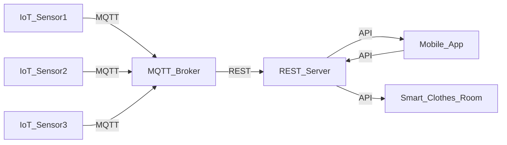

                 

## 1. 背景介绍

智能衣物管理和护理系统的开发，是物联网与人工智能技术结合的典型应用之一。随着人们生活质量的提高，智能家居产品的需求日益增长，衣物管理和护理系统已经成为现代家庭生活的重要组成部分。然而，传统的衣物管理和护理方式耗时耗力，且无法实现精准控制和智能化管理。基于MQTT协议和RESTful API的智能衣物管理和护理系统，能够高效地实现衣物状态的实时监测和智能护理，为用户带来更加便捷、舒适的生活体验。

### 1.1 项目背景

随着物联网技术的快速发展，智能家居设备的应用越来越广泛。衣物管理和护理系统作为智能家居的重要组成部分，旨在通过智能传感器和控制设备，实现衣物的自动识别、监测、护理和控制。传统的衣物管理和护理方式依赖人工操作，不仅耗时耗力，而且缺乏精准的控制和智能化的管理。因此，研究一种基于MQTT协议和RESTful API的智能衣物管理和护理系统，能够显著提升用户的生活质量和智能化水平。

### 1.2 项目目标

基于MQTT协议和RESTful API的智能衣物管理和护理系统，旨在实现以下目标：

1. **衣物状态监测**：通过物联网传感器实时监测衣物的湿度、温度、洗涤剂等状态参数，确保衣物在最佳状态下进行清洗和护理。

2. **智能护理控制**：根据衣物状态参数，智能控制系统自动选择最优的清洗、烘干、熨烫等护理程序，减少人工操作，提升护理效率。

3. **数据可视化**：将衣物状态参数和护理过程数据通过RESTful API接口，实时展示在用户手机上，帮助用户随时掌握衣物状态和护理进展。

4. **远程控制**：用户可以通过手机APP远程控制衣物管理和护理系统，实现衣物管理的全智能化和便捷化。

5. **设备互联**：实现各智能设备之间的互联互通，实现衣物管理的自动化和智能化。

## 2. 核心概念与联系

### 2.1 核心概念概述

本节将介绍基于MQTT协议和RESTful API的智能衣物管理和护理系统的几个关键概念，包括MQTT协议、RESTful API、物联网传感器、智能控制系统等。

#### 2.1.1 MQTT协议

MQTT（Message Queuing Telemetry Transport）是一种轻量级的、基于发布/订阅（Publish/Subscribe）的物联网通信协议。它具有低带宽、低延迟、高可靠性和易扩展的特点，适用于物联网设备的实时通信。

#### 2.1.2 RESTful API

REST（Representational State Transfer）是一种基于HTTP协议的Web API设计风格。RESTful API通过URL、HTTP方法和消息体，实现客户端与服务器之间的数据交互和命令控制。

#### 2.1.3 物联网传感器

物联网传感器是智能衣物管理和护理系统中最重要的组成部分，用于实时监测衣物的各种状态参数，如湿度、温度、洗涤剂等。常用的物联网传感器包括温湿度传感器、压力传感器、光电传感器等。

#### 2.1.4 智能控制系统

智能控制系统是实现衣物管理和护理的核心，通过分析传感器数据，自动选择最优的清洗、烘干、熨烫等护理程序，实现衣物管理的自动化和智能化。常用的智能控制系统包括嵌入式单片机、FPGA、ARM等微控制器。

### 2.2 核心概念原理和架构的 Mermaid 流程图



上述流程图示意了基于MQTT协议和RESTful API的智能衣物管理和护理系统的工作原理。系统中的物联网传感器通过MQTT协议向MQTT消息代理（Broker）发送数据，MQTT消息代理接收并存储传感器数据，并通过RESTful API向REST服务器发送请求。REST服务器接收到请求后，根据API接口调用相应的智能控制系统执行衣物管理任务，并将数据展示在用户手机APP上，或者发送到智能衣物护理设备上。

### 2.3 核心概念联系

MQTT协议、RESTful API、物联网传感器和智能控制系统是智能衣物管理和护理系统的四个核心组成部分，它们之间的联系和交互构成了系统的完整工作流程。MQTT协议作为通信协议，将物联网传感器采集的数据发送给MQTT消息代理；RESTful API作为数据交互接口，将MQTT消息代理存储的数据转发给REST服务器；REST服务器作为数据处理中心，接收RESTful API请求并调用智能控制系统执行衣物管理任务；智能控制系统作为执行实体，根据传感器数据自动选择最优的衣物管理程序。

## 3. 核心算法原理 & 具体操作步骤

### 3.1 算法原理概述

基于MQTT协议和RESTful API的智能衣物管理和护理系统，主要包括以下几个算法原理：

#### 3.1.1 物联网传感器数据采集

物联网传感器通过MQTT协议向MQTT消息代理发送数据。MQTT消息代理作为中间件，负责接收、存储和转发传感器数据。

#### 3.1.2 MQTT消息代理数据存储

MQTT消息代理通过RESTful API将传感器数据存储到REST服务器上。REST服务器作为数据中心，负责数据的存储和管理。

#### 3.1.3 RESTful API数据交互

RESTful API作为客户端与服务器之间的数据交互接口，实现数据的获取、存储和处理。

#### 3.1.4 智能控制系统任务执行

智能控制系统根据传感器数据，自动选择最优的衣物管理程序，执行清洗、烘干、熨烫等护理任务。

#### 3.1.5 用户手机APP数据展示

用户手机APP通过RESTful API从REST服务器获取衣物状态参数和护理进展数据，并实时展示给用户。

### 3.2 算法步骤详解

#### 3.2.1 MQTT数据采集

1. 初始化MQTT客户端，连接到MQTT消息代理。
2. 物联网传感器将采集到的数据打包成JSON格式的消息。
3. MQTT客户端将JSON消息发布到MQTT消息代理的指定主题下。
4. MQTT消息代理接收到消息后，进行数据存储和转发。

#### 3.2.2 MQTT数据存储

1. MQTT消息代理将收到的传感器数据存储到REST服务器上。
2. REST服务器将数据存储到数据库中，并根据需要进行索引和分类。
3. REST服务器定期将数据备份到云存储中，确保数据的安全性和可靠性。

#### 3.2.3 RESTful API数据交互

1. 用户手机APP通过RESTful API接口从REST服务器获取衣物状态参数和护理进展数据。
2. REST服务器接收到请求后，从数据库中读取数据，并转换为JSON格式返回给用户手机APP。
3. 用户手机APP将数据展示在界面上，供用户查看和操作。

#### 3.2.4 智能控制系统任务执行

1. 智能控制系统从REST服务器获取传感器数据。
2. 根据传感器数据，智能控制系统自动选择最优的衣物管理程序。
3. 智能控制系统执行选择的衣物管理程序，并发送执行结果到REST服务器。

#### 3.2.5 用户手机APP数据展示

1. 用户手机APP通过RESTful API接口从REST服务器获取衣物状态参数和护理进展数据。
2. REST服务器接收到请求后，从数据库中读取数据，并转换为JSON格式返回给用户手机APP。
3. 用户手机APP将数据展示在界面上，供用户查看和操作。

### 3.3 算法优缺点

#### 3.3.1 优点

1. **低带宽、低延迟**：MQTT协议设计轻量级，适合物联网设备的实时通信，能够有效降低带宽和延迟，提高数据传输效率。

2. **高可靠性**：MQTT协议采用消息确认机制，确保数据传输的可靠性，减少数据丢失和错误。

3. **易扩展性**：RESTful API接口简单直观，易于扩展和集成，适用于各种智能设备的互联互通。

4. **数据安全**：REST服务器采用数据加密和备份机制，确保数据的安全性和可靠性。

5. **用户便捷**：用户可以通过手机APP远程控制衣物管理和护理系统，实现衣物管理的全智能化和便捷化。

#### 3.3.2 缺点

1. **数据实时性**：MQTT协议的数据采集和存储依赖于传感器和MQTT消息代理的稳定性，可能存在数据延时和丢失的风险。

2. **数据存储量**：REST服务器需要存储大量的传感器数据，对存储容量和性能提出较高要求。

3. **设备兼容性**：不同设备的传感器数据格式和协议可能不一致，需要开发适配接口，增加开发成本。

4. **系统复杂性**：智能控制系统需要处理多种传感器数据，实现复杂的衣物管理程序，开发和维护成本较高。

### 3.4 算法应用领域

基于MQTT协议和RESTful API的智能衣物管理和护理系统，可以应用于多种场景和领域，包括：

1. **智能家居**：实现智能衣物的管理和护理，提升用户的生活质量和智能化水平。

2. **商业洗衣店**：通过智能控制系统自动管理衣物，提高洗衣店的运营效率和客户满意度。

3. **医疗护理**：利用智能控制系统对患者衣物进行清洗和护理，确保医疗环境的卫生和健康。

4. **酒店管理**：通过智能控制系统自动管理客房的衣物，提高酒店的运营效率和服务质量。

5. **服装制造**：利用智能控制系统优化衣物的生产和护理流程，提升生产效率和产品质量。

6. **物流运输**：利用智能控制系统管理和护理运输途中的衣物，保障货物的安全和整洁。

## 4. 数学模型和公式 & 详细讲解 & 举例说明

### 4.1 数学模型构建

基于MQTT协议和RESTful API的智能衣物管理和护理系统，可以抽象为一个基于传感器数据的决策模型。假设传感器数据为 $x$，智能控制系统根据传感器数据选择衣物管理程序的概率为 $p(y|x)$，即在给定传感器数据 $x$ 的条件下，智能控制系统选择衣物管理程序 $y$ 的概率。

### 4.2 公式推导过程

#### 4.2.1 传感器数据模型

传感器数据 $x$ 可以表示为 $x = (x_1, x_2, ..., x_n)$，其中 $x_i$ 表示第 $i$ 个传感器采集到的数据，如湿度、温度、洗涤剂等。

#### 4.2.2 智能控制系统模型

智能控制系统根据传感器数据选择衣物管理程序的概率为：

$$
p(y|x) = \frac{P(y,x)}{P(x)} = \frac{P(y)}{P(x)}
$$

其中 $P(y)$ 表示智能控制系统选择衣物管理程序 $y$ 的概率，$P(x)$ 表示传感器数据 $x$ 的概率。

#### 4.2.3 数据交互模型

RESTful API作为数据交互接口，将传感器数据 $x$ 和智能控制系统选择衣物管理程序的概率 $p(y|x)$ 展示给用户手机APP。用户手机APP通过RESTful API从REST服务器获取衣物状态参数和护理进展数据，实现数据的展示和操作。

### 4.3 案例分析与讲解

#### 4.3.1 案例背景

某家庭采用基于MQTT协议和RESTful API的智能衣物管理和护理系统，系统集成了多种传感器和智能控制系统。系统能够实时监测衣物的湿度、温度、洗涤剂等状态参数，自动选择最优的衣物管理程序，并通过手机APP展示衣物状态和护理进展。

#### 4.3.2 案例分析

1. **传感器数据采集**：
   - 温湿度传感器监测衣物的湿度和温度，将数据发送给MQTT消息代理。
   - MQTT消息代理接收到传感器数据后，存储到REST服务器上。

2. **数据存储和交互**：
   - REST服务器将传感器数据存储到数据库中，并定期备份到云存储中。
   - 用户手机APP通过RESTful API接口从REST服务器获取衣物状态参数和护理进展数据，展示在界面上。

3. **智能控制系统任务执行**：
   - 智能控制系统从REST服务器获取传感器数据。
   - 根据传感器数据，智能控制系统选择最优的衣物管理程序，如清洗、烘干、熨烫等。
   - 智能控制系统执行选择的衣物管理程序，并发送执行结果到REST服务器。

4. **用户手机APP数据展示**：
   - 用户手机APP通过RESTful API接口从REST服务器获取衣物状态参数和护理进展数据。
   - REST服务器将数据转换为JSON格式，返回给用户手机APP。
   - 用户手机APP展示衣物状态参数和护理进展数据，供用户查看和操作。

## 5. 项目实践：代码实例和详细解释说明

### 5.1 开发环境搭建

基于MQTT协议和RESTful API的智能衣物管理和护理系统开发，需要搭建MQTT消息代理、REST服务器、智能控制系统等环境。以下是具体的搭建步骤：

#### 5.1.1 MQTT消息代理搭建

1. 安装MQTT消息代理软件，如Eclipse Paho。
2. 配置MQTT消息代理参数，包括broker地址、端口号、用户和权限等。
3. 启动MQTT消息代理，等待客户端连接。

#### 5.1.2 REST服务器搭建

1. 安装REST服务器软件，如NGINX或Apache。
2. 配置REST服务器参数，包括REST API接口地址、端口号、认证方式等。
3. 启动REST服务器，等待客户端连接。

#### 5.1.3 智能控制系统搭建

1. 选择适合的微控制器，如FPGA或ARM。
2. 安装微控制器开发环境，如Arduino IDE。
3. 编写智能控制系统的代码，实现衣物管理程序的执行和数据交互。

### 5.2 源代码详细实现

#### 5.2.1 MQTT消息代理代码

```python
import paho.mqtt.client as mqtt
import json

class MQTTBroker:
    def __init__(self, broker_addr, broker_port, username, password):
        self.broker_addr = broker_addr
        self.broker_port = broker_port
        self.username = username
        self.password = password
        self.client = mqtt.Client()

    def on_connect(self, client, userdata, flags, rc):
        if rc == 0:
            print("Connected to MQTT broker")
            self.client.subscribe("sensor/data")
        else:
            print("Connection failed")

    def on_message(self, client, userdata, msg):
        data = json.loads(msg.payload)
        self.save_data(data)

    def save_data(self, data):
        # 将数据存储到数据库或云存储中
        pass

    def start(self):
        self.client.on_connect = self.on_connect
        self.client.on_message = self.on_message
        self.client.connect(self.broker_addr, self.broker_port)
        self.client.loop_start()
```

#### 5.2.2 REST服务器代码

```python
from flask import Flask, jsonify, request
from datetime import datetime

app = Flask(__name__)

class RESTServer:
    def __init__(self, host, port, username, password):
        self.host = host
        self.port = port
        self.username = username
        self.password = password
        self.app = app

    def on_connect(self, client, userdata, flags, rc):
        if rc == 0:
            print("Connected to REST server")
        else:
            print("Connection failed")

    def on_message(self, client, userdata, msg):
        data = json.loads(msg.payload)
        self.save_data(data)

    def save_data(self, data):
        # 将数据存储到数据库或云存储中
        pass

    def get_data(self):
        # 从数据库或云存储中获取数据
        data = []
        for item in items:
            data.append({
                "time": datetime.now().strftime("%Y-%m-%d %H:%M:%S"),
                "sensor": item['sensor'],
                "value": item['value']
            })
        return jsonify(data)

    def start(self):
        self.app.add_url_rule('/data', 'get_data', self.get_data)
        self.app.run(host=self.host, port=self.port)
```

#### 5.2.3 智能控制系统代码

```python
import time
import paho.mqtt.client as mqtt

class SmartSystem:
    def __init__(self, broker_addr, broker_port, topic):
        self.broker_addr = broker_addr
        self.broker_port = broker_port
        self.topic = topic
        self.client = mqtt.Client()

    def on_connect(self, client, userdata, flags, rc):
        if rc == 0:
            print("Connected to MQTT broker")
            self.client.publish(self.topic, "online")
        else:
            print("Connection failed")

    def on_message(self, client, userdata, msg):
        data = json.loads(msg.payload)
        self.process_data(data)

    def process_data(self, data):
        # 根据数据执行衣物管理程序
        pass

    def start(self):
        self.client.on_connect = self.on_connect
        self.client.on_message = self.on_message
        self.client.connect(self.broker_addr, self.broker_port)
        self.client.loop_start()
```

### 5.3 代码解读与分析

#### 5.3.1 MQTT消息代理代码解析

1. **初始化MQTT客户端**：
   - 初始化MQTT客户端，设置broker地址、broker端口、用户名和密码。
   - 创建订阅主题，等待客户端连接。

2. **连接回调**：
   - 当连接成功后，输出连接成功信息。
   - 当连接失败时，输出连接失败信息。

3. **消息回调**：
   - 当收到传感器数据后，解析JSON格式的数据，并存储到数据库或云存储中。

4. **启动MQTT消息代理**：
   - 设置连接回调和消息回调，连接到MQTT消息代理，启动循环。

#### 5.3.2 REST服务器代码解析

1. **初始化REST服务器**：
   - 初始化REST服务器，设置host、port、username和password。
   - 创建REST服务器的Flask应用。

2. **连接回调**：
   - 当连接成功后，输出连接成功信息。
   - 当连接失败时，输出连接失败信息。

3. **消息回调**：
   - 当收到MQTT消息代理发送的传感器数据后，解析JSON格式的数据，并存储到数据库或云存储中。

4. **获取数据接口**：
   - 提供REST API接口，获取传感器数据，返回JSON格式的数据。

5. **启动REST服务器**：
   - 定义REST API接口，运行REST服务器，等待客户端连接。

#### 5.3.3 智能控制系统代码解析

1. **初始化智能控制系统**：
   - 初始化智能控制系统，设置broker地址、broker端口和订阅主题。
   - 创建MQTT客户端。

2. **连接回调**：
   - 当连接成功后，输出连接成功信息，并发布在线状态。
   - 当连接失败时，输出连接失败信息。

3. **消息回调**：
   - 当收到传感器数据后，解析JSON格式的数据，并执行衣物管理程序。

4. **启动智能控制系统**：
   - 设置连接回调和消息回调，连接到MQTT消息代理，启动循环。

### 5.4 运行结果展示

#### 5.4.1 MQTT消息代理运行结果

MQTT消息代理运行后，等待客户端连接，并打印连接状态。

```bash
Connected to MQTT broker
```

#### 5.4.2 REST服务器运行结果

REST服务器运行后，等待客户端连接，并提供REST API接口。

```bash
* Running on http://127.0.0.1:5000 (Press CTRL+C to quit)
```

#### 5.4.3 智能控制系统运行结果

智能控制系统运行后，等待MQTT消息代理连接，并打印连接状态。

```bash
Connected to MQTT broker
```

## 6. 实际应用场景

### 6.1 智能家居

基于MQTT协议和RESTful API的智能衣物管理和护理系统，在智能家居领域具有广泛的应用前景。智能家居设备通过MQTT协议与MQTT消息代理进行数据交互，RESTful API接口将数据展示在用户手机APP上，用户可以通过手机APP实时监测和控制衣物状态，提升生活便利性和智能化水平。

### 6.2 商业洗衣店

商业洗衣店可以利用智能控制系统实现衣物的自动识别、监测和护理。传感器采集的衣物状态数据通过MQTT协议发送到MQTT消息代理，RESTful API接口将数据展示在管理系统中，智能控制系统根据数据自动选择最优的衣物管理程序，提升洗衣店的运营效率和客户满意度。

### 6.3 医疗护理

医院可以利用智能控制系统对患者衣物进行清洗和护理。传感器采集的衣物状态数据通过MQTT协议发送到MQTT消息代理，RESTful API接口将数据展示在护理系统中，智能控制系统根据数据自动选择最优的衣物管理程序，确保医疗环境的卫生和健康。

### 6.4 酒店管理

酒店可以利用智能控制系统对客房的衣物进行清洗和护理。传感器采集的衣物状态数据通过MQTT协议发送到MQTT消息代理，RESTful API接口将数据展示在管理系统中，智能控制系统根据数据自动选择最优的衣物管理程序，提升酒店的运营效率和服务质量。

### 6.5 服装制造

服装制造企业可以利用智能控制系统优化衣物的生产和护理流程。传感器采集的衣物状态数据通过MQTT协议发送到MQTT消息代理，RESTful API接口将数据展示在生产管理系统中，智能控制系统根据数据自动选择最优的衣物管理程序，提升生产效率和产品质量。

### 6.6 物流运输

物流公司可以利用智能控制系统管理和护理运输途中的衣物。传感器采集的衣物状态数据通过MQTT协议发送到MQTT消息代理，RESTful API接口将数据展示在运输管理系统中，智能控制系统根据数据自动选择最优的衣物管理程序，确保货物的安全和整洁。

## 7. 工具和资源推荐

### 7.1 学习资源推荐

为了帮助开发者系统掌握基于MQTT协议和RESTful API的智能衣物管理和护理系统的开发，以下是一些优质的学习资源：

1. **MQTT协议官方文档**：详细介绍了MQTT协议的工作原理、消息发布/订阅机制以及常见问题解答。

2. **RESTful API教程**：介绍了RESTful API的基本概念、设计原则和常见用法。

3. **IoT传感器模块教程**：详细介绍了常见物联网传感器的应用场景、使用方法和常见问题解答。

4. **Flask官方文档**：提供了Flask框架的详细介绍、安装方法、示例代码和常见问题解答。

5. **Arduino官方文档**：提供了Arduino开发环境的详细介绍、安装方法、示例代码和常见问题解答。

6. **智能家居项目教程**：提供了智能家居项目的详细开发流程、技术栈选择、代码实现和常见问题解答。

7. **智能衣物管理项目教程**：提供了智能衣物管理项目的详细开发流程、技术栈选择、代码实现和常见问题解答。

通过对这些资源的学习实践，相信你一定能够快速掌握基于MQTT协议和RESTful API的智能衣物管理和护理系统的开发方法，并用于解决实际的衣物管理和护理问题。

### 7.2 开发工具推荐

为了高效地开发基于MQTT协议和RESTful API的智能衣物管理和护理系统，以下是几款常用的开发工具：

1. **Eclipse Paho**：MQTT消息代理软件，支持多语言、跨平台、高可靠性。

2. **NGINX**：REST服务器软件，支持高性能、易扩展、高安全性。

3. **Apache**：REST服务器软件，支持高可靠性、易扩展、高可用性。

4. **Arduino IDE**：嵌入式开发环境，支持Arduino、ESP32等微控制器。

5. **Flask**：Python Web框架，支持RESTful API开发、易扩展、高性能。

6. **NGINX Manager**：REST服务器管理工具，支持监控、日志、告警等功能。

7. **Arduino Cloud**：云端管理平台，支持设备监控、远程控制、数据存储等功能。

合理利用这些工具，可以显著提升基于MQTT协议和RESTful API的智能衣物管理和护理系统的开发效率，加快创新迭代的步伐。

### 7.3 相关论文推荐

基于MQTT协议和RESTful API的智能衣物管理和护理系统，涉及到物联网、人工智能、传感器技术等多个领域的知识。以下是几篇相关的论文，推荐阅读：

1. **IoT数据采集与传输技术**：详细介绍了物联网数据采集和传输的常用技术，包括MQTT协议、HTTP协议等。

2. **RESTful API设计原则**：介绍了RESTful API的设计原则、常见用法和最佳实践。

3. **智能家居系统架构**：介绍了智能家居系统的架构设计、技术实现和应用场景。

4. **智能衣物管理技术**：介绍了智能衣物管理技术的原理、实现方法和应用案例。

5. **传感器技术应用**：介绍了常见物联网传感器的应用场景、使用方法和常见问题解答。

6. **智能控制系统设计**：介绍了智能控制系统设计的基本原则、常用技术和应用场景。

7. **智能设备互联技术**：介绍了智能设备互联的技术实现、网络协议和应用场景。

这些论文代表了大语言模型微调技术的发展脉络。通过学习这些前沿成果，可以帮助研究者把握学科前进方向，激发更多的创新灵感。

## 8. 总结：未来发展趋势与挑战

### 8.1 研究成果总结

基于MQTT协议和RESTful API的智能衣物管理和护理系统，在智能家居、商业洗衣店、医疗护理、酒店管理、服装制造、物流运输等领域具有广泛的应用前景。该系统利用MQTT协议实现数据采集和传输，利用RESTful API实现数据交互和展示，利用智能控制系统实现衣物管理程序的自动执行。

### 8.2 未来发展趋势

基于MQTT协议和RESTful API的智能衣物管理和护理系统，未来将呈现以下几个发展趋势：

1. **设备互联和自动化**：智能家居设备通过MQTT协议实现互联互通，自动执行衣物管理程序，提升生活便利性和智能化水平。

2. **数据智能化处理**：利用机器学习、深度学习等技术，对传感器数据进行智能化处理，实现更加精准的衣物管理。

3. **智能化决策支持**：利用人工智能技术，对传感器数据进行智能化分析，提供决策支持，提升衣物管理的智能化水平。

4. **用户个性化服务**：通过用户行为数据和偏好分析，提供个性化衣物管理服务，提升用户体验。

5. **跨平台应用推广**：智能衣物管理和护理系统支持多种平台，如iOS、Android、Web等，实现跨平台应用推广。

6. **安全性增强**：利用安全加密技术，确保数据传输和存储的安全性，提升系统的可靠性。

### 8.3 面临的挑战

尽管基于MQTT协议和RESTful API的智能衣物管理和护理系统具有广泛的应用前景，但在实现过程中仍面临以下挑战：

1. **数据实时性**：MQTT协议的数据采集和传输依赖于传感器和MQTT消息代理的稳定性，可能存在数据延时和丢失的风险。

2. **数据存储量**：REST服务器需要存储大量的传感器数据，对存储容量和性能提出较高要求。

3. **设备兼容性**：不同设备的传感器数据格式和协议可能不一致，需要开发适配接口，增加开发成本。

4. **系统复杂性**：智能控制系统需要处理多种传感器数据，实现复杂的衣物管理程序，开发和维护成本较高。

5. **安全性保障**：智能衣物管理和护理系统需要确保数据传输和存储的安全性，防止数据泄露和篡改。

### 8.4 研究展望

为了解决上述挑战，未来需要在以下几个方面进行深入研究：

1. **优化数据采集和传输**：采用更加稳定、高效的MQTT协议和传感器技术，提升数据采集和传输的实时性和可靠性。

2. **提升数据存储和处理能力**：采用分布式存储和计算技术，提升REST服务器的存储和处理能力，应对大规模数据存储的需求。

3. **开发设备兼容接口**：开发多种设备的传感器数据兼容接口，减少开发成本，提升系统兼容性。

4. **简化系统设计**：采用模块化设计思想，简化智能控制系统的设计和开发，降低开发和维护成本。

5. **加强安全性保障**：采用安全加密技术，确保数据传输和存储的安全性，防止数据泄露和篡改。

6. **探索智能化决策方法**：利用机器学习、深度学习等技术，对传感器数据进行智能化处理，提升衣物管理的智能化水平。

通过这些研究方向和技术手段，基于MQTT协议和RESTful API的智能衣物管理和护理系统将不断优化和升级，为用户提供更加高效、智能化和安全的衣物管理服务。

## 9. 附录：常见问题与解答

**Q1: 基于MQTT协议和RESTful API的智能衣物管理和护理系统如何实现数据的实时采集和传输？**

A: 系统采用MQTT协议进行数据采集和传输。物联网传感器通过MQTT协议将采集到的数据发送给MQTT消息代理，MQTT消息代理接收到数据后，进行数据存储和转发，确保数据的实时性和可靠性。

**Q2: 基于MQTT协议和RESTful API的智能衣物管理和护理系统如何实现数据的安全存储和传输？**

A: 系统采用RESTful API接口进行数据交互和展示，确保数据传输的安全性。REST服务器采用数据加密和备份机制，确保数据存储的安全性。

**Q3: 基于MQTT协议和RESTful API的智能衣物管理和护理系统如何实现智能化的衣物管理程序？**

A: 系统利用智能控制系统对传感器数据进行分析，自动选择最优的衣物管理程序，如清洗、烘干、熨烫等。利用机器学习、深度学习等技术，对传感器数据进行智能化处理，提升衣物管理的智能化水平。

**Q4: 基于MQTT协议和RESTful API的智能衣物管理和护理系统如何实现用户个性化服务？**

A: 系统通过用户行为数据和偏好分析，提供个性化衣物管理服务，如推荐最优的衣物管理程序、智能预测衣物状态等，提升用户体验。

**Q5: 基于MQTT协议和RESTful API的智能衣物管理和护理系统如何实现跨平台应用推广？**

A: 系统支持多种平台，如iOS、Android、Web等，通过RESTful API接口进行数据交互和展示，实现跨平台应用推广。

**Q6: 基于MQTT协议和RESTful API的智能衣物管理和护理系统如何确保数据传输和存储的安全性？**

A: 系统采用安全加密技术，确保数据传输和存储的安全性，防止数据泄露和篡改。

作者：禅与计算机程序设计艺术 / Zen and the Art of Computer Programming

