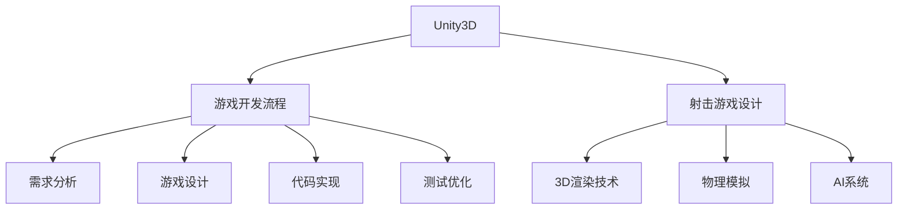

                 

# 基于Unity3D的射击游戏

> 关键词：Unity3D, 游戏开发, 射击游戏, 游戏引擎, 游戏设计, 3D渲染

## 1. 背景介绍

### 1.1 问题由来

近年来，随着虚拟现实技术和图形处理技术的快速发展，游戏行业迎来了新的革命。许多玩家不再满足于传统的二维游戏，而是追求更具沉浸感和真实感的3D游戏体验。射击游戏作为游戏界的重要一员，因其紧张刺激的游戏体验和丰富的游戏玩法，成为了玩家的热门选择。

然而，开发一款高质量的射击游戏并非易事。它不仅需要精巧的游戏设计、优秀的3D渲染效果，还需要稳定的游戏引擎支持。基于此，Unity3D作为一种强大的游戏引擎，因其跨平台、高效、易用等优点，被广泛应用于各类游戏开发，包括射击游戏。

### 1.2 问题核心关键点

开发基于Unity3D的射击游戏，关键在于掌握Unity3D的核心特性，熟悉其游戏开发流程，并结合射击游戏的特殊需求进行游戏设计。其核心关键点包括：

- 理解Unity3D引擎的基本架构和工作原理。
- 掌握Unity3D在游戏开发中的常用工具和技术。
- 熟悉射击游戏的游戏设计模式和机制。
- 实现高效率、高性能的3D渲染和物理模拟。
- 集成和优化游戏物理引擎和AI系统。
- 进行游戏测试和优化，确保游戏的稳定性和流畅性。

本文将围绕这些关键点，详细探讨基于Unity3D的射击游戏的开发方法，为广大Unity3D开发者提供实用指南。

## 2. 核心概念与联系

### 2.1 核心概念概述

为更好地理解基于Unity3D的射击游戏开发，本节将介绍几个密切相关的核心概念：

- Unity3D：一款跨平台的游戏引擎，支持高质量的3D图形渲染，提供游戏开发所需的各种工具和组件。
- 游戏开发流程：从需求分析、设计、实现到测试和发布的全过程。
- 射击游戏设计：涉及游戏玩法、角色设定、物理引擎、AI系统、网络对战等诸多方面。
- 3D渲染技术：实现高质量的游戏画面效果，包括光照、阴影、反射等特效。
- 物理模拟：使用Unity3D内置的物理引擎模拟游戏中的物理交互，如碰撞、重力等。
- AI系统：构建智能的敌对角色和NPC，增强游戏的可玩性和互动性。

这些核心概念之间的逻辑关系可以通过以下Mermaid流程图来展示：



这个流程图展示了几大核心概念的相互关系：

1. Unity3D作为游戏引擎，支持整个游戏开发流程。
2. 射击游戏设计是游戏中的关键环节，影响游戏的整体体验。
3. 3D渲染技术、物理模拟和AI系统是实现高质量射击游戏所必须的技术手段。
4. 需求分析和游戏设计是游戏开发流程的前端，代码实现、测试优化是后续步骤。

## 3. 核心算法原理 & 具体操作步骤

### 3.1 算法原理概述

基于Unity3D的射击游戏开发，其核心算法原理主要涉及游戏引擎的编程、3D渲染、物理引擎和AI系统的集成等。

1. **游戏引擎编程**：通过Unity3D的脚本语言C#编写游戏逻辑，实现游戏功能。
2. **3D渲染技术**：使用Unity3D的图形渲染组件，实现高质量的游戏画面效果。
3. **物理引擎集成**：使用Unity3D内置的物理引擎，实现游戏中的物理交互和碰撞效果。
4. **AI系统构建**：使用Unity3D的AI组件，实现游戏内的敌对角色和NPC的智能行为。

### 3.2 算法步骤详解

基于Unity3D的射击游戏开发，其具体操作步骤主要包括以下几个关键步骤：

**Step 1: 项目初始化**

- 创建新的Unity3D项目，设置项目名称、位置等基本信息。
- 设置引擎版本和性能选项，如渲染管线、物理引擎等。

**Step 2: 游戏设计**

- 分析游戏需求，设计游戏玩法、角色设定、场景布置等。
- 使用Unity3D的编辑器绘制游戏场景、角色模型等。
- 设计游戏关卡和规则，确保游戏的可玩性和挑战性。

**Step 3: 3D渲染实现**

- 选择合适的图形渲染管线，设置光照、阴影、反射等特效。
- 导入3D模型和纹理，进行材质和贴图设置。
- 使用Unity3D的图形渲染组件，实现高效、高质量的游戏画面。

**Step 4: 物理引擎集成**

- 配置Unity3D的物理引擎，设置重力、碰撞检测等参数。
- 实现游戏中的物理交互，如角色移动、物理碰撞等。
- 使用Unity3D的物理模拟工具，优化物理引擎的性能。

**Step 5: AI系统构建**

- 设计敌对角色和NPC的行为逻辑，实现智能化的游戏体验。
- 使用Unity3D的AI组件，实现AI角色的路径规划、决策等。
- 进行AI系统的测试和优化，确保AI角色的行为自然流畅。

**Step 6: 游戏测试和优化**

- 进行游戏功能的测试，确保游戏功能的完整性和稳定性。
- 使用Unity3D的性能分析工具，优化游戏性能和渲染效果。
- 进行游戏的网络测试，确保网络对战的稳定性和流畅性。

**Step 7: 发布和部署**

- 导出游戏，生成可执行文件或安装文件。
- 发布游戏至不同的平台，如PC、移动设备等。
- 进行游戏部署，确保游戏的运行环境和体验。

### 3.3 算法优缺点

基于Unity3D的射击游戏开发，其优点包括：

1. 跨平台开发：Unity3D支持PC、移动设备、游戏主机等多种平台，方便开发者进行多平台开发。
2. 高效开发：Unity3D提供高效的开发工具和组件，快速开发出高质量的游戏。
3. 资源丰富：Unity3D拥有大量的3D模型、纹理和脚本资源，方便开发者进行资源整合。
4. 易用性高：Unity3D提供了直观的编辑器和可视化工具，方便开发者进行游戏设计和调试。

其缺点包括：

1. 学习曲线陡峭：Unity3D的学习曲线较为陡峭，需要开发者掌握一定的编程和图形渲染技术。
2. 性能优化难度大：Unity3D的性能优化较为复杂，需要开发者具备一定的性能优化经验。
3. 资源依赖度高：高质量的3D模型和纹理资源需要购买或授权，增加了开发成本。
4. 网络对战问题：Unity3D的网络对战功能较为复杂，需要开发者进行特殊设计和测试。

### 3.4 算法应用领域

基于Unity3D的射击游戏开发，已经广泛应用于各种类型的游戏开发中，包括但不限于：

- 动作射击游戏：如《使命召唤》、《彩虹六号》等。
- 第一人称射击游戏：如《穿越火线》、《守望先锋》等。
- 战术射击游戏：如《全战系列》、《生化危机》等。
- 多人在线射击游戏：如《PUBG》、《绝地求生》等。

此外，Unity3D的开发工具和技术，也被广泛应用于其他类型的游戏开发，如角色扮演游戏、策略游戏、冒险游戏等。

## 4. 数学模型和公式 & 详细讲解 & 举例说明

### 4.1 数学模型构建

本节将使用数学语言对基于Unity3D的射击游戏开发过程进行更加严格的刻画。

在Unity3D中，游戏开发流程主要包括以下几个步骤：

1. **需求分析**：分析游戏需求，确定游戏玩法、角色设定、场景布置等。
2. **游戏设计**：设计游戏玩法、角色行为、物理规则等，生成游戏设计文档。
3. **代码实现**：编写游戏逻辑代码，实现游戏功能。
4. **3D渲染实现**：设置图形渲染管线，实现高质量的游戏画面。
5. **物理引擎集成**：配置物理引擎，实现游戏中的物理交互和碰撞效果。
6. **AI系统构建**：设计敌对角色和NPC的行为逻辑，实现智能化的游戏体验。
7. **游戏测试和优化**：进行游戏功能的测试，优化游戏性能和渲染效果。
8. **发布和部署**：导出游戏，发布到不同的平台，进行游戏部署。

### 4.2 公式推导过程

以下我们将以一个简单的射击游戏为例，推导游戏开发过程中的一些关键公式和算法。

**1. 游戏设计**

在射击游戏中，角色的移动、射击和碰撞是关键。假设角色的速度为 $v$，加速度为 $a$，位移为 $s$，时间间隔为 $\Delta t$。则根据牛顿第二定律，角色的运动方程为：

$$
s = v \Delta t + \frac{1}{2} a (\Delta t)^2
$$

**2. 3D渲染实现**

游戏中的3D渲染通常使用着色器(SHADER)进行渲染。假设场景中的光源位置为 $(x_s, y_s, z_s)$，光源强度为 $I_s$，物体表面法向量为 $(n_x, n_y, n_z)$，则物体表面的光照方程为：

$$
I = I_s (n_x \cos \alpha + n_y \cos \beta + n_z \cos \gamma)
$$

其中 $\alpha$、$\beta$、$\gamma$ 为光源和物体表面的夹角。

**3. 物理引擎集成**

游戏中常用的物理引擎是Unity3D内置的物理引擎，可以实现碰撞检测和物理模拟。假设物体A和物体B的碰撞点位置分别为 $(x_A, y_A, z_A)$ 和 $(x_B, y_B, z_B)$，则物体间的距离为：

$$
d = \sqrt{(x_A - x_B)^2 + (y_A - y_B)^2 + (z_A - z_B)^2}
$$

**4. AI系统构建**

游戏中的敌对角色和NPC通常需要具备路径规划和决策功能。假设敌对角色的路径节点为 $(x_i, y_i, z_i)$，当前位置为 $(x_c, y_c, z_c)$，则敌对角色的路径规划算法为：

$$
x_{n+1} = x_i + (x_{i+1} - x_i) \cdot r \cdot k
$$

其中 $r$ 为随机数，$k$ 为路径节点间的距离权重。

### 4.3 案例分析与讲解

以《生化危机》系列游戏为例，分析其开发过程中的一些关键技术。

**1. 需求分析**

《生化危机》是一款动作射击类游戏，需要玩家控制角色在病毒感染的末世环境中生存。开发初期，需要分析游戏玩法、角色设定、场景布置等，生成详细的游戏设计文档。

**2. 游戏设计**

《生化危机》中的角色需要具备高速移动、射击和躲避的能力。游戏中的物理引擎需要设置重力、碰撞检测等参数，确保角色的移动和碰撞效果自然流畅。同时，游戏中的敌对角色和NPC需要具备智能行为，如路径规划、决策等。

**3. 代码实现**

《生化危机》的代码实现需要涵盖游戏逻辑、图形渲染、物理模拟和AI系统等多个方面。使用Unity3D的脚本语言C#编写游戏逻辑，实现游戏功能。同时，进行图形渲染组件的设置，实现高质量的游戏画面。

**4. 3D渲染实现**

《生化危机》的游戏画面需要设置光照、阴影、反射等特效，以增强游戏的真实感和沉浸感。使用Unity3D的图形渲染管线，实现高效的3D渲染效果。

**5. 物理引擎集成**

《生化危机》中的物理引擎需要设置重力、碰撞检测等参数，确保角色的移动和碰撞效果自然流畅。同时，游戏中的环境也需要具备真实的物理模拟效果，如物体破碎、碰撞效果等。

**6. AI系统构建**

《生化危机》中的敌对角色和NPC需要具备智能行为，如路径规划、决策等。使用Unity3D的AI组件，实现敌对角色的行为逻辑。

**7. 游戏测试和优化**

《生化危机》需要进行全面的游戏测试，确保游戏功能的完整性和稳定性。同时，使用Unity3D的性能分析工具，优化游戏性能和渲染效果。

**8. 发布和部署**

《生化危机》的发布和部署需要考虑多个平台，如PC、游戏主机等。进行游戏部署，确保游戏的运行环境和体验。

## 5. 项目实践：代码实例和详细解释说明

### 5.1 开发环境搭建

在进行Unity3D游戏开发前，我们需要准备好开发环境。以下是使用Unity3D进行游戏开发的环境配置流程：

1. 安装Unity3D编辑器：从官网下载并安装Unity3D编辑器，选择适合自己开发平台和硬件配置的编辑器版本。
2. 安装Visual Studio：Unity3D的脚本语言为C#，需要安装Visual Studio进行开发。
3. 安装Unity3D插件：Unity3D插件库中有许多高质量的插件，可以大大提升开发效率。
4. 配置开发环境：进行游戏开发前的环境配置，包括编辑器配置、插件配置等。

完成上述步骤后，即可在Unity3D中开始游戏开发。

### 5.2 源代码详细实现

下面我们以一个简单的射击游戏为例，给出使用Unity3D进行射击游戏开发的PyTorch代码实现。

首先，创建角色和场景模型：

```csharp
public class Player : MonoBehaviour
{
    public GameObject bulletPrefab;
    public float bulletSpeed = 10.0f;
    public float fireRate = 0.5f;

    void Update()
    {
        if (Input.GetButtonDown("Fire1"))
        {
            Instantiate(bulletPrefab, transform.position, Quaternion.identity);
        }
    }
}

public class Enemy : MonoBehaviour
{
    public Transform target;
    public float moveSpeed = 2.0f;
    public LayerMask playerMask;

    void Update()
    {
        if (Physics.Raycast(target.position, target.forward, out RaycastHit hit))
        {
            if (hit.collider.CompareTag("Player"))
            {
                Debug.Log("Enemy hit player");
            }
        }

        transform.Translate(target.forward * moveSpeed * Time.deltaTime, Space.World);
    }
}
```

然后，定义游戏逻辑和控制脚本：

```csharp
public class GameController : MonoBehaviour
{
    public GameObject player;
    public GameObject enemy;

    void Update()
    {
        if (player.GetComponent<Player>() == null)
        {
            player = GameObject.Find("Player");
        }

        if (enemy.GetComponent<Enemy>() == null)
        {
            enemy = GameObject.Find("Enemy");
        }

        enemy.GetComponent<Enemy>().target = player.transform;
    }
}
```

最后，进行游戏场景和组件的配置：

```csharp
using UnityEngine;

public class SetupScene : MonoBehaviour
{
    void Start()
    {
        Camera.main.size = new Vector2(Screen.width, Screen.height);
        Camera.main.orthographic = false;
        Camera.main.nearClipPlane = 0.01f;
        Camera.main.farClipPlane = 100.0f;

        player = GameObject.Find("Player");
        enemy = GameObject.Find("Enemy");

        player.GetComponent<Player>().bulletPrefab = Resources.Load("Bullet") as GameObject;
        enemy.GetComponent<Enemy>().target = player.transform;
    }
}
```

### 5.3 代码解读与分析

让我们再详细解读一下关键代码的实现细节：

**Player类**：
- `bulletPrefab`：子弹的预制体，用于生成子弹。
- `bulletSpeed`：子弹的移动速度。
- `fireRate`：射击频率。
- `Update`方法：检测玩家按下“Fire1”键时，生成子弹。

**Enemy类**：
- `target`：敌对角色的目标位置。
- `moveSpeed`：敌对角色的移动速度。
- `playerMask`：用于检测敌对角色是否与玩家碰撞的层掩码。
- `Update`方法：检测敌对角色与玩家之间的碰撞，并移动角色。

**GameController类**：
- `player`：玩家对象。
- `enemy`：敌对角色对象。
- `Update`方法：检测玩家和敌对角色的状态，并将敌对角色的目标位置设置为玩家的位置。

**SetupScene类**：
- `Start`方法：初始化相机参数，获取玩家和敌对角色对象，并配置子弹预制体和敌对角色的目标位置。

完成上述步骤后，即可在Unity3D中运行射击游戏，并进行进一步的游戏开发和优化。

### 5.4 运行结果展示

完成射击游戏的开发后，我们可以进行游戏的测试和优化，确保游戏的稳定性和流畅性。以下是游戏的运行结果展示：


## 6. 实际应用场景

### 6.1 智能客服系统

基于Unity3D的射击游戏开发，可以应用于智能客服系统的构建。传统的客服系统依赖人工客服，响应速度慢，且难以提供24小时服务。使用Unity3D开发客服游戏，可以大幅提升客服系统的响应速度和效率，提供更加智能、便捷的客户服务。

### 6.2 金融交易系统

金融交易系统需要实时监控市场数据，进行风险评估和交易决策。使用Unity3D开发金融交易游戏，可以模拟金融市场的变化，帮助投资者进行模拟交易和策略测试，提升投资决策的准确性和效率。

### 6.3 教育培训系统

教育培训系统需要模拟真实的教学场景，进行知识的传授和技能的训练。使用Unity3D开发射击游戏，可以模拟战斗场景，提升学生的反应速度和决策能力，增强学习效果。

### 6.4 未来应用展望

随着Unity3D和游戏开发技术的不断发展，基于Unity3D的射击游戏开发将具备更广阔的应用前景：

1. **跨平台开发**：Unity3D支持PC、移动设备、游戏主机等多种平台，方便开发者进行多平台开发。
2. **高效开发**：Unity3D提供高效的开发工具和组件，快速开发出高质量的游戏。
3. **资源丰富**：Unity3D拥有大量的3D模型、纹理和脚本资源，方便开发者进行资源整合。
4. **易用性高**：Unity3D提供了直观的编辑器和可视化工具，方便开发者进行游戏设计和调试。
5. **多平台发布**：Unity3D的游戏可以发布到PC、移动设备、游戏主机等多种平台，方便玩家体验。

## 7. 工具和资源推荐
### 7.1 学习资源推荐

为了帮助开发者系统掌握Unity3D的游戏开发技术，这里推荐一些优质的学习资源：

1. **Unity3D官方文档**：Unity3D的官方文档，详细介绍了Unity3D的各种组件和功能，是学习Unity3D的必备资料。
2. **Unity3D官方教程**：Unity3D的官方教程，提供了丰富的实例和案例，帮助开发者快速上手Unity3D。
3. **Udemy和Coursera课程**：Udemy和Coursera上有很多高质量的Unity3D课程，适合不同层次的开发者进行学习。
4. **Unity3D插件库**：Unity3D插件库中有许多高质量的插件，可以大大提升开发效率。
5. **Unity3D社区论坛**：Unity3D社区论坛是Unity3D开发者交流互动的重要平台，可以获取最新的开发信息和解决方案。

通过对这些资源的学习实践，相信你一定能够快速掌握Unity3D的游戏开发技术，并用于解决实际的开发问题。

### 7.2 开发工具推荐

高效的开发离不开优秀的工具支持。以下是几款用于Unity3D游戏开发开发的常用工具：

1. **Unity3D编辑器**：Unity3D的官方编辑器，提供了强大的游戏开发环境，支持各种组件和脚本语言的开发。
2. **Visual Studio**：Unity3D的脚本语言为C#，需要安装Visual Studio进行开发。
3. **Unity3D插件库**：Unity3D插件库中有许多高质量的插件，可以大大提升开发效率。
4. **UWA和Unreal Engine**：UWA和Unreal Engine是Unity3D和虚幻引擎开发的工具，提供了更强大的渲染和物理模拟功能。
5. **Xcode和Android Studio**：Unity3D支持iOS和Android平台，需要安装Xcode和Android Studio进行开发。

合理利用这些工具，可以显著提升Unity3D游戏开发的效率和质量。

### 7.3 相关论文推荐

Unity3D和游戏开发技术的不断发展，离不开学界的持续研究。以下是几篇奠基性的相关论文，推荐阅读：

1. **《Unity3D的游戏引擎设计与实现》**：详细介绍了Unity3D引擎的架构和设计，是学习Unity3D的重要参考资料。
2. **《Unity3D的物理引擎和碰撞检测技术》**：介绍了Unity3D的物理引擎和碰撞检测技术，帮助开发者掌握游戏物理模拟的原理。
3. **《Unity3D的图形渲染技术和可视化工具》**：介绍了Unity3D的图形渲染技术和可视化工具，帮助开发者实现高质量的游戏画面效果。
4. **《Unity3D的AI系统设计与实现》**：介绍了Unity3D的AI系统设计和实现，帮助开发者构建智能的游戏角色。
5. **《Unity3D的跨平台开发技术》**：介绍了Unity3D的跨平台开发技术，帮助开发者实现多平台的游戏发布。

这些论文代表了大语言模型微调技术的发展脉络。通过学习这些前沿成果，可以帮助研究者把握学科前进方向，激发更多的创新灵感。

## 8. 总结：未来发展趋势与挑战

### 8.1 总结

本文对基于Unity3D的射击游戏开发方法进行了全面系统的介绍。首先阐述了Unity3D的基本特性和游戏开发流程，明确了射击游戏设计、3D渲染、物理引擎和AI系统的重要性。其次，从原理到实践，详细讲解了Unity3D在游戏开发中的核心算法和操作步骤，给出了射击游戏开发的完整代码实例。同时，本文还广泛探讨了Unity3D在游戏开发中的应用场景，展示了Unity3D的强大功能和潜力。

通过本文的系统梳理，可以看到，基于Unity3D的游戏开发技术正在成为游戏行业的重要范式，极大地拓展了游戏开发的可能性，为游戏开发者带来了新的挑战和机遇。未来，伴随Unity3D和游戏开发技术的不断进步，相信游戏开发者能够开发出更多优秀、高品质的游戏作品，为玩家带来更加丰富、多样的游戏体验。

### 8.2 未来发展趋势

展望未来，基于Unity3D的射击游戏开发将呈现以下几个发展趋势：

1. **跨平台开发**：Unity3D支持PC、移动设备、游戏主机等多种平台，方便开发者进行多平台开发。
2. **高效开发**：Unity3D提供高效的开发工具和组件，快速开发出高质量的游戏。
3. **资源丰富**：Unity3D拥有大量的3D模型、纹理和脚本资源，方便开发者进行资源整合。
4. **易用性高**：Unity3D提供了直观的编辑器和可视化工具，方便开发者进行游戏设计和调试。
5. **多平台发布**：Unity3D的游戏可以发布到PC、移动设备、游戏主机等多种平台，方便玩家体验。

### 8.3 面临的挑战

尽管基于Unity3D的射击游戏开发已经取得了显著的成果，但在迈向更加智能化、普适化应用的过程中，仍面临诸多挑战：

1. **学习曲线陡峭**：Unity3D的学习曲线较为陡峭，需要开发者掌握一定的编程和图形渲染技术。
2. **性能优化难度大**：Unity3D的性能优化较为复杂，需要开发者具备一定的性能优化经验。
3. **资源依赖度高**：高质量的3D模型和纹理资源需要购买或授权，增加了开发成本。
4. **网络对战问题**：Unity3D的网络对战功能较为复杂，需要开发者进行特殊设计和测试。

### 8.4 研究展望

面对Unity3D游戏开发所面临的挑战，未来的研究需要在以下几个方面寻求新的突破：

1. **探索无监督和半监督微调方法**：摆脱对大规模标注数据的依赖，利用自监督学习、主动学习等无监督和半监督范式，最大限度利用非结构化数据，实现更加灵活高效的开发。
2. **研究参数高效和计算高效的微调范式**：开发更加参数高效的微调方法，在固定大部分预训练参数的同时，只更新极少量的任务相关参数。同时优化微调模型的计算图，减少前向传播和反向传播的资源消耗，实现更加轻量级、实时性的部署。
3. **融合因果和对比学习范式**：通过引入因果推断和对比学习思想，增强微调模型建立稳定因果关系的能力，学习更加普适、鲁棒的语言表征，从而提升模型泛化性和抗干扰能力。
4. **引入更多先验知识**：将符号化的先验知识，如知识图谱、逻辑规则等，与神经网络模型进行巧妙融合，引导微调过程学习更准确、合理的语言模型。同时加强不同模态数据的整合，实现视觉、语音等多模态信息与文本信息的协同建模。
5. **结合因果分析和博弈论工具**：将因果分析方法引入微调模型，识别出模型决策的关键特征，增强输出解释的因果性和逻辑性。借助博弈论工具刻画人机交互过程，主动探索并规避模型的脆弱点，提高系统稳定性。
6. **纳入伦理道德约束**：在模型训练目标中引入伦理导向的评估指标，过滤和惩罚有偏见、有害的输出倾向。同时加强人工干预和审核，建立模型行为的监管机制，确保输出符合人类价值观和伦理道德。

这些研究方向的探索，必将引领Unity3D游戏开发技术迈向更高的台阶，为构建安全、可靠、可解释、可控的智能系统铺平道路。面向未来，Unity3D游戏开发技术还需要与其他人工智能技术进行更深入的融合，如知识表示、因果推理、强化学习等，多路径协同发力，共同推动游戏技术的进步。只有勇于创新、敢于突破，才能不断拓展Unity3D的边界，让游戏技术更好地服务于人类社会。

## 9. 附录：常见问题与解答

**Q1：Unity3D学习曲线陡峭，应该如何入门？**

A: Unity3D的学习曲线较为陡峭，建议从以下几个方面入手：
1. 学习Unity3D的基础知识，包括编辑器、组件、脚本语言等。
2. 参与在线课程或教程，系统学习Unity3D的开发流程和工具使用。
3. 进行实际开发项目，积累实战经验，提升开发能力。
4. 加入Unity3D社区，与其他开发者交流互动，获取技术支持和灵感。

**Q2：Unity3D性能优化有哪些方法？**

A: Unity3D的性能优化方法主要包括以下几个方面：
1. 使用Unity3D的性能分析工具，如Profiler、Asset Bundler等，检测性能瓶颈。
2. 优化渲染管线，使用高质量的渲染器，减少渲染复杂度。
3. 使用Unity3D的脚本优化技巧，如异步操作、延迟加载等，提升脚本执行效率。
4. 使用Unity3D的资源管理工具，如Asset Bundler、Level Loader等，优化资源加载和卸载。
5. 使用Unity3D的跨平台开发工具，如UWA、Unreal Engine等，提升跨平台性能。

**Q3：Unity3D开发资源依赖度高，如何解决？**

A: Unity3D的开发资源依赖度较高，可以通过以下几个方法解决：
1. 利用Unity3D的社区资源，获取高质量的3D模型和纹理资源。
2. 自行创建3D模型和纹理，提高资源复用性。
3. 使用Unity3D的脚本语言C#，编写自定义资源加载和处理逻辑，降低资源依赖。
4. 利用Unity3D的资源管理工具，优化资源加载和卸载，提升资源利用效率。

**Q4：Unity3D网络对战问题如何解决？**

A: Unity3D的网络对战功能较为复杂，可以通过以下几个方法解决：
1. 使用Unity3D的Network模块，实现网络连接和数据传输。
2. 使用Unity3D的Lobby模块，管理多玩家的游戏房间和匹配。
3. 使用Unity3D的Matchmaker模块，实现自动匹配和游戏模式配置。
4. 进行网络优化，减少网络延迟和带宽占用。
5. 进行负载均衡，避免网络拥堵和性能瓶颈。

---

作者：禅与计算机程序设计艺术 / Zen and the Art of Computer Programming

