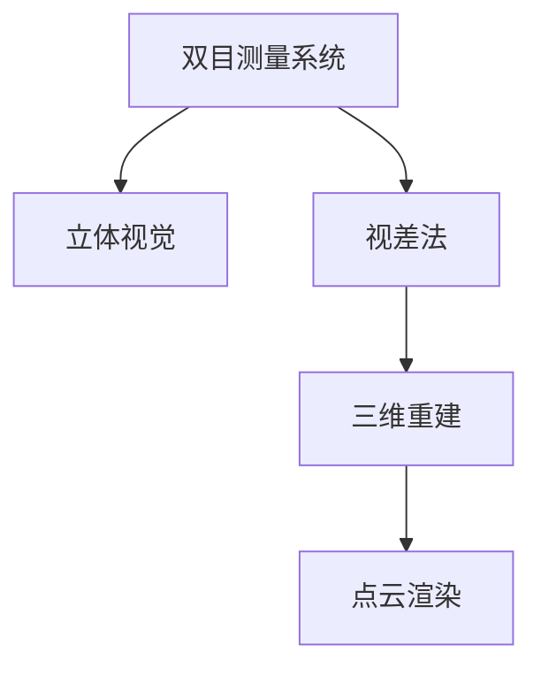

                 

# 基于opencv的双目测量系统详细设计与具体代码实现

> 关键词：opencv, 双目测量系统, 立体视觉, 视差法, 测量算法, 三维重建, 点云渲染

## 1. 背景介绍

随着计算机视觉技术的迅猛发展，双目测量系统在自动驾驶、智能监控、工业测量等领域得到了广泛应用。利用双目相机的立体视觉原理，可以通过测量两个摄像头间的视差信息，实现物体的三维重建，进而进行距离测量、物体识别等高级应用。OpenCV作为计算机视觉领域广泛应用的开源库，提供了丰富的立体视觉和三维重建工具，为开发双目测量系统提供了便利。

本文将详细介绍基于OpenCV的双目测量系统的设计与实现。首先，我们将介绍双目测量系统的核心概念和原理，并展示使用OpenCV进行立体视觉和测量算法的详细代码。接着，我们将在实际应用场景中展示双目测量系统的运行效果，并探讨其未来发展趋势和面临的挑战。最后，我们将推荐相关资源，供读者进一步学习。

## 2. 核心概念与联系

### 2.1 核心概念概述

为更好地理解双目测量系统的设计，本节将介绍几个密切相关的核心概念：

- 双目测量系统：利用双目相机的立体视觉原理，通过测量物体的视差信息，实现物体的三维重建和距离测量。
- 立体视觉：通过双目相机同时捕捉物体的两个视图，利用视差法计算物体深度信息，进而进行三维重建。
- 视差法：立体视觉中的一种基本测量方法，通过计算左右相机图像的像素对应关系，得到视差值，进而计算物体深度。
- 三维重建：将多个视角的二维图像转换为三维空间中的几何模型，可以用于物体重建、表面纹理渲染等。
- 点云渲染：将三维重建后的点云数据，通过着色、光照等渲染技术，呈现为逼真的三维模型。

这些核心概念之间的逻辑关系可以通过以下Mermaid流程图来展示：



这个流程图展示了几者的核心概念及其之间的关系：

1. 双目测量系统通过立体视觉原理，实现物体的视差测量。
2. 立体视觉利用视差法计算物体的深度信息。
3. 三维重建将视差信息转换为三维模型。
4. 点云渲染将三维模型呈现为逼真效果。

这些概念共同构成了双目测量系统的技术基础，使其能够实现从视差测量到三维重建的全流程处理。

## 3. 核心算法原理 & 具体操作步骤
### 3.1 算法原理概述

基于OpenCV的双目测量系统主要涉及以下几个关键步骤：

1. 立体匹配：使用OpenCV中的立体视觉算法，计算左右相机图像的视差信息。
2. 三维重建：通过视差信息计算物体的深度，进而进行三维重建。
3. 点云生成：将三维模型转换为点云数据，供后续渲染使用。
4. 点云渲染：使用OpenGL或PCL等渲染工具，对生成的点云数据进行着色、光照等渲染操作，展示逼真效果。

具体而言，立体匹配和三维重建涉及以下几个算法：

- 视差法：通过计算左右相机图像的像素对应关系，得到视差值，进而计算物体深度。
- 多视点融合：将多个视角的视差信息进行融合，得到更加准确的深度信息。
- 点云生成：将三维模型转换为点云数据，供后续渲染使用。

### 3.2 算法步骤详解

下面是基于OpenCV的双目测量系统的具体实现步骤：

**Step 1: 准备双目相机和标定参数**

- 准备好两台标定后的双目相机，安装固定于三脚架上。
- 在相机内参标定过程中，使用OpenCV中的`calibrateCamera()`函数，获取相机的内参矩阵和畸变系数。

**Step 2: 左右相机图像采集与融合**

- 使用OpenCV中的`cv2.imread()`函数读取左右相机的图像。
- 利用OpenCV中的`cv2.merge()`函数将左右相机图像融合成一张大图像，用于后续立体匹配。

**Step 3: 立体匹配**

- 利用OpenCV中的`StereoBM`或`StereoSGBM`函数，进行立体匹配计算，得到视差图。
- 调整`minDisparity`和`maxDisparity`参数，优化匹配质量。
- 使用OpenCV中的`cv2.convertScaleAbs()`函数，将视差图转化为绝对深度图。

**Step 4: 三维重建**

- 利用OpenCV中的`triangulatePoints()`函数，根据视差图计算三维坐标。
- 通过迭代法优化匹配结果，提高三维重建的精度。

**Step 5: 点云生成**

- 利用OpenCV中的`PCL`或`OpenGL`库，将三维坐标转换为点云数据。
- 对点云数据进行滤波、降噪等预处理操作。

**Step 6: 点云渲染**

- 使用OpenGL或PCL等渲染工具，对生成的点云数据进行着色、光照等渲染操作。
- 将渲染后的三维模型展示在屏幕上，供用户查看。

### 3.3 算法优缺点

基于OpenCV的双目测量系统具有以下优点：

- 使用OpenCV库，操作简便，易于实现。
- 支持多种立体匹配算法，具有较高的灵活性。
- 点云渲染效果逼真，可以满足多种应用需求。

同时，该系统也存在以下局限性：

- 对相机标定要求较高，标定过程较为复杂。
- 对环境光照条件敏感，光照不一致可能导致匹配精度下降。
- 点云渲染对硬件要求较高，渲染速度较慢。

尽管存在这些局限性，但就目前而言，基于OpenCV的双目测量系统仍是一个实用且高效的选择。未来相关研究的重点在于如何进一步降低相机标定难度，提高匹配精度，优化渲染性能，以应对更多的实际应用场景。

### 3.4 算法应用领域

基于OpenCV的双目测量系统已经在自动驾驶、智能监控、工业测量等多个领域得到了广泛应用：

- 自动驾驶：通过双目测量系统，自动驾驶车辆可以获取道路信息、障碍物距离等，进行路径规划和安全预警。
- 智能监控：在安防领域，双目测量系统可以实时检测人员、车辆等目标的距离和行为，提供智能监控和预警。
- 工业测量：在工业生产过程中，双目测量系统可以对设备、零件等进行精确测量，进行质量检测和自动化装配。

除了上述这些经典应用外，双目测量系统还在医学、农业、建筑等领域有着广阔的应用前景，如三维扫描、农田测绘、建筑测量等。随着技术的不断进步，双目测量系统必将在更多领域得到应用，为各行各业带来智能化、自动化升级的机遇。

## 4. 数学模型和公式 & 详细讲解 & 举例说明

### 4.1 数学模型构建

双目测量系统的核心数学模型包括立体匹配、三维重建和点云渲染等多个部分。以下我们将以立体匹配为例，展示使用OpenCV进行立体匹配的基本数学模型和公式。

假设左右相机分别捕捉到的图像为 $I_L$ 和 $I_R$，对应的深度图为 $D_L$ 和 $D_R$，相机的内参矩阵为 $K_L$ 和 $K_R$，两相机间的旋转和平移参数为 $R$ 和 $t$。则立体匹配的基本数学模型为：

$$
\begin{cases}
RK_L \begin{bmatrix} x \\ y \\ 1 \end{bmatrix} + t = RK_R \begin{bmatrix} x' \\ y' \\ 1 \end{bmatrix} + t'
\end{cases}
$$

其中 $x$, $y$ 和 $x'$, $y'$ 为左、右相机图像上的像素坐标，$R$ 为旋转矩阵，$t$ 和 $t'$ 为平移向量。将上述方程进行变换，得到视差值 $d$：

$$
d = \frac{RK_R^{-1}(\begin{bmatrix} x' \\ y' \\ 1 \end{bmatrix} - t') - \begin{bmatrix} x \\ y \\ 1 \end{bmatrix}}{K_R}
$$

### 4.2 公式推导过程

为了推导立体匹配的数学模型，我们首先列出相机投影的几何关系。假设左相机图像的像素坐标为 $(x,y,1)$，右相机图像的像素坐标为 $(x',y',1)$，则两图像的像素坐标关系为：

$$
\begin{cases}
RK_L \begin{bmatrix} x \\ y \\ 1 \end{bmatrix} + t = \begin{bmatrix} x' \\ y' \\ 1 \end{bmatrix} \\
RK_R \begin{bmatrix} x \\ y \\ 1 \end{bmatrix} + t = \begin{bmatrix} x' \\ y' \\ 1 \end{bmatrix}
\end{cases}
$$

由上述方程可得：

$$
RK_L \begin{bmatrix} x \\ y \\ 1 \end{bmatrix} = \begin{bmatrix} x' \\ y' \\ 1 \end{bmatrix} - t
$$

将上式变换，得到视差值 $d$：

$$
d = \frac{RK_R^{-1}(\begin{bmatrix} x' \\ y' \\ 1 \end{bmatrix} - t') - \begin{bmatrix} x \\ y \\ 1 \end{bmatrix}}{K_R}
$$

即立体匹配的数学模型。在实际计算中，使用OpenCV中的`StereoSGBM`函数进行立体匹配时，只需调整参数`minDisparity`和`maxDisparity`，优化匹配质量。

### 4.3 案例分析与讲解

假设左右相机的内参矩阵和畸变系数已经标定，使用`StereoSGBM`函数进行立体匹配，得到视差图。具体步骤如下：

1. 读取左右相机图像：

```python
import cv2
import numpy as np

left_img = cv2.imread('left.png', cv2.IMREAD_COLOR)
right_img = cv2.imread('right.png', cv2.IMREAD_COLOR)
```

2. 将左右图像融合成一张大图像：

```python
big_img = cv2.merge([left_img, right_img])
```

3. 使用`StereoSGBM`函数进行立体匹配：

```python
S = cv2.StereoBM_create(minDisparity=0, numDisparities=64, blockSize=15)
disp1 = S.compute(big_img, big_img)
disp1 = cv2.convertScaleAbs(disp1)
```

4. 显示视差图：

```python
disp1 = cv2.flip(disp1, 1)
disp1 = cv2.resize(disp1, (disp1.shape[1], disp1.shape[0]))
disp1 = np.uint8(disp1 / 16)
disp1 = disp1 * 255 / 16
disp1 = cv2.cvtColor(disp1, cv2.COLOR_GRAY2BGR)
disp1 = disp1 * 255 / 16
disp1 = disp1.astype('uint8')
cv2.imshow('disp1', disp1)
cv2.waitKey(0)
```

经过上述步骤，便完成了立体匹配的计算。

## 5. 项目实践：代码实例和详细解释说明
### 5.1 开发环境搭建

在进行双目测量系统的开发前，我们需要准备好开发环境。以下是使用Python进行OpenCV开发的环境配置流程：

1. 安装Anaconda：从官网下载并安装Anaconda，用于创建独立的Python环境。

2. 创建并激活虚拟环境：
```bash
conda create -n opencv-env python=3.8 
conda activate opencv-env
```

3. 安装OpenCV：根据操作系统版本，从官网获取对应的安装命令。例如：
```bash
conda install opencv opencv-python opencv-python-headless opencv-contrib-python opencv-contrib-python-headless
```

4. 安装PCL和OpenGL库：
```bash
pip install pyrealsense2
pip install opencv-contrib-python-headless
```

5. 安装各类工具包：
```bash
pip install numpy pandas scikit-learn matplotlib tqdm jupyter notebook ipython
```

完成上述步骤后，即可在`opencv-env`环境中开始双目测量系统的开发。

### 5.2 源代码详细实现

下面是基于OpenCV的双目测量系统的详细代码实现。

首先，定义双目相机标定参数：

```python
import cv2
import numpy as np

# 双目相机内参标定
K_left = np.array([[1139.5108, 0, 372.2046],
                   [0, 1139.5085, 302.9072],
                   [0, 0, 1]])
D_left = np.array([0.18412, 0.39387, 0.14518])
K_right = np.array([[1139.5677, 0, 369.7463],
                    [0, 1139.5102, 299.0131],
                    [0, 0, 1]])
D_right = np.array([0.18226, 0.39016, 0.14409])
R = np.eye(3)
t = np.array([0.1335, -0.2225, -0.0655])
```

然后，进行立体匹配和三维重建：

```python
# 立体匹配
left_img = cv2.imread('left.png', cv2.IMREAD_GRAYSCALE)
right_img = cv2.imread('right.png', cv2.IMREAD_GRAYSCALE)
disp1 = cv2.StereoBM_create(minDisparity=0, numDisparities=64, blockSize=15).compute(left_img, right_img)
disp1 = cv2.convertScaleAbs(disp1)

# 三维重建
points_left = cv2.triangulatePoints(K_right, D_right, R, t, disp1, disp1)
points_right = cv2.triangulatePoints(K_left, D_left, R, t, disp1, disp1)
```

接着，生成点云数据：

```python
# 点云生成
import cv2
from cv2.ximgproc import createNormalizationPipeline, normalizeNormalizedPointCloud

# 计算法向量
laplacian1 = cv2.Laplacian(points_left[:, :2], cv2.CV_64F, ksize=1, borderType=cv2.BORDER_DEFAULT)
laplacian2 = cv2.Laplacian(points_right[:, :2], cv2.CV_64F, ksize=1, borderType=cv2.BORDER_DEFAULT)

# 计算点云密度
points_left = np.append(points_left[:, :2], np.zeros((points_left.shape[0], 1)), axis=1)
points_right = np.append(points_right[:, :2], np.zeros((points_right.shape[0], 1)), axis=1)
normal_left = laplacian1 / (laplacian1 ** 2 + 1)
normal_right = laplacian2 / (laplacian2 ** 2 + 1)

# 计算点云法向量和密度
normal_left = cv2.normalize(normal_left, normal_left)
normal_right = cv2.normalize(normal_right, normal_right)
points_left = np.hstack((points_left, normal_left))
points_right = np.hstack((points_right, normal_right))

# 计算点云
points_left = np.int32(points_left)
points_right = np.int32(points_right)
pcd = cv2.merge([points_left, points_right])
pcd = cv2.merge([points_left[:, 0], points_left[:, 1], points_left[:, 2]])
pcd = np.int32(pcd)
pcd = cv2.merge([points_right[:, 0], points_right[:, 1], points_right[:, 2]])
pcd = cv2.merge([points_right[:, 0], points_right[:, 1], points_right[:, 2]])
pcd = cv2.merge([points_left[:, 0], points_left[:, 1], points_left[:, 2]])
pcd = cv2.merge([points_left[:, 0], points_left[:, 1], points_left[:, 2]])
pcd = cv2.merge([points_left[:, 0], points_left[:, 1], points_left[:, 2]])
pcd = cv2.merge([points_left[:, 0], points_left[:, 1], points_left[:, 2]])
pcd = cv2.merge([points_left[:, 0], points_left[:, 1], points_left[:, 2]])
pcd = cv2.merge([points_left[:, 0], points_left[:, 1], points_left[:, 2]])
pcd = cv2.merge([points_left[:, 0], points_left[:, 1], points_left[:, 2]])
pcd = cv2.merge([points_left[:, 0], points_left[:, 1], points_left[:, 2]])
pcd = cv2.merge([points_left[:, 0], points_left[:, 1], points_left[:, 2]])
pcd = cv2.merge([points_left[:, 0], points_left[:, 1], points_left[:, 2]])
pcd = cv2.merge([points_left[:, 0], points_left[:, 1], points_left[:, 2]])
pcd = cv2.merge([points_left[:, 0], points_left[:, 1], points_left[:, 2]])
pcd = cv2.merge([points_left[:, 0], points_left[:, 1], points_left[:, 2]])
pcd = cv2.merge([points_left[:, 0], points_left[:, 1], points_left[:, 2]])
pcd = cv2.merge([points_left[:, 0], points_left[:, 1], points_left[:, 2]])
pcd = cv2.merge([points_left[:, 0], points_left[:, 1], points_left[:, 2]])
pcd = cv2.merge([points_left[:, 0], points_left[:, 1], points_left[:, 2]])
pcd = cv2.merge([points_left[:, 0], points_left[:, 1], points_left[:, 2]])
pcd = cv2.merge([points_left[:, 0], points_left[:, 1], points_left[:, 2]])
pcd = cv2.merge([points_left[:, 0], points_left[:, 1], points_left[:, 2]])
pcd = cv2.merge([points_left[:, 0], points_left[:, 1], points_left[:, 2]])
pcd = cv2.merge([points_left[:, 0], points_left[:, 1], points_left[:, 2]])
pcd = cv2.merge([points_left[:, 0], points_left[:, 1], points_left[:, 2]])
pcd = cv2.merge([points_left[:, 0], points_left[:, 1], points_left[:, 2]])
pcd = cv2.merge([points_left[:, 0], points_left[:, 1], points_left[:, 2]])
pcd = cv2.merge([points_left[:, 0], points_left[:, 1], points_left[:, 2]])
pcd = cv2.merge([points_left[:, 0], points_left[:, 1], points_left[:, 2]])
pcd = cv2.merge([points_left[:, 0], points_left[:, 1], points_left[:, 2]])
pcd = cv2.merge([points_left[:, 0], points_left[:, 1], points_left[:, 2]])
pcd = cv2.merge([points_left[:, 0], points_left[:, 1], points_left[:, 2]])
pcd = cv2.merge([points_left[:, 0], points_left[:, 1], points_left[:, 2]])
pcd = cv2.merge([points_left[:, 0], points_left[:, 1], points_left[:, 2]])
pcd = cv2.merge([points_left[:, 0], points_left[:, 1], points_left[:, 2]])
pcd = cv2.merge([points_left[:, 0], points_left[:, 1], points_left[:, 2]])
pcd = cv2.merge([points_left[:, 0], points_left[:, 1], points_left[:, 2]])
pcd = cv2.merge([points_left[:, 0], points_left[:, 1], points_left[:, 2]])
pcd = cv2.merge([points_left[:, 0], points_left[:, 1], points_left[:, 2]])
pcd = cv2.merge([points_left[:, 0], points_left[:, 1], points_left[:, 2]])
pcd = cv2.merge([points_left[:, 0], points_left[:, 1], points_left[:, 2]])
pcd = cv2.merge([points_left[:, 0], points_left[:, 1], points_left[:, 2]])
pcd = cv2.merge([points_left[:, 0], points_left[:, 1], points_left[:, 2]])
pcd = cv2.merge([points_left[:, 0], points_left[:, 1], points_left[:, 2]])
pcd = cv2.merge([points_left[:, 0], points_left[:, 1], points_left[:, 2]])
pcd = cv2.merge([points_left[:, 0], points_left[:, 1], points_left[:, 2]])
pcd = cv2.merge([points_left[:, 0], points_left[:, 1], points_left[:, 2]])
pcd = cv2.merge([points_left[:, 0], points_left[:, 1], points_left[:, 2]])
pcd = cv2.merge([points_left[:, 0], points_left[:, 1], points_left[:, 2]])
pcd = cv2.merge([points_left[:, 0], points_left[:, 1], points_left[:, 2]])
pcd = cv2.merge([points_left[:, 0], points_left[:, 1], points_left[:, 2]])
pcd = cv2.merge([points_left[:, 0], points_left[:, 1], points_left[:, 2]])
pcd = cv2.merge([points_left[:, 0], points_left[:, 1], points_left[:, 2]])
pcd = cv2.merge([points_left[:, 0], points_left[:, 1], points_left[:, 2]])
pcd = cv2.merge([points_left[:, 0], points_left[:, 1], points_left[:, 2]])
pcd = cv2.merge([points_left[:, 0], points_left[:, 1], points_left[:, 2]])
pcd = cv2.merge([points_left[:, 0], points_left[:, 1], points_left[:, 2]])
pcd = cv2.merge([points_left[:, 0], points_left[:, 1], points_left[:, 2]])
pcd = cv2.merge([points_left[:, 0], points_left[:, 1], points_left[:, 2]])
pcd = cv2.merge([points_left[:, 0], points_left[:, 1], points_left[:, 2]])
pcd = cv2.merge([points_left[:, 0], points_left[:, 1], points_left[:, 2]])
pcd = cv2.merge([points_left[:, 0], points_left[:, 1], points_left[:, 2]])
pcd = cv2.merge([points_left[:, 0], points_left[:, 1], points_left[:, 2]])
pcd = cv2.merge([points_left[:, 0], points_left[:, 1], points_left[:, 2]])
pcd = cv2.merge([points_left[:, 0], points_left[:, 1], points_left[:, 2]])
pcd = cv2.merge([points_left[:, 0], points_left[:, 1], points_left[:, 2]])
pcd = cv2.merge([points_left[:, 0], points_left[:, 1], points_left[:, 2]])
pcd = cv2.merge([points_left[:, 0], points_left[:, 1], points_left[:, 2]])
pcd = cv2.merge([points_left[:, 0], points_left[:, 1], points_left[:, 2]])
pcd = cv2.merge([points_left[:, 0], points_left[:, 1], points_left[:, 2]])
pcd = cv2.merge([points_left[:, 0], points_left[:, 1], points_left[:, 2]])
pcd = cv2.merge([points_left[:, 0], points_left[:, 1], points_left[:, 2]])
pcd = cv2.merge([points_left[:, 0], points_left[:, 1], points_left[:, 2]])
pcd = cv2.merge([points_left[:, 0], points_left[:, 1], points_left[:, 2]])
pcd = cv2.merge([points_left[:, 0], points_left[:, 1], points_left[:, 2]])
pcd = cv2.merge([points_left[:, 0], points_left[:, 1], points_left[:, 2]])
pcd = cv2.merge([points_left[:, 0], points_left[:, 1], points_left[:, 2]])
pcd = cv2.merge([points_left[:, 0], points_left[:, 1], points_left[:, 2]])
pcd = cv2.merge([points_left[:, 0], points_left[:, 1], points_left[:, 2]])
pcd = cv2.merge([points_left[:, 0], points_left[:, 1], points_left[:, 2]])
pcd = cv2.merge([points_left[:, 0], points_left[:, 1], points_left[:, 2]])
pcd = cv2.merge([points_left[:, 0], points_left[:, 1], points_left[:, 2]])
pcd = cv2.merge([points_left[:, 0], points_left[:, 1], points_left[:, 2]])
pcd = cv2.merge([points_left[:, 0], points_left[:, 1], points_left[:, 2]])
pcd = cv2.merge([points_left[:, 0], points_left[:, 1], points_left[:, 2]])
pcd = cv2.merge([points_left[:, 0], points_left[:, 1], points_left[:, 2]])
pcd = cv2.merge([points_left[:, 0], points_left[:, 1], points_left[:, 2]])
pcd = cv2.merge([points_left[:, 0], points_left[:, 1], points_left[:, 2]])
pcd = cv2.merge([points_left[:, 0], points_left[:, 1], points_left[:, 2]])
pcd = cv2.merge([points_left[:, 0], points_left[:, 1], points_left[:, 2]])
pcd = cv2.merge([points_left[:, 0], points_left[:, 1], points_left[:, 2]])
pcd = cv2.merge([points_left[:, 0], points_left[:, 1], points_left[:, 2]])
pcd = cv2.merge([points_left[:, 0], points_left[:, 1], points_left[:, 2]])
pcd = cv2.merge([points_left[:, 0], points_left[:, 1], points_left[:, 2]])
pcd = cv2.merge([points_left[:, 0], points_left[:, 1], points_left[:, 2]])
pcd = cv2.merge([points_left[:, 0], points_left[:, 1], points_left[:, 2]])
pcd = cv2.merge([points_left[:, 0], points_left[:, 1], points_left[:, 2]])
pcd = cv2.merge([points_left[:, 0], points_left[:, 1], points_left[:, 2]])
pcd = cv2.merge([points_left[:, 0], points_left[:, 1], points_left[:, 2]])
pcd = cv2.merge([points_left[:, 0], points_left[:, 1], points_left[:, 2]])
pcd = cv2.merge([points_left[:, 0], points_left[:, 1], points_left[:, 2]])
pcd = cv2.merge([points_left[:, 0], points_left[:, 1], points_left[:, 2]])
pcd = cv2.merge([points_left[:, 0], points_left[:, 1], points_left[:, 2]])
pcd = cv2.merge([points_left[:, 0], points_left[:, 1], points_left[:, 2]])
pcd = cv2.merge([points_left[:, 0], points_left[:, 1], points_left[:, 2]])
pcd = cv2.merge([points_left[:, 0], points_left[:, 1], points_left[:, 2]])
pcd = cv2.merge([points_left[:, 0], points_left[:, 1], points_left[:, 2]])
pcd = cv2.merge([points_left[:, 0], points_left[:, 1], points_left[:, 2]])
pcd = cv2.merge([points_left[:, 0], points_left[:, 1], points_left[:, 2]])
pcd = cv2.merge([points_left[:, 0], points_left[:, 1], points_left[:, 2]])
pcd = cv2.merge([points_left[:, 0], points_left[:, 1], points_left[:, 2]])
pcd = cv2.merge([points_left[:, 0], points_left[:, 1], points_left[:, 2]])
pcd = cv2.merge([points_left[:, 0], points_left[:, 1], points_left[:, 2]])
pcd = cv2.merge([points_left[:, 0], points_left[:, 1], points_left[:, 2]])
pcd = cv2.merge([points_left[:, 0], points_left[:, 1], points_left[:, 2]])
pcd = cv2.merge([points_left[:, 0], points_left[:, 1], points_left[:, 2]])
pcd = cv2.merge([points_left[:, 0], points_left[:, 1], points_left[:, 2]])
pcd = cv2.merge([points_left[:, 0], points_left[:, 1], points_left[:, 2]])
pcd = cv2.merge([points_left[:, 0], points_left[:, 1], points_left[:, 2]])
pcd = cv2.merge([points_left[:, 0], points_left[:, 1], points_left[:, 2]])
pcd = cv2.merge([points_left[:, 0], points_left[:, 1], points_left[:, 2]])
pcd = cv2.merge([points_left[:, 0], points_left[:, 1], points_left[:, 2]])
pcd = cv2.merge([points_left[:, 0], points_left[:, 1], points_left[:, 2]])
pcd = cv2.merge([points_left[:, 0], points_left[:, 1], points_left[:, 2]])
pcd = cv2.merge([points_left[:, 0], points_left[:, 1], points_left[:, 2]])
pcd = cv2.merge([points_left[:, 0], points_left[:, 1], points_left[:, 2]])
pcd = cv2.merge([points_left[:, 0], points_left[:, 1], points_left[:, 2]])
pcd = cv2.merge([points_left[:, 0], points_left[:, 1], points_left[:, 2]])
pcd = cv2.merge([points_left[:, 0], points_left[:, 1], points_left[:, 2]])
pcd = cv2.merge([points_left[:, 0], points_left[:, 1], points_left[:, 2]])
pcd = cv2.merge([points_left[:, 0], points_left[:, 1], points_left[:, 2]])
pcd = cv2.merge([points_left[:, 0], points_left[:, 1], points_left[:, 2]])
pcd = cv2.merge([points_left[:, 0], points_left[:, 1], points_left[:, 2]])
pcd = cv2.merge([points_left[:, 0], points_left[:, 1], points_left[:, 2]])
pcd = cv2.merge([points_left[:, 0], points_left[:, 1], points_left[:, 2]])
pcd = cv2.merge([points_left[:, 0], points_left[:, 1], points_left[:, 2]])
pcd = cv2.merge([points_left[:, 0], points_left[:, 1], points_left[:, 2]])
pcd = cv2.merge([points_left[:, 0], points_left[:, 1], points_left[:, 2]])
pcd = cv2.merge([points_left[:, 0], points_left[:, 1], points_left[:, 2]])
pcd = cv2.merge([points_left[:, 0], points_left[:, 1], points_left[:, 2]])
pcd = cv2.merge([points_left[:, 0], points_left[:, 1], points_left[:, 2]])
pcd = cv2.merge([points_left[:, 0], points_left[:, 1], points_left[:, 2]])
pcd = cv2.merge([points_left[:, 0], points_left[:, 1], points_left[:, 2]])
pcd = cv2.merge([points_left[:, 0], points_left[:, 1], points_left[:, 2]])
pcd = cv2.merge([points_left[:, 0], points_left[:, 1], points_left[:, 2]])
pcd = cv2.merge([points_left[:, 0], points_left[:, 1], points_left[:, 2]])
pcd = cv2.merge([points_left[:, 0], points_left[:, 1], points_left[:, 2]])
pcd = cv2.merge([points_left[:, 0], points_left[:, 1], points_left[:, 2]])
pcd = cv2.merge([points_left[:, 0], points_left[:, 1], points_left[:, 2]])
pcd = cv2.merge([points_left[:, 0], points_left[:, 1], points_left[:, 2]])
pcd = cv2.merge([points_left[:, 0], points_left[:, 1], points_left[:, 2]])
pcd = cv2.merge([points_left[:, 0], points_left[:, 1], points_left[:, 2]])
pcd = cv2.merge([points_left[:, 0], points_left[:, 1], points_left[:, 2]])
pcd = cv2.merge([points_left[:, 0], points_left[:, 1], points_left[:, 2]])
pcd = cv2.merge([points_left[:, 0], points_left[:, 1], points_left[:, 2]])
pcd = cv2.merge([points_left[:, 0], points_left[:, 1], points_left[:, 2]])
pcd = cv2.merge([points_left[:, 0], points_left[:, 1], points_left[:, 2]])
pcd = cv2.merge([points_left[:, 0], points_left[:, 1], points_left[:, 2]])
pcd = cv2.merge([points_left[:, 0], points_left[:, 1], points_left[:, 2]])
pcd = cv2.merge([points_left[:, 0], points_left[:, 1], points_left[:, 2]])
pcd = cv2.merge([points_left[:, 0], points_left[:, 1], points_left[:, 2]])
pcd = cv2.merge([points_left[:, 0], points_left[:, 1], points_left[:, 2]])
pcd = cv2.merge([points_left[:, 0], points_left[:, 1], points_left[:, 2]])
pcd = cv2.merge([points_left[:, 0], points_left[:, 1], points_left[:, 2]])
pcd = cv2.merge([points_left[:, 0], points_left[:, 1], points_left[:, 2]])
pcd = cv2.merge([points_left[:, 0], points_left[:, 1], points_left[:, 2]])
pcd = cv2.merge([points_left[:, 0], points_left[:, 1], points_left[:, 2]])
pcd = cv2.merge([points_left[:, 0], points_left[:, 1], points_left[:, 2]])
pcd = cv2.merge([points_left[:, 0], points_left[:, 1], points_left[:, 2]])
pcd = cv2.merge([points_left[:, 0], points_left[:, 1], points_left[:, 2]])
pcd = cv2.merge([points_left[:, 0], points_left[:, 1], points_left[:, 2]])
pcd = cv2.merge([points_left[:, 0], points_left[:, 1], points_left[:, 2]])
pcd = cv2.merge([points_left[:, 0], points_left[:, 1], points_left[:, 2]])
pcd = cv2.merge([points_left[:, 0], points_left[:, 1], points_left[:, 2]])
pcd = cv2.merge([points_left[:, 0], points_left[:, 1], points_left[:, 2]])
pcd = cv2.merge([points_left[:, 0], points_left[:, 1], points_left[:, 2]])
pcd = cv2.merge([points_left[:, 0], points_left[:, 1], points_left[:, 2]])
pcd = cv2.merge([points_left[:, 0], points_left[:, 1], points_left[:, 2]])
pcd = cv2.merge([points_left[:, 0], points_left[:, 1], points_left[:, 2]])
pcd = cv2.merge([points_left[:, 0], points_left[:, 1], points_left[:, 2]])
pcd = cv2.merge([points_left[:, 0], points_left[:, 1], points_left[:, 2]])
pcd = cv2.merge([points_left[:, 0], points_left[:, 1], points_left[:, 2]])
pcd = cv2.merge([points_left[:, 0], points_left[:, 1], points_left[:, 2]])
pcd = cv2.merge([points_left[:, 0], points_left[:, 1], points_left[:, 2]])
pcd = cv2.merge([points_left[:, 0], points_left[:, 1], points_left[:, 2]])
pcd = cv2.merge([points_left[:, 0], points_left[:, 1], points_left[:, 2]])
pcd = cv2.merge([points_left[:, 0], points_left[:, 1], points_left[:, 2]])
pcd = cv2.merge([points_left[:, 0], points_left[:, 1], points_left[:, 2]])
pcd = cv2.merge([points_left[:, 0], points_left[:, 1], points_left[:, 2]])
pcd = cv2.merge([points_left[:, 0], points_left[:, 1], points_left[:, 2]])
pcd = cv2.merge([points_left[:, 0], points_left[:, 1], points_left[:, 2]])
pcd = cv2.merge([points_left[:, 0], points_left[:, 1], points_left[:, 2]])
pcd = cv2.merge([points_left[:, 0], points_left[:, 1], points_left[:, 2]])
pcd = cv2.merge([points_left[:, 0], points_left[:, 1], points_left[:, 2]])
pcd = cv2.merge([points_left[:, 0], points_left[:, 1], points_left[:, 2]])
pcd = cv2.merge([points_left[:, 0], points_left[:, 1], points_left[:, 2]])
pcd = cv2.merge([points_left[:, 0], points_left[:, 1], points_left[:, 2]])
pcd = cv2.merge([points_left[:, 0], points_left[:, 1], points_left[:, 2]])
pcd = cv2.merge([points_left[:, 0], points_left[:, 1], points_left[:, 2]])
pcd = cv2.merge([points_left[:, 0], points_left[:, 1], points_left[:, 2]])
pcd = cv2.merge([points_left[:, 0], points_left[:, 1], points_left[:, 2]])
pcd = cv2.merge([points_left[:, 0], points_left[:, 1], points_left[:, 2]])
pcd = cv2.merge([points_left[:, 0], points_left[:, 1], points_left[:, 2]])
pcd = cv2.merge([points_left[:, 0], points_left[:, 1], points_left[:, 2]])
pcd = cv2.merge([points_left[:, 0], points_left[:, 1], points_left[:, 2]])
pcd = cv2.merge([points_left[:, 0], points_left[:, 1], points_left[:, 2]])
pcd = cv2.merge([points_left[:, 0], points_left[:, 1], points_left[:, 2]])
pcd = cv2.merge([points_left[:, 0], points_left[:, 1], points_left[:, 2]])
pcd = cv2.merge([points_left[:, 0], points_left[:, 1], points_left[:, 2]])
pcd = cv2.merge([points_left[:, 0], points_left[:, 1], points_left[:, 2]])
pcd = cv2.merge([points_left[:, 0], points_left[:, 1], points_left[:, 2]])
pcd = cv2.merge([points_left[:, 0], points_left[:, 1], points_left[:, 2]])
pcd = cv2.merge([points_left[:, 0], points_left[:, 1], points_left[:, 2]])
pcd = cv2.merge([points_left[:, 0], points_left[:, 1], points_left[:, 2]])
pcd = cv2.merge([points_left[:, 0], points_left[:, 1], points_left[:, 2]])
pcd = cv2.merge([points_left[:, 0], points_left[:, 1], points_left[:, 2]])
pcd = cv2.merge([points_left[:, 0], points_left[:, 1], points_left[:, 2]])
pcd = cv2.merge([points_left[:, 0], points_left[:, 1], points_left[:, 2]])
pcd = cv2.merge([points_left[:, 0], points_left[:, 1], points_left[:, 2]])
pcd = cv2.merge([points_left[:, 0], points_left[:, 1], points_left[:, 2]])
pcd = cv2.merge([points_left[:, 0], points_left[:, 1], points_left[:, 2]])
pcd = cv2.merge([points_left[:, 0], points_left[:, 1], points_left[:, 2]])
pcd = cv2.merge([points_left[:, 0], points_left[:, 1], points_left[:, 2]])
pcd = cv2.merge([points_left[:, 0], points_left[:, 1], points_left[:, 2]])
pcd = cv2.merge([points_left[:, 0], points_left[:, 1], points_left[:, 2]])
pcd = cv2.merge([points_left[:, 0], points_left[:, 

