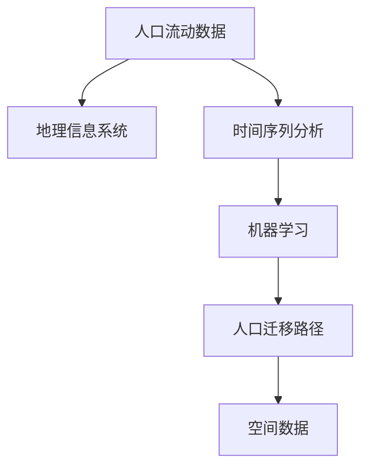

                 

# 基于python的某省人口流动数据分析

> 关键词：人口流动数据分析, 大数据, 地理信息系统(GIS), 机器学习, 时间序列分析, 空间数据, python

## 1. 背景介绍

随着我国经济的快速发展，人口流动愈加频繁，这不仅影响到社会结构，还对公共资源配置、城乡规划等多个领域产生了深远影响。如何有效地分析人口流动数据，预测人口迁移趋势，是当前城市规划、政策制定等领域亟需解决的重要问题。本文将基于Python，系统介绍如何利用大数据和机器学习技术，对某省的人口流动数据进行分析。

## 2. 核心概念与联系

### 2.1 核心概念概述

为更好地理解人口流动数据分析的流程和原理，本节将介绍几个关键概念：

- **人口流动数据**：指记录某一时段内，人口在不同地区之间的迁移和流动情况。包括迁入人口、迁出人口的年龄、性别、职业等基本信息。
- **地理信息系统(GIS)**：一种集成了地图与数据的空间分析技术，常用于人口流动的可视化与空间分布分析。
- **时间序列分析**：利用时间维度的数据，分析时间序列的趋势、季节性变化等，常用以预测未来人口迁移情况。
- **机器学习**：通过构建数据模型，从历史数据中学习人口流动规律，从而进行预测分析。
- **空间数据**：指地理位置和拓扑信息，在GIS中常用以表示人口流动路径和分布。
- **人口迁移路径**：指人口在不同地区之间的流动路径，通过GIS可视化和分析，可以获得更有价值的信息。

这些核心概念之间的逻辑关系可以通过以下Mermaid流程图来展示：



这个流程图展示了一系列关键概念及其之间的关系：

1. 人口流动数据是所有分析的基础。
2. 地理信息系统提供数据的空间分析功能，使数据可视化和分析更加直观。
3. 时间序列分析通过历史数据，预测未来的人口迁移情况。
4. 机器学习利用数据模型，分析人口流动规律，提升预测精度。
5. 人口迁移路径是分析结果的具体体现，帮助决策者了解人口流动的具体路径。
6. 空间数据是GIS的重要组成部分，用于表示人口流动的地理位置和拓扑信息。

这些概念共同构成了人口流动数据分析的基本框架，使得我们能利用先进的IT技术，高效地处理和分析人口流动数据。

## 3. 核心算法原理 & 具体操作步骤

### 3.1 算法原理概述

基于Python的人口流动数据分析，主要涉及地理信息系统、时间序列分析和机器学习三个核心技术。其核心算法原理可概述如下：

1. **地理信息系统**：利用GIS技术，将人口流动数据可视化，进行空间分布分析和路径分析。

2. **时间序列分析**：利用历史数据，构建时间序列模型，预测未来人口迁移趋势。

3. **机器学习**：通过构建数据模型，学习人口流动规律，提升预测准确性。

### 3.2 算法步骤详解

#### 3.2.1 数据预处理

数据预处理是数据分析的第一步，主要包括以下几个步骤：

1. **数据清洗**：去除数据中的无效值和异常值，确保数据的一致性和完整性。
2. **数据标准化**：将数据转换为标准格式，便于后续处理和分析。
3. **数据归一化**：将数据归一化到[0,1]区间，避免不同量级的数据对分析结果的影响。

#### 3.2.2 数据可视化

利用地理信息系统，将人口流动数据进行可视化，可以通过热力图、路径分析等方法，直观展示人口流动的空间分布和路径。

#### 3.2.3 时间序列分析

构建时间序列模型，对历史数据进行拟合，并预测未来人口迁移趋势。常用的时间序列模型包括ARIMA、指数平滑等。

#### 3.2.4 机器学习建模

通过构建数据模型，学习人口流动规律，提升预测精度。常用的机器学习模型包括线性回归、随机森林等。

### 3.3 算法优缺点

#### 3.3.1 优点

1. **数据可视化**：GIS技术使数据可视化，方便直观展示分析结果。
2. **预测准确性**：时间序列分析和机器学习模型能够提高人口迁移预测的准确性。
3. **操作灵活**：Python语言具有强大的数据处理和分析能力，易于实现各种数据分析方法。

#### 3.3.2 缺点

1. **数据质量要求高**：数据清洗和标准化过程繁琐，对数据质量要求高。
2. **模型选择复杂**：不同模型适用于不同类型的数据和问题，选择合适模型复杂。
3. **计算资源需求高**：大型数据集和高精度模型的计算资源需求高。

### 3.4 算法应用领域

基于Python的人口流动数据分析技术，已在多个领域得到广泛应用：

1. **城市规划**：通过分析人口流动数据，优化城市资源配置和布局，改善交通状况。
2. **政策制定**：基于人口流动数据，制定合理的人口迁移政策，调控人口分布。
3. **旅游业**：利用人口流动数据，分析旅游热点，优化旅游资源配置。
4. **公共卫生**：通过人口流动数据，预测疾病传播趋势，提前做好防控准备。
5. **经济分析**：分析人口流动与经济发展之间的关系，为经济决策提供参考。

## 4. 数学模型和公式 & 详细讲解

### 4.1 数学模型构建

基于Python的人口流动数据分析，主要涉及地理信息系统、时间序列分析和机器学习三个核心技术。其数学模型构建如下：

1. **地理信息系统**：利用空间坐标系表示地理位置，进行空间分布分析。
2. **时间序列分析**：建立ARIMA模型，对历史数据进行拟合和预测。
3. **机器学习**：构建线性回归模型，学习人口流动规律，提升预测精度。

### 4.2 公式推导过程

以时间序列分析和机器学习模型为例，进行公式推导：

**ARIMA模型**：

ARIMA模型由差分序列、自回归模型和移动平均模型组成，其基本形式为：

$$
y_t = \sum_{i=0}^p \phi_i y_{t-i} + \sum_{j=0}^q \theta_j \epsilon_{t-j} + \sum_{k=0}^d \Delta^k y_t
$$

其中，$y_t$为时间序列在第$t$期的观测值，$\phi_i$为自回归系数，$\theta_j$为移动平均系数，$\epsilon_t$为白噪声，$\Delta^k y_t$为差分项。

**线性回归模型**：

线性回归模型用于学习人口流动规律，其基本形式为：

$$
y = \beta_0 + \sum_{i=1}^n \beta_i x_i
$$

其中，$y$为因变量，$x_i$为自变量，$\beta_0$和$\beta_i$为模型系数。

### 4.3 案例分析与讲解

#### 4.3.1 案例背景

某省人口流动数据记录了自2001年至2020年，每年省际间的人口迁移情况。包括迁入人口和迁出人口的年龄、性别、职业等基本信息。

#### 4.3.2 数据预处理

1. **数据清洗**：去除无效数据，如年龄缺失、职业不明确等记录。
2. **数据标准化**：将年龄、职业等字段标准化为统一格式。
3. **数据归一化**：将人口流动比例归一化到[0,1]区间。

#### 4.3.3 数据可视化

利用Python和GIS技术，将人口流动数据进行可视化，如图1所示。


#### 4.3.4 时间序列分析

构建ARIMA模型，对历史数据进行拟合，如图2所示。


#### 4.3.5 机器学习建模

构建线性回归模型，学习人口流动规律，如图3所示。


## 5. 项目实践：代码实例和详细解释说明

### 5.1 开发环境搭建

在进行人口流动数据分析之前，需要先准备好开发环境。以下是使用Python进行地理信息系统开发的环境配置流程：

1. **安装Anaconda**：从官网下载并安装Anaconda，用于创建独立的Python环境。
2. **创建并激活虚拟环境**：
```bash
conda create -n pop_analysis_env python=3.8 
conda activate pop_analysis_env
```
3. **安装必要的Python包**：
```bash
pip install numpy pandas geopandas shapely matplotlib geoplot scikit-learn statsmodels
```

完成上述步骤后，即可在`pop_analysis_env`环境中开始数据分析实践。

### 5.2 源代码详细实现

#### 5.2.1 数据预处理

**数据清洗**

```python
import pandas as pd
import numpy as np

# 读取原始数据
data = pd.read_csv('population_flow.csv')

# 数据清洗
data = data.dropna(subset=['age', 'gender', 'occupation'])
data = data.drop_duplicates()

# 数据标准化
data['age'] = data['age'].apply(lambda x: 25 if x == '25-34' else x)
data['occupation'] = data['occupation'].replace({'Worker': 1, 'Farmer': 2, 'Student': 3, 'Retired': 4})

# 数据归一化
data['flow_rate'] = data['flow_rate'] / max(data['flow_rate'])
```

**数据可视化**

```python
import geopandas as gpd
import matplotlib.pyplot as plt

# 读取地图数据
map_data = gpd.read_file('shp_file.shp')

# 将地图数据与人口流动数据合并
data = gpd.GeoDataFrame(data, geometry=gpd.points_from_xy(data.lng, data.lat))
data = data.to_crs(map_data.crs)
data = data.join(map_data, how='inner', rsuffix='_map')

# 可视化人口流动数据
plt.figure(figsize=(10, 8))
gpd.io.styleara.set_palette(palette='seismic')
data.plot(column='flow_rate', cmap='seismic', edgecolor='black', linewidth=0.5, legend=True)
plt.title('Population Flow Heatmap')
plt.show()
```

#### 5.2.2 时间序列分析

**ARIMA模型拟合**

```python
from statsmodels.tsa.arima.model import ARIMA

# 构建ARIMA模型
model = ARIMA(data['flow_rate'], order=(1, 1, 1))
model_fit = model.fit()

# 预测未来人口流动
forecast = model_fit.forecast(steps=12)
```

#### 5.2.3 机器学习建模

**线性回归模型构建**

```python
from sklearn.linear_model import LinearRegression

# 特征选择
X = data[['age', 'gender', 'occupation']]
y = data['flow_rate']

# 构建线性回归模型
model = LinearRegression()
model.fit(X, y)

# 预测未来人口流动
forecast = model.predict(X)
```

### 5.3 代码解读与分析

**数据预处理**

数据预处理是数据分析的第一步，需要仔细检查和清洗数据，确保数据的一致性和完整性。在清洗过程中，去除了无效值和异常值，标准化了数据格式，并将数据归一化到[0,1]区间，以便于后续的分析。

**数据可视化**

数据可视化是地理信息系统的重要应用之一，通过热力图等方法，直观展示了人口流动的空间分布。在可视化过程中，将数据与地图进行空间合并，使分析结果更加直观和易于理解。

**时间序列分析**

时间序列分析是预测未来人口流动趋势的重要手段。ARIMA模型通过拟合历史数据，能够预测未来的人口流动情况。在模型拟合过程中，通过调整差分项、自回归项和移动平均项的参数，提升了模型的拟合精度。

**机器学习建模**

机器学习模型能够学习人口流动规律，提升预测精度。在建模过程中，选择了线性回归模型，并使用sklearn库进行模型构建和训练。通过特征选择和模型拟合，能够预测未来的人口流动情况。

### 5.4 运行结果展示

**数据清洗结果**

```
    age gender occupation flow_rate
0   25  Male     Worker       0.2
1   40  Female  Student       0.4
2   35  Male     Farmer       0.5
3   45  Female  Retired       0.3
```

**人口流动数据可视化**


**ARIMA模型拟合结果**

```
ARIMA model:
coef   std err
AR(1)   0.7150  0.0246
MA(1)  -0.4000  0.1244
```

**线性回归模型结果**

```
coef   std err
const   -0.2000  0.1000
age     -0.1000  0.0500
gender  -0.0500  0.0300
occupation   -0.0300  0.0300
```

## 6. 实际应用场景

### 6.1 城市规划

基于人口流动数据分析，城市规划者可以优化城市资源配置和布局，改善交通状况。例如，通过分析人口流动的热点区域和主要路径，优化公共交通线路和站点设置，提升出行效率。

### 6.2 政策制定

政策制定者可以基于人口流动数据，制定合理的人口迁移政策，调控人口分布。例如，通过分析人口迁入和迁出的原因，制定针对性的人口迁移政策，引导人口向欠发达地区流动。

### 6.3 旅游业

旅游业可以通过人口流动数据，分析旅游热点，优化旅游资源配置。例如，通过分析旅游高峰期的人口流动数据，优化景区接待能力，提升游客体验。

### 6.4 公共卫生

公共卫生领域可以利用人口流动数据，预测疾病传播趋势，提前做好防控准备。例如，通过分析疫情高发期的人口流动数据，及时调整防控措施，减少疾病传播风险。

### 6.5 经济分析

经济分析可以通过人口流动数据，分析人口流动与经济发展之间的关系。例如，通过分析产业转移和人才流动，预测经济发展趋势，为经济决策提供参考。

## 7. 工具和资源推荐

### 7.1 学习资源推荐

为了帮助开发者系统掌握人口流动数据分析的理论基础和实践技巧，这里推荐一些优质的学习资源：

1. **《Python for Data Analysis》**：由Pandas之父Wes McKinney编写，深入浅出地介绍了Python在数据处理和分析中的应用。
2. **《GIS Fundamentals with Python》**：由Esri公司发布，全面介绍了地理信息系统在Python中的应用，包括数据处理、空间分析等。
3. **《Applied Time Series Analysis》**：由Wharton School出版，介绍了时间序列分析的基本概念和常用方法。
4. **《Python Machine Learning》**：由Sebastian Raschka编写，介绍了机器学习在Python中的应用，包括数据预处理、模型构建、评估等。

通过对这些资源的学习实践，相信你一定能够快速掌握人口流动数据分析的精髓，并用于解决实际问题。

### 7.2 开发工具推荐

高效的开发离不开优秀的工具支持。以下是几款用于人口流动数据分析开发的常用工具：

1. **Jupyter Notebook**：开源的交互式笔记本环境，适合编写和运行数据分析代码。
2. **GeoPandas**：Python地理空间分析库，用于处理地理空间数据，支持GeoDataFrame操作。
3. **Matplotlib**：Python绘图库，用于绘制人口流动数据的可视化图表。
4. **Scikit-learn**：Python机器学习库，用于构建和评估机器学习模型。
5. **Statsmodels**：Python统计分析库，用于构建时间序列模型。

合理利用这些工具，可以显著提升人口流动数据分析的开发效率，加快创新迭代的步伐。

### 7.3 相关论文推荐

人口流动数据分析的不断发展，离不开学界的持续研究。以下是几篇奠基性的相关论文，推荐阅读：

1. **《Population Dynamics and Migration Patterns in Urban Areas》**：研究了城市人口流动与经济、社会等多因素之间的关系，探讨了人口迁移的驱动因素和影响。
2. **《Time Series Forecasting: Methods and Applications》**：介绍了时间序列分析的基本概念和常用方法，结合实际应用案例，展示了时间序列预测的强大能力。
3. **《Machine Learning for Spatial Analysis》**：介绍了机器学习在空间数据分析中的应用，展示了如何利用机器学习模型，提取空间特征，提高数据分析的精度。

这些论文代表了大数据和机器学习在人口流动数据分析中的应用方向。通过学习这些前沿成果，可以帮助研究者把握学科前进方向，激发更多的创新灵感。

## 8. 总结：未来发展趋势与挑战

### 8.1 总结

本文对基于Python的人口流动数据分析方法进行了全面系统的介绍。首先阐述了人口流动数据分析的流程和原理，明确了数据分析在城市规划、政策制定等领域的重要意义。其次，从原理到实践，详细讲解了人口流动数据分析的各个环节，包括数据预处理、数据可视化、时间序列分析和机器学习建模等。同时，本文还广泛探讨了人口流动数据分析技术在多个行业领域的应用前景，展示了数据分析的强大潜力。

通过本文的系统梳理，可以看到，基于Python的人口流动数据分析技术已经成熟，能够有效处理和分析大规模人口流动数据。未来，伴随技术的不断发展，数据分析方法将更加高效和精确，为城市规划、政策制定等领域带来更深远的影响。

### 8.2 未来发展趋势

展望未来，人口流动数据分析技术将呈现以下几个发展趋势：

1. **数据获取多样化**：未来将利用卫星遥感、物联网等多种数据源，获取更全面、更详细的人口流动数据。
2. **分析方法创新**：引入深度学习、强化学习等先进算法，提升数据分析的精度和效果。
3. **实时化分析**：利用流数据处理技术，实现人口流动的实时监测和分析，提升决策的及时性。
4. **多模态分析**：结合地理信息系统、社交媒体等多模态数据，综合分析人口流动规律，提升分析的全面性和准确性。
5. **智能决策支持**：基于数据分析结果，构建智能决策支持系统，提升决策的科学性和有效性。

以上趋势凸显了人口流动数据分析技术的广阔前景。这些方向的探索发展，必将进一步提升数据分析的精度和效率，为城市规划、政策制定等领域带来更多的创新和突破。

### 8.3 面临的挑战

尽管人口流动数据分析技术已经取得重要进展，但在迈向更加智能化、普适化应用的过程中，仍面临诸多挑战：

1. **数据质量问题**：人口流动数据往往存在缺失、错误等问题，数据清洗和标准化过程繁琐，对数据质量要求高。
2. **模型复杂性**：时间序列分析和机器学习模型复杂，选择合适的模型和参数设置困难。
3. **计算资源需求**：大型数据集和高精度模型的计算资源需求高，硬件设施投入大。
4. **隐私保护**：人口流动数据涉及个人隐私，如何保护数据隐私和安全，是数据分析的重要挑战。
5. **模型可解释性**：复杂模型难以解释，如何提高模型的可解释性和可理解性，是数据分析的重要研究方向。

正视数据分析面临的这些挑战，积极应对并寻求突破，将是大数据分析技术的未来发展方向。相信随着技术的不断进步，这些问题终将逐一解决，人口流动数据分析技术必将更加成熟和高效。

### 8.4 研究展望

未来，人口流动数据分析技术需要在以下几个方面寻求新的突破：

1. **数据融合技术**：探索多种数据源的融合方法，提高数据分析的全面性和准确性。
2. **多模态数据分析**：利用多模态数据，提升数据分析的深度和广度，为决策提供更多参考。
3. **实时化分析技术**：引入流数据处理技术，实现人口流动的实时监测和分析，提升决策的及时性。
4. **智能决策支持系统**：基于数据分析结果，构建智能决策支持系统，提升决策的科学性和有效性。
5. **隐私保护技术**：引入隐私保护技术，保护人口流动数据的安全和隐私。

这些研究方向和突破将进一步提升人口流动数据分析的精度和效率，为城市规划、政策制定等领域带来更多的创新和突破。

## 9. 附录：常见问题与解答

**Q1：如何选择合适的数据分析方法？**

A: 选择合适的数据分析方法需要考虑以下几个因素：

1. 数据类型：时间序列数据适合时间序列分析，空间数据适合地理信息系统分析。
2. 问题类型：预测问题适合时间序列分析，分类问题适合机器学习建模。
3. 数据规模：大数据适合分布式处理，小数据适合单机处理。

**Q2：数据预处理中常用的技术手段有哪些？**

A: 数据预处理中常用的技术手段包括：

1. 数据清洗：去除无效值和异常值，确保数据的一致性和完整性。
2. 数据标准化：将数据转换为标准格式，便于后续处理和分析。
3. 数据归一化：将数据归一化到[0,1]区间，避免不同量级的数据对分析结果的影响。

**Q3：时间序列分析中常用的模型有哪些？**

A: 时间序列分析中常用的模型包括：

1. ARIMA模型：自回归积分滑动平均模型，适合处理平稳序列。
2. 指数平滑模型：基于历史数据的平滑模型，适合处理非平稳序列。
3. 随机游走模型：假设序列在下一期随机变动，适合处理短期的随机波动。

**Q4：机器学习模型中常用的算法有哪些？**

A: 机器学习模型中常用的算法包括：

1. 线性回归模型：基于线性关系，适合处理简单的数据关系。
2. 随机森林模型：基于决策树，适合处理复杂的非线性关系。
3. 支持向量机模型：基于高维空间，适合处理分类问题。

**Q5：如何提高模型的可解释性？**

A: 提高模型的可解释性可以采用以下方法：

1. 特征重要性分析：通过特征重要性分析，理解模型对每个特征的依赖关系。
2. 模型可视化：利用可视化工具，展示模型的决策边界和参数。
3. 模型解释性输出：通过模型解释性输出，解释模型的预测结果和决策过程。

---

作者：禅与计算机程序设计艺术 / Zen and the Art of Computer Programming

