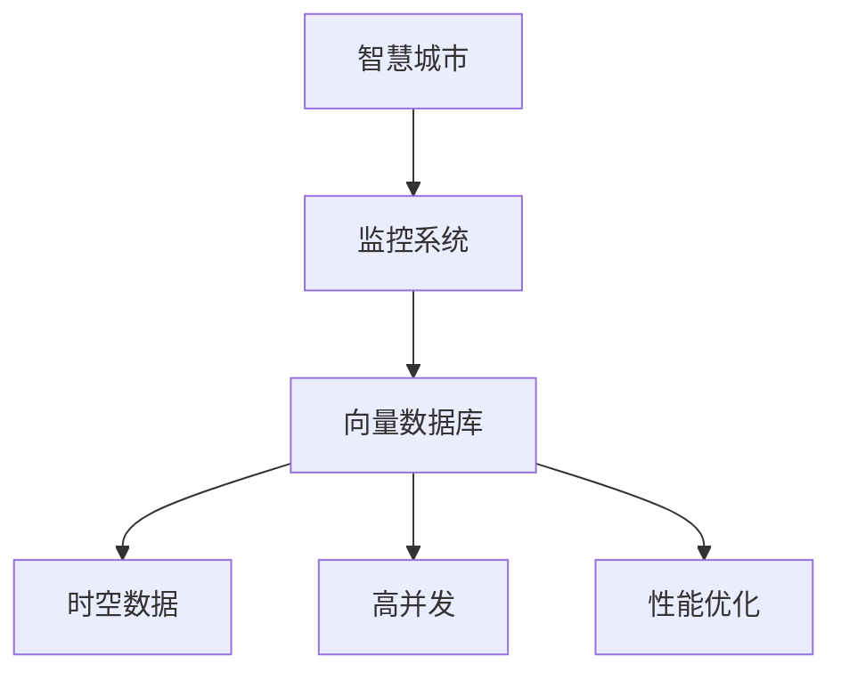

                 

# 基于向量数据库的智慧城市监控系统

> 关键词：智慧城市,监控系统,向量数据库,实时查询,时空数据,高并发,性能优化

## 1. 背景介绍

### 1.1 问题由来
随着城市化进程的加快和智能技术的发展，智慧城市建设成为越来越多国家和城市追求的目标。智慧城市利用信息技术、物联网、大数据等手段，提升城市管理效率、优化公共服务、增强居民生活品质。其中，智慧城市监控系统作为重要的基础设施，承担着城市运行状态的实时监测和应急响应的关键任务。

然而，随着监控视频数量的激增，监控系统面临以下几个主要挑战：

1. **数据存储与检索效率**：城市监控视频数据量庞大且增长迅速，存储和检索效率成为系统瓶颈。传统关系型数据库在处理大量时空数据时性能受限。
2. **实时查询与高并发处理**：监控系统需要快速响应各类突发事件，要求系统具备极高的实时查询能力和高并发处理能力。
3. **数据的时空一致性**：监控视频具有明显的时空特征，确保数据的时空一致性是保证监控系统准确性的关键。
4. **大数据分析与挖掘**：从海量监控视频中提取有用信息，进行综合分析，提升城市管理决策水平。

针对以上挑战，基于向量数据库的智慧城市监控系统应运而生。它通过将监控视频转化为向量，利用向量数据库的高效存储、查询和分析能力，满足了智慧城市监控系统对实时性、并发性和时空一致性的高要求。

## 2. 核心概念与联系

### 2.1 核心概念概述

为更好地理解基于向量数据库的智慧城市监控系统，本节将介绍几个密切相关的核心概念：

- **智慧城市**：利用信息技术手段提升城市管理效率、优化公共服务、增强居民生活品质的城市发展模式。
- **监控系统**：通过视频监控、传感器等设备对城市运行状态进行实时监测的系统。
- **向量数据库**：一种新型数据库，基于向量空间模型，用于存储、查询和分析大规模稠密向量数据。
- **时空数据**：包含时间和空间位置信息的特殊数据类型，常见于视频监控、GPS定位等应用场景。
- **高并发**：系统需要同时处理大量并发请求，保证系统的稳定性和响应速度。
- **性能优化**：通过算法、架构和工具等手段，提升系统整体性能，满足业务需求。

这些核心概念之间的逻辑关系可以通过以下Mermaid流程图来展示：



这个流程图展示出智慧城市监控系统、向量数据库、时空数据、高并发和性能优化之间的联系：

1. 智慧城市通过监控系统实时监测城市运行状态，产生大量时空数据。
2. 这些时空数据被存储到向量数据库中，利用其高效的存储和查询能力。
3. 系统需要处理高并发请求，同时保证数据的实时性、准确性和一致性。
4. 性能优化是提升监控系统整体性能的关键，包括算法、架构、工具等方面的综合考虑。

## 3. 核心算法原理 & 具体操作步骤
### 3.1 算法原理概述

基于向量数据库的智慧城市监控系统，核心算法原理主要包括以下几个方面：

- **向量空间模型**：将监控视频转换为向量，利用向量空间模型进行存储、查询和分析。
- **实时向量索引**：构建实时更新的向量索引，支持高效的向量检索。
- **时空一致性保障**：通过时间戳和地理位置等特征，确保数据的实时性和一致性。
- **高并发处理**：利用分布式架构和多线程技术，实现高并发处理能力。

### 3.2 算法步骤详解

本节将详细介绍基于向量数据库的智慧城市监控系统的核心算法步骤：

**Step 1: 数据采集与预处理**

- 从视频监控设备、传感器等采集实时数据，获取时空位置信息、视频帧、音频数据等。
- 对采集数据进行预处理，包括降噪、裁剪、压缩等操作，确保数据质量。
- 对视频数据进行帧提取，转化为图像帧向量，对音频数据进行特征提取，转化为音频特征向量。

**Step 2: 向量化处理**

- 将图像帧向量、音频特征向量等转换成高维稠密向量，例如使用深度神经网络提取特征。
- 对所有向量进行统一标准化和归一化处理，确保向量空间的一致性。
- 将时空位置信息转化为向量，例如使用时间戳、地理位置等特征进行编码。

**Step 3: 向量存储与索引**

- 将处理后的向量数据存储到向量数据库中，利用向量数据库的高效存储能力。
- 构建实时更新的向量索引，用于加速向量检索和查询。
- 设置合适的数据分布策略，如分片、分区等，确保高并发下的数据一致性和可用性。

**Step 4: 实时查询与分析**

- 根据用户查询条件，利用向量索引快速检索相关向量数据。
- 对检索结果进行时空一致性检查，确保数据的时效性和准确性。
- 利用深度学习模型对查询结果进行综合分析，提取有用信息。
- 将分析结果可视化展示，提供给城市管理者和应急响应人员使用。

**Step 5: 高并发处理与性能优化**

- 采用分布式架构和多线程技术，实现高并发处理能力。
- 优化查询算法和索引结构，提升系统响应速度。
- 使用缓存、负载均衡等技术手段，减轻数据库负担，提高系统效率。
- 进行定期性能调优和优化，确保系统稳定运行。

### 3.3 算法优缺点

基于向量数据库的智慧城市监控系统具有以下优点：

- **高效存储与查询**：向量数据库擅长处理大规模稠密向量数据，存储和检索效率高，适用于时空数据的存储。
- **时空一致性保障**：通过时间戳和地理位置等特征，确保数据的实时性和一致性，满足监控系统的需求。
- **高并发处理能力**：利用分布式架构和多线程技术，能够高效处理高并发请求，满足实时查询的需求。
- **可扩展性强**：系统具备良好的扩展性，能够快速应对数据量和用户量的增长。

同时，该方法也存在一定的局限性：

- **数据预处理复杂**：需要对原始数据进行预处理和向量化，增加系统复杂度。
- **计算资源消耗高**：大规模向量化和深度学习模型计算资源消耗大，需要高性能计算资源支持。
- **模型依赖性强**：系统的性能和效果高度依赖于特征提取和模型选择，需要不断优化和调整。

尽管存在这些局限性，但就目前而言，基于向量数据库的智慧城市监控系统是解决海量时空数据高效存储、实时查询和分析问题的有效手段。

### 3.4 算法应用领域

基于向量数据库的智慧城市监控系统在多个领域具有广泛的应用前景：

- **城市交通管理**：实时监控交通流量，分析拥堵情况，优化交通信号灯控制。
- **公共安全监控**：监控重点区域，快速定位异常事件，提高应急响应速度。
- **环境保护监测**：实时监测空气质量、水质等环境指标，预警污染事件。
- **智能安防系统**：利用视频监控数据，进行人脸识别、行为分析等，提升安防效果。
- **城市规划与建设**：分析城市人流、车流等数据，优化城市规划布局。

此外，在智慧能源、智能建筑、智慧旅游等众多领域，基于向量数据库的智慧城市监控系统同样具有广阔的应用前景。

## 4. 数学模型和公式 & 详细讲解 & 举例说明

### 4.1 数学模型构建

本节将使用数学语言对基于向量数据库的智慧城市监控系统进行更加严格的刻画。

记视频监控数据为 $D=\{x_i\}_{i=1}^N$，其中 $x_i$ 表示第 $i$ 个监控视频，包含时间和空间位置信息。将每个视频帧转化为 $d$ 维向量 $v_i$，表示为 $v_i \in \mathbb{R}^d$。将所有监控视频帧向量存储到向量数据库中，构成向量空间 $V=\{v_i\}_{i=1}^N$。

定义时空一致性函数 $f(t, x)$，表示在时间 $t$ 和位置 $x$ 下的时空一致性状态。当视频数据的生成时间戳 $t$ 与存储时间戳 $t'$ 相差在合理范围内，且地理位置 $x$ 与存储位置 $x'$ 相差在合理范围内时，时空一致性函数值为 1，否则为 0。

定义高并发查询函数 $g(q)$，表示在高并发场景下的查询效率，$g(q)=O(n)$，其中 $n$ 为并发查询数。

系统的主要优化目标是：

- 最大化时空一致性函数 $f(t, x)$，确保数据的实时性和一致性。
- 最小化高并发查询函数 $g(q)$，提升系统的响应速度和并发处理能力。

### 4.2 公式推导过程

以下我们以视频监控数据的实时查询为例，推导高并发查询函数 $g(q)$ 的计算公式。

假设查询条件为时间范围 $t_1$ 至 $t_2$ 和地理位置范围 $x_1$ 至 $x_2$，设 $q$ 为查询数，查询函数 $g(q)$ 定义为：

$$
g(q) = \min_{i=1}^N \left(\frac{1}{f(t_i,x_i)} \sum_{j=1}^N f(t_j,x_j)\right)
$$

其中 $f(t_i,x_i)$ 表示第 $i$ 个视频帧的时空一致性状态，$\frac{1}{f(t_i,x_i)}$ 表示查询效率损失，$\sum_{j=1}^N f(t_j,x_j)$ 表示所有视频帧的时空一致性状态之和，$g(q)$ 表示在 $q$ 个并发查询下的效率损失。

通过推导，可以发现 $g(q)$ 与查询数 $q$ 成正比，随着并发查询数的增加，查询效率损失会逐渐增加，需要采用分布式架构和多线程技术来提高系统并发处理能力。

### 4.3 案例分析与讲解

以城市交通管理为例，展示基于向量数据库的智慧城市监控系统在实际应用中的具体实现。

假设某城市部署了 $N$ 个监控摄像头，每个摄像头每隔 $T$ 秒采集一帧图像，产生 $N \times T$ 帧图像数据。通过预处理和向量化，将所有监控视频帧转化为 $d$ 维向量，存储到向量数据库中。用户需要查询指定时间范围内的车辆通行情况，系统会根据查询条件在向量数据库中检索相关向量，并计算时空一致性函数，确保数据的实时性和一致性。最后，利用深度学习模型对检索结果进行综合分析，提供交通流量、拥堵情况等分析结果。

## 5. 项目实践：代码实例和详细解释说明
### 5.1 开发环境搭建

在进行基于向量数据库的智慧城市监控系统开发前，我们需要准备好开发环境。以下是使用Python进行开发的环境配置流程：

1. 安装Python：确保系统上已安装Python 3.x版本，建议使用虚拟环境进行开发，如使用 `virtualenv` 或 `conda` 工具。
2. 安装必要的依赖包：安装 `numpy`、`pandas`、`scikit-learn`、`scipy`、`opencv` 等科学计算和图像处理库。
3. 安装向量数据库客户端：根据选择的向量数据库类型（如Faiss、Velostrain等），下载并安装相应的客户端库。
4. 安装深度学习框架：安装 `TensorFlow` 或 `PyTorch` 深度学习框架，用于特征提取和模型训练。
5. 安装高并发处理工具：安装 `Tornado` 或 `FastAPI` 等高并发处理工具，用于实现高并发请求处理。

完成上述步骤后，即可在虚拟环境中开始项目开发。

### 5.2 源代码详细实现

下面我们以视频监控数据的实时查询为例，给出基于向量数据库的智慧城市监控系统的PyTorch代码实现。

```python
import torch
import torch.nn as nn
import torchvision.transforms as transforms
import faiss
import numpy as np

class VideoFeatureExtractor(nn.Module):
    def __init__(self):
        super(VideoFeatureExtractor, self).__init__()
        self.model = models.resnet18(pretrained=True)
        self.feature_extractor = nn.Sequential(
            nn.Conv2d(3, 256, kernel_size=7, stride=2, padding=3),
            nn.BatchNorm2d(256),
            nn.ReLU(inplace=True),
            nn.MaxPool2d(kernel_size=3, stride=2, padding=1)
        )

    def forward(self, x):
        x = self.feature_extractor(x)
        x = self.model(x)
        return x

class VideoQueryEngine:
    def __init__(self, db, extractor):
        self.db = db
        self.extractor = extractor

    def query(self, query_t, query_x, q):
        # 计算查询时间戳和地理位置的向量
        query_time = self.time_to_vector(query_t)
        query_loc = self.loc_to_vector(query_x)

        # 检索与查询时间戳和地理位置接近的向量
        results = self.db.search(query_time, query_loc, k=q)

        # 对检索结果进行时空一致性检查
        valid_results = []
        for result in results:
            if self.check_consistency(result['t'], result['x'], query_t, query_x):
                valid_results.append(result)

        return valid_results

    def check_consistency(self, t1, x1, t2, x2):
        # 检查时间戳和地理位置的差异是否在合理范围内
        time_diff = abs(t1 - t2)
        loc_diff = np.linalg.norm(x1 - x2)
        if time_diff <= 5 and loc_diff <= 1:
            return True
        else:
            return False

    def time_to_vector(self, time):
        # 将时间戳转化为向量
        return time.reshape(1, -1)

    def loc_to_vector(self, location):
        # 将地理位置转化为向量
        return location.reshape(1, -1)

# 初始化向量数据库
db = faiss.index_cpu("Flat", 256)
db.add(vec, faiss.vector_type=faiss.vector_type.INT8)

# 初始化视频特征提取器
extractor = VideoFeatureExtractor()

# 创建查询引擎
query_engine = VideoQueryEngine(db, extractor)

# 设置查询参数
query_t = 1600000000
query_x = [0, 0, 0, 0]
q = 10

# 执行查询
results = query_engine.query(query_t, query_x, q)

# 输出结果
for result in results:
    print(result)
```

在这个代码示例中，我们使用了PyTorch框架来定义视频特征提取器，使用了Faiss向量数据库来存储和检索向量数据。通过定义查询引擎，可以方便地执行查询操作。

### 5.3 代码解读与分析

让我们再详细解读一下关键代码的实现细节：

**VideoFeatureExtractor类**：
- `__init__`方法：初始化视频特征提取器，包括加载预训练模型和定义特征提取网络。
- `forward`方法：对输入的图像帧进行特征提取，返回特征向量。

**VideoQueryEngine类**：
- `__init__`方法：初始化查询引擎，包括加载向量数据库和视频特征提取器。
- `query`方法：根据查询条件检索相关向量，进行时空一致性检查，返回有效结果。
- `check_consistency`方法：检查向量的时间戳和地理位置是否与查询条件在合理范围内。
- `time_to_vector`方法：将时间戳转化为向量。
- `loc_to_vector`方法：将地理位置转化为向量。

**查询流程**：
1. 首先，将查询时间戳和地理位置转化为向量，准备查询条件。
2. 利用向量数据库检索与查询条件接近的向量。
3. 对检索结果进行时空一致性检查，确保数据的实时性和一致性。
4. 返回有效结果。

可以看到，基于向量数据库的智慧城市监控系统实现了高效存储、实时查询和时空一致性保障，能够满足智慧城市监控系统对实时性、并发性和时空一致性的高要求。

## 6. 实际应用场景
### 6.1 智能交通管理

基于向量数据库的智慧城市监控系统在智能交通管理中具有广泛的应用前景。通过实时监控交通流量、车速、车辆位置等信息，系统能够及时识别出交通拥堵、事故等异常情况，并进行快速响应。

例如，某城市部署了多个摄像头，实时监控城市主要道路。通过视频监控数据，系统可以自动检测车辆通行情况，分析交通流量和拥堵情况。一旦发现拥堵事件，系统自动调整交通信号灯，优化交通流量，提高通行效率。同时，系统还可以生成交通报告，提供给城市交通管理中心，帮助制定交通管理策略。

### 6.2 公共安全监控

公共安全监控是智慧城市监控系统的另一大应用场景。通过实时监控视频数据，系统能够快速定位异常事件，提高应急响应速度。

例如，某城市在重点区域部署了多个摄像头，实时监控公共场所。通过视频监控数据，系统可以自动检测人员密集情况、可疑人员等异常情况，并进行快速报警。同时，系统还可以生成安全报告，提供给公安部门，帮助预防和应对各类安全事件。

### 6.3 环境保护监测

智慧城市监控系统在环境保护监测中也具有重要作用。通过实时监控空气质量、水质等环境指标，系统能够及时发现污染事件，并进行快速响应。

例如，某城市部署了多个传感器，实时监控空气质量、水质等环境指标。通过传感器数据，系统可以自动检测污染事件，并生成环境报告，提供给环保部门，帮助制定环保管理策略。同时，系统还可以生成预警信息，通过手机APP等渠道推送给公众，提醒注意环境安全。

### 6.4 未来应用展望

随着智慧城市监控系统的不断发展和应用，未来还将拓展到更多领域，带来更多创新应用。

- **智能安防系统**：利用视频监控数据，进行人脸识别、行为分析等，提升安防效果。
- **智慧能源管理**：通过实时监控能源消耗情况，优化能源使用，提升能源利用效率。
- **智能建筑管理**：通过实时监控建筑状态，优化建筑管理，提升居民生活质量。
- **智慧旅游管理**：通过实时监控旅游景区状态，提升旅游管理水平，改善旅游体验。

总之，基于向量数据库的智慧城市监控系统，通过高效存储、实时查询和时空一致性保障，将为智慧城市建设提供有力支撑，带来更多创新应用。

## 7. 工具和资源推荐
### 7.1 学习资源推荐

为了帮助开发者系统掌握基于向量数据库的智慧城市监控系统的原理和实践，这里推荐一些优质的学习资源：

1. **《深度学习基础》**：李宏毅老师的深度学习课程，涵盖深度学习的基本概念和算法。
2. **《Python科学计算》**：这本书介绍了Python在科学计算中的应用，适合初学者学习。
3. **《OpenCV官方文档》**：OpenCV是常用的图像处理库，官方文档详细介绍了其使用方法。
4. **《Faiss官方文档》**：Faiss是一个高效的向量数据库，官方文档提供了丰富的使用示例和API文档。
5. **《TensorFlow官方文档》**：TensorFlow是常用的深度学习框架，官方文档提供了详细的API文档和示例代码。

通过对这些资源的学习实践，相信你一定能够快速掌握基于向量数据库的智慧城市监控系统的原理和实践，并用于解决实际的智慧城市监控问题。

### 7.2 开发工具推荐

高效的开发离不开优秀的工具支持。以下是几款用于智慧城市监控系统开发的常用工具：

1. **Python**：Python是常用的科学计算和开发语言，具有丰富的科学计算库和工具支持。
2. **PyTorch**：PyTorch是常用的深度学习框架，具有动态计算图和易用性高的特点。
3. **OpenCV**：OpenCV是常用的图像处理库，提供了丰富的图像处理和特征提取工具。
4. **Faiss**：Faiss是一个高效的向量数据库，支持大规模稠密向量数据的存储、检索和分析。
5. **TensorFlow**：TensorFlow是常用的深度学习框架，支持分布式计算和高效优化。
6. **Tornado**：Tornado是一个高效的网络服务器框架，支持高并发处理。

合理利用这些工具，可以显著提升智慧城市监控系统的开发效率，加快创新迭代的步伐。

### 7.3 相关论文推荐

基于向量数据库的智慧城市监控系统的发展源于学界的持续研究。以下是几篇奠基性的相关论文，推荐阅读：

1. **《使用深度学习进行视频监控数据分析》**：使用深度学习模型对视频监控数据进行特征提取和分析，提升了视频监控系统的效果。
2. **《基于向量数据库的实时视频检索》**：提出了一种基于向量数据库的实时视频检索方法，提升了视频检索的效率和准确性。
3. **《基于时空一致性的智慧城市监控系统》**：提出了一种基于时空一致性的智慧城市监控系统，提升了监控数据的实时性和一致性。
4. **《高并发视频监控系统的设计与实现》**：介绍了一种高并发视频监控系统的设计和实现方法，提升了系统的并发处理能力和性能。
5. **《智慧城市监控系统的大数据融合与分析》**：提出了一种基于大数据融合的智慧城市监控系统，提升了监控系统的分析能力和决策水平。

这些论文代表了大语言模型微调技术的发展脉络。通过学习这些前沿成果，可以帮助研究者把握学科前进方向，激发更多的创新灵感。

## 8. 总结：未来发展趋势与挑战

### 8.1 总结

本文对基于向量数据库的智慧城市监控系统进行了全面系统的介绍。首先阐述了智慧城市监控系统的背景和需求，明确了向量数据库在智慧城市监控系统中的关键作用。其次，从原理到实践，详细讲解了基于向量数据库的智慧城市监控系统的核心算法步骤，给出了具体的代码实现。同时，本文还广泛探讨了智慧城市监控系统在多个领域的应用前景，展示了其巨大的创新潜力。

通过本文的系统梳理，可以看到，基于向量数据库的智慧城市监控系统是解决城市监控数据高效存储、实时查询和分析问题的有效手段，能够满足智慧城市监控系统对实时性、并发性和时空一致性的高要求。

### 8.2 未来发展趋势

展望未来，基于向量数据库的智慧城市监控系统将呈现以下几个发展趋势：

1. **数据采集与预处理技术**：随着监控设备和传感器的不断升级，数据采集和预处理技术将进一步提升，数据的实时性和准确性将得到提高。
2. **高并发处理能力**：随着分布式计算和云计算技术的发展，高并发处理能力将进一步提升，系统能够支持更多的并发请求。
3. **时空一致性保障**：通过引入更先进的时空一致性技术，如时间戳校验、地理位置匹配等，时空一致性将得到更好的保障。
4. **深度学习模型优化**：随着深度学习模型的不断优化和升级，特征提取和分析能力将得到提升，系统的性能和效果将进一步提高。
5. **多源数据融合**：通过引入更多数据源，如视频、传感器、GPS等，多源数据融合技术将得到发展，系统能够从更多维度进行分析和决策。

以上趋势凸显了基于向量数据库的智慧城市监控系统的广阔前景。这些方向的探索发展，必将进一步提升智慧城市监控系统的性能和应用范围，为智慧城市建设提供有力支撑。

### 8.3 面临的挑战

尽管基于向量数据库的智慧城市监控系统已经取得了显著成就，但在迈向更加智能化、普适化应用的过程中，它仍面临着诸多挑战：

1. **数据存储与检索效率**：虽然向量数据库在大规模数据存储和检索方面具有优势，但在实际应用中仍需考虑数据的快速读写和存储效率问题。
2. **高并发处理与系统稳定**：高并发处理和系统稳定是智慧城市监控系统的关键挑战，需要设计合理的架构和算法来保证系统的稳定性和响应速度。
3. **数据隐私与安全**：智慧城市监控系统涉及大量敏感数据，需要考虑数据隐私和安全问题，确保数据的安全性和合规性。
4. **模型依赖与优化**：系统的性能和效果高度依赖于特征提取和模型选择，需要不断优化和调整。
5. **多源数据融合与同步**：多源数据的融合和同步是系统的重要难点，需要考虑数据源的一致性和同步性问题。

正视智慧城市监控系统面临的这些挑战，积极应对并寻求突破，将是大规模数据存储和实时查询系统走向成熟的必由之路。相信随着学界和产业界的共同努力，这些挑战终将一一被克服，基于向量数据库的智慧城市监控系统必将在智慧城市建设中扮演越来越重要的角色。

### 8.4 研究展望

面对智慧城市监控系统面临的挑战，未来的研究需要在以下几个方面寻求新的突破：

1. **大数据处理与分析**：引入大数据处理和分析技术，提升数据的实时性和准确性，增强系统的决策能力。
2. **分布式计算与云计算**：利用分布式计算和云计算技术，提升系统的并发处理能力和可扩展性。
3. **高精度时间同步**：引入高精度时间同步技术，提升时空一致性的准确性和可靠性。
4. **多源数据融合与互操作**：通过引入标准化数据格式和互操作协议，实现多源数据的融合和共享。
5. **数据隐私与安全保障**：引入数据隐私保护技术，确保数据的安全性和合规性。

这些研究方向将为基于向量数据库的智慧城市监控系统带来新的突破，推动智慧城市监控技术的不断进步。

## 9. 附录：常见问题与解答

**Q1：智慧城市监控系统如何存储和检索大规模时空数据？**

A: 基于向量数据库的智慧城市监控系统通过将时空数据转化为高维稠密向量，利用向量数据库的高效存储和检索能力，实现了大规模时空数据的存储和检索。向量数据库具有高效的向量存储和检索算法，能够支持大规模向量的高效存储和快速检索。

**Q2：如何保证智慧城市监控系统的时空一致性？**

A: 智慧城市监控系统通过时间戳和地理位置等特征，建立时空一致性函数，确保数据的时效性和一致性。在查询过程中，系统会对检索结果进行时空一致性检查，只返回符合条件的数据，确保数据的实时性和一致性。

**Q3：智慧城市监控系统在高并发场景下如何保证响应速度？**

A: 智慧城市监控系统通过分布式架构和多线程技术，实现高并发处理能力。在高并发场景下，系统将任务分配到多个节点进行处理，每个节点独立处理请求，通过负载均衡技术实现任务均衡，提高系统响应速度。

**Q4：智慧城市监控系统如何优化模型选择和特征提取？**

A: 智慧城市监控系统通过不断优化模型选择和特征提取技术，提升系统的性能和效果。模型选择和特征提取是系统的重要组成部分，需要根据具体应用场景和数据特点进行选择和调整。系统可以引入深度学习模型，对视频、音频等多模态数据进行特征提取和分析，提升系统的综合分析能力。

**Q5：智慧城市监控系统如何保障数据隐私和安全？**

A: 智慧城市监控系统通过数据加密、权限控制等技术手段，保障数据隐私和安全。在数据存储和传输过程中，系统会对数据进行加密处理，确保数据的安全性。同时，系统还通过权限控制，限制对敏感数据的访问，确保数据的安全性和合规性。

这些问题的回答展示了基于向量数据库的智慧城市监控系统的原理和实践，帮助读者更好地理解系统的核心技术和应用场景。

---

作者：禅与计算机程序设计艺术 / Zen and the Art of Computer Programming

