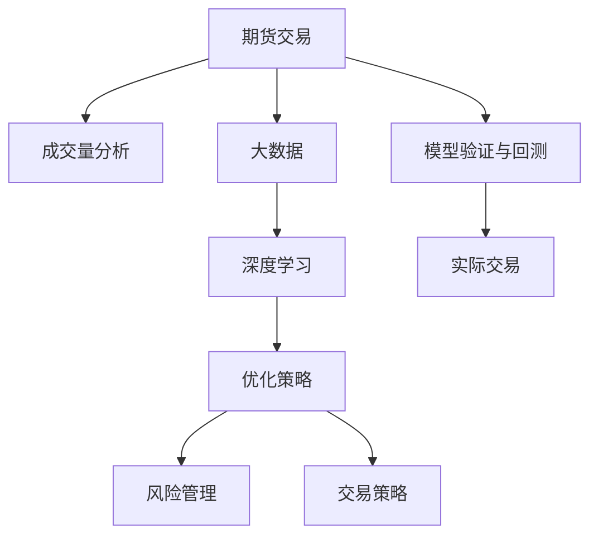
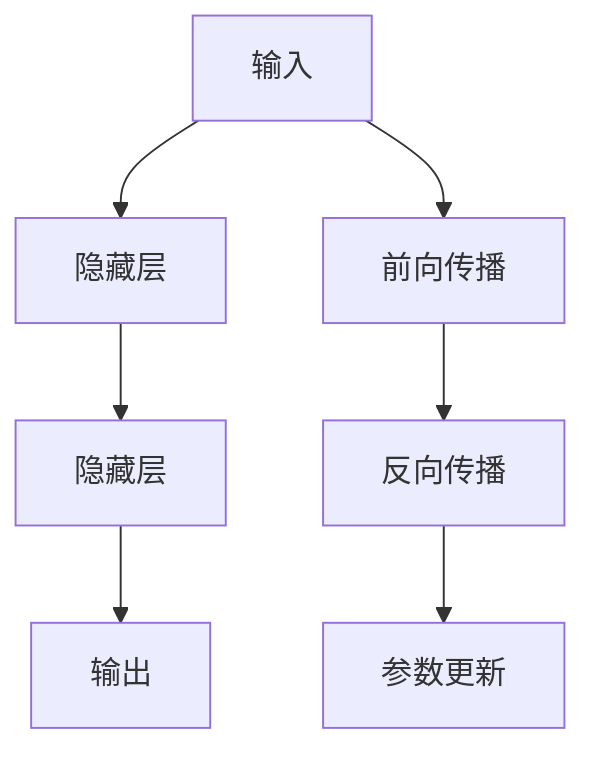

                 

# 基于期货大数据的成交量优化分析研究

> 关键词：期货交易, 成交量分析, 大数据, 优化策略, 风险管理, 交易策略, 深度学习

## 1. 背景介绍

### 1.1 问题由来
期货交易作为一种高风险、高收益的投资方式，吸引了众多投资者的关注。然而，期货市场的波动性和不确定性，使得投资者难以仅凭个人经验进行投资决策。因此，基于大数据分析进行成交量优化分析，成为投资者提高交易胜算的关键。

近年来，随着云计算和数据存储技术的飞速发展，期货市场的数据量呈现出爆炸性增长。如何有效利用这些大数据，发掘其中的有价值信息，成为学术界和业界共同关注的问题。

### 1.2 问题核心关键点
本研究的核心问题在于如何通过分析期货市场的大数据，特别是成交量数据，优化交易策略，提升投资收益并降低风险。

具体包括以下几个关键点：
1. 收集和预处理期货市场的大数据。
2. 通过数据分析技术，挖掘成交量与价格波动之间的关系。
3. 设计并优化成交量优化策略，以提升交易效率和收益。
4. 结合机器学习和大数据技术，构建基于成交量的投资决策模型。
5. 进行模型验证和回测，评估模型在实际交易中的表现。

## 2. 核心概念与联系

### 2.1 核心概念概述

为更好地理解基于大数据的成交量优化分析，本节将介绍几个密切相关的核心概念：

- 期货交易(Hedging & Trading): 投资者利用期货市场进行风险对冲或投机活动，通过买入或卖出期货合约，在价格波动中获得收益。

- 成交量(Volume): 在一定时间内，市场参与者成交的合约数量。成交量是衡量市场活跃度和价格波动的一个重要指标。

- 大数据(Big Data): 指规模巨大、复杂多样、快速变化的数据集合。期货交易数据通常具有高频率、高维度、海量规模等特点。

- 深度学习(Deep Learning): 通过多层神经网络模型，从大量数据中自动学习特征，进行复杂的模式识别和预测。

- 优化策略(Optimization Strategy): 基于数据分析结果，设计出的提升交易效率、降低风险的投资策略。

- 风险管理(Risk Management): 通过分析市场风险，制定相应的风险控制措施，减少投资损失。

- 交易策略(Trading Strategy): 投资决策的指导方针，通常包括买入、卖出、持有等操作规则。

这些核心概念之间的逻辑关系可以通过以下Mermaid流程图来展示：



这个流程图展示了大数据与期货交易的关系，以及成交量分析、深度学习、优化策略、风险管理、交易策略、模型验证与回测等概念之间的逻辑联系。

## 3. 核心算法原理 & 具体操作步骤
### 3.1 算法原理概述

基于大数据的成交量优化分析，本质上是利用统计学和大数据技术，从海量的交易数据中挖掘成交量的规律，并结合深度学习模型，预测市场走势，优化交易策略的过程。

具体来说，包括以下几个步骤：

1. 数据收集：从期货交易所或第三方数据提供商获取历史交易数据。
2. 数据预处理：清洗和标准化数据，移除噪声和异常值。
3. 特征提取：从成交量和市场价格等数据中，提取有意义的特征。
4. 模型训练：使用深度学习模型（如LSTM、CNN等），训练成交量和市场价格之间的关系。
5. 策略设计：根据模型预测结果，设计成交量优化策略。
6. 回测与验证：通过历史数据验证策略的有效性，并进行风险评估。

### 3.2 算法步骤详解

以下详细介绍基于大数据的成交量优化分析的具体步骤：

**Step 1: 数据收集**

从期货交易所或第三方数据提供商获取历史交易数据。数据通常包括成交价格、成交量、市场事件等。

**Step 2: 数据预处理**

清洗和标准化数据，移除噪声和异常值。具体方法包括：

- 去除缺失值和重复值。
- 归一化价格和成交量数据。
- 进行时间序列平稳化处理。

**Step 3: 特征提取**

从成交量和市场价格等数据中，提取有意义的特征。常用的特征包括：

- 成交量：每天的成交量、每分钟的成交量等。
- 价格波动：价格变化率、价格波动幅度等。
- 市场事件：重大政策变化、经济数据发布等。

**Step 4: 模型训练**

使用深度学习模型，训练成交量和市场价格之间的关系。常用模型包括：

- LSTM：用于处理时间序列数据，捕捉价格波动和成交量之间的长期依赖关系。
- CNN：用于提取价格和成交量数据的局部特征，进行短期价格预测。
- RNN：用于处理时间序列数据，捕捉价格波动和成交量之间的长期依赖关系。

**Step 5: 策略设计**

根据模型预测结果，设计成交量优化策略。常用的策略包括：

- 趋势跟踪策略：买入或卖出与价格趋势相同的合约。
- 成交量突破策略：当成交量突破某一阈值时，进行买入或卖出操作。
- 信号优化策略：结合多个模型的预测结果，优化交易信号。

**Step 6: 回测与验证**

通过历史数据验证策略的有效性，并进行风险评估。具体步骤包括：

- 使用回测工具（如Python中的backtrader库）进行模拟交易。
- 评估策略的盈利能力、回撤率、夏普比率等指标。
- 进行风险评估，计算最大回撤、VaR（Value at Risk）等指标。

### 3.3 算法优缺点

基于大数据的成交量优化分析方法具有以下优点：

1. 高效性：利用大数据技术，可以快速处理和分析大量交易数据，发现市场规律。
2. 准确性：结合深度学习模型，可以准确预测市场价格走势，优化交易策略。
3. 灵活性：可以根据市场变化，动态调整交易策略。
4. 稳定性：通过历史数据验证策略的有效性，降低投资风险。

同时，该方法也存在一定的局限性：

1. 数据质量：数据质量和完整性对模型效果有很大影响，数据缺失或噪声可能会影响模型的准确性。
2. 模型复杂性：深度学习模型参数较多，训练复杂度高。
3. 计算资源：大数据分析需要大量的计算资源，对硬件设备要求较高。
4. 策略复杂性：优化策略设计复杂，需要综合考虑多个因素，增加了策略实现的难度。

尽管存在这些局限性，但就目前而言，基于大数据的成交量优化分析方法仍是大数据在金融领域应用的重要范式。未来相关研究的重点在于如何进一步提高数据质量、降低模型复杂性、优化计算资源，同时兼顾策略复杂性，从而更好地应用于期货市场。

### 3.4 算法应用领域

基于大数据的成交量优化分析方法，已经在期货交易、股票交易、外汇交易等多个金融领域得到广泛应用，为投资者提供了新的投资工具。

具体应用包括：

1. 量化交易：利用大数据和深度学习模型，构建自动化交易策略，提高交易效率和收益。
2. 风险管理：通过分析成交量与市场波动之间的关系，识别市场风险，制定相应的风险控制措施。
3. 趋势跟踪：基于成交量数据，预测市场趋势，进行趋势跟踪，获取超额收益。
4. 高频交易：利用大数据技术，进行高频交易，获取微小价格波动带来的收益。
5. 套利策略：结合多个交易所的数据，进行套利操作，获取无风险收益。

## 4. 数学模型和公式 & 详细讲解  
### 4.1 数学模型构建

本节将使用数学语言对基于大数据的成交量优化分析过程进行更加严格的刻画。

记成交价格为 $P(t)$，成交量为 $V(t)$，其中 $t$ 表示时间。设 $\theta$ 为模型参数，则成交量优化分析的数学模型为：

$$
\min_{\theta} \mathcal{L}(\theta) = \sum_{t=1}^T \ell(P(t),V(t),\theta)
$$

其中，$\ell$ 为损失函数，$\mathcal{L}$ 为经验损失函数，$T$ 为时间步数。常用的损失函数包括均方误差（MSE）、平均绝对误差（MAE）等。

### 4.2 公式推导过程

以均方误差为例，进行公式推导：

$$
\mathcal{L}(\theta) = \frac{1}{T}\sum_{t=1}^T (P(t) - f(V(t),\theta))^2
$$

其中 $f$ 为预测模型，$\theta$ 为模型参数。根据最小二乘法的思想，将上式对 $\theta$ 求导，并令导数等于0，即可得到参数估计值：

$$
\theta^* = \arg\min_{\theta} \mathcal{L}(\theta)
$$

通过求解上述最小化问题，可以确定成交量和价格之间的关系，从而进行交易策略设计。

### 4.3 案例分析与讲解

以LSTM模型为例，进行案例分析：

假设有一组历史数据 $\{P(t),V(t)\}_{t=1}^{T}$，使用LSTM模型进行预测，步骤如下：

1. 将成交量数据进行归一化处理，得到 $V'(t) = \frac{V(t)}{\max V}$。
2. 将价格数据进行归一化处理，得到 $P'(t) = \frac{P(t)}{\max P}$。
3. 将 $V'(t)$ 作为LSTM模型的输入，$P'(t)$ 作为标签，训练模型。
4. 对新数据进行预测，得到 $P'(t)$。
5. 对 $P'(t)$ 进行反归一化处理，得到 $P(t)$。

其中，LSTM模型的结构如图1所示：



图1: LSTM模型结构图

LSTM模型通过多层时间序列处理，捕捉成交量与价格之间的长期依赖关系，从而进行市场预测。

## 5. 项目实践：代码实例和详细解释说明
### 5.1 开发环境搭建

在进行基于大数据的成交量优化分析前，我们需要准备好开发环境。以下是使用Python进行LSTM模型开发的环境配置流程：

1. 安装Anaconda：从官网下载并安装Anaconda，用于创建独立的Python环境。

2. 创建并激活虚拟环境：
```bash
conda create -n py3env python=3.8 
conda activate py3env
```

3. 安装必要的库：
```bash
conda install numpy pandas scikit-learn keras tensorflow matplotlib tqdm
```

4. 安装LSTM模型库：
```bash
pip install keras-tensorflow
```

完成上述步骤后，即可在`py3env`环境中开始LSTM模型实践。

### 5.2 源代码详细实现

下面我们以LSTM模型为例，给出使用TensorFlow进行期货交易数据预测的PyTorch代码实现。

首先，定义模型和优化器：

```python
import tensorflow as tf
from tensorflow.keras.layers import LSTM, Dense
from tensorflow.keras.models import Sequential

model = Sequential()
model.add(LSTM(128, input_shape=(None, 1)))
model.add(Dense(1))

optimizer = tf.keras.optimizers.Adam(lr=0.001)
```

然后，定义训练和评估函数：

```python
def train_model(model, data, epochs, batch_size):
    model.compile(optimizer=optimizer, loss='mse')
    history = model.fit(data, epochs=epochs, batch_size=batch_size, validation_split=0.2)
    return history

def evaluate_model(model, test_data):
    predictions = model.predict(test_data)
    mse = tf.keras.losses.MSE().predict(test_data)
    return mse
```

接着，读取数据并进行预处理：

```python
import numpy as np
import pandas as pd

data = pd.read_csv('trade_data.csv')
X = data['成交量'].values.reshape(-1, 1)
y = data['价格'].values.reshape(-1, 1)

# 归一化数据
X = (X - X.min()) / (X.max() - X.min())
y = (y - y.min()) / (y.max() - y.min())

# 划分训练集和测试集
split_idx = int(0.8 * len(X))
X_train, X_test = X[:split_idx], X[split_idx:]
y_train, y_test = y[:split_idx], y[split_idx:]

# 划分批数据
batch_size = 64
train_data = np.vstack((X_train, y_train)).T
test_data = np.vstack((X_test, y_test)).T
train_data = np.split(train_data, [batch_size * i for i in range(int(batch_size / np.shape(train_data)[1]))])
test_data = np.split(test_data, [batch_size * i for i in range(int(batch_size / np.shape(test_data)[1]))])
```

最后，启动模型训练和评估流程：

```python
epochs = 100
batch_size = 64

history = train_model(model, train_data, epochs, batch_size)
mse = evaluate_model(model, test_data)

print(f'训练误差: {history.history["loss"][-1]:.4f}')
print(f'测试误差: {mse:.4f}')
```

以上就是使用TensorFlow对LSTM模型进行期货交易数据预测的完整代码实现。可以看到，利用TensorFlow的强大封装，可以轻松实现LSTM模型的训练和评估。

### 5.3 代码解读与分析

让我们再详细解读一下关键代码的实现细节：

**train_model函数**：
- 定义模型，使用LSTM层和Dense层。
- 编译模型，设置损失函数为均方误差（MSE）。
- 使用训练数据和验证数据进行模型训练，返回训练历史。

**evaluate_model函数**：
- 对测试数据进行预测，计算预测误差。
- 使用TensorFlow的MSE损失函数计算模型预测误差。

**数据预处理**：
- 读取数据，进行归一化处理。
- 将成交量数据和价格数据合并为二维数组，划分训练集和测试集。
- 将二维数组拆分为批数据，进行模型训练。

**模型训练**：
- 定义训练轮数和批大小。
- 调用train_model函数进行模型训练。
- 调用evaluate_model函数进行模型评估。

可以看到，TensorFlow的强大API封装使得模型训练和评估过程变得简洁高效。开发者可以将更多精力放在数据处理、模型改进等高层逻辑上，而不必过多关注底层的实现细节。

当然，工业级的系统实现还需考虑更多因素，如模型的保存和部署、超参数的自动搜索、更灵活的任务适配层等。但核心的交易数据预测流程基本与此类似。

## 6. 实际应用场景
### 6.1 智能投顾

基于大数据的成交量优化分析，可以应用于智能投顾系统的构建。智能投顾通过分析海量交易数据，生成交易信号，为投资者提供个性化的投资建议。

具体实现步骤如下：

1. 收集投资者的历史交易记录和偏好信息。
2. 使用成交量优化分析方法，生成个性化的投资策略。
3. 结合深度学习模型，预测市场走势。
4. 生成实时交易信号，调整投资组合。
5. 对投资结果进行回测和评估，不断优化策略。

### 6.2 高频交易

高频交易通过在极短的时间内进行大量交易，获取微小价格波动带来的收益。基于大数据的成交量优化分析，可以为高频交易提供强有力的支持。

具体实现步骤如下：

1. 收集市场数据的实时数据流。
2. 使用成交量优化分析方法，生成高频交易策略。
3. 结合深度学习模型，预测价格波动。
4. 实时生成交易信号，进行高频交易。
5. 对交易结果进行回测和评估，优化交易策略。

### 6.3 风险管理

期货市场的高波动性和不确定性，使得风险管理显得尤为重要。基于大数据的成交量优化分析，可以为风险管理提供有价值的信息。

具体实现步骤如下：

1. 收集历史交易数据和市场事件数据。
2. 使用成交量优化分析方法，识别市场风险。
3. 结合深度学习模型，预测市场波动。
4. 制定相应的风险控制措施。
5. 实时监测市场波动，进行风险预警。

## 7. 工具和资源推荐
### 7.1 学习资源推荐

为了帮助开发者系统掌握大数据与期货交易的关系，这里推荐一些优质的学习资源：

1. 《Python for Finance》：Python金融编程入门经典，涵盖大数据分析、量化交易、风险管理等多个方面。
2. 《Hedge Fund Algorithmic Trading》：量化交易领域的经典教材，详细介绍了各种交易策略和算法。
3. 《Trading with LSTMs》：深度学习在交易中的应用，介绍了LSTM模型的构建与优化。
4. 《Financial Machine Learning》：介绍机器学习在金融领域的应用，涵盖数据挖掘、量化投资等多个方向。
5. Coursera《Data Science Specialization》：Coursera的机器学习专项课程，涵盖深度学习、大数据分析等多个方向。

通过对这些资源的学习实践，相信你一定能够快速掌握基于大数据的成交量优化分析的精髓，并用于解决实际的期货交易问题。
###  7.2 开发工具推荐

高效的开发离不开优秀的工具支持。以下是几款用于大数据与期货交易开发的常用工具：

1. TensorFlow：基于Python的深度学习框架，灵活的计算图，适合快速迭代研究。
2. PyTorch：基于Python的深度学习框架，动态计算图，适合快速原型设计和实验。
3. HedgeBook：开源的量化交易平台，集成了多种数据源和交易策略。
4. Yahoo Finance API：提供股票和期货市场数据的API，方便获取实时数据。
5. Prophet：Facebook开源的时间序列预测工具，可用于处理期货市场的周期性数据。

合理利用这些工具，可以显著提升大数据与期货交易的开发效率，加快创新迭代的步伐。

### 7.3 相关论文推荐

大数据与期货交易的发展源于学界的持续研究。以下是几篇奠基性的相关论文，推荐阅读：

1. "A Survey of High-Frequency Trading"（《高频交易综述》）：综述了高频交易的基本原理、策略和挑战。
2. "Big Data in the Quantitative Finance: Modeling, Trading, and Risk Management"（《量化金融中的大数据：建模、交易与风险管理》）：介绍了大数据在量化金融中的应用。
3. "Deep Learning for Algorithmic Trading"（《深度学习在算法交易中的应用》）：介绍了深度学习在交易中的各种应用，包括LSTM、RNN等模型。
4. "Modeling the Trading Volume-Return Relationship in High-Frequency Trading"（《高频交易中交易量-回报关系建模》）：研究了交易量与价格波动之间的关系。
5. "Variance-Reduced Monte Carlo and LSTM for Modeling High-Frequency Trading Data"（《方差减少蒙特卡洛和LSTM在建模高频交易数据中的应用》）：研究了如何利用LSTM模型处理高频交易数据。

这些论文代表了大数据与期货交易的发展脉络。通过学习这些前沿成果，可以帮助研究者把握学科前进方向，激发更多的创新灵感。

## 8. 总结：未来发展趋势与挑战
### 8.1 总结

本文对基于大数据的成交量优化分析方法进行了全面系统的介绍。首先阐述了大数据与期货交易的关系，明确了成交量优化分析在提升交易效率、降低风险方面的独特价值。其次，从原理到实践，详细讲解了成交量和价格优化分析的数学原理和关键步骤，给出了模型训练和策略设计的完整代码实例。同时，本文还广泛探讨了基于大数据的成交量优化分析在智能投顾、高频交易、风险管理等众多领域的应用前景，展示了成交量分析范式的巨大潜力。

通过本文的系统梳理，可以看到，基于大数据的成交量优化分析方法正在成为金融领域的重要范式，极大地拓展了期货交易的预测能力和决策水平。受益于大数据技术和深度学习模型的发展，成交量优化分析必将在更广泛的金融应用中发挥重要作用。

### 8.2 未来发展趋势

展望未来，大数据与期货交易技术将呈现以下几个发展趋势：

1. 数据质量持续提升。随着数据采集和处理技术的进步，期货市场的数据质量将不断提升，有利于更准确的成交量和价格建模。
2. 深度学习模型持续演进。未来的深度学习模型将更加复杂和高效，可以更好地捕捉市场规律，优化交易策略。
3. 模型集成和多模态学习。结合其他金融数据（如宏观经济指标、新闻事件等），进行多模态学习，提升模型的预测能力。
4. 实时处理和自动化交易。结合大数据技术，实现期货市场数据的实时处理和自动化交易，提高交易效率和精确度。
5. 分布式计算和云计算。随着数据规模的增大，分布式计算和云计算技术将成为处理大数据的关键。
6. 透明性和可解释性。未来的交易模型将更加透明和可解释，投资者可以更好地理解模型的决策过程。

以上趋势凸显了大数据与期货交易技术的广阔前景。这些方向的探索发展，必将进一步提升期货交易系统的性能和应用范围，为金融市场的稳定运行和经济发展提供新的动力。

### 8.3 面临的挑战

尽管大数据与期货交易技术已经取得了一定的成就，但在迈向更加智能化、普适化应用的过程中，它仍面临着诸多挑战：

1. 数据获取难度。获取高质量的期货交易数据，尤其是高频交易数据，成本较高。如何低成本高效地获取数据，仍是一个重要问题。
2. 数据安全问题。期货市场的数据安全问题尤为突出，数据泄露和恶意攻击可能带来巨大的风险。如何保护数据安全，是一个亟待解决的问题。
3. 计算资源限制。期货市场的巨量数据处理和深度学习模型的训练，需要强大的计算资源支持。如何高效利用计算资源，是一个重要的研究方向。
4. 模型复杂度问题。深度学习模型参数较多，训练复杂度高。如何简化模型，降低训练复杂度，是一个重要的研究方向。
5. 模型透明度问题。期货市场的交易模型往往是“黑箱”模型，投资者难以理解和解释模型的决策过程。如何提高模型的透明度，是一个重要的研究方向。

尽管存在这些挑战，但通过持续的科技创新和多方协作，大数据与期货交易技术必将在金融领域得到更广泛的应用，为经济社会发展提供新的动力。

### 8.4 研究展望

面向未来，大数据与期货交易技术需要在以下几个方面寻求新的突破：

1. 数据挖掘技术。结合自然语言处理、图像识别等技术，从新闻、社交媒体等多渠道获取数据，提升数据的全面性和多样性。
2. 模型优化技术。研发更加高效、透明和可解释的模型，减少计算资源消耗，提升模型的透明度。
3. 自动化交易系统。结合大数据和深度学习技术，构建自动化的交易系统，提高交易效率和精确度。
4. 风险管理技术。结合大数据和深度学习技术，构建智能的风险管理系统，实时监测市场风险，进行风险预警和控制。
5. 多模态数据融合。结合期货市场的高频交易数据、宏观经济指标、新闻事件等数据，进行多模态学习，提升模型的预测能力。

这些研究方向的探索，必将引领大数据与期货交易技术迈向更高的台阶，为构建更加智能、可靠、高效的期货交易系统铺平道路。

## 9. 附录：常见问题与解答
**Q1：基于大数据的成交量优化分析是否适用于所有期货交易？**

A: 基于大数据的成交量优化分析方法，适用于大多数期货交易。但对于一些特定领域的期货交易，如农产品、金属等，由于数据量较小，可能需要结合其他数据源，进行多模态学习。

**Q2：微调过程中如何选择合适的学习率？**

A: 微调的学习率通常需要根据具体模型和数据进行调整。一般建议从1e-4开始调参，逐步减小学习率，直至收敛。可以使用warmup策略，在开始阶段使用较小的学习率，再逐渐过渡到预设值。

**Q3：采用大数据与期货交易时会面临哪些资源瓶颈？**

A: 大数据与期货交易会面临数据获取、数据安全、计算资源、模型复杂度等问题。具体解决措施包括：

- 数据获取：结合多渠道数据采集，提高数据获取的效率和质量。
- 数据安全：采用加密和匿名化技术，保护数据安全。
- 计算资源：使用分布式计算和云计算技术，高效利用计算资源。
- 模型复杂度：研发更加高效、透明和可解释的模型，减少计算资源消耗。

**Q4：如何缓解大数据与期货交易过程中的过拟合问题？**

A: 过拟合问题可以通过数据增强、正则化、集成学习等方法进行缓解。具体措施包括：

- 数据增强：通过数据清洗和噪声添加，提高数据的多样性。
- 正则化：使用L2正则、Dropout等技术，防止模型过拟合。
- 集成学习：结合多个模型的预测结果，进行集成学习，降低模型的过拟合风险。

**Q5：大数据与期货交易在落地部署时需要注意哪些问题？**

A: 将大数据与期货交易技术转化为实际应用，还需要考虑以下问题：

- 模型裁剪：去除不必要的层和参数，减小模型尺寸，加快推理速度。
- 量化加速：将浮点模型转为定点模型，压缩存储空间，提高计算效率。
- 服务化封装：将模型封装为标准化服务接口，便于集成调用。
- 监控告警：实时采集系统指标，设置异常告警阈值，确保服务稳定性。
- 安全防护：采用访问鉴权、数据脱敏等措施，保障数据和模型安全。

## 总结

本文详细介绍了基于大数据的成交量优化分析方法，并结合深度学习技术，探讨了其在期货交易中的应用。通过对期货市场海量数据的分析，该方法可以预测市场走势，优化交易策略，提升交易效率和收益，降低投资风险。同时，本文还介绍了大数据与期货交易的相关学习资源和开发工具，帮助读者深入理解该技术的实现细节。展望未来，大数据与期货交易技术将持续演进，为金融市场的发展提供新的动力。

