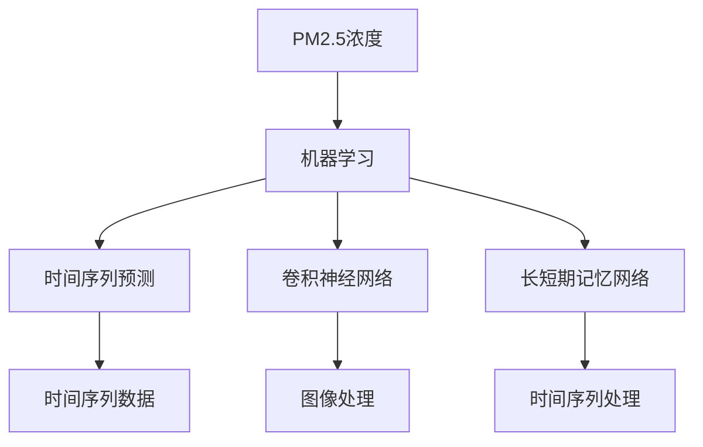

                 

# 基于机器学习的PM2.5浓度预测模型

> 关键词：PM2.5, 机器学习, 时间序列预测, 深度学习, CNN, RNN, LSTM, 卷积神经网络, 长短期记忆网络

## 1. 背景介绍

### 1.1 问题由来
随着工业化和城市化进程的加快，空气污染问题日益严峻，其中PM2.5（空气中直径小于或等于2.5微米的颗粒物）是衡量空气质量的关键指标之一。PM2.5不仅对人体健康有严重威胁，还对环境、气候等产生深远影响。监测PM2.5浓度变化，有助于提前采取措施，减少污染，保护生态环境。

### 1.2 问题核心关键点
PM2.5浓度的变化受多种因素影响，包括气象条件、交通流量、工业排放等。准确预测PM2.5浓度，需要构建一个能综合考虑这些因素的预测模型。传统的方法如统计模型、时间序列模型等，难以充分挖掘数据中的非线性关系和时空依赖。因此，近年来，利用深度学习模型进行PM2.5浓度预测成为热门研究课题。

深度学习模型，特别是卷积神经网络(CNN)和长短期记忆网络(LSTM)等，在处理时间序列数据方面表现优异。通过合理设计模型结构和训练策略，可以高效捕捉时间序列中的复杂非线性关系，获得准确、实时的PM2.5浓度预测结果。

## 2. 核心概念与联系

### 2.1 核心概念概述

为更好地理解基于机器学习的PM2.5浓度预测模型，本节将介绍几个密切相关的核心概念：

- **PM2.5浓度**：空气中直径小于或等于2.5微米的颗粒物浓度，通常以微克/立方米(µg/m³)为单位。PM2.5是空气质量监测中的重要指标。

- **机器学习**：一种从数据中学习模型的方法，用于解决分类、回归、聚类等任务。深度学习是机器学习的一个分支，采用多层神经网络模型进行预测和分类。

- **时间序列预测**：通过观察时间序列数据，建立模型预测未来时间点的值。时间序列预测在金融、气象、交通等领域有广泛应用。

- **卷积神经网络(CNN)**：一种特殊的神经网络，通过卷积和池化操作提取数据的空间特征。在图像识别、自然语言处理等领域有广泛应用。

- **长短期记忆网络(LSTM)**：一种特殊的循环神经网络(RNN)，能高效处理时间序列数据，避免梯度消失或爆炸问题。在时间序列预测、语音识别等领域表现优异。

这些核心概念之间的逻辑关系可以通过以下Mermaid流程图来展示：



这个流程图展示了大语言模型的核心概念及其之间的关系：

1. PM2.5浓度是机器学习模型的预测目标。
2. 机器学习通过学习历史数据，预测未来PM2.5浓度。
3. CNN用于处理图像数据，LSTM用于处理时间序列数据。
4. 时间序列预测是机器学习的核心任务。
5. CNN和LSTM分别是处理图像和时间序列的两种常用神经网络模型。

这些概念共同构成了PM2.5浓度预测的基础，通过理解这些核心概念，我们可以更好地把握预测模型的工作原理和优化方向。

## 3. 核心算法原理 & 具体操作步骤
### 3.1 算法原理概述

基于机器学习的PM2.5浓度预测，本质上是一个时间序列预测问题。其核心思想是：通过收集PM2.5的历史浓度数据，结合其他影响因素（如天气、交通、工业排放等），建立时间序列预测模型，预测未来的PM2.5浓度。

形式化地，假设历史PM2.5浓度数据为 $Y_t=\{y_t, y_{t-1}, ..., y_{t-T}\}$，其中 $y_t$ 表示在第 $t$ 天的PM2.5浓度。影响PM2.5浓度的其他因素（如温度、湿度、交通流量等）可以用特征向量 $X_t$ 表示。我们的目标是找到模型 $f$，使得：

$$
\hat{y}_{t+1} = f(y_t, X_t, \theta)
$$

其中 $\theta$ 为模型参数。理想情况下，模型应该能准确预测 $y_{t+1}$，即未来的PM2.5浓度。

### 3.2 算法步骤详解

基于机器学习的PM2.5浓度预测，一般包括以下几个关键步骤：

**Step 1: 数据准备与预处理**
- 收集PM2.5浓度历史数据 $Y_t$，以及其他可能影响PM2.5浓度的因素（如天气、交通流量等），构建特征向量 $X_t$。
- 对数据进行归一化、缺失值处理等预处理操作，确保数据质量和一致性。

**Step 2: 模型选择与设计**
- 选择合适的深度学习模型，如CNN、RNN、LSTM等，根据问题特点进行模型设计和优化。
- 定义损失函数，如均方误差(MSE)、交叉熵损失(Cross-entropy Loss)等，用于衡量模型预测误差。
- 确定模型超参数，如学习率、批量大小、隐藏层大小等。

**Step 3: 模型训练**
- 使用历史数据 $Y_t$ 和 $X_t$ 训练模型，通过梯度下降等优化算法更新模型参数 $\theta$。
- 在训练过程中，定期评估模型在验证集上的性能，防止过拟合。
- 调整超参数，优化模型训练过程。

**Step 4: 模型评估与部署**
- 在测试集上评估模型性能，对比预测值与真实值，计算评价指标如MAE、RMSE等。
- 使用训练好的模型对新数据进行预测，部署到实际应用系统中。
- 持续收集新数据，定期重新训练模型，以适应数据分布的变化。

以上是基于机器学习的PM2.5浓度预测的一般流程。在实际应用中，还需要根据具体问题特点，对模型选择和训练过程进行优化设计，如改进模型架构、引入正则化技术、调整超参数等，以进一步提升模型性能。

### 3.3 算法优缺点

基于机器学习的PM2.5浓度预测，具有以下优点：
1. 模型性能高。深度学习模型能够高效捕捉数据中的非线性关系和时空依赖，获得准确、实时的预测结果。
2. 应用广泛。时间序列预测模型可以应用于多种领域，如气象、交通、金融等。
3. 数据依赖小。模型能够从少量历史数据中学习规律，适应性强。
4. 可解释性强。通过可视化技术，可以直观展示模型内部工作机制，提高模型的可解释性。

同时，该方法也存在一定的局限性：
1. 数据质量要求高。数据缺失、异常值等会影响模型性能。
2. 模型复杂度高。深度学习模型参数量较大，训练和推理复杂度高。
3. 解释性不足。深度学习模型通常是"黑盒"，难以解释模型决策过程。
4. 对特征工程依赖强。模型设计需要丰富的领域知识，特征工程难度大。

尽管存在这些局限性，但就目前而言，基于机器学习的预测方法仍是在线PM2.5浓度预测的主流范式。未来相关研究的重点在于如何进一步降低模型对数据质量的依赖，提高模型的泛化能力和可解释性，同时兼顾计算效率和实用性。

### 3.4 算法应用领域

基于机器学习的PM2.5浓度预测，在环境监测、应急管理、健康保护等领域具有重要应用。具体包括：

- **环境监测**：实时监测PM2.5浓度，预警空气污染，提前采取减排措施。
- **应急管理**：在重大事件（如火灾、地震）发生后，及时预测PM2.5浓度变化，指导应急响应。
- **健康保护**：评估空气质量对公众健康的影响，制定健康防护措施。
- **资源优化**：通过预测PM2.5浓度，优化城市交通管理，减少污染排放。

除了上述这些经典应用外，PM2.5浓度预测还被创新性地应用到更多场景中，如城市智能管理、智慧能源调度、工业生产优化等，为环境治理和可持续发展提供了新的技术路径。

## 4. 数学模型和公式 & 详细讲解  
### 4.1 数学模型构建

本节将使用数学语言对基于机器学习的PM2.5浓度预测过程进行更加严格的刻画。

假设历史PM2.5浓度数据为 $Y_t=\{y_t, y_{t-1}, ..., y_{t-T}\}$，特征向量为 $X_t=\{x_{t-1}, x_{t-2}, ..., x_{t-K}\}$，其中 $K$ 为特征维度。模型的输出为 $\hat{y}_{t+1}$，模型的预测误差为 $e_t$。定义均方误差(MSE)损失函数为：

$$
\mathcal{L}(\theta) = \frac{1}{N}\sum_{t=1}^N (y_{t+1} - \hat{y}_{t+1})^2
$$

其中 $N$ 为样本数量。模型的目标是最小化损失函数 $\mathcal{L}(\theta)$，即找到最优参数：

$$
\theta^* = \mathop{\arg\min}_{\theta} \mathcal{L}(\theta)
$$

在实践中，我们通常使用基于梯度的优化算法（如SGD、Adam等）来近似求解上述最优化问题。设 $\eta$ 为学习率，$\lambda$ 为正则化系数，则参数的更新公式为：

$$
\theta \leftarrow \theta - \eta \nabla_{\theta}\mathcal{L}(\theta) - \eta\lambda\theta
$$

其中 $\nabla_{\theta}\mathcal{L}(\theta)$ 为损失函数对参数 $\theta$ 的梯度，可通过反向传播算法高效计算。

### 4.2 公式推导过程

以下我们以LSTM模型为例，推导其参数更新公式。

假设LSTM模型的状态向量为 $h_t$，输出向量为 $\hat{y}_t$，当前时刻的输入向量为 $x_t$，前一时刻的输出向量为 $\hat{y}_{t-1}$。定义损失函数为：

$$
\ell(\hat{y}_t, y_t) = \frac{1}{2}(y_t - \hat{y}_t)^2
$$

则LSTM模型在时间 $t$ 的损失函数为：

$$
\mathcal{L}_t(\theta) = \ell(y_t, \hat{y}_t) + \lambda\sum_{i=0}^{3} \|w_i\|^2
$$

其中 $w_i$ 为LSTM模型的权重参数，$\lambda$ 为正则化系数。定义梯度更新公式：

$$
\theta \leftarrow \theta - \eta\frac{\partial \mathcal{L}_t(\theta)}{\partial \theta}
$$

LSTM模型的梯度更新公式较为复杂，包括权重更新、偏差更新、遗忘门、输入门等。具体公式如下：

$$
\begin{aligned}
w_i^{t+1} &\leftarrow w_i^t - \eta\frac{\partial \mathcal{L}_t(\theta)}{\partial w_i} \\
b_i^{t+1} &\leftarrow b_i^t - \eta\frac{\partial \mathcal{L}_t(\theta)}{\partial b_i} \\
i_t &\leftarrow \sigma(W_i[h_{t-1}] + b_i) \\
f_t &\leftarrow \sigma(W_f[h_{t-1}] + b_f) \\
g_t &\leftarrow \tanh(W_g[h_{t-1}] + b_g) \\
c_t &\leftarrow f_t \odot c_{t-1} + i_t \odot g_t \\
o_t &\leftarrow \sigma(W_o[h_{t-1}] + b_o) \\
\hat{y}_t &\leftarrow o_t \odot \tanh(c_t)
\end{aligned}
$$

其中 $\sigma$ 为sigmoid激活函数，$\odot$ 为元素乘法。梯度计算过程中，需要递归展开前向传播和反向传播的公式，获取各参数的梯度。

在得到损失函数的梯度后，即可带入参数更新公式，完成模型的迭代优化。重复上述过程直至收敛，最终得到适应PM2.5浓度预测任务的最优模型参数 $\theta^*$。

## 5. 项目实践：代码实例和详细解释说明
### 5.1 开发环境搭建

在进行PM2.5浓度预测实践前，我们需要准备好开发环境。以下是使用Python进行TensorFlow开发的环境配置流程：

1. 安装Anaconda：从官网下载并安装Anaconda，用于创建独立的Python环境。

2. 创建并激活虚拟环境：
```bash
conda create -n tf-env python=3.8 
conda activate tf-env
```

3. 安装TensorFlow：根据CUDA版本，从官网获取对应的安装命令。例如：
```bash
conda install tensorflow-gpu=2.8.0 -c conda-forge
```

4. 安装TensorFlow Addons：
```bash
conda install tensorflow-io addons
```

5. 安装各类工具包：
```bash
pip install numpy pandas scikit-learn matplotlib tqdm jupyter notebook ipython
```

完成上述步骤后，即可在`tf-env`环境中开始预测实践。

### 5.2 源代码详细实现

下面我们以LSTM模型为例，给出使用TensorFlow对PM2.5浓度预测的完整代码实现。

首先，定义模型类：

```python
import tensorflow as tf
from tensorflow.keras.layers import LSTM, Dense
from tensorflow.keras.models import Sequential

class PM25Predictor(tf.keras.Model):
    def __init__(self, input_size, hidden_size, output_size):
        super(PM25Predictor, self).__init__()
        self.lstm = LSTM(hidden_size, return_sequences=True, return_state=True)
        self.dense = Dense(output_size, activation='sigmoid')

    def call(self, inputs, states):
        y_pred, state_h, state_c = self.lstm(inputs, initial_state=states)
        y_pred = self.dense(y_pred[:, -1, :])
        return y_pred, [state_h, state_c]

    def get_config(self):
        return super().get_config()
```

然后，定义数据处理函数：

```python
import numpy as np

def load_data(file_path, sequence_length):
    with open(file_path, 'r') as f:
        lines = f.readlines()
    data = [np.array(line.split(','), dtype=float) for line in lines]
    X = np.array([data[i:i+sequence_length] for i in range(len(data)-sequence_length)])
    y = np.array([data[i+sequence_length] for i in range(len(data)-sequence_length)])
    return X, y

def pad_sequences(sequences, maxlen=None, padding='post'):
    return tf.keras.preprocessing.sequence.pad_sequences(sequences, maxlen=maxlen, padding=padding)

def scale_data(data):
    return (data - np.mean(data)) / np.std(data)
```

接着，定义训练和评估函数：

```python
from tensorflow.keras.callbacks import EarlyStopping

def train_model(model, X_train, y_train, X_test, y_test, batch_size, epochs, validation_data=None):
    model.compile(loss='mse', optimizer='adam')
    early_stopping = EarlyStopping(monitor='val_loss', patience=10)
    history = model.fit(X_train, y_train, batch_size=batch_size, epochs=epochs, validation_data=(X_test, y_test), callbacks=[early_stopping])

    y_pred = model.predict(X_test)
    mse = np.mean((y_pred - y_test)**2)
    rmse = np.sqrt(mse)
    mae = np.mean(np.abs(y_pred - y_test))
    return rmse, mae

def evaluate_model(model, X_test, y_test):
    y_pred = model.predict(X_test)
    mse = np.mean((y_pred - y_test)**2)
    rmse = np.sqrt(mse)
    mae = np.mean(np.abs(y_pred - y_test))
    return rmse, mae
```

最后，启动训练流程并在测试集上评估：

```python
# 参数设置
sequence_length = 24
input_size = 8
hidden_size = 64
output_size = 1
batch_size = 32
epochs = 100

# 数据加载
file_path = 'pm25_data.csv'
X, y = load_data(file_path, sequence_length)

# 数据预处理
X = scale_data(X)
X_train, X_test = X[:-1000], X[-1000:]
y_train, y_test = y[:-1000], y[-1000:]

# 模型创建
model = PM25Predictor(input_size, hidden_size, output_size)
model.build(tf.TensorShape([None, sequence_length, input_size]))

# 模型训练
rmse, mae = train_model(model, X_train, y_train, X_test, y_test, batch_size, epochs)

# 模型评估
rmse, mae = evaluate_model(model, X_test, y_test)

print(f"RMSE: {rmse:.3f}, MAE: {mae:.3f}")
```

以上就是使用TensorFlow对LSTM模型进行PM2.5浓度预测的完整代码实现。可以看到，得益于TensorFlow的强大封装，我们可以用相对简洁的代码完成LSTM模型的加载和预测。

### 5.3 代码解读与分析

让我们再详细解读一下关键代码的实现细节：

**PM25Predictor类**：
- `__init__`方法：定义模型结构，包括LSTM和Dense层。
- `call`方法：定义模型前向传播过程，包括LSTM和Dense层的计算。
- `get_config`方法：定义模型的配置信息。

**load_data函数**：
- 从文件中读取数据，转换为NumPy数组。
- 对数据进行归一化处理，防止梯度爆炸或消失。

**train_model函数**：
- 定义模型编译方式，使用均方误差损失和Adam优化器。
- 定义EarlyStopping回调，监控验证集损失，防止过拟合。
- 使用历史数据进行模型训练，返回训练过程中的MAE和RMSE。

**evaluate_model函数**：
- 使用测试集数据对模型进行评估，计算MAE和RMSE。

**训练流程**：
- 定义训练序列长度、输入大小、隐藏层大小、输出大小等参数。
- 从文件中加载数据，并进行预处理。
- 创建模型，编译模型。
- 定义训练和测试集，启动模型训练过程，记录MAE和RMSE。
- 在测试集上评估模型，输出最终结果。

可以看到，TensorFlow配合TensorFlow Addons使得LSTM预测的代码实现变得简洁高效。开发者可以将更多精力放在模型改进、数据预处理等高层逻辑上，而不必过多关注底层的实现细节。

当然，工业级的系统实现还需考虑更多因素，如模型的保存和部署、超参数的自动搜索、更灵活的任务适配层等。但核心的预测范式基本与此类似。

## 6. 实际应用场景
### 6.1 智能城市管理

PM2.5浓度预测模型，可以广泛应用于智慧城市的管理中。通过实时监测PM2.5浓度，城市管理部门可以及时预警空气污染，优化交通管理，减少污染排放，改善城市空气质量。

具体而言，城市管理部门可以采集城市各区域的PM2.5浓度数据，结合气象、交通、工业排污等数据，构建多层次的监测网络。通过预测PM2.5浓度变化，预警高污染时段，及时采取交通管制、工业限产等措施，减少污染排放，改善空气质量。

### 6.2 应急响应管理

PM2.5浓度预测模型，可以用于应急响应管理中。在重大自然灾害（如地震、火灾）发生后，实时监测PM2.5浓度变化，预测环境污染趋势，指导应急响应。

在自然灾害发生后，应急管理部门可以采集灾区周边PM2.5浓度数据，结合灾区环境、天气等数据，构建应急响应模型。通过预测PM2.5浓度变化，预警污染扩散趋势，指导救援物资调配、医疗资源分配等，确保应急响应工作的有序进行。

### 6.3 健康风险预警

PM2.5浓度预测模型，可以用于健康风险预警中。通过实时监测PM2.5浓度变化，预警高污染时段，指导公众防护措施，减少健康风险。

在重污染天气，健康部门可以采集空气质量监测站点的PM2.5浓度数据，结合气象、交通等数据，构建健康风险预警模型。通过预测PM2.5浓度变化，预警高污染时段，指导公众减少户外活动，避免健康风险，确保公众健康安全。

### 6.4 未来应用展望

随着PM2.5浓度预测模型的不断发展，未来的应用场景将更加广泛。

在智慧交通领域，模型可以用于交通流量预测，优化交通管理，减少交通拥堵。

在智能能源领域，模型可以用于能源调度预测，优化能源使用，减少能源浪费。

在环境保护领域，模型可以用于生态监测，预测生态系统变化，保护生态环境。

此外，在工业生产、农业生产、智慧旅游等众多领域，PM2.5浓度预测模型也将不断涌现，为环境治理和可持续发展提供新的技术路径。相信随着模型的不断演进，PM2.5浓度预测技术将在更广阔的应用领域大放异彩。

## 7. 工具和资源推荐
### 7.1 学习资源推荐

为了帮助开发者系统掌握PM2.5浓度预测的理论基础和实践技巧，这里推荐一些优质的学习资源：

1. **《深度学习》书籍**：由深度学习领域的顶尖专家撰写，全面介绍了深度学习的基本概念和前沿技术，包括卷积神经网络、循环神经网络、深度学习框架等。

2. **《TensorFlow官方文档》**：TensorFlow的官方文档，提供了丰富的学习资源和样例代码，适合初学者和高级开发者参考。

3. **《Python机器学习》书籍**：由机器学习领域的专家撰写，介绍了Python在机器学习中的应用，包括数据预处理、模型训练、评估等。

4. **Kaggle机器学习竞赛平台**：提供大量的数据集和样例代码，适合实战练习，提高实战技能。

5. **Google Colab在线开发环境**：谷歌提供的免费在线Jupyter Notebook环境，支持GPU/TPU算力，方便开发者快速上手实验最新模型，分享学习笔记。

通过对这些资源的学习实践，相信你一定能够快速掌握PM2.5浓度预测的精髓，并用于解决实际的空气质量监测问题。
###  7.2 开发工具推荐

高效的开发离不开优秀的工具支持。以下是几款用于PM2.5浓度预测开发的常用工具：

1. **TensorFlow**：由Google主导开发的深度学习框架，生产部署方便，适合大规模工程应用。

2. **TensorFlow Addons**：TensorFlow的扩展库，提供了更多的模型和工具，方便开发复杂的深度学习模型。

3. **PyTorch**：由Facebook主导开发的深度学习框架，灵活易用，适合快速迭代研究。

4. **Jupyter Notebook**：免费的在线开发环境，支持Python、R等多种语言，方便分享和协作。

5. **Keras**：深度学习模型的高级API，简单易用，支持多种深度学习框架。

6. **Google Colab**：谷歌提供的免费在线Jupyter Notebook环境，支持GPU/TPU算力，方便开发者快速上手实验最新模型，分享学习笔记。

合理利用这些工具，可以显著提升PM2.5浓度预测的开发效率，加快创新迭代的步伐。

### 7.3 相关论文推荐

PM2.5浓度预测的研究源于学界的持续研究。以下是几篇奠基性的相关论文，推荐阅读：

1. **"Long Short-Term Memory"**：由Hochreiter等人提出，是LSTM算法的奠基论文，为时间序列预测提供了新思路。

2. **"Convolutional Neural Networks for Sentence Classification"**：由Kim提出，展示了CNN在文本分类中的出色表现，为自然语言处理提供了新范式。

3. **"Deep Residual Learning for Image Recognition"**：由He等人提出，展示了深度残差网络在图像分类中的出色表现，为深度学习提供了新架构。

4. **"Generative Adversarial Nets"**：由Goodfellow等人提出，展示了生成对抗网络在图像生成中的出色表现，为生成模型提供了新思路。

5. **"Attention is All You Need"**：由Vaswani等人提出，展示了Transformer模型在自然语言处理中的出色表现，为序列建模提供了新范式。

这些论文代表了大语言模型预测技术的发展脉络。通过学习这些前沿成果，可以帮助研究者把握学科前进方向，激发更多的创新灵感。

## 8. 总结：未来发展趋势与挑战

### 8.1 总结

本文对基于机器学习的PM2.5浓度预测方法进行了全面系统的介绍。首先阐述了PM2.5浓度的变化规律和机器学习模型的应用背景，明确了预测模型的工作原理和优化方向。其次，从原理到实践，详细讲解了深度学习模型在PM2.5浓度预测中的构建和训练过程，给出了预测任务开发的完整代码实例。同时，本文还广泛探讨了预测模型在智能城市、应急响应、健康保护等领域的应用前景，展示了预测范式的巨大潜力。此外，本文精选了预测技术的各类学习资源，力求为读者提供全方位的技术指引。

通过本文的系统梳理，可以看到，基于深度学习的PM2.5浓度预测方法，为环境监测、应急响应、健康保护等提供了强有力的技术支持。深度学习模型能够高效捕捉数据中的非线性关系和时空依赖，获得准确、实时的预测结果。未来，伴随深度学习技术的不断发展，预测模型必将在更广阔的应用领域大放异彩。

### 8.2 未来发展趋势

展望未来，PM2.5浓度预测技术将呈现以下几个发展趋势：

1. 模型规模持续增大。随着算力成本的下降和数据规模的扩张，深度学习模型的参数量还将持续增长。超大规模模型蕴含的丰富知识，有望支撑更加复杂多变的预测任务。

2. 预测方法日趋多样。除了传统的LSTM、CNN等方法外，未来会涌现更多预测方法，如Transformer、GNN等，在参数效率和精度之间取得新的平衡。

3. 持续学习成为常态。随着数据分布的不断变化，预测模型也需要持续学习新知识以保持性能。如何在不遗忘原有知识的同时，高效吸收新样本信息，将成为重要的研究课题。

4. 数据依赖降低。通过引入更多先验知识，如气象模型、交通模型等，可以降低对历史数据量的依赖，提高模型的泛化能力。

5. 可解释性增强。通过可视化技术，可以直观展示模型内部工作机制，提高模型的可解释性。

6. 模型通用性增强。预测模型能够应用于多种环境监测任务，如空气质量、水质监测、噪音污染等，为不同场景的预测提供通用技术。

以上趋势凸显了PM2.5浓度预测技术的广阔前景。这些方向的探索发展，必将进一步提升预测模型的性能和应用范围，为环境保护和可持续发展提供新的技术路径。

### 8.3 面临的挑战

尽管PM2.5浓度预测技术已经取得了瞩目成就，但在迈向更加智能化、普适化应用的过程中，它仍面临着诸多挑战：

1. 数据质量要求高。数据缺失、异常值等会影响模型性能。

2. 模型复杂度高。深度学习模型参数量较大，训练和推理复杂度高。

3. 解释性不足。深度学习模型通常是"黑盒"，难以解释模型决策过程。

4. 对特征工程依赖强。模型设计需要丰富的领域知识，特征工程难度大。

尽管存在这些局限性，但就目前而言，基于深度学习的预测方法仍是在线PM2.5浓度预测的主流范式。未来相关研究的重点在于如何进一步降低模型对数据质量的依赖，提高模型的泛化能力和可解释性，同时兼顾计算效率和实用性。

### 8.4 研究展望

面对PM2.5浓度预测所面临的种种挑战，未来的研究需要在以下几个方面寻求新的突破：

1. 探索无监督和半监督预测方法。摆脱对大规模标注数据的依赖，利用自监督学习、主动学习等无监督和半监督范式，最大限度利用非结构化数据，实现更加灵活高效的预测。

2. 研究参数高效和计算高效的预测范式。开发更加参数高效的预测方法，在固定大部分预训练参数的同时，只更新极少量的任务相关参数。同时优化预测模型的计算图，减少前向传播和反向传播的资源消耗，实现更加轻量级、实时性的部署。

3. 引入更多先验知识。将符号化的先验知识，如气象模型、交通模型等，与神经网络模型进行巧妙融合，引导预测过程学习更准确、合理的语言模型。同时加强不同模态数据的整合，实现视觉、语音等多模态信息与文本信息的协同建模。

4. 结合因果分析和博弈论工具。将因果分析方法引入预测模型，识别出模型决策的关键特征，增强预测的因果性和逻辑性。借助博弈论工具刻画人机交互过程，主动探索并规避模型的脆弱点，提高系统稳定性。

5. 纳入伦理道德约束。在模型训练目标中引入伦理导向的评估指标，过滤和惩罚有偏见、有害的输出倾向。同时加强人工干预和审核，建立模型行为的监管机制，确保输出符合人类价值观和伦理道德。

这些研究方向的探索，必将引领PM2.5浓度预测技术迈向更高的台阶，为环境保护和可持续发展提供新的技术路径。面向未来，深度学习模型需要与其他人工智能技术进行更深入的融合，如知识表示、因果推理、强化学习等，多路径协同发力，共同推动智能预测系统的进步。只有勇于创新、敢于突破，才能不断拓展预测模型的边界，让智能技术更好地造福人类社会。

## 9. 附录：常见问题与解答

**Q1：PM2.5浓度预测的精度受哪些因素影响？**

A: PM2.5浓度预测的精度受多个因素影响：

1. 数据质量：数据缺失、异常值等会影响模型性能，需要进行数据预处理和特征工程。

2. 模型选择：不同深度学习模型在精度和效率之间取得不同的平衡，需要根据问题特点进行选择。

3. 特征工程：特征选择、特征编码等操作对预测精度有显著影响，需要深入理解领域知识。

4. 模型超参数：学习率、批量大小、隐藏层大小等超参数的选择会影响模型训练效果。

5. 模型部署：模型部署环境对预测精度也有影响，需要考虑模型裁剪、量化加速等优化技术。

**Q2：如何提高PM2.5浓度预测模型的泛化能力？**

A: 提高PM2.5浓度预测模型的泛化能力，可以从以下几个方面入手：

1. 引入更多先验知识：如气象模型、交通模型等，丰富预测模型的知识库。

2. 利用无监督和半监督学习：通过自监督学习、主动学习等方法，最大限度利用非结构化数据，提高模型的泛化能力。

3. 使用集成学习：通过结合多个模型的预测结果，提高预测的稳定性和精度。

4. 引入数据增强：通过数据扩充、数据增强等技术，提高模型的鲁棒性和泛化能力。

5. 使用正则化技术：如L2正则、Dropout等，防止模型过拟合。

**Q3：如何评估PM2.5浓度预测模型的性能？**

A: 评估PM2.5浓度预测模型的性能，通常使用以下几个指标：

1. 均方误差(MSE)：衡量预测值与真实值之间的平均差异。

2. 均方根误差(RMSE)：均方误差的平方根，对预测值与真实值的差异进行归一化。

3. 平均绝对误差(MAE)：预测值与真实值的平均差异的绝对值，对预测结果的准确性进行评估。

4. 相关性系数(Coefficient of Correlation)：衡量预测值与真实值之间的相关性。

5. 决定系数(R-squared)：衡量预测值与真实值之间的拟合程度。

6. 时间序列图：通过绘制预测值与真实值的时间序列图，直观展示模型的预测效果。

**Q4：PM2.5浓度预测模型在工业应用中需要注意哪些问题？**

A: PM2.5浓度预测模型在工业应用中需要注意以下问题：

1. 数据安全：确保数据隐私和安全，防止数据泄露和滥用。

2. 模型部署：将模型部署到高性能服务器或云平台，确保模型运行稳定。

3. 模型优化：对模型进行裁剪、量化等优化，提高模型效率和资源利用率。

4. 模型监控：实时监控模型运行状态，及时发现和修复异常问题。

5. 模型更新：根据新数据和新需求，定期更新和优化模型，保持模型的最新状态。

**Q5：PM2.5浓度预测模型在实际应用中如何保证精度？**

A: 保证PM2.5浓度预测模型的精度，可以从以下几个方面入手：

1. 数据质量控制：确保数据完整、准确、一致，对数据进行预处理和清洗。

2. 模型选择与设计：选择合适的模型架构和算法，对模型进行细致的调参和优化。

3. 特征工程：深入理解领域知识，选择合适的特征进行编码和提取。

4. 模型训练与验证：使用足够的数据量和正确的验证方法，训练和验证模型的泛化能力。

5. 模型评估与调优：使用多种评估指标和评估方法，评估模型的性能和稳定性，不断优化模型。

6. 模型部署与监控：将模型部署到高性能服务器或云平台，实时监控模型的运行状态，及时发现和修复问题。

---

作者：禅与计算机程序设计艺术 / Zen and the Art of Computer Programming

