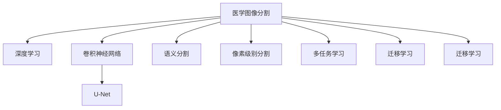

                 

## 1. 背景介绍

### 1.1 问题由来

医学图像分割（Medical Image Segmentation）是医学影像处理中至关重要的一环，涉及到将医学影像中的不同结构（如肿瘤、器官、组织）分割出来。这一过程对于疾病的早期发现、精准诊断、个性化治疗以及自动化的医疗系统开发都具有重要意义。传统的医学图像分割主要依赖于手动勾画感兴趣的区域，这种方式不仅费时费力，而且存在主观性和误差。

近年来，深度学习尤其是卷积神经网络（Convolutional Neural Networks, CNNs）在医学图像分割领域取得了突破性进展。通过预训练和微调，深度学习模型可以在一定程度上自主学习医学图像的特征和模式，从而实现高精度的自动分割。但基于深度学习的医学图像分割面临数据量巨大、标注困难、计算资源需求高、模型复杂度高、鲁棒性和泛化能力不足等挑战。

本文将介绍基于深度学习的医学图像分割原理，重点探讨如何在实际应用中优化分割模型，提升其性能。文章涵盖以下主要部分：医学图像分割的原理、关键技术和算法、项目实践、应用场景和未来展望。

## 2. 核心概念与联系

### 2.1 核心概念概述

- **医学图像分割**：医学图像分割是指从医学影像中自动识别和分离感兴趣的区域（如肿瘤、器官、组织等）。这是医学影像分析和诊断中的关键步骤，能够为临床决策提供可靠依据。
- **深度学习**：一种通过多层神经网络模型模拟人脑神经元工作原理的机器学习方法，主要应用于大规模数据处理和复杂模式识别任务。
- **卷积神经网络（CNNs）**：一种特殊的神经网络，适用于处理具有网格状结构的数据，如图像、视频等，常用于图像分类、目标检测、图像分割等任务。
- **U-Net**：一种特殊的CNN架构，主要设计用于图像分割任务，具有编码器-解码器的结构，可以同时学习全局和局部特征。
- **语义分割（Semantic Segmentation）**：将医学图像分割为不同类别或语义区域，以像素为单位的分割方式。
- **像素级别分割（Pixel-Level Segmentation）**：将医学图像的每个像素分配到预定义的类别中，以实现高精度的分割。
- **多任务学习（Multi-task Learning）**：指在一个模型中同时学习多个相关任务的策略，可以提高模型的泛化能力和性能。
- **迁移学习（Transfer Learning）**：指在一个领域学习到的知识迁移到另一个领域，用于解决数据量不足或标注困难的问题。

这些概念之间的逻辑关系可以通过以下Mermaid流程图来展示：



这个流程图展示了几者之间的关联：

1. 医学图像分割主要依赖深度学习技术。
2. 卷积神经网络是深度学习模型的一种，特别适用于医学图像分割。
3. U-Net是卷积神经网络的一种特殊架构，适用于医学图像分割任务。
4. 语义分割和像素级别分割是医学图像分割中的两种重要类型。
5. 多任务学习和迁移学习是提升医学图像分割性能的重要手段。

## 3. 核心算法原理 & 具体操作步骤

### 3.1 算法原理概述

医学图像分割的核心在于将医学图像中不同区域的像素点区分开来。在深度学习模型中，这通常通过像素级别的分类来完成。模型的目标是将每个像素分配到预定义的类别中，如背景、组织、肿瘤等。

深度学习模型通过训练大量的带有标签的医学图像数据集，学习像素级别的特征和模式。在训练过程中，模型会不断优化权重，使得模型能够更准确地预测每个像素的类别。训练结束后，模型可以对新的医学图像进行像素级别的分割。

### 3.2 算法步骤详解

以下是基于深度学习的医学图像分割的一般流程：

**Step 1: 数据准备与预处理**

- 收集和标注大量的医学图像数据，包括CT、MRI、PET等多种医学影像类型。
- 对医学图像进行预处理，如归一化、去噪、增强等操作，提高数据质量。
- 将标注数据转换为适合深度学习模型处理的格式，如将图像分割数据转换为像素级别标签。

**Step 2: 设计模型架构**

- 选择合适的深度学习模型架构，如卷积神经网络（CNNs）、U-Net、FCN等。
- 在模型中设置卷积层、池化层、反卷积层等组件，以便从图像中提取特征。
- 添加softmax层或其他分类层，以便对像素进行分类。

**Step 3: 模型训练**

- 将预处理后的数据集划分为训练集、验证集和测试集。
- 使用训练集对模型进行反向传播训练，不断优化模型参数。
- 在验证集上评估模型性能，防止过拟合。
- 调整超参数，如学习率、批大小、迭代次数等，以达到最佳分割效果。

**Step 4: 模型评估**

- 使用测试集对训练好的模型进行评估，计算分割精度、召回率、F1分数等指标。
- 分析模型的性能瓶颈，进行改进和优化。

**Step 5: 模型部署与应用**

- 将训练好的模型部署到实际应用场景中，如医院、诊所等。
- 对新的医学图像进行像素级别分割，生成分割结果。
- 结合医生的专业知识，对分割结果进行人工审核，确保其准确性。

### 3.3 算法优缺点

**优点**

- 深度学习模型具有强大的特征学习能力和泛化能力，能够从大规模医学图像数据中学习到丰富的特征。
- 基于深度学习的医学图像分割具有较高的精度和鲁棒性，能够适应不同类型和复杂度的医学图像。
- 相比于传统的手工勾画方法，基于深度学习的分割方法可以大幅提高工作效率，降低人工成本。

**缺点**

- 需要大量的高质量标注数据，标注过程耗时费力。
- 深度学习模型的训练过程复杂，计算资源需求高，需要高性能计算设备。
- 模型较为复杂，容易受到训练数据和超参数的影响，存在一定的鲁棒性问题。

### 3.4 算法应用领域

基于深度学习的医学图像分割广泛应用于以下几个领域：

- **医学影像分析**：用于CT、MRI、PET等影像的自动分析，如肿瘤检测、器官分割等。
- **个性化治疗**：在肿瘤治疗、心脏疾病、脑部疾病等领域，帮助医生制定个性化治疗方案。
- **远程医疗**：将分割结果传输到远程医疗系统中，帮助医生进行诊断和决策。
- **手术辅助**：为手术医生提供实时图像分割结果，辅助手术过程。

## 4. 数学模型和公式 & 详细讲解 & 举例说明

### 4.1 数学模型构建

在基于深度学习的医学图像分割中，模型通常使用以下结构：

```
    Input --> Encoder --> Decoder --> Output
```

其中：

- `Input`表示医学图像。
- `Encoder`包含一系列卷积和池化层，用于提取图像特征。
- `Decoder`包含一系列反卷积和卷积层，用于恢复特征图，并将其映射到像素级别。
- `Output`包含分类层，用于对像素进行分类。

一个典型的医学图像分割模型可以表示为：

$$
f(x; \theta) = Output(Decoder(Encoder(x; \theta)))
$$

其中 $x$ 表示输入图像，$\theta$ 表示模型参数。

### 4.2 公式推导过程

以U-Net为例，其编码器和解码器的结构相似，但参数共享不同。以解码器为例，假设输入特征图大小为 $H_W \times W$，输出特征图大小为 $h_w \times w$，则解码器的前向传播过程如下：

1. 将特征图 $H$ 经过反卷积操作，得到特征图 $G$。
2. 对特征图 $G$ 进行卷积操作，得到特征图 $S$。
3. 对特征图 $S$ 进行卷积操作，得到特征图 $E$。
4. 对特征图 $E$ 进行卷积操作，得到输出 $y$。

解码器的后向传播过程如下：

1. 计算输出 $y$ 的损失函数 $\mathcal{L}(y, y_{true})$。
2. 计算梯度 $\frac{\partial \mathcal{L}}{\partial y}$。
3. 计算梯度 $\frac{\partial \mathcal{L}}{\partial E}$。
4. 计算梯度 $\frac{\partial \mathcal{L}}{\partial S}$。
5. 计算梯度 $\frac{\partial \mathcal{L}}{\partial G}$。
6. 计算梯度 $\frac{\partial \mathcal{L}}{\partial H}$。

### 4.3 案例分析与讲解

以一个简单的医学图像分割问题为例，假设有如下的医学图像和像素级别的标签：

```
Input:
[[[1, 0, 1],
  [0, 1, 0],
  [1, 0, 1]]]

Label:
[[[0, 1, 0],
  [1, 1, 0],
  [0, 1, 0]]]
```

使用一个简单的CNN模型进行训练，其结构和参数如下：

```python
import tensorflow as tf
from tensorflow.keras import layers

# 定义模型
model = tf.keras.Sequential([
    layers.Conv2D(32, (3, 3), activation='relu', input_shape=(256, 256, 1)),
    layers.MaxPooling2D((2, 2)),
    layers.Conv2D(64, (3, 3), activation='relu'),
    layers.MaxPooling2D((2, 2)),
    layers.Conv2D(128, (3, 3), activation='relu'),
    layers.MaxPooling2D((2, 2)),
    layers.Conv2D(256, (3, 3), activation='relu'),
    layers.MaxPooling2D((2, 2)),
    layers.Conv2D(512, (3, 3), activation='relu'),
    layers.MaxPooling2D((2, 2)),
    layers.Conv2D(256, (3, 3), activation='relu'),
    layers.Conv2D(128, (3, 3), activation='relu'),
    layers.Conv2D(64, (3, 3), activation='relu'),
    layers.Conv2D(2, (1, 1), activation='softmax')
])
```

使用交叉熵损失函数进行训练：

```python
loss_fn = tf.keras.losses.CategoricalCrossentropy(from_logits=True)

# 定义优化器
optimizer = tf.keras.optimizers.Adam(learning_rate=0.001)

# 训练模型
model.compile(optimizer=optimizer, loss=loss_fn)
model.fit(x_train, y_train, epochs=10, validation_data=(x_val, y_val))
```

经过训练后，模型可以对新的医学图像进行像素级别的分割：

```python
# 加载模型
model = tf.keras.models.load_model('medical_image_segmentation.h5')

# 对新的医学图像进行预测
predictions = model.predict(x_test)

# 将预测结果转换为二值图像
binary_predictions = np.argmax(predictions, axis=1) > 0

# 输出分割结果
print(binary_predictions)
```

## 5. 项目实践：代码实例和详细解释说明

### 5.1 开发环境搭建

要实现基于深度学习的医学图像分割，我们需要搭建相应的开发环境。以下是使用Python和TensorFlow搭建开发环境的流程：

1. 安装Python：从官网下载并安装Python，建议选择3.7或以上版本。
2. 安装pip：打开命令行，运行`python -m ensurepip --default-pip`。
3. 安装TensorFlow：运行`pip install tensorflow`。
4. 安装Keras：运行`pip install keras`。
5. 安装OpenCV：运行`pip install opencv-python`。
6. 安装DICOM库：运行`pip install pydicom`。

完成上述步骤后，即可在Python环境中开始开发。

### 5.2 源代码详细实现

以下是一个简单的医学图像分割模型实现，基于CNN和U-Net架构：

```python
import numpy as np
import tensorflow as tf
from tensorflow.keras import layers, models

# 定义编码器
def encoder(x):
    x = layers.Conv2D(64, (3, 3), activation='relu', padding='same')(x)
    x = layers.MaxPooling2D((2, 2), padding='same')(x)
    x = layers.Conv2D(128, (3, 3), activation='relu', padding='same')(x)
    x = layers.MaxPooling2D((2, 2), padding='same')(x)
    x = layers.Conv2D(256, (3, 3), activation='relu', padding='same')(x)
    x = layers.MaxPooling2D((2, 2), padding='same')(x)
    x = layers.Conv2D(512, (3, 3), activation='relu', padding='same')(x)
    x = layers.MaxPooling2D((2, 2), padding='same')(x)
    return x

# 定义解码器
def decoder(x):
    x = layers.Conv2D(256, (3, 3), activation='relu', padding='same')(x)
    x = layers.UpSampling2D((2, 2))(x)
    x = layers.Conv2D(128, (3, 3), activation='relu', padding='same')(x)
    x = layers.UpSampling2D((2, 2))(x)
    x = layers.Conv2D(64, (3, 3), activation='relu', padding='same')(x)
    x = layers.UpSampling2D((2, 2))(x)
    x = layers.Conv2D(1, (1, 1), activation='sigmoid')(x)
    return x

# 定义完整的U-Net模型
def unet(input_size=(256, 256, 1)):
    inputs = layers.Input(input_size)
    encoded = encoder(inputs)
    decoded = decoder(encoded)
    model = models.Model(inputs, decoded)
    return model

# 加载模型
model = unet()

# 编译模型
model.compile(optimizer='adam', loss='binary_crossentropy', metrics=['accuracy'])

# 训练模型
model.fit(x_train, y_train, epochs=10, batch_size=32, validation_data=(x_val, y_val))
```

### 5.3 代码解读与分析

让我们详细解读一下代码中的关键实现：

- `encoder`函数定义了U-Net的编码器部分，通过一系列卷积和池化层提取图像特征。
- `decoder`函数定义了U-Net的解码器部分，通过一系列反卷积和卷积层恢复特征图，并最终输出分割结果。
- `unet`函数将编码器和解码器组合起来，构成完整的U-Net模型。
- `model.compile`方法编译模型，设置优化器和损失函数。
- `model.fit`方法训练模型，设置训练轮数和批量大小。

## 6. 实际应用场景

### 6.1 智能医疗诊断

医学图像分割在智能医疗诊断中具有重要应用。通过分割肿瘤、器官等感兴趣区域，医生可以更快速、准确地进行诊断和治疗。例如，在肺结节分割任务中，医学图像分割可以帮助医生准确地定位和评估肺结节的尺寸、位置和形态，辅助诊断肺癌等疾病。

### 6.2 肿瘤分期

医学图像分割在肿瘤分期中也具有重要作用。通过分割肿瘤及其周围组织，可以更准确地评估肿瘤的大小、形状、位置和范围，从而进行更精确的肿瘤分期。例如，在乳腺癌分割任务中，医学图像分割可以帮助医生确定肿瘤的浸润深度和范围，指导治疗方案的制定。

### 6.3 器官分割

医学图像分割还可以用于器官分割。通过分割出心脏、肝脏、肾脏等重要器官，医生可以更全面地了解器官的状态和功能，从而进行更准确的诊断和治疗。例如，在心脏分割任务中，医学图像分割可以帮助医生评估心脏的大小、形状和功能，指导心脏疾病的诊断和治疗。

### 6.4 未来应用展望

未来，基于深度学习的医学图像分割将会在以下几个方面取得更大进展：

1. **模型优化**：通过优化模型架构和算法，提升分割精度和效率。
2. **数据增强**：通过数据增强技术，提高模型对不同类型和复杂度的医学图像的泛化能力。
3. **迁移学习**：通过迁移学习，利用预训练模型在医学图像分割中的优势，提升模型性能。
4. **多模态融合**：将医学图像分割与其他模态的信息融合，如X光、CT、MRI等，提高分割的准确性和鲁棒性。
5. **自动化标注**：通过半监督学习、自监督学习等方法，减少人工标注的需求，提高标注效率。
6. **联邦学习**：通过联邦学习，将多个医疗机构的数据汇集起来，共享医学图像分割的成果，提升模型性能。

## 7. 工具和资源推荐

### 7.1 学习资源推荐

1. **《医学图像处理与分析》（Medical Image Processing and Analysis）**：详细介绍了医学图像分割的基础知识和应用，适合初学者入门。
2. **Coursera的《深度学习与医学影像分析》（Deep Learning and Medical Image Analysis）**：由斯坦福大学开设的在线课程，涵盖了深度学习在医学影像分析中的应用，包括医学图像分割。
3. **arXiv上的医学图像分割论文**：arXiv是一个开放获取的论文存储库，上面有大量关于医学图像分割的最新研究成果。

### 7.2 开发工具推荐

1. **TensorFlow**：由Google开发的深度学习框架，具有高效的计算图和丰富的API支持。
2. **Keras**：基于TensorFlow的高级深度学习API，简单易用，适合快速原型开发。
3. **OpenCV**：开源计算机视觉库，提供图像处理和计算机视觉功能，支持医学图像的预处理和增强。
4. **pydicom**：医学影像处理库，支持DICOM格式数据的读写和处理。

### 7.3 相关论文推荐

1. **"U-Net: Convolutional Networks for Biomedical Image Segmentation"**：介绍U-Net架构在医学图像分割中的应用，提出了一个有效的编码器-解码器结构。
2. **"Deep Learning for Medical Image Analysis: An Overview"**：综述了深度学习在医学图像分析中的应用，包括医学图像分割。
3. **"Multi-task learning for segmentation and classification in medical images"**：探讨了多任务学习在医学图像分割和分类中的应用，提出了一个多任务学习的框架。

## 8. 总结：未来发展趋势与挑战

### 8.1 总结

本文对基于深度学习的医学图像分割方法进行了详细阐述。医学图像分割作为医学影像处理中的重要环节，其核心在于将医学图像中的不同区域进行像素级别的分类。通过深度学习模型，可以实现高精度的自动分割，提升医学影像分析和诊断的效率和准确性。

通过分析模型结构和训练流程，本文揭示了基于深度学习的医学图像分割的一般方法和关键步骤。同时，通过具体的代码实例和详细解释，帮助读者更好地理解医学图像分割的实践过程。

### 8.2 未来发展趋势

1. **模型优化**：随着硬件性能的提升和算法的改进，医学图像分割模型的精度和效率将会进一步提升。
2. **多任务学习**：多任务学习可以提升医学图像分割模型的泛化能力和性能，进一步减少人工标注的需求。
3. **迁移学习**：通过迁移学习，利用预训练模型在医学图像分割中的优势，可以提升模型性能，减少标注数据的需求。
4. **联邦学习**：通过联邦学习，将多个医疗机构的数据汇集起来，共享医学图像分割的成果，提升模型性能。
5. **多模态融合**：将医学图像分割与其他模态的信息融合，如X光、CT、MRI等，提高分割的准确性和鲁棒性。

### 8.3 面临的挑战

1. **数据标注**：高质量的医学图像标注数据获取难度大，成本高，是医学图像分割面临的主要挑战。
2. **模型复杂度**：深度学习模型较为复杂，训练过程耗时费力，需要高性能计算设备。
3. **模型泛化**：医学图像分割模型对不同类型和复杂度的医学图像的泛化能力有限，需要进一步提升。

### 8.4 研究展望

1. **自动标注**：通过半监督学习、自监督学习等方法，减少人工标注的需求，提高标注效率。
2. **多任务学习**：进一步研究多任务学习在医学图像分割中的应用，提升模型的泛化能力和性能。
3. **迁移学习**：利用预训练模型在医学图像分割中的优势，提升模型性能，减少标注数据的需求。
4. **多模态融合**：将医学图像分割与其他模态的信息融合，如X光、CT、MRI等，提高分割的准确性和鲁棒性。
5. **联邦学习**：通过联邦学习，将多个医疗机构的数据汇集起来，共享医学图像分割的成果，提升模型性能。

## 9. 附录：常见问题与解答

### 9.1 常见问题与解答

**Q1: 医学图像分割的精度如何提升？**

A: 医学图像分割的精度可以通过以下几个方面进行提升：
1. 选择合适的深度学习模型架构，如U-Net、FCN等。
2. 增加模型深度和宽度，提高特征提取能力。
3. 使用数据增强技术，如旋转、缩放、翻转等，提高模型泛化能力。
4. 使用迁移学习，利用预训练模型在医学图像分割中的优势，提升模型性能。

**Q2: 医学图像分割模型如何处理噪声数据？**

A: 医学图像分割模型可以通过以下几个方面处理噪声数据：
1. 在模型中添加去噪层，如平均池化层、中值滤波等，减少噪声对分割结果的影响。
2. 在数据预处理过程中，使用滤波算法、归一化等技术，减少噪声的影响。
3. 使用多任务学习，同时训练多个分割模型，提高模型鲁棒性。

**Q3: 医学图像分割模型的计算资源需求如何降低？**

A: 医学图像分割模型的计算资源需求可以通过以下几个方面进行降低：
1. 使用更高效的模型架构，如ResNet、MobileNet等，减少模型计算量。
2. 使用更高效的训练算法，如分布式训练、混合精度训练等，减少训练时间和资源消耗。
3. 使用GPU等高性能计算设备，提高训练和推理速度。

**Q4: 医学图像分割模型如何进行可视化？**

A: 医学图像分割模型的可视化可以通过以下几个方面进行：
1. 在训练过程中，可视化模型的中间特征图，了解模型学习到的特征。
2. 在测试过程中，可视化模型的预测结果，了解模型在不同区域的分割效果。
3. 使用工具如TensorBoard，将模型的训练日志、中间特征图和预测结果可视化。

**Q5: 医学图像分割模型如何进行评估？**

A: 医学图像分割模型的评估可以通过以下几个方面进行：
1. 使用精度、召回率、F1分数等指标评估模型的性能。
2. 在实际应用中，进行人工评估，验证模型分割结果的准确性和可靠性。
3. 使用交叉验证等方法，验证模型的泛化能力。

---

作者：禅与计算机程序设计艺术 / Zen and the Art of Computer Programming

