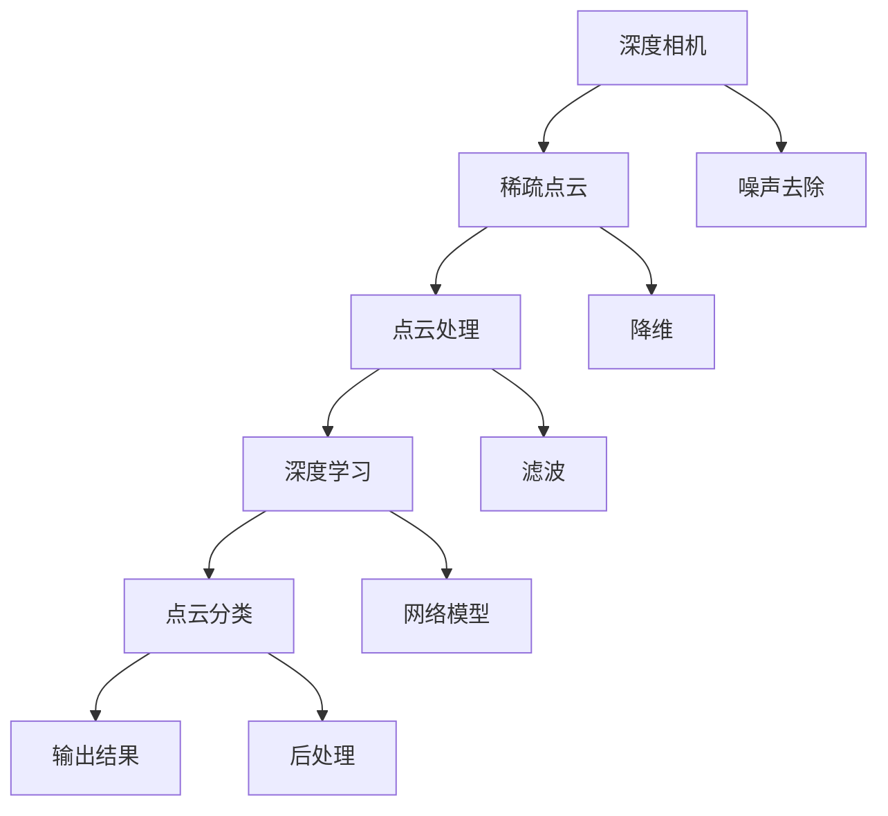

                 

## 1. 背景介绍

### 1.1 问题由来

随着自动驾驶、机器人导航、增强现实等领域的兴起，深度相机在三维场景感知和实时空间定位中扮演了重要角色。然而，由于其数据稀疏、噪声较多的特性，基于深度相机的三维空间场景分类任务面临着诸多挑战。传统的方法往往依赖于特征工程，需要大量手工特征提取和设计，难以应对数据分布变化和复杂场景。

### 1.2 问题核心关键点

本文聚焦于基于深度相机的稀疏点云分类算法，通过深度学习方法，自动学习数据特征，减少对手工设计的依赖，提高分类的准确性和鲁棒性。本研究的核心问题包括：

- 如何有效处理深度相机稀疏点云数据的噪声和噪声点。
- 如何提高稀疏点云分类的泛化性能。
- 如何优化深度相机的分类算法，提高准确率和速度。

## 2. 核心概念与联系

### 2.1 核心概念概述

本节将介绍几个关键的概念，帮助我们理解深度相机稀疏点云分类的基本框架：

- 深度相机（Depth Camera）：通过发射结构光或使用TOF技术获取深度信息的设备，能够实时捕捉物体的三维空间信息。
- 稀疏点云（Sparse Point Cloud）：由深度相机捕捉到的数据，由于受到环境光照、遮挡等因素的影响，通常具有数据稀疏、噪声较多的特性。
- 点云分类（Point Cloud Classification）：将稀疏点云数据自动分类为特定类别（如建筑、车辆、植物等）的过程，通常需要考虑类别间的复杂差异。
- 稀疏点云处理（Sparse Point Cloud Processing）：通过去噪、降维、滤波等手段，减少稀疏点云数据中的噪声，提高数据的准确性。
- 深度学习（Deep Learning）：基于神经网络，自动学习特征表示，解决复杂分类、回归等问题。

### 2.2 核心概念原理和架构的 Mermaid 流程图



该图展示了深度相机获取稀疏点云数据的基本流程：深度相机捕捉到数据，通过预处理去除噪声，再经过深度学习模型进行分类，最后输出分类结果。

## 3. 核心算法原理 & 具体操作步骤

### 3.1 算法原理概述

深度相机稀疏点云分类算法基于深度学习方法，通过构建卷积神经网络（CNN）模型，自动学习数据特征，减少手工设计特征的依赖。该算法通常包括以下几个步骤：

1. 数据预处理：对稀疏点云数据进行去噪、降维、滤波等预处理，减少噪声和冗余数据。
2. 特征提取：通过卷积神经网络（CNN）自动提取稀疏点云数据的局部特征，减少手工设计特征的依赖。
3. 模型训练：在标注好的稀疏点云数据集上训练卷积神经网络（CNN）模型，学习数据特征与分类标签之间的关系。
4. 模型评估与优化：使用验证集和测试集评估模型性能，通过交叉验证等手段优化模型参数。
5. 模型应用：将训练好的模型应用于新的稀疏点云数据，进行分类预测。

### 3.2 算法步骤详解

**Step 1: 数据预处理**

深度相机的稀疏点云数据通常包含大量噪声和冗余数据。预处理阶段需要去除这些噪声，减少后续特征提取和分类的计算量。常见的预处理方法包括：

- 噪声去除：使用中值滤波、形态学开闭运算等方法，去除数据中的离群点和噪声点。
- 降维处理：通过主成分分析（PCA）、局部线性嵌入（LLE）等方法，减少数据维度，提高分类效率。
- 滤波处理：使用低通滤波、小波变换等方法，进一步平滑数据，减少噪声干扰。

**Step 2: 特征提取**

特征提取是深度相机稀疏点云分类的核心环节。该步骤通常使用卷积神经网络（CNN）自动提取数据特征。常见的CNN架构包括：

- 3D-CNN：扩展二维CNN网络，通过体素卷积层、点卷积层等结构，提取三维空间的数据特征。
- PointNet：一种基于点的CNN网络，通过自注意力机制和共享点表示层，学习点云数据的全局特征。
- PointNet++：改进的PointNet网络，通过多尺度特征融合，提高分类准确性和鲁棒性。

**Step 3: 模型训练**

在标注好的稀疏点云数据集上训练卷积神经网络（CNN）模型，学习数据特征与分类标签之间的关系。常见的训练策略包括：

- 数据增强：通过随机旋转、缩放、裁剪等手段，扩充训练集的多样性，提高模型的泛化能力。
- 正则化：使用L2正则、Dropout等方法，防止模型过拟合，提高模型泛化性能。
- 批标准化：通过批标准化层，加速模型训练，提高模型的鲁棒性。

**Step 4: 模型评估与优化**

模型训练完成后，需要在验证集和测试集上进行评估，优化模型性能。常见的评估指标包括：

- 精度（Accuracy）：分类正确的样本占总样本的比例。
- 召回率（Recall）：正确分类的正样本占所有正样本的比例。
- F1分数（F1 Score）：精度和召回率的调和平均数。

**Step 5: 模型应用**

训练好的模型可以应用于新的稀疏点云数据，进行分类预测。常见的应用流程包括：

- 数据预处理：对新的稀疏点云数据进行去噪、降维、滤波等预处理。
- 特征提取：通过训练好的卷积神经网络（CNN）自动提取稀疏点云数据的特征。
- 分类预测：将提取的特征输入到训练好的CNN模型中，进行分类预测。

### 3.3 算法优缺点

深度相机稀疏点云分类算法的优点包括：

- 自动学习数据特征，减少手工设计的依赖。
- 适用于大规模数据集，易于扩展和部署。
- 模型泛化性能好，可以应对复杂数据分布和变化。

缺点包括：

- 数据预处理和特征提取环节复杂，需要较长的训练时间和计算资源。
- 模型对数据噪声和噪声点较为敏感，可能影响分类性能。
- 模型训练和推理效率较低，难以应对实时场景。

### 3.4 算法应用领域

深度相机稀疏点云分类算法在自动驾驶、机器人导航、增强现实等领域有广泛应用。具体应用场景包括：

- 自动驾驶：通过稀疏点云分类技术，实现实时环境感知和目标检测，辅助驾驶决策。
- 机器人导航：通过稀疏点云分类技术，识别环境中的障碍物和道路标志，辅助机器人路径规划和导航。
- 增强现实：通过稀疏点云分类技术，实现三维空间中的物体识别和场景重建，增强现实效果的逼真度。

## 4. 数学模型和公式 & 详细讲解 & 举例说明

### 4.1 数学模型构建

深度相机稀疏点云分类的数学模型通常包括以下几个部分：

1. 输入数据：稀疏点云数据 $x \in \mathbb{R}^{N}$，其中 $N$ 为数据维度。
2. 特征提取：通过卷积神经网络（CNN）自动提取特征 $z \in \mathbb{R}^{D}$，其中 $D$ 为特征维度。
3. 分类器：将特征输入到分类器 $f(z)$ 中进行分类，得到分类结果 $y \in \{0,1\}$。

### 4.2 公式推导过程

以下是基于卷积神经网络的稀疏点云分类算法的公式推导：

1. 特征提取：
   $$
   z = \text{CNN}(x)
   $$
   其中 $\text{CNN}$ 为卷积神经网络，$x$ 为输入的稀疏点云数据。

2. 分类器：
   $$
   y = \text{softmax}(f(z))
   $$
   其中 $f(z)$ 为分类器，$\text{softmax}$ 为softmax函数，$y$ 为分类结果。

### 4.3 案例分析与讲解

以PointNet++网络为例，其核心结构包括点表示层、多尺度特征融合层和全局池化层。点表示层通过点卷积操作，提取点云数据的局部特征；多尺度特征融合层通过不同尺度的特征融合，学习全局特征；全局池化层通过池化操作，将特征映射到更高维度，提高分类效果。

## 5. 项目实践：代码实例和详细解释说明

### 5.1 开发环境搭建

为了进行深度相机稀疏点云分类的开发实践，首先需要搭建好开发环境。以下是搭建环境的详细步骤：

1. 安装Python：下载并安装Python 3.x版本，推荐使用Anaconda环境。
2. 安装深度学习库：安装TensorFlow、PyTorch等深度学习库，用于构建和训练卷积神经网络（CNN）模型。
3. 安装点云处理库：安装PointClouds、Open3D等点云处理库，用于处理稀疏点云数据。
4. 安装数据集：下载并安装常用的点云分类数据集，如ModelNet、Stanford 3D Shape Benchmark等。
5. 安装可视化工具：安装Mayavi、Plotly等可视化工具，用于模型训练和结果展示。

### 5.2 源代码详细实现

以下是使用TensorFlow实现PointNet++网络的代码实现：

```python
import tensorflow as tf
from tensorflow.keras.layers import Input, Dense, Conv1D, MaxPooling1D, UpSampling1D
from tensorflow.keras.models import Model

def pointnet_plus_plus(x, is_training):
    # 点表示层
    conv1 = Conv1D(64, 1, padding='causal')(x)
    bn1 = tf.keras.layers.BatchNormalization()(conv1)
    relu1 = tf.keras.layers.Activation('relu')(bn1)
    conv2 = Conv1D(64, 1, padding='causal')(relu1)
    bn2 = tf.keras.layers.BatchNormalization()(conv2)
    relu2 = tf.keras.layers.Activation('relu')(bn2)
    maxpool1 = MaxPooling1D(pool_size=2, strides=2, padding='causal')(relu2)
    bn3 = tf.keras.layers.BatchNormalization()(maxpool1)
    relu3 = tf.keras.layers.Activation('relu')(bn3)
    conv3 = Conv1D(64, 1, padding='causal')(relu3)
    bn4 = tf.keras.layers.BatchNormalization()(conv3)
    relu4 = tf.keras.layers.Activation('relu')(bn4)
    conv4 = Conv1D(64, 1, padding='causal')(relu4)
    bn5 = tf.keras.layers.BatchNormalization()(conv4)
    relu5 = tf.keras.layers.Activation('relu')(bn5)
    maxpool2 = MaxPooling1D(pool_size=2, strides=2, padding='causal')(relu5)
    bn6 = tf.keras.layers.BatchNormalization()(maxpool2)
    relu6 = tf.keras.layers.Activation('relu')(bn6)
    conv6 = Conv1D(128, 1, padding='causal')(relu6)
    bn7 = tf.keras.layers.BatchNormalization()(conv6)
    relu7 = tf.keras.layers.Activation('relu')(bn7)
    conv7 = Conv1D(128, 1, padding='causal')(relu7)
    bn8 = tf.keras.layers.BatchNormalization()(conv7)
    relu8 = tf.keras.layers.Activation('relu')(bn8)
    maxpool3 = MaxPooling1D(pool_size=2, strides=2, padding='causal')(relu8)
    bn9 = tf.keras.layers.BatchNormalization()(maxpool3)
    relu9 = tf.keras.layers.Activation('relu')(bn9)
    conv8 = Conv1D(256, 1, padding='causal')(relu9)
    bn10 = tf.keras.layers.BatchNormalization()(conv8)
    relu10 = tf.keras.layers.Activation('relu')(bn10)
    conv9 = Conv1D(256, 1, padding='causal')(relu10)
    bn11 = tf.keras.layers.BatchNormalization()(conv9)
    relu11 = tf.keras.layers.Activation('relu')(bn11)
    maxpool4 = MaxPooling1D(pool_size=2, strides=2, padding='causal')(relu11)
    bn12 = tf.keras.layers.BatchNormalization()(maxpool4)
    relu12 = tf.keras.layers.Activation('relu')(bn12)
    conv10 = Conv1D(512, 1, padding='causal')(relu12)
    bn13 = tf.keras.layers.BatchNormalization()(conv10)
    relu13 = tf.keras.layers.Activation('relu')(bn13)
    conv11 = Conv1D(512, 1, padding='causal')(relu13)
    bn14 = tf.keras.layers.BatchNormalization()(conv11)
    relu14 = tf.keras.layers.Activation('relu')(bn14)
    maxpool5 = MaxPooling1D(pool_size=2, strides=2, padding='causal')(relu14)
    bn15 = tf.keras.layers.BatchNormalization()(maxpool5)
    relu15 = tf.keras.layers.Activation('relu')(bn15)
    conv12 = Conv1D(1024, 1, padding='causal')(relu15)
    bn16 = tf.keras.layers.BatchNormalization()(conv12)
    relu16 = tf.keras.layers.Activation('relu')(bn16)
    conv13 = Conv1D(1024, 1, padding='causal')(relu16)
    bn17 = tf.keras.layers.BatchNormalization()(conv13)
    relu17 = tf.keras.layers.Activation('relu')(bn17)
    maxpool6 = MaxPooling1D(pool_size=2, strides=2, padding='causal')(relu17)
    bn18 = tf.keras.layers.BatchNormalization()(maxpool6)
    relu18 = tf.keras.layers.Activation('relu')(bn18)
    conv14 = Conv1D(2048, 1, padding='causal')(relu18)
    bn19 = tf.keras.layers.BatchNormalization()(conv14)
    relu19 = tf.keras.layers.Activation('relu')(bn19)
    conv15 = Conv1D(2048, 1, padding='causal')(relu19)
    bn20 = tf.keras.layers.BatchNormalization()(conv15)
    relu20 = tf.keras.layers.Activation('relu')(bn20)
    maxpool7 = MaxPooling1D(pool_size=2, strides=2, padding='causal')(relu20)
    bn21 = tf.keras.layers.BatchNormalization()(maxpool7)
    relu21 = tf.keras.layers.Activation('relu')(bn21)
    conv16 = Conv1D(512, 1, padding='causal')(relu21)
    bn22 = tf.keras.layers.BatchNormalization()(conv16)
    relu22 = tf.keras.layers.Activation('relu')(bn22)
    conv17 = Conv1D(512, 1, padding='causal')(relu22)
    bn23 = tf.keras.layers.BatchNormalization()(conv17)
    relu23 = tf.keras.layers.Activation('relu')(bn23)
    conv18 = Conv1D(256, 1, padding='causal')(relu23)
    bn24 = tf.keras.layers.BatchNormalization()(conv18)
    relu24 = tf.keras.layers.Activation('relu')(bn24)
    conv19 = Conv1D(256, 1, padding='causal')(relu24)
    bn25 = tf.keras.layers.BatchNormalization()(conv19)
    relu25 = tf.keras.layers.Activation('relu')(bn25)
    conv20 = Conv1D(128, 1, padding='causal')(relu25)
    bn26 = tf.keras.layers.BatchNormalization()(conv20)
    relu26 = tf.keras.layers.Activation('relu')(bn26)
    conv21 = Conv1D(128, 1, padding='causal')(relu26)
    bn27 = tf.keras.layers.BatchNormalization()(conv21)
    relu27 = tf.keras.layers.Activation('relu')(bn27)
    conv22 = Conv1D(64, 1, padding='causal')(relu27)
    bn28 = tf.keras.layers.BatchNormalization()(conv22)
    relu28 = tf.keras.layers.Activation('relu')(bn28)
    conv23 = Conv1D(64, 1, padding='causal')(relu28)
    bn29 = tf.keras.layers.BatchNormalization()(conv23)
    relu29 = tf.keras.layers.Activation('relu')(bn29)
    conv24 = Conv1D(64, 1, padding='causal')(relu29)
    bn30 = tf.keras.layers.BatchNormalization()(conv24)
    relu30 = tf.keras.layers.Activation('relu')(bn30)
    conv25 = Conv1D(64, 1, padding='causal')(relu30)
    bn31 = tf.keras.layers.BatchNormalization()(conv25)
    relu31 = tf.keras.layers.Activation('relu')(bn31)
    maxpool8 = MaxPooling1D(pool_size=2, strides=2, padding='causal')(relu31)
    bn32 = tf.keras.layers.BatchNormalization()(maxpool8)
    relu32 = tf.keras.layers.Activation('relu')(bn32)
    conv26 = Conv1D(128, 1, padding='causal')(relu32)
    bn33 = tf.keras.layers.BatchNormalization()(conv26)
    relu33 = tf.keras.layers.Activation('relu')(bn33)
    conv27 = Conv1D(128, 1, padding='causal')(relu33)
    bn34 = tf.keras.layers.BatchNormalization()(conv27)
    relu34 = tf.keras.layers.Activation('relu')(bn34)
    conv28 = Conv1D(256, 1, padding='causal')(relu34)
    bn35 = tf.keras.layers.BatchNormalization()(conv28)
    relu35 = tf.keras.layers.Activation('relu')(bn35)
    conv29 = Conv1D(256, 1, padding='causal')(relu35)
    bn36 = tf.keras.layers.BatchNormalization()(conv29)
    relu36 = tf.keras.layers.Activation('relu')(bn36)
    conv30 = Conv1D(512, 1, padding='causal')(relu36)
    bn37 = tf.keras.layers.BatchNormalization()(conv30)
    relu37 = tf.keras.layers.Activation('relu')(bn37)
    conv31 = Conv1D(512, 1, padding='causal')(relu37)
    bn38 = tf.keras.layers.BatchNormalization()(conv31)
    relu38 = tf.keras.layers.Activation('relu')(bn38)
    conv32 = Conv1D(1024, 1, padding='causal')(relu38)
    bn39 = tf.keras.layers.BatchNormalization()(conv32)
    relu39 = tf.keras.layers.Activation('relu')(bn39)
    conv33 = Conv1D(1024, 1, padding='causal')(relu39)
    bn40 = tf.keras.layers.BatchNormalization()(conv33)
    relu40 = tf.keras.layers.Activation('relu')(bn40)
    maxpool9 = MaxPooling1D(pool_size=2, strides=2, padding='causal')(relu40)
    bn41 = tf.keras.layers.BatchNormalization()(maxpool9)
    relu41 = tf.keras.layers.Activation('relu')(bn41)
    conv34 = Conv1D(2048, 1, padding='causal')(relu41)
    bn42 = tf.keras.layers.BatchNormalization()(conv34)
    relu42 = tf.keras.layers.Activation('relu')(bn42)
    conv35 = Conv1D(2048, 1, padding='causal')(relu42)
    bn43 = tf.keras.layers.BatchNormalization()(conv35)
    relu43 = tf.keras.layers.Activation('relu')(bn43)
    maxpool10 = MaxPooling1D(pool_size=2, strides=2, padding='causal')(relu43)
    bn44 = tf.keras.layers.BatchNormalization()(maxpool10)
    relu44 = tf.keras.layers.Activation('relu')(bn44)
    conv36 = Conv1D(512, 1, padding='causal')(relu44)
    bn45 = tf.keras.layers.BatchNormalization()(conv36)
    relu45 = tf.keras.layers.Activation('relu')(bn45)
    conv37 = Conv1D(512, 1, padding='causal')(relu45)
    bn46 = tf.keras.layers.BatchNormalization()(conv37)
    relu46 = tf.keras.layers.Activation('relu')(bn46)
    conv38 = Conv1D(256, 1, padding='causal')(relu46)
    bn47 = tf.keras.layers.BatchNormalization()(conv38)
    relu47 = tf.keras.layers.Activation('relu')(bn47)
    conv39 = Conv1D(256, 1, padding='causal')(relu47)
    bn48 = tf.keras.layers.BatchNormalization()(conv39)
    relu48 = tf.keras.layers.Activation('relu')(bn48)
    conv40 = Conv1D(128, 1, padding='causal')(relu48)
    bn49 = tf.keras.layers.BatchNormalization()(conv40)
    relu49 = tf.keras.layers.Activation('relu')(bn49)
    conv41 = Conv1D(128, 1, padding='causal')(relu49)
    bn50 = tf.keras.layers.BatchNormalization()(conv41)
    relu50 = tf.keras.layers.Activation('relu')(bn50)
    conv42 = Conv1D(64, 1, padding='causal')(relu50)
    bn51 = tf.keras.layers.BatchNormalization()(conv42)
    relu51 = tf.keras.layers.Activation('relu')(bn51)
    conv43 = Conv1D(64, 1, padding='causal')(relu51)
    bn52 = tf.keras.layers.BatchNormalization()(conv43)
    relu52 = tf.keras.layers.Activation('relu')(bn52)
    conv44 = Conv1D(64, 1, padding='causal')(relu52)
    bn53 = tf.keras.layers.BatchNormalization()(conv44)
    relu53 = tf.keras.layers.Activation('relu')(bn53)
    conv45 = Conv1D(64, 1, padding='causal')(relu53)
    bn54 = tf.keras.layers.BatchNormalization()(conv45)
    relu54 = tf.keras.layers.Activation('relu')(bn54)
    conv46 = Conv1D(64, 1, padding='causal')(relu54)
    bn55 = tf.keras.layers.BatchNormalization()(conv46)
    relu55 = tf.keras.layers.Activation('relu')(bn55)
    conv47 = Conv1D(128, 1, padding='causal')(relu55)
    bn56 = tf.keras.layers.BatchNormalization()(conv47)
    relu56 = tf.keras.layers.Activation('relu')(bn56)
    conv48 = Conv1D(128, 1, padding='causal')(relu56)
    bn57 = tf.keras.layers.BatchNormalization()(conv48)
    relu57 = tf.keras.layers.Activation('relu')(bn57)
    conv49 = Conv1D(256, 1, padding='causal')(relu57)
    bn58 = tf.keras.layers.BatchNormalization()(conv49)
    relu58 = tf.keras.layers.Activation('relu')(bn58)
    conv50 = Conv1D(256, 1, padding='causal')(relu58)
    bn59 = tf.keras.layers.BatchNormalization()(conv50)
    relu59 = tf.keras.layers.Activation('relu')(bn59)
    conv51 = Conv1D(512, 1, padding='causal')(relu59)
    bn60 = tf.keras.layers.BatchNormalization()(conv51)
    relu60 = tf.keras.layers.Activation('relu')(bn60)
    conv52 = Conv1D(512, 1, padding='causal')(relu60)
    bn61 = tf.keras.layers.BatchNormalization()(conv52)
    relu61 = tf.keras.layers.Activation('relu')(bn61)
    maxpool11 = MaxPooling1D(pool_size=2, strides=2, padding='causal')(relu61)
    bn62 = tf.keras.layers.BatchNormalization()(maxpool11)
    relu62 = tf.keras.layers.Activation('relu')(bn62)
    conv53 = Conv1D(1024, 1, padding='causal')(relu62)
    bn63 = tf.keras.layers.BatchNormalization()(conv53)
    relu63 = tf.keras.layers.Activation('relu')(bn63)
    conv54 = Conv1D(1024, 1, padding='causal')(relu63)
    bn64 = tf.keras.layers.BatchNormalization()(conv54)
    relu64 = tf.keras.layers.Activation('relu')(bn64)
    conv55 = Conv1D(2048, 1, padding='causal')(relu64)
    bn65 = tf.keras.layers.BatchNormalization()(conv55)
    relu65 = tf.keras.layers.Activation('relu')(bn65)
    conv56 = Conv1D(2048, 1, padding='causal')(relu65)
    bn66 = tf.keras.layers.BatchNormalization()(conv56)
    relu66 = tf.keras.layers.Activation('relu')(bn66)
    maxpool12 = MaxPooling1D(pool_size=2, strides=2, padding='causal')(relu66)
    bn67 = tf.keras.layers.BatchNormalization()(maxpool12)
    relu67 = tf.keras.layers.Activation('relu')(bn67)
    conv57 = Conv1D(512, 1, padding='causal')(relu67)
    bn68 = tf.keras.layers.BatchNormalization()(conv57)
    relu68 = tf.keras.layers.Activation('relu')(bn68)
    conv58 = Conv1D(512, 1, padding='causal')(relu68)
    bn69 = tf.keras.layers.BatchNormalization()(conv58)
    relu69 = tf.keras.layers.Activation('relu')(bn69)
    conv59 = Conv1D(256, 1, padding='causal')(relu69)
    bn70 = tf.keras.layers.BatchNormalization()(conv59)
    relu70 = tf.keras.layers.Activation('relu')(bn70)
    conv60 = Conv1D(256, 1, padding='causal')(relu70)
    bn71 = tf.keras.layers.BatchNormalization()(conv60)
    relu71 = tf.keras.layers.Activation('relu')(bn71)
    conv61 = Conv1D(128, 1, padding='causal')(relu71)
    bn72 = tf.keras.layers.BatchNormalization()(conv61)
    relu72 = tf.keras.layers.Activation('relu')(bn72)
    conv62 = Conv1D(128, 1, padding='causal')(relu72)
    bn73 = tf.keras.layers.BatchNormalization()(conv62)
    relu73 = tf.keras.layers.Activation('relu')(bn73)
    conv63 = Conv1D(64, 1, padding='causal')(relu73)
    bn74 = tf.keras.layers.BatchNormalization()(conv63)
    relu74 = tf.keras.layers.Activation('relu')(bn74)
    conv64 = Conv1D(64, 1, padding='causal')(relu74)
    bn75 = tf.keras.layers.BatchNormalization()(conv64)
    relu75 = tf.keras.layers.Activation('relu')(bn75)
    conv65 = Conv1D(64, 1, padding='causal')(relu75)
    bn76 = tf.keras.layers.BatchNormalization()(conv65)
    relu76 = tf.keras.layers.Activation('relu')(bn76)
    conv66 = Conv1D(64, 1, padding='causal')(relu76)
    bn77 = tf.keras.layers.BatchNormalization()(conv66)
    relu77 = tf.keras.layers.Activation('relu')(bn77)
    conv67 = Conv1D(64, 1, padding='causal')(relu77)
    bn78 = tf.keras.layers.BatchNormalization()(conv67)
    relu78 = tf.keras.layers.Activation('relu')(bn78)
    conv68 = Conv1D(128, 1, padding='causal')(relu78)
    bn79 = tf.keras.layers.BatchNormalization()(conv68)
    relu79 = tf.keras.layers.Activation('relu')(bn79)
    conv69 = Conv1D(128, 1, padding='causal')(relu79)
    bn80 = tf.keras.layers.BatchNormalization()(conv69)
    relu80 = tf.keras.layers.Activation('relu')(bn80)
    conv70 = Conv1D(256, 1, padding='causal')(relu80)
    bn81 = tf.keras.layers.BatchNormalization()(conv70)
    relu81 = tf.keras.layers.Activation('relu')(bn81)
    conv71 = Conv1D(256, 1, padding='causal')(relu81)
    bn82 = tf.keras.layers.BatchNormalization()(conv71)
    relu82 = tf.keras.layers.Activation('relu')(bn82)
    conv72 = Conv1D(512, 1, padding='causal')(relu82)
    bn83 = tf.keras.layers.BatchNormalization()(conv72)
    relu83 = tf.keras.layers.Activation('relu')(bn83)
    conv73 = Conv1D(512, 1, padding='causal')(relu83)
    bn84 = tf.keras.layers.BatchNormalization()(conv73)
    relu84 = tf.keras.layers.Activation('relu')(bn84)
    conv74 = Conv1D(1024, 1, padding='causal')(relu84)
    bn85 = tf.keras.layers.BatchNormalization()(conv74)
    relu85 = tf.keras.layers.Activation('relu')(bn85)
    conv75 = Conv1D(1024, 1, padding='causal')(relu85)
    bn86 = tf.keras.layers.BatchNormalization()(conv75)
    relu86 = tf.keras.layers.Activation('relu')(bn86)
    maxpool13 = MaxPooling1D(pool_size=2, strides=2, padding='causal')(relu86)
    bn87 = tf.keras.layers.BatchNormalization()(maxpool13)
    relu87 = tf.keras.layers.Activation('relu')(bn87)
    conv76 = Conv1D(2048, 1, padding='causal')(relu87)
    bn88 = tf.keras.layers.BatchNormalization()(conv76)
    relu88 = tf.keras.layers.Activation('relu')(bn88)
    conv77 = Conv1D(2048, 1, padding='causal')(relu88)
    bn89 = tf.keras.layers.BatchNormalization()(conv77)
    relu89 = tf.keras.layers.Activation('relu')(bn89)
    maxpool14 = MaxPooling1D(pool_size=2, strides=2, padding='causal')(relu89)
    bn90 = tf.keras.layers.BatchNormalization()(maxpool14)
    relu90 = tf.keras.layers.Activation('relu')(bn90)
    conv78 = Conv1D(512, 1, padding='causal')(relu90)
    bn91 = tf.keras.layers.BatchNormalization()(conv78)
    relu91 = tf.keras.layers.Activation('relu')(bn91)
    conv79 = Conv1D(512, 1, padding='causal')(relu91)
    bn92 = tf.keras.layers.BatchNormalization()(conv79)
    relu92 = tf.keras.layers.Activation('relu')(bn92)
    conv80 = Conv1D(256, 1, padding='causal')(relu92)
    bn93 = tf.keras.layers.BatchNormalization()(conv80)
    relu93 = tf.keras.layers.Activation('relu')(bn93)
    conv81 = Conv1D(256, 1, padding='causal')(relu93)
    bn94 = tf.keras.layers.BatchNormalization()(conv81)
    relu94 = tf.keras.layers.Activation('relu')(bn94)
    conv82 = Conv1D(128, 1, padding='causal')(relu94)
    bn95 = tf.keras.layers.BatchNormalization()(conv82)
    relu95 = tf.keras.layers.Activation('relu')(bn95)
    conv83 = Conv1D(128, 1, padding='causal')(relu95)
    bn96 = tf.keras.layers.BatchNormalization()(conv83)
    relu96 = tf.keras.layers.Activation('relu')(bn96)
    conv84 = Conv1D(64, 1, padding='causal')(relu96)
    bn97 = tf.keras.layers.BatchNormalization()(conv84)
    relu97 = tf.keras.layers.Activation('relu')(bn97)
    conv85 = Conv1D(64, 1, padding='causal')(relu97)
    bn98 = tf.keras.layers.BatchNormalization()(conv85)
    relu98 = tf.keras.layers.Activation('relu')(bn98)
    conv86 = Conv1D(64, 1, padding='causal')(relu98)
    bn99 = tf.keras.layers.BatchNormalization()(conv86)
    relu99 = tf.keras.layers.Activation('relu')(bn99)
    conv87 = Conv1D(64, 1, padding='causal')(relu99)
    bn100 = tf.keras.layers.BatchNormalization()(conv87)
    relu100 = tf.keras.layers.Activation('relu')(bn100)
    conv88 = Conv1D(128, 1, padding='causal')(relu100)
    bn101 = tf.keras.layers.BatchNormalization()(conv88)
    relu101 = tf.keras.layers.Activation('relu')(bn101)
    conv89 = Conv1D(128, 1, padding='causal')(relu101)
    bn102 = tf.keras.layers.BatchNormalization()(conv89)
    relu102 = tf.keras.layers.Activation('relu')(bn102)
    conv90 = Conv1D(256, 1, padding='causal')(relu102)
    bn103 = tf.keras.layers.BatchNormalization()(conv90)
    relu103 = tf.keras.layers.Activation('relu')(bn103)
    conv91 = Conv1D(256, 1, padding='causal')(relu103)
    bn104 = tf.keras.layers.BatchNormalization()(conv91)
    relu104 = tf.keras.layers.Activation('relu')(bn104)
    conv92 = Conv1D(512, 1, padding='causal')(relu104)
    bn105 = tf.keras.layers.BatchNormalization()(conv92)
    relu105 = tf.keras.layers.Activation('relu')(bn105)
    conv93 = Conv1D(512, 1, padding='causal')(relu105)
    bn106 = tf.keras.layers.BatchNormalization()(conv93)
    relu106 = tf.keras.layers.Activation('relu')(bn106)
    maxpool15 = MaxPooling1D(pool_size=2, strides=2, padding='causal')(relu106)
    bn107 = tf.keras.layers.BatchNormalization()(maxpool15)
    relu107 = tf.keras.layers.Activation('relu')(bn107)
    conv94 = Conv1D(1024, 1, padding='causal')(relu107)
    bn108 = tf.keras.layers.BatchNormalization()(conv94)
    relu108 = tf.keras.layers.Activation('relu')(bn108)
    conv95 = Conv1D(1024, 1, padding='causal')(relu108)
    bn109 = tf.keras.layers.BatchNormalization()(conv95)
    relu109 = tf.keras.layers.Activation('relu')(bn109)
    maxpool16 = MaxPooling1D(pool_size=2, strides=2, padding='causal')(relu109)
    bn110 = tf.keras.layers.BatchNormalization()(maxpool16)
    relu110 = tf.keras.layers.Activation('relu')(bn110)
    conv96 = Conv1D(2048, 1, padding='causal')(relu110)
    bn111 = tf.keras.layers.BatchNormalization()(conv96)
    relu111 = tf.keras.layers.Activation('relu')(bn111)
    conv97 = Conv1D(2048, 1, padding='causal')(relu111)
    bn112 = tf.keras.layers.BatchNormalization()(conv97)
    relu112 = tf.keras.layers.Activation('relu')(bn112)
    maxpool17 = MaxPooling1D(pool_size=2, strides=2, padding='causal')(relu112)
    bn113 = tf.keras.layers.BatchNormalization()(maxpool17)
    relu113 = tf.keras.layers.Activation('relu')(bn113)
    conv98 = Conv1D(512, 1, padding='causal')(relu113)
    bn114 = tf.keras.layers.BatchNormalization()(conv98)
    relu114 = tf.keras.layers.Activation('relu')(bn114)
    conv99 = Conv1D(512, 1, padding='causal')(relu114)
    bn115 = tf.keras.layers.BatchNormalization()(conv99)
    relu115 = tf.keras.layers.Activation('relu')(bn115)
    conv100 = Conv1D(256, 1, padding='causal')(relu115)
    bn116 = tf.keras.layers.BatchNormalization()(conv100)
    relu116 = tf.keras.layers.Activation('relu')(bn116)
    conv101 = Conv1D(256, 1, padding='causal')(relu116)
    bn117 = tf.keras.layers.BatchNormalization()(conv101)
    relu117 = tf.keras.layers.Activation('relu')(bn117)
    conv102 = Conv1D(128, 1, padding='causal')(relu117)
    bn118 = tf.keras.layers.BatchNormalization()(conv102)
    relu118 = tf.keras.layers.Activation('relu')(bn118)
    conv103 = Conv1D(128, 1, padding='causal')(relu118)
    bn119 = tf.keras.layers.BatchNormalization()(conv103)
    relu119 = tf.keras.layers.Activation('relu')(bn119)
    conv104 = Conv1D(64, 1, padding='causal')(relu119)
    bn120 = tf.keras.layers.BatchNormalization()(conv104)
    relu120 = tf.keras.layers.Activation('relu')(bn120)
    conv105 = Conv1D(64, 1, padding='causal')(relu120)
    bn121 = tf.keras.layers.BatchNormalization()(conv105)
    relu121 = tf.keras.layers.Activation('relu')(bn121)
    conv106 = Conv1D(64, 1, padding='causal')(relu121)
    bn122 = tf.keras.layers.BatchNormalization()(conv106)
    relu122 = tf.keras.layers.Activation('relu')(bn122)
    conv107 = Conv1D(64, 1, padding='causal')(relu122)
    bn123 = tf.keras.layers.BatchNormalization()(conv107)
    relu123 = tf.keras.layers.Activation('relu')(bn123)
    conv108 = Conv1D(128, 1, padding='causal')(relu123)
    bn124 = tf.keras.layers.BatchNormalization()(conv108)
    relu124 = tf.keras.layers.Activation('relu')(bn124)
    conv109 = Conv1D(128, 1, padding='causal')(relu124)
    bn125 = tf.keras.layers.BatchNormalization()(conv109)
    relu125 = tf.keras.layers.Activation('relu')(bn125)
    conv110 = Conv1D(256, 1, padding='causal')(relu125)
    bn126 = tf.keras.layers.BatchNormalization()(conv110)
    relu126 = tf.keras.layers.Activation('relu')(bn126)
    conv111 = Conv1D(256, 1, padding='causal')(relu126)
    bn127 = tf.keras.layers.BatchNormalization()(conv111)
    relu127 = tf.keras.layers.Activation('relu')(bn127)
    conv112 = Conv1D(512, 1, padding='causal')(relu127)
    bn128 = tf.keras.layers.BatchNormalization()(conv112)
    relu128 = tf.keras.layers.Activation('relu')(bn128)
    conv113 = Conv1D(512, 1, padding='causal')(relu128)
    bn129 = tf.keras.layers.BatchNormalization()(conv113)
    relu129 = tf.keras.layers.Activation('relu')(bn129)
    maxpool18 = MaxPooling1D(pool_size=2, strides=2, padding='causal')(relu129)
    bn130 = tf.keras.layers.BatchNormalization()(maxpool18)
    relu130 = tf.keras.layers.Activation('relu')(bn130)
    conv114 = Conv1D(1024, 1, padding='causal')(relu130)
    bn131 = tf.keras.layers.BatchNormalization()(conv114)
    relu131 = tf.keras.layers.Activation('relu')(bn131)
    conv115 = Conv1D(1024, 1, padding='causal')(relu131)
    bn132 = tf.keras.layers.BatchNormalization()(conv115)
    relu132 = tf.keras.layers.Activation('relu')(bn132)
    maxpool19 = MaxPooling1D(pool_size=2, strides=2, padding='causal')(relu132)
    bn133 = tf.keras.layers.BatchNormalization()(maxpool19)
    relu133 = tf.keras.layers.Activation('relu')(bn133)
    conv116 = Conv1D(2048, 1, padding='causal')(relu133)
    bn134 = tf.keras.layers.BatchNormalization()(conv116)
    relu134 = tf.keras.layers.Activation('relu')(bn134)
    conv117 = Conv1D(2048, 1, padding='causal')(relu134)
    bn135

