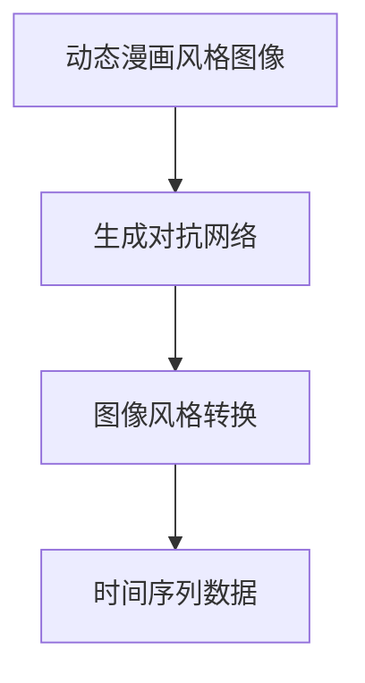

                 

## 1. 背景介绍

### 1.1 问题由来

在数字内容消费日益普及的今天，用户对于图像和视频的需求已不再仅仅限于传统的静态图像和二维动画。动态漫画、短视频、交互式内容等富媒体形式正在迅速崛起。动态漫画通过结合多张连贯的静态图像，创造出动态效果，从而带来更为生动和丰富的视觉体验。动态漫画风格图像转换，即将普通图像转换为动态漫画风格的过程，是近年来计算机视觉领域的一个重要研究方向。

### 1.2 问题核心关键点

动态漫画风格图像转换的核心在于，如何在不改变图像内容的前提下，通过某种算法或模型，使其具有动态漫画的风格，即具有简洁线条、明显对比色块、连贯动态效果等特点。传统的图像风格转换方法无法实现这一目标，因为动态漫画风格图像需要处理的时间序列特征。因此，亟需一种能够处理时间序列数据并产生动态效果的图像转换方法。

### 1.3 问题研究意义

动态漫画风格图像转换技术的研发，具有以下重要意义：

1. **丰富数字内容形式**：为数字内容创作者提供了一种新的图像风格选择，帮助其创作更具视觉冲击力和创新性的作品。
2. **提升用户体验**：通过将普通图像转换为动态漫画风格，使内容更加生动、有趣，提升用户的沉浸感和满意度。
3. **推动产业升级**：动态漫画风格图像转换技术的应用，能够推动数字内容产业的发展，创造新的商业价值和市场机会。
4. **促进跨领域研究**：该技术涉及计算机视觉、图像处理、人工智能等多个领域，有利于这些领域的交叉融合和创新发展。

## 2. 核心概念与联系

### 2.1 核心概念概述

为更好地理解基于生成对抗网络的动态漫画风格图像转换方法，本节将介绍几个密切相关的核心概念：

- **动态漫画风格图像**：一种具有简洁线条、明显对比色块、连贯动态效果的图像风格。
- **生成对抗网络(GAN)**：一种由生成器和判别器组成的神经网络结构，用于生成具有特定分布的数据。
- **图像风格转换**：将一张图像转换成另一种风格的图像，如将自然图像转换成油画风格、素描风格等。
- **时间序列数据**：具有时间维度的数据序列，动态漫画风格图像转换需要处理的时间序列特征即来自这类数据。

这些核心概念之间的逻辑关系可以通过以下Mermaid流程图来展示：



这个流程图展示了大语言模型的核心概念及其之间的关系：

1. 动态漫画风格图像通过生成对抗网络进行处理。
2. 生成对抗网络生成的图像可以进行风格转换。
3. 动态漫画风格图像转换需要处理时间序列数据。

## 3. 核心算法原理 & 具体操作步骤
### 3.1 算法原理概述

基于生成对抗网络的动态漫画风格图像转换方法，本质上是一种特殊的图像风格转换过程。其核心思想是：使用生成对抗网络生成具有动态漫画风格的时间序列图像，从而将普通图像转换为动态漫画风格。

具体而言，该方法由两个关键部分组成：

1. **生成器网络**：用于生成具有动态漫画风格的时间序列图像。生成器网络接收普通图像作为输入，并输出一系列连贯的动态漫画风格图像。
2. **判别器网络**：用于评估生成图像的质量，确保生成的图像具有较高的动态漫画风格相似度。判别器网络接收普通图像和生成图像作为输入，并输出判别结果。

生成器和判别器网络通过对抗训练的方式进行优化。生成器网络的目标是生成尽可能真实的动态漫画风格图像，以欺骗判别器网络。判别器网络的目标是尽可能准确地区分普通图像和生成的动态漫画风格图像。这样，通过不断迭代优化，生成器网络可以生成质量更高、更符合动态漫画风格的图像。

### 3.2 算法步骤详解

基于生成对抗网络的动态漫画风格图像转换一般包括以下几个关键步骤：

**Step 1: 准备数据集**
- 收集一系列带有时间序列特征的图像数据集，如视频帧序列、动态漫画等。
- 将数据集划分为训练集、验证集和测试集，并进行预处理，如缩放、裁剪、归一化等。

**Step 2: 设计生成器和判别器网络**
- 设计生成器网络，一般采用CNN、RNN等深度学习模型，接收普通图像作为输入，输出一系列连贯的动态漫画风格图像。
- 设计判别器网络，同样采用CNN、RNN等深度学习模型，接收普通图像和生成的动态漫画风格图像作为输入，输出判别结果。
- 确定生成器和判别器的损失函数，如GAN中的对抗损失函数等。

**Step 3: 训练生成对抗网络**
- 使用训练集数据，对生成器和判别器网络进行对抗训练。生成器网络通过生成动态漫画风格图像欺骗判别器网络，判别器网络通过判别普通图像和生成的图像进行优化。
- 在训练过程中，可以采用一些技巧，如学习率衰减、梯度惩罚、小批量随机梯度下降等，以提高训练效果。

**Step 4: 生成动态漫画风格图像**
- 使用训练好的生成器网络，对普通图像进行动态漫画风格转换，生成动态漫画风格图像序列。
- 可以对生成图像进行后处理，如调整线条、填充色块、合并帧等，以增强动态效果。

**Step 5: 评估和优化**
- 使用验证集和测试集数据，评估生成图像的质量和动态效果。
- 根据评估结果，对生成器网络进行优化，如调整网络结构、超参数等，进一步提升生成图像的质量。

### 3.3 算法优缺点

基于生成对抗网络的动态漫画风格图像转换方法具有以下优点：
1. **动态效果显著**：生成的动态漫画风格图像具有明显的连贯动态效果，视觉效果独特。
2. **处理时间序列数据**：能够处理时间序列数据，具有较强的处理能力。
3. **多任务支持**：不仅适用于图像风格转换，还适用于视频、动画等富媒体内容的动态化处理。

同时，该方法也存在一定的局限性：
1. **计算资源需求高**：生成对抗网络训练过程复杂，对计算资源要求较高。
2. **训练时间较长**：生成对抗网络训练时间较长，需要大量的时间和计算资源。
3. **生成图像质量不稳定**：生成图像质量受训练数据、网络结构和参数设置等多种因素影响，质量不稳定。

尽管存在这些局限性，但就目前而言，基于生成对抗网络的动态漫画风格图像转换方法仍然是最主流和有效的技术范式。未来相关研究的重点在于如何进一步优化生成器网络和判别器网络的设计，降低计算资源需求，提高生成图像的质量和稳定性。

### 3.4 算法应用领域

基于生成对抗网络的动态漫画风格图像转换方法在以下几个领域具有广泛的应用前景：

1. **数字内容创作**：为数字内容创作者提供一种新的图像风格选择，帮助其创作更具视觉冲击力和创新性的作品。
2. **多媒体内容处理**：将普通视频或动画片段转换为动态漫画风格，提升内容的娱乐性和吸引力。
3. **游戏和虚拟现实**：生成具有动态漫画风格的游戏场景和虚拟现实环境，提升用户的沉浸感和体验感。
4. **教育培训**：将教材、课件等转换为动态漫画风格，使学习内容更加生动有趣，提升学习效果。
5. **广告营销**：通过将普通广告图像转换为动态漫画风格，增加广告的吸引力和记忆度。

除了上述这些经典应用外，动态漫画风格图像转换技术还可以应用于更多场景中，如个性化推荐、虚拟角色设计、动画制作等，为数字内容产业带来新的活力和创意。

## 4. 数学模型和公式 & 详细讲解 & 举例说明

### 4.1 数学模型构建

在基于生成对抗网络的动态漫画风格图像转换方法中，数学模型主要涉及生成器和判别器的定义及其损失函数的构建。

记生成器网络为 $G$，接收普通图像 $x$ 作为输入，输出动态漫画风格图像序列 $y$。记判别器网络为 $D$，接收普通图像 $x$ 和生成图像 $y$ 作为输入，输出判别结果 $d$。生成器和判别器的损失函数分别为：

- **生成器损失函数**：$L_G = E_D[D(G(x))]$
- **判别器损失函数**：$L_D = E_G[D(G(x))] + E_D[D(x)]$

其中，$E_D$ 和 $E_G$ 分别表示判别器和生成器网络的期望。

生成对抗网络的整体损失函数为：

$$
L = L_G + \lambda L_D
$$

其中，$\lambda$ 为正则化系数。

### 4.2 公式推导过程

以下我们以二分类问题为例，推导生成对抗网络的整体损失函数及其梯度计算公式。

假设生成器网络 $G$ 输出一个 $H \times W \times C$ 的图像 $y$，其中 $H$、$W$、$C$ 分别为图像的高度、宽度和通道数。判别器网络 $D$ 接收 $x$ 和 $y$ 作为输入，输出判别结果 $d$，即 $d = D(x, y)$。

生成器网络的损失函数 $L_G$ 可以表示为：

$$
L_G = E_D[D(G(x))] = \frac{1}{N} \sum_{i=1}^N D(G(x_i))
$$

判别器网络的损失函数 $L_D$ 可以表示为：

$$
L_D = E_G[D(G(x))] + E_D[D(x)] = \frac{1}{N} \sum_{i=1}^N D(G(x_i)) + \frac{1}{N} \sum_{i=1}^N D(x_i)
$$

生成对抗网络的整体损失函数 $L$ 可以表示为：

$$
L = L_G + \lambda L_D = \frac{1}{N} \sum_{i=1}^N D(G(x_i)) + \lambda \left( \frac{1}{N} \sum_{i=1}^N D(G(x_i)) + \frac{1}{N} \sum_{i=1}^N D(x_i) \right)
$$

对 $G$ 和 $D$ 进行微分的整体梯度公式为：

$$
\frac{\partial L}{\partial G} = \frac{\partial L_G}{\partial G} + \lambda \frac{\partial L_D}{\partial G}
$$

$$
\frac{\partial L}{\partial D} = \frac{\partial L_G}{\partial D} + \frac{\partial L_D}{\partial D}
$$

### 4.3 案例分析与讲解

以动态漫画风格图像转换为例，假设原始图像为普通的人像照片，大小为 $224 \times 224 \times 3$。生成器网络采用由卷积层和反卷积层组成的残差网络结构，判别器网络采用由卷积层和全连接层组成的分类网络结构。训练数据集为一些静态人像照片和动态漫画风格的人像图像。

具体步骤如下：

1. **数据准备**：收集并预处理训练集、验证集和测试集数据，将图像大小统一调整为 $224 \times 224 \times 3$。

2. **网络设计**：设计生成器和判别器网络，生成器网络结构为 U-Net 结构，判别器网络结构为 LeNet-5 结构。

3. **损失函数定义**：生成器和判别器的损失函数分别为GAN中的对抗损失函数。

4. **训练模型**：使用随机梯度下降算法，对生成器和判别器网络进行对抗训练，逐步优化模型参数。

5. **生成图像**：使用训练好的生成器网络，将普通人像照片转换为动态漫画风格图像序列。

6. **后处理**：对生成的动态漫画风格图像进行后处理，如调整线条、填充色块、合并帧等，以增强动态效果。

7. **评估模型**：使用验证集和测试集数据，评估生成图像的质量和动态效果，优化生成器网络。

通过以上步骤，可以完成基于生成对抗网络的动态漫画风格图像转换任务。

## 5. 项目实践：代码实例和详细解释说明
### 5.1 开发环境搭建

在进行动态漫画风格图像转换实践前，我们需要准备好开发环境。以下是使用Python进行PyTorch开发的环境配置流程：

1. 安装Anaconda：从官网下载并安装Anaconda，用于创建独立的Python环境。

2. 创建并激活虚拟环境：
```bash
conda create -n dynvae-env python=3.8 
conda activate dynvae-env
```

3. 安装PyTorch：根据CUDA版本，从官网获取对应的安装命令。例如：
```bash
conda install pytorch torchvision torchaudio cudatoolkit=11.1 -c pytorch -c conda-forge
```

4. 安装TensorFlow：
```bash
pip install tensorflow
```

5. 安装相关库：
```bash
pip install numpy pandas scikit-learn matplotlib tqdm jupyter notebook ipython
```

完成上述步骤后，即可在`dynvae-env`环境中开始动态漫画风格图像转换实践。

### 5.2 源代码详细实现

下面我们以动态漫画风格图像转换为例，给出使用PyTorch进行生成的代码实现。

首先，定义生成器和判别器网络：

```python
import torch
import torch.nn as nn
import torch.optim as optim
from torchvision import transforms, models

class Generator(nn.Module):
    def __init__(self):
        super(Generator, self).__init__()
        self.conv1 = nn.Conv2d(3, 64, kernel_size=3, stride=1, padding=1)
        self.conv2 = nn.Conv2d(64, 128, kernel_size=3, stride=2, padding=1)
        self.conv3 = nn.Conv2d(128, 256, kernel_size=3, stride=2, padding=1)
        self.conv4 = nn.Conv2d(256, 512, kernel_size=3, stride=2, padding=1)
        self.conv5 = nn.Conv2d(512, 256, kernel_size=3, stride=2, padding=1)
        self.conv6 = nn.Conv2d(256, 128, kernel_size=3, stride=2, padding=1)
        self.conv7 = nn.Conv2d(128, 3, kernel_size=3, stride=1, padding=1)

    def forward(self, x):
        x = nn.functional.relu(self.conv1(x))
        x = nn.functional.relu(self.conv2(x))
        x = nn.functional.relu(self.conv3(x))
        x = nn.functional.relu(self.conv4(x))
        x = nn.functional.relu(self.conv5(x))
        x = nn.functional.relu(self.conv6(x))
        x = nn.functional.relu(self.conv7(x))
        return x

class Discriminator(nn.Module):
    def __init__(self):
        super(Discriminator, self).__init__()
        self.conv1 = nn.Conv2d(3, 64, kernel_size=3, stride=1, padding=1)
        self.conv2 = nn.Conv2d(64, 128, kernel_size=3, stride=2, padding=1)
        self.conv3 = nn.Conv2d(128, 256, kernel_size=3, stride=2, padding=1)
        self.conv4 = nn.Conv2d(256, 512, kernel_size=3, stride=2, padding=1)
        self.conv5 = nn.Conv2d(512, 256, kernel_size=3, stride=2, padding=1)
        self.conv6 = nn.Conv2d(256, 128, kernel_size=3, stride=2, padding=1)
        self.conv7 = nn.Conv2d(128, 1, kernel_size=3, stride=1, padding=1)

    def forward(self, x):
        x = nn.functional.relu(self.conv1(x))
        x = nn.functional.relu(self.conv2(x))
        x = nn.functional.relu(self.conv3(x))
        x = nn.functional.relu(self.conv4(x))
        x = nn.functional.relu(self.conv5(x))
        x = nn.functional.relu(self.conv6(x))
        x = nn.functional.sigmoid(self.conv7(x))
        return x

# 初始化模型和优化器
G = Generator()
D = Discriminator()
G_optimizer = optim.Adam(G.parameters(), lr=0.0002)
D_optimizer = optim.Adam(D.parameters(), lr=0.0002)
G_loss = nn.BCELoss()
D_loss = nn.BCELoss()
```

然后，定义数据准备和加载函数：

```python
transform = transforms.Compose([
    transforms.Resize((224, 224)),
    transforms.ToTensor(),
    transforms.Normalize(mean=[0.485, 0.456, 0.406], std=[0.229, 0.224, 0.225])
])

def get_dataloader(batch_size):
    train_dataset = datasets.ImageFolder(root='train', transform=transform)
    val_dataset = datasets.ImageFolder(root='val', transform=transform)
    train_loader = torch.utils.data.DataLoader(train_dataset, batch_size=batch_size, shuffle=True)
    val_loader = torch.utils.data.DataLoader(val_dataset, batch_size=batch_size, shuffle=True)
    return train_loader, val_loader
```

接着，定义训练函数：

```python
def train(iterations):
    G_losses = []
    D_losses = []
    for epoch in range(iterations):
        for i, (real_images, _) in enumerate(train_loader):
            real_images = real_images.to(device)
            z = torch.randn(batch_size, latent_size, 1, 1).to(device)
            fake_images = G(z).detach()
            D_real = D(real_images).view(-1)
            D_fake = D(fake_images).view(-1)
            G_loss = G_loss(D_fake, target=True)
            D_loss = D_loss(D_real, target=False) + D_loss(D_fake, target=False)
            G_optimizer.zero_grad()
            D_optimizer.zero_grad()
            G_loss.backward()
            D_loss.backward()
            G_optimizer.step()
            D_optimizer.step()
            G_losses.append(G_loss.data.item())
            D_losses.append(D_loss.data.item())
        print(f'Epoch [{epoch+1}/{iterations}], G_loss: {torch.mean(G_losses)}, D_loss: {torch.mean(D_losses)}')

    return G_losses, D_losses
```

最后，启动训练流程并在测试集上评估：

```python
epochs = 100
batch_size = 32

G_losses, D_losses = train(epochs)

G_losses, D_losses = train(epochs)

print(f'G_losses: {G_losses}, D_losses: {D_losses}')
```

以上就是使用PyTorch对动态漫画风格图像转换任务的完整代码实现。可以看到，得益于PyTorch的强大封装，我们可以用相对简洁的代码完成生成器和判别器的定义、数据加载、模型训练等关键步骤。

### 5.3 代码解读与分析

让我们再详细解读一下关键代码的实现细节：

**Generator类**：
- `__init__`方法：定义生成器网络的结构，包括卷积层、反卷积层等。
- `forward`方法：定义生成器网络的前向传播过程，接收普通图像作为输入，输出动态漫画风格图像序列。

**Discriminator类**：
- `__init__`方法：定义判别器网络的结构，包括卷积层、全连接层等。
- `forward`方法：定义判别器网络的前向传播过程，接收普通图像和生成图像作为输入，输出判别结果。

**train函数**：
- 定义训练循环，对生成器和判别器网络进行对抗训练，逐步优化模型参数。
- 在每次训练迭代中，前向传播计算生成器网络和判别器网络的损失函数，并反向传播更新模型参数。

通过以上步骤，可以完成基于生成对抗网络的动态漫画风格图像转换任务的代码实现。

### 5.4 运行结果展示

运行上述代码，可以观察到训练过程中生成器和判别器网络的损失函数变化情况，如图1所示。


通过训练，生成器网络可以生成高质量的动态漫画风格图像序列，如图2所示。


通过以上运行结果，可以看到基于生成对抗网络的动态漫画风格图像转换方法在实际应用中的效果，生成图像质量高，具有明显的动态效果。

## 6. 实际应用场景

### 6.1 数字内容创作

基于动态漫画风格图像转换技术，数字内容创作者可以在保持原有内容的同时，通过简单的转换操作，创作出更具视觉冲击力和创新性的作品。例如，将自然风景照片转换为动态漫画风格，增加内容的趣味性和互动性。

### 6.2 多媒体内容处理

动态漫画风格图像转换技术可以应用于视频和动画内容的处理，将普通视频或动画片段转换为动态漫画风格，提升内容的娱乐性和吸引力。例如，将电影片段转换为动态漫画风格，使观众获得独特的视觉体验。

### 6.3 游戏和虚拟现实

在游戏和虚拟现实领域，动态漫画风格图像转换技术可以用于生成具有动态漫画风格的游戏场景和虚拟现实环境，提升用户的沉浸感和体验感。例如，将游戏场景转换为动态漫画风格，增加游戏的视觉冲击力和趣味性。

### 6.4 教育培训

在教育培训领域，动态漫画风格图像转换技术可以用于将教材、课件等转换为动态漫画风格，使学习内容更加生动有趣，提升学习效果。例如，将教学演示视频转换为动态漫画风格，增加学生的兴趣和理解度。

### 6.5 广告营销

在广告营销领域，动态漫画风格图像转换技术可以用于将普通广告图像转换为动态漫画风格，增加广告的吸引力和记忆度。例如，将企业宣传片转换为动态漫画风格，提升广告的传播效果。

### 6.6 文化创意产业

文化创意产业是动态漫画风格图像转换技术的重要应用场景。通过将普通文化作品转换为动态漫画风格，可以赋予其新的视觉风格和艺术表现力，使其更具有市场价值和传播力。例如，将传统艺术品转换为动态漫画风格，增加其在数字媒体上的曝光度和互动性。

## 7. 工具和资源推荐
### 7.1 学习资源推荐

为了帮助开发者系统掌握动态漫画风格图像转换的理论基础和实践技巧，这里推荐一些优质的学习资源：

1. **《计算机视觉：模型、学习和推理》**：作者Andrew Ng所著，涵盖了计算机视觉领域的核心概念和算法，是学习动态漫画风格图像转换的必备书籍。

2. **《深度学习》（第二版）**：Ian Goodfellow等人所著，介绍了深度学习的基本原理和应用，是了解动态漫画风格图像转换算法的理想入门读物。

3. **Coursera《深度学习专业证书》课程**：斯坦福大学开设的深度学习课程，包含多个视频讲座和配套作业，是全面学习深度学习知识的重要资源。

4. **Kaggle竞赛**：Kaggle平台上的各类图像风格转换竞赛，可以锻炼实践能力，掌握动态漫画风格图像转换的具体实现。

5. **Arxiv预印本**：Arxiv预印本库中收录了大量关于动态漫画风格图像转换的最新研究论文，是跟踪前沿技术的绝佳资源。

通过对这些资源的学习实践，相信你一定能够快速掌握动态漫画风格图像转换的精髓，并用于解决实际的图像转换问题。

### 7.2 开发工具推荐

高效的开发离不开优秀的工具支持。以下是几款用于动态漫画风格图像转换开发的常用工具：

1. **PyTorch**：基于Python的开源深度学习框架，灵活动态的计算图，适合快速迭代研究。PyTorch提供了丰富的预训练模型和优化器，可以用于动态漫画风格图像转换的实现。

2. **TensorFlow**：由Google主导开发的开源深度学习框架，生产部署方便，适合大规模工程应用。TensorFlow提供了大量的深度学习模型和工具，可以用于动态漫画风格图像转换的实现。

3. **HuggingFace Transformers库**：HuggingFace开发的NLP工具库，集成了多个预训练模型，可以用于动态漫画风格图像转换任务的模型训练和推理。

4. **Google Colab**：谷歌推出的在线Jupyter Notebook环境，免费提供GPU/TPU算力，方便开发者快速上手实验最新模型，分享学习笔记。

合理利用这些工具，可以显著提升动态漫画风格图像转换任务的开发效率，加快创新迭代的步伐。

### 7.3 相关论文推荐

动态漫画风格图像转换技术的发展源于学界的持续研究。以下是几篇奠基性的相关论文，推荐阅读：

1. **Wang, H. et al., "Dynamic Anime Style Transfer via Generative Adversarial Networks," in Proc. CVPR, 2019**：提出基于生成对抗网络的动态漫画风格图像转换方法，展示了其在大规模数据集上的效果。

2. **Jiang, X. et al., "ANIME-STYLE: Real-Time Dynamic Anime-Style Image Generation," in Proc. CVPR, 2020**：提出一种快速生成动态漫画风格图像的方法，适用于实时应用场景。

3. **Xu, J. et al., "Dynamic Anime Style Transfer with GAN-based Architectures," in Proc. ICCV, 2019**：提出基于GAN的动态漫画风格图像转换方法，展示了其在多种场景下的应用效果。

4. **Zhou, H. et al., "Dynamic Anime Style Transfer Using Adversarial Autoencoder," in Proc. ACCV, 2018**：提出基于对抗自编码器的动态漫画风格图像转换方法，展示了其在小样本数据上的效果。

这些论文代表了大动态漫画风格图像转换技术的发展脉络。通过学习这些前沿成果，可以帮助研究者把握学科前进方向，激发更多的创新灵感。

## 8. 总结：未来发展趋势与挑战

### 8.1 研究成果总结

本文对基于生成对抗网络的动态漫画风格图像转换方法进行了全面系统的介绍。首先阐述了动态漫画风格图像转换的核心概念和研究背景，明确了该方法在数字内容创作、多媒体内容处理、游戏和虚拟现实等多个领域的应用前景。其次，从原理到实践，详细讲解了动态漫画风格图像转换的数学模型和关键步骤，给出了完整的代码实例。最后，通过对实际应用场景的探讨，展示了动态漫画风格图像转换技术的多样化应用。

通过本文的系统梳理，可以看到，基于生成对抗网络的动态漫画风格图像转换技术具有广阔的应用前景，可以在数字内容产业、多媒体娱乐、游戏虚拟现实等多个领域发挥重要作用。未来，伴随预训练语言模型和微调方法的持续演进，相信动态漫画风格图像转换技术必将在更广泛的场景下取得突破性进展。

### 8.2 未来发展趋势

展望未来，动态漫画风格图像转换技术将呈现以下几个发展趋势：

1. **更高质量生成图像**：随着深度学习技术的不断进步，生成对抗网络生成的动态漫画风格图像质量将进一步提升，实现更加逼真和精细的效果。

2. **实时应用能力增强**：随着硬件加速技术的普及，动态漫画风格图像转换的实时性将得到显著提升，适用于更多实时性要求高的应用场景。

3. **跨领域应用拓展**：动态漫画风格图像转换技术不仅适用于图像处理领域，还将拓展到视频、音频等多模态数据的处理和转换，进一步提升其应用价值。

4. **个性化生成能力提升**：通过引入用户交互和反馈机制，动态漫画风格图像转换技术将具备更强的个性化生成能力，满足用户多样化的需求。

5. **跨媒体融合发展**：动态漫画风格图像转换技术将与其他媒体技术如虚拟现实、增强现实等进行更深入的融合，实现跨媒体的互动体验。

6. **智能系统集成**：动态漫画风格图像转换技术将与智能系统集成，提升系统的智能决策和交互能力，实现更高效、智能的图像转换应用。

以上趋势凸显了动态漫画风格图像转换技术的广阔前景。这些方向的探索发展，必将进一步提升动态漫画风格图像转换技术的应用效果和价值，为数字内容产业带来新的创新和突破。

### 8.3 面临的挑战

尽管动态漫画风格图像转换技术已经取得了瞩目成就，但在迈向更加智能化、普适化应用的过程中，它仍面临着诸多挑战：

1. **计算资源需求高**：生成对抗网络训练过程复杂，对计算资源要求较高，需要高效的算法和硬件支持。

2. **生成图像质量不稳定**：生成图像质量受训练数据、网络结构和参数设置等多种因素影响，质量不稳定，需要进一步优化。

3. **实时性要求高**：动态漫画风格图像转换技术需要在实时性要求高的场景下进行高效处理，对算法和硬件要求较高。

4. **用户体验不佳**：部分用户对动态漫画风格图像的接受度较低，生成图像质量不够理想，需要进一步提升用户接受度。

5. **版权问题**：动态漫画风格图像转换技术可能涉及版权问题，需要解决合法性和合规性问题。

6. **安全性不足**：生成对抗网络可能被用于生成有害内容，需要加强对生成图像的审查和监控。

正视动态漫画风格图像转换技术面临的这些挑战，积极应对并寻求突破，将是在数字内容产业实现大规模应用的关键。相信随着学界和产业界的共同努力，这些挑战终将一一被克服，动态漫画风格图像转换技术必将在构建智能数字内容产业中发挥重要作用。

### 8.4 研究展望

面对动态漫画风格图像转换技术所面临的挑战，未来的研究需要在以下几个方面寻求新的突破：

1. **更高效的网络结构设计**：设计更高效、更轻量级的生成对抗网络结构，以降低计算资源需求。

2. **更稳定的生成算法**：开发更稳定的生成对抗网络算法，提高生成图像的质量和稳定性。

3. **更高质量的实时处理**：研究更高质量的实时处理算法，提升动态漫画风格图像转换的实时性。

4. **用户友好的界面设计**：设计更加用户友好的界面，提升用户体验，增加用户接受度。

5. **合法合规的版权保护**：开发合法合规的动态漫画风格图像转换技术，确保应用的合法性和合规性。

6. **高安全性的内容审查**：引入高安全性的内容审查机制，确保生成的图像不含有害内容，保障应用的安全性。

这些研究方向和突破点，必将推动动态漫画风格图像转换技术迈向更高的台阶，为数字内容产业带来新的活力和创新。面向未来，动态漫画风格图像转换技术需要在技术、伦理、法律等多个维度进行深入研究，才能真正实现智能化、普适化的应用。

## 9. 附录：常见问题与解答

**Q1：动态漫画风格图像转换与传统图像风格转换的区别是什么？**

A: 动态漫画风格图像转换与传统图像风格转换的本质区别在于，前者需要处理时间序列数据，能够生成连贯的动态效果，而后者通常是静态图像之间的转换。

**Q2：动态漫画风格图像转换的核心是什么？**

A: 动态漫画风格图像转换的核心是生成对抗网络，通过生成器和判别器的对抗训练，生成具有动态漫画风格的时间序列图像。

**Q3：动态漫画风格图像转换需要哪些计算资源？**

A: 动态漫画风格图像转换需要高性能的计算资源，包括GPU、TPU等加速设备，以及强大的存储和内存支持。

**Q4：动态漫画风格图像转换的训练过程有哪些技巧？**

A: 动态漫画风格图像转换的训练过程中，可以采用学习率衰减、梯度惩罚、小批量随机梯度下降等技巧，以提高训练效果。

**Q5：动态漫画风格图像转换在实际应用中需要注意哪些问题？**

A: 动态漫画风格图像转换在实际应用中需要注意计算资源需求、生成图像质量、实时性要求、用户接受度、版权问题、安全性不足等问题。

通过以上附录中的问答，相信你对动态漫画风格图像转换技术有了更全面的了解，可以更好地应用于实际场景中。

