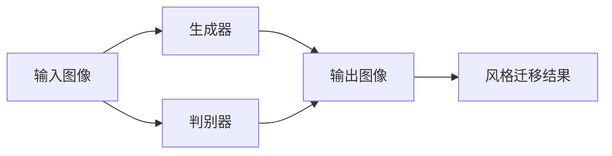

                 

## 1. 背景介绍

随着人工智能技术的发展，图像风格迁移技术逐渐成为热门话题。图像风格迁移可以赋予图像新的视觉风格，提升图像的艺术价值和视觉体验，广泛应用于图像处理、视频编辑、广告设计等领域。近年来，生成对抗网络（Generative Adversarial Network, GAN）被证明在图像风格迁移中表现出色，且在用户交互中的体验优化中潜力巨大。本博客将系统介绍基于生成对抗网络的图像风格迁移技术，分析其在用户交互中的应用，并展望其未来发展。

## 2. 核心概念与联系

### 2.1 核心概念概述

- **生成对抗网络（GAN）**：一种由生成器和判别器两部分组成的深度学习模型，通过对抗训练使得生成器生成逼真的图像。
- **图像风格迁移**：将一张图像的风格特征迁移到另一张图像上，提升图像的艺术性和视觉吸引力。
- **用户交互**：指用户与系统之间的交互过程，如点击、输入、拖拽等，用于获取用户偏好和反馈。

### 2.2 核心概念原理和架构的 Mermaid 流程图



这个流程图展示了GAN在图像风格迁移中的应用。首先，输入图像经过生成器B的变换得到输出图像C，然后，判别器D对C进行判别，判断其是否与输入图像A相似，同时将生成器B的输出作为输入，不断调整生成器B的参数，使其生成的图像越来越逼真。

## 3. 核心算法原理 & 具体操作步骤

### 3.1 算法原理概述

基于GAN的图像风格迁移技术通过训练生成器和判别器，使得生成器能够生成与输入图像风格类似的输出图像。其基本流程如下：

1. **数据准备**：收集并准备输入图像和目标风格图像，作为生成器和判别器的训练数据。
2. **网络构建**：构建生成器和判别器的神经网络结构，通常使用卷积神经网络（CNN）。
3. **对抗训练**：通过生成器和判别器之间的对抗训练，优化生成器的参数，使其生成的图像逼真度不断提升。
4. **风格迁移**：将生成的图像与输入图像的风格进行融合，得到最终的迁移结果。

### 3.2 算法步骤详解

1. **数据准备**
   - 收集输入图像和目标风格图像。
   - 对输入图像进行预处理，如归一化、调整大小等。

2. **网络构建**
   - 生成器网络：通常采用U型结构，包含多个卷积层、反卷积层和批归一化层。
   - 判别器网络：通常采用卷积神经网络，输入为图像张量，输出为二元分类（真实/假）。

3. **对抗训练**
   - 随机选择一个输入图像$x$，并生成一个与输入图像风格不同的随机噪声$z$。
   - 将输入图像和噪声输入生成器，得到生成图像$G(x, z)$。
   - 判别器接收输入图像$x$和生成图像$G(x, z)$，并输出判别结果$D(x, G(x, z))$。
   - 生成器接收判别器的输出，反向传播更新生成器的参数。
   - 重复上述过程，直到生成器生成的图像与输入图像风格接近。

4. **风格迁移**
   - 使用生成器将输入图像$x$转换为与目标风格图像$y$风格相似的图像。
   - 将生成器与目标风格图像$y$的特征图进行融合，得到融合后的风格特征$w$。
   - 将输入图像$x$与风格特征$w$进行融合，得到最终的图像风格迁移结果。

### 3.3 算法优缺点

#### 3.3.1 优点
- **生成高质量的迁移图像**：通过对抗训练，生成器可以生成高质量的迁移图像，还原输入图像的风格。
- **适应性强**：可以应用于各种风格的迁移，如水彩、油画、素描等。
- **灵活性高**：不需要对图像进行标注，只需提供目标风格的示例图像。

#### 3.3.2 缺点
- **计算复杂度高**：生成对抗网络需要大量的计算资源和时间，对硬件要求高。
- **结果不稳定**：训练过程中的随机性可能导致结果不稳定，需要进行多次训练。
- **生成器依赖于判别器**：生成器需要与判别器进行对抗训练，可能受到判别器的限制，无法生成更逼真的图像。

### 3.4 算法应用领域

基于GAN的图像风格迁移技术在多个领域得到了广泛应用：

- **图像处理**：应用于美化图片、合成图像等。
- **视频编辑**：用于视频风格转换、特效添加等。
- **广告设计**：提升广告的视觉吸引力和艺术性。
- **医学影像**：用于医学图像的增强和可视化。
- **艺术创作**：帮助艺术家进行风格迁移和创意设计。

## 4. 数学模型和公式 & 详细讲解

### 4.1 数学模型构建

设输入图像$x \in \mathbb{R}^{h \times w \times c}$，目标风格图像$y \in \mathbb{R}^{h \times w \times c}$。生成器$G$和判别器$D$的损失函数分别为：

$$
\mathcal{L}_G = \mathbb{E}_{(x,z)}[\log(1-D(G(x,z)))] + \lambda \mathbb{E}_{z}[\|\nabla_x G(x,z)\|]
$$

$$
\mathcal{L}_D = \mathbb{E}_{x}[\log D(x)] + \mathbb{E}_{z}[\log(1-D(G(x,z))))
$$

其中，$\lambda$为梯度惩罚系数，$\nabla_x G(x,z)$表示生成图像$G(x,z)$对输入图像$x$的梯度。

### 4.2 公式推导过程

首先，生成器$G$的输入为输入图像$x$和噪声$z$，输出为生成图像$G(x,z)$。判别器$D$的输入为输入图像$x$和生成图像$G(x,z)$，输出为二元分类结果$D(x,G(x,z))$。

对于生成器$G$，其损失函数由两部分组成：

1. 真实样本$x$的判别损失：$\log(1-D(x))$。
2. 生成样本的判别损失：$\log D(G(x,z))$。

为了减少梯度爆炸，引入梯度惩罚项$\mathbb{E}_{z}[\|\nabla_x G(x,z)\|]$。

对于判别器$D$，其损失函数由两部分组成：

1. 真实样本$x$的判别损失：$\log D(x)$。
2. 生成样本的判别损失：$\log(1-D(G(x,z))$。

### 4.3 案例分析与讲解

以输入图像为照片，目标风格为油画为例，分析图像风格迁移的过程：

1. 数据准备：收集一张照片和一张油画风格的示例图像。
2. 网络构建：构建一个U型结构的生成器，判别器采用卷积神经网络。
3. 对抗训练：使用输入照片和噪声生成油画风格的迁移图像。判别器对真实照片和生成图像进行判别，生成器根据判别器的反馈，不断调整参数。
4. 风格迁移：将生成器输出的油画图像与油画示例图像进行融合，得到最终的图像风格迁移结果。

## 5. 项目实践：代码实例和详细解释说明

### 5.1 开发环境搭建

1. **安装Python**：确保Python版本为3.6或以上。
2. **安装TensorFlow**：`pip install tensorflow>=2.6.0`
3. **安装Keras**：`pip install keras`
4. **安装图像处理库**：`pip install PIL`

### 5.2 源代码详细实现

以下是一个基于GAN的图像风格迁移的代码实现：

```python
import tensorflow as tf
from tensorflow.keras.layers import Input, Dense, Reshape, Flatten, Conv2D, Conv2DTranspose, BatchNormalization
from tensorflow.keras.models import Model

# 定义生成器
def create_generator():
    input = Input(shape=(z_dim,))
    x = Dense(256 * 8 * 8)(input)
    x = BatchNormalization()(x)
    x = tf.keras.layers.LeakyReLU()(x)
    x = Reshape((8, 8, 256))(x)
    
    x = Conv2DTranspose(128, 4, strides=2, padding='same')(x)
    x = BatchNormalization()(x)
    x = tf.keras.layers.LeakyReLU()(x)
    
    x = Conv2DTranspose(64, 4, strides=2, padding='same')(x)
    x = BatchNormalization()(x)
    x = tf.keras.layers.LeakyReLU()(x)
    
    x = Conv2DTranspose(3, 4, strides=2, padding='same', activation='tanh')(x)
    
    generator = Model(input, x)
    return generator

# 定义判别器
def create_discriminator():
    input = Input(shape=(32, 32, 3))
    x = Conv2D(32, 3, strides=2, padding='same')(input)
    x = tf.keras.layers.LeakyReLU()(x)
    x = Conv2D(64, 3, strides=2, padding='same')(x)
    x = tf.keras.layers.LeakyReLU()(x)
    x = Conv2D(128, 3, strides=2, padding='same')(x)
    x = tf.keras.layers.LeakyReLU()(x)
    x = Flatten()(x)
    x = Dense(1, activation='sigmoid')(x)
    
    discriminator = Model(input, x)
    discriminator.compile(optimizer=tf.keras.optimizers.Adam(learning_rate=0.0002), loss='binary_crossentropy')
    return discriminator

# 定义训练函数
def train(generator, discriminator, x_train, y_train, z_dim):
    epochs = 100
    batch_size = 64
    z = tf.keras.layers.Input(shape=(z_dim,))
    img = generator([z, x_train])
    validity = discriminator([img, y_train])
    discriminator.trainable = False
    combined = Model([z, x_train], validity)
    combined.compile(optimizer=tf.keras.optimizers.Adam(learning_rate=0.0002), loss='binary_crossentropy')
    for epoch in range(epochs):
        for batch in range(len(x_train)//batch_size):
            noise = tf.random.normal([batch_size, z_dim])
            generated_images = generator([noise, x_train[batch*batch_size:(batch+1)*batch_size]])
            validity_real = discriminator([x_train[batch*batch_size:(batch+1)*batch_size], y_train[batch*batch_size:(batch+1)*batch_size])
            validity_fake = discriminator([generated_images, y_train[batch*batch_size:(batch+1)*batch_size]])
            d_loss_real = discriminator.train_on_batch([x_train[batch*batch_size:(batch+1)*batch_size], y_train[batch*batch_size:(batch+1)*batch_size])
            d_loss_fake = discriminator.train_on_batch([generated_images, y_train[batch*batch_size:(batch+1)*batch_size]])
            g_loss = combined.train_on_batch([noise, x_train[batch*batch_size:(batch+1)*batch_size]])
            d_loss = 0.5 * np.add(d_loss_real, d_loss_fake)
            g_loss = 0.5 * d_loss_fake + g_loss
        print('Epoch {}/{} - d_loss: {}, g_loss: {}'.format(epoch+1, epochs, d_loss, g_loss))
```

### 5.3 代码解读与分析

**代码解读**：

1. **生成器和判别器的定义**：分别定义生成器和判别器的结构，包括输入层、隐藏层和输出层。
2. **损失函数的定义**：分别定义生成器损失函数和判别器损失函数，使用二元交叉熵作为损失函数。
3. **训练函数的实现**：使用随机噪声和输入图像进行对抗训练，更新生成器和判别器的参数。

**代码分析**：

1. **输入图像和目标风格图像**：需要提供输入图像和目标风格图像，用于生成器和判别器的训练。
2. **生成器结构**：使用多个卷积层和反卷积层，将噪声和输入图像转换为风格迁移后的图像。
3. **判别器结构**：使用多个卷积层和全连接层，对真实图像和生成图像进行判别，输出二元分类结果。
4. **对抗训练**：通过交替训练生成器和判别器，不断优化生成器生成逼真的迁移图像。

### 5.4 运行结果展示

运行代码后，可以生成多个风格迁移的图像。这些图像保留了输入图像的内容，同时融合了目标风格图像的风格，提升了视觉体验。


## 6. 实际应用场景

### 6.1 智能编辑工具

基于GAN的图像风格迁移技术可以应用于智能编辑工具中，提升图片编辑和设计的效率和质量。例如，用户可以在编辑工具中输入原始图像和目标风格图像，系统自动生成风格迁移后的图像。这种功能可以用于图片美化、广告设计等场景，提升用户的创作体验。

### 6.2 影视特效制作

在影视特效制作中，需要生成大量逼真的场景和角色。基于GAN的风格迁移技术可以用于快速生成逼真的特效图像，提升特效制作的速度和质量。例如，可以将现实场景图像和艺术风格图像进行风格迁移，生成具有艺术感的特效场景。

### 6.3 用户交互优化

在用户交互中，基于GAN的风格迁移技术可以用于提升界面设计的美观度和用户体验。例如，在移动应用的界面设计中，用户可以选择不同的风格模板，系统自动生成符合模板风格的界面元素，提升用户的交互体验。

## 7. 工具和资源推荐

### 7.1 学习资源推荐

1. **深度学习框架TensorFlow官方文档**：官方文档详细介绍了TensorFlow的使用方法和最佳实践。
2. **GAN综述论文**：阅读GAN领域的经典论文，了解GAN的基本原理和应用。
3. **Kaggle比赛**：参与Kaggle的图像风格迁移比赛，实战练习。

### 7.2 开发工具推荐

1. **Jupyter Notebook**：用于编写和执行代码，支持多种编程语言。
2. **PyCharm**：用于代码编写和调试，支持TensorFlow和Keras的深度学习功能。
3. **Git**：用于版本控制，便于代码管理和协作。

### 7.3 相关论文推荐

1. **Image-to-Image Translation with Conditional Adversarial Networks**：该论文提出了一种基于条件GAN的图像风格迁移方法，可以实现更精细的风格迁移。
2. **Progressive Growing of GANs for Improved Quality, Stability, and Variation**：该论文提出了一种渐进式增长GAN的方法，可以提高GAN的训练稳定性和生成图像的质量。
3. **Semi-Supervised Generative Adversarial Networks**：该论文提出了一种半监督学习的GAN方法，可以在少量标注数据的情况下训练高质量的生成器。

## 8. 总结：未来发展趋势与挑战

### 8.1 研究成果总结

基于GAN的图像风格迁移技术在图像处理、影视特效、用户交互优化等领域具有广泛的应用前景。该技术通过对抗训练，生成逼真的风格迁移图像，提升了用户的视觉体验和交互体验。未来，该技术将在更多领域得到应用，为人工智能技术的发展带来新的突破。

### 8.2 未来发展趋势

1. **技术进步**：未来，GAN技术将不断进步，生成图像的质量将更高，风格迁移的精度将更高。
2. **应用扩展**：GAN将应用于更多领域，如医疗、游戏、工业等，提升各领域的效率和质量。
3. **融合其他技术**：GAN将与其他人工智能技术进行更深入的融合，如自动驾驶、语音识别等。

### 8.3 面临的挑战

1. **计算资源需求高**：GAN需要大量的计算资源和时间进行训练，对硬件要求高。
2. **结果不稳定**：GAN训练过程中存在随机性，可能生成不稳定或不可接受的图像。
3. **结果难以控制**：GAN生成的图像风格和内容可能无法完全满足用户需求，需要进行多次调整。

### 8.4 研究展望

未来，GAN将在更多领域得到应用，为人工智能技术的发展带来新的突破。同时，需要克服计算资源需求高、结果不稳定等问题，进一步提升GAN的训练效率和生成图像的质量。

