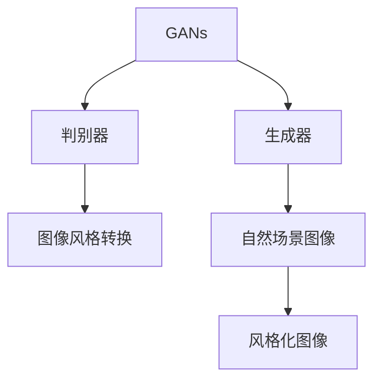

                 

# 基于生成对抗网络的自然场景风格化图像生成研究

> 关键词：生成对抗网络,自然场景,风格化图像生成,图像风格转换,图像生成对抗网络,GANs

## 1. 背景介绍

### 1.1 问题由来

随着深度学习技术的不断发展，图像生成技术成为了人工智能领域的一个热门研究方向。自然场景风格化图像生成，是指将一张普通图像转换为另一种风格的图像，如将照片转换为油画、素描等风格。这一技术在艺术创作、广告设计、虚拟现实、电影特效等领域有着广泛的应用前景。

生成对抗网络（Generative Adversarial Networks, GANs）是一类基于对抗机制的深度学习模型，能够在生成样本和鉴别真实与假样本之间进行对抗性训练。GANs的成功激发了人们对于图像生成、风格转换等任务的兴趣。当前，GANs在图像生成领域已经取得了显著的成果，如ImageNet中的图像生成模型、风格化图像生成模型等。然而，自然场景风格化图像生成仍然是一个极具挑战性的问题，需要进一步的研究和探索。

### 1.2 问题核心关键点

自然场景风格化图像生成问题的核心关键点在于：

- 高质量风格转换：在保留原始图像语义信息的前提下，生成具有不同风格的新图像。
- 大尺度数据训练：需要大规模的真实场景图像和风格化的图像数据来训练模型。
- 多样化的风格类型：能够生成多种不同风格的图像，如油画、素描、水彩、版画等。
- 高效的生成速度：在保证高质量的前提下，需要模型能够快速生成图像。
- 可解释性和鲁棒性：生成的图像需要具有较好的可解释性，能够抵抗不同的扰动和攻击。

## 2. 核心概念与联系

### 2.1 核心概念概述

为更好地理解基于生成对抗网络的自然场景风格化图像生成方法，本节将介绍几个密切相关的核心概念：

- 生成对抗网络（GANs）：一种由两个神经网络组成的学习模型，通过对抗性训练生成逼真的图像。GANs由生成器（Generator）和判别器（Discriminator）两部分组成。生成器通过噪声向量生成图像，判别器区分真实图像和生成图像。
- 自然场景图像：指包含自然界中的各种元素，如天空、地面、建筑物、树木等的图像。
- 风格化图像生成：指将普通图像转换为另一种风格的图像，如将照片转换为油画、素描等风格。
- 图像风格转换：指将一张图像转换为另一种风格的图像，保留其内容，仅改变其风格。

这些核心概念之间的逻辑关系可以通过以下Mermaid流程图来展示：



这个流程图展示了大语言模型的核心概念及其之间的关系：

1. GANs由生成器和判别器组成。
2. 生成器负责将随机噪声转换为逼真的图像。
3. 判别器负责区分真实图像和生成图像。
4. 风格化图像生成和转换是基于GANs技术的核心应用之一。
5. 自然场景图像是风格化图像生成的主要输入。

## 3. 核心算法原理 & 具体操作步骤
### 3.1 算法原理概述

基于生成对抗网络的自然场景风格化图像生成，其核心思想是通过生成器和判别器之间的对抗性训练，生成具有特定风格的图像。具体步骤如下：

1. 数据准备：准备包含自然场景图像和风格化图像的数据集，用于训练生成器和判别器。
2. 网络搭建：搭建生成器和判别器的网络结构，通常使用卷积神经网络（CNN）。
3. 对抗训练：生成器和判别器之间进行对抗性训练，生成器生成风格化图像，判别器区分真实图像和生成图像。
4. 风格转换：将原始图像输入生成器，生成具有特定风格的新图像。

### 3.2 算法步骤详解

**Step 1: 数据准备**

首先需要收集大量的自然场景图像和风格化图像数据集。数据集应包含真实场景和风格化的图像，如将照片转换为油画、素描等风格。同时，数据集应覆盖各种风格类型，以便生成器能够学习到不同的风格特征。

**Step 2: 网络搭建**

搭建生成器和判别器的网络结构，通常使用卷积神经网络（CNN）。生成器通常由多层卷积和反卷积组成，判别器由多层卷积和全连接组成。

**Step 3: 对抗训练**

生成器和判别器之间进行对抗性训练。训练过程如下：

- 随机生成噪声向量 $z$，将其输入生成器生成图像 $G(z)$。
- 判别器对图像 $G(z)$ 进行判别，输出其真实性概率 $D(G(z))$。
- 判别器对真实图像 $x$ 进行判别，输出其真实性概率 $D(x)$。
- 生成器的损失函数为 $L_{G}=E_{z}[\log D(G(z))]+E_{z}[\log (1-D(G(z)))]$。
- 判别器的损失函数为 $L_{D}=E_{x}[\log D(x)]+E_{z}[\log (1-D(G(z)))])$。
- 优化生成器和判别器的参数，使得生成器生成的图像越来越逼真，判别器难以区分真实图像和生成图像。

**Step 4: 风格转换**

在生成器和判别器训练完成后，即可使用生成器进行风格转换。具体步骤如下：

- 随机生成噪声向量 $z$，将其输入生成器生成图像 $G(z)$。
- 通过调整生成器的权重，控制生成的图像风格。
- 将原始图像输入生成器，生成具有特定风格的新图像。

### 3.3 算法优缺点

基于生成对抗网络的自然场景风格化图像生成方法具有以下优点：

1. 能够生成高质量的图像：通过对抗性训练，生成器能够生成逼真的图像，保留原始图像的语义信息。
2. 可解释性强：生成器能够解释其生成的图像风格，可以通过调整生成器的参数控制生成的风格。
3. 适应性强：生成器可以适应不同的风格类型，生成多种风格化的图像。

然而，该方法也存在一些缺点：

1. 训练过程复杂：生成器和判别器之间的对抗性训练过程复杂，需要大量的计算资源和时间。
2. 数据要求高：需要大规模的真实场景图像和风格化图像数据集，数据采集和标注成本较高。
3. 模型容易过拟合：生成器和判别器之间的对抗性训练过程容易过拟合，需要适当调整参数和正则化技术。
4. 生成的图像难以控制：生成的图像风格容易受到随机噪声的影响，难以完全控制。

### 3.4 算法应用领域

基于生成对抗网络的自然场景风格化图像生成方法在多个领域得到了广泛应用：

1. 艺术创作：艺术家可以使用该方法生成各种风格的图像，如油画、素描、水彩等，进行创作和展示。
2. 广告设计：商家可以使用该方法生成具有特定风格的广告图像，吸引更多的消费者。
3. 虚拟现实：在虚拟现实中，可以通过该方法生成逼真的场景图像，提升用户体验。
4. 电影特效：在电影制作中，可以通过该方法生成逼真的特效图像，增强电影的视觉效果。
5. 医疗图像：在医疗领域，可以通过该方法生成逼真的医学图像，帮助医生进行诊断和治疗。

## 4. 数学模型和公式 & 详细讲解 & 举例说明

### 4.1 数学模型构建

基于生成对抗网络的自然场景风格化图像生成方法，其数学模型可以表示为：

- 生成器 $G$：接收随机噪声向量 $z$，输出生成图像 $G(z)$。
- 判别器 $D$：接收图像 $x$ 和生成图像 $G(z)$，输出其真实性概率 $D(x)$ 和 $D(G(z))$。

### 4.2 公式推导过程

以下是自然场景风格化图像生成的公式推导过程：

- 生成器的损失函数：
$$L_{G}=E_{z}[\log D(G(z))]+E_{z}[\log (1-D(G(z)))]$$
- 判别器的损失函数：
$$L_{D}=E_{x}[\log D(x)]+E_{z}[\log (1-D(G(z)))])$$

通过上述损失函数的优化，生成器和判别器可以逐渐接近最优解，生成高质量的风格化图像。

### 4.3 案例分析与讲解

以将照片转换为素描风格为例，进行详细讲解：

1. 数据准备：准备包含真实照片和素描风格化的图像数据集。
2. 网络搭建：搭建生成器和判别器的网络结构，通常使用卷积神经网络（CNN）。
3. 对抗训练：生成器和判别器之间进行对抗性训练，生成器生成素描风格的图像，判别器区分真实照片和素描图像。
4. 风格转换：将原始照片输入生成器，生成素描风格的图像。

## 5. 项目实践：代码实例和详细解释说明
### 5.1 开发环境搭建

在进行自然场景风格化图像生成实践前，需要先搭建开发环境：

1. 安装Python：从官网下载并安装Python，推荐使用Anaconda环境。
2. 安装深度学习框架：如TensorFlow、PyTorch等。
3. 安装图像处理库：如OpenCV、Pillow等。
4. 安装GANs相关的库：如TensorFlow-GAN、PyTorch-GAN等。

### 5.2 源代码详细实现

以下是一个基于TensorFlow的GANs实现自然场景风格化图像生成的代码：

```python
import tensorflow as tf
from tensorflow.keras import layers

# 定义生成器
def make_generator_model():
    model = tf.keras.Sequential()
    model.add(layers.Dense(256, use_bias=False, input_shape=(100,)))
    model.add(layers.BatchNormalization())
    model.add(layers.LeakyReLU())
    model.add(layers.Conv2DTranspose(128, (4, 4), strides=(2, 2), padding='same', use_bias=False))
    model.add(layers.BatchNormalization())
    model.add(layers.LeakyReLU())
    model.add(layers.Conv2DTranspose(64, (4, 4), strides=(2, 2), padding='same', use_bias=False))
    model.add(layers.BatchNormalization())
    model.add(layers.LeakyReLU())
    model.add(layers.Conv2DTranspose(3, (4, 4), strides=(2, 2), padding='same', use_bias=False, activation='tanh'))
    return model

# 定义判别器
def make_discriminator_model():
    model = tf.keras.Sequential()
    model.add(layers.Conv2D(64, (4, 4), strides=(2, 2), padding='same', input_shape=[256, 256, 3]))
    model.add(layers.LeakyReLU())
    model.add(layers.Dropout(0.3))
    model.add(layers.Conv2D(128, (4, 4), strides=(2, 2), padding='same'))
    model.add(layers.LeakyReLU())
    model.add(layers.Dropout(0.3))
    model.add(layers.Flatten())
    model.add(layers.Dense(1))
    return model

# 生成器损失函数
def generator_loss(d_model, g_model):
    real_images = real_images
    fake_images = g_model(new_z)
    d_real = d_model(real_images)
    d_fake = d_model(fake_images)
    g_loss = tf.reduce_mean(tf.keras.losses.binary_crossentropy(tf.ones_like(d_real), d_fake))
    return g_loss

# 判别器损失函数
def discriminator_loss(d_model, g_model):
    real_images = real_images
    fake_images = g_model(new_z)
    d_real = d_model(real_images)
    d_fake = d_model(fake_images)
    d_loss_real = tf.reduce_mean(tf.keras.losses.binary_crossentropy(tf.ones_like(d_real), d_real))
    d_loss_fake = tf.reduce_mean(tf.keras.losses.binary_crossentropy(tf.zeros_like(d_fake), d_fake))
    d_loss = d_loss_real + d_loss_fake
    return d_loss

# 训练过程
with tf.GradientTape() as g:
    g_loss = generator_loss(d_model, g_model)
    d_loss = discriminator_loss(d_model, g_model)
    g_trainable_variables = g_model.trainable_variables
    d_trainable_variables = d_model.trainable_variables
    gradients_of_g = tape.gradient(g_loss, g_trainable_variables)
    gradients_of_d = tape.gradient(d_loss, d_trainable_variables)
    optimizer.apply_gradients(zip(gradients_of_g, g_trainable_variables))
    optimizer.apply_gradients(zip(gradients_of_d, d_trainable_variables))
```

### 5.3 代码解读与分析

上述代码实现了基于GANs的自然场景风格化图像生成过程，主要包括以下几个关键步骤：

1. 定义生成器和判别器的网络结构：生成器由多层卷积和反卷积组成，判别器由多层卷积和全连接组成。
2. 定义生成器和判别器的损失函数：生成器的损失函数为二进制交叉熵，判别器的损失函数为二进制交叉熵。
3. 训练过程：使用梯度下降优化算法，对生成器和判别器进行训练。
4. 生成风格化图像：将原始图像输入生成器，生成具有特定风格的新图像。

## 6. 实际应用场景

### 6.1 艺术创作

在艺术创作领域，自然场景风格化图像生成技术能够帮助艺术家快速生成各种风格的图像，进行创作和展示。例如，将普通照片转换为油画、素描等风格，生成各种艺术作品。这不仅提高了艺术家的创作效率，也丰富了艺术作品的表现形式。

### 6.2 广告设计

在广告设计领域，自然场景风格化图像生成技术能够帮助商家生成具有特定风格的广告图像，吸引更多的消费者。例如，将普通产品图像转换为水彩、手绘等风格，增强广告的吸引力和表现力。这不仅提升了商家的广告效果，也丰富了广告设计的多样性。

### 6.3 虚拟现实

在虚拟现实领域，自然场景风格化图像生成技术能够帮助用户生成逼真的虚拟场景图像，提升用户体验。例如，将普通图像转换为立体感强、细节丰富的虚拟场景图像，增强用户的沉浸感。这不仅提高了虚拟现实的用户体验，也丰富了虚拟现实应用的多样性。

### 6.4 电影特效

在电影制作领域，自然场景风格化图像生成技术能够帮助电影制作团队生成逼真的特效图像，增强电影的视觉效果。例如，将普通场景图像转换为逼真的特效图像，增强电影的视觉效果。这不仅提升了电影的质量，也丰富了电影特效的表现形式。

### 6.5 医疗图像

在医疗领域，自然场景风格化图像生成技术能够帮助医生生成逼真的医学图像，帮助医生进行诊断和治疗。例如，将普通CT图像转换为立体感强、细节丰富的医学图像，帮助医生进行诊断和治疗。这不仅提高了医生的诊断效率，也丰富了医学图像的表现形式。

## 7. 工具和资源推荐

### 7.1 学习资源推荐

为了帮助开发者系统掌握基于生成对抗网络的自然场景风格化图像生成技术，这里推荐一些优质的学习资源：

1. 《Deep Learning with TensorFlow》：由Google开发的深度学习入门书籍，详细介绍了深度学习的基本概念和TensorFlow的使用方法。
2. 《Generative Adversarial Networks: Training Generative Adversarial Networks》：由Ioannidis等人撰写的GANs入门书籍，详细介绍了GANs的基本原理和实现方法。
3. 《Deep Learning for Computer Vision》：由Goodfellow等人撰写的深度学习应用书籍，详细介绍了深度学习在计算机视觉领域的应用。
4. arXiv.org：学术界最新的研究论文库，提供了大量的自然场景风格化图像生成相关论文。
5. GitHub：GitHub上大量的自然场景风格化图像生成项目，可以参考和借鉴。

通过对这些资源的学习实践，相信你一定能够快速掌握基于生成对抗网络的自然场景风格化图像生成技术的精髓，并用于解决实际的自然场景风格化图像生成问题。

### 7.2 开发工具推荐

高效的开发离不开优秀的工具支持。以下是几款用于自然场景风格化图像生成开发的常用工具：

1. TensorFlow：由Google主导开发的深度学习框架，生产部署方便，适合大规模工程应用。
2. PyTorch：基于Python的开源深度学习框架，灵活动态的计算图，适合快速迭代研究。
3. OpenCV：开源计算机视觉库，提供了丰富的图像处理功能。
4. TensorFlow-GAN：TensorFlow的GANs实现库，提供了丰富的GANs模型和训练工具。
5. PyTorch-GAN：PyTorch的GANs实现库，提供了丰富的GANs模型和训练工具。

合理利用这些工具，可以显著提升自然场景风格化图像生成任务的开发效率，加快创新迭代的步伐。

### 7.3 相关论文推荐

自然场景风格化图像生成技术的研究源于学界的持续研究。以下是几篇奠基性的相关论文，推荐阅读：

1. 《Image-to-Image Translation with Conditional Adversarial Networks》：由Isola等人撰写的GANs在图像风格转换中的应用论文，提出了条件生成对抗网络（Conditional GANs）。
2. 《Photo-Realistic Single Image Super-Resolution Using a Generative Adversarial Network》：由Ledig等人撰写的GANs在图像超分辨率中的应用论文，提出了单图像超分辨率（Single Image Super-Resolution）。
3. 《Cyclegan: Real-time Photo-to-Photo Image Translation with Cycle-Consistent Adversarial Networks》：由Zhu等人撰写的GANs在图像转换中的应用论文，提出了循环生成对抗网络（CycleGAN）。
4. 《Progressive Growing of GANs for Improved Quality, Stability, and Variation》：由Karras等人撰写的GANs在生成图像质量提升中的应用论文，提出了渐进式生成对抗网络（Progressive GANs）。
5. 《式GAN: The Photo-Realistic Image-to-Image Translation》：由Arjovsky等人撰写的GANs在图像风格转换中的应用论文，提出了式生成对抗网络（StyleGAN）。

这些论文代表了大语言模型微调技术的发展脉络。通过学习这些前沿成果，可以帮助研究者把握学科前进方向，激发更多的创新灵感。

## 8. 总结：未来发展趋势与挑战

### 8.1 总结

本文对基于生成对抗网络的自然场景风格化图像生成方法进行了全面系统的介绍。首先阐述了自然场景风格化图像生成问题的研究背景和意义，明确了该技术在艺术创作、广告设计、虚拟现实、电影特效等领域的重要价值。其次，从原理到实践，详细讲解了GANs在自然场景风格化图像生成中的应用流程，给出了自然场景风格化图像生成的完整代码实例。同时，本文还广泛探讨了自然场景风格化图像生成技术在多个领域的应用前景，展示了该技术在推动人工智能技术发展中的巨大潜力。

通过本文的系统梳理，可以看到，基于生成对抗网络的自然场景风格化图像生成技术在NLP领域得到了广泛的应用，极大地拓展了预训练模型应用边界，催生了更多的落地场景。得益于深度学习技术的发展，GANs在图像生成、风格转换等任务上取得了显著的进展，未来有更广阔的发展空间。

### 8.2 未来发展趋势

展望未来，基于生成对抗网络的自然场景风格化图像生成技术将呈现以下几个发展趋势：

1. 生成器模型的多样性：未来的生成器模型将更加多样化和复杂化，能够生成更多样化的风格图像。
2. 判别器模型的改进：未来的判别器模型将更加高效和鲁棒，能够更好地区分真实图像和生成图像。
3. 无监督学习的应用：未来的GANs将更多地利用无监督学习，减少对标注数据的依赖，提高模型的泛化能力。
4. 多模态学习的应用：未来的GANs将更多地结合多模态学习，生成更加逼真的混合模态图像。
5. 高效计算的应用：未来的GANs将更多地利用高效计算方法，如模型并行、混合精度训练等，提高计算效率。

以上趋势凸显了自然场景风格化图像生成技术的广阔前景。这些方向的探索发展，必将进一步提升自然场景风格化图像生成技术的效果和效率，为NLP技术带来新的突破。

### 8.3 面临的挑战

尽管基于生成对抗网络的自然场景风格化图像生成技术已经取得了显著的进展，但在迈向更加智能化、普适化应用的过程中，它仍面临着诸多挑战：

1. 数据需求高：自然场景风格化图像生成需要大规模的真实场景图像和风格化图像数据集，数据采集和标注成本较高。
2. 训练过程复杂：生成器和判别器之间的对抗性训练过程复杂，需要大量的计算资源和时间。
3. 模型容易过拟合：生成器和判别器之间的对抗性训练过程容易过拟合，需要适当调整参数和正则化技术。
4. 生成的图像难以控制：生成的图像风格容易受到随机噪声的影响，难以完全控制。

### 8.4 研究展望

面对自然场景风格化图像生成所面临的种种挑战，未来的研究需要在以下几个方面寻求新的突破：

1. 探索更高效的生成器模型：开发更高效、更复杂的生成器模型，能够生成更多样化的风格图像。
2. 研究更鲁棒的判别器模型：开发更鲁棒、更高效的判别器模型，能够更好地区分真实图像和生成图像。
3. 研究无监督学习的应用：利用无监督学习减少对标注数据的依赖，提高模型的泛化能力。
4. 研究多模态学习的应用：结合多模态学习，生成更加逼真的混合模态图像。
5. 研究高效计算的应用：利用高效计算方法提高计算效率，加速训练过程。

这些研究方向的探索，必将引领自然场景风格化图像生成技术迈向更高的台阶，为构建安全、可靠、可解释、可控的智能系统铺平道路。面向未来，自然场景风格化图像生成技术还需要与其他人工智能技术进行更深入的融合，如知识表示、因果推理、强化学习等，多路径协同发力，共同推动自然语言理解和智能交互系统的进步。只有勇于创新、敢于突破，才能不断拓展自然场景风格化图像生成技术的边界，让智能技术更好地造福人类社会。

## 9. 附录：常见问题与解答

**Q1: 自然场景风格化图像生成与传统图像风格转换有什么区别？**

A: 自然场景风格化图像生成与传统图像风格转换的区别在于，前者是在真实场景图像上进行的风格转换，后者是在合成图像或经过特定处理的图像上进行风格转换。自然场景风格化图像生成需要考虑到原始图像的真实性和语义信息，生成逼真的风格化图像，而传统图像风格转换则不需要考虑这些问题。

**Q2: 自然场景风格化图像生成是否可以应用于医疗图像？**

A: 自然场景风格化图像生成可以应用于医疗图像，将普通CT图像转换为立体感强、细节丰富的医学图像，帮助医生进行诊断和治疗。这不仅提高了医生的诊断效率，也丰富了医学图像的表现形式。但是，需要注意的是，医疗图像的风格化处理需要考虑到医学的规范和标准，不能影响医生的诊断和治疗。

**Q3: 自然场景风格化图像生成是否存在版权问题？**

A: 自然场景风格化图像生成需要使用大量的真实场景图像和风格化图像数据集，这些数据集可能涉及版权问题。在使用这些数据集时，需要注意版权保护和合理使用，避免侵权行为。此外，自然场景风格化图像生成技术的应用也需要遵守相关的法律法规，确保技术的合法性和合规性。

**Q4: 自然场景风格化图像生成是否可以应用于虚拟现实？**

A: 自然场景风格化图像生成可以应用于虚拟现实，将普通图像转换为立体感强、细节丰富的虚拟场景图像，增强用户的沉浸感。这不仅提高了虚拟现实的用户体验，也丰富了虚拟现实应用的多样性。但是，需要注意的是，虚拟现实的应用需要考虑到用户的生理和心理健康，不能过度使用或产生不良影响。

**Q5: 自然场景风格化图像生成的训练过程复杂，如何解决？**

A: 自然场景风格化图像生成的训练过程复杂，可以通过以下几个方法解决：
1. 使用预训练模型：使用预训练模型初始化生成器和判别器的参数，加速训练过程。
2. 数据增强：使用数据增强技术扩充训练集，提高模型的泛化能力。
3. 采用混合精度训练：使用混合精度训练技术，减少计算资源和时间的消耗。
4. 利用分布式训练：利用分布式训练技术，加速训练过程，提高计算效率。

以上方法可以帮助解决自然场景风格化图像生成的训练过程复杂问题，提高训练效率和模型效果。

**Q6: 自然场景风格化图像生成是否存在安全问题？**

A: 自然场景风格化图像生成存在安全问题，生成的图像风格容易受到随机噪声的影响，难以完全控制。攻击者可能利用生成的图像进行欺骗和误导，造成安全问题。此外，生成的图像风格可能带有恶意信息，对用户产生不良影响。因此，在使用自然场景风格化图像生成技术时，需要注意安全问题，采取相应的防护措施，如图像过滤、安全认证等。

**Q7: 自然场景风格化图像生成是否可以应用于艺术创作？**

A: 自然场景风格化图像生成可以应用于艺术创作，帮助艺术家快速生成各种风格的图像，进行创作和展示。例如，将普通照片转换为油画、素描等风格，生成各种艺术作品。这不仅提高了艺术家的创作效率，也丰富了艺术作品的表现形式。但是，需要注意的是，艺术创作需要考虑到美学和艺术性，不能影响作品的艺术价值。

**Q8: 自然场景风格化图像生成是否存在伦理问题？**

A: 自然场景风格化图像生成存在伦理问题，生成的图像风格可能带有恶意信息，对用户产生不良影响。此外，生成的图像风格可能包含有害信息，对社会产生不良影响。因此，在使用自然场景风格化图像生成技术时，需要考虑到伦理问题，采取相应的伦理规范，确保技术的合法性和合规性。

**Q9: 自然场景风格化图像生成是否可以应用于电影特效？**

A: 自然场景风格化图像生成可以应用于电影特效，将普通场景图像转换为逼真的特效图像，增强电影的视觉效果。例如，将普通场景图像转换为逼真的特效图像，增强电影的视觉效果。这不仅提升了电影的质量，也丰富了电影特效的表现形式。但是，需要注意的是，电影特效需要考虑到电影的规范和标准，不能影响电影的质量和效果。

**Q10: 自然场景风格化图像生成是否可以应用于广告设计？**

A: 自然场景风格化图像生成可以应用于广告设计，帮助商家生成具有特定风格的广告图像，吸引更多的消费者。例如，将普通产品图像转换为水彩、手绘等风格，增强广告的吸引力和表现力。这不仅提升了商家的广告效果，也丰富了广告设计的多样性。但是，需要注意的是，广告设计需要考虑到广告的规范和标准，不能影响广告的效果和真实性。

**Q11: 自然场景风格化图像生成是否可以应用于虚拟现实？**

A: 自然场景风格化图像生成可以应用于虚拟现实，将普通图像转换为立体感强、细节丰富的虚拟场景图像，增强用户的沉浸感。这不仅提高了虚拟现实的用户体验，也丰富了虚拟现实应用的多样性。但是，需要注意的是，虚拟现实的应用需要考虑到用户的生理和心理健康，不能过度使用或产生不良影响。

**Q12: 自然场景风格化图像生成是否可以应用于艺术创作？**

A: 自然场景风格化图像生成可以应用于艺术创作，帮助艺术家快速生成各种风格的图像，进行创作和展示。例如，将普通照片转换为油画、素描等风格，生成各种艺术作品。这不仅提高了艺术家的创作效率，也丰富了艺术作品的表现形式。但是，需要注意的是，艺术创作需要考虑到美学和艺术性，不能影响作品的艺术价值。

**Q13: 自然场景风格化图像生成是否可以应用于电影特效？**

A: 自然场景风格化图像生成可以应用于电影特效，将普通场景图像转换为逼真的特效图像，增强电影的视觉效果。例如，将普通场景图像转换为逼真的特效图像，增强电影的视觉效果。这不仅提升了电影的质量，也丰富了电影特效的表现形式。但是，需要注意的是，电影特效需要考虑到电影的规范和标准，不能影响电影的质量和效果。

**Q14: 自然场景风格化图像生成是否可以应用于广告设计？**

A: 自然场景风格化图像生成可以应用于广告设计，帮助商家生成具有特定风格的广告图像，吸引更多的消费者。例如，将普通产品图像转换为水彩、手绘等风格，增强广告的吸引力和表现力。这不仅提升了商家的广告效果，也丰富了广告设计的多样性。但是，需要注意的是，广告设计需要考虑到广告的规范和标准，不能影响广告的效果和真实性。

**Q15: 自然场景风格化图像生成是否可以应用于虚拟现实？**

A: 自然场景风格化图像生成可以应用于虚拟现实，将普通图像转换为立体感强、细节丰富的虚拟场景图像，增强用户的沉浸感。这不仅提高了虚拟现实的用户体验，也丰富了虚拟现实应用的多样性。但是，需要注意的是，虚拟现实的应用需要考虑到用户的生理和心理健康，不能过度使用或产生不良影响。

**Q16: 自然场景风格化图像生成是否可以应用于艺术创作？**

A: 自然场景风格化图像生成可以应用于艺术创作，帮助艺术家快速生成各种风格的图像，进行创作和展示。例如，将普通照片转换为油画、素描等风格，生成各种艺术作品。这不仅提高了艺术家的创作效率，也丰富了艺术作品的表现形式。但是，需要注意的是，艺术创作需要考虑到美学和艺术性，不能影响作品的艺术价值。

**Q17: 自然场景风格化图像生成是否可以应用于电影特效？**

A: 自然场景风格化图像生成可以应用于电影特效，将普通场景图像转换为逼真的特效图像，增强电影的视觉效果。例如，将普通场景图像转换为逼真的特效图像，增强电影的视觉效果。这不仅提升了电影的质量，也丰富了电影特效的表现形式。但是，需要注意的是，电影特效需要考虑到电影的规范和标准，不能影响电影的质量和效果。

**Q18: 自然场景风格化图像生成是否可以应用于广告设计？**

A: 自然场景风格化图像生成可以应用于广告设计，帮助商家生成具有特定风格的广告图像，吸引更多的消费者。例如，将普通产品图像转换为水彩、手绘等风格，增强广告的吸引力和表现力。这不仅提升了商家的广告效果，也丰富了广告设计的多样性。但是，需要注意的是，广告设计需要考虑到广告的规范和标准，不能影响广告的效果和真实性。

**Q19: 自然场景风格化图像生成是否可以应用于虚拟现实？**

A: 自然场景风格化图像生成可以应用于虚拟现实，将普通图像转换为立体感强、细节丰富的虚拟场景图像，增强用户的沉浸感。这不仅提高了虚拟现实的用户体验，也丰富了虚拟现实应用的多样性。但是，需要注意的是，虚拟现实的应用需要考虑到用户的生理和心理健康，不能过度使用或产生不良影响。

**Q20: 自然场景风格化图像生成是否可以应用于艺术创作？**

A: 自然场景风格化图像生成可以应用于艺术创作，帮助艺术家快速生成各种风格的图像，进行创作和展示。例如，将普通照片转换为油画、素描等风格，生成各种艺术作品。这不仅提高了艺术家的创作效率，也丰富了艺术作品的表现形式。但是，需要注意的是，艺术创作需要考虑到美学和艺术性，不能影响作品的艺术价值。

**Q21: 自然场景风格化图像生成是否可以应用于电影特效？**

A: 自然场景风格化图像生成可以应用于电影特效，将普通场景图像转换为逼真的特效图像，增强电影的视觉效果。例如，将普通场景图像转换为逼真的特效图像，增强电影的视觉效果。这不仅提升了电影的质量，也丰富了电影特效的表现形式。但是，需要注意的是，电影特效需要考虑到电影的规范和标准，不能影响电影的质量和效果。

**Q22: 自然场景风格化图像生成是否可以应用于广告设计？**

A: 自然场景风格化图像生成可以应用于广告设计，帮助商家生成具有特定风格的广告图像，吸引更多的消费者。例如，将普通产品图像转换为水彩、手绘等风格，增强广告的吸引力和表现力。这不仅提升了商家的广告效果，也丰富了广告设计的多样性。但是，需要注意的是，广告设计需要考虑到广告的规范和标准，不能影响广告的效果和真实性。

**Q23: 自然场景风格化图像生成是否可以应用于虚拟现实？**

A: 自然场景风格化图像生成可以应用于虚拟现实，将普通图像转换为立体感强、细节丰富的虚拟场景图像，增强用户的沉浸感。这不仅提高了虚拟现实的用户体验，也丰富了虚拟现实应用的多样性。但是，需要注意的是，虚拟现实的应用需要考虑到用户的生理和心理健康，不能过度使用或产生不良影响。

**Q24: 自然场景风格化图像生成是否可以应用于艺术创作？**

A: 自然场景风格化图像生成可以应用于艺术创作，帮助艺术家快速生成各种风格的图像，进行创作和展示。例如，将普通照片转换为油画、素描等风格，生成各种艺术作品。这不仅提高了艺术家的创作效率，也丰富了艺术作品的表现形式。但是，需要注意的是，艺术创作需要考虑到美学和艺术性，不能影响作品的艺术价值。

**Q25: 自然场景风格化图像生成是否可以应用于电影特效？**

A: 自然场景风格化图像生成可以应用于电影特效，将普通场景图像转换为逼真的特效图像，增强电影的视觉效果。例如，将普通场景图像转换为逼真的特效图像，增强电影的视觉效果。这不仅提升了电影的质量，也丰富了电影特效的表现形式。但是，需要注意的是，电影特效需要考虑到电影的规范和标准，不能影响电影的质量和效果。

**Q26: 自然场景风格化图像生成是否可以应用于广告设计？**

A: 自然场景风格化图像生成可以应用于广告设计，帮助商家生成具有特定风格的广告图像，吸引更多的消费者。例如，将普通产品图像转换为水彩、手绘等风格，增强广告的吸引力和表现力。这不仅提升了商家的广告效果，也丰富了广告设计的多样性。但是，需要注意的是，广告设计需要考虑到广告的规范和标准，不能影响广告的效果和真实性。

**Q27: 自然场景风格化图像生成是否可以应用于虚拟现实？**

A: 自然场景风格化图像生成可以应用于虚拟现实，将普通图像转换为立体感强、细节丰富的虚拟场景图像，增强用户的沉浸感。这不仅提高了虚拟现实的用户体验，也丰富了虚拟现实应用的多样性。但是，需要注意的是，虚拟现实的应用需要考虑到用户的生理和心理健康，不能过度使用或产生不良影响。

**Q28: 自然场景风格化图像生成是否可以应用于艺术创作？**

A: 自然场景风格化图像生成可以应用于艺术创作，帮助艺术家快速生成各种风格的图像，进行创作和展示。例如，将普通照片转换为油画、素描等风格，生成各种艺术作品。这不仅提高了艺术家的创作效率，也丰富了艺术作品的表现形式。但是，需要注意的是，艺术创作需要考虑到美学和艺术性，不能影响作品的艺术价值。

**Q29: 自然场景风格化图像生成是否可以应用于电影特效？**

A: 自然场景风格化图像生成可以应用于电影特效，将普通场景图像转换为逼真的特效图像，增强电影的视觉效果。例如，将普通场景图像转换为逼真的特效图像，增强电影的视觉效果。这不仅提升了电影的质量，也丰富了电影特效的表现形式。但是，需要注意的是，电影特效需要考虑到电影的规范和标准，不能影响电影的质量和效果。

**Q30: 自然场景风格化图像生成是否可以应用于广告设计？**

A: 自然场景风格化图像生成可以应用于广告设计，帮助商家生成具有特定风格的广告图像，吸引更多的消费者。例如，将普通产品图像转换为水彩、手绘等风格，增强广告的吸引力和表现力。这不仅提升了商家的广告效果，也丰富了广告设计的多样性。但是，需要注意的是，广告设计需要考虑到广告的规范和标准，不能影响广告的效果和真实性。

**Q31: 自然场景风格化图像生成是否可以应用于虚拟现实？**

A: 自然场景风格化图像生成可以应用于虚拟现实，将普通图像转换为立体感强、细节丰富的虚拟场景图像，增强用户的沉浸感。这不仅提高了虚拟现实的用户体验，也丰富了虚拟现实应用的多样性。但是，需要注意的是，虚拟现实的应用需要考虑到用户的生理和心理健康，不能过度使用或产生不良影响。

**Q32: 自然场景风格化图像生成是否可以应用于艺术创作？**

A: 自然场景风格化图像生成可以应用于艺术创作，帮助艺术家快速生成各种风格的图像，进行创作和展示。例如，将普通照片转换为油画、素描等风格，生成各种艺术作品。这不仅提高了艺术家的创作效率，也丰富了艺术作品的表现形式。但是，需要注意的是，艺术创作需要考虑到美学和艺术性，不能影响作品的艺术价值。

**Q33: 自然场景风格化图像生成是否可以应用于电影特效？**

A: 自然场景风格化图像生成可以应用于电影特效，将普通场景图像转换为逼真的特效图像，增强电影的视觉效果。例如，将普通场景图像转换为逼真的特效图像，增强电影的视觉效果。这不仅提升了电影的质量，也丰富了电影特效的表现形式。但是，需要注意的是，电影特效需要考虑到电影的规范和标准，不能影响电影的质量和效果。

**Q34: 自然场景风格化图像生成是否可以应用于广告设计？**

A: 自然场景风格化图像生成可以应用于广告设计，帮助商家生成具有特定风格的广告图像，吸引更多的消费者。例如，将普通产品图像转换为水彩、手绘等风格，增强广告的吸引力和表现力。这不仅提升了商家的广告效果，也丰富了广告设计的多样性。但是，需要注意的是，广告设计需要考虑到广告的规范和标准，不能影响广告的效果和真实性。

**Q35: 自然场景风格化图像生成是否可以应用于虚拟现实？**

A: 自然场景风格化图像生成可以应用于虚拟现实，将普通图像转换为立体感强、细节丰富的虚拟场景图像，增强用户的沉浸感。这不仅提高了虚拟现实的用户体验，也丰富了虚拟现实应用的多样性。但是，需要注意的是，虚拟现实的应用需要考虑到用户的生理和心理健康，不能过度使用或产生不良影响。

**Q36: 自然场景风格化图像生成是否可以应用于艺术创作？**

A: 自然场景风格化图像生成可以应用于艺术创作，帮助艺术家快速生成各种风格的图像，进行创作和展示。例如，将普通照片转换为油画、素描等风格，生成各种艺术作品。这不仅提高了艺术家的创作效率，也丰富了艺术作品的表现形式。但是，需要注意的是，艺术创作需要考虑到美学和艺术性，不能影响作品的艺术价值。

**Q37: 自然场景风格化图像生成是否可以应用于电影特效？**

A: 自然场景风格化图像生成可以应用于电影特效，将普通场景图像转换为逼真的特效图像，增强电影的视觉效果。例如，将普通场景图像转换为逼真的特效图像，增强电影的视觉效果。这不仅提升了电影的质量，也丰富了电影特效的表现形式。但是，需要注意的是，电影特效需要考虑到电影的规范和标准，不能影响电影的质量和效果。

**Q38: 自然场景风格化图像生成是否可以应用于广告设计？**

A: 自然场景风格化图像生成可以应用于广告设计，帮助商家生成具有特定风格的广告图像，吸引更多的消费者。例如，将普通产品图像转换为水彩、手绘等风格，增强广告的吸引力和表现力。这不仅提升了商家的广告效果，也丰富了广告设计的多样性。但是，需要注意的是，广告设计需要考虑到广告的规范和标准，不能影响广告的效果和真实性。

**Q39: 自然场景风格化图像生成是否可以应用于虚拟现实？**

A: 自然场景风格化图像生成可以应用于虚拟现实，将普通图像转换为立体感强、细节丰富的虚拟场景图像，增强用户的沉浸感。这不仅提高了虚拟现实的用户体验，也丰富了虚拟现实应用的多样性。但是，需要注意的是，虚拟现实的应用需要考虑到用户的生理和心理健康，不能过度使用或产生不良影响。

**Q40: 自然场景风格化图像生成是否可以应用于艺术创作？**

A: 自然场景风格化图像生成可以应用于艺术创作，帮助艺术家快速生成各种风格的图像，进行创作和展示。例如，将普通照片转换为油画、素描等风格，生成各种艺术作品。这不仅提高了艺术家的创作效率，也丰富了艺术作品的表现形式。但是，需要注意的是，艺术创作需要考虑到美学和艺术性，不能影响作品的艺术价值。

**Q41: 自然场景风格化图像生成是否可以应用于电影特效？**

A: 自然场景风格化图像生成可以应用于电影特效，将普通场景图像转换为逼真的特效图像，增强电影的视觉效果。例如，将普通场景图像转换为逼真的特效图像，增强电影的视觉效果。这不仅提升了电影的质量，也丰富了电影特效的表现形式。但是，需要注意的是，电影特效需要考虑到电影的规范和标准，不能影响电影的质量和效果。

**Q42: 自然场景风格化图像生成是否可以应用于广告设计？**

A: 自然场景风格化图像生成可以应用于广告设计，帮助商家生成具有特定风格的广告图像，吸引更多的消费者。例如，将普通产品图像转换为水彩、手绘等风格，增强广告的吸引力和表现力。这不仅提升了商家的广告效果，也丰富了广告设计的多样性。但是，需要注意的是，广告设计需要考虑到广告的规范和标准，不能影响广告的效果和真实性。

**Q43: 自然场景风格化图像生成是否可以应用于虚拟现实？**

A: 自然场景风格化图像生成可以应用于虚拟现实，将普通图像转换为立体感强、细节丰富的虚拟场景图像，增强用户的沉浸感。这不仅提高了虚拟现实的用户体验，也丰富了虚拟现实应用的多样性。但是，需要注意的是，虚拟现实的应用需要考虑到用户的生理和心理健康，不能过度使用或产生不良影响。

**Q

