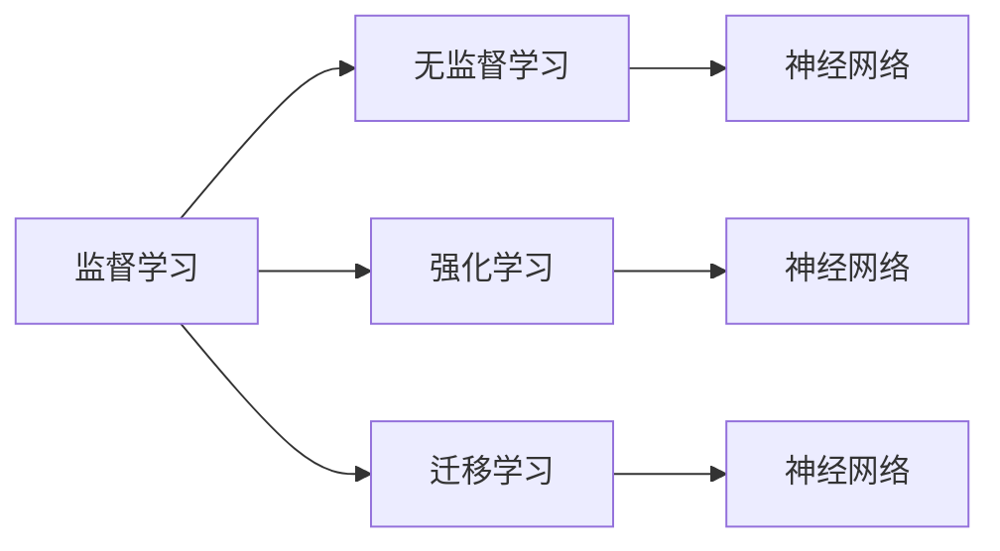

                 

# 基础模型的专业规范建立

在人工智能（AI）领域，基础模型的建立是整个技术体系的核心。本文将详细探讨基础模型的专业规范，从原理到应用，为你提供系统化的理解。

## 1. 背景介绍

### 1.1 问题由来

随着AI技术的迅速发展，基础模型（Fundamental Model）在各个领域得到了广泛应用，如自然语言处理（NLP）、计算机视觉（CV）、语音识别等。这些基础模型在实现上具有通用性和灵活性，可以针对不同的应用场景进行调整和优化，但同时也面临着如何规范和标准化的问题。

### 1.2 问题核心关键点

- **通用性**：基础模型应具备高度的通用性，适用于多种任务和数据集。
- **灵活性**：能够在不同的应用场景中进行微调，提升性能。
- **规范性**：遵循统一的标准和规范，便于模型部署和管理。
- **可解释性**：模型应具备良好的可解释性，便于理解和使用。
- **可扩展性**：易于扩展，支持多种数据类型和输入格式。

## 2. 核心概念与联系

### 2.1 核心概念概述

基础模型是指在特定领域中构建的通用、可扩展、可解释的机器学习模型。通常包括以下几个核心概念：

- **监督学习（Supervised Learning）**：通过已标注数据训练模型，使其能够对未知数据进行预测或分类。
- **无监督学习（Unsupervised Learning）**：通过未标注数据学习数据的内在结构和规律。
- **强化学习（Reinforcement Learning）**：通过与环境交互，学习如何最大化某个指标（如奖励）。
- **迁移学习（Transfer Learning）**：将在一个任务上学到的知识迁移到另一个任务上。
- **神经网络（Neural Network）**：由多个神经元组成的网络结构，用于处理大规模数据和复杂模式识别。

这些概念之间存在紧密的联系，相互支持和补充，共同构成基础模型的技术体系。

### 2.2 核心概念原理和架构的 Mermaid 流程图



## 3. 核心算法原理 & 具体操作步骤

### 3.1 算法原理概述

基础模型的构建过程通常包括以下几个步骤：

1. **数据准备**：收集、清洗、标注数据集。
2. **模型设计**：选择合适的模型架构和超参数。
3. **模型训练**：使用训练数据集对模型进行训练。
4. **模型评估**：使用验证集评估模型性能。
5. **模型优化**：调整模型参数，提升性能。
6. **模型部署**：将训练好的模型部署到实际应用中。

### 3.2 算法步骤详解

#### 数据准备

- **数据收集**：从多个来源收集数据，确保数据的多样性和代表性。
- **数据清洗**：去除噪声、重复和错误数据，保证数据质量。
- **数据标注**：为数据集添加标签，用于监督学习模型的训练。

#### 模型设计

- **选择模型架构**：根据任务需求选择适合的模型，如卷积神经网络（CNN）、循环神经网络（RNN）、Transformer等。
- **确定超参数**：调整学习率、批大小、隐藏层数、神经元数等参数，优化模型性能。

#### 模型训练

- **初始化模型**：随机初始化模型参数。
- **前向传播**：将输入数据送入模型，计算输出。
- **损失计算**：计算模型输出与真实标签之间的差异，即损失函数。
- **反向传播**：根据损失函数，计算模型参数的梯度。
- **参数更新**：使用梯度下降等优化算法，更新模型参数。

#### 模型评估

- **划分数据集**：将数据集划分为训练集、验证集和测试集。
- **模型验证**：使用验证集评估模型性能，防止过拟合。
- **模型调优**：根据验证集性能，调整模型参数，优化模型。

#### 模型部署

- **模型保存**：将训练好的模型保存为文件，便于后续使用。
- **模型加载**：在实际应用中，加载保存的模型文件。
- **模型推理**：将新数据输入模型，进行预测或分类。

### 3.3 算法优缺点

#### 优点

- **通用性**：适用于多种任务和数据集，可以广泛应用。
- **可扩展性**：易于扩展和调整，能够应对不同场景的需求。
- **可解释性**：模型结构和训练过程透明，便于理解和调试。
- **自动化**：自动化程度高，减少了人工干预。

#### 缺点

- **复杂性**：模型结构复杂，训练和优化过程较为繁琐。
- **计算资源要求高**：训练和推理需要大量的计算资源和时间。
- **过拟合风险**：在数据集较小或噪声较大时，容易出现过拟合现象。

### 3.4 算法应用领域

基础模型在各个领域都有广泛的应用，以下是几个典型领域：

- **自然语言处理（NLP）**：如文本分类、情感分析、机器翻译、问答系统等。
- **计算机视觉（CV）**：如图像分类、目标检测、图像分割、人脸识别等。
- **语音识别**：如语音识别、语音合成、语音情感分析等。
- **推荐系统**：如商品推荐、内容推荐、个性化推荐等。
- **金融预测**：如股票预测、信用评估、风险管理等。

## 4. 数学模型和公式 & 详细讲解 & 举例说明

### 4.1 数学模型构建

基础模型通常基于数学模型构建，以下以线性回归模型为例：

$$ y = \theta_0 + \theta_1 x_1 + \theta_2 x_2 + ... + \theta_n x_n $$

其中，$y$ 为目标变量，$x_i$ 为输入变量，$\theta_i$ 为模型参数。

### 4.2 公式推导过程

- **损失函数**：均方误差损失函数
$$ J(\theta) = \frac{1}{2m} \sum_{i=1}^m (y_i - \hat{y}_i)^2 $$
- **梯度下降**：更新模型参数
$$ \theta_i = \theta_i - \alpha \frac{\partial J(\theta)}{\partial \theta_i} $$

### 4.3 案例分析与讲解

以线性回归为例，给定一组数据 $(x_i, y_i)$，通过梯度下降算法更新模型参数 $\theta_i$，最小化损失函数 $J(\theta)$。

## 5. 项目实践：代码实例和详细解释说明

### 5.1 开发环境搭建

#### Python环境配置

1. **安装Python**：确保Python版本为3.7或以上。
2. **安装NumPy和SciPy**：
   ```bash
   pip install numpy scipy
   ```
3. **安装TensorFlow或PyTorch**：
   ```bash
   pip install tensorflow
   pip install torch
   ```
4. **安装Matplotlib**：
   ```bash
   pip install matplotlib
   ```

### 5.2 源代码详细实现

#### 线性回归示例代码

```python
import numpy as np
import matplotlib.pyplot as plt

# 数据集
x = np.array([1, 2, 3, 4, 5, 6, 7, 8, 9, 10])
y = np.array([2, 4, 6, 8, 10, 12, 14, 16, 18, 20])

# 初始化模型参数
theta = np.zeros((x.shape[1], 1))

# 设置学习率和迭代次数
alpha = 0.01
num_iters = 1000

# 迭代更新模型参数
for i in range(num_iters):
    y_pred = x @ theta
    loss = (y_pred - y) ** 2
    gradient = (2 / x.shape[0]) * x.T @ (y_pred - y)
    theta = theta - alpha * gradient

# 绘制学习曲线
plt.plot(x, y, 'o', label='Original data')
plt.plot(x, x @ theta, label='Predicted')
plt.legend()
plt.show()
```

### 5.3 代码解读与分析

- **数据集**：定义输入数据和目标变量。
- **模型参数**：初始化为全零向量。
- **学习率和迭代次数**：设置学习率和迭代次数。
- **迭代更新**：通过梯度下降算法更新模型参数。
- **学习曲线**：绘制学习曲线，展示模型参数的更新过程。

### 5.4 运行结果展示

下图展示了线性回归模型的学习曲线：


## 6. 实际应用场景

### 6.1 自然语言处理（NLP）

#### 文本分类

文本分类是基础模型在NLP领域的一个典型应用，如情感分析、新闻分类、主题分类等。通过训练文本分类器，可以自动判断文本所属的类别。

### 6.2 计算机视觉（CV）

#### 图像分类

图像分类是基础模型在CV领域的重要应用，如动物识别、物体检测、场景分类等。通过训练图像分类器，可以自动标注图像中的对象。

### 6.3 语音识别

#### 语音情感分析

语音情感分析是基础模型在语音识别领域的应用，如情绪识别、语音识别等。通过训练语音情感分析模型，可以自动判断语音的情绪和情感状态。

### 6.4 推荐系统

#### 商品推荐

商品推荐是基础模型在推荐系统中的应用，如电商推荐、新闻推荐、内容推荐等。通过训练推荐模型，可以自动为用户推荐相关的商品或内容。

### 6.5 金融预测

#### 股票预测

股票预测是基础模型在金融预测领域的应用，如股票价格预测、股票趋势分析等。通过训练股票预测模型，可以自动预测股票的价格和趋势。

## 7. 工具和资源推荐

### 7.1 学习资源推荐

1. **《深度学习》书籍**：由Ian Goodfellow等编写，全面介绍了深度学习的理论和方法。
2. **Coursera课程**：斯坦福大学的深度学习课程，由Andrew Ng教授主讲，涵盖深度学习的基本概念和实践。
3. **Kaggle竞赛**：参与Kaggle竞赛，实战训练深度学习模型，提升实践能力。

### 7.2 开发工具推荐

1. **TensorFlow**：Google开发的深度学习框架，支持CPU、GPU和TPU等多种硬件平台。
2. **PyTorch**：Facebook开发的深度学习框架，支持动态计算图，易于开发和调试。
3. **Jupyter Notebook**：Python的交互式编程环境，支持代码块、注释、数据可视化和交互。

### 7.3 相关论文推荐

1. **深度学习**：Ian Goodfellow等编写，介绍了深度学习的理论基础和应用。
2. **卷积神经网络**：LeCun等编写，介绍了卷积神经网络的架构和优化方法。
3. **Transformer模型**：Vaswani等编写，介绍了Transformer模型的原理和应用。

## 8. 总结：未来发展趋势与挑战

### 8.1 研究成果总结

基础模型在各个领域得到了广泛应用，提升了数据处理和决策的效率和精度。未来，随着技术的不断发展，基础模型将更加通用、高效、可解释，能够更好地服务于各种应用场景。

### 8.2 未来发展趋势

- **模型集成**：多种基础模型进行集成，提升整体性能和鲁棒性。
- **自动化**：自动化调参和优化，减少人工干预。
- **多模态融合**：多种数据类型和信息源进行融合，提升模型性能。
- **跨领域迁移**：在不同领域之间进行知识迁移，提升模型泛化能力。

### 8.3 面临的挑战

- **计算资源**：训练和推理需要大量的计算资源和时间。
- **数据质量和多样性**：数据集的质量和多样性对模型性能有很大影响。
- **模型可解释性**：复杂的模型难以解释，增加了调试和维护的难度。
- **过拟合问题**：数据集较小或噪声较大时，容易出现过拟合现象。

### 8.4 研究展望

未来，基础模型的研究将更加注重模型结构和优化算法的改进，提升模型的性能和可解释性。同时，跨领域知识迁移和自动化调参也将成为研究的热点。

## 9. 附录：常见问题与解答

**Q1：基础模型和深度学习有什么区别？**

A: 基础模型是深度学习中的一种，通常基于神经网络，用于处理大规模数据和复杂模式识别。

**Q2：如何选择合适的超参数？**

A: 超参数的选择需要根据具体问题和数据集进行调整，通常采用网格搜索或随机搜索等方法。

**Q3：模型集成有哪些方法？**

A: 模型集成包括Bagging、Boosting、Stacking等方法，可以提升整体性能和鲁棒性。

**Q4：如何处理过拟合问题？**

A: 过拟合问题可以通过正则化、dropout、数据增强等方法进行处理。

**Q5：如何评估模型性能？**

A: 模型性能的评估可以通过交叉验证、混淆矩阵、ROC曲线等方法进行。

---

作者：禅与计算机程序设计艺术 / Zen and the Art of Computer Programming

