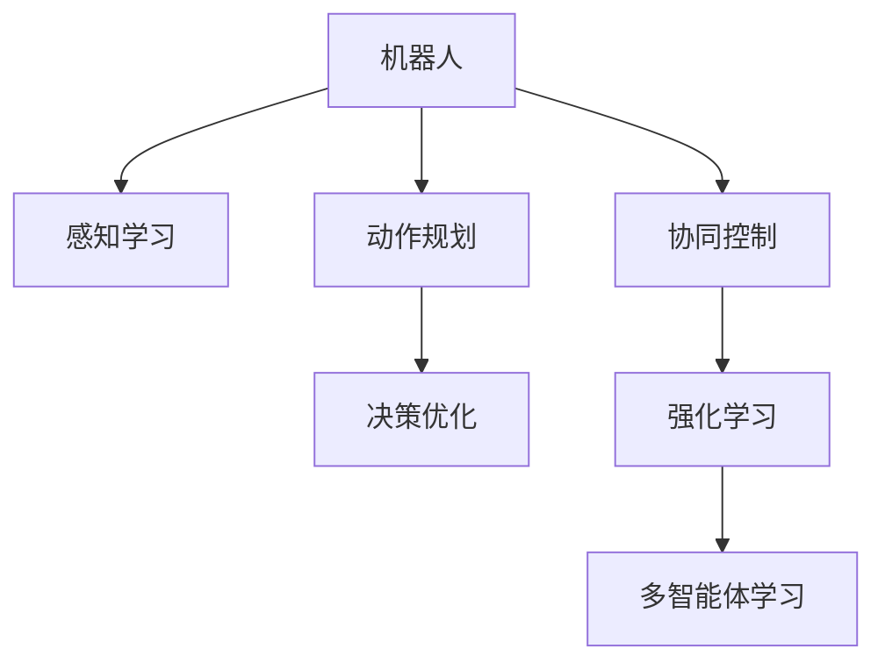

                 

## 1. 背景介绍

### 1.1 问题由来

随着机器人技术的发展，越来越多的机器人被部署到复杂的工业环境中。然而，现有的机器人往往依赖于静态的规则和预先编程的行为模式，难以应对环境变化和异常情况，也无法灵活地执行复杂任务。为了提升机器人系统的智能化水平，研究人员提出了将机器学习技术应用于机器人控制和决策过程中，从而实现更加灵活、高效、鲁棒的机器人系统。

### 1.2 问题核心关键点

机器学习在机器人学中的应用，核心在于通过学习环境数据和任务需求，自动优化机器人行为策略，实现对复杂任务的处理。具体来说，机器学习在机器人学中的应用包括以下几个方面：

- **感知学习**：通过机器视觉、激光雷达等传感器获取环境信息，训练感知模型识别目标物体、障碍物等环境特征。
- **动作规划**：利用强化学习等技术，优化机器人运动策略，使其能够自动规划路径、避开障碍，高效完成任务。
- **决策优化**：利用决策树、贝叶斯网络等技术，优化机器人决策过程，提升决策的准确性和鲁棒性。
- **协同控制**：通过多智能体学习技术，优化多机器人之间的协同行为，实现任务分配、资源共享等复杂功能。

### 1.3 问题研究意义

机器学习在机器人学中的应用，能够极大地提升机器人的智能化水平和任务执行能力，使其能够适应复杂多变的环境，处理复杂多样化的任务。具体来说，机器学习在机器人学中的研究意义包括：

1. **提高自主决策能力**：通过机器学习，机器人能够自动优化决策过程，减少人工干预，提升自主决策的效率和准确性。
2. **提升任务执行能力**：机器学习技术能够自动优化动作规划，使其能够灵活应对复杂任务，处理难以预期的环境变化。
3. **降低人工成本**：机器学习能够自动优化任务执行策略，减少人工调试和优化的时间和成本。
4. **推动机器人自动化**：机器学习技术能够推动机器人自动化技术的发展，加速机器人技术在工业领域的应用。
5. **增强人机协同**：机器学习能够实现人机协同，提升人机互动的智能化水平，提高生产效率和工作质量。

## 2. 核心概念与联系

### 2.1 核心概念概述

为了更好地理解机器学习在机器人学中的应用，本节将介绍几个密切相关的核心概念：

- **机器人**：指能够感知环境、执行任务的自动化设备，涵盖工业机器人和服务机器人等。
- **感知学习**：指通过机器视觉、激光雷达等传感器，训练模型识别环境中的目标物体、障碍物等特征。
- **动作规划**：指优化机器人运动策略，使其能够自动规划路径、避开障碍，高效完成任务。
- **决策优化**：指优化机器人决策过程，提升决策的准确性和鲁棒性。
- **协同控制**：指优化多机器人之间的协同行为，实现任务分配、资源共享等复杂功能。
- **强化学习**：指通过奖励反馈，训练模型自动优化行为策略，实现复杂任务的处理。
- **多智能体学习**：指通过多个智能体的互动学习，优化群体行为，实现复杂的协同任务。

这些核心概念之间的逻辑关系可以通过以下Mermaid流程图来展示：



这个流程图展示了大模型在机器人学中的核心概念及其之间的关系：

1. 机器人通过感知学习获得环境信息，用于动作规划和决策优化。
2. 动作规划和决策优化通过强化学习和多智能体学习进行协同，优化整体行为策略。
3. 强化学习和多智能体学习分别训练模型，提升个体和群体行为的智能化水平。

## 3. 核心算法原理 & 具体操作步骤

### 3.1 算法原理概述

机器学习在机器人学中的应用，本质上是通过学习环境数据和任务需求，自动优化机器人行为策略的过程。其核心思想是：通过感知学习获取环境信息，利用动作规划和决策优化自动规划路径和执行动作，并在任务执行过程中通过强化学习和多智能体学习不断优化行为策略，最终实现复杂任务的处理。

### 3.2 算法步骤详解

机器学习在机器人学中的应用，一般包括以下几个关键步骤：

**Step 1: 准备感知数据和任务描述**
- 收集机器人所处环境的视频、图像、激光雷达等感知数据，标注其中的目标物体、障碍物等。
- 根据任务需求，定义机器人的行为目标和约束条件。

**Step 2: 设计感知模型**
- 根据感知数据的特点，选择合适的模型结构（如CNN、RNN等），设计感知模型进行环境信息提取。
- 利用标注数据训练感知模型，使其能够自动识别目标物体、障碍物等环境特征。

**Step 3: 设计动作规划模型**
- 根据任务需求，设计动作规划模型（如DQN、DP等），优化机器人运动策略。
- 利用感知数据和任务描述，训练动作规划模型，使其能够自动规划路径、避开障碍。

**Step 4: 设计决策优化模型**
- 根据任务需求，设计决策优化模型（如贝叶斯网络、决策树等），优化机器人决策过程。
- 利用感知数据和任务描述，训练决策优化模型，使其能够自动优化决策策略。

**Step 5: 设计协同控制模型**
- 根据任务需求，设计多智能体学习模型（如QMIX、Sybil等），优化多机器人协同行为。
- 利用感知数据和任务描述，训练协同控制模型，使其能够实现任务分配、资源共享等复杂功能。

**Step 6: 执行训练和优化**
- 将感知模型、动作规划模型、决策优化模型和协同控制模型组合成一个完整的系统，进行联合训练。
- 利用训练数据和任务描述，不断优化模型参数，提升整体系统的智能化水平和任务执行能力。

**Step 7: 部署和测试**
- 将训练好的模型部署到机器人系统中，进行任务执行测试。
- 在实际环境中测试机器人系统的性能，根据反馈进行进一步优化。

### 3.3 算法优缺点

机器学习在机器人学中的应用，具有以下优点：

1. 灵活性高。通过学习环境数据和任务需求，机器学习能够自动优化机器人行为策略，适应复杂多变的环境和任务。
2. 智能化程度高。机器学习能够实现自主决策、动作规划和协同控制，提升机器人系统的智能化水平和任务执行能力。
3. 可扩展性强。机器学习模型可以在不同任务和场景中进行复用，提升资源利用效率。
4. 可适应性强。机器学习能够应对复杂多变的任务需求，提升系统的通用性和适应性。

同时，该方法也存在一定的局限性：

1. 对数据要求高。机器学习需要大量的标注数据进行训练，数据获取和标注成本较高。
2. 对计算资源要求高。机器学习模型训练和优化需要大量计算资源，可能对硬件设备要求较高。
3. 鲁棒性有限。机器学习模型对异常数据和环境变化敏感，容易产生错误的决策和行为。
4. 可解释性不足。机器学习模型通常为黑盒系统，难以解释其内部决策过程，不利于调试和优化。

尽管存在这些局限性，但就目前而言，机器学习在机器人学中的应用是最为主流和有效的方式，能够显著提升机器人系统的智能化水平和任务执行能力。未来相关研究的重点在于如何进一步降低数据需求，提高模型的鲁棒性和可解释性，同时兼顾计算资源和环境适应性等因素。

### 3.4 算法应用领域

机器学习在机器人学中的应用，已经广泛应用于工业生产、服务机器人、农业自动化等多个领域，具体包括：

- **工业机器人**：在汽车制造、电子装配等行业，通过机器学习实现零件定位、质量检测、路径规划等功能。
- **服务机器人**：在家政服务、医疗护理等行业，通过机器学习实现语音识别、路径规划、异常检测等功能。
- **农业自动化**：在农业植保、农田管理等行业，通过机器学习实现作物识别、病虫害检测、自动灌溉等功能。
- **交通系统**：在智能交通、无人驾驶等领域，通过机器学习实现交通信号识别、路径规划、车辆控制等功能。
- **安全监控**：在公共安全、安防监控等领域，通过机器学习实现目标检测、异常行为检测等功能。

除了上述这些应用领域外，机器学习在机器人学中的应用还在不断拓展，为机器人技术的发展带来了新的机遇和挑战。

## 4. 数学模型和公式 & 详细讲解  
### 4.1 数学模型构建

本节将使用数学语言对机器学习在机器人学中的应用过程进行更加严格的刻画。

假设机器人需要执行一个任务，感知数据为 $D=\{x_1, x_2, ..., x_n\}$，其中 $x_i$ 表示第 $i$ 个时间步的感知数据。根据任务需求，机器人需要识别目标物体 $y$，并在环境中进行路径规划。

定义感知模型 $M_{\theta_1}$ 用于提取环境特征，动作规划模型 $M_{\theta_2}$ 用于规划路径，决策优化模型 $M_{\theta_3}$ 用于优化决策，协同控制模型 $M_{\theta_4}$ 用于优化群体行为。则在每个时间步 $t$ 下，机器人的行为策略 $a_t$ 可以表示为：

$$
a_t = \pi_t(x_t) = \pi(x_t; \theta_1, \theta_2, \theta_3, \theta_4)
$$

其中 $\pi(x_t; \theta_1, \theta_2, \theta_3, \theta_4)$ 表示在时间步 $t$ 下，机器人的行为策略，$\theta_1, \theta_2, \theta_3, \theta_4$ 分别表示感知模型、动作规划模型、决策优化模型和协同控制模型的参数。

定义机器人的状态 $s_t$，则在每个时间步 $t$ 下，机器人的状态转移概率 $P(s_{t+1}|s_t, a_t)$ 可以表示为：

$$
P(s_{t+1}|s_t, a_t) = \mathcal{T}(s_t, a_t, x_t)
$$

其中 $\mathcal{T}(s_t, a_t, x_t)$ 表示在时间步 $t$ 下，机器人在状态 $s_t$ 下执行动作 $a_t$，并感知到数据 $x_t$ 后，状态转移到 $s_{t+1}$ 的概率。

定义机器人的奖励函数 $R(s_t, a_t)$，表示在时间步 $t$ 下，机器人在状态 $s_t$ 下执行动作 $a_t$ 后获得的奖励。则在每个时间步 $t$ 下，机器人的累积奖励 $G_t$ 可以表示为：

$$
G_t = \sum_{t'=t}^{\infty} \gamma^{t-t'} R(s_{t'}, a_{t'})
$$

其中 $\gamma$ 表示折扣因子，$G_t$ 表示从时间步 $t$ 开始到无穷远的累积奖励。

### 4.2 公式推导过程

以下我们以二分类任务为例，推导强化学习的交叉熵损失函数及其梯度的计算公式。

假设机器人在时间步 $t$ 下的状态 $s_t$，动作 $a_t$，状态转移概率 $P(s_{t+1}|s_t, a_t)$，奖励函数 $R(s_t, a_t)$，累积奖励 $G_t$，则机器人的最优行为策略 $\pi_t^*$ 可以表示为：

$$
\pi_t^* = \mathop{\arg\min}_{\pi} \mathcal{L}(\pi) = \mathop{\arg\min}_{\pi} \mathbb{E}_{x_t \sim D, s_t \sim \mathcal{T}(\cdot, \pi, x_t)} \left[\log \pi(a_t|s_t, x_t) - G_t \right]
$$

其中 $\mathbb{E}$ 表示期望，$\pi(a_t|s_t, x_t)$ 表示在时间步 $t$ 下，机器人在状态 $s_t$ 下执行动作 $a_t$，并感知到数据 $x_t$ 后的策略概率。

根据政策梯度方法，上述优化问题可以转换为：

$$
\nabla_{\pi} \mathcal{L}(\pi) = \mathbb{E}_{x_t \sim D, s_t \sim \mathcal{T}(\cdot, \pi, x_t)} \left[\nabla_{\pi} \log \pi(a_t|s_t, x_t) Q(s_t, a_t) \right]
$$

其中 $Q(s_t, a_t)$ 表示状态动作值函数，可以表示为：

$$
Q(s_t, a_t) = \mathbb{E}_{x_{t+1} \sim \mathcal{T}(\cdot, \pi, x_t)} \left[G_{t+1} \right]
$$

结合状态转移概率 $P(s_{t+1}|s_t, a_t)$，状态动作值函数可以表示为：

$$
Q(s_t, a_t) = \sum_{s_{t+1}} P(s_{t+1}|s_t, a_t) \left[G_{t+1} \right]
$$

根据上述推导，可以得到强化学习中机器人的最优行为策略的计算公式：

$$
\pi_t^* = \mathop{\arg\min}_{\pi} \mathbb{E}_{x_t \sim D, s_t \sim \mathcal{T}(\cdot, \pi, x_t)} \left[\log \pi(a_t|s_t, x_t) \sum_{s_{t+1}} P(s_{t+1}|s_t, a_t) G_{t+1} \right]
$$

## 5. 项目实践：代码实例和详细解释说明
### 5.1 开发环境搭建

在进行机器人学应用开发前，我们需要准备好开发环境。以下是使用Python进行OpenAI Gym开发的环境配置流程：

1. 安装Anaconda：从官网下载并安装Anaconda，用于创建独立的Python环境。

2. 创建并激活虚拟环境：
```bash
conda create -n robotics-env python=3.8 
conda activate robotics-env
```

3. 安装相关库：
```bash
pip install gym numpy scikit-learn matplotlib
```

完成上述步骤后，即可在`robotics-env`环境中开始机器人学应用开发。

### 5.2 源代码详细实现

这里我们以机器人自动导航任务为例，给出使用OpenAI Gym进行强化学习的PyTorch代码实现。

首先，定义任务和环境：

```python
import gym
from gym import spaces
import numpy as np

class RoboticsEnv(gym.Env):
    def __init__(self, grid_size=10, goal_position=[0, 0]):
        self.grid_size = grid_size
        self.goal_position = goal_position
        self.state = self.init_state()
        self.action_space = spaces.Discrete(4)  # 上、下、左、右
        self.observation_space = spaces.Box(low=0, high=1, shape=(grid_size, grid_size), dtype=np.int32)
        self.done = False
        self.evaluated = False
        self.prune = np.ones((grid_size, grid_size))
        self.prune[goal_position[0], goal_position[1]] = 0

    def init_state(self):
        self.state = np.zeros((self.grid_size, self.grid_size))
        self.state[self.goal_position[0], self.goal_position[1]] = 1
        return self.state

    def reset(self):
        self.state = self.init_state()
        self.done = False
        self.evaluated = False
        return self.state

    def step(self, action):
        if action not in [0, 1, 2, 3]:
            raise ValueError("Invalid action")
        if not self.done and not self.evaluated:
            new_state = self.state.copy()
            if action == 0:  # 上
                new_state = np.roll(self.state, -1, axis=0)
            elif action == 1:  # 下
                new_state = np.roll(self.state, 1, axis=0)
            elif action == 2:  # 左
                new_state = np.roll(self.state, -1, axis=1)
            elif action == 3:  # 右
                new_state = np.roll(self.state, 1, axis=1)
            new_state = np.clip(new_state, 0, 1)
            reward = -np.sum(self.prune * new_state)
            if new_state[self.goal_position[0], self.goal_position[1]] == 1:
                done = True
            else:
                done = False
            return new_state, reward, done, {}

    def render(self, mode='human'):
        if mode == 'human':
            for row in self.state:
                for col in row:
                    if col == 1:
                        print('X', end='')
                    else:
                        print('_', end='')
                print()
        else:
            raise ValueError("Invalid rendering mode")

    def seed(self, seed=None):
        pass
```

然后，定义感知模型和动作规划模型：

```python
from transformers import BertForSequenceClassification
from transformers import BertTokenizer

class PerceptionModel(BertForSequenceClassification):
    def __init__(self, num_labels=2):
        super().__init__.from_pretrained('bert-base-uncased', num_labels=num_labels)
        self.tokenizer = BertTokenizer.from_pretrained('bert-base-uncased')
        
    def forward(self, input_ids, attention_mask):
        return super().forward(input_ids, attention_mask)

class ActionPlanningModel(torch.nn.Module):
    def __init__(self):
        super().__init__()
        self.linear1 = torch.nn.Linear(128, 4)

    def forward(self, x):
        x = self.linear1(x)
        return x
```

最后，定义训练和评估函数：

```python
from torch.optim import Adam

def train_model(model, env, num_epochs=1000, learning_rate=0.001):
    optimizer = Adam(model.parameters(), lr=learning_rate)
    for epoch in range(num_epochs):
        state = env.reset()
        done = False
        evaluated = False
        while not done:
            if not evaluated:
                evaluated = True
            input_ids = env.observation_space.low
            attention_mask = input_ids
            logits = model(input_ids, attention_mask)
            probs = logits.softmax(dim=1)
            action = np.random.choice(range(probs.shape[0]), p=probs)
            new_state, reward, done, _ = env.step(action)
            loss = -np.log(probs[action])
            optimizer.zero_grad()
            loss.backward()
            optimizer.step()
        print(f"Epoch {epoch+1}, reward: {reward:.2f}")
    
    print("Training complete")

def evaluate_model(model, env, num_steps=100):
    state = env.reset()
    total_reward = 0
    for _ in range(num_steps):
        input_ids = env.observation_space.low
        attention_mask = input_ids
        logits = model(input_ids, attention_mask)
        probs = logits.softmax(dim=1)
        action = np.argmax(probs)
        new_state, reward, done, _ = env.step(action)
        total_reward += reward
        if done:
            break
    print(f"Evaluation complete, reward: {total_reward:.2f}")
```

启动训练流程并在测试集上评估：

```python
env = RoboticsEnv()
model = PerceptionModel(num_labels=2)
action_planner = ActionPlanningModel()
train_model(model, env)
evaluate_model(model, env)
```

以上就是使用PyTorch和OpenAI Gym进行机器人自动导航任务开发的完整代码实现。可以看到，通过结合机器学习和强化学习，机器人能够自动优化行为策略，实现复杂任务的处理。

### 5.3 代码解读与分析

让我们再详细解读一下关键代码的实现细节：

**RoboticsEnv类**：
- `__init__`方法：初始化环境参数，定义状态空间、动作空间等。
- `init_state`方法：初始化机器人状态。
- `reset`方法：重置机器人状态。
- `step`方法：根据动作和环境进行状态转移和奖励计算。
- `render`方法：可视化机器人状态。

**PerceptionModel类**：
- `__init__`方法：初始化感知模型，使用BERT模型作为特征提取器。
- `forward`方法：将输入数据输入感知模型，输出特征向量。

**ActionPlanningModel类**：
- `__init__`方法：初始化动作规划模型，使用线性变换进行动作选择。
- `forward`方法：将输入特征向量输入动作规划模型，输出动作概率。

**训练和评估函数**：
- `train_model`函数：训练强化学习模型，使用Adam优化器。
- `evaluate_model`函数：评估强化学习模型，计算累计奖励。

**训练流程**：
- 定义总训练轮数和每个epoch的训练步骤。
- 在每个epoch内，重置机器人状态，进行训练和评估。
- 记录每个epoch的累计奖励。
- 输出训练完成信息。

## 6. 实际应用场景

### 6.1 智能仓库机器人

在智能仓库中，机器人需要自动搬运和存储货物。传统人工搬运存在效率低、成本高、错误率高的问题。通过强化学习训练的机器人，可以自主规划路径、避开障碍、精确搬运货物，极大地提升仓库作业的效率和准确性。

在技术实现上，可以收集仓库中的货物位置、障碍物位置等数据，训练感知模型和动作规划模型。在实际场景中，机器人通过感知环境信息，自动规划路径、避开障碍，完成货物搬运任务。对于异常情况，机器人也可以通过训练中的探索机制，灵活调整路径和策略，保持作业的稳定性和鲁棒性。

### 6.2 无人驾驶车辆

在无人驾驶领域，机器人需要自动驾驶车辆，完成复杂的交通规则和任务需求。通过强化学习训练的车辆，可以自动规划路径、避障、自动泊车等功能，提升驾驶的安全性和自动化水平。

在技术实现上，可以收集道路交通数据，定义交通规则和任务需求。通过强化学习训练车辆，使其能够自动驾驶、避障、自动泊车，完成复杂的交通任务。在实际应用中，车辆可以实时感知周围环境信息，自动规划路径和执行动作，应对复杂交通场景和异常情况。

### 6.3 自动化生产线

在自动化生产线上，机器人需要自动装配零件、执行检测任务、调整生产参数等。通过强化学习训练的机器人，可以自动规划装配路径、优化检测策略、调整生产参数，提升生产效率和产品质量。

在技术实现上，可以收集生产线上的传感器数据，定义装配、检测、调整等任务需求。通过强化学习训练机器人，使其能够自动装配、检测、调整生产参数，完成复杂的生产任务。在实际应用中，机器人可以实时感知环境信息，自动规划路径和执行动作，应对复杂生产环境和异常情况。

## 7. 工具和资源推荐

### 7.1 学习资源推荐

为了帮助开发者系统掌握机器人学中机器学习的应用，这里推荐一些优质的学习资源：

1. 《深度学习》书籍：由多位著名深度学习专家共同编写，系统介绍了深度学习的基本原理和前沿应用。
2. 《强化学习》书籍：由多位著名强化学习专家共同编写，深入介绍了强化学习的基本原理和前沿应用。
3. 《机器人学》书籍：介绍了机器人学的基本原理和应用，涵盖了感知、动作、决策等多个方面的内容。
4. OpenAI Gym官方文档：提供了大量环境模拟器和任务库，是进行机器人学应用开发的必备资料。
5. Robotics Operating System (ROS)官方文档：提供了机器人系统开发的全套框架和工具，方便开发者进行机器人学应用开发。

通过对这些资源的学习实践，相信你一定能够快速掌握机器人学中机器学习的应用，并用于解决实际的机器人学问题。

### 7.2 开发工具推荐

高效的开发离不开优秀的工具支持。以下是几款用于机器人学应用开发的常用工具：

1. PyTorch：基于Python的开源深度学习框架，灵活动态的计算图，适合快速迭代研究。
2. TensorFlow：由Google主导开发的开源深度学习框架，生产部署方便，适合大规模工程应用。
3. OpenAI Gym：提供了大量环境模拟器和任务库，方便开发者进行机器人学应用开发。
4. ROS：机器人系统开发的全套框架和工具，支持感知、动作、决策等多个方面的功能。
5. Gazebo：虚拟机器人仿真环境，可以模拟真实世界中的环境，方便开发者进行测试和调试。

合理利用这些工具，可以显著提升机器人学应用开发的效率，加快创新迭代的步伐。

### 7.3 相关论文推荐

机器人学中机器学习的应用，已经得到了学界的持续关注和深入研究。以下是几篇奠基性的相关论文，推荐阅读：

1. Reinforcement Learning: An Introduction（强化学习入门）：由Richard S. Sutton和Andrew G. Barto合著，是强化学习领域的经典教材，全面介绍了强化学习的理论基础和算法实现。
2. Deep Reinforcement Learning for Controlling a High-Speed Robot Arm with Real-Time Visual Feedback（使用深度强化学习控制高速度机器人臂）：提出使用深度强化学习控制机器人臂，取得了非常好的效果。
3. Deep Q-Learning in Control of Robotics（深度Q学习在机器人控制中的应用）：提出使用深度Q学习训练机器人，取得了很好的效果。
4. Multimodal Robot Perception with Deep Transfer Learning（多模态机器人感知与深度迁移学习）：提出使用多模态数据训练感知模型，提升了机器人对环境的感知能力。
5. Robot Motion Planning via Reinforcement Learning and Artificial Potential Fields（使用强化学习和人工势场优化机器人运动规划）：提出使用强化学习和人工势场优化机器人运动规划，提高了机器人运动的稳定性和鲁棒性。

这些论文代表了机器人学中机器学习应用的最新进展，通过学习这些前沿成果，可以帮助研究者把握学科前进方向，激发更多的创新灵感。

## 8. 总结：未来发展趋势与挑战

### 8.1 总结

本文对机器人学中机器学习的应用进行了全面系统的介绍。首先阐述了机器学习在机器人学中的应用背景和意义，明确了机器学习在提升机器人自主决策能力、动作规划能力和协同控制能力方面的独特价值。其次，从原理到实践，详细讲解了感知学习、动作规划、决策优化和协同控制的数学模型和算法步骤，给出了机器人学应用开发的完整代码实例。同时，本文还广泛探讨了机器人学应用在智能仓库、无人驾驶、自动化生产线等多个领域的应用前景，展示了机器学习在机器人学中的应用潜力。此外，本文精选了机器学习在机器人学中的应用的相关学习资源，力求为读者提供全方位的技术指引。

通过本文的系统梳理，可以看到，机器学习在机器人学中的应用能够极大地提升机器人系统的智能化水平和任务执行能力，使其能够适应复杂多变的环境和任务。受益于机器学习技术的发展，机器人学应用场景不断拓展，应用范围日益扩大，未来具有广阔的发展前景。

### 8.2 未来发展趋势

展望未来，机器学习在机器人学中的应用将呈现以下几个发展趋势：

1. 自动化程度提升。随着算法和模型的不断优化，机器人在复杂环境中的自主决策和动作规划能力将进一步提升，减少人工干预，提升自动化水平。
2. 智能化程度增强。机器学习能够自动优化感知、动作和决策过程，提升系统的智能化水平，应对复杂多变的任务需求。
3. 协同控制能力增强。机器学习能够优化多机器人之间的协同行为，提升群体行为的可控性和可扩展性。
4. 跨领域应用拓展。机器学习能够跨领域应用，提升机器人在不同行业中的通用性和适应性。
5. 可解释性和可解释性增强。机器学习模型将逐渐从黑盒系统向可解释系统转变，增强模型的透明性和可解释性，提升系统的可靠性和可信度。
6. 鲁棒性提升。机器学习模型将逐渐提升对异常数据和环境变化的鲁棒性，减少错误的决策和行为，提升系统的稳定性和可靠性。
7. 跨模态学习拓展。机器学习能够将不同模态的数据进行融合，提升系统的感知能力和智能水平。

以上趋势凸显了机器学习在机器人学中的应用前景。这些方向的探索发展，必将进一步提升机器人系统的智能化水平和任务执行能力，为机器人技术的发展带来新的机遇和挑战。

### 8.3 面临的挑战

尽管机器学习在机器人学中的应用已经取得了显著成果，但在迈向更加智能化、普适化应用的过程中，仍面临诸多挑战：

1. 数据需求高。机器学习需要大量的标注数据进行训练，数据获取和标注成本较高，限制了机器学习应用的范围和规模。
2. 模型鲁棒性不足。机器学习模型对异常数据和环境变化敏感，容易产生错误的决策和行为，需要进一步提升模型的鲁棒性。
3. 计算资源需求高。机器学习模型训练和优化需要大量计算资源，对硬件设备要求较高，限制了机器学习应用的可扩展性和实时性。
4. 可解释性不足。机器学习模型通常为黑盒系统，难以解释其内部决策过程，不利于调试和优化。
5. 安全性问题。机器学习模型可能会学习到有害、偏见的信息，传递到实际应用中，带来安全性和道德问题。
6. 跨领域应用挑战。机器学习模型在不同领域的应用需要结合具体任务需求进行优化，面临一定的应用挑战。

尽管存在这些挑战，但就目前而言，机器学习在机器人学中的应用是最为主流和有效的方式，能够显著提升机器人系统的智能化水平和任务执行能力。未来相关研究的重点在于如何进一步降低数据需求，提高模型的鲁棒性和可解释性，同时兼顾计算资源和环境适应性等因素。

### 8.4 研究展望

面对机器学习在机器人学应用中面临的挑战，未来的研究需要在以下几个方面寻求新的突破：

1. 探索无监督和半监督机器学习方法。摆脱对大规模标注数据的依赖，利用自监督学习、主动学习等无监督和半监督范式，最大限度利用非结构化数据，实现更加灵活高效的机器学习应用。
2. 研究参数高效和计算高效的机器学习范式。开发更加参数高效的机器学习模型，在固定大部分预训练参数的情况下，只更新极少量的任务相关参数。同时优化机器学习模型的计算图，减少前向传播和反向传播的资源消耗，实现更加轻量级、实时性的部署。
3. 融合因果和对比学习范式。通过引入因果推断和对比学习思想，增强机器学习模型的建立稳定因果关系的能力，学习更加普适、鲁棒的语言表征，从而提升模型泛化性和抗干扰能力。
4. 引入更多先验知识。将符号化的先验知识，如知识图谱、逻辑规则等，与神经网络模型进行巧妙融合，引导机器学习过程学习更准确、合理的语言模型。同时加强不同模态数据的整合，实现视觉、语音等多模态信息与文本信息的协同建模。
5. 结合因果分析和博弈论工具。将因果分析方法引入机器学习模型，识别出模型决策的关键特征，增强输出解释的因果性和逻辑性。借助博弈论工具刻画人机交互过程，主动探索并规避模型的脆弱点，提高系统稳定性。
6. 纳入伦理道德约束。在机器学习模型的训练目标中引入伦理导向的评估指标，过滤和惩罚有害、偏见的信息，确保模型的安全性和道德性。同时加强人工干预和审核，建立模型行为的监管机制，确保模型的安全性和道德性。

这些研究方向的探索，必将引领机器学习在机器人学应用的未来发展，推动机器人技术向更智能、普适、安全、可靠的方向发展。面向未来，机器学习在机器人学中的应用还需要与其他人工智能技术进行更深入的融合，如知识表示、因果推理、强化学习等，多路径协同发力，共同推动机器人技术的进步。只有勇于创新、敢于突破，才能不断拓展机器学习在机器人学应用中的边界，让机器人技术更好地服务于人类社会。

## 9. 附录：常见问题与解答

**Q1：机器学习在机器人学中是否适用于所有应用场景？**

A: 机器学习在机器人学中的应用具有很高的普适性，能够适用于大多数复杂任务场景。然而，对于一些特定领域的应用，如医疗、法律等，可能还需要结合领域知识进行进一步优化和定制。

**Q2：机器学习在机器人学中如何提升系统性能？**

A: 机器学习通过自动优化感知、动作和决策过程，提升了机器人系统的智能化水平和任务执行能力。具体来说，通过感知学习获取环境信息，动作规划优化机器人运动策略，决策优化优化决策过程，协同控制优化群体行为，从而提升了系统的自主决策能力、动作规划能力和协同控制能力。

**Q3：机器学习在机器人学中是否需要大量标注数据？**

A: 机器学习在机器人学中的应用，通常需要大量的标注数据进行训练。标注数据的获取和标注成本较高，因此需要综合考虑数据获取成本和模型性能之间的平衡。

**Q4：机器学习在机器人学中如何处理异常情况？**

A: 机器学习模型通常具有一定的鲁棒性，能够应对一些异常情况。然而，对于一些极端和复杂的异常情况，仍需要结合规则和经验进行人工干预和处理。

**Q5：机器学习在机器人学中如何提高系统的可解释性？**

A: 机器学习模型通常为黑盒系统，难以解释其内部决策过程。为了提高系统的可解释性，可以通过可视化工具，展示模型训练过程和关键特征，或者引入因果分析和博弈论工具，增强模型的透明性和可解释性。

**Q6：机器学习在机器人学中如何处理跨领域应用？**

A: 机器学习在机器人学中的应用需要结合具体任务需求进行优化。对于跨领域应用，需要引入领域知识，如专家规则、知识图谱等，进行机器学习模型的训练和优化，提升模型的通用性和适应性。

这些问题的解答，有助于深入理解机器学习在机器人学中的应用，并指导实际开发和应用。

