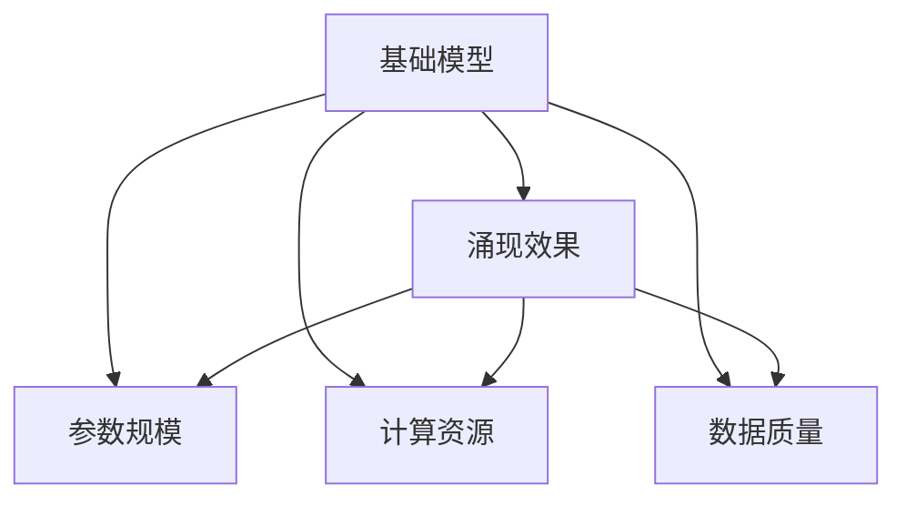

                 

# 基础模型的规模与涌现效果

## 1. 背景介绍

### 1.1 问题由来

近年来，深度学习技术在计算机视觉、自然语言处理、语音识别等领域取得了显著进展。其中，基础模型的规模和涌现效果成为了研究的热点。基础模型通常是指在大规模数据集上预训练得到的深度神经网络模型，如BERT、GPT、ResNet等。这些模型通过自监督学习任务进行预训练，学习到丰富的语义表示和视觉特征，具有强大的泛化能力和迁移学习能力。

基础模型在多个领域的卓越表现，引发了学界和业界对大模型性能提升的极大兴趣。但大模型的训练和部署需要耗费大量计算资源和时间，而且其参数量动辄数亿甚至数十亿，给实际应用带来了挑战。因此，如何在保证大模型性能的同时，降低其规模和计算成本，成为了一个重要的问题。

### 1.2 问题核心关键点

要回答上述问题，首先需要理解基础模型规模与涌现效果之间的关系。基础模型规模的增大，意味着其参数量和计算复杂度的提升，但这并不一定能够带来更好的性能。理论上，基础模型的涌现效果是其具备泛化能力、迁移学习能力和涌现能力的表现，而这三个能力与模型规模和数据量密切相关。

- 泛化能力：基础模型通过预训练，学习到对特定数据集泛化的能力。其泛化能力随着模型规模的增大而提升，但受限于训练数据的质量和数量。
- 迁移学习能力：基础模型在预训练后，能够将所学到的知识迁移到下游任务上，提升下游任务的性能。迁移学习的效果随着模型规模的增大而增强。
- 涌现能力：基础模型在处理大量数据时，能够通过自适应的学习方式，形成新的表示和模式。涌现能力与模型规模和数据量的乘积成正比。

因此，如何设计高效、准确、可解释的基础模型，在保证其涌现效果的同时，降低其规模和计算成本，是研究的基础模型的一个重要方向。

## 2. 核心概念与联系

### 2.1 核心概念概述

在研究基础模型的规模与涌现效果时，我们需关注以下几个核心概念：

- 基础模型(Foundational Models)：通过在大规模数据集上进行预训练得到的深度神经网络模型，如BERT、GPT、ResNet等。
- 涌现效果(Emergent Behavior)：基础模型在处理大量数据时，通过自适应学习形成的新的表示和模式，具备强大的泛化能力和迁移学习能力。
- 参数规模(Parameter Scaling)：基础模型的参数量和计算复杂度。
- 计算资源(Calculating Resource)：基础模型的训练和部署所需的计算资源，包括GPU、TPU等高性能设备。
- 数据质量(Data Quality)：用于预训练和微调的基础数据集的质量，影响模型的泛化能力。

这些概念之间的关系通过以下Mermaid流程图来展示：



该图展示了基础模型规模与涌现效果之间的内在联系：基础模型的涌现效果与其参数规模和计算资源有关，而计算资源受限于数据质量。

### 2.2 核心概念原理和架构

基础模型一般由以下几个主要部分组成：

1. **编码器(Encoder)**：将输入数据转换为高维向量表示，用于提取输入数据的关键特征。常见的编码器包括卷积神经网络(Convolutional Neural Networks, CNNs)、递归神经网络(Recurrent Neural Networks, RNNs)和自注意力机制(Attention Mechanisms)等。

2. **解码器(Decoder)**：根据编码器提取的特征，生成输出结果。解码器通常是一个全连接神经网络或一个生成模型，如LSTM、GRU或Transformer等。

3. **预训练任务(Pre-training Tasks)**：在基础模型的训练过程中，通过自监督学习任务，使模型学习到通用的语言或视觉特征。预训练任务包括自回归语言建模、掩码语言建模、图像分类、目标检测等。

4. **下游任务(Fine-tuning Tasks)**：在预训练后，通过微调，使基础模型适应特定的下游任务。微调任务包括分类、匹配、生成等，通过添加任务特定的输出层和损失函数实现。

这些组成部分通过不同的网络结构和训练策略，形成复杂的基础模型架构，具备强大的涌现效果和泛化能力。

## 3. 核心算法原理 & 具体操作步骤

### 3.1 算法原理概述

基础模型的涌现效果与模型规模和数据量密切相关。随着模型规模的增大，其涌现效果和泛化能力也会相应提升。但模型规模的增大同时也带来了计算资源和存储资源的显著增加，降低了模型的可部署性和实际应用的可行性。

因此，在设计基础模型时，需要在模型规模和涌现效果之间寻找平衡点，通过优化模型的网络结构、压缩模型参数、引入正则化技术等手段，实现高效、准确的涌现效果。

### 3.2 算法步骤详解

设计高效、准确的基础模型，通常包括以下几个关键步骤：

1. **选择合适的网络结构**：根据任务特点选择合适的编码器和解码器，如CNN、RNN、Transformer等。编码器负责提取输入数据的特征，解码器负责生成输出结果。

2. **设计预训练任务**：选择合适的预训练任务，如自回归语言建模、掩码语言建模、图像分类、目标检测等，使模型学习到通用的语言或视觉特征。预训练任务的输入通常是原始数据，输出则是模型学习到的中间表示。

3. **微调与优化**：在预训练后，通过微调使基础模型适应特定的下游任务。微调通常包括添加任务特定的输出层和损失函数，以最小的计算资源提升模型性能。

4. **正则化与压缩**：通过正则化技术（如L2正则、Dropout、早停等）和压缩技术（如权重裁剪、低秩分解等），降低模型的参数量和计算复杂度，提升模型的可部署性和实际应用效率。

5. **评估与调优**：通过评估模型的涌现效果和泛化能力，进行模型调优，寻找最优的模型参数和训练策略。

### 3.3 算法优缺点

基础模型的优点包括：

- 强大的泛化能力和迁移学习能力，能够适应多种下游任务。
- 通过自监督学习任务预训练，模型学习到通用的语言或视觉特征。
- 能够通过微调，在特定任务上取得不错的性能。

然而，基础模型的缺点也很明显：

- 参数规模大，计算资源需求高，部署成本大。
- 模型结构复杂，训练和推理速度慢，难以实时部署。
- 涌现效果的泛化能力受限于数据质量和数量，模型易过拟合。

### 3.4 算法应用领域

基础模型的涌现效果在多个领域得到了广泛应用，如计算机视觉、自然语言处理、语音识别、推荐系统等。

- 计算机视觉领域：如ImageNet、COCO等数据集上预训练得到的ResNet、Inception、DenseNet等模型，通过微调应用于图像分类、目标检测、语义分割等任务。
- 自然语言处理领域：如BERT、GPT、XLNet等模型，通过微调应用于文本分类、情感分析、问答系统、机器翻译等任务。
- 语音识别领域：如Wav2Vec、Deformable Wav2Vec等模型，通过微调应用于语音识别、语音合成、情感分析等任务。
- 推荐系统领域：如Wide & Deep模型，通过微调应用于推荐系统中的点击率预测、个性化推荐等任务。

## 4. 数学模型和公式 & 详细讲解 & 举例说明

### 4.1 数学模型构建

假设基础模型为$f(x;\theta)$，其中$x$为输入数据，$\theta$为模型参数。基础模型的涌现效果可通过以下数学模型来描述：

$$
\mathcal{L}(\theta) = \sum_{i=1}^N \ell(f(x_i;\theta), y_i)
$$

其中，$\ell$为损失函数，$y_i$为输入数据$x_i$的真实标签。

### 4.2 公式推导过程

通过损失函数的梯度下降优化算法，基础模型可以最小化上述损失函数，从而提升模型的涌现效果：

$$
\theta \leftarrow \theta - \eta \nabla_{\theta} \mathcal{L}(\theta)
$$

其中，$\eta$为学习率。

### 4.3 案例分析与讲解

以BERT模型为例，其在自然语言处理领域的应用如下：

1. **预训练任务**：BERT模型通过在大规模语料上进行掩码语言建模、下一句预测等任务进行预训练，学习到通用的语言表示。

2. **下游任务微调**：在预训练后，通过添加分类器或解码器，并指定任务特定的损失函数，如交叉熵损失、均方误差损失等，使BERT模型适应特定的下游任务。

3. **优化与评估**：通过正则化技术（如L2正则、Dropout）和压缩技术（如权重裁剪、低秩分解），降低BERT模型的参数量和计算复杂度，提升模型的涌现效果和泛化能力。

4. **应用案例**：BERT模型在文本分类、情感分析、问答系统、机器翻译等任务上取得了显著的性能提升。

## 5. 项目实践：代码实例和详细解释说明

### 5.1 开发环境搭建

在搭建开发环境时，需要使用GPU/TPU等高性能设备，以及相应的深度学习框架和工具。以下是一个基于PyTorch的Python开发环境的配置步骤：

1. 安装Anaconda：从官网下载并安装Anaconda，用于创建独立的Python环境。

2. 创建并激活虚拟环境：
```bash
conda create -n pytorch-env python=3.8 
conda activate pytorch-env
```

3. 安装PyTorch：根据CUDA版本，从官网获取对应的安装命令。例如：
```bash
conda install pytorch torchvision torchaudio cudatoolkit=11.1 -c pytorch -c conda-forge
```

4. 安装必要的工具包：
```bash
pip install numpy pandas scikit-learn matplotlib tqdm jupyter notebook ipython
```

5. 设置GPU/TPU设备：
```bash
CUDA_VISIBLE_DEVICES=0 python -m torch.distributed.launch --nproc_per_node 8 train.py
```

完成上述步骤后，即可在`pytorch-env`环境中进行基础模型的开发。

### 5.2 源代码详细实现

以下是一个基于BERT模型的文本分类任务的PyTorch代码实现：

```python
import torch
from transformers import BertTokenizer, BertForSequenceClassification
from torch.utils.data import Dataset, DataLoader
from sklearn.metrics import accuracy_score, precision_score, recall_score, f1_score

# 定义数据处理函数
class TextDataset(Dataset):
    def __init__(self, texts, labels, tokenizer, max_len=128):
        self.texts = texts
        self.labels = labels
        self.tokenizer = tokenizer
        self.max_len = max_len

    def __len__(self):
        return len(self.texts)

    def __getitem__(self, idx):
        text = self.texts[idx]
        label = self.labels[idx]
        encoding = self.tokenizer(text, return_tensors='pt', max_length=self.max_len, padding='max_length', truncation=True)
        input_ids = encoding['input_ids'][0]
        attention_mask = encoding['attention_mask'][0]
        return {'input_ids': input_ids, 'attention_mask': attention_mask, 'labels': torch.tensor(label, dtype=torch.long)}

# 加载预训练模型和分词器
model = BertForSequenceClassification.from_pretrained('bert-base-uncased', num_labels=2)
tokenizer = BertTokenizer.from_pretrained('bert-base-uncased')

# 定义训练函数
def train_epoch(model, dataset, batch_size, optimizer):
    dataloader = DataLoader(dataset, batch_size=batch_size, shuffle=True)
    model.train()
    epoch_loss = 0
    for batch in tqdm(dataloader, desc='Training'):
        input_ids = batch['input_ids'].to(device)
        attention_mask = batch['attention_mask'].to(device)
        labels = batch['labels'].to(device)
        model.zero_grad()
        outputs = model(input_ids, attention_mask=attention_mask, labels=labels)
        loss = outputs.loss
        epoch_loss += loss.item()
        loss.backward()
        optimizer.step()
    return epoch_loss / len(dataloader)

# 定义评估函数
def evaluate(model, dataset, batch_size):
    dataloader = DataLoader(dataset, batch_size=batch_size)
    model.eval()
    preds, labels = [], []
    with torch.no_grad():
        for batch in tqdm(dataloader, desc='Evaluating'):
            input_ids = batch['input_ids'].to(device)
            attention_mask = batch['attention_mask'].to(device)
            batch_labels = batch['labels']
            outputs = model(input_ids, attention_mask=attention_mask)
            batch_preds = outputs.logits.argmax(dim=1).to('cpu').tolist()
            batch_labels = batch_labels.to('cpu').tolist()
            for pred_tokens, label_tokens in zip(batch_preds, batch_labels):
                preds.append(pred_tokens[:len(label_tokens)])
                labels.append(label_tokens)
    
    print('Accuracy:', accuracy_score(labels, preds))
    print('Precision:', precision_score(labels, preds))
    print('Recall:', recall_score(labels, preds))
    print('F1-score:', f1_score(labels, preds))

# 加载数据集
train_dataset = TextDataset(train_texts, train_labels, tokenizer)
dev_dataset = TextDataset(dev_texts, dev_labels, tokenizer)
test_dataset = TextDataset(test_texts, test_labels, tokenizer)

# 定义超参数和优化器
device = torch.device('cuda') if torch.cuda.is_available() else torch.device('cpu')
model.to(device)
optimizer = torch.optim.AdamW(model.parameters(), lr=2e-5)

# 训练和评估
epochs = 5
batch_size = 16

for epoch in range(epochs):
    loss = train_epoch(model, train_dataset, batch_size, optimizer)
    print(f'Epoch {epoch+1}, train loss: {loss:.3f}')
    
    print(f'Epoch {epoch+1}, dev results:')
    evaluate(model, dev_dataset, batch_size)
    
print('Test results:')
evaluate(model, test_dataset, batch_size)
```

### 5.3 代码解读与分析

上述代码中，我们使用了BERT模型进行文本分类任务的微调。主要步骤如下：

1. **数据处理函数**：定义了一个`TextDataset`类，用于处理文本数据和标签。使用BERT分词器将文本分词，并进行padding和truncation，以适应模型输入。

2. **预训练模型和分词器**：加载预训练的BERT模型和分词器，并进行GPU/TPU设备的设置。

3. **训练函数**：定义了训练函数，通过PyTorch的`DataLoader`将数据集加载进模型，并在每个batch上进行前向传播和反向传播，更新模型参数。

4. **评估函数**：定义了评估函数，在验证集和测试集上评估模型性能。

5. **训练与评估流程**：在指定的epoch和batch size下，进行模型训练和评估，最终输出测试集上的性能指标。

代码实现中，我们采用了基于AdamW优化器的梯度下降算法，通过交叉熵损失函数进行模型优化。

## 6. 实际应用场景

### 6.1 智能推荐系统

基础模型在智能推荐系统中具有广泛的应用。通过在大规模数据集上进行预训练，基础模型可以学习到用户的兴趣偏好和行为模式。在微调后，基础模型可以应用于推荐系统中的点击率预测、个性化推荐等任务，提升推荐系统的性能。

具体而言，智能推荐系统可以通过以下几个步骤实现：

1. **数据预处理**：收集用户的历史行为数据，如浏览记录、点击记录、评分记录等，并进行清洗和特征提取。

2. **基础模型训练**：在基础模型上进行预训练，学习到用户行为的通用表示。

3. **微调与优化**：通过微调使基础模型适应推荐系统中的特定任务，如点击率预测、个性化推荐等。

4. **评估与优化**：通过评估模型的性能，进行模型调优，提升推荐系统的效果。

### 6.2 医疗影像分析

基础模型在医疗影像分析领域也有广泛应用。通过在大规模医学影像数据集上进行预训练，基础模型可以学习到医学影像的特征表示。在微调后，基础模型可以应用于医学影像的分类、分割等任务，提升诊断的准确性和效率。

具体而言，医疗影像分析可以通过以下几个步骤实现：

1. **数据预处理**：收集医学影像数据，并进行预处理，如图像增强、归一化等。

2. **基础模型训练**：在基础模型上进行预训练，学习到医学影像的通用特征表示。

3. **微调与优化**：通过微调使基础模型适应特定的医学影像分析任务，如肿瘤分类、器官分割等。

4. **评估与优化**：通过评估模型的性能，进行模型调优，提升医学影像分析的效果。

### 6.3 智能客服系统

基础模型在智能客服系统中也有重要应用。通过在大规模客户服务数据集上进行预训练，基础模型可以学习到客户服务的通用语言模式。在微调后，基础模型可以应用于智能客服系统中的问答系统、情感分析等任务，提升客户服务的智能化水平。

具体而言，智能客服系统可以通过以下几个步骤实现：

1. **数据预处理**：收集客户服务数据，并进行预处理，如文本清洗、分词等。

2. **基础模型训练**：在基础模型上进行预训练，学习到客户服务的通用语言模式。

3. **微调与优化**：通过微调使基础模型适应智能客服系统中的特定任务，如问答系统、情感分析等。

4. **评估与优化**：通过评估模型的性能，进行模型调优，提升智能客服系统的服务质量。

## 7. 工具和资源推荐

### 7.1 学习资源推荐

为了帮助开发者深入理解基础模型的规模与涌现效果，以下推荐一些优质的学习资源：

1. 《深度学习》（Ian Goodfellow）：这本书是深度学习领域的经典之作，介绍了深度学习的原理和应用。

2. 《Transformer: A Survey on Architectures, Developments, and Applications》（Ashish Vaswani等）：这篇综述论文详细介绍了Transformer模型的原理和应用，是理解基础模型的重要参考资料。

3. 《自然语言处理综述》（Jurafsky等）：这本教材介绍了自然语言处理的基础知识和前沿技术，包括基础模型的应用。

4. 《计算机视觉基础》（Krizhevsky等）：这本教材介绍了计算机视觉的基础知识和前沿技术，包括基础模型的应用。

5. 《深度学习与人工智能：从零开始》（Loosli等）：这本书介绍了深度学习和人工智能的基本概念和应用，适合初学者入门。

### 7.2 开发工具推荐

为了高效开发和部署基础模型，以下是一些推荐的工具：

1. PyTorch：基于Python的开源深度学习框架，提供了灵活的动态计算图，适合研究和大规模模型开发。

2. TensorFlow：由Google主导开发的深度学习框架，支持大规模分布式训练，适合工程应用。

3. JAX：基于Python的高性能深度学习框架，提供了高效的自动微分和矩阵运算功能。

4. TensorBoard：TensorFlow配套的可视化工具，可以实时监测模型训练状态，并提供丰富的图表呈现方式。

5. Weights & Biases：模型训练的实验跟踪工具，可以记录和可视化模型训练过程中的各项指标，方便对比和调优。

6. NVIDIA DLI：基于Docker的深度学习基础设施平台，提供了简单易用的API和工具，适合大规模模型开发和部署。

### 7.3 相关论文推荐

以下是几篇关于基础模型规模与涌现效果的重要论文，推荐阅读：

1. "Attention is All You Need"（Vaswani等）：这篇论文提出了Transformer模型，开创了自注意力机制在深度学习中的应用。

2. "BERT: Pre-training of Deep Bidirectional Transformers for Language Understanding"（Devlin等）：这篇论文提出了BERT模型，通过自监督学习任务进行预训练，提升了语言模型的性能。

3. "Exploring the Limits of Transfer Learning with a Unified Text-to-Text Transformer"（Rush等）：这篇论文提出了T5模型，进一步提升了语言模型的通用性和泛化能力。

4. "Deep Self-Supervised Learning of Universal Language Models"（Berkhahn等）：这篇论文介绍了基础模型的预训练和微调方法，适用于多个领域的应用。

5. "Large-Scale Pruning of Deep Neural Networks with Generalization Performance"（Ding等）：这篇论文介绍了基础模型的压缩和优化方法，降低了模型规模和计算复杂度。

通过学习这些前沿成果，可以帮助研究者把握基础模型的最新进展，并应用于实际问题的解决。

## 8. 总结：未来发展趋势与挑战

### 8.1 研究成果总结

本文对基础模型的规模与涌现效果进行了全面系统的介绍。首先阐述了基础模型规模和涌现效果之间的关系，明确了模型规模在保证涌现效果的同时，需要考虑计算资源和存储资源的限制。其次，从原理到实践，详细讲解了基础模型的核心组成部分、网络结构、预训练任务和微调方法。最后，通过具体的代码实例和应用场景，展示了基础模型在不同领域的应用。

通过本文的系统梳理，可以看到，基础模型通过自监督学习任务预训练，具备强大的泛化能力和涌现效果，但在模型规模和计算资源之间需要权衡。未来，随着计算资源的增加和模型的优化，基础模型的涌现效果将进一步提升，其应用场景也将更加广泛。

### 8.2 未来发展趋势

展望未来，基础模型的发展趋势如下：

1. **模型规模的扩大**：随着计算资源的增加，未来基础模型的规模将继续扩大，提升模型的涌现效果和泛化能力。

2. **模型的多模态融合**：未来基础模型将更加注重多模态数据的融合，如图像、语音、文本等，提升模型对现实世界的理解和建模能力。

3. **模型的参数高效优化**：未来基础模型的优化将更加注重参数高效的方法，如参数共享、自适应训练等，提升模型的训练速度和部署效率。

4. **模型的可解释性和可控性**：未来基础模型将更加注重模型的可解释性和可控性，通过可视化技术、因果推理等方法，提升模型的透明度和安全性。

5. **模型的伦理性**：未来基础模型将更加注重伦理性，通过引入伦理导向的评估指标，过滤和惩罚有害的输出倾向，确保模型的行为符合人类价值观和伦理道德。

### 8.3 面临的挑战

尽管基础模型在多个领域取得了显著进展，但在实际应用中仍面临以下挑战：

1. **计算资源的瓶颈**：大规模基础模型的训练和部署需要高性能设备，如GPU/TPU等，计算资源的瓶颈将成为未来发展的主要障碍。

2. **数据质量的限制**：基础模型的涌现效果和泛化能力受限于数据质量，数据量的不足和数据质量的下降将影响模型的性能。

3. **模型的可解释性不足**：基础模型通常被认为是"黑盒"系统，难以解释其内部工作机制和决策逻辑，给实际应用带来挑战。

4. **模型的安全性问题**：基础模型可能学习到有害的信息，通过微调传递到下游任务，产生误导性、歧视性的输出，给实际应用带来安全隐患。

5. **模型的伦理性问题**：基础模型可能学习到有害的行为模式，通过微调传递到下游任务，导致有害的输出，给实际应用带来伦理问题。

### 8.4 研究展望

为了应对上述挑战，未来研究需要在以下几个方面进行突破：

1. **高效计算技术的开发**：开发更加高效的计算技术，如自动混合精度、模型并行、分布式训练等，提升基础模型的训练和部署效率。

2. **高质量数据集的构建**：构建高质量的数据集，提升基础模型的泛化能力和涌现效果，确保模型的鲁棒性和可靠性。

3. **可解释性和可控性研究**：研究可解释性和可控性方法，提升基础模型的透明度和安全性，确保模型的行为符合人类价值观和伦理道德。

4. **多模态数据的融合**：研究多模态数据的融合方法，提升基础模型对现实世界的理解和建模能力，扩大应用场景。

5. **基础模型的伦理性**：引入伦理导向的评估指标，过滤和惩罚有害的输出倾向，确保基础模型的伦理性，提升模型的可信度和安全性。

总之，基础模型是大规模深度学习的重要范式，其涌现效果和泛化能力带来了巨大的应用潜力。未来研究需要在模型规模、计算资源、数据质量、可解释性、安全性等方面进行深入探索，推动基础模型向更加智能化、可控化和伦理性方向发展。

## 9. 附录：常见问题与解答

**Q1：如何设计高效的基础模型？**

A: 设计高效的基础模型，需要考虑以下几个方面：

1. 选择合适的网络结构，如CNN、RNN、Transformer等。

2. 设计预训练任务，如自回归语言建模、掩码语言建模等，使模型学习到通用的语言或视觉特征。

3. 应用正则化技术，如L2正则、Dropout等，避免过拟合。

4. 压缩模型参数，如权重裁剪、低秩分解等，降低计算资源和存储资源的消耗。

5. 评估模型性能，如准确率、召回率、F1分数等，进行模型调优。

**Q2：如何提升基础模型的涌现效果？**

A: 提升基础模型的涌现效果，可以从以下几个方面进行优化：

1. 增加数据量，提升模型的泛化能力。

2. 增加模型规模，提升模型的涌现能力。

3. 设计更好的预训练任务，学习到更丰富的语言或视觉特征。

4. 应用高效的训练策略，如自适应训练、混合精度训练等，提升训练速度和效果。

5. 应用更好的正则化技术，如L2正则、Dropout等，避免过拟合。

**Q3：如何平衡基础模型的规模和涌现效果？**

A: 平衡基础模型的规模和涌现效果，需要考虑以下几个因素：

1. 选择合适的模型规模，如小的模型可以降低计算资源的消耗，但涌现效果有限；大的模型可以提升涌现效果，但计算资源消耗大。

2. 设计高效的压缩方法，如权重裁剪、低秩分解等，降低模型的参数量，提升计算效率。

3. 设计更好的预训练任务，学习到更丰富的语言或视觉特征，提升涌现效果。

4. 应用高效的训练策略，如自适应训练、混合精度训练等，提升训练速度和效果。

5. 评估模型性能，如准确率、召回率、F1分数等，进行模型调优，平衡模型规模和涌现效果。

总之，基础模型的规模和涌现效果需要在模型设计、训练优化、压缩技术、任务适配等方面进行综合考虑，才能实现最佳性能。

**Q4：如何保证基础模型的伦理性？**

A: 保证基础模型的伦理性，需要考虑以下几个方面：

1. 设计伦理导向的评估指标，过滤和惩罚有害的输出倾向。

2. 引入伦理导向的训练目标，引导模型学习有益的行为模式。

3. 应用伦理导向的监督机制，确保模型的输出符合人类价值观和伦理道德。

4. 进行伦理导向的测试和评估，确保模型在实际应用中不会产生有害行为。

5. 建立伦理导向的反馈机制，通过用户反馈和人工干预，及时发现和纠正有害行为。

总之，基础模型的伦理性需要通过设计伦理导向的评估指标、训练目标、监督机制等手段进行保证，确保模型的输出符合人类价值观和伦理道德。

---

作者：禅与计算机程序设计艺术 / Zen and the Art of Computer Programming

