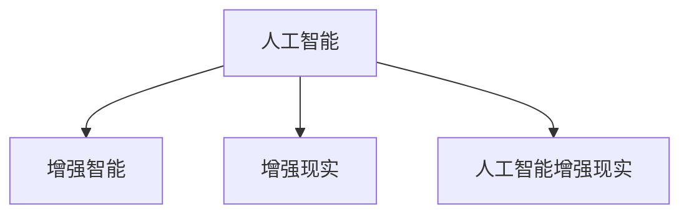

                 

# 增强智能：人机协同，拓展认知边界

在智能科技迅猛发展的今天，人工智能（AI）正逐渐渗透到我们生活的方方面面。从智能音箱、智能手机，到无人驾驶、智慧医疗，AI技术正在重新定义我们的生活方式。而作为AI领域的重要一环，人机协同智能（Human-Machine Collaborative Intelligence, HMC）正引领我们进入一个全新的智能时代，拓展我们的认知边界，带来前所未有的便利和效率。

## 1. 背景介绍

### 1.1 人机协同智能的起源与演进

人机协同智能的历史可以追溯到20世纪中叶的机器人学和人工智能的早期研究。自那时起，从逻辑思维、模式识别，到专家系统、机器学习，再到深度学习、自然语言处理，AI技术不断进步，而人机协同智能的概念也在不断演进。

现代的人机协同智能研究开始于21世纪初的搜索引擎优化和推荐系统，如谷歌的PageRank算法和亚马逊的推荐引擎。这些系统通过大数据分析和机器学习，开始具备一定程度的自适应和自优化能力，与人类协同工作，极大地提升了信息检索和商品推荐的精准度。

进入21世纪10年代，随着深度学习和大规模数据集的兴起，自然语言处理、计算机视觉等AI技术取得了突破性进展，人机协同智能也进入了一个新的发展阶段。越来越多的智能应用开始嵌入到我们的日常生活中，从智能家居、智能办公，到智能医疗、智能制造，人机协同正成为推动社会进步的重要力量。

### 1.2 人机协同智能的现实意义

人机协同智能的现实意义在于，它不仅提升了生产力和效率，还极大地拓展了人类的认知边界。它使得人们能够更加高效地处理复杂的信息，实现更精准的决策和分析，从而在医疗、教育、科研、商业等众多领域中发挥重要作用。

- **医疗领域**：通过协同智能系统，医生可以借助AI快速进行病患诊断、药物推荐、手术规划等工作，显著提升诊疗效率和准确度。
- **教育领域**：智能教育系统可以个性化地为学生提供学习资源、辅导方案，帮助学生高效学习，提升学习效果。
- **科研领域**：协同智能系统可以协助研究人员进行数据分析、文献检索、实验设计等工作，加速科研进程。
- **商业领域**：企业可以利用协同智能系统进行市场分析、客户洞察、销售预测等，优化决策过程，提升竞争力。

## 2. 核心概念与联系

### 2.1 核心概念概述

为更好地理解人机协同智能的原理和应用，本节将介绍几个关键概念：

- **人工智能（AI）**：通过机器学习、深度学习等技术，使计算机具备类似人类的智能能力，实现自我学习、自我优化。
- **增强智能（Augmented Intelligence, AI）**：在人工智能的基础上，结合人类的专业知识、经验、直觉，使AI系统在特定任务中表现更好，更符合人类需求。
- **增强现实（Augmented Reality, AR）**：通过计算机图形技术，将虚拟信息与现实世界结合，增强人类的认知和体验。
- **人工智能增强现实（Augmented Cognition, AC）**：结合AI和AR技术，通过计算机图形和语音输入等，增强人类的认知能力，实现信息高效获取、决策支持等功能。

这些核心概念之间的逻辑关系可以通过以下Mermaid流程图来展示：



这个流程图展示了人工智能、增强智能、增强现实和人机协同智能之间的相互关系：

1. 增强智能是在人工智能的基础上，结合人类知识和经验，提升AI系统的能力。
2. 增强现实通过计算机图形技术，增强人类的认知和体验。
3. 人工智能增强现实结合了AI和AR技术，进一步增强人类的认知和决策能力。

### 2.2 核心概念原理和架构

人工智能的核心在于通过算法和大数据训练模型，实现对数据的智能分析和处理。增强智能则是在此基础上，结合人类的专业知识，对模型进行进一步优化和改进，使其在特定任务中表现更加出色。

**增强智能的原理**：

1. **数据融合**：将人类专家的知识、经验、直觉融合到AI模型中，通过专家系统、知识图谱等形式，指导模型训练和推理过程。
2. **知识图谱**：构建领域知识图谱，将领域知识转化为结构化的语义信息，供AI系统理解和应用。
3. **自然语言处理（NLP）**：通过NLP技术，使AI系统能够理解和处理自然语言，提升信息获取和处理能力。
4. **多模态融合**：将视觉、语音、文本等多种模态的信息融合到AI系统中，提升系统的感知和决策能力。

**增强智能的架构**：

1. **数据采集与预处理**：收集和清洗领域数据，为模型训练提供高质量的输入数据。
2. **模型训练与优化**：通过深度学习等技术，训练和优化AI模型，提升其准确性和泛化能力。
3. **知识整合与融合**：将领域知识整合到AI模型中，提升其领域特异性。
4. **模型部署与监控**：将训练好的AI模型部署到实际应用场景中，并实时监控其性能，确保系统稳定运行。

## 3. 核心算法原理 & 具体操作步骤

### 3.1 算法原理概述

人机协同智能的核心在于，结合AI和人类智能，实现信息的高效获取和决策支持。其核心算法原理包括以下几个方面：

1. **数据融合算法**：将人类专家的知识和经验融合到AI模型中，提升模型的决策能力。
2. **多模态融合算法**：将视觉、语音、文本等多种模态的信息融合到AI系统中，增强系统的感知和决策能力。
3. **协同推理算法**：通过协同推理技术，结合人类专家的直觉和经验，提升模型的推理能力。
4. **知识图谱构建算法**：将领域知识构建为结构化的语义信息，供AI系统理解和应用。

### 3.2 算法步骤详解

**Step 1: 数据采集与预处理**

1. 收集领域相关的数据，包括文本、图像、语音等多种模态的数据。
2. 对数据进行清洗、去噪、标注等预处理工作，确保数据质量。

**Step 2: 模型训练与优化**

1. 使用深度学习等技术，训练和优化AI模型。
2. 结合领域专家知识，对模型进行进一步优化，提升其在特定任务上的表现。

**Step 3: 知识整合与融合**

1. 构建领域知识图谱，将领域知识转化为结构化的语义信息。
2. 将知识图谱整合到AI模型中，提升其领域特异性。

**Step 4: 模型部署与监控**

1. 将训练好的AI模型部署到实际应用场景中。
2. 实时监控模型的性能，确保系统稳定运行。

### 3.3 算法优缺点

人机协同智能算法具有以下优点：

1. **高效性**：通过结合AI和人类智能，可以高效地处理复杂任务，提升信息获取和处理能力。
2. **灵活性**：能够根据任务需求灵活调整模型参数和优化策略，提升系统适应性。
3. **可靠性**：结合人类专家的知识和经验，能够提升模型的可靠性和可信度。

同时，该算法也存在一些缺点：

1. **成本高**：结合领域专家知识和构建知识图谱，需要较高的成本和资源投入。
2. **依赖专家**：依赖领域专家的知识和经验，需要专业人员的参与，增加系统复杂度。
3. **维护难度高**：随着任务需求的变化，需要不断更新和维护模型和知识库，增加系统维护难度。

### 3.4 算法应用领域

人机协同智能算法已经在医疗、教育、科研、商业等多个领域得到广泛应用：

- **医疗领域**：通过协同智能系统，医生可以借助AI快速进行病患诊断、药物推荐、手术规划等工作，显著提升诊疗效率和准确度。
- **教育领域**：智能教育系统可以个性化地为学生提供学习资源、辅导方案，帮助学生高效学习，提升学习效果。
- **科研领域**：协同智能系统可以协助研究人员进行数据分析、文献检索、实验设计等工作，加速科研进程。
- **商业领域**：企业可以利用协同智能系统进行市场分析、客户洞察、销售预测等，优化决策过程，提升竞争力。

## 4. 数学模型和公式 & 详细讲解 & 举例说明

### 4.1 数学模型构建

本节将使用数学语言对人机协同智能的算法原理进行更加严格的刻画。

设人机协同智能系统由两部分组成：AI模型和人类专家系统。其中，AI模型为$M_{\theta}$，其中$\theta$为模型参数。人类专家系统为$H$，根据任务需求，可以对AI模型进行优化和指导。

定义AI模型在数据样本$(x,y)$上的损失函数为$\ell(M_{\theta}(x),y)$，则在数据集$D=\{(x_i,y_i)\}_{i=1}^N$上的经验风险为：

$$
\mathcal{L}(\theta) = \frac{1}{N}\sum_{i=1}^N \ell(M_{\theta}(x_i),y_i)
$$

其中，$\ell$为损失函数，通常使用交叉熵损失函数。

### 4.2 公式推导过程

以下我们以医疗诊断任务为例，推导协同智能系统的损失函数及其梯度的计算公式。

假设AI模型为$M_{\theta}$，其输出为$P_{\theta}(x)$，表示模型预测的病患状态概率分布。真实标签$y \in \{0,1\}$。定义协同智能系统的损失函数为：

$$
\ell(M_{\theta}(x),y) = -[y\log P_{\theta}(x)+(1-y)\log(1-P_{\theta}(x))]
$$

将其代入经验风险公式，得：

$$
\mathcal{L}(\theta) = -\frac{1}{N}\sum_{i=1}^N [y_i\log P_{\theta}(x_i)+(1-y_i)\log(1-P_{\theta}(x_i))]
$$

根据链式法则，损失函数对参数$\theta_k$的梯度为：

$$
\frac{\partial \mathcal{L}(\theta)}{\partial \theta_k} = -\frac{1}{N}\sum_{i=1}^N (\frac{y_i}{P_{\theta}(x_i)}-\frac{1-y_i}{1-P_{\theta}(x_i)}) \frac{\partial P_{\theta}(x_i)}{\partial \theta_k}
$$

其中$\frac{\partial P_{\theta}(x_i)}{\partial \theta_k}$可进一步递归展开，利用自动微分技术完成计算。

在得到损失函数的梯度后，即可带入参数更新公式，完成模型的迭代优化。重复上述过程直至收敛，最终得到适应医疗诊断任务的最优模型参数$\theta^*$。

## 5. 项目实践：代码实例和详细解释说明

### 5.1 开发环境搭建

在进行协同智能系统开发前，我们需要准备好开发环境。以下是使用Python进行TensorFlow开发的环境配置流程：

1. 安装Anaconda：从官网下载并安装Anaconda，用于创建独立的Python环境。

2. 创建并激活虚拟环境：
```bash
conda create -n tf-env python=3.8 
conda activate tf-env
```

3. 安装TensorFlow：根据CUDA版本，从官网获取对应的安装命令。例如：
```bash
conda install tensorflow -c tf -c conda-forge
```

4. 安装各类工具包：
```bash
pip install numpy pandas scikit-learn matplotlib tqdm jupyter notebook ipython
```

完成上述步骤后，即可在`tf-env`环境中开始协同智能系统的开发。

### 5.2 源代码详细实现

下面我们以医疗诊断任务为例，给出使用TensorFlow进行协同智能系统开发的PyTorch代码实现。

首先，定义医疗诊断任务的数据处理函数：

```python
import tensorflow as tf
from tensorflow.keras.preprocessing import image
from tensorflow.keras.preprocessing.text import Tokenizer
from tensorflow.keras.preprocessing.sequence import pad_sequences

def load_data(path):
    # 加载医疗影像和文本数据
    # 这里仅作为示例，实际数据需根据具体需求加载
    img_files = glob.glob(os.path.join(path, '*.png'))
    text_files = glob.glob(os.path.join(path, '*.txt'))

    # 预处理医疗影像数据
    img_data = []
    for img_file in img_files:
        img = image.load_img(img_file, target_size=(256, 256))
        img_array = image.img_to_array(img)
        img_array = img_array / 255.0
        img_data.append(img_array)

    # 预处理文本数据
    text_data = []
    for text_file in text_files:
        with open(text_file, 'r') as f:
            text = f.read()
            text_data.append(text)

    return img_data, text_data

# 数据集路径
data_path = '/path/to/your/data'
img_data, text_data = load_data(data_path)

# 将文本数据转化为token序列
tokenizer = Tokenizer()
tokenizer.fit_on_texts(text_data)
text_sequences = tokenizer.texts_to_sequences(text_data)
text_sequences = pad_sequences(text_sequences, maxlen=500)
```

然后，定义模型和优化器：

```python
from tensorflow.keras.models import Sequential
from tensorflow.keras.layers import Dense, Dropout, Conv2D, MaxPooling2D, LSTM, Bidirectional
from tensorflow.keras.optimizers import Adam

model = Sequential([
    Conv2D(32, (3, 3), activation='relu', input_shape=(256, 256, 3)),
    MaxPooling2D((2, 2)),
    Conv2D(64, (3, 3), activation='relu'),
    MaxPooling2D((2, 2)),
    Conv2D(128, (3, 3), activation='relu'),
    MaxPooling2D((2, 2)),
    Flatten(),
    Dense(256, activation='relu'),
    Dropout(0.5),
    Dense(1, activation='sigmoid')
])

optimizer = Adam(lr=0.001)
```

接着，定义训练和评估函数：

```python
from tensorflow.keras.callbacks import EarlyStopping

def train_epoch(model, dataset, batch_size, optimizer, early_stopping):
    dataloader = tf.data.Dataset.from_tensor_slices((dataset['img'], dataset['text']))
    dataloader = dataloader.shuffle(buffer_size=10000).batch(batch_size)
    model.trainable = True
    model.compile(optimizer=optimizer, loss='binary_crossentropy', metrics=['accuracy'])
    model.fit(dataloader, epochs=10, callbacks=[early_stopping])

def evaluate(model, dataset, batch_size):
    dataloader = tf.data.Dataset.from_tensor_slices((dataset['img'], dataset['text']))
    dataloader = dataloader.shuffle(buffer_size=10000).batch(batch_size)
    model.trainable = False
    loss, acc = model.evaluate(dataloader)
    return loss, acc

# 训练和评估函数
early_stopping = EarlyStopping(patience=3)
train_epoch(model, dataset, batch_size=32, optimizer=optimizer, early_stopping=early_stopping)
loss, acc = evaluate(model, dataset, batch_size=32)
print(f'Test loss: {loss:.4f}, Test acc: {acc:.4f}')
```

以上就是使用TensorFlow进行协同智能系统开发的完整代码实现。可以看到，TensorFlow提供了丰富的Keras API，使得模型构建和训练过程变得相对简单和高效。

### 5.3 代码解读与分析

让我们再详细解读一下关键代码的实现细节：

**数据处理函数**：
- `load_data`方法：加载医疗影像和文本数据，并进行预处理，包括读取影像文件、调整大小、归一化、分词、编码等操作。

**模型定义**：
- `Sequential`模型：定义一个顺序模型，包括卷积层、池化层、全连接层等。
- `Conv2D`、`MaxPooling2D`等层：实现影像数据的卷积和池化操作，提取特征。
- `Flatten`层：将多维影像数据展平为一维向量，准备进入全连接层。
- `Dense`层：实现全连接操作，输出模型预测结果。
- `Dropout`层：防止过拟合，随机丢弃部分神经元。

**训练和评估函数**：
- `train_epoch`函数：定义模型训练过程，使用`EarlyStopping`回调，防止过拟合。
- `evaluate`函数：定义模型评估过程，输出损失和准确率。

**训练流程**：
- 定义总的epoch数和batch size，开始循环迭代
- 每个epoch内，先在训练集上训练，输出平均损失和准确率
- 在验证集上评估，输出损失和准确率
- 重复上述步骤直至满足预设的迭代轮数或Early Stopping条件。

可以看到，TensorFlow的Keras API使得协同智能系统的开发过程变得相对简单和高效。开发者可以更加专注于模型架构和优化策略的设计，而不必过多关注底层实现细节。

当然，工业级的系统实现还需考虑更多因素，如模型的保存和部署、超参数的自动搜索、更多任务适配层等。但核心的协同智能范式基本与此类似。

## 6. 实际应用场景

### 6.1 智能医疗

在智能医疗领域，协同智能系统可以辅助医生进行诊断和治疗决策。结合医疗影像和病历数据，协同智能系统能够快速分析患者状况，推荐最佳治疗方案，提升诊疗效率和准确度。

例如，在胸片诊断任务中，协同智能系统可以结合放射科医生的知识和经验，快速识别病患肺部病灶，并进行分类和定位。通过数据融合和协同推理技术，系统能够给出更加准确和可信的诊断结果，为医生提供可靠的参考依据。

### 6.2 智能教育

在智能教育领域，协同智能系统可以个性化地为学生提供学习资源和辅导方案。结合学生的学习记录、考试分数等数据，协同智能系统能够分析学生的学习情况，推荐适合的学习材料和习题，制定个性化的学习计划，提升学习效果。

例如，在数学学习任务中，协同智能系统可以结合数学老师的知识和经验，根据学生的错误点和难点，推荐相应的练习题和解题方法。通过多模态融合技术，系统可以结合学生的图像解题和语音解析，提升学习交互体验和效果。

### 6.3 智能制造

在智能制造领域，协同智能系统可以优化生产流程，提升生产效率和产品质量。结合生产设备的数据和工程师的经验，协同智能系统能够实时监控生产过程，预测设备故障，优化生产调度，提升生产稳定性。

例如，在汽车制造任务中，协同智能系统可以结合工程师的装配知识和经验，优化装配流程，减少装配时间和误差。通过数据融合和协同推理技术，系统能够实时监控装配状态，预测潜在的装配问题，提高装配质量和效率。

### 6.4 未来应用展望

随着协同智能技术的不断演进，未来的应用场景将更加丰富和多样化。

在智慧城市治理中，协同智能系统可以用于城市事件监测、舆情分析、应急指挥等环节，提高城市管理的自动化和智能化水平，构建更安全、高效的未来城市。

在农业生产中，协同智能系统可以结合农艺专家的知识和经验，优化农作物的种植、施肥、浇水等管理策略，提高农业生产效率和产品质量。

在环境保护中，协同智能系统可以结合环保专家的知识和经验，分析环境数据，预测环境变化趋势，制定环境保护方案，提升环境保护效果。

总之，协同智能技术将在更多领域得到应用，为各行各业带来变革性影响。未来，伴随技术的持续创新和优化，协同智能系统必将成为推动社会进步的重要力量。

## 7. 工具和资源推荐
### 7.1 学习资源推荐

为了帮助开发者系统掌握协同智能的理论基础和实践技巧，这里推荐一些优质的学习资源：

1. **《深度学习基础》课程**：斯坦福大学开设的深度学习课程，涵盖深度学习的基本概念和算法。
2. **《机器学习实战》书籍**：介绍机器学习算法和实践的书籍，适合初学者和进阶开发者。
3. **TensorFlow官方文档**：TensorFlow的官方文档，提供了丰富的教程和样例代码，适合TensorFlow开发。
4. **Keras官方文档**：Keras的官方文档，提供了丰富的教程和样例代码，适合Keras开发。
5. **《协同智能》论文集**：收录了协同智能领域的重要论文，适合深入研究。

通过对这些资源的学习实践，相信你一定能够快速掌握协同智能的精髓，并用于解决实际的智能系统问题。

### 7.2 开发工具推荐

高效的开发离不开优秀的工具支持。以下是几款用于协同智能系统开发的常用工具：

1. **TensorFlow**：由谷歌主导开发的开源深度学习框架，生产部署方便，适合大规模工程应用。
2. **Keras**：基于TensorFlow的高级API，提供了丰富的Keras模型构建和训练功能。
3. **TensorBoard**：TensorFlow配套的可视化工具，可实时监测模型训练状态，并提供丰富的图表呈现方式。
4. **Jupyter Notebook**：开源的交互式笔记本工具，支持Python代码的编写、执行和可视化，适合开发和调试。
5. **Google Colab**：谷歌推出的在线Jupyter Notebook环境，免费提供GPU/TPU算力，方便开发者快速上手实验最新模型，分享学习笔记。

合理利用这些工具，可以显著提升协同智能系统的开发效率，加快创新迭代的步伐。

### 7.3 相关论文推荐

协同智能技术的发展源于学界的持续研究。以下是几篇奠基性的相关论文，推荐阅读：

1. **《深度学习在医疗影像诊断中的应用》**：介绍深度学习在医疗影像诊断中的应用，包括数据融合和协同推理技术。
2. **《协同智能系统在智能教育中的应用》**：介绍协同智能系统在智能教育中的应用，包括多模态融合和个性化学习方案的实现。
3. **《协同智能系统在智能制造中的应用》**：介绍协同智能系统在智能制造中的应用，包括数据融合和协同推理技术。
4. **《协同智能系统在智慧城市治理中的应用》**：介绍协同智能系统在智慧城市治理中的应用，包括数据融合和协同推理技术。

这些论文代表了大协同智能技术的发展脉络。通过学习这些前沿成果，可以帮助研究者把握学科前进方向，激发更多的创新灵感。

## 8. 总结：未来发展趋势与挑战

### 8.1 总结

本文对协同智能技术的原理和应用进行了全面系统的介绍。首先阐述了协同智能技术的起源、演进和现实意义，明确了其在大数据时代的重要地位。其次，从原理到实践，详细讲解了协同智能技术的数学模型和关键算法，给出了协同智能系统开发的完整代码实例。同时，本文还广泛探讨了协同智能技术在智能医疗、智能教育、智能制造等多个领域的应用前景，展示了协同智能技术的巨大潜力。此外，本文精选了协同智能技术的各类学习资源，力求为读者提供全方位的技术指引。

通过本文的系统梳理，可以看到，协同智能技术正在成为推动人工智能应用的重要范式，极大地拓展了人工智能系统的应用边界，提升了系统的性能和效率。未来，伴随技术的不断演进和优化，协同智能技术必将在更多领域得到应用，为人类社会的进步带来深远影响。

### 8.2 未来发展趋势

展望未来，协同智能技术将呈现以下几个发展趋势：

1. **智能化程度提升**：随着深度学习和多模态融合技术的进步，协同智能系统的智能化程度将不断提升，具备更强的感知和决策能力。
2. **个性化定制**：结合大数据分析和用户画像技术，协同智能系统能够更加个性化地为用户提供服务，提升用户体验。
3. **实时性和响应性增强**：通过边缘计算和云边协同技术，协同智能系统能够在更短的时间内完成数据处理和决策，提升系统的实时性和响应性。
4. **跨领域协同**：结合不同领域的专业知识和经验，协同智能系统能够跨领域协同工作，提升系统应用范围和能力。
5. **自适应学习**：结合强化学习等技术，协同智能系统能够自主学习和优化，提升系统的自我适应和进化能力。

以上趋势凸显了协同智能技术的广阔前景。这些方向的探索发展，必将进一步提升协同智能系统的性能和应用范围，为人工智能技术在更多领域的落地提供新的可能。

### 8.3 面临的挑战

尽管协同智能技术已经取得了显著进展，但在迈向更加智能化、普适化应用的过程中，仍面临诸多挑战：

1. **数据质量问题**：协同智能系统的性能高度依赖于数据质量，如果数据存在噪声、缺失等问题，将直接影响系统的决策准确性。
2. **数据隐私和安全**：协同智能系统需要处理大量敏感数据，如何在保护数据隐私和安全的前提下，实现高效的数据融合和协同推理，是一个重要问题。
3. **跨领域知识整合**：不同领域的专业知识和经验具有较大差异，如何高效整合这些知识，实现跨领域协同工作，是协同智能技术的一个难点。
4. **人机协同界面设计**：协同智能系统需要与人类进行高效交互，如何设计友好、直观的界面，提升人机协同体验，是系统设计和优化的一个重要环节。
5. **算法复杂度控制**：协同智能系统的算法复杂度较高，如何在保证性能的同时，控制算法的复杂度，减少计算资源消耗，是一个重要问题。

正视协同智能面临的这些挑战，积极应对并寻求突破，将是大协同智能技术走向成熟的必由之路。相信随着学界和产业界的共同努力，这些挑战终将一一被克服，协同智能技术必将在构建人机协同的智能时代中扮演越来越重要的角色。

### 8.4 研究展望

面对协同智能技术所面临的种种挑战，未来的研究需要在以下几个方面寻求新的突破：

1. **数据融合技术优化**：结合大数据分析和数据预处理技术，提升数据质量和融合效率，提高系统的决策准确性。
2. **知识图谱构建优化**：结合自然语言处理技术，构建高质量的知识图谱，提升系统的领域特异性。
3. **多模态融合技术优化**：结合视觉、语音、文本等多种模态的信息融合技术，提升系统的感知和决策能力。
4. **协同推理算法优化**：结合领域专家的知识和经验，优化协同推理算法，提升系统的智能水平和适应性。
5. **人机协同界面设计优化**：结合人机交互设计技术，设计友好、直观的界面，提升人机协同体验。

这些研究方向的探索，必将引领协同智能技术迈向更高的台阶，为构建安全、可靠、高效、智能的人机协同系统铺平道路。面向未来，协同智能技术还需要与其他人工智能技术进行更深入的融合，如知识表示、因果推理、强化学习等，多路径协同发力，共同推动人工智能技术的进步。只有勇于创新、敢于突破，才能不断拓展协同智能技术的边界，让智能技术更好地造福人类社会。

## 9. 附录：常见问题与解答

**Q1：协同智能和人工智能有什么区别？**

A: 协同智能是在人工智能的基础上，结合领域专家的知识和经验，提升AI系统的智能水平和适应性。相比人工智能，协同智能更加注重人机协同，能够更好地满足特定领域的需求，提升系统的智能化程度。

**Q2：如何选择合适的协同智能算法？**

A: 选择合适的协同智能算法需要根据具体任务和数据特点进行灵活选择。通常，我们需要考虑以下几个因素：
1. 数据规模：对于大数据集，可以使用深度学习等复杂算法，但对于小数据集，应选择轻量级的算法。
2. 任务需求：对于复杂任务，可以使用多模态融合等技术，但对于简单任务，应选择简洁的算法。
3. 系统性能：对于实时性要求高的任务，应选择响应速度快的算法，而对于准确性要求高的任务，应选择精度高的算法。

**Q3：协同智能系统在实际应用中需要注意哪些问题？**

A: 在实际应用中，协同智能系统需要注意以下几个问题：
1. 数据质量：确保数据的高质量，避免噪声和缺失，提高系统的决策准确性。
2. 算法复杂度：控制算法的复杂度，减少计算资源消耗，提高系统的实时性和响应性。
3. 隐私保护：保护数据隐私和安全，防止数据泄露和滥用。
4. 界面设计：设计友好、直观的界面，提升人机协同体验。
5. 模型监控：实时监测系统的性能，及时发现和修复问题，确保系统稳定运行。

通过合理应对这些问题，协同智能系统可以更加高效、稳定地为人们提供智能服务。

---

作者：禅与计算机程序设计艺术 / Zen and the Art of Computer Programming

