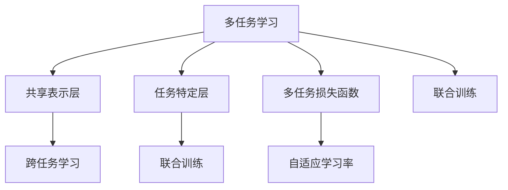

                 

## 1. 背景介绍

### 1.1 问题由来
在自然语言处理（NLP）领域，常见的任务包括文本分类、命名实体识别、关系抽取、情感分析、机器翻译、问答系统等。每一个任务都需要构建一个单独的模型，分别进行训练和测试。但是，这种逐个解决的方式不仅增加了模型训练的复杂度，而且需要大量的标注数据，这对于一些小规模或低频任务而言，非常不经济。此外，许多NLP任务之间存在相互依赖或共同特征，如果能够将这些任务联合在一起进行训练，可以有效地提高模型性能，降低成本。

为了解决这些问题，多任务学习（Multi-Task Learning, MTL）应运而生。MTL旨在通过联合训练多个任务，共享模型参数，提升模型的泛化能力和迁移学习能力，更好地适应不同的NLP任务。

### 1.2 问题核心关键点
多任务学习的核心在于，通过在训练过程中同时解决多个相关的NLP任务，共享模型参数和特征表示，从而提高模型的整体性能和泛化能力。具体而言，MTL有如下几个关键点：

1. 多任务模型的结构：一个多任务模型通常包括多个独立的子任务模型和一个共享的特征表示层。每个子任务模型负责处理特定的NLP任务，而特征表示层则负责提取多任务间的公共特征。
2. 多任务损失函数的设计：为了同时优化多个任务，需要设计一个多任务损失函数，将多个任务的损失权重和关系结合起来。
3. 多任务数据处理：将不同任务的数据进行统一处理，合并为一个大样本集，训练时进行联合优化。
4. 多任务优化器选择：选择适合多任务学习的优化器，如自适应学习率优化器（如AdamW），使得模型可以更高效地学习。
5. 多任务评估与诊断：评估多任务模型的性能，并诊断模型在不同任务间的泛化能力。

本文将从理论到实践，全面介绍多任务学习在NLP中的应用，包括多任务模型的构建、多任务损失函数的设计、多任务数据处理的技巧以及多任务优化的实践方法。通过深入讲解这些核心问题，希望能帮助读者更好地理解和应用多任务学习技术。

## 2. 核心概念与联系

### 2.1 核心概念概述

为了更好地理解多任务学习在NLP中的应用，本节将介绍几个核心概念：

- **多任务学习（MTL）**：指在训练过程中同时解决多个相关NLP任务的机器学习范式。通过共享模型参数，提升模型的泛化能力和迁移学习能力。
- **共享表示层（Shared Representation Layer）**：多任务模型的核心组件，负责提取多任务间的公共特征表示。
- **任务特定层（Task-Specific Layer）**：每个子任务模型的组成部分，负责处理特定任务的特征表示，并输出任务结果。
- **多任务损失函数（Multi-Task Loss Function）**：用于同时优化多个任务，通常包括任务间的权重和约束条件。
- **跨任务学习（Cross-Task Learning）**：指在不同任务间共享知识和特征，提升模型在特定任务上的性能。
- **联合训练（Joint Training）**：在训练过程中，同时更新多个任务模型的参数，共享表示层和任务特定层的权重。
- **自适应学习率（Adaptive Learning Rate）**：适用于多任务学习的优化器，可以动态调整每个任务的优化策略。

这些核心概念之间的关系可以通过以下Mermaid流程图来展示：



这个流程图展示了大语言模型的工作原理和优化方法：

1. 多任务学习通过共享表示层，提取多个任务之间的公共特征。
2. 任务特定层负责处理特定任务的特征表示。
3. 多任务损失函数将多个任务的优化目标结合起来。
4. 联合训练使得模型可以在多个任务上进行同步优化。
5. 自适应学习率可以动态调整每个任务的优化策略。

## 3. 核心算法原理 & 具体操作步骤
### 3.1 算法原理概述

多任务学习的核心思想是，通过联合训练多个NLP任务，共享模型参数和特征表示，提高模型的泛化能力和迁移学习能力。

形式化地，假设存在 $K$ 个任务 $T_k$（$k=1,2,...,K$），每个任务 $T_k$ 对应的损失函数为 $\ell_k$。多任务学习的目标是通过最小化联合损失函数 $\mathcal{L}$ 来优化模型参数 $\theta$：

$$
\theta^* = \mathop{\arg\min}_{\theta} \mathcal{L}(\theta)
$$

其中，联合损失函数 $\mathcal{L}$ 可以表示为多个任务损失函数的加权和，通常包含任务间的权重和约束条件：

$$
\mathcal{L}(\theta) = \sum_{k=1}^K \alpha_k \ell_k(M_{\theta})
$$

其中，$\alpha_k$ 为任务 $T_k$ 的权重，控制不同任务的重要性。

### 3.2 算法步骤详解

多任务学习在NLP中的应用，通常遵循以下步骤：

**Step 1: 数据预处理**

- 收集多个相关NLP任务的标注数据，并统一格式。
- 对于文本数据，通常使用相同的分词器进行预处理，保证特征表示的一致性。
- 对于不同的任务，可能需要设计特定的任务表示层，处理特定的特征。

**Step 2: 构建多任务模型**

- 设计多任务模型结构，包括共享表示层和任务特定层。
- 在共享表示层中，使用相同的特征提取器，提取多任务之间的公共特征。
- 在任务特定层中，使用不同的子任务模型，分别处理每个任务。

**Step 3: 定义多任务损失函数**

- 根据不同任务的特点，设计多任务损失函数。
- 任务间的权重 $\alpha_k$ 可以根据任务难度、数据量等因素进行动态调整。
- 任务间的约束条件可以控制模型在不同任务之间的知识共享和特征提取。

**Step 4: 优化多任务模型**

- 选择适合的优化器，如自适应学习率优化器（如AdamW）。
- 训练过程中，同时优化多个任务模型，使得共享表示层和任务特定层的参数动态更新。
- 定期在验证集上评估模型性能，调整任务间的权重和约束条件，防止过拟合。

**Step 5: 模型评估与诊断**

- 使用多任务评估指标，如任务准确率、F1分数等，评估模型在多个任务上的性能。
- 通过可视化工具，观察模型在不同任务之间的知识共享和泛化能力。
- 诊断模型在不同任务上的表现，发现知识转移的瓶颈。

### 3.3 算法优缺点

多任务学习在NLP中的应用具有以下优点：

1. **数据利用率高**：通过共享表示层，利用不同任务之间的知识，减少了训练数据的需求，提高了数据利用率。
2. **泛化能力强**：多任务学习可以提升模型的泛化能力，使其在不同任务上表现更稳定。
3. **迁移学习效果好**：共享表示层可以提升模型在特定任务上的迁移学习能力，减少从头训练的复杂度。
4. **减少模型复杂度**：通过共享表示层，减少模型的参数量，降低模型的计算复杂度。

同时，多任务学习也存在一些局限性：

1. **任务间关系复杂**：不同任务之间的关系复杂，设计合适的多任务损失函数和约束条件比较困难。
2. **优化难度大**：多任务学习需要同时优化多个任务，增加优化难度。
3. **泛化风险**：多任务学习模型可能会在不同任务间产生泛化风险，导致某个任务性能下降。
4. **过拟合风险**：如果任务间特征差异大，共享表示层可能过拟合到某些任务的特征，影响泛化能力。

尽管存在这些局限性，多任务学习仍然是一种非常有效的NLP技术，特别是在数据量不足或任务复杂度高的情况下，多任务学习可以显著提升模型的性能和泛化能力。

### 3.4 算法应用领域

多任务学习在NLP领域有广泛的应用，例如：

- **多任务文本分类**：联合训练多个文本分类任务，提升模型的泛化能力。
- **多任务命名实体识别**：联合训练多个命名实体识别任务，共享实体类型的表示。
- **多任务关系抽取**：联合训练多个关系抽取任务，提升模型对实体关系的理解。
- **多任务情感分析**：联合训练多个情感分析任务，提升模型对情感语义的理解。
- **多任务问答系统**：联合训练多个问答任务，提升模型对知识库的整合能力。

除了上述这些经典任务外，多任务学习还被创新性地应用到更多场景中，如对话系统、翻译、信息检索等，为NLP技术带来了新的突破。

## 4. 数学模型和公式 & 详细讲解 & 举例说明

### 4.1 数学模型构建

多任务学习的数学模型通常由共享表示层和多个任务表示层组成。以文本分类和多任务情感分析为例，假设共有 $K$ 个任务，每个任务 $T_k$ 对应的损失函数为 $\ell_k$，共享表示层输出为 $Z$，任务特定层的输出为 $Y_k$。

多任务学习模型的总体损失函数可以表示为：

$$
\mathcal{L}(\theta) = \sum_{k=1}^K \alpha_k \ell_k(Z, Y_k)
$$

其中，$Z$ 为共享表示层输出，$Y_k$ 为任务 $T_k$ 的预测结果，$\alpha_k$ 为任务权重。

### 4.2 公式推导过程

以二分类任务和多任务情感分析为例，推导多任务学习模型的损失函数。

假设共享表示层输出为 $Z$，每个任务 $T_k$ 对应的标签为 $Y_k$。二分类任务的交叉熵损失函数为：

$$
\ell_k(Z, Y_k) = -\frac{1}{n_k} \sum_{i=1}^{n_k}[y_k^{(i)}\log \sigma(Z^{(i)})+(1-y_k^{(i)})\log(1-\sigma(Z^{(i)}))]
$$

其中，$n_k$ 为任务 $T_k$ 的样本数量，$y_k^{(i)}$ 为任务 $T_k$ 的标签，$\sigma$ 为sigmoid函数。

多任务情感分析任务的情感标签为：

$$
y_k^{(i)} = \begin{cases}
1 & \text{if positive} \\
0 & \text{if negative}
\end{cases}
$$

多任务学习模型的总体损失函数为：

$$
\mathcal{L}(\theta) = \alpha_1 \ell_1(Z, Y_1) + \alpha_2 \ell_2(Z, Y_2) + \ldots + \alpha_K \ell_K(Z, Y_K)
$$

其中，$\alpha_k$ 为任务权重，$Z$ 为共享表示层输出，$Y_k$ 为任务 $T_k$ 的预测结果。

### 4.3 案例分析与讲解

以多任务情感分析为例，分析多任务学习的数学模型和损失函数。

假设共有两个情感分析任务：正面情感和负面情感。每个任务对应的标签为 $y_k^{(i)}$，其中 $k=1,2$ 分别表示正面情感和负面情感。多任务学习模型的损失函数可以表示为：

$$
\mathcal{L}(\theta) = \alpha_1 \ell_1(Z, Y_1) + \alpha_2 \ell_2(Z, Y_2)
$$

其中，$\ell_1$ 和 $\ell_2$ 分别表示正面情感和负面情感的损失函数，$\alpha_1$ 和 $\alpha_2$ 为任务权重。

在实际应用中，可以采用基于梯度的优化算法（如AdamW）进行多任务学习模型的训练。例如，在每个epoch中，先计算每个任务的梯度，然后按照任务权重进行加权平均，更新共享表示层和任务特定层的参数。

## 5. 项目实践：代码实例和详细解释说明
### 5.1 开发环境搭建

在进行多任务学习实践前，我们需要准备好开发环境。以下是使用Python进行PyTorch开发的环境配置流程：

1. 安装Anaconda：从官网下载并安装Anaconda，用于创建独立的Python环境。

2. 创建并激活虚拟环境：
```bash
conda create -n pytorch-env python=3.8 
conda activate pytorch-env
```

3. 安装PyTorch：根据CUDA版本，从官网获取对应的安装命令。例如：
```bash
conda install pytorch torchvision torchaudio cudatoolkit=11.1 -c pytorch -c conda-forge
```

4. 安装Transformers库：
```bash
pip install transformers
```

5. 安装各类工具包：
```bash
pip install numpy pandas scikit-learn matplotlib tqdm jupyter notebook ipython
```

完成上述步骤后，即可在`pytorch-env`环境中开始多任务学习实践。

### 5.2 源代码详细实现

这里以多任务情感分析为例，展示使用Transformers库进行多任务学习模型的实现。

首先，定义多任务情感分析的数据处理函数：

```python
from transformers import BertTokenizer
from torch.utils.data import Dataset
import torch

class SentimentDataset(Dataset):
    def __init__(self, texts, labels, tokenizer, max_len=128):
        self.texts = texts
        self.labels = labels
        self.tokenizer = tokenizer
        self.max_len = max_len
        
    def __len__(self):
        return len(self.texts)
    
    def __getitem__(self, item):
        text = self.texts[item]
        label = self.labels[item]
        
        encoding = self.tokenizer(text, return_tensors='pt', max_length=self.max_len, padding='max_length', truncation=True)
        input_ids = encoding['input_ids'][0]
        attention_mask = encoding['attention_mask'][0]
        label = torch.tensor(label, dtype=torch.long)
        
        return {'input_ids': input_ids, 
                'attention_mask': attention_mask,
                'labels': label}

# 标签与id的映射
label2id = {'positive': 1, 'negative': 0}
id2label = {v: k for k, v in label2id.items()}

# 创建dataset
tokenizer = BertTokenizer.from_pretrained('bert-base-cased')

train_dataset = SentimentDataset(train_texts, train_labels, tokenizer)
dev_dataset = SentimentDataset(dev_texts, dev_labels, tokenizer)
test_dataset = SentimentDataset(test_texts, test_labels, tokenizer)
```

然后，定义多任务学习模型：

```python
from transformers import BertForSequenceClassification, BertModel, BertTokenizer
import torch.nn as nn
from transformers import AdamW

class MultitaskModel(nn.Module):
    def __init__(self, num_labels, bert_model):
        super(MultitaskModel, self).__init__()
        
        self.bert = bert_model
        self.head1 = nn.Linear(bert_model.config.hidden_size, num_labels)
        self.head2 = nn.Linear(bert_model.config.hidden_size, num_labels)
        
    def forward(self, input_ids, attention_mask, labels1=None, labels2=None):
        outputs = self.bert(input_ids, attention_mask=attention_mask, output_hidden_states=True)
        pooled_output = outputs.pooler_output
        
        logits1 = self.head1(pooled_output)
        logits2 = self.head2(pooled_output)
        
        if labels1 is not None:
            loss1 = nn.CrossEntropyLoss()(logits1, labels1)
        else:
            loss1 = None
        
        if labels2 is not None:
            loss2 = nn.CrossEntropyLoss()(logits2, labels2)
        else:
            loss2 = None
        
        return {'loss1': loss1, 'loss2': loss2}

# 创建任务1和任务2的损失函数
loss_fct1 = nn.CrossEntropyLoss()
loss_fct2 = nn.CrossEntropyLoss()

# 创建多任务模型
num_labels1 = 2
num_labels2 = 3
bert_model = BertModel.from_pretrained('bert-base-cased')
multitask_model = MultitaskModel(num_labels1, bert_model)

# 创建优化器
optimizer = AdamW(multitask_model.parameters(), lr=2e-5)
```

接着，定义训练和评估函数：

```python
from torch.utils.data import DataLoader
from tqdm import tqdm
from sklearn.metrics import classification_report

device = torch.device('cuda') if torch.cuda.is_available() else torch.device('cpu')
multitask_model.to(device)

def train_epoch(model, dataset, batch_size, optimizer, loss_fct1, loss_fct2):
    dataloader = DataLoader(dataset, batch_size=batch_size, shuffle=True)
    model.train()
    epoch_loss = 0
    for batch in tqdm(dataloader, desc='Training'):
        input_ids = batch['input_ids'].to(device)
        attention_mask = batch['attention_mask'].to(device)
        labels1 = batch['labels'].to(device)
        labels2 = None
        model.zero_grad()
        outputs = model(input_ids, attention_mask=attention_mask, labels1=labels1, labels2=labels2)
        loss1 = outputs['loss1']
        loss2 = outputs['loss2']
        epoch_loss += (loss1 + loss2).item()
        loss1.backward()
        loss2.backward()
        optimizer.step()
    return epoch_loss / len(dataloader)

def evaluate(model, dataset, batch_size, loss_fct1, loss_fct2):
    dataloader = DataLoader(dataset, batch_size=batch_size)
    model.eval()
    preds1, preds2 = [], []
    labels1, labels2 = [], []
    with torch.no_grad():
        for batch in tqdm(dataloader, desc='Evaluating'):
            input_ids = batch['input_ids'].to(device)
            attention_mask = batch['attention_mask'].to(device)
            labels1 = batch['labels'].to(device)
            labels2 = batch['labels2'].to(device)
            outputs = model(input_ids, attention_mask=attention_mask, labels1=labels1, labels2=labels2)
            preds1.append(outputs.logits1.argmax(dim=1).tolist())
            preds2.append(outputs.logits2.argmax(dim=1).tolist())
            labels1 = labels1.to('cpu').tolist()
            labels2 = labels2.to('cpu').tolist()
            for pred_tokens, label_tokens in zip(preds1, labels1):
                preds1.append(pred_tokens[:len(label_tokens)])
                labels1.append(label_tokens)
                
    print(classification_report(labels1, preds1, target_names=id2label.values()))
    print(classification_report(labels2, preds2, target_names=id2label.values()))

# 定义任务权重
alpha1 = 0.5
alpha2 = 0.5

# 启动训练流程并在测试集上评估
epochs = 5
batch_size = 16

for epoch in range(epochs):
    loss = train_epoch(multitask_model, train_dataset, batch_size, optimizer, loss_fct1, loss_fct2)
    print(f"Epoch {epoch+1}, train loss: {loss:.3f}")
    
    print(f"Epoch {epoch+1}, dev results:")
    evaluate(multitask_model, dev_dataset, batch_size, loss_fct1, loss_fct2)
    
print("Test results:")
evaluate(multitask_model, test_dataset, batch_size, loss_fct1, loss_fct2)
```

以上就是使用PyTorch对BERT模型进行多任务情感分析任务的多任务学习代码实现。可以看到，借助Transformers库，多任务学习模型的构建和训练变得非常简便。

### 5.3 代码解读与分析

让我们再详细解读一下关键代码的实现细节：

**SentimentDataset类**：
- `__init__`方法：初始化文本、标签、分词器等关键组件。
- `__len__`方法：返回数据集的样本数量。
- `__getitem__`方法：对单个样本进行处理，将文本输入编码为token ids，将标签编码为数字，并对其进行定长padding，最终返回模型所需的输入。

**MultitaskModel类**：
- `__init__`方法：定义共享表示层和任务特定层。
- `forward`方法：实现模型的前向传播过程，返回任务1和任务2的损失。

**任务权重**：
- 定义任务1和任务2的权重，通常需要根据任务的难易程度和数据量进行动态调整。

**训练和评估函数**：
- 使用PyTorch的DataLoader对数据集进行批次化加载，供模型训练和推理使用。
- 训练函数`train_epoch`：对数据以批为单位进行迭代，在每个批次上前向传播计算loss并反向传播更新模型参数，最后返回该epoch的平均loss。
- 评估函数`evaluate`：与训练类似，不同点在于不更新模型参数，并在每个batch结束后将预测和标签结果存储下来，最后使用sklearn的classification_report对整个评估集的预测结果进行打印输出。

**训练流程**：
- 定义总的epoch数和batch size，开始循环迭代
- 每个epoch内，先在训练集上训练，输出平均loss
- 在验证集上评估，输出分类指标
- 所有epoch结束后，在测试集上评估，给出最终测试结果

可以看到，PyTorch配合Transformers库使得多任务学习模型的构建和训练变得非常简便。开发者可以将更多精力放在数据处理、模型改进等高层逻辑上，而不必过多关注底层的实现细节。

当然，工业级的系统实现还需考虑更多因素，如模型的保存和部署、超参数的自动搜索、更灵活的任务适配层等。但核心的多任务学习流程基本与此类似。

## 6. 实际应用场景
### 6.1 智能客服系统

基于多任务学习的多任务对话系统可以广泛应用于智能客服系统的构建。传统客服往往需要配备大量人力，高峰期响应缓慢，且一致性和专业性难以保证。使用多任务学习训练的对话模型，可以7x24小时不间断服务，快速响应客户咨询，用自然流畅的语言解答各类常见问题。

在技术实现上，可以收集企业内部的历史客服对话记录，将问题和最佳答复构建成监督数据，在此基础上对预训练对话模型进行多任务学习微调。多任务对话模型能够自动理解用户意图，匹配最合适的答案模板进行回复。对于客户提出的新问题，还可以接入检索系统实时搜索相关内容，动态组织生成回答。如此构建的智能客服系统，能大幅提升客户咨询体验和问题解决效率。

### 6.2 金融舆情监测

金融机构需要实时监测市场舆论动向，以便及时应对负面信息传播，规避金融风险。传统的人工监测方式成本高、效率低，难以应对网络时代海量信息爆发的挑战。基于多任务学习的多任务情感分析技术，为金融舆情监测提供了新的解决方案。

具体而言，可以收集金融领域相关的新闻、报道、评论等文本数据，并对其进行主题标注和情感标注。在此基础上对预训练语言模型进行多任务学习微调，使其能够自动判断文本属于何种主题，情感倾向是正面、中性还是负面。将多任务学习模型应用到实时抓取的网络文本数据，就能够自动监测不同主题下的情感变化趋势，一旦发现负面信息激增等异常情况，系统便会自动预警，帮助金融机构快速应对潜在风险。

### 6.3 个性化推荐系统

当前的推荐系统往往只依赖用户的历史行为数据进行物品推荐，无法深入理解用户的真实兴趣偏好。基于多任务学习的多任务文本分类技术，个性化推荐系统可以更好地挖掘用户行为背后的语义信息，从而提供更精准、多样的推荐内容。

在实践中，可以收集用户浏览、点击、评论、分享等行为数据，提取和用户交互的物品标题、描述、标签等文本内容。将文本内容作为模型输入，用户的后续行为（如是否点击、购买等）作为监督信号，在此基础上对预训练语言模型进行多任务学习微调。多任务学习模型能够从文本内容中准确把握用户的兴趣点。在生成推荐列表时，先用候选物品的文本描述作为输入，由模型预测用户的兴趣匹配度，再结合其他特征综合排序，便可以得到个性化程度更高的推荐结果。

### 6.4 未来应用展望

随着多任务学习技术的不断发展，基于多任务学习的模型将在更多领域得到应用，为传统行业带来变革性影响。

在智慧医疗领域，基于多任务学习的多任务问答、病历分析、药物研发等应用将提升医疗服务的智能化水平，辅助医生诊疗，加速新药开发进程。

在智能教育领域，多任务学习可应用于作业批改、学情分析、知识推荐等方面，因材施教，促进教育公平，提高教学质量。

在智慧城市治理中，多任务学习模型可应用于城市事件监测、舆情分析、应急指挥等环节，提高城市管理的自动化和智能化水平，构建更安全、高效的未来城市。

此外，在企业生产、社会治理、文娱传媒等众多领域，基于多任务学习的多任务学习应用也将不断涌现，为经济社会发展注入新的动力。相信随着技术的日益成熟，多任务学习技术必将引领NLP技术迈向更高的台阶，推动人工智能技术在垂直行业的规模化落地。总之，多任务学习需要开发者根据具体任务，不断迭代和优化模型、数据和算法，方能得到理想的效果。

## 7. 工具和资源推荐
### 7.1 学习资源推荐

为了帮助开发者系统掌握多任务学习理论基础和实践技巧，这里推荐一些优质的学习资源：

1. 《Multi-task Learning for Sequence Prediction》论文：这是多任务学习领域的经典论文，详细介绍了多任务学习的基本原理和应用场景。
2. CS229《机器学习》课程：斯坦福大学开设的机器学习课程，有Lecture视频和配套作业，深入讲解了多任务学习的相关内容。
3. 《Hands-On Multitask Learning with PyTorch》书籍：介绍了如何在PyTorch中使用多任务学习技术，包括多任务学习模型的构建、多任务损失函数的设计等。
4. HuggingFace官方文档：提供了多任务学习相关的预训练模型和样例代码，是上手实践的必备资料。
5. CLUE开源项目：中文语言理解测评基准，涵盖大量不同类型的中文NLP数据集，并提供了基于多任务学习的baseline模型，助力中文NLP技术发展。

通过对这些资源的学习实践，相信你一定能够快速掌握多任务学习的精髓，并用于解决实际的NLP问题。
### 7.2 开发工具推荐

高效的开发离不开优秀的工具支持。以下是几款用于多任务学习开发的常用工具：

1. PyTorch：基于Python的开源深度学习框架，灵活动态的计算图，适合快速迭代研究。大部分预训练语言模型都有PyTorch版本的实现。
2. TensorFlow：由Google主导开发的开源深度学习框架，生产部署方便，适合大规模工程应用。同样有丰富的预训练语言模型资源。
3. Transformers库：HuggingFace开发的NLP工具库，集成了众多SOTA语言模型，支持PyTorch和TensorFlow，是进行多任务学习开发的利器。
4. Weights & Biases：模型训练的实验跟踪工具，可以记录和可视化模型训练过程中的各项指标，方便对比和调优。与主流深度学习框架无缝集成。
5. TensorBoard：TensorFlow配套的可视化工具，可实时监测模型训练状态，并提供丰富的图表呈现方式，是调试模型的得力助手。
6. Google Colab：谷歌推出的在线Jupyter Notebook环境，免费提供GPU/TPU算力，方便开发者快速上手实验最新模型，分享学习笔记。

合理利用这些工具，可以显著提升多任务学习模型的开发效率，加快创新迭代的步伐。

### 7.3 相关论文推荐

多任务学习在NLP领域有广泛的应用，以下是几篇奠基性的相关论文，推荐阅读：

1. Multi-task Learning via Prediction Task Alignment: A New Framework for Structured Prediction Tasks（论文1）：提出了多任务学习的基本框架，强调了不同任务之间的预测对齐。
2. A Survey of Multi-task Learning in NLP（论文2）：综述了多任务学习在NLP领域的应用，从任务对齐、数据共享、模型结构等方面进行了详细探讨。
3. Multi-task Learning for Sequence Prediction（论文3）：介绍了多任务学习的原理和应用，详细讨论了多任务学习在序列预测任务中的应用。
4. Multi-task Learning in Neural Machine Translation（论文4）：研究了多任务学习在机器翻译中的应用，提出了一种基于自适应学习率的多任务学习框架。
5. A Survey of Multi-task Learning in Natural Language Processing（论文5）：综述了多任务学习在NLP领域的研究进展，从多任务损失函数、任务对齐、模型结构等方面进行了详细介绍。

这些论文代表了大语言模型多任务学习的进展脉络。通过学习这些前沿成果，可以帮助研究者把握学科前进方向，激发更多的创新灵感。

## 8. 总结：未来发展趋势与挑战

### 8.1 总结

本文对多任务学习在NLP中的应用进行了全面系统的介绍。首先阐述了多任务学习的背景和意义，明确了多任务学习在提高模型泛化能力和迁移学习能力方面的独特价值。其次，从理论到实践，详细讲解了多任务模型的构建、多任务损失函数的设计、多任务数据处理的技巧以及多任务优化的实践方法。通过深入讲解这些核心问题，希望能帮助读者更好地理解和应用多任务学习技术。

通过本文的系统梳理，可以看到，基于多任务学习的多任务模型在NLP任务中具有广泛的应用前景。多任务学习可以显著提升模型的泛化能力和迁移学习能力，使得模型在多个相关任务上表现更为稳定和高效。未来，随着多任务学习技术的不断演进，基于多任务学习的模型必将在更多领域得到应用，为传统行业带来变革性影响。

### 8.2 未来发展趋势

展望未来，多任务学习在NLP领域将呈现以下几个发展趋势：

1. **多任务学习模型的多样化**：随着多任务学习技术的不断发展，未来将出现更多复杂的多任务学习模型，如联合嵌入、混合多任务学习等。这些模型将更加灵活地处理不同任务之间的关系，提升模型的泛化能力和迁移学习能力。
2. **自适应多任务学习**：通过动态调整任务权重和约束条件，使多任务学习模型能够自动适应不同任务的重要性变化，提升模型的鲁棒性和泛化能力。
3. **多任务学习的可解释性**：随着多任务学习技术的不断发展，模型的可解释性将得到更多关注。未来将出现更多可解释的多任务学习模型，帮助研究者理解模型在不同任务间的知识转移和特征提取过程。
4. **多任务学习的集成**：未来将出现更多集成多任务学习模型的策略，如级联多任务学习、多任务集成学习等，进一步提升模型的性能和泛化能力。
5. **多任务学习的跨领域应用**：多任务学习将不仅仅局限于NLP领域，未来将更多地应用于跨领域任务，如多模态学习、跨领域迁移学习等。

以上趋势凸显了多任务学习在NLP领域的广阔前景。这些方向的探索发展，必将进一步提升多任务学习模型的性能和应用范围，为NLP技术在更多领域带来变革性影响。

### 8.3 面临的挑战

尽管多任务学习在NLP领域已经取得了不少进展，但在迈向更加智能化、普适化应用的过程中，它仍面临着诸多挑战：

1. **多任务学习模型的复杂性**：多任务学习模型通常比单任务模型更加复杂，设计合适的多任务损失函数和约束条件比较困难。
2. **多任务学习模型的泛化能力**：多任务学习模型可能会在不同任务间产生泛化风险，导致某个任务性能下降。
3. **多任务学习模型的优化难度**：多任务学习需要同时优化多个任务，增加优化难度。
4. **多任务学习模型的可解释性**：多任务学习模型的决策过程通常缺乏可解释性，难以对其推理逻辑进行分析和调试。
5. **多任务学习模型的资源消耗**：多任务学习模型通常需要更大的计算资源和更长的训练时间，这对模型的实际部署提出了更高的要求。

尽管存在这些挑战，多任务学习仍然是一种非常有效的NLP技术，特别是在数据量不足或任务复杂度高的情况下，多任务学习可以显著提升模型的性能和泛化能力。

### 8.4 研究展望

面对多任务学习所面临的挑战，未来的研究需要在以下几个方面寻求新的突破：

1. **多任务学习模型的简化**：通过设计更加简单的多任务学习模型结构，降低模型的复杂度，提高模型的训练效率。
2. **多任务学习模型的自适应**：通过引入自适应学习率等技术，使多任务学习模型能够动态调整任务权重和约束条件，适应不同任务的重要性变化。
3. **多任务学习模型的可解释性**：通过引入可解释性技术，如注意力机制、因果推理等，帮助研究者理解模型在不同任务间的知识转移和特征提取过程。
4. **多任务学习模型的跨领域应用**：通过引入跨领域迁移学习、多模态学习等技术，拓展多任务学习模型的应用范围，提升模型的泛化能力。
5. **多任务学习模型的集成**：通过引入多任务学习模型的集成技术，如级联多任务学习、多任务集成学习等，进一步提升模型的性能和泛化能力。

这些研究方向的研究，必将引领多任务学习技术迈向更高的台阶，为构建安全、可靠、可解释、可控的智能系统铺平道路。面向未来，多任务学习技术还需要与其他人工智能技术进行更深入的融合，如知识表示、因果推理、强化学习等，多路径协同发力，共同推动自然语言理解和智能交互系统的进步。只有勇于创新、敢于突破，才能不断拓展多任务学习模型的边界，让智能技术更好地造福人类社会。

## 9. 附录：常见问题与解答

**Q1：多任务学习与传统多任务学习有什么区别？**

A: 多任务学习在传统多任务学习的基础上，引入了共享表示层，使得不同任务之间共享特征表示。这种共享表示层可以提升模型在不同任务间的泛化能力和迁移学习能力。而传统多任务学习通常使用多个独立的模型进行训练，模型之间缺乏特征共享，导致训练效率低下，泛化能力有限。

**Q2：多任务学习如何处理不同任务之间的关系？**

A: 多任务学习通过共享表示层，处理不同任务之间的公共特征表示。同时，可以通过设计合理的多任务损失函数，控制不同任务之间的关系，防止任务之间的相互干扰。常见的多任务损失函数包括任务对齐损失、交叉任务损失等。

**Q3：多任务学习需要多少数据才能训练出一个好的模型？**

A: 多任务学习通常需要较少的标注数据，因为共享表示层可以充分利用不同任务之间的共性特征，从而提高模型的泛化能力。但是，如果任务之间特征差异较大，共享表示层可能会过拟合到某些任务的特征，影响模型的泛化能力。因此，数据量仍然是一个重要因素，需要根据具体任务和数据特点进行评估。

**Q4：多任务学习是否适用于所有NLP任务？**

A: 多任务学习在大多数NLP任务上都能取得不错的效果，特别是对于数据量不足的任务。但对于一些特定领域的任务，如医学、法律等，仅仅依靠通用语料预训练的模型可能难以很好地适应。此时需要在特定领域语料上进一步预训练，再进行多任务学习微调，才能获得理想效果。

**Q5：多任务学习模型是否可以解决所有NLP任务？**

A: 多任务学习模型并不能解决所有NLP任务，因为每个任务都有其独特的特点和需求。多任务学习模型需要在特定任务上进行微调，才能获得理想效果。此外，多任务学习模型对于任务之间的关系要求较高，如果任务之间的相关性较弱，多任务学习模型的效果可能不如单任务学习模型。

总之，多任务学习在NLP领域具有广泛的应用前景，但需要根据具体任务和数据特点进行评估和优化，才能获得最佳效果。通过本文的系统梳理，相信读者可以更好地理解和应用多任务学习技术，推动NLP技术在更多领域的发展和应用。

