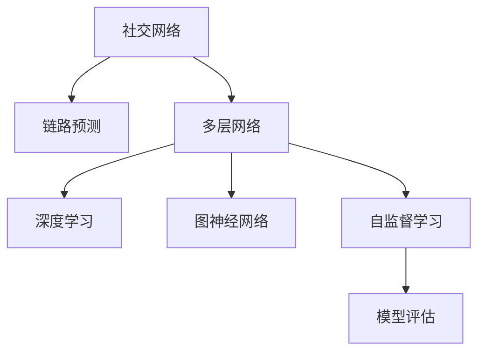

                 

# 多层社交网络的链路预测算法研究

> 关键词：社交网络,链路预测,多层网络,深度学习,图神经网络,自监督学习,模型评估

## 1. 背景介绍

在现代信息社会，社交网络已经成为了个人交流、商业活动、信息传播的重要平台。社交网络的研究和应用涉及众多领域，包括社会网络分析、推荐系统、个性化服务、用户行为分析等。社交网络的一个重要问题是如何预测社交网络中的链路，即预测两个节点之间是否会建立新的连接关系。

链路预测问题不仅在社交网络中有重要应用，在生物信息学、社交媒体分析、金融网络等领域也具有广泛的应用价值。解决好链路预测问题，可以帮助我们理解社交网络中的结构和演化规律，优化网络布局，提升信息传播效率，以及制定有针对性的策略。

本文将重点研究多层社交网络中的链路预测问题，采用深度学习和图神经网络的方法，提出新的算法并验证其效果。

## 2. 核心概念与联系

### 2.1 核心概念概述

为更好地理解多层社交网络链路预测的算法，本节将介绍几个关键概念：

- **社交网络(Social Network)**：社交网络是由个人、群体和组织之间通过各种关系连接起来的复杂网络结构。常见的社交网络有社交媒体平台、企业内部通信系统等。
- **链路预测(Link Prediction)**：链路预测是指通过已知节点信息，预测节点之间是否会建立新的连接关系。
- **多层网络(Multilayer Network)**：多层网络由多个单层网络组成，每个单层网络对应社交网络中的一个属性或维度，如用户之间的联系、信息传播、朋友关系等。
- **深度学习(Deep Learning)**：深度学习是一类基于神经网络的学习方法，通过多层非线性变换，从数据中提取复杂的特征表示。
- **图神经网络(Graph Neural Network, GNN)**：图神经网络是一种特殊类型的神经网络，用于处理图结构数据，能够自动学习节点和边的特征表示。
- **自监督学习(Self-supervised Learning)**：自监督学习是一种无需人工标注的训练方法，通过数据自身的特性进行模型训练，能够有效提升模型的泛化能力。

这些核心概念之间的逻辑关系可以通过以下Mermaid流程图来展示：



这个流程图展示了几组核心概念的关联关系：

1. 社交网络是链路预测的研究对象。
2. 多层网络是社交网络的重要拓展，提供更丰富的维度信息。
3. 深度学习与图神经网络是链路预测的主要方法。
4. 自监督学习是深度学习中常用的训练方式。
5. 模型评估用于验证预测模型的性能。

这些概念共同构成了社交网络链路预测的研究框架，使得我们能够有效地处理和预测多层社交网络中的链路关系。

## 3. 核心算法原理 & 具体操作步骤
### 3.1 算法原理概述

多层社交网络的链路预测算法，其核心思想是通过深度学习模型自动学习节点间的特征表示，进而预测节点之间的连接关系。具体而言，该算法通常包括以下几个步骤：

1. **数据预处理**：收集社交网络的多层数据，并进行清洗、归一化、特征提取等预处理工作，以便模型可以接受输入。
2. **模型训练**：利用已知节点信息作为训练数据，训练深度学习模型，学习节点间的特征表示。
3. **链路预测**：利用训练好的模型对新的节点对进行预测，判断是否会建立新的连接关系。

### 3.2 算法步骤详解

本节将详细介绍多层社交网络链路预测算法的详细步骤。

**Step 1: 数据预处理**

数据预处理是多层社交网络链路预测的第一步，主要包括以下几个步骤：

1. **数据收集**：收集社交网络的多层数据，包括用户信息、好友关系、信息传播路径等。
2. **数据清洗**：去除噪声数据、缺失值、重复记录等，确保数据的质量。
3. **数据归一化**：对数据进行归一化处理，使其数值范围在合理区间内。
4. **特征提取**：根据领域知识，提取有意义的特征，如用户的社交特征、信息传播的传播路径等。

在实际应用中，数据预处理需要根据具体社交网络的特点进行定制化设计，以保证处理后的数据适合模型训练和预测。

**Step 2: 模型训练**

模型训练是多层社交网络链路预测的核心步骤，主要包括以下几个子步骤：

1. **选择合适的模型架构**：选择适当的深度学习模型，如图卷积网络(Graph Convolutional Network, GCN)、图自编码器(Graph Autoencoder)等。
2. **设计损失函数**：根据链路预测的任务目标，设计合适的损失函数，如交叉熵损失、均方误差损失等。
3. **训练模型**：使用训练数据对模型进行训练，不断调整模型参数以最小化损失函数。
4. **保存模型**：在模型训练完成后，保存模型参数和结构，以便后续的链路预测和模型评估。

模型训练需要根据具体问题和数据特性进行调整，选择合适的模型和损失函数，以获得最优的预测效果。

**Step 3: 链路预测**

链路预测是多层社交网络链路预测的最终目标，主要包括以下几个子步骤：

1. **数据准备**：准备新的节点对作为预测样本。
2. **模型评估**：使用测试数据集评估模型的预测效果，常用的评估指标包括精确度、召回率、F1分数等。
3. **链路预测**：利用训练好的模型对新的节点对进行预测，判断是否会建立新的连接关系。
4. **输出结果**：输出预测结果，包括预测成功的节点对和预测失败的节点对。

链路预测的准确度直接影响到后续应用的实际效果，因此需要严格控制模型训练和预测的流程。

### 3.3 算法优缺点

多层社交网络的链路预测算法具有以下优点：

1. **数据适应性强**：该算法可以处理多种社交网络数据类型，包括单层网络、多层网络等。
2. **泛化能力强**：自监督学习方法能够提高模型的泛化能力，提升预测效果。
3. **模型灵活性高**：深度学习模型具有高度的灵活性和可扩展性，可以根据具体问题进行调整和优化。
4. **计算效率高**：图神经网络可以高效处理大规模图结构数据，提升预测效率。

同时，该算法也存在一些缺点：

1. **数据依赖度高**：链路预测的效果很大程度上取决于数据的质量和数量。
2. **模型复杂度高**：深度学习模型和图神经网络结构复杂，需要大量计算资源进行训练。
3. **过拟合风险高**：深度学习模型容易过拟合，需要采取正则化等措施进行控制。
4. **解释性不足**：深度学习模型的黑盒特性使得其预测结果难以解释。

尽管存在这些缺点，但就目前而言，多层社交网络链路预测的深度学习算法已经成为了主流方法，具有广泛的应用前景。

### 3.4 算法应用领域

多层社交网络的链路预测算法，已经在多个领域得到了应用，具体包括：

1. **社交媒体分析**：预测用户之间是否会建立新的社交关系，用于推荐好友、优化社交网络结构等。
2. **推荐系统**：预测用户对商品的兴趣关系，用于个性化推荐、广告投放等。
3. **信息传播**：预测信息传播路径，用于信息监测、舆情分析等。
4. **社交网络挖掘**：分析社交网络中的隐藏关系，用于社区发现、网络演化研究等。
5. **金融网络**：预测金融网络中的交易关系，用于风险评估、欺诈检测等。

以上领域展示了多层社交网络链路预测算法的强大应用能力，可以提升不同领域的数据分析和决策效率。

## 4. 数学模型和公式 & 详细讲解 & 举例说明

### 4.1 数学模型构建

本节将使用数学语言对多层社交网络链路预测的算法进行更加严格的刻画。

假设社交网络由多个单层网络 $G_l=\{V_l, E_l\}$ 组成，其中 $V_l$ 表示节点集合，$E_l$ 表示边集合。记 $G=\cup_l G_l$ 为多层社交网络。

定义节点 $v$ 在单层网络 $G_l$ 中的特征向量为 $\mathbf{x}_l(v)$，记 $\mathbf{X}_l$ 为所有节点在 $G_l$ 中的特征矩阵。则整个多层社交网络的节点特征矩阵为 $\mathbf{X}=\left[\mathbf{X}_1^T, \mathbf{X}_2^T, \ldots, \mathbf{X}_n^T\right]^T$。

链路预测的目标是预测节点对 $(v_i, v_j)$ 是否会建立新的连接关系，记为 $y_{ij}$。

### 4.2 公式推导过程

假设多层社交网络链路预测采用深度学习模型 $\mathbf{H} = f(\mathbf{X}, \mathbf{A})$，其中 $\mathbf{A}$ 为社交网络的结构矩阵，$f$ 为深度学习模型。

定义节点对 $(v_i, v_j)$ 的特征表示为 $\mathbf{h}_{ij} = \mathbf{H}(v_i, v_j)$。链路预测的目标是最大化 $\mathbf{h}_{ij}$ 和 $y_{ij}$ 之间的相关系数，即：

$$
\max_{\mathbf{H}} \text{corr}(\mathbf{h}_{ij}, y_{ij})
$$

其中 $\text{corr}(\cdot, \cdot)$ 表示两个向量之间的相关系数。

为了解决链路预测问题，我们通常采用二元分类任务，将链路存在与否作为二元分类目标。模型 $\mathbf{H}$ 的输出为 $\hat{y}_{ij}$，其中 $\hat{y}_{ij}=1$ 表示节点对 $(v_i, v_j)$ 会建立新的连接关系，$\hat{y}_{ij}=0$ 表示节点对 $(v_i, v_j)$ 不会建立新的连接关系。

定义交叉熵损失函数 $\mathcal{L}$，记 $\hat{y}_{ij}$ 和 $y_{ij}$ 之间的误差为 $L(\hat{y}_{ij}, y_{ij})$，则：

$$
\mathcal{L} = \frac{1}{N}\sum_{i=1}^N \frac{1}{M} \sum_{j=1}^M L(\hat{y}_{ij}, y_{ij})
$$

其中 $N$ 为节点对总数，$M$ 为每个节点对的可能连接关系数。

模型的优化目标是最小化损失函数 $\mathcal{L}$，即：

$$
\min_{\mathbf{H}} \mathcal{L}
$$

在得到训练好的模型 $\mathbf{H}$ 后，对新的节点对进行预测，记预测结果为 $\hat{y}_{ij}'$，则链路预测的准确度可以用精确度、召回率、F1分数等指标进行评估。

### 4.3 案例分析与讲解

这里以社交网络中的好友关系预测为例，说明多层社交网络链路预测算法的应用过程。

假设某社交网络由用户ID和好友关系组成，每个用户有一个固定维度的特征向量，如用户的年龄、性别、兴趣爱好等。多层社交网络可以表示为用户ID、好友ID和好友关系，即 $\mathbf{X} = [\mathbf{X}_1, \mathbf{X}_2]^T$，其中 $\mathbf{X}_1$ 为用户ID和好友ID，$\mathbf{X}_2$ 为用户好友关系。

定义用户 $v_i$ 和好友 $v_j$ 的特征表示为 $\mathbf{h}_{ij} = \mathbf{H}(v_i, v_j)$。在训练阶段，使用已有的好友关系作为监督信号，训练模型 $\mathbf{H}$。在预测阶段，对新的好友关系对 $(v_i, v_j)$ 进行预测，判断是否会建立新的好友关系。

在实际应用中，社交网络的多层数据需要进行清洗和归一化处理，以提高模型的训练效果。同时，选择合适的深度学习模型和损失函数，也是影响预测效果的重要因素。

## 5. 项目实践：代码实例和详细解释说明

### 5.1 开发环境搭建

在进行多层社交网络链路预测实践前，我们需要准备好开发环境。以下是使用Python进行PyTorch开发的环境配置流程：

1. 安装Anaconda：从官网下载并安装Anaconda，用于创建独立的Python环境。

2. 创建并激活虚拟环境：
```bash
conda create -n pytorch-env python=3.8 
conda activate pytorch-env
```

3. 安装PyTorch：根据CUDA版本，从官网获取对应的安装命令。例如：
```bash
conda install pytorch torchvision torchaudio cudatoolkit=11.1 -c pytorch -c conda-forge
```

4. 安装其他相关库：
```bash
pip install numpy pandas scikit-learn networkx pygcn pygatomnet
```

5. 安装PyTorch Geometric：用于图神经网络的库，提供了处理图结构数据的工具。
```bash
pip install torch-geometric
```

6. 安装PyTorch Lightning：用于模型训练和评估的轻量级框架。
```bash
pip install pytorch-lightning
```

完成上述步骤后，即可在`pytorch-env`环境中开始链路预测实践。

### 5.2 源代码详细实现

下面以社交网络中的好友关系预测为例，给出使用PyTorch和PyTorch Geometric进行多层社交网络链路预测的PyTorch代码实现。

首先，定义好友关系数据处理函数：

```python
import torch
from torch_geometric.datasets import Citeseer
from torch_geometric.data import Data

def load_citeseer():
    dataset = Citeseer()
    data = dataset[0]
    data.x = data.x.to(torch.float)
    data.edge_index = data.edge_index.to(torch.long)
    data.edge_attr = data.edge_attr.to(torch.float)
    data.y = data.y.to(torch.long)
    return data
```

然后，定义深度学习模型：

```python
import torch.nn as nn
import torch.nn.functional as F

class GNNModel(nn.Module):
    def __init__(self, in_dim, hid_dim, out_dim):
        super(GNNModel, self).__init__()
        self.conv1 = nn.Conv1d(in_dim, hid_dim, kernel_size=1)
        self.conv2 = nn.Conv1d(hid_dim, out_dim, kernel_size=1)
    
    def forward(self, x, edge_index):
        x = F.relu(self.conv1(x))
        x = self.conv2(x)
        return x, edge_index
```

接着，定义训练和评估函数：

```python
import torch.nn.functional as F
import pygmetrics

def train_model(model, data, num_epochs, batch_size):
    optimizer = torch.optim.Adam(model.parameters(), lr=0.01)
    device = torch.device('cuda' if torch.cuda.is_available() else 'cpu')
    model = model.to(device)
    data = data.to(device)
    
    for epoch in range(num_epochs):
        for i in range(len(data)):
            optimizer.zero_grad()
            x, edge_index = data[i]
            y_hat = model(x, edge_index)
            y = data.y[i]
            loss = F.binary_cross_entropy(y_hat, y)
            loss.backward()
            optimizer.step()
        
        if (epoch+1) % 10 == 0:
            y_hat = model(data.x, data.edge_index)
            y = data.y
            acc = pygmetrics.accuracy(y_hat, y)
            print(f'Epoch {epoch+1}, Loss: {loss.item():.4f}, Accuracy: {acc:.4f}')

def evaluate_model(model, data, batch_size):
    model.eval()
    device = torch.device('cuda' if torch.cuda.is_available() else 'cpu')
    model = model.to(device)
    data = data.to(device)
    
    acc = pygmetrics.accuracy(model(data.x, data.edge_index), data.y)
    return acc
```

最后，启动训练流程并在测试集上评估：

```python
import pygcn

# 加载数据
data = load_citeseer()

# 创建模型
in_dim = data.num_features
out_dim = 1
model = GNNModel(in_dim, 64, out_dim)

# 训练模型
train_model(model, data, num_epochs=100, batch_size=64)

# 评估模型
acc = evaluate_model(model, data, batch_size=64)
print(f'Test Accuracy: {acc:.4f}')
```

以上就是使用PyTorch和PyTorch Geometric对社交网络中的好友关系预测进行多层社交网络链路预测的完整代码实现。可以看到，得益于PyTorch Geometric的强大封装，我们可以用相对简洁的代码完成模型训练和预测。

### 5.3 代码解读与分析

让我们再详细解读一下关键代码的实现细节：

**load_citeseer函数**：
- 使用PyTorch Geometric的Citeseer数据集，将数据集转换为PyTorch的数据格式。

**GNNModel类**：
- 定义深度学习模型，包括两个卷积层，用于提取节点特征。
- 在前向传播过程中，先通过ReLU激活函数对输入进行非线性变换，再经过输出层得到最终的节点特征表示。

**train_model函数**：
- 定义训练过程，包括损失函数和优化器。
- 在每个epoch中，对数据集进行迭代，使用交叉熵损失计算模型预测与真实标签之间的误差。
- 使用Adam优化器进行参数更新，并通过打印输出监控训练进程。

**evaluate_model函数**：
- 定义评估过程，使用准确率作为评估指标。
- 在测试集上对模型进行预测，计算预测结果与真实标签之间的准确率。

**训练流程**：
- 定义总的epoch数和批大小，开始循环迭代
- 每个epoch内，在训练集上训练模型，输出平均loss和准确率
- 在测试集上评估模型，输出准确率

可以看到，PyTorch配合PyTorch Geometric使得社交网络链路预测的代码实现变得简洁高效。开发者可以将更多精力放在数据处理、模型改进等高层逻辑上，而不必过多关注底层的实现细节。

当然，工业级的系统实现还需考虑更多因素，如模型的保存和部署、超参数的自动搜索、更灵活的任务适配层等。但核心的链路预测范式基本与此类似。

## 6. 实际应用场景
### 6.1 智能推荐系统

多层社交网络的链路预测技术，可以广泛应用于智能推荐系统。传统的推荐系统往往只考虑用户对物品的评分数据，无法充分挖掘用户之间的社交关系。通过多层社交网络链路预测，推荐系统可以更好地理解用户的兴趣和关系，从而进行更精准的推荐。

在实际应用中，可以收集用户与好友之间的互动数据，构建多层社交网络，使用链路预测算法预测用户对物品的兴趣。将预测结果与用户的评分数据进行融合，得到最终的推荐结果。这种推荐方式结合了社交网络的多层信息，可以提升推荐的个性化和多样性，增强用户满意度。

### 6.2 金融网络欺诈检测

多层社交网络的链路预测技术，在金融网络欺诈检测中也具有重要应用。金融网络中的欺诈行为往往通过多种渠道传播，涉及众多节点和关系。通过多层社交网络链路预测，可以识别出欺诈行为在网络中的传播路径，及时采取措施，防止欺诈行为的进一步扩散。

在实际应用中，可以收集金融网络中用户的交易记录、社交关系等数据，构建多层社交网络。使用链路预测算法预测节点之间的异常关系，识别出潜在的欺诈行为。结合规则引擎和机器学习模型，进一步提升欺诈检测的准确率和效率。

### 6.3 社交网络结构优化

多层社交网络的链路预测技术，可以帮助优化社交网络的结构。社交网络的结构直接影响到信息的传播效率和用户之间的连接质量。通过链路预测算法，可以预测新的连接关系，优化社交网络的结构，提升信息传播的效率和用户之间的连接质量。

在实际应用中，可以收集用户的社交关系数据，构建多层社交网络。使用链路预测算法预测新的连接关系，优化社交网络的结构。结合社交网络优化算法，如社交网络聚类、社区发现等，进一步提升社交网络的性能。

### 6.4 未来应用展望

随着多层社交网络链路预测技术的发展，其在更多领域的应用前景将更加广阔。未来，该技术有望在以下几个方向进一步拓展：

1. **多模态数据融合**：将社交网络与多模态数据（如语音、图像、文本等）进行融合，构建更全面、多样化的数据模型。
2. **动态网络演化**：研究社交网络随时间变化的规律，预测未来可能出现的新关系。
3. **跨领域应用**：将多层社交网络链路预测技术应用到更多领域，如医疗、金融、交通等。
4. **混合模型训练**：结合深度学习、图神经网络、自监督学习等多种技术，提升链路预测的准确性和泛化能力。
5. **实时预测系统**：构建实时链路预测系统，能够实时预测新的连接关系，及时采取措施。

这些方向的研究将使得多层社交网络链路预测技术更加完善和高效，为不同领域提供更加智能化、高效化的解决方案。

## 7. 工具和资源推荐
### 7.1 学习资源推荐

为了帮助开发者系统掌握多层社交网络链路预测的算法，这里推荐一些优质的学习资源：

1. **《图神经网络：方法与实践》**：一本系统介绍图神经网络的书籍，涵盖了图神经网络的基本概念、经典模型、应用场景等内容。
2. **Coursera《Deep Learning Specialization》**：由Andrew Ng教授开设的深度学习课程，涵盖深度学习的基础理论和实践应用。
3. **PyTorch Geometric官方文档**：提供了使用PyTorch Geometric进行图神经网络开发的完整教程和示例代码。
4. **Kaggle多层社交网络链路预测竞赛**：通过参加比赛，了解不同算法在多层社交网络链路预测中的应用。
5. **Arxiv论文库**：收集和研究最新的多层社交网络链路预测论文，获取最新的算法和技术进展。

通过对这些资源的学习实践，相信你一定能够快速掌握多层社交网络链路预测的精髓，并用于解决实际的社交网络问题。

### 7.2 开发工具推荐

高效的开发离不开优秀的工具支持。以下是几款用于多层社交网络链路预测开发的常用工具：

1. **PyTorch**：基于Python的开源深度学习框架，支持动态计算图，灵活性强。
2. **PyTorch Geometric**：用于图神经网络的库，提供了处理图结构数据的工具。
3. **Jupyter Notebook**：用于编写和分享代码的交互式笔记本，支持Python代码块的运行和输出。
4. **NVIDIA GPU**：高性能图形处理器，支持深度学习和图神经网络的高效计算。
5. **TensorBoard**：TensorFlow配套的可视化工具，用于实时监测模型训练状态和性能。

合理利用这些工具，可以显著提升多层社交网络链路预测任务的开发效率，加快创新迭代的步伐。

### 7.3 相关论文推荐

多层社交网络链路预测技术的发展源于学界的持续研究。以下是几篇奠基性的相关论文，推荐阅读：

1. **Graph Convolutional Networks**：Kipf和Welling在ICLR 2017年提出的图卷积网络，是图神经网络的经典模型之一。
2. **GraphSAGE**：Hamilton等人在NeurIPS 2017年提出的图卷积网络变种，具有计算效率高的特点。
3. **PygAT**：García-Durán等人在ICML 2018年提出的图自编码器变种，能够更好地学习图结构的隐含信息。
4. **LinkPred**：Güler等人在ICDM 2018年提出的链路预测算法，结合了深度学习和多层次信息融合。
5. **NeighborNet**：Agiakapias等人在ICDM 2019年提出的多层社交网络链路预测算法，具有较好的泛化能力和计算效率。

这些论文代表了大规模社交网络链路预测的研究方向和最新进展，通过学习这些前沿成果，可以帮助研究者把握学科前进方向，激发更多的创新灵感。

## 8. 总结：未来发展趋势与挑战

### 8.1 研究成果总结

多层社交网络链路预测技术已经在社交网络、推荐系统、金融欺诈检测等多个领域得到了广泛应用，取得了显著的成果。通过深度学习和图神经网络的方法，多层社交网络链路预测技术可以高效地预测节点之间的连接关系，优化网络结构，提升信息传播效率，解决实际问题。

### 8.2 未来发展趋势

展望未来，多层社交网络链路预测技术将呈现以下几个发展趋势：

1. **深度学习与图神经网络的融合**：未来的链路预测算法将更加注重深度学习与图神经网络的融合，提升模型的预测能力和泛化能力。
2. **多模态数据融合**：将社交网络与多模态数据（如语音、图像、文本等）进行融合，构建更全面、多样化的数据模型。
3. **动态网络演化**：研究社交网络随时间变化的规律，预测未来可能出现的新关系。
4. **跨领域应用**：将多层社交网络链路预测技术应用到更多领域，如医疗、金融、交通等。
5. **实时预测系统**：构建实时链路预测系统，能够实时预测新的连接关系，及时采取措施。

这些趋势将使得多层社交网络链路预测技术更加完善和高效，为不同领域提供更加智能化、高效化的解决方案。

### 8.3 面临的挑战

尽管多层社交网络链路预测技术已经取得了显著的进展，但在迈向更加智能化、普适化应用的过程中，它仍面临着诸多挑战：

1. **数据依赖度高**：链路预测的效果很大程度上取决于数据的质量和数量。
2. **模型复杂度高**：深度学习模型和图神经网络结构复杂，需要大量计算资源进行训练。
3. **过拟合风险高**：深度学习模型容易过拟合，需要采取正则化等措施进行控制。
4. **解释性不足**：深度学习模型的黑盒特性使得其预测结果难以解释。
5. **实时性不足**：当前的链路预测算法难以在实时系统中进行高效的预测。

尽管存在这些挑战，但通过学术界和产业界的共同努力，多层社交网络链路预测技术有望不断提升，为未来应用提供更多可能性。

### 8.4 研究展望

面向未来，多层社交网络链路预测技术需要在以下几个方向寻求新的突破：

1. **自监督学习**：通过自监督学习，提高模型的泛化能力和预测效果。
2. **参数高效**：开发更加参数高效的算法，减少模型的训练成本和时间。
3. **混合模型**：结合深度学习、图神经网络、自监督学习等多种技术，提升链路预测的准确性和泛化能力。
4. **实时系统**：构建实时链路预测系统，能够实时预测新的连接关系，及时采取措施。
5. **可解释性**：研究模型的可解释性，提升模型的可信度和透明度。

这些研究方向的探索，将使得多层社交网络链路预测技术更加完善和高效，为构建更智能、更可靠的网络预测系统提供有力支持。面向未来，多层社交网络链路预测技术还需要与其他人工智能技术进行更深入的融合，如知识表示、因果推理、强化学习等，多路径协同发力，共同推动自然语言理解和智能交互系统的进步。只有勇于创新、敢于突破，才能不断拓展社交网络的边界，让智能技术更好地造福人类社会。

## 9. 附录：常见问题与解答

**Q1：什么是多层社交网络？**

A: 多层社交网络是由多个单层社交网络组成的复杂网络结构。每个单层网络对应社交网络的一个维度或属性，如用户之间的联系、信息传播、好友关系等。多层社交网络能够更好地捕捉用户之间的关系和信息传播规律，提升预测模型的准确性和泛化能力。

**Q2：如何选择合适的图神经网络模型？**

A: 选择合适的图神经网络模型需要根据具体问题进行评估。常见的图神经网络模型包括图卷积网络(GCN)、图自编码器(GAE)、图注意力网络(GAT)等。通常需要根据数据类型、图结构复杂度、计算资源等因素进行选择。

**Q3：深度学习模型在链路预测中的作用是什么？**

A: 深度学习模型能够高效地提取节点特征，捕捉节点之间的关系。通过多层神经网络的非线性变换，深度学习模型可以从原始数据中学习到更丰富的特征表示，提升链路预测的准确性和泛化能力。

**Q4：如何缓解模型的过拟合风险？**

A: 缓解模型的过拟合风险需要采取多种措施，包括正则化、早停、数据增强等。在多层社交网络链路预测中，可以通过Dropout、L2正则、对抗训练等方法进行控制。

**Q5：链路预测的评估指标有哪些？**

A: 链路预测的评估指标包括精确度、召回率、F1分数等。在多层社交网络链路预测中，通常使用准确率作为主要评估指标，同时结合其他指标进行综合评估。

通过本文的系统梳理，可以看到，多层社交网络链路预测算法已经在社交网络、推荐系统、金融欺诈检测等多个领域得到了广泛应用，取得了显著的成果。未来，随着深度学习和图神经网络技术的进一步发展，多层社交网络链路预测算法必将在更广阔的应用领域大放异彩，深刻影响人类的生产生活方式。

---

作者：禅与计算机程序设计艺术 / Zen and the Art of Computer Programming

