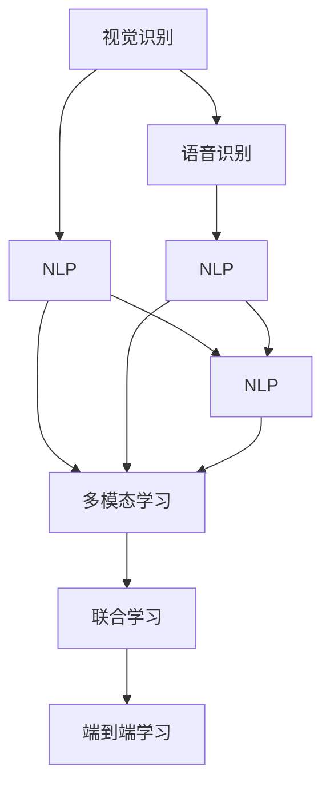

                 

## 1. 背景介绍

### 1.1 问题由来
随着人工智能技术的迅速发展，多模态AI已成为当前研究的热点。多模态AI融合了视觉、语音、文本等多种信息形式，为解决实际问题提供了更多可能性和优势。然而，在多模态AI的整合过程中，仍然存在诸多挑战，阻碍了其在诸多应用领域的广泛推广和深入研究。本文聚焦于多模态AI的整合，探讨其在现实世界中的应用及面临的挑战，为未来的研究和开发提供参考。

### 1.2 问题核心关键点
多模态AI的整合主要涉及三个方面：

1. **数据整合**：如何高效地收集和整合来自不同模态的数据，并进行统一处理。
2. **模型整合**：如何将不同模态的模型进行有效融合，形成一个整体的决策系统。
3. **应用整合**：如何将多模态AI技术应用于实际问题中，并取得最佳效果。

本文将围绕这些关键点，详细探讨多模态AI在整合视觉、语音与文本过程中面临的挑战和解决方案。

## 2. 核心概念与联系

### 2.1 核心概念概述

为了更好地理解多模态AI的整合过程，我们需要了解一些关键概念：

- **视觉识别**：使用计算机视觉技术，对图像、视频等视觉信息进行理解和识别。
- **语音识别**：利用语音处理技术，将语音信号转换为文本信息。
- **自然语言处理(NLP)**：通过算法处理和理解自然语言，进行文本分类、情感分析、语言生成等任务。
- **多模态学习**：通过融合视觉、语音和文本等多种信息形式，进行统一处理和决策。
- **联合学习**：在多个模型间共享知识和参数，提高整体学习效果。
- **端到端学习**：将数据收集、模型训练和应用部署整合为一个连续过程，简化整体流程。

这些概念通过以下几个Mermaid流程图来展示：



该流程图展示了多模态AI各个概念之间的关系：

1. 视觉和语音信息首先通过各自的模型进行处理。
2. 处理后的文本信息通过NLP模型进行理解和分析。
3. 多模态学习通过联合学习，融合不同模态的信息。
4. 端到端学习将数据收集、模型训练和应用部署整合成一个连续过程。

## 3. 核心算法原理 & 具体操作步骤
### 3.1 算法原理概述

多模态AI的整合基于联合学习框架，即通过将多个模态的模型联合训练，共享模型参数，从而提升整体的性能。

具体而言，多模态AI的整合分为以下几个步骤：

1. **数据收集与预处理**：收集不同模态的数据，并进行统一的预处理。
2. **模型选择与初始化**：选择适合的模型作为初始化参数，如CNN用于视觉，RNN/LSTM用于语音，Transformer用于文本。
3. **模型联合训练**：通过多个模型联合训练，共享参数，优化整体模型。
4. **模型融合与决策**：将各个模态的输出进行融合，进行最终的决策。

### 3.2 算法步骤详解

以一个视频理解系统为例，详细阐述多模态AI的整合步骤：

**Step 1: 数据收集与预处理**
- 从视频库中收集多个视频片段，每段视频包含视觉、语音和文本信息。
- 对视频进行统一编码，包括视频帧的提取、语音信号的采样、文本字幕的解析等。

**Step 2: 模型选择与初始化**
- 选择CNN模型进行视觉信息处理，LSTM模型进行语音信息处理，Transformer模型进行文本信息处理。
- 使用预训练的模型作为初始化参数，如VGG、ResNet用于视觉，LSTM或GRU用于语音，BERT或GPT用于文本。

**Step 3: 模型联合训练**
- 将视频片段输入到三个模型中进行处理，分别得到视觉特征、语音特征和文本特征。
- 将这三个特征进行拼接，作为联合模型的输入，进行端到端的训练。
- 在训练过程中，通过共享参数的方式进行联合优化，提升整体的性能。

**Step 4: 模型融合与决策**
- 对联合模型的输出进行融合，可以使用平均、加权平均或深度融合等方法。
- 最终输出决策结果，如判断视频中是否有异常行为，或者进行视频分类。

### 3.3 算法优缺点

**优点**：
- **多模态信息整合**：多模态AI能够综合利用视觉、语音和文本等多种信息形式，提升决策的准确性和全面性。
- **模型性能提升**：通过联合训练，共享参数，提升整体模型性能。
- **应用范围广泛**：多模态AI可以应用于视频理解、语音识别、智能对话等多个领域。

**缺点**：
- **数据收集复杂**：多模态数据的收集和预处理相对复杂，需要投入大量时间和资源。
- **模型复杂度高**：多模态AI的模型通常较为复杂，训练和推理成本较高。
- **应用场景受限**：多模态AI在特定应用场景下效果不佳，如在视觉信息占主导的情况下，语音和文本信息可能起不到有效作用。

### 3.4 算法应用领域

多模态AI在诸多领域都有广泛的应用，以下是几个典型的应用场景：

- **视频理解**：结合视觉、语音和文本信息，进行视频内容的理解，如动作识别、场景分类、视频字幕生成等。
- **智能对话**：通过语音和文本信息，构建智能对话系统，进行语音识别、文本生成、意图理解等任务。
- **人机交互**：结合视觉、语音和文本信息，构建自然的人机交互系统，如语音助手、虚拟现实等。
- **智能安防**：通过视觉、语音和文本信息，构建智能安防系统，进行异常行为检测、情感分析、行为识别等。

## 4. 数学模型和公式 & 详细讲解 & 举例说明

### 4.1 数学模型构建

假设我们有一个多模态系统，包含视觉、语音和文本三个模态。视觉特征为 $V_i$，语音特征为 $L_i$，文本特征为 $T_i$。多模态系统的输出为 $O_i$。

定义损失函数 $L$ 如下：

$$ L = \alpha L_{vis} + \beta L_{audio} + \gamma L_{text} $$

其中，$L_{vis}$、$L_{audio}$、$L_{text}$ 分别为视觉、语音和文本的损失函数，$\alpha$、$\beta$、$\gamma$ 为权值，用于平衡不同模态的重要性。

### 4.2 公式推导过程

以一个简单的多模态分类任务为例，进行公式推导。

假设视觉、语音和文本特征都通过各自的模型进行处理，得到特征向量 $V_i$、$L_i$、$T_i$。将这些特征向量进行拼接，得到多模态特征向量 $F_i$。

多模态分类器的输出为：

$$ \hat{y}_i = softmax(W_o f_i + b_o) $$

其中，$f_i$ 为多模态特征向量，$W_o$ 为输出层的权重矩阵，$b_o$ 为偏置项。

多模态分类的损失函数为交叉熵损失：

$$ L_{multimodal} = -\frac{1}{N}\sum_{i=1}^N \sum_{j=1}^K y_{ij} \log (\hat{y}_{ij}) $$

其中，$y_{ij}$ 为第 $i$ 个样本第 $j$ 个类别的真实标签，$\hat{y}_{ij}$ 为第 $i$ 个样本第 $j$ 个类别的预测概率。

### 4.3 案例分析与讲解

考虑一个多模态视频理解任务，该任务需要将视频内容进行分类，如是否包含暴力、色情等不当内容。

该任务需要将视觉特征、语音特征和文本字幕特征进行融合，进行端到端的分类。融合方法可以使用加权平均、深度融合等。

假设使用三个独立模型对视频进行处理，得到视觉特征 $V_i$、语音特征 $L_i$ 和文本特征 $T_i$。将这些特征进行拼接，得到多模态特征向量 $F_i$。

最终分类器的输出为：

$$ \hat{y}_i = softmax(W_o f_i + b_o) $$

其中，$f_i$ 为多模态特征向量，$W_o$ 为输出层的权重矩阵，$b_o$ 为偏置项。

## 5. 项目实践：代码实例和详细解释说明

### 5.1 开发环境搭建

为了进行多模态AI的开发，需要搭建一个包含视觉、语音和文本处理的开发环境。以下是一些常用的开发工具和库：

1. **视觉处理库**：OpenCV、PIL、TensorFlow等，用于图像、视频等视觉信息的处理。
2. **语音处理库**：pyAudioAnalysis、SpeechRecognition等，用于语音信号的采集、处理和识别。
3. **文本处理库**：NLTK、SpaCy、Transformers等，用于自然语言信息的处理和理解。

### 5.2 源代码详细实现

以下是一个简单的多模态视频理解系统的代码实现：

```python
import cv2
import numpy as np
import pyaudio
import librosa
import torch
from transformers import BertTokenizer, BertForSequenceClassification

# 加载模型和分词器
model = BertForSequenceClassification.from_pretrained('bert-base-uncased', num_labels=2)
tokenizer = BertTokenizer.from_pretrained('bert-base-uncased')

# 加载视频文件
video_path = 'video.mp4'
cap = cv2.VideoCapture(video_path)

# 初始化语音处理
audio = pyaudio.PyAudio()
stream = audio.open(format=pyaudio.paInt16, channels=1, rate=16000, output=True)

# 初始化文本处理
text = ''
timestamp = 0

while cap.isOpened():
    ret, frame = cap.read()

    # 视频处理
    visual_feature = process_video(frame)

    # 语音处理
    audio_data = []
    while stream.is_active():
        audio_data.append(stream.read())

    # 文本处理
    text += ' '
    timestamp += 1
    if timestamp > 2:
        text = tokenizer.encode(text)

    # 多模态特征拼接
    multimodal_feature = np.concatenate((visual_feature, np.array(audio_data), text))

    # 模型推理
    with torch.no_grad():
        output = model(multimodal_feature)

    # 分类结果
    label = np.argmax(output.logits)
    print(label)

    # 显示结果
    cv2.putText(frame, str(label), (10, 30), cv2.FONT_HERSHEY_SIMPLEX, 1, (0, 255, 0), 2)

    # 输出帧
    cv2.imshow('frame', frame)
    if cv2.waitKey(1) & 0xFF == ord('q'):
        break

cap.release()
cv2.destroyAllWindows()
audio.stop_stream()
audio.terminate()
```

### 5.3 代码解读与分析

这段代码实现了一个简单的多模态视频理解系统，包含视频处理、语音处理、文本处理和模型推理。

**视频处理**：使用OpenCV库读取视频帧，并进行预处理。可以使用各种图像处理技术，如边缘检测、目标检测等，提取视频特征。

**语音处理**：使用pyAudio库进行音频采集和处理。可以通过声音强度、频率等特征，提取语音特征。

**文本处理**：通过NLTK、SpaCy等库进行文本的预处理和分词。可以使用BertTokenizer对文本进行编码。

**多模态特征拼接**：将视觉特征、语音特征和文本特征拼接起来，形成多模态特征向量。可以使用np.concatenate等方法进行拼接。

**模型推理**：将多模态特征向量输入到Bert模型中，进行推理预测。

**显示结果**：将分类结果显示在视频帧上，并进行保存。

## 6. 实际应用场景

### 6.1 智能安防

智能安防是视频理解系统中一个重要的应用场景。结合视觉、语音和文本信息，构建智能安防系统，可以实时监测视频内容，进行异常行为检测、情感分析、行为识别等任务。

例如，在视频监控中，可以结合视觉信息进行目标检测，利用语音信息进行异常声响的检测，结合文本信息进行字幕分析，构建一个全方位的智能安防系统。

### 6.2 视频会议

视频会议系统也是多模态AI的重要应用场景。通过语音和文本信息，构建智能视频会议系统，可以进行语音识别、会议纪要生成、情感分析等任务。

例如，在视频会议中，可以将语音信号转换为文本，进行情感分析，根据情感变化调整会议进程。同时，可以通过文字记录会议内容，生成会议纪要。

### 6.3 医疗诊断

医疗诊断是另一个典型的多模态AI应用场景。结合视觉、语音和文本信息，构建智能医疗诊断系统，可以进行图像识别、语音分析、病历记录等任务。

例如，在医疗诊断中，可以通过图像识别技术，进行X光片、CT等医学影像的自动分析，利用语音分析技术，进行医生与患者的语音交互，结合文本信息，进行病历记录和医生诊断。

## 7. 工具和资源推荐

### 7.1 学习资源推荐

以下是一些推荐的学习资源，帮助你系统掌握多模态AI的相关知识：

1. **《深度学习：多模态学习与表示》**：该书详细介绍了多模态学习的原理和应用，适合初学者和高级开发者阅读。
2. **《多模态深度学习》**：该书介绍了多种多模态深度学习的模型和算法，适合有一定深度学习基础的读者。
3. **《多模态学习综述》**：该综述文章介绍了多模态学习的主要研究方向和进展，适合了解多模态学习的最新动态。
4. **CS231n《视觉识别课程》**：斯坦福大学开设的视觉识别课程，详细介绍了计算机视觉相关的算法和模型。
5. **NLTK官方文档**：NLTK库的官方文档，详细介绍了自然语言处理相关的算法和模型。

### 7.2 开发工具推荐

以下是一些推荐的多模态AI开发工具，帮助你高效开发和部署多模态应用：

1. **TensorFlow**：开源深度学习框架，支持多种模型和算法，适合大规模工程应用。
2. **PyTorch**：开源深度学习框架，支持动态计算图，适合快速迭代研究。
3. **OpenCV**：开源计算机视觉库，支持多种图像和视频处理技术。
4. **pyAudioAnalysis**：开源语音处理库，支持语音信号的采集、处理和识别。
5. **NLTK**：开源自然语言处理库，支持文本处理和分词等任务。

### 7.3 相关论文推荐

以下是一些推荐的多模态AI相关论文，帮助你了解最新的研究进展：

1. **《多模态深度学习综述》**：该综述文章介绍了多模态深度学习的主要研究方向和进展。
2. **《多模态特征融合方法综述》**：该综述文章介绍了多种多模态特征融合方法，如深度融合、加权平均等。
3. **《联合学习框架与算法》**：该文章介绍了多种联合学习的框架和算法，如MAML、FedAvg等。

## 8. 总结：未来发展趋势与挑战

### 8.1 总结

本文对多模态AI的整合过程进行了详细阐述，从原理到实践，介绍了多模态AI在视觉、语音和文本整合过程中面临的挑战和解决方案。多模态AI的整合能够有效融合多种信息形式，提升整体的决策性能，具有广阔的应用前景。

通过本文的系统梳理，可以看到，多模态AI在现实世界中的应用场景多种多样，如智能安防、视频会议、医疗诊断等，为多个领域带来了新的可能性。多模态AI的整合技术也在不断进步，未来将会在更多的应用场景中发挥重要作用。

### 8.2 未来发展趋势

展望未来，多模态AI的发展趋势主要体现在以下几个方面：

1. **模型集成**：未来多模态AI将更加注重不同模态的集成，通过深度融合、联合学习等方法，提升整体的性能。
2. **数据管理**：未来多模态AI将更加注重数据管理，通过高效的数据收集和预处理，提升数据质量。
3. **应用场景扩展**：未来多模态AI将更加注重应用场景的扩展，将技术应用于更多领域，如医疗、金融、制造等。
4. **伦理与安全**：未来多模态AI将更加注重伦理和安全性，确保技术在应用过程中不侵害用户隐私，不产生负面影响。

### 8.3 面临的挑战

尽管多模态AI具有广泛的应用前景，但在实际应用中仍然面临诸多挑战：

1. **数据收集复杂**：多模态数据的收集和预处理相对复杂，需要投入大量时间和资源。
2. **模型复杂度高**：多模态AI的模型通常较为复杂，训练和推理成本较高。
3. **应用场景受限**：多模态AI在特定应用场景下效果不佳，如在视觉信息占主导的情况下，语音和文本信息可能起不到有效作用。
4. **伦理与安全**：多模态AI需要考虑数据隐私、安全等问题，确保技术在应用过程中不侵害用户隐私。

### 8.4 研究展望

面对多模态AI所面临的挑战，未来的研究需要在以下几个方面寻求新的突破：

1. **数据自动化收集**：开发自动化数据收集工具，降低数据收集的复杂度。
2. **模型简化**：开发更简单、高效的模型，提升训练和推理的效率。
3. **场景扩展**：将多模态AI技术应用于更多领域，探索新的应用场景。
4. **伦理与安全**：研究多模态AI的伦理与安全问题，确保技术在应用过程中不侵害用户隐私。

综上所述，多模态AI的整合技术在未来将具有广阔的应用前景，但同时也面临诸多挑战。只有在不断优化数据收集和处理、提升模型效率、拓展应用场景等方面做出努力，才能真正实现多模态AI的落地应用。

## 9. 附录：常见问题与解答

**Q1：多模态AI的模型应该如何选择？**

A: 多模态AI的模型选择应考虑多模态数据的特性和任务需求。一般来说，可以使用预训练模型作为初始化参数，如VGG用于视觉，LSTM用于语音，BERT用于文本。在特定任务上，需要进行微调或重新训练，以适应特定的应用场景。

**Q2：多模态AI的模型应该如何训练？**

A: 多模态AI的模型训练通常采用联合训练的方式，即通过多个模型联合训练，共享参数，优化整体模型。在训练过程中，可以使用不同的损失函数和优化器，平衡不同模态的重要性。

**Q3：多模态AI的模型应该如何部署？**

A: 多模态AI的模型部署通常采用端到端的方式，即将数据收集、模型训练和应用部署整合成一个连续过程。可以使用云计算平台或分布式训练技术，提高模型的可扩展性和部署效率。

**Q4：多模态AI在视频理解任务中应该如何使用？**

A: 在视频理解任务中，可以使用多模态AI整合视觉、语音和文本信息，进行视频内容的理解。可以使用深度融合、加权平均等方法，将不同模态的特征进行融合，进行最终的决策。

**Q5：多模态AI在智能安防中应该如何使用？**

A: 在智能安防中，可以使用多模态AI整合视觉、语音和文本信息，构建智能安防系统，进行异常行为检测、情感分析、行为识别等任务。可以通过深度融合、联合学习等方法，提升整体的性能。

综上所述，多模态AI的整合技术具有广阔的应用前景，但同时也面临诸多挑战。只有在不断优化数据收集和处理、提升模型效率、拓展应用场景等方面做出努力，才能真正实现多模态AI的落地应用。

