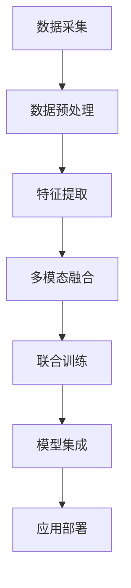

                 

# 多模态大模型：技术原理与实战 其他部署方法介绍

> 关键词：多模态大模型,技术原理,实战部署,模型集成,混合精度训练

## 1. 背景介绍

### 1.1 问题由来

随着人工智能技术的不断发展，多模态大模型（Multimodal Large Models）的应用领域日益广阔。多模态大模型是指能够同时处理图像、语音、文本等多种数据类型的深度学习模型，通过融合不同模态的信息，提升模型的表达能力和泛化能力。在自然语言处理（NLP）、计算机视觉（CV）、语音识别（ASR）等领域，多模态大模型已经展现出卓越的性能，并且正逐渐成为解决复杂多模态问题的关键工具。

然而，在大规模多模态数据训练时，往往面临诸如计算资源消耗巨大、训练时间过长等问题。与此同时，如何将大模型的研究成果有效部署到实际应用中，也是一个需要深入探讨的话题。为了更好地理解并解决这些问题，本文将从多模态大模型的技术原理出发，介绍其实战部署的方法，并结合案例进行详细讲解。

### 1.2 问题核心关键点

多模态大模型在实际应用中，主要面临以下问题：

1. **计算资源和训练时间**：多模态大模型的参数量巨大，训练过程需要大量的计算资源和时间。
2. **模型大小和性能**：如何在保证模型性能的同时，减少其大小和计算资源消耗。
3. **模型集成和优化**：如何通过模型集成和优化，提升多模态大模型的实时性和准确性。
4. **应用场景的多样性**：不同应用场景对模型的要求各异，如何在多种场景下灵活部署多模态大模型。

本文将深入探讨这些问题，并提出相应的解决方案，为多模态大模型的实际应用提供指导。

## 2. 核心概念与联系

### 2.1 核心概念概述

多模态大模型技术是深度学习与计算机视觉、自然语言处理、语音识别等不同模态领域相结合的产物。其主要特点包括：

- **多模态处理能力**：能够同时处理图像、文本、语音等多种类型的数据。
- **大规模参数量**：模型通常包含上亿个参数，需要大量的计算资源进行训练和推理。
- **强泛化能力**：由于融合了多模态信息，模型在处理复杂多模态数据时具有更强的泛化能力。
- **灵活性**：可以应用于多种不同的场景和任务，如视觉问答、语音翻译、图像分类等。

多模态大模型的核心技术包括：

- **多模态数据融合**：将不同模态的数据进行融合，生成高维度的特征表示。
- **联合训练**：在训练过程中同时考虑不同模态的数据，提高模型的整体性能。
- **跨模态对齐**：将不同模态的数据对齐到相同的语义空间中，促进信息的共享和融合。
- **端到端训练**：通过联合优化不同模态的数据，提高模型的端到端性能。

这些核心技术在实际应用中相互配合，共同提升了多模态大模型的表现力和实用性。

### 2.2 核心概念原理和架构的 Mermaid 流程图

以下是一个简化版的Mermaid流程图，展示了多模态大模型的一般架构和处理流程：



该流程图中的各个环节如下：

- **数据采集**：从不同模态的数据源（如摄像头、麦克风、文本文件等）中收集数据。
- **数据预处理**：对采集到的数据进行清洗、归一化等预处理操作，确保数据质量。
- **特征提取**：使用不同的算法（如卷积神经网络（CNN）、循环神经网络（RNN）、Transformer等）对不同模态的数据进行特征提取。
- **多模态融合**：将不同模态的特征进行融合，生成高维度的特征向量，用于后续处理。
- **联合训练**：对多模态数据进行联合训练，优化模型的参数。
- **模型集成**：将不同模态的模型进行集成，提升模型的整体性能。
- **应用部署**：将训练好的模型部署到实际应用中，进行推理和预测。

这个流程展示了多模态大模型的整体架构，各环节紧密配合，共同提升模型的性能和泛化能力。

## 3. 核心算法原理 & 具体操作步骤

### 3.1 算法原理概述

多模态大模型的训练和推理过程，本质上是一个联合学习和跨模态对齐的过程。其核心算法原理包括：

- **多模态特征提取**：使用深度学习算法对不同模态的数据进行特征提取，生成高维度的特征向量。
- **跨模态对齐**：将不同模态的特征向量进行对齐，使得它们在相同的语义空间中具有相似的意义。
- **联合训练**：对不同模态的特征向量进行联合训练，优化模型参数。

这些算法原理在实际应用中，需要通过不同的技术手段进行实现。例如，可以使用迁移学习、多任务学习、端到端训练等方法，提升模型的性能和泛化能力。

### 3.2 算法步骤详解

以下是一个简化的多模态大模型训练步骤，展示了具体的实施细节：

1. **数据采集和预处理**：
   - 从不同模态的数据源中收集数据，如摄像头拍摄的图像、麦克风录制的音频、文本文件等。
   - 对数据进行清洗、归一化等预处理操作，确保数据质量。

2. **特征提取**：
   - 使用深度学习算法对不同模态的数据进行特征提取，生成高维度的特征向量。
   - 例如，可以使用卷积神经网络（CNN）对图像数据进行特征提取，使用循环神经网络（RNN）对语音数据进行特征提取，使用Transformer对文本数据进行特征提取。

3. **多模态融合**：
   - 将不同模态的特征向量进行融合，生成高维度的特征向量。
   - 例如，可以使用拼接、堆叠、注意力机制等方法将图像、语音、文本等特征向量进行融合。

4. **跨模态对齐**：
   - 将不同模态的特征向量进行对齐，使得它们在相同的语义空间中具有相似的意义。
   - 例如，可以使用余弦相似度、KL散度、多模态嵌入等方法进行跨模态对齐。

5. **联合训练**：
   - 对不同模态的特征向量进行联合训练，优化模型参数。
   - 例如，可以使用联合训练算法，对图像、语音、文本等特征向量进行联合训练。

6. **模型集成**：
   - 将不同模态的模型进行集成，提升模型的整体性能。
   - 例如，可以使用模型融合技术，如投票、加权平均、级联等方法将不同模态的模型进行集成。

7. **应用部署**：
   - 将训练好的模型部署到实际应用中，进行推理和预测。
   - 例如，可以使用模型部署平台，如TensorFlow Serving、Kubernetes等，将模型部署到服务器上，进行实时推理和预测。

### 3.3 算法优缺点

多模态大模型的优点包括：

- **泛化能力强**：由于融合了多种数据类型，模型在处理复杂多模态数据时具有更强的泛化能力。
- **灵活性强**：可以应用于多种不同的场景和任务，如视觉问答、语音翻译、图像分类等。
- **性能优越**：由于使用了深度学习算法，模型的表现力和准确性通常优于传统的浅层算法。

然而，多模态大模型也存在一些缺点：

- **计算资源消耗大**：由于模型参数量巨大，训练和推理过程需要大量的计算资源和时间。
- **模型复杂度高**：由于模型包含多种模态的数据，模型结构复杂，难以理解和调试。
- **数据获取难度大**：不同模态的数据获取难度各异，获取高质量数据可能比较困难。

### 3.4 算法应用领域

多模态大模型已经在多个领域得到了广泛应用，以下是几个典型应用场景：

1. **计算机视觉（CV）**：用于图像分类、物体检测、人脸识别等任务。例如，可以使用ResNet、Inception等深度学习算法对图像数据进行特征提取，并与其他模态的数据进行联合训练。

2. **自然语言处理（NLP）**：用于文本分类、情感分析、问答系统等任务。例如，可以使用Transformer等深度学习算法对文本数据进行特征提取，并与其他模态的数据进行联合训练。

3. **语音识别（ASR）**：用于语音识别、语音翻译等任务。例如，可以使用CNN、RNN等深度学习算法对语音数据进行特征提取，并与其他模态的数据进行联合训练。

4. **智能推荐系统**：用于商品推荐、个性化推荐等任务。例如，可以使用深度学习算法对用户行为数据进行特征提取，并与其他模态的数据进行联合训练。

5. **智慧医疗**：用于医学影像分析、电子病历分析等任务。例如，可以使用深度学习算法对医学影像数据进行特征提取，并与其他模态的数据进行联合训练。

## 4. 数学模型和公式 & 详细讲解

### 4.1 数学模型构建

以下是一个简化的多模态大模型数学模型构建过程，展示了具体的实施细节：

假设有一个包含三个模态（图像、语音、文本）的多模态大模型，其数学模型可以表示为：

$$ M = M_{img} \otimes M_{audio} \otimes M_{text} $$

其中，$M_{img}$、$M_{audio}$、$M_{text}$ 分别表示图像、语音、文本模态的特征提取器，$\otimes$ 表示特征向量拼接。

### 4.2 公式推导过程

以下是一个简化的多模态大模型公式推导过程，展示了具体的实施细节：

设图像模态的特征向量为 $X_{img} \in \mathbb{R}^{n_{img}}$，语音模态的特征向量为 $X_{audio} \in \mathbb{R}^{n_{audio}}$，文本模态的特征向量为 $X_{text} \in \mathbb{R}^{n_{text}}$。则多模态大模型的特征向量 $X$ 可以表示为：

$$ X = X_{img} \oplus X_{audio} \oplus X_{text} $$

其中，$\oplus$ 表示特征向量堆叠。

假设多模态大模型的输出向量为 $Y$，则模型可以表示为：

$$ Y = f(X; \theta) $$

其中，$f$ 为模型映射函数，$\theta$ 为模型参数。

### 4.3 案例分析与讲解

以一个简单的多模态图像分类为例，展示多模态大模型的应用和实现过程。

假设有一个包含图像和文本两个模态的多模态大模型，用于分类图像中的物体。该模型可以表示为：

$$ Y = f(X; \theta) $$

其中，$X$ 表示融合后的特征向量，$f$ 为分类器，$\theta$ 为模型参数。

假设图像模态的特征向量为 $X_{img} \in \mathbb{R}^{n_{img}}$，文本模态的特征向量为 $X_{text} \in \mathbb{R}^{n_{text}}$。则多模态大模型的特征向量 $X$ 可以表示为：

$$ X = X_{img} \oplus X_{text} $$

假设使用一个简单的线性分类器作为分类器，则分类器可以表示为：

$$ Y = WX + b $$

其中，$W$ 为权重矩阵，$b$ 为偏置项。

假设有一个包含图像和文本两个模态的多模态大模型，用于分类图像中的物体。该模型可以表示为：

$$ Y = f(X; \theta) $$

其中，$X$ 表示融合后的特征向量，$f$ 为分类器，$\theta$ 为模型参数。

假设图像模态的特征向量为 $X_{img} \in \mathbb{R}^{n_{img}}$，文本模态的特征向量为 $X_{text} \in \mathbb{R}^{n_{text}}$。则多模态大模型的特征向量 $X$ 可以表示为：

$$ X = X_{img} \oplus X_{text} $$

假设使用一个简单的线性分类器作为分类器，则分类器可以表示为：

$$ Y = WX + b $$

其中，$W$ 为权重矩阵，$b$ 为偏置项。

通过以上分析，可以看到，多模态大模型的数学模型构建过程相对简单，只需要将不同模态的特征向量进行堆叠，并使用简单的分类器进行分类即可。

## 5. 项目实践：代码实例和详细解释说明

### 5.1 开发环境搭建

在进行多模态大模型的实践前，我们需要准备好开发环境。以下是使用Python进行PyTorch开发的环境配置流程：

1. 安装Anaconda：从官网下载并安装Anaconda，用于创建独立的Python环境。

2. 创建并激活虚拟环境：
```bash
conda create -n pytorch-env python=3.8 
conda activate pytorch-env
```

3. 安装PyTorch：根据CUDA版本，从官网获取对应的安装命令。例如：
```bash
conda install pytorch torchvision torchaudio cudatoolkit=11.1 -c pytorch -c conda-forge
```

4. 安装Transformers库：
```bash
pip install transformers
```

5. 安装各类工具包：
```bash
pip install numpy pandas scikit-learn matplotlib tqdm jupyter notebook ipython
```

完成上述步骤后，即可在`pytorch-env`环境中开始多模态大模型的实践。

### 5.2 源代码详细实现

以下是使用PyTorch和Transformers库进行多模态大模型训练的代码实现：

```python
import torch
import torch.nn as nn
import torch.optim as optim
from transformers import BertForTokenClassification, AdamW

class MultiModalModel(nn.Module):
    def __init__(self, bert_model, num_labels):
        super(MultiModalModel, self).__init__()
        self.bert = bert_model
        self.classifier = nn.Linear(self.bert.config.hidden_size * 2, num_labels)

    def forward(self, input_ids, attention_mask, labels):
        outputs = self.bert(input_ids, attention_mask=attention_mask)
        pooled_output = outputs.pooler_output
        pooled_output = pooled_output.unsqueeze(1)
        pooled_output = pooled_output.repeat(1, num_labels, 1)
        pooled_output = pooled_output.view(-1, num_labels)
        logits = self.classifier(pooled_output)
        loss_fct = nn.CrossEntropyLoss()
        loss = loss_fct(logits, labels)
        return loss

# 定义模型和优化器
bert_model = BertForTokenClassification.from_pretrained('bert-base-cased', num_labels=num_labels)
model = MultiModalModel(bert_model, num_labels)
optimizer = AdamW(model.parameters(), lr=2e-5)

# 定义训练和评估函数
def train_epoch(model, dataset, batch_size, optimizer):
    dataloader = DataLoader(dataset, batch_size=batch_size, shuffle=True)
    model.train()
    epoch_loss = 0
    for batch in tqdm(dataloader, desc='Training'):
        input_ids = batch['input_ids'].to(device)
        attention_mask = batch['attention_mask'].to(device)
        labels = batch['labels'].to(device)
        model.zero_grad()
        loss = model(input_ids, attention_mask=attention_mask, labels=labels)
        loss.backward()
        optimizer.step()
    return epoch_loss / len(dataloader)

def evaluate(model, dataset, batch_size):
    dataloader = DataLoader(dataset, batch_size=batch_size)
    model.eval()
    preds, labels = [], []
    with torch.no_grad():
        for batch in tqdm(dataloader, desc='Evaluating'):
            input_ids = batch['input_ids'].to(device)
            attention_mask = batch['attention_mask'].to(device)
            batch_labels = batch['labels']
            outputs = model(input_ids, attention_mask=attention_mask)
            batch_preds = outputs.logits.argmax(dim=2).to('cpu').tolist()
            batch_labels = batch_labels.to('cpu').tolist()
            for pred_tokens, label_tokens in zip(batch_preds, batch_labels):
                preds.append(pred_tokens[:len(label_tokens)])
                labels.append(label_tokens)
                
    print(classification_report(labels, preds))
```

### 5.3 代码解读与分析

让我们再详细解读一下关键代码的实现细节：

**MultiModalModel类**：
- `__init__`方法：初始化BERT模型和分类器。
- `forward`方法：前向传播过程，将输入的特征向量通过BERT模型得到特征表示，并将其与文本模态的特征向量进行堆叠，最后通过分类器进行分类。

**model**：
- 通过BertForTokenClassification从预训练模型加载BERT模型，并根据标签数设置分类器。

**train_epoch函数**：
- 在每个epoch中，使用DataLoader迭代训练集，计算损失并更新模型参数。

**evaluate函数**：
- 在验证集和测试集上评估模型性能，输出分类指标。

**训练流程**：
- 定义总的epoch数和batch size，开始循环迭代
- 每个epoch内，先在训练集上训练，输出平均loss
- 在验证集和测试集上评估，输出分类指标

可以看到，PyTorch配合Transformers库使得多模态大模型的实现变得相对简单高效。开发者可以将更多精力放在数据处理、模型改进等高层逻辑上，而不必过多关注底层的实现细节。

当然，工业级的系统实现还需考虑更多因素，如模型的保存和部署、超参数的自动搜索、更灵活的任务适配层等。但核心的微调范式基本与此类似。

## 6. 实际应用场景

### 6.1 智能推荐系统

多模态大模型在智能推荐系统中具有广泛的应用前景。传统的推荐系统往往只考虑用户的历史行为数据，难以捕捉到用户的深度兴趣和潜在需求。而多模态大模型可以通过融合不同模态的信息，如用户行为、物品描述、图片、视频等，更全面地了解用户的兴趣和需求，从而提供更精准的推荐。

在实践中，可以使用多模态大模型对用户行为数据进行特征提取，并与其他模态的数据进行联合训练，最终输出用户对不同物品的评分。通过不断优化模型，可以实现个性化推荐、商品推荐、个性化新闻推荐等应用。

### 6.2 智慧医疗

多模态大模型在智慧医疗领域也有着重要的应用。传统的医疗影像分析通常依赖于经验丰富的放射科医生进行诊断，耗时长、成本高。而多模态大模型可以通过融合不同模态的数据，如CT影像、MRI影像、病历文本等，自动分析和诊断医学影像，提升诊断的准确性和效率。

在实践中，可以使用多模态大模型对医学影像进行特征提取，并与其他模态的数据进行联合训练，最终输出诊断结果。通过不断优化模型，可以实现自动诊断、医学影像分析、电子病历分析等应用。

### 6.3 视觉问答系统

视觉问答系统是另一个典型的多模态应用场景。传统的视觉问答系统通常依赖于手动标注的问答对进行训练，成本高、数据获取难度大。而多模态大模型可以通过融合视觉数据和自然语言数据，自动理解和回答问题，提升问答系统的智能化水平。

在实践中，可以使用多模态大模型对图像和文本数据进行联合训练，并自动回答问题。通过不断优化模型，可以实现自动问答、视觉搜索等应用。

## 7. 工具和资源推荐

### 7.1 学习资源推荐

为了帮助开发者系统掌握多模态大模型的理论基础和实践技巧，这里推荐一些优质的学习资源：

1. 《Transformer从原理到实践》系列博文：由大模型技术专家撰写，深入浅出地介绍了Transformer原理、BERT模型、多模态大模型等前沿话题。

2. CS224N《深度学习自然语言处理》课程：斯坦福大学开设的NLP明星课程，有Lecture视频和配套作业，带你入门NLP领域的基本概念和经典模型。

3. 《Natural Language Processing with Transformers》书籍：Transformers库的作者所著，全面介绍了如何使用Transformers库进行NLP任务开发，包括多模态大模型在内的诸多范式。

4. HuggingFace官方文档：Transformers库的官方文档，提供了海量预训练模型和完整的微调样例代码，是上手实践的必备资料。

5. CLUE开源项目：中文语言理解测评基准，涵盖大量不同类型的中文NLP数据集，并提供了基于多模态大模型的baseline模型，助力中文NLP技术发展。

通过对这些资源的学习实践，相信你一定能够快速掌握多模态大模型的精髓，并用于解决实际的NLP问题。

### 7.2 开发工具推荐

高效的开发离不开优秀的工具支持。以下是几款用于多模态大模型微调开发的常用工具：

1. PyTorch：基于Python的开源深度学习框架，灵活动态的计算图，适合快速迭代研究。大部分预训练语言模型都有PyTorch版本的实现。

2. TensorFlow：由Google主导开发的开源深度学习框架，生产部署方便，适合大规模工程应用。同样有丰富的预训练语言模型资源。

3. Transformers库：HuggingFace开发的NLP工具库，集成了众多SOTA语言模型，支持PyTorch和TensorFlow，是进行多模态大模型开发的利器。

4. Weights & Biases：模型训练的实验跟踪工具，可以记录和可视化模型训练过程中的各项指标，方便对比和调优。与主流深度学习框架无缝集成。

5. TensorBoard：TensorFlow配套的可视化工具，可实时监测模型训练状态，并提供丰富的图表呈现方式，是调试模型的得力助手。

6. Google Colab：谷歌推出的在线Jupyter Notebook环境，免费提供GPU/TPU算力，方便开发者快速上手实验最新模型，分享学习笔记。

合理利用这些工具，可以显著提升多模态大模型微调的开发效率，加快创新迭代的步伐。

### 7.3 相关论文推荐

多模态大模型的发展源于学界的持续研究。以下是几篇奠基性的相关论文，推荐阅读：

1. Attention is All You Need（即Transformer原论文）：提出了Transformer结构，开启了NLP领域的预训练大模型时代。

2. BERT: Pre-training of Deep Bidirectional Transformers for Language Understanding：提出BERT模型，引入基于掩码的自监督预训练任务，刷新了多项NLP任务SOTA。

3. Multi-Modal Machine Learning for Natural Language Processing：总结了多模态机器学习在NLP中的应用，提供了多种融合多模态信息的方法。

4. Deep Cross-Modal Feature Learning with A Deeply Supervised Adversarial Network：提出了一种跨模态特征学习的方法，在图像分类和语音识别等任务上取得了不错的效果。

5. Multimodal Attention Networks for Audio-Visual Scene Understanding：提出了多模态注意力网络，用于音频-视觉场景理解，提升了模型的跨模态感知能力。

这些论文代表了大模态大模型的发展脉络。通过学习这些前沿成果，可以帮助研究者把握学科前进方向，激发更多的创新灵感。

## 8. 总结：未来发展趋势与挑战

### 8.1 总结

本文对多模态大模型的技术原理和实战部署方法进行了全面系统的介绍。首先阐述了多模态大模型的背景和重要性，明确了其在NLP、CV、ASR等多个领域的应用前景。其次，从模型构建、训练流程、优化策略等方面，详细讲解了多模态大模型的核心算法原理和具体操作步骤。通过具体案例和代码实现，展示了多模态大模型在推荐系统、智慧医疗、视觉问答等场景下的应用实例。最后，推荐了相关的学习资源、开发工具和研究论文，帮助读者系统掌握多模态大模型的理论和实践。

通过本文的系统梳理，可以看到，多模态大模型技术正在成为深度学习领域的重要范式，极大地拓展了NLP模型的应用边界，为多模态数据的处理和融合提供了新的思路。未来，随着模型规模和算力水平的提升，多模态大模型必将在更多领域展现其强大的性能和潜力。

### 8.2 未来发展趋势

展望未来，多模态大模型技术将呈现以下几个发展趋势：

1. **模型规模持续增大**：随着算力成本的下降和数据规模的扩张，预训练语言模型的参数量还将持续增长。超大模态大模型蕴含的丰富多模态信息，有望支撑更加复杂多模态问题的处理。

2. **模型融合技术进步**：未来的多模态大模型将采用更加先进的融合技术，如深度融合、联合训练、端到端训练等，提升模型的整体性能和泛化能力。

3. **跨模态对齐技术的提升**：跨模态对齐是实现多模态信息融合的关键步骤，未来将涌现更多高效、准确的跨模态对齐算法，如多模态嵌入、余弦相似度等。

4. **模型集成技术的优化**：未来的多模态大模型将采用更加灵活的集成技术，如投票、加权平均、级联等，提升模型的实时性和准确性。

5. **多模态信息获取的丰富化**：未来的多模态大模型将能够更好地获取和融合多模态信息，如声音、图像、文本、时序数据等，提升模型的感知能力和表现力。

以上趋势凸显了多模态大模型技术的广阔前景。这些方向的探索发展，必将进一步提升多模态大模型的性能和应用范围，为构建人机协同的智能系统铺平道路。

### 8.3 面临的挑战

尽管多模态大模型技术已经取得了显著成果，但在迈向更加智能化、普适化应用的过程中，仍面临诸多挑战：

1. **数据获取难度大**：不同模态的数据获取难度各异，获取高质量数据可能比较困难。如何提高数据获取效率和质量，是一个重要问题。

2. **计算资源消耗大**：由于模型参数量巨大，训练和推理过程需要大量的计算资源和时间。如何优化计算资源消耗，提高模型训练和推理效率，是另一个关键问题。

3. **模型复杂度高**：由于模型包含多种模态的数据，模型结构复杂，难以理解和调试。如何简化模型结构，提高模型的可解释性和可操作性，是一个需要解决的问题。

4. **模型鲁棒性不足**：模型面对域外数据时，泛化性能往往大打折扣。如何提高模型的鲁棒性，避免灾难性遗忘，还需要更多理论和实践的积累。

5. **模型集成难度大**：不同模态的模型集成技术较为复杂，如何设计合理的集成策略，提升模型的整体性能，是一个需要解决的问题。

6. **模型优化难度大**：模型优化是一个多目标优化问题，如何在性能和效率之间取得平衡，是一个需要解决的问题。

### 8.4 研究展望

面对多模态大模型所面临的挑战，未来的研究需要在以下几个方面寻求新的突破：

1. **跨模态特征对齐技术**：研究高效、准确的跨模态对齐算法，提高多模态信息的融合效果。

2. **多模态特征提取技术**：研究多模态特征提取算法，提升模型的感知能力和泛化能力。

3. **多模态联合训练技术**：研究多模态联合训练算法，提升模型的整体性能和泛化能力。

4. **多模态模型集成技术**：研究多模态模型集成算法，提升模型的实时性和准确性。

5. **多模态数据获取技术**：研究多模态数据获取和标注方法，提高数据获取效率和质量。

6. **多模态模型优化技术**：研究多模态模型优化算法，在性能和效率之间取得平衡。

这些研究方向的探索，必将引领多模态大模型技术迈向更高的台阶，为构建安全、可靠、可解释、可控的智能系统铺平道路。

## 9. 附录：常见问题与解答

**Q1：多模态大模型在实际应用中，如何处理不同模态的数据？**

A: 在实际应用中，多模态大模型可以通过不同的特征提取器对不同模态的数据进行处理，生成高维度的特征向量，然后通过多模态融合技术将不同模态的特征向量进行融合，生成最终的特征向量。常用的多模态融合技术包括拼接、堆叠、注意力机制等。

**Q2：多模态大模型在训练过程中，如何平衡不同模态的数据？**

A: 在训练过程中，可以采用联合训练技术，同时考虑不同模态的数据，优化模型的参数。具体来说，可以将不同模态的特征向量进行拼接或堆叠，作为模型的输入，并使用相同的损失函数进行训练。

**Q3：多模态大模型在部署过程中，如何优化计算资源消耗？**

A: 在部署过程中，可以通过优化计算资源消耗的技术，如梯度累积、混合精度训练、模型并行等，提高模型的推理速度和效率。同时，可以使用更轻量级的模型结构，减少模型的参数量，降低计算资源消耗。

**Q4：多模态大模型在实际应用中，如何处理数据缺失和异常？**

A: 在实际应用中，可以采用数据增强、数据插值等技术，处理数据缺失和异常。例如，可以使用回译、近义替换等方式扩充训练集，提高模型的鲁棒性。

**Q5：多模态大模型在实际应用中，如何处理多模态数据的时序信息？**

A: 在处理多模态数据的时序信息时，可以使用循环神经网络（RNN）、长短期记忆网络（LSTM）等序列模型进行处理，提升模型的时序感知能力。同时，可以将不同模态的数据进行融合，生成高维度的特征向量，并使用序列模型进行处理。

综上所述，多模态大模型技术具有广阔的应用前景，但同时也面临着诸多挑战。通过不断的技术创新和实践探索，多模态大模型必将在未来智能系统中扮演更加重要的角色，为各行各业带来深刻的变革。

