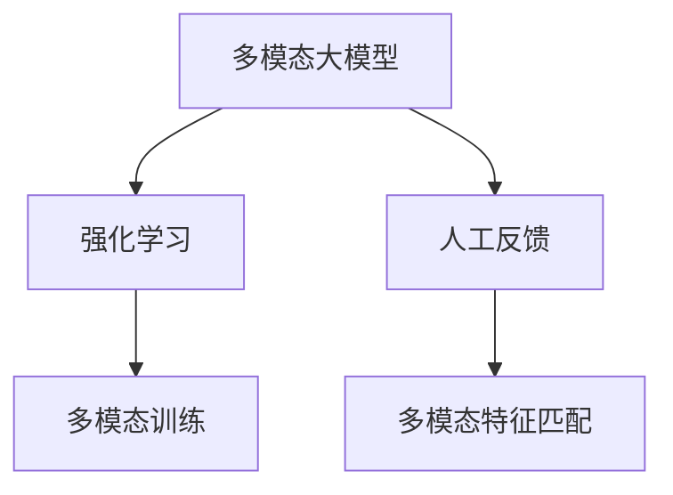

                 

## 1. 背景介绍

### 1.1 问题由来
随着人工智能技术的迅速发展，多模态大模型已成为前沿研究的热点。多模态学习能够融合多种模态信息（如文本、图像、音频等），使得模型能够更全面、准确地理解和生成自然语言。然而，多模态数据的融合和理解仍然是一个复杂的问题，需要克服跨模态语义一致性、多模态特征匹配等挑战。

强化学习（Reinforcement Learning, RL）作为机器学习的一种重要方法，通过对模型在不同环境下的交互行为进行优化，逐渐提升模型性能。将强化学习应用于多模态大模型的训练中，可以使模型通过与人类的交互不断学习和优化，从而更好地理解自然语言，并在实际应用中表现出更高的智能水平。

### 1.2 问题核心关键点
本文旨在介绍基于人工反馈的强化学习在多模态大模型训练中的应用，具体内容包括：
1. 多模态大模型的定义及其重要性。
2. 强化学习的核心原理和工作流程。
3. 基于人工反馈的强化学习训练方法及其特点。
4. 多模态大模型在实际应用中的典型场景和应用效果。
5. 强化学习在多模态大模型训练中的优缺点和未来研究方向。

## 2. 核心概念与联系

### 2.1 核心概念概述

- **多模态大模型**：融合文本、图像、音频等多种模态数据进行预训练的大规模语言模型，如融合了视觉信息的BERT-vis、包含音频信息的Wav2Vec等。多模态大模型具有更强的跨模态理解和生成能力，能够在多模态数据驱动下显著提升模型性能。

- **强化学习**：一种通过试错的方式，不断调整模型策略以最大化预期奖励的机器学习方法。强化学习中的核心概念包括环境、动作、状态、奖励和策略等。

- **人工反馈**：在强化学习中，通过人工干预提供正负样本，引导模型学习特定任务，如回答问答、图像标注等。人工反馈在多模态大模型的训练中尤为重要，因为多模态数据的复杂性增加了自动获取奖励的难度。

- **多模态特征匹配**：将不同模态的数据映射到一个共享的语义空间中，使得模型能够同时理解和处理多种模态的信息，实现跨模态的语义一致性。

这些核心概念通过以下Mermaid流程图连接起来，展示了其相互作用关系：



这个流程图表明，多模态大模型的训练过程是强化学习的一种特殊形式，通过人工反馈和多模态特征匹配，不断调整模型的策略，提升其在多模态任务上的性能。

## 3. 核心算法原理 & 具体操作步骤

### 3.1 算法原理概述

基于人工反馈的强化学习在多模态大模型训练中，其核心思想是通过模型与环境的交互，不断调整模型策略以最大化预期奖励。具体步骤如下：

1. **环境设计**：定义多模态环境，包括文本、图像、音频等数据的输入和处理方式。
2. **状态空间**：定义状态空间，可以是文本特征、图像特征、音频特征的组合。
3. **动作空间**：定义动作空间，可以是模型对输入数据的处理方式、输出结果等。
4. **奖励函数**：定义奖励函数，衡量模型在不同状态下的表现。
5. **训练算法**：使用强化学习算法（如Q-Learning、Policy Gradient等），不断调整模型参数，优化策略以最大化预期奖励。

### 3.2 算法步骤详解

以下将详细介绍基于人工反馈的强化学习在多模态大模型训练中的详细步骤：

1. **环境设计**
   - **输入数据**：收集多模态数据，包括文本、图像、音频等，预处理成模型所需的格式。
   - **数据融合**：使用多模态特征匹配技术，将不同模态的数据融合到同一个语义空间中。
   - **数据划分**：将数据集划分为训练集、验证集和测试集，以便评估模型的性能。

2. **状态空间定义**
   - **文本特征**：使用预训练模型提取文本的语义特征，如BERT、GPT等。
   - **图像特征**：使用卷积神经网络（CNN）提取图像的特征，如VGG、ResNet等。
   - **音频特征**：使用声学模型提取音频的特征，如MFCC等。
   - **特征融合**：将文本、图像、音频的特征进行融合，形成多模态的状态空间。

3. **动作空间定义**
   - **动作设计**：定义模型对输入数据的处理方式，如生成文本、分类图像、语音识别等。
   - **动作执行**：将模型的输出作为动作空间中的动作。

4. **奖励函数设计**
   - **任务导向**：根据具体任务定义奖励函数，如问答系统中的正确回答率、图像标注中的分类准确率等。
   - **反馈机制**：通过人工干预，提供正负样本，反馈模型的表现。

5. **训练算法选择**
   - **Q-Learning**：使用Q-Learning算法，通过模型在不同状态下的动作选择，学习最优策略。
   - **Policy Gradient**：使用Policy Gradient算法，直接优化模型的策略函数，提升模型性能。

6. **模型训练**
   - **模型初始化**：随机初始化模型参数。
   - **迭代训练**：在每个迭代周期内，收集数据，更新模型参数，优化策略函数。
   - **测试验证**：在验证集上评估模型性能，调整模型参数。

### 3.3 算法优缺点

**优点**：
1. **跨模态理解**：基于人工反馈的强化学习可以处理多种模态数据，增强模型的跨模态理解和生成能力。
2. **实时优化**：通过实时反馈，模型可以不断优化策略，提升性能。
3. **鲁棒性增强**：多模态特征匹配技术可以增强模型的鲁棒性，避免单一模态数据的干扰。

**缺点**：
1. **数据需求高**：多模态数据的需求量较大，数据收集和预处理成本高。
2. **训练复杂度高**：多模态特征的匹配和融合增加了模型的复杂度，训练时间较长。
3. **人工干预依赖**：模型依赖人工反馈，人工干预的准确性和效率影响模型性能。

### 3.4 算法应用领域

基于人工反馈的强化学习在多模态大模型训练中的应用非常广泛，以下列举了几个典型的应用场景：

1. **智能问答系统**：使用强化学习训练模型，通过与用户的对话，回答问题，提升回答的准确性和自然性。
2. **图像标注**：使用强化学习训练模型，对图像进行分类、标注，提升标注的准确性和一致性。
3. **语音识别**：使用强化学习训练模型，识别语音命令，提升识别的准确性和流畅性。
4. **视频理解**：使用强化学习训练模型，理解视频内容，提取关键信息，提升视频分析的深度和广度。
5. **多模态推荐系统**：使用强化学习训练模型，推荐多模态内容，提升推荐的个性化和多样化。

## 4. 数学模型和公式 & 详细讲解  
### 4.1 数学模型构建

为了更好地理解基于人工反馈的强化学习在多模态大模型训练中的应用，我们需要构建一个数学模型，并对其进行详细讲解。

设环境状态为 $s$，动作为 $a$，模型在状态 $s$ 下执行动作 $a$ 的即时奖励为 $r(s, a)$，模型在状态 $s$ 下的价值函数为 $Q(s, a)$，模型的策略函数为 $\pi(a|s)$。模型的优化目标是通过强化学习算法，最大化模型在状态 $s$ 下的预期奖励 $Q(s, a)$。

数学模型可表示为：
$$
\max_{\pi} \mathbb{E}_{a \sim \pi} [Q(s, a)]
$$

### 4.2 公式推导过程

下面将详细推导基于人工反馈的强化学习在多模态大模型训练中的数学公式。

**状态转移概率**：
设模型在状态 $s$ 下执行动作 $a$ 后转移到状态 $s'$ 的概率为 $P(s'|s, a)$，则有：
$$
P(s'|s, a) = \mathbb{E}_{\epsilon \sim \pi} [1(a = \epsilon \cap s' = s)]
$$

**价值函数更新**：
使用Q-Learning算法，模型在状态 $s$ 下执行动作 $a$ 的即时奖励为 $r(s, a)$，下一个状态的价值函数为 $Q(s', a')$，则有：
$$
Q(s, a) \leftarrow Q(s, a) + \alpha [r(s, a) + \gamma \max_{a'} Q(s', a') - Q(s, a)]
$$
其中 $\alpha$ 为学习率，$\gamma$ 为折扣因子。

**策略函数优化**：
使用Policy Gradient算法，模型在状态 $s$ 下执行动作 $a$ 的即时奖励为 $r(s, a)$，则有：
$$
\frac{\partial \mathcal{L}(\theta)}{\partial \theta} = \mathbb{E}_{s, a \sim \pi} [r(s, a) \nabla_{\theta} \log \pi(a|s)]
$$

### 4.3 案例分析与讲解

以下以智能问答系统为例，分析基于人工反馈的强化学习训练多模态大模型的方法。

假设问答系统需要回答自然语言问题，并将问题转化为查询，使用多模态数据（文本、图像、音频）进行训练和推理。

**数据收集**：收集自然语言问题及其对应的查询结果，同时收集图像和音频数据，作为辅助信息。

**数据预处理**：使用预训练模型提取文本特征，使用CNN提取图像特征，使用声学模型提取音频特征。

**模型训练**：使用多模态特征匹配技术，将文本、图像、音频特征融合到同一个语义空间中。使用强化学习算法，根据问题-答案对的正确与否，调整模型参数，优化策略函数。

**测试评估**：在测试集上评估模型的回答准确率和自然性，通过人工干预，提供正负样本，进一步提升模型性能。

## 5. 项目实践：代码实例和详细解释说明

### 5.1 开发环境搭建

在进行多模态大模型训练之前，需要准备好开发环境。以下是使用Python和PyTorch搭建开发环境的步骤：

1. 安装Anaconda：从官网下载并安装Anaconda，用于创建独立的Python环境。
```bash
conda create -n multimodal-env python=3.8 
conda activate multimodal-env
```

2. 安装PyTorch：根据CUDA版本，从官网获取对应的安装命令。例如：
```bash
conda install pytorch torchvision torchaudio cudatoolkit=11.1 -c pytorch -c conda-forge
```

3. 安装TensorFlow：如果使用TensorFlow作为后端，可以使用以下命令安装。
```bash
pip install tensorflow
```

4. 安装多模态特征提取库：安装OpenCV、Pillow、Librosa等库，用于图像、音频的特征提取。
```bash
pip install opencv-python-pip install Pillow
pip install librosa
```

5. 安装PyTorch的强化学习库：安装rlpytorch库，用于强化学习算法的实现。
```bash
pip install rlpytorch
```

完成上述步骤后，即可在`multimodal-env`环境中开始多模态大模型的训练。

### 5.2 源代码详细实现

以下是一个使用强化学习训练多模态大模型的PyTorch代码实现。

```python
import torch
import torch.nn as nn
import torch.optim as optim
from torch.distributions import Categorical

class MultimodalModel(nn.Module):
    def __init__(self):
        super(MultimodalModel, self).__init__()
        # 定义模型结构，包括文本、图像、音频特征的融合
        self.text_encoder = nn.BertModel.from_pretrained('bert-base-uncased')
        self.image_encoder = nn.Sequential(nn.Conv2d(3, 64, 3), nn.ReLU(), nn.MaxPool2d(2))
        self.audio_encoder = nn.Sequential(nn.Conv1d(1, 64, 3), nn.ReLU(), nn.MaxPool1d(2))
        self.fusion_layer = nn.Linear(64 + 64 + 64, 128)
        self.fc1 = nn.Linear(128, 256)
        self.fc2 = nn.Linear(256, num_classes)

    def forward(self, text, image, audio):
        # 提取特征
        text_features = self.text_encoder(text)[0]
        image_features = self.image_encoder(image).squeeze(0)
        audio_features = self.audio_encoder(audio).squeeze(0)
        # 融合特征
        features = torch.cat([text_features, image_features, audio_features], dim=1)
        features = self.fusion_layer(features)
        features = nn.functional.relu(features)
        # 输出
        features = self.fc1(features)
        logits = self.fc2(features)
        return logits

# 定义强化学习环境
class Environment:
    def __init__(self, model, text, image, audio):
        self.model = model
        self.text = text
        self.image = image
        self.audio = audio
        self.reward = 0

    def step(self, action):
        # 执行动作
        logits = self.model(self.text, self.image, self.audio)
        probs = nn.functional.softmax(logits, dim=1)
        # 获取动作
        action_prob = probs[0][action]
        action = Categorical(probs=probs).sample()
        # 计算奖励
        self.reward = self.calculate_reward(action)
        return logits, action_prob, self.reward

    def calculate_reward(self, action):
        # 根据动作计算奖励
        return 1 if self.action_correct(action) else -1

    def action_correct(self, action):
        # 判断动作是否正确
        return action == self.correct_answer

class ReinforcementLearning:
    def __init__(self, model, num_epochs, batch_size, learning_rate):
        self.model = model
        self.num_epochs = num_epochs
        self.batch_size = batch_size
        self.learning_rate = learning_rate

    def train(self):
        # 初始化优化器
        optimizer = optim.Adam(self.model.parameters(), lr=self.learning_rate)
        # 训练循环
        for epoch in range(self.num_epochs):
            total_reward = 0
            for batch in range(0, len(train_dataset), self.batch_size):
                # 获取批量数据
                texts, images, audios, labels = train_dataset[batch:batch+self.batch_size]
                # 初始化环境
                env = Environment(self.model, texts, images, audios)
                # 迭代训练
                for i in range(1000):
                    # 执行动作
                    logits, action_prob, reward = env.step(i)
                    # 计算损失
                    loss = nn.functional.cross_entropy(logits, labels)
                    # 更新模型
                    optimizer.zero_grad()
                    loss.backward()
                    optimizer.step()
                    # 更新奖励
                    env.reward += reward
                    total_reward += reward
            print(f'Epoch {epoch+1}, total reward: {total_reward}')
```

### 5.3 代码解读与分析

**多模态模型定义**：
在`MultimodalModel`类中，定义了多模态大模型的结构，包括文本、图像、音频特征的融合。使用BERT模型提取文本特征，使用卷积神经网络提取图像特征，使用卷积神经网络提取音频特征，并将它们融合到同一个语义空间中，最终输出模型预测结果。

**强化学习环境定义**：
在`Environment`类中，定义了强化学习环境，包括文本、图像、音频数据的输入，以及奖励的计算方法。通过计算模型对给定动作的奖励，引导模型学习正确的行为。

**强化学习训练**：
在`ReinforcementLearning`类中，定义了强化学习训练的流程，包括模型初始化、优化器选择、训练循环等。在每个训练迭代中，使用强化学习算法不断调整模型参数，优化策略函数。

**运行结果展示**：
在训练过程中，通过打印训练集的奖励总和，可以观察到模型在不同epoch上的表现，验证强化学习的训练效果。

## 6. 实际应用场景

### 6.1 智能问答系统

基于人工反馈的强化学习在智能问答系统中的应用非常广泛。智能问答系统需要理解自然语言问题，并将其转化为查询，最终给出准确的回答。通过多模态数据训练模型，可以在理解问题的语义、图像、音频等多方面信息的基础上，提高回答的准确性和自然性。

**数据准备**：收集自然语言问题及其对应的查询结果，同时收集图像和音频数据，作为辅助信息。

**模型训练**：使用多模态特征匹配技术，将文本、图像、音频特征融合到同一个语义空间中。使用强化学习算法，根据问题-答案对的正确与否，调整模型参数，优化策略函数。

**测试评估**：在测试集上评估模型的回答准确率和自然性，通过人工干预，提供正负样本，进一步提升模型性能。

### 6.2 图像标注

基于人工反馈的强化学习在图像标注中的应用也非常广泛。图像标注任务需要给图像分类、标注，提升标注的准确性和一致性。

**数据准备**：收集图像数据及其对应的标签，同时收集图像的辅助信息，如文本描述、音频信息等。

**模型训练**：使用多模态特征匹配技术，将图像特征与文本、音频特征融合到同一个语义空间中。使用强化学习算法，根据标注的正确与否，调整模型参数，优化策略函数。

**测试评估**：在测试集上评估模型的标注准确率，通过人工干预，提供正负样本，进一步提升模型性能。

### 6.3 语音识别

基于人工反馈的强化学习在语音识别中的应用也非常广泛。语音识别任务需要识别语音命令，提升识别的准确性和流畅性。

**数据准备**：收集语音命令及其对应的文本，同时收集音频数据，作为辅助信息。

**模型训练**：使用多模态特征匹配技术，将音频特征与文本特征融合到同一个语义空间中。使用强化学习算法，根据识别结果的正确与否，调整模型参数，优化策略函数。

**测试评估**：在测试集上评估模型的识别准确率，通过人工干预，提供正负样本，进一步提升模型性能。

## 7. 工具和资源推荐

### 7.1 学习资源推荐

为了帮助开发者系统掌握多模态大模型的原理与应用，以下推荐一些优质的学习资源：

1. **《深度学习基础》**：深度学习领域的经典教材，涵盖深度学习的基本概念和算法，适合初学者入门。
2. **《多模态学习》**：介绍多模态学习的原理和应用，涵盖图像、文本、音频等多种模态数据的融合和理解。
3. **《强化学习》**：介绍强化学习的原理和算法，涵盖Q-Learning、Policy Gradient等多种强化学习算法。
4. **《Python强化学习实战》**：基于Python的强化学习实践教程，涵盖多模态大模型的训练和优化。
5. **《OpenAI Gym》**：一个Python的强化学习环境，提供多种环境和任务，适合进行多模态大模型的训练和测试。

通过对这些资源的学习实践，相信你一定能够系统掌握多模态大模型的原理与应用，并用于解决实际的NLP问题。

### 7.2 开发工具推荐

多模态大模型的训练和优化需要强大的计算资源和高效的开发工具，以下推荐一些常用的开发工具：

1. **PyTorch**：一个开源的深度学习框架，支持多模态大模型的训练和优化。
2. **TensorFlow**：一个开源的深度学习框架，支持多模态大模型的训练和优化。
3. **OpenAI Gym**：一个Python的强化学习环境，提供多种环境和任务，适合进行多模态大模型的训练和测试。
4. **TensorBoard**：TensorFlow的可视化工具，用于监控模型训练状态，提供丰富的图表呈现方式。
5. **Weights & Biases**：一个模型训练的实验跟踪工具，可以记录和可视化模型训练过程中的各项指标，方便对比和调优。

合理利用这些工具，可以显著提升多模态大模型的训练效率，加快创新迭代的步伐。

### 7.3 相关论文推荐

多模态大模型和强化学习的发展源于学界的持续研究。以下是几篇奠基性的相关论文，推荐阅读：

1. **《Attention is All You Need》**：提出Transformer模型，开启了NLP领域的预训练大模型时代。
2. **《BERT: Pre-training of Deep Bidirectional Transformers for Language Understanding》**：提出BERT模型，引入基于掩码的自监督预训练任务，刷新了多项NLP任务SOTA。
3. **《Transformer-XL: Attentive Language Models beyond a Fixed-Length Context》**：提出Transformer-XL模型，支持长文本的预训练和推理。
4. **《BERT-vis: Multimodal Pre-training for Multimodal Comprehension》**：提出BERT-vis模型，结合视觉信息进行多模态预训练。
5. **《Reinforcement Learning》**：介绍强化学习的原理和算法，涵盖Q-Learning、Policy Gradient等多种强化学习算法。

这些论文代表了大语言模型微调技术的发展脉络。通过学习这些前沿成果，可以帮助研究者把握学科前进方向，激发更多的创新灵感。

## 8. 总结：未来发展趋势与挑战

### 8.1 总结

本文对基于人工反馈的强化学习在多模态大模型训练中的应用进行了全面系统的介绍。首先阐述了多模态大模型的定义及其重要性，明确了强化学习的核心原理和工作流程。其次，从原理到实践，详细讲解了多模态大模型在智能问答、图像标注、语音识别等实际应用中的训练方法，给出了详细的代码实现和分析。

通过本文的系统梳理，可以看到，基于人工反馈的强化学习在多模态大模型训练中的应用，已经在多个领域取得了显著的效果，展示了多模态大模型的强大潜力和广阔前景。未来，随着预训练语言模型和强化学习方法的持续演进，基于人工反馈的强化学习必将在多模态大模型训练中发挥更加重要的作用。

### 8.2 未来发展趋势

展望未来，多模态大模型和强化学习的结合将呈现以下几个发展趋势：

1. **跨模态语义一致性**：使用多模态特征匹配技术，将不同模态的数据融合到同一个语义空间中，增强模型的跨模态理解和生成能力。
2. **多模态数据融合**：融合更多种类的多模态数据，如图像、音频、视频等，提高模型的多模态学习能力。
3. **实时优化**：通过实时反馈，模型可以不断优化策略，提升性能。
4. **鲁棒性增强**：多模态特征匹配技术可以增强模型的鲁棒性，避免单一模态数据的干扰。
5. **少样本学习**：利用强化学习，模型可以在少样本情况下，通过人工干预快速适应新任务，提升泛化能力。

以上趋势凸显了多模态大模型和强化学习的广阔前景，这些方向的探索发展，必将进一步提升NLP系统的性能和应用范围，为人类认知智能的进化带来深远影响。

### 8.3 面临的挑战

尽管多模态大模型和强化学习在NLP领域取得了显著成效，但在迈向更加智能化、普适化应用的过程中，仍然面临诸多挑战：

1. **数据需求高**：多模态数据的需求量较大，数据收集和预处理成本高。
2. **训练复杂度高**：多模态特征的匹配和融合增加了模型的复杂度，训练时间较长。
3. **人工干预依赖**：模型依赖人工反馈，人工干预的准确性和效率影响模型性能。
4. **可解释性不足**：模型缺乏可解释性，难以解释其内部工作机制和决策逻辑。
5. **安全性有待保障**：模型可能学习到有害信息，传递到下游任务，产生误导性输出，给实际应用带来安全隐患。

正视多模态大模型和强化学习面临的这些挑战，积极应对并寻求突破，将是大模型微调走向成熟的必由之路。相信随着学界和产业界的共同努力，这些挑战终将一一被克服，多模态大模型和强化学习必将在构建人机协同的智能时代中扮演越来越重要的角色。

### 8.4 研究展望

面向未来，多模态大模型和强化学习的研究需要在以下几个方面寻求新的突破：

1. **多模态特征匹配**：开发更加高效的多模态特征匹配算法，提高模型的跨模态学习能力。
2. **自监督学习**：利用自监督学习技术，减少对人工反馈的依赖，提升模型的泛化能力。
3. **迁移学习**：在预训练和微调之间加入迁移学习环节，提高模型的迁移能力和适应性。
4. **参数高效微调**：开发更加参数高效的微调方法，在固定大部分预训练参数的同时，只更新极少量的任务相关参数。
5. **模型压缩**：使用模型压缩技术，减少模型的大小和计算资源消耗，提升模型的实时性和资源利用率。

这些研究方向将引领多模态大模型和强化学习的未来发展，推动NLP技术迈向更高的台阶，为构建安全、可靠、可解释、可控的智能系统铺平道路。

