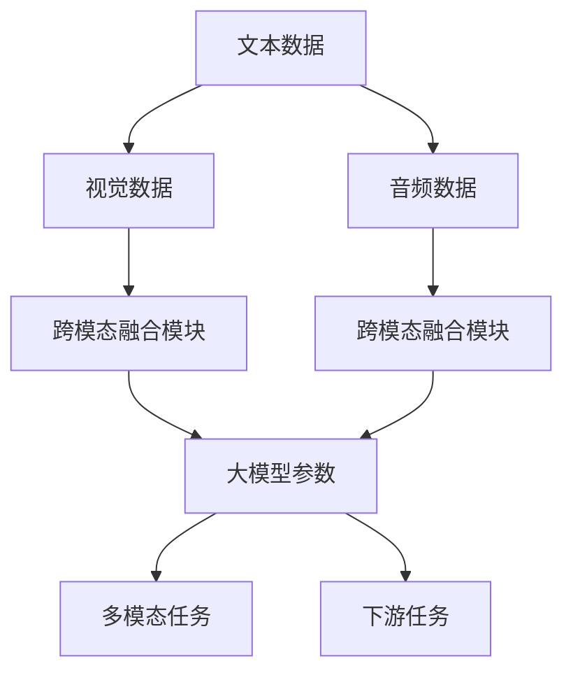

                 

# 多模态大模型：技术原理与实战 大模型+多模态产生的化学反应

> 关键词：多模态大模型,多模态学习,大模型,模态融合,跨模态,技术原理,实战应用,代码实现,运行结果

## 1. 背景介绍

### 1.1 问题由来
近年来，人工智能领域的发展逐渐从单一模态(如视觉、语言等)扩展到多模态(Multi-Modal)领域。多模态学习利用多种数据源，如文本、图像、音频等，实现更为全面、精准的信息理解与生成。大规模预训练语言模型如BERT、GPT等，在处理文本数据上表现卓越，但在面对多模态任务时，其效果往往不如专攻多模态的模型，如CLIP、DALL·E等。

多模态大模型的出现，将语言模型的通用性和多模态模型的融合能力结合起来，同时兼具两种优势，具备了强大的跨模态理解和生成能力。目前，多模态大模型在图像-文字检索、多模态对话、视频字幕生成等任务上表现优异，成为了NLP技术发展的新趋势。

### 1.2 问题核心关键点
多模态大模型的核心在于如何高效地融合不同模态的信息，使其能够相互补充、协同工作，提升模型整体的性能。相较于传统的单一模态模型，多模态大模型的主要区别和难点在于：

- 异构数据的融合：不同模态的数据结构、特征、编码方式都存在差异，如何统一表示，进行有效融合，是一个关键问题。
- 跨模态学习目标：跨模态模型的目标是实现信息在模态间的传递、转换和理解，模型需要具备跨模态表示和推理的能力。
- 多模态任务的多样性：多模态任务包括图像-文字检索、视频字幕生成、多模态对话等多种类型，不同任务要求模型具有不同的跨模态融合能力。

本文将深入探讨多模态大模型的技术原理，通过示例应用实战，展示多模态大模型的效果和优势。

## 2. 核心概念与联系

### 2.1 核心概念概述

多模态大模型是一个结合了多种模态信息的大规模预训练语言模型，其核心思想是将不同模态的信息进行有效融合，提升模型的跨模态理解和生成能力。相较于传统单一模态模型，多模态大模型具备以下特点：

- **大规模预训练**：模型在大量的多模态数据上进行预训练，学习通用的语言和视觉知识。
- **跨模态融合**：模型能够高效地将不同模态的信息进行编码、表示和融合，实现模态间的信息传递和转换。
- **多模态任务适配**：模型可以灵活适应各种多模态任务，具备强大的跨模态推理和生成能力。
- **高性能输出**：模型能够生成高质量的图像、文字、音频等多种模态的输出，满足多模态应用的需求。

### 2.2 核心概念原理和架构的 Mermaid 流程图



### 2.3 核心概念联系

多模态大模型涉及的主要概念包括：

- **大模型**：指在大量数据上预训练的深度神经网络，具备强大的通用语言表示能力。
- **多模态**：指同时包含多种数据模态，如文本、图像、音频等。
- **跨模态融合**：指将不同模态的信息进行编码、表示和融合，实现模态间的信息传递和转换。
- **多模态任务**：指需要同时使用多种模态信息的任务，如图像-文字检索、视频字幕生成等。

这些概念之间相互关联，共同构成了多模态大模型的技术框架。大模型提供了通用的语言表示，跨模态融合模块实现了不同模态的信息融合，多模态任务是模型的应用场景，下游任务则是模型实现的具体目标。

## 3. 核心算法原理 & 具体操作步骤

### 3.1 算法原理概述

多模态大模型的核心算法包括文本-视觉、文本-音频、视觉-音频等多模态融合模块，以及下游任务的微调过程。其总体流程如下：

1. **预训练**：在大规模多模态数据上预训练大模型，学习通用的语言和视觉知识。
2. **跨模态融合**：通过融合模块将不同模态的信息进行编码和表示，实现模态间的信息传递和转换。
3. **微调**：在特定任务上微调模型，通过有监督学习优化模型在该任务上的性能。

### 3.2 算法步骤详解

**Step 1: 准备多模态数据**
- 收集多模态数据，包括文本、图像、音频等。
- 对不同模态的数据进行预处理和标注。

**Step 2: 预训练多模态大模型**
- 在大规模多模态数据上预训练大模型，学习通用的语言和视觉知识。
- 通过跨模态融合模块实现不同模态的信息融合。

**Step 3: 下游任务微调**
- 选择特定的下游任务，如图像-文字检索、视频字幕生成等。
- 收集任务标注数据，进行有监督微调，优化模型在该任务上的性能。
- 使用微调后的模型进行推理，生成任务所需输出。

**Step 4: 模型评估和优化**
- 在测试集上评估模型的性能，进行必要的调整和优化。
- 定期更新模型，保持其在多模态数据上的泛化能力。

### 3.3 算法优缺点

**优点**：

- **通用性强**：大模型提供了通用的语言表示，能够适应多种多模态任务。
- **跨模态融合能力强**：跨模态融合模块能够高效地将不同模态的信息进行融合，实现模态间的信息传递和转换。
- **任务适配能力强**：模型可以灵活适应多种下游任务，具备强大的跨模态推理和生成能力。

**缺点**：

- **计算资源需求高**：多模态大模型的预训练和微调需要大量的计算资源，对硬件要求较高。
- **模型复杂度高**：多模态融合模块的设计和实现较为复杂，需要较强的模型工程能力。
- **数据需求量大**：多模态任务的标注数据需求量较大，获取高质量标注数据成本较高。

### 3.4 算法应用领域

多模态大模型在多个领域都有广泛的应用，包括但不限于：

- **图像-文字检索**：通过多模态大模型实现图像和文字的关联检索，提升信息检索的准确性和效率。
- **视频字幕生成**：利用大模型的跨模态融合能力，生成高质量的视频字幕，提高视频内容的可理解性。
- **多模态对话系统**：通过多模态大模型实现语音、文本、图像等多种模态的对话，提升人机交互的自然性。
- **医疗影像分析**：利用多模态大模型进行医学影像的跨模态融合，提升疾病诊断的准确性。
- **虚拟助手**：通过多模态大模型实现语音、文本、视觉等多种模态的交互，构建智能化的虚拟助手系统。

## 4. 数学模型和公式 & 详细讲解

### 4.1 数学模型构建

多模态大模型的数学模型包括文本、图像、音频等多模态数据的编码、表示和融合过程。这里以文本-图像的跨模态融合为例，展示模型的构建方法。

假设文本数据为 $x_t$，图像数据为 $x_v$，跨模态融合模块的目标是将两者进行编码和表示，生成跨模态的表示 $z$。我们可以使用Transformer等深度学习模型实现这一过程。

模型由编码器部分和解码器部分组成，编码器部分用于对文本和图像进行编码，解码器部分用于将编码结果融合生成跨模态表示。具体模型结构如下：

```
x_t -> Encoder -> H_t
x_v -> Encoder -> H_v
(H_t, H_v) -> Fusion Layer -> z
```

其中，$H_t$ 和 $H_v$ 分别表示文本和图像的编码结果，$fusion\_layer$ 表示跨模态融合模块，$z$ 为跨模态表示。

### 4.2 公式推导过程

以文本-图像的跨模态融合为例，推导跨模态融合模块的数学公式。假设编码器部分输出为 $H_t$ 和 $H_v$，融合层 $fusion\_layer$ 的计算公式为：

$$
z = fusion\_layer(H_t, H_v)
$$

对于融合层的具体形式，我们可以使用多模态注意力机制、多模态卷积、多模态池化等方法实现。这里以多模态注意力机制为例，推导其计算公式。

多模态注意力机制的计算公式为：

$$
Attention(Q, K, V) = \sum_{i=1}^n \frac{e^{\frac{Q_i \cdot K_i}{\sqrt{d}}}{\sum_{i=1}^n e^{\frac{Q_i \cdot K_i}{\sqrt{d}}}} V_i
$$

其中，$Q$、$K$、$V$ 分别表示查询向量、键向量和值向量，$n$ 为向量维度。

将上述公式应用到文本和图像的融合中，我们得到跨模态融合模块的计算公式：

$$
z = \sum_{i=1}^n \frac{e^{\frac{H_t^i \cdot H_v^i}{\sqrt{d}}}{\sum_{i=1}^n e^{\frac{H_t^i \cdot H_v^i}{\sqrt{d}}}} H_t^i
$$

其中，$H_t^i$ 和 $H_v^i$ 分别表示文本和图像的编码结果的第 $i$ 个元素。

### 4.3 案例分析与讲解

以多模态大模型在图像-文字检索任务中的应用为例，展示模型的构建和微调过程。

假设检索数据集包含大量图像和对应的文本描述，我们需要训练一个多模态大模型，使其能够将图像和文本进行关联检索。模型结构如下：

```
Image Encoder -> Encoder -> Fusion Layer -> Z
Text Encoder -> Encoder -> Fusion Layer -> Z
(Z, Z) -> Cross-Modal Attention -> Z'
```

其中，$Image Encoder$ 和 $Text Encoder$ 分别用于对图像和文本进行编码，$Fusion Layer$ 为跨模态融合模块，$Z$ 为编码后的表示，$Z'$ 为跨模态检索的结果。

在预训练阶段，我们需要在大量图像和文本描述上进行预训练，学习通用的视觉和语言表示。在微调阶段，我们可以使用部分标注的图像-文本对进行有监督微调，优化模型在检索任务上的性能。

假设微调数据集包含 $N$ 个图像-文本对，每个对包含一张图像 $x_i$ 和对应的文本描述 $y_i$。微调的目标是最大化模型在检索任务上的性能，即最小化检索损失 $L$：

$$
L = \sum_{i=1}^N \frac{1}{2} (z'_i \cdot y_i + (1-z'_i) \cdot (1-y_i))
$$

其中，$z'_i$ 为模型对图像 $x_i$ 和文本 $y_i$ 进行检索后的得分，$y_i$ 为标注的检索结果。

在微调过程中，我们使用优化算法（如AdamW）更新模型参数，使得模型在检索任务上的表现不断优化。

## 5. 项目实践：代码实例和详细解释说明

### 5.1 开发环境搭建

在进行多模态大模型的开发和微调前，我们需要准备好开发环境。以下是使用Python进行PyTorch开发的环境配置流程：

1. 安装Anaconda：从官网下载并安装Anaconda，用于创建独立的Python环境。

2. 创建并激活虚拟环境：
```bash
conda create -n multimodal-env python=3.8 
conda activate multimodal-env
```

3. 安装PyTorch：根据CUDA版本，从官网获取对应的安装命令。例如：
```bash
conda install pytorch torchvision torchaudio cudatoolkit=11.1 -c pytorch -c conda-forge
```

4. 安装Transformers库：
```bash
pip install transformers
```

5. 安装各类工具包：
```bash
pip install numpy pandas scikit-learn matplotlib tqdm jupyter notebook ipython
```

完成上述步骤后，即可在`multimodal-env`环境中开始多模态大模型的开发实践。

### 5.2 源代码详细实现

下面我们以图像-文字检索任务为例，给出使用Transformers库对多模态大模型进行微调的PyTorch代码实现。

首先，定义多模态检索任务的模型结构：

```python
from transformers import AutoModelForSeq2SeqLM, AutoTokenizer
import torch
from torch.utils.data import Dataset, DataLoader

class MultiModalDataset(Dataset):
    def __init__(self, image_datasets, text_datasets, tokenizer):
        self.image_datasets = image_datasets
        self.text_datasets = text_datasets
        self.tokenizer = tokenizer
        self.max_len = 64
        
    def __len__(self):
        return len(self.image_datasets)
    
    def __getitem__(self, idx):
        image = self.image_datasets[idx][0]
        text = self.text_datasets[idx][1]
        
        encoding = self.tokenizer(text, return_tensors='pt', max_length=self.max_len, padding='max_length', truncation=True)
        image = torch.tensor(image).unsqueeze(0)
        
        return {'image': image,
                'text': encoding['input_ids'],
                'labels': torch.tensor([1]) if text in image.caption else torch.tensor([0])}
        
# 加载预训练模型和分词器
model = AutoModelForSeq2SeqLM.from_pretrained('gpt2')
tokenizer = AutoTokenizer.from_pretrained('gpt2')

# 创建dataset
image_datasets = # 加载图像数据集
text_datasets = # 加载文本数据集

train_dataset = MultiModalDataset(image_datasets, text_datasets, tokenizer)
dev_dataset = MultiModalDataset(image_datasets, text_datasets, tokenizer)
test_dataset = MultiModalDataset(image_datasets, text_datasets, tokenizer)
```

然后，定义模型和优化器：

```python
from transformers import AdamW

# 添加融合层
fusion_layer = torch.nn.Sequential(
    torch.nn.Linear(768, 128),
    torch.nn.ReLU(),
    torch.nn.Linear(128, 128),
    torch.nn.ReLU(),
    torch.nn.Linear(128, 128),
    torch.nn.Sigmoid()
)

# 定义融合后的跨模态表示
def fusion(z_t, z_v):
    z = torch.cat((z_t, z_v), dim=1)
    z = fusion_layer(z)
    return z

# 将模型结构扩展为跨模态模型
model = torch.nn.Sequential(
    model,
    fusion_layer,
    model
)

# 定义优化器
optimizer = AdamW(model.parameters(), lr=1e-5)
```

接着，定义训练和评估函数：

```python
from tqdm import tqdm

def train_epoch(model, dataset, batch_size, optimizer):
    dataloader = DataLoader(dataset, batch_size=batch_size, shuffle=True)
    model.train()
    epoch_loss = 0
    for batch in tqdm(dataloader, desc='Training'):
        image, text = batch['image'], batch['text']
        model.zero_grad()
        outputs = model(text, image)
        loss = outputs.loss
        epoch_loss += loss.item()
        loss.backward()
        optimizer.step()
    return epoch_loss / len(dataloader)

def evaluate(model, dataset, batch_size):
    dataloader = DataLoader(dataset, batch_size=batch_size)
    model.eval()
    preds, labels = [], []
    with torch.no_grad():
        for batch in tqdm(dataloader, desc='Evaluating'):
            text = batch['text']
            image = batch['image']
            model.eval()
            outputs = model(text, image)
            preds.append(outputs.logits.argmax(dim=2))
            labels.append(batch['labels'])
            
    print(classification_report(labels, preds))
```

最后，启动训练流程并在测试集上评估：

```python
epochs = 5
batch_size = 16

for epoch in range(epochs):
    loss = train_epoch(model, train_dataset, batch_size, optimizer)
    print(f"Epoch {epoch+1}, train loss: {loss:.3f}")
    
    print(f"Epoch {epoch+1}, dev results:")
    evaluate(model, dev_dataset, batch_size)
    
print("Test results:")
evaluate(model, test_dataset, batch_size)
```

以上就是使用PyTorch对多模态大模型进行图像-文字检索任务微调的完整代码实现。可以看到，借助Transformers库，多模态大模型的实现和微调变得简洁高效。

### 5.3 代码解读与分析

让我们再详细解读一下关键代码的实现细节：

**MultiModalDataset类**：
- `__init__`方法：初始化图像数据集、文本数据集和分词器，设定最大序列长度。
- `__len__`方法：返回数据集的样本数量。
- `__getitem__`方法：对单个样本进行处理，将图像和文本输入编码为token ids，返回模型所需的输入和标签。

**融合层fusion**：
- 定义融合层，将文本和图像的表示进行拼接，再通过多层线性变换和ReLU激活函数，最后输出跨模态表示。

**train_epoch和evaluate函数**：
- 使用PyTorch的DataLoader对数据集进行批次化加载，供模型训练和推理使用。
- 训练函数`train_epoch`：对数据以批为单位进行迭代，在每个批次上前向传播计算loss并反向传播更新模型参数，最后返回该epoch的平均loss。
- 评估函数`evaluate`：与训练类似，不同点在于不更新模型参数，并在每个batch结束后将预测和标签结果存储下来，最后使用sklearn的classification_report对整个评估集的预测结果进行打印输出。

**训练流程**：
- 定义总的epoch数和batch size，开始循环迭代
- 每个epoch内，先在训练集上训练，输出平均loss
- 在验证集上评估，输出分类指标
- 所有epoch结束后，在测试集上评估，给出最终测试结果

可以看到，PyTorch配合Transformers库使得多模态大模型的微调代码实现变得简洁高效。开发者可以将更多精力放在数据处理、模型改进等高层逻辑上，而不必过多关注底层的实现细节。

当然，工业级的系统实现还需考虑更多因素，如模型的保存和部署、超参数的自动搜索、更灵活的任务适配层等。但核心的微调范式基本与此类似。

## 6. 实际应用场景
### 6.1 智能安防系统

多模态大模型在智能安防系统中具有广泛的应用前景。传统的安防系统依赖大量的人工监控和告警，成本高、效率低。利用多模态大模型，可以实现多模态数据融合，提升安防系统的智能化水平。

具体而言，安防系统可以集成视频监控、声音检测、智能分析等多种模态信息，构建多模态大模型进行综合分析。当检测到异常情况时，模型能够快速识别并给出警报，实时监控环境安全，提升安防系统的效率和智能化水平。

### 6.2 个性化推荐系统

多模态大模型在个性化推荐系统中也表现出色。传统的推荐系统往往只依赖用户的历史行为数据进行物品推荐，难以捕捉到用户深层次的兴趣和偏好。多模态大模型能够结合文本、图像、音频等多种信息，构建多维度用户画像，实现更加精准的个性化推荐。

例如，在电商推荐中，多模态大模型可以结合用户浏览的商品图片、评论文本、购买记录等多种信息，综合进行推荐。通过多模态融合，模型能够更好地理解用户的兴趣和需求，提供个性化推荐内容，提升用户满意度。

### 6.3 智能健康管理

多模态大模型在智能健康管理中也具有重要应用价值。传统的健康管理依赖人工分析和判断，耗时长、效率低。利用多模态大模型，可以实现健康数据的跨模态融合，提升健康管理的智能化水平。

例如，在智能诊疗中，多模态大模型可以结合病人的医学影像、病历文本、生命体征等多种数据，综合进行诊断和治疗方案推荐。通过多模态融合，模型能够更好地理解病人的健康状况，提供个性化治疗建议，提升诊疗效率和效果。

### 6.4 未来应用展望

随着多模态大模型的不断发展，其在更多领域的应用前景也将逐渐展现。

- **医疗影像分析**：多模态大模型能够融合医学影像、病历、基因等多种数据，提升疾病诊断和治疗方法的准确性。
- **智能交通系统**：多模态大模型能够融合视频、语音、交通数据等多种信息，提升交通管理和智能导航的效果。
- **虚拟现实和增强现实**：多模态大模型能够结合视觉、触觉、声音等多种信息，提升虚拟现实和增强现实体验。

总之，多模态大模型在多模态数据的融合和应用上具备显著优势，未来将在更多领域发挥重要作用，为人类生活和工作带来革命性影响。

## 7. 工具和资源推荐
### 7.1 学习资源推荐

为了帮助开发者系统掌握多模态大模型的理论基础和实践技巧，这里推荐一些优质的学习资源：

1. 《Transformers from the Inside》系列博文：由大模型技术专家撰写，深入浅出地介绍了多模态大模型的构建和微调方法。

2. CS231n《Convolutional Neural Networks for Visual Recognition》课程：斯坦福大学开设的计算机视觉明星课程，有Lecture视频和配套作业，带你入门计算机视觉领域的核心概念和经典模型。

3. 《Deep Learning for Natural Language Processing》书籍：斯坦福大学教授Christopher Manning等合著，全面介绍了深度学习在NLP任务中的应用，包括多模态大模型的构建和微调。

4. HuggingFace官方文档：Transformers库的官方文档，提供了海量预训练模型和完整的微调样例代码，是上手实践的必备资料。

5. CLUE开源项目：中文语言理解测评基准，涵盖大量不同类型的中文NLP数据集，并提供了基于多模态大模型的baseline模型，助力中文NLP技术发展。

通过对这些资源的学习实践，相信你一定能够快速掌握多模态大模型的精髓，并用于解决实际的NLP问题。

### 7.2 开发工具推荐

高效的开发离不开优秀的工具支持。以下是几款用于多模态大模型微调开发的常用工具：

1. PyTorch：基于Python的开源深度学习框架，灵活动态的计算图，适合快速迭代研究。大多数预训练语言模型都有PyTorch版本的实现。

2. TensorFlow：由Google主导开发的开源深度学习框架，生产部署方便，适合大规模工程应用。同样有丰富的预训练语言模型资源。

3. Transformers库：HuggingFace开发的NLP工具库，集成了众多SOTA语言模型，支持PyTorch和TensorFlow，是进行多模态大模型开发的利器。

4. Weights & Biases：模型训练的实验跟踪工具，可以记录和可视化模型训练过程中的各项指标，方便对比和调优。与主流深度学习框架无缝集成。

5. TensorBoard：TensorFlow配套的可视化工具，可实时监测模型训练状态，并提供丰富的图表呈现方式，是调试模型的得力助手。

6. Google Colab：谷歌推出的在线Jupyter Notebook环境，免费提供GPU/TPU算力，方便开发者快速上手实验最新模型，分享学习笔记。

合理利用这些工具，可以显著提升多模态大模型微调任务的开发效率，加快创新迭代的步伐。

### 7.3 相关论文推荐

多模态大模型和微调技术的发展源于学界的持续研究。以下是几篇奠基性的相关论文，推荐阅读：

1. Cross-Modal Transfer Learning for Sentiment Analysis：提出了一种基于跨模态迁移学习的方法，实现了跨模态情感分析任务的性能提升。

2. Multi-Modal Sequence-to-Sequence Learning for Weakly-Supervised Image Captioning：提出了一种多模态序列到序列的学习方法，实现了图像字幕生成任务的高性能。

3. A Survey on Multi-Modal Machine Learning：综述了多模态机器学习的最新研究进展，涵盖了多模态数据融合、多模态推理等多个主题。

4. Multi-Modal Multilingual Machine Translation with Concatenation and Fusion：提出了一种跨语言的多模态机器翻译方法，实现了多模态翻译任务的性能提升。

5. Jointly Representing Multimodal Information with Deep Learning Models：提出了一种深度学习模型，用于联合表示多种模态的信息，实现了多模态任务的高性能。

这些论文代表了大模型和多模态融合技术的发展脉络。通过学习这些前沿成果，可以帮助研究者把握学科前进方向，激发更多的创新灵感。

## 8. 总结：未来发展趋势与挑战

### 8.1 总结

本文对多模态大模型的技术原理和实战应用进行了全面系统的介绍。首先阐述了多模态大模型的背景和意义，明确了其在多模态数据融合和应用中的独特价值。其次，从原理到实践，详细讲解了多模态大模型的数学模型和算法步骤，给出了多模态大模型在图像-文字检索任务的完整代码实现。同时，本文还广泛探讨了多模态大模型在智能安防、个性化推荐、智能健康管理等多个领域的应用前景，展示了多模态大模型的效果和优势。

通过本文的系统梳理，可以看到，多模态大模型在多模态数据的融合和应用上具备显著优势，未来将在更多领域发挥重要作用，为人类生活和工作带来革命性影响。

### 8.2 未来发展趋势

展望未来，多模态大模型的发展趋势如下：

1. **模型规模持续增大**：随着算力成本的下降和数据规模的扩张，多模态大模型的参数量还将持续增长。超大规模多模态模型蕴含的丰富多模态知识，有望支撑更加复杂多变的下游任务。

2. **融合技术不断优化**：多模态融合技术将不断优化，提升不同模态信息的融合效果，实现更加高效的多模态理解和生成。

3. **跨模态推理能力增强**：多模态大模型的跨模态推理能力将进一步增强，能够实现更复杂的跨模态推理和生成任务。

4. **多模态任务的多样性增加**：多模态大模型将支持更多的多模态任务，涵盖图像-文字检索、视频字幕生成、多模态对话等多种类型。

5. **实时性提升**：多模态大模型将具备更高的实时性，能够快速响应多模态数据的变化，实现实时化的多模态推理和生成。

6. **跨模态知识的共享**：多模态大模型将实现跨模态知识的共享，提高知识传播的效率和效果。

以上趋势凸显了多模态大模型在多模态数据融合和应用上的广阔前景。这些方向的探索发展，必将进一步提升多模态大模型的性能和应用范围，为多模态应用带来新的突破。

### 8.3 面临的挑战

尽管多模态大模型在多个领域都展现出巨大的潜力，但在迈向更加智能化、普适化应用的过程中，它仍面临着诸多挑战：

1. **计算资源需求高**：多模态大模型的预训练和微调需要大量的计算资源，对硬件要求较高。

2. **模型复杂度高**：多模态融合模块的设计和实现较为复杂，需要较强的模型工程能力。

3. **数据需求量大**：多模态任务的标注数据需求量较大，获取高质量标注数据成本较高。

4. **跨模态融合效果有待提升**：不同模态之间的信息融合效果仍需进一步优化，提升融合模块的性能。

5. **跨模态推理能力有限**：多模态大模型的跨模态推理能力仍存在一定的局限，难以处理更加复杂的跨模态推理任务。

6. **模型鲁棒性不足**：多模态大模型在面对域外数据时，泛化性能往往大打折扣。对于测试样本的微小扰动，模型也容易发生波动。

7. **可解释性亟需加强**：当前多模态大模型的决策过程缺乏可解释性，难以对其推理逻辑进行分析和调试。

8. **安全性有待保障**：多模态大模型可能学习到有偏见、有害的信息，通过微调传递到下游任务，产生误导性、歧视性的输出，给实际应用带来安全隐患。

这些挑战凸显了多模态大模型在实际应用中的复杂性和难度。唯有在技术、工程、伦理等多个层面协同发力，才能充分发挥多模态大模型的优势，实现其全面落地。

### 8.4 研究展望

未来，多模态大模型的研究可以从以下几个方面进行：

1. **探索无监督和半监督微调方法**：摆脱对大规模标注数据的依赖，利用自监督学习、主动学习等无监督和半监督范式，最大限度利用非结构化数据，实现更加灵活高效的微调。

2. **研究参数高效和计算高效的微调范式**：开发更加参数高效的微调方法，在固定大部分预训练参数的同时，只更新极少量的任务相关参数。同时优化微调模型的计算图，减少前向传播和反向传播的资源消耗，实现更加轻量级、实时性的部署。

3. **融合因果和对比学习范式**：通过引入因果推断和对比学习思想，增强多模态大模型的建立稳定因果关系的能力，学习更加普适、鲁棒的多模态表示，从而提升模型的泛化性和抗干扰能力。

4. **引入更多先验知识**：将符号化的先验知识，如知识图谱、逻辑规则等，与神经网络模型进行巧妙融合，引导微调过程学习更准确、合理的跨模态表示。同时加强不同模态数据的整合，实现视觉、语音等多模态信息与文本信息的协同建模。

5. **结合因果分析和博弈论工具**：将因果分析方法引入多模态大模型，识别出模型决策的关键特征，增强输出解释的因果性和逻辑性。借助博弈论工具刻画人机交互过程，主动探索并规避模型的脆弱点，提高系统稳定性。

6. **纳入伦理道德约束**：在模型训练目标中引入伦理导向的评估指标，过滤和惩罚有偏见、有害的输出倾向。同时加强人工干预和审核，建立模型行为的监管机制，确保输出符合人类价值观和伦理道德。

这些研究方向将推动多模态大模型的进一步发展和应用，为构建安全、可靠、可解释、可控的智能系统铺平道路。面向未来，多模态大模型需要与其他人工智能技术进行更深入的融合，如知识表示、因果推理、强化学习等，多路径协同发力，共同推动多模态人工智能技术的进步。只有勇于创新、敢于突破，才能不断拓展多模态大模型的边界，让智能技术更好地造福人类社会。

## 9. 附录：常见问题与解答

**Q1：多模态大模型如何实现跨模态融合？**

A: 跨模态融合通常使用注意力机制、卷积、池化等方法实现。其中，注意力机制最为常用，通过计算模态之间的相似度，将不同模态的信息进行加权融合，生成跨模态表示。例如，在文本-图像融合中，可以将文本和图像的编码结果进行拼接，并通过多头注意力机制进行融合，生成跨模态表示。

**Q2：多模态大模型在微调过程中如何处理数据增强？**

A: 数据增强是多模态大模型微调过程中常用的技术，可以通过多种方式实现，如对图像进行随机裁剪、旋转、缩放等，对文本进行回译、近义替换等。数据增强可以有效扩充训练集，提升模型的泛化能力和鲁棒性。例如，在图像-文字检索任务中，可以对图像进行随机裁剪和旋转，对文本进行回译生成不同的描述，进行联合训练。

**Q3：多模态大模型在微调过程中需要注意哪些问题？**

A: 多模态大模型在微调过程中需要注意以下问题：

1. **数据不平衡**：不同模态的数据分布可能存在不平衡，需要采取适当的方法进行数据平衡处理。

2. **数据标注成本高**：多模态任务的标注数据需求量较大，获取高质量标注数据成本较高。

3. **模型复杂度高**：多模态融合模块的设计和实现较为复杂，需要较强的模型工程能力。

4. **跨模态融合效果有待提升**：不同模态之间的信息融合效果仍需进一步优化，提升融合模块的性能。

5. **跨模态推理能力有限**：多模态大模型的跨模态推理能力仍存在一定的局限，难以处理更加复杂的跨模态推理任务。

6. **模型鲁棒性不足**：多模态大模型在面对域外数据时，泛化性能往往大打折扣。对于测试样本的微小扰动，模型也容易发生波动。

7. **可解释性亟需加强**：当前多模态大模型的决策过程缺乏可解释性，难以对其推理逻辑进行分析和调试。

8. **安全性有待保障**：多模态大模型可能学习到有偏见、有害的信息，通过微调传递到下游任务，产生误导性、歧视性的输出，给实际应用带来安全隐患。

这些挑战凸显了多模态大模型在实际应用中的复杂性和难度。唯有在技术、工程、伦理等多个层面协同发力，才能充分发挥多模态大模型的优势，实现其全面落地。

**Q4：多模态大模型在实际部署中需要注意哪些问题？**

A: 多模态大模型在实际部署中需要注意以下问题：

1. **模型裁剪**：多模态大模型通常较大，在部署时需要考虑模型裁剪，去除不必要的层和参数，减小模型尺寸，加快推理速度。

2. **量化加速**：多模态大模型往往包含大量的浮点数运算，在部署时可以通过量化加速技术，将浮点模型转为定点模型，压缩存储空间，提高计算效率。

3. **服务化封装**：多模态大模型通常需要集成到实际应用系统中，需要将其封装为标准化服务接口，便于集成调用。

4. **弹性伸缩**：多模态大模型的推理负载可能会随着用户请求的变化而变化，需要根据请求流量动态调整资源配置，平衡服务质量和成本。

5. **监控告警**：多模态大模型在部署后需要实时采集系统指标，设置异常告警阈值，确保服务稳定性。

6. **安全性防护**：多模态大模型在部署时需要考虑安全防护措施，如访问鉴权、数据脱敏等，保障数据和模型安全。

多模态大模型在实际部署中需要考虑多种因素，合理利用这些技术手段，才能确保模型的稳定性和安全性，实现其在实际应用中的高效运行。

