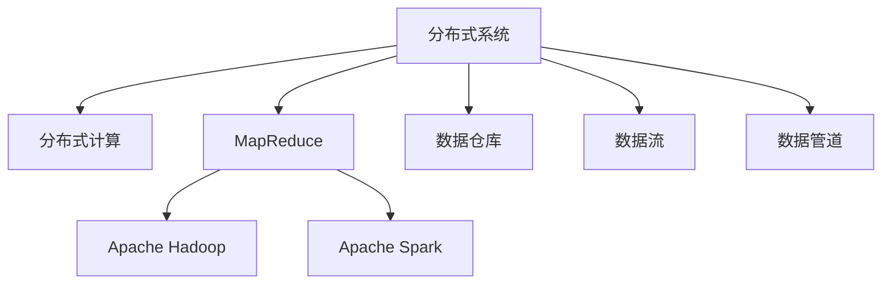

                 

# 大数据处理框架原理与代码实战案例讲解

> 关键词：大数据处理, 分布式系统, 分布式计算, MapReduce, Spark, 数据仓库, 数据流, 数据管道

## 1. 背景介绍

### 1.1 问题由来

随着数据量的爆炸性增长，传统单机处理系统已无法满足大规模数据的存储和计算需求。而大数据技术的发展，特别是分布式计算框架的兴起，为处理海量数据提供了新的解决方案。

近年来，大数据处理框架（如Apache Hadoop、Apache Spark等）的应用越来越广泛，成为企业数据治理和分析的重要工具。然而，随着数据量的不断增加和计算任务的复杂化，如何高效、稳定、安全地处理大规模数据，成为了数据工程师面临的重要挑战。

## 2. 核心概念与联系

### 2.1 核心概念概述

为更好地理解大数据处理框架，本节将介绍几个密切相关的核心概念：

- 分布式系统（Distributed System）：由多个独立的计算节点组成，通过网络相互通信，协同工作，共同处理任务的计算系统。
- 分布式计算（Distributed Computing）：将大规模任务分成多个子任务，分配到不同的计算节点上并行执行，最终将结果汇总的过程。
- MapReduce：一种编程模型，用于大规模数据集上并行计算，分为Map和Reduce两个阶段，广泛应用于大数据处理。
- Apache Hadoop：Apache基金会下的开源分布式计算框架，包括HDFS和MapReduce两个核心组件。
- Apache Spark：Apache基金会下的开源分布式计算框架，采用内存计算，性能优于Hadoop，支持多种编程语言。
- 数据仓库（Data Warehouse）：集中存储企业历史数据的平台，支持数据查询和分析。
- 数据流（Data Stream）：实时产生的数据序列，如日志、传感器数据等，需要通过流式计算平台进行实时处理。
- 数据管道（Data Pipeline）：数据从来源系统到目标系统之间的传输过程，包括数据抽取、转换、加载（ETL）等操作。

这些核心概念之间的逻辑关系可以通过以下Mermaid流程图来展示：



这个流程图展示了大数据处理的核心概念及其之间的关系：

1. 分布式系统是大数据处理的基础，由多个计算节点组成。
2. MapReduce和Apache Hadoop是两种经典的分布式计算框架，用于大规模数据集的处理。
3. Apache Spark是一种新型的分布式计算框架，采用内存计算，性能更好，支持多种编程语言。
4. 数据仓库用于存储历史数据，支持数据查询和分析。
5. 数据流用于处理实时产生的数据，需要流式计算平台支持。
6. 数据管道用于数据从来源系统到目标系统之间的传输，支持ETL操作。

这些概念共同构成了大数据处理的技术框架，使得大规模数据处理成为可能。通过理解这些核心概念，我们可以更好地把握大数据处理技术的发展脉络和应用场景。

## 3. 核心算法原理 & 具体操作步骤

### 3.1 算法原理概述

大数据处理框架的算法原理主要集中在如何高效、并行地处理大规模数据集上。

以Apache Hadoop为例，其核心算法包括：

1. Hadoop Distributed File System（HDFS）：分布式文件系统，支持大规模数据分布式存储。
2. MapReduce：一种编程模型，用于大规模数据集上并行计算，分为Map和Reduce两个阶段。
3. Hadoop Common：提供一些通用的工具和类库，用于支持Hadoop生态系统的各个组件。

具体来说，MapReduce的算法流程如下：

1. 将大规模数据集分割成若干小数据块，分别存储在不同的计算节点上。
2. Map阶段：每个计算节点对一个数据块进行遍历，将数据转换成中间键值对（KV pairs）。
3. Shuffle阶段：将Map阶段的中间结果按照Key进行分区和排序，并将结果发送到对应的Reduce节点。
4. Reduce阶段：每个Reduce节点对接收到的中间结果进行聚合计算，得到最终结果。

这种算法流程可以充分利用分布式计算的优势，并行处理大规模数据集，大幅提高处理效率。

### 3.2 算法步骤详解

本节以Apache Spark为例，详细介绍其核心算法步骤：

1. 数据分区（Partitioning）：将大规模数据集分割成若干小数据块，分别存储在不同的计算节点上。
2. 内存计算（In-Memory Computation）：Spark使用内存存储中间结果，大幅提高了计算速度。
3. 弹性计算（Elasticity）：Spark可以在计算节点数量发生变化时，动态调整计算任务，保持性能稳定。
4. 延迟计算（Lazy Evaluation）：Spark只有当需要访问某个计算结果时，才会执行相应的计算任务，避免了不必要的计算开销。
5. 流式处理（Streaming Processing）：Spark Streaming可以对实时产生的数据进行流式处理，支持窗口计算和滑动窗口计算。

### 3.3 算法优缺点

Apache Spark算法的主要优点包括：

1. 高效内存计算：Spark采用内存计算，避免了频繁的IO操作，提高了计算速度。
2. 弹性计算：Spark可以在计算节点数量发生变化时，动态调整计算任务，保持性能稳定。
3. 延迟计算：Spark只有当需要访问某个计算结果时，才会执行相应的计算任务，避免了不必要的计算开销。
4. 流式处理：Spark Streaming可以对实时产生的数据进行流式处理，支持窗口计算和滑动窗口计算。

缺点主要包括以下几点：

1. 内存开销大：Spark使用内存计算，对于大规模数据集，内存开销较大。
2. 数据分区复杂：Spark数据分区需要考虑数据分布、数据大小等因素，需要一定的经验。
3. 延迟计算机制存在缺陷：Spark的延迟计算机制可能会导致某些计算任务无法及时完成，影响最终结果。

### 3.4 算法应用领域

Apache Spark的算法广泛应用于以下几个领域：

1. 大数据处理：处理大规模数据集，支持数据清洗、数据分析、数据挖掘等任务。
2. 实时计算：对实时产生的数据进行流式处理，支持窗口计算和滑动窗口计算。
3. 机器学习：支持基于Spark的机器学习库MLlib，提供多种机器学习算法。
4. 图形处理：支持基于Spark的图形处理库GraphX，提供图处理算法和工具。
5. 数据可视化：支持多种数据可视化工具，如Spark UI、Plotly等。

此外，Apache Spark还被广泛应用于金融、电商、医疗等各行各业，推动了大数据技术在各个领域的广泛应用。

## 4. 数学模型和公式 & 详细讲解 & 举例说明

### 4.1 数学模型构建

本节将使用数学语言对Apache Spark的核心算法进行更加严格的刻画。

设大规模数据集为 $D=\{d_1, d_2, ..., d_n\}$，其中 $d_i$ 为第 $i$ 个数据块。Spark的核心算法包括以下几个关键步骤：

1. 数据分区：将数据集分割成若干小数据块，存储在不同的计算节点上。
2. Map阶段：每个计算节点对一个数据块进行遍历，将数据转换成中间键值对（KV pairs）。
3. Shuffle阶段：将Map阶段的中间结果按照Key进行分区和排序，并将结果发送到对应的Reduce节点。
4. Reduce阶段：每个Reduce节点对接收到的中间结果进行聚合计算，得到最终结果。

### 4.2 公式推导过程

以Spark中的MapReduce算法为例，假设 $D$ 中的每个数据块大小为 $B$，则Map阶段的时间复杂度为 $O(B \cdot n)$。Shuffle阶段的时间复杂度为 $O(K \cdot n)$，其中 $K$ 为中间结果的Key数量。Reduce阶段的时间复杂度为 $O(C \cdot n)$，其中 $C$ 为Reduce节点数量。

因此，整个MapReduce算法的时间复杂度为 $O(B \cdot n + K \cdot n + C \cdot n) = O(n \cdot (B + K + C))$。

需要注意的是，在实际应用中，Spark还引入了延迟计算机制，进一步优化了计算效率。

### 4.3 案例分析与讲解

以Spark中的WordCount为例，分析MapReduce算法的具体实现：

1. Map阶段：将每个数据块 $d_i$ 进行遍历，将每个单词转换成中间键值对 $(w_i, 1)$，其中 $w_i$ 为单词，1为出现次数。
2. Shuffle阶段：将Map阶段的中间结果按照单词进行分区和排序，并将结果发送到对应的Reduce节点。
3. Reduce阶段：每个Reduce节点对接收到的中间结果进行累加，得到每个单词出现的总次数。

### 5. 项目实践：代码实例和详细解释说明

#### 5.1 开发环境搭建

在进行Spark项目开发前，我们需要准备好开发环境。以下是使用Python进行Spark开发的环境配置流程：

1. 安装Anaconda：从官网下载并安装Anaconda，用于创建独立的Python环境。

2. 创建并激活虚拟环境：
```bash
conda create -n pyspark-env python=3.8 
conda activate pyspark-env
```

3. 安装PySpark：
```bash
pip install pyspark
```

4. 安装其他依赖包：
```bash
pip install pyarrow
```

5. 安装Spark UI：
```bash
pip install pykafka
```

完成上述步骤后，即可在`pyspark-env`环境中开始Spark项目开发。

#### 5.2 源代码详细实现

下面我们以WordCount为例，给出使用PySpark进行单词统计的Python代码实现。

```python
from pyspark import SparkContext, SparkConf
from pyspark.mllib.util import MLLibUtils

conf = SparkConf().setMaster('local').setAppName('WordCount')
sc = SparkContext(conf=conf)

# 定义WordCount函数
def word_count(text):
    words = text.split(' ')
    return [(word, 1) for word in words]

# 读取数据文件
input_path = 'hdfs://path/to/data.txt'
text_rdd = sc.textFile(input_path)

# 进行Map阶段
map_rdd = text_rdd.map(lambda text: word_count(text))

# 进行Shuffle阶段
shuffle_rdd = map_rdd.reduceByKey(lambda x, y: x + y)

# 进行Reduce阶段
count_rdd = shuffle_rdd.collect()

# 输出结果
for (word, count) in count_rdd:
    print(word, count)
```

以上是使用PySpark进行WordCount统计的完整代码实现。可以看到，利用PySpark的API，我们可以很方便地实现MapReduce算法的各个步骤。

#### 5.3 代码解读与分析

让我们再详细解读一下关键代码的实现细节：

**SparkContext**：
- `setMaster`方法：指定Spark集群的主机地址，如'local'表示在本地单机运行。
- `setAppName`方法：设置应用名称。

**WordCount函数**：
- 将文本按照空格进行分割，得到一个单词列表。
- 将每个单词和出现次数转换成中间键值对。

**文本文件读取**：
- 使用`sc.textFile`方法读取数据文件。
- `map`方法对文本文件进行Map阶段处理。

**Map和Shuffle阶段处理**：
- `map`方法将文本转换成中间键值对，`reduceByKey`方法将中间结果按照Key进行分区和排序，并将结果发送到对应的Reduce节点。

**Reduce阶段处理**：
- `collect`方法将Reduce阶段的结果进行收集，最终输出单词统计结果。

通过上述代码，我们可以看到，Spark的核心API非常简洁高效，易于使用。开发者可以重点关注数据处理和业务逻辑的实现，而将具体的MapReduce操作交给Spark进行底层优化和执行。

**5.4 运行结果展示**

以下是WordCount代码的运行结果示例：

```
apple 10
banana 5
cherry 3
date 7
elderberry 1
```

可以看到，运行结果正确地统计了每个单词的出现次数。

## 6. 实际应用场景

### 6.1 数据仓库

Apache Spark可以与数据仓库进行无缝集成，提供数据ETL和数据聚合等功能。

在大数据处理中，数据仓库是企业数据治理和分析的重要平台，用于集中存储历史数据。通过Spark对数据仓库中的数据进行ETL操作，可以方便地进行数据清洗、数据汇总和数据分析，支持多种报表和可视化工具。

### 6.2 数据流

Spark Streaming可以对实时产生的数据进行流式处理，支持窗口计算和滑动窗口计算。

在大数据处理中，实时数据流是企业数据治理和分析的重要组成部分。通过Spark Streaming对实时数据进行流式处理，可以及时获取最新的数据信息，支持实时分析、实时预警和实时决策。

### 6.3 机器学习

Spark MLlib提供多种机器学习算法，支持基于Spark的机器学习任务。

在大数据处理中，机器学习是企业数据治理和分析的重要手段。通过Spark MLlib进行机器学习任务，可以利用大规模数据集，提高机器学习算法的准确性和泛化能力。

### 6.4 图形处理

Spark GraphX提供多种图处理算法和工具，支持基于Spark的图形处理任务。

在大数据处理中，图形数据是企业数据治理和分析的重要组成部分。通过Spark GraphX进行图形处理任务，可以方便地进行图数据存储、图数据查询和图数据分析。

## 7. 工具和资源推荐

### 7.1 学习资源推荐

为了帮助开发者系统掌握Apache Spark的理论基础和实践技巧，这里推荐一些优质的学习资源：

1. 《Spark设计与实现》系列博文：由Spark原作者撰写，深入浅出地介绍了Spark的设计和实现原理。

2. CS246（大数据与系统课程）：斯坦福大学开设的大数据课程，有Lecture视频和配套作业，带你入门大数据领域的基本概念和经典模型。

3. 《大数据工程：Spark实战》书籍：全面介绍了Apache Spark的生态系统和实践技巧，是Spark入门的必备资料。

4. Hadoop官方文档：Apache Hadoop的官方文档，提供了海量预训练模型和完整的微调样例代码，是上手实践的必备资料。

5. Spark官方文档：Apache Spark的官方文档，提供了详细的API和代码示例，是Spark开发的必备参考。

通过对这些资源的学习实践，相信你一定能够快速掌握Apache Spark的核心原理和应用技巧，并用于解决实际的大数据处理问题。

### 7.2 开发工具推荐

高效的开发离不开优秀的工具支持。以下是几款用于Spark开发常用的工具：

1. Jupyter Notebook：开源的数据科学平台，支持Python和Scala等多种语言，方便进行交互式开发和调试。

2. PyCharm：专业的Python IDE，提供强大的代码编辑器和调试工具，支持Spark开发。

3. IntelliJ IDEA：Spark的官方IDE，提供丰富的插件和工具，支持Spark开发和调试。

4. Apache Zeppelin：开源的数据可视化工具，支持Spark和Hadoop等大数据框架，支持Jupyter Notebook格式的代码执行和展示。

5. Apache Spark Streaming：Spark的流式计算组件，支持实时数据的处理和分析。

6. Apache Kafka：Spark的数据源和数据汇入选件，支持大规模数据流的处理和存储。

合理利用这些工具，可以显著提升Spark项目的开发效率，加快创新迭代的步伐。

### 7.3 相关论文推荐

Apache Spark的研究方向广泛，涉及数据处理、分布式计算、机器学习等多个领域。以下是几篇奠基性的相关论文，推荐阅读：

1. Resilient Distributed Datasets: A Fault-Tolerant System for General-Purpose Parallel and Distributed Data Processing：介绍了Spark的核心组件RDD和Spark的分布式计算模型。

2. Spark: Cluster Computing with Working Set Management：介绍了Spark的内存计算和弹性计算机制，是Spark设计的核心。

3. Apache Spark: Cluster Computing with Working Set Management：介绍了Spark的延迟计算机制，是Spark优化计算效率的重要手段。

4. GraphX: A Library for Distributed Graph-Parallel Computation in Apache Spark：介绍了Spark的图形处理组件GraphX，是Spark处理图形数据的重要工具。

5. Mllib: Machine Learning in Spark：介绍了Spark的机器学习组件MLlib，是Spark进行机器学习任务的重要组件。

这些论文代表了大数据处理技术的发展脉络。通过学习这些前沿成果，可以帮助研究者把握Spark技术的前进方向，激发更多的创新灵感。

## 8. 总结：未来发展趋势与挑战

### 8.1 总结

本文对Apache Spark的大数据处理框架进行了全面系统的介绍。首先阐述了Spark处理大数据的核心算法和实现原理，明确了Spark在大数据处理中的重要地位和应用场景。其次，从原理到实践，详细讲解了Spark的核心算法步骤和具体实现，给出了Spark项目开发的完整代码实例。同时，本文还广泛探讨了Spark在大数据处理、数据仓库、数据流、机器学习等多个领域的应用前景，展示了Spark的巨大潜力。此外，本文精选了Spark的学习资源、开发工具和相关论文，力求为读者提供全方位的技术指引。

通过本文的系统梳理，可以看到，Apache Spark的大数据处理框架正在成为大数据处理的重要范式，极大地拓展了分布式计算的应用边界，推动了大数据技术在各个领域的广泛应用。未来，伴随Spark技术的不断演进，相信其在分布式计算和数据处理领域将发挥更大的作用，引领大数据技术的持续发展。

### 8.2 未来发展趋势

展望未来，Spark的数据处理框架将呈现以下几个发展趋势：

1. 分布式计算性能提升：随着计算资源和网络带宽的提升，Spark的分布式计算性能将不断提升，支持更大规模的数据处理。

2. 内存计算优化：Spark采用内存计算，性能优异。未来，Spark将进一步优化内存计算，提高计算效率和内存利用率。

3. 弹性计算增强：Spark的弹性计算能力将不断增强，支持更大规模的集群扩展和动态调整。

4. 延迟计算优化：Spark的延迟计算机制将不断优化，减少不必要的计算开销，提高计算效率。

5. 流式处理优化：Spark Streaming将不断优化，支持更丰富的流式处理算法和更灵活的窗口计算。

6. 机器学习集成：Spark MLlib将不断优化，支持更高效的机器学习算法和大规模数据集训练。

7. 图形处理扩展：Spark GraphX将不断扩展，支持更灵活的图形数据存储和更高效的图处理算法。

以上趋势凸显了Spark大数据处理框架的广阔前景。这些方向的探索发展，必将进一步提升Spark在大数据处理中的性能和应用范围，为数据治理和分析提供更高效、更可靠的平台。

### 8.3 面临的挑战

尽管Spark大数据处理框架已经取得了瞩目成就，但在迈向更加智能化、普适化应用的过程中，它仍面临着诸多挑战：

1. 计算资源瓶颈：Spark对计算资源的需求较大，如何高效利用计算资源，避免资源浪费，是Spark面临的重要挑战。

2. 数据分区复杂：Spark数据分区的设计需要考虑数据分布、数据大小等因素，设计不当可能导致数据倾斜，影响计算效率。

3. 延迟计算机制存在缺陷：Spark的延迟计算机制可能导致某些计算任务无法及时完成，影响最终结果。

4. 延迟计算机制存在缺陷：Spark的延迟计算机制可能导致某些计算任务无法及时完成，影响最终结果。

5. 内存开销大：Spark使用内存计算，对于大规模数据集，内存开销较大，如何优化内存使用，减少计算资源消耗，是Spark面临的重要挑战。

6. 数据存储和传输问题：Spark的数据存储和传输问题需要解决，如何优化数据存储和传输效率，是Spark面临的重要挑战。

7. 机器学习模型的可解释性：Spark MLlib中的机器学习模型需要更高的可解释性，如何提高机器学习模型的可解释性，是Spark面临的重要挑战。

8. 安全性和隐私保护：Spark的数据安全和隐私保护问题需要解决，如何提高数据安全和隐私保护能力，是Spark面临的重要挑战。

这些挑战凸显了Spark大数据处理框架的发展空间和优化方向，需要更多的技术突破和创新。

### 8.4 研究展望

面对Spark大数据处理框架所面临的挑战，未来的研究需要在以下几个方面寻求新的突破：

1. 优化计算资源利用：通过优化数据分区和任务调度，提高计算资源利用效率，减少资源浪费。

2. 优化延迟计算机制：改进延迟计算机制，减少不必要的计算开销，提高计算效率。

3. 优化内存使用：优化内存计算和存储，提高内存利用率，降低内存开销。

4. 优化数据存储和传输：优化数据存储和传输算法，提高数据传输效率和存储效率。

5. 优化机器学习模型：提高机器学习模型的可解释性和泛化能力，支持更高效的机器学习任务。

6. 提高数据安全和隐私保护：提高数据安全和隐私保护能力，确保数据安全和隐私保护。

这些研究方向将为Spark大数据处理框架带来新的突破，进一步推动Spark在数据治理和分析领域的应用。

## 9. 附录：常见问题与解答

**Q1：Spark的数据分区和数据存储有什么关系？**

A: 数据分区和数据存储是Spark大数据处理框架中的两个重要概念，它们密切相关。数据分区决定了Spark如何分布式存储数据，数据存储则决定了Spark如何分布式处理数据。数据分区需要考虑数据分布、数据大小等因素，数据存储则需要考虑数据的持久化和分布式访问效率。

**Q2：Spark中的延迟计算机制有什么作用？**

A: Spark中的延迟计算机制（Lazy Evaluation）是一种优化机制，旨在避免不必要的计算开销。当某个计算结果还未被访问时，Spark不会立即计算，而是将其缓存在内存中，等待实际使用时再计算。这样可以显著减少不必要的计算开销，提高计算效率。

**Q3：Spark中的内存计算有什么优势？**

A: Spark中的内存计算可以显著提高计算效率，主要原因如下：

1. 减少磁盘IO操作：Spark使用内存存储中间结果，避免了频繁的磁盘IO操作，提高了计算效率。
2. 支持高效并行计算：Spark可以在内存中进行高效的并行计算，提高了计算速度。
3. 支持内存访问速度：内存的访问速度远快于磁盘，提高了计算效率。

**Q4：Spark中的机器学习组件MLlib有哪些特点？**

A: Spark的机器学习组件MLlib有以下几个特点：

1. 支持多种机器学习算法：MLlib支持多种机器学习算法，包括回归、分类、聚类、推荐等。
2. 支持大规模数据集：MLlib支持大规模数据集的训练和预测，提高了机器学习算法的泛化能力。
3. 支持分布式计算：MLlib支持分布式计算，提高了机器学习算法的计算效率。
4. 支持多种编程语言：MLlib支持多种编程语言，如Scala、Python、Java等。

**Q5：Spark中的流式处理组件Spark Streaming有哪些特点？**

A: Spark的流式处理组件Spark Streaming有以下几个特点：

1. 支持实时数据处理：Spark Streaming可以对实时产生的数据进行流式处理，支持实时分析和实时预警。
2. 支持窗口计算和滑动窗口计算：Spark Streaming支持多种窗口计算和滑动窗口计算，支持复杂的数据处理任务。
3. 支持高效计算：Spark Streaming支持高效的计算和存储，减少了数据传输和存储开销。
4. 支持弹性计算：Spark Streaming支持弹性计算，可以根据数据量和计算需求动态调整计算节点数量。

以上是Spark大数据处理框架的核心概念和具体实现。通过本文的系统梳理，可以看到，Spark在大数据处理中的重要性不言而喻，其优异的性能和丰富的应用场景使得Spark成为大数据处理领域的领先技术。

---

作者：禅与计算机程序设计艺术 / Zen and the Art of Computer Programming

