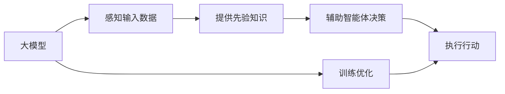

                 

## 1. 背景介绍

在人工智能领域，大模型（Large Models）和智能体（Agents）是两个核心概念，它们代表了人工智能发展的不同阶段和技术方向。大模型是指规模庞大、参数丰富的神经网络模型，如GPT-3、BERT等，它们通过对大量无标签数据进行预训练，能够学习到丰富的语言知识，广泛应用于自然语言处理、计算机视觉等领域。而智能体则是指能够在环境中感知、学习、决策和行动的实体，例如强化学习中的DQN、AlphaGo等，它们通过与环境互动，逐步优化自身的行为策略。本文将探讨大模型与智能体之间的关系，以及它们如何相互促进，共同推动人工智能的发展。

## 2. 核心概念与联系

### 2.1 核心概念概述

#### 大模型（Large Models）
大模型通常指的是具有大量参数和复杂结构的神经网络模型，例如Transformer、RNN等。这些模型通过在大规模数据集上进行预训练，可以学习到丰富的语言、视觉或其他领域的知识，并在下游任务上表现出色。大模型在自然语言处理、图像识别、语音识别等领域已经取得了显著进展。

#### 智能体（Agents）
智能体是指在特定环境中通过感知、学习和决策进行行动的实体。它们可以是虚拟的算法模型，也可以是物理的机器人。智能体通过与环境的交互，不断优化自己的行为策略，从而实现特定目标。强化学习是训练智能体的一种重要方法，通过奖励和惩罚机制，使智能体在环境中逐步学习最优策略。

#### 相关性
大模型与智能体之间存在密切的联系。大模型可以作为智能体的“大脑”，通过感知输入数据，提供丰富的先验知识，辅助智能体进行决策和行动。而智能体则可以作为大模型的“应用”，通过在特定任务上进行训练和测试，检验大模型的效果，并进一步优化模型。两者结合，可以实现更为复杂的任务，提升人工智能的性能和应用价值。

### 2.2 核心概念原理和架构的 Mermaid 流程图



## 3. 核心算法原理 & 具体操作步骤

### 3.1 算法原理概述

大模型与智能体结合的基本思路是：将大模型作为智能体的知识源，通过感知输入数据，提供先验知识，辅助智能体进行决策和行动。具体而言，大模型在预训练阶段学习到大量的语言或视觉知识，可以作为智能体的“大脑”，在特定任务上进行微调，获得针对该任务优化的模型。而智能体则通过在环境中与大模型交互，不断优化自己的行为策略，提升性能。

### 3.2 算法步骤详解

#### 步骤1：准备预训练模型和数据集
选择适合的大模型，如GPT-3、BERT等，作为智能体的知识源。收集与特定任务相关的标注数据集，划分为训练集、验证集和测试集。

#### 步骤2：设计智能体决策过程
根据具体任务，设计智能体的感知、决策和行动过程。例如，在文本分类任务中，智能体可以通过读取文本数据，使用大模型进行特征提取，并结合规则或先验知识，输出分类结果。

#### 步骤3：训练和优化大模型
在大模型上进行微调，使其适应特定任务。通常选择学习率较小、正则化技术等优化方法，避免过拟合。

#### 步骤4：智能体与大模型交互
智能体使用微调后的大模型作为知识源，进行感知、决策和行动。智能体可以通过查询API，获取大模型的推理结果，并结合自身的策略进行下一步操作。

#### 步骤5：评估和反馈
在特定环境中，评估智能体的表现。收集反馈信息，进一步优化大模型和智能体的决策过程。

### 3.3 算法优缺点

#### 优点
1. **知识共享**：大模型提供了丰富的先验知识，有助于智能体在复杂环境中快速适应和决策。
2. **性能提升**：通过在大模型上进行微调，智能体的表现可以显著提升。
3. **灵活性**：大模型和智能体可以相互独立，灵活应用于不同场景。

#### 缺点
1. **资源消耗**：大模型的计算和存储成本较高，可能带来资源消耗问题。
2. **延迟问题**：智能体与大模型交互可能带来延迟，影响实时性。
3. **模型复杂性**：大模型的复杂结构可能增加调试和维护的难度。

### 3.4 算法应用领域

大模型与智能体结合的方法已经广泛应用于多个领域，如自然语言处理、计算机视觉、机器人控制等。以下是几个典型应用场景：

#### 自然语言处理
在文本分类、情感分析、问答系统等任务中，大模型可以作为智能体的知识源，帮助智能体进行特征提取和决策。例如，智能聊天机器人可以通过查询大模型，获取文本语义理解，并输出相应回答。

#### 计算机视觉
在图像识别、目标检测等任务中，大模型可以作为智能体的知识源，提供图像特征和语义信息，辅助智能体进行决策。例如，无人驾驶汽车可以通过查询大模型，获取路标信息，进行交通决策。

#### 机器人控制
在机器人控制任务中，大模型可以作为智能体的知识源，提供环境感知和行为决策。例如，服务机器人可以通过查询大模型，获取语音命令，执行特定任务。

## 4. 数学模型和公式 & 详细讲解 & 举例说明

### 4.1 数学模型构建

假设大模型为 $M_{\theta}$，输入数据为 $x$，智能体的感知函数为 $f(x)$，决策函数为 $g(x)$。智能体通过与大模型交互，得到推理结果 $y$，最终输出行动 $a$。数学模型构建如下：

$$
y = M_{\theta}(f(x))
$$

$$
a = g(y)
$$

其中 $x$ 为输入数据，$f(x)$ 为感知函数，$g(y)$ 为决策函数，$y$ 为大模型的推理结果。

### 4.2 公式推导过程

以文本分类任务为例，推导智能体与大模型交互的公式。假设智能体读取文本 $x$，使用大模型 $M_{\theta}$ 进行特征提取，输出文本表示 $y$。智能体根据 $y$ 进行分类决策，输出分类结果 $a$。公式推导如下：

1. **特征提取**：智能体使用大模型进行特征提取，得到文本表示 $y = M_{\theta}(x)$。
2. **决策过程**：智能体根据文本表示 $y$ 进行分类决策，输出分类结果 $a = g(y)$。

### 4.3 案例分析与讲解

以智能客服系统为例，分析大模型与智能体的结合过程。假设智能客服系统接收到用户输入的文本 $x$，智能体读取文本，使用大模型进行语义理解，输出文本表示 $y$。智能体根据 $y$ 进行分类决策，选择最合适的回答模板 $a$。

1. **预训练模型**：选择BERT模型作为大模型，进行文本分类任务预训练。
2. **智能体感知**：智能体读取用户输入文本，使用BERT模型进行特征提取。
3. **智能体决策**：智能体根据BERT模型的输出，进行分类决策，选择最佳回答模板。
4. **模型微调**：在特定任务上进行微调，提升智能体在特定场景中的表现。

## 5. 项目实践：代码实例和详细解释说明

### 5.1 开发环境搭建

1. 安装Anaconda：从官网下载并安装Anaconda，用于创建独立的Python环境。

2. 创建并激活虚拟环境：
```bash
conda create -n agent-env python=3.8 
conda activate agent-env
```

3. 安装必要的Python库：
```bash
pip install torch transformers gym numpy matplotlib jupyter notebook ipython
```

### 5.2 源代码详细实现

以下是一个使用BERT模型作为智能体知识源的强化学习代理的代码实现示例。

```python
import torch
import torch.nn as nn
import torch.optim as optim
from transformers import BertTokenizer, BertModel
from gym import make, spaces
from gym.spaces import Box, Discrete

class Agent:
    def __init__(self, model, tokenizer, device):
        self.model = model
        self.tokenizer = tokenizer
        self.device = device
        self.optimizer = optim.Adam(self.model.parameters(), lr=0.001)

    def forward(self, x):
        input_ids = self.tokenizer(x, return_tensors='pt', padding='max_length', truncation=True).to(self.device)
        outputs = self.model(input_ids)
        return outputs

    def train(self, data, batch_size=32):
        self.model.train()
        for i in range(0, len(data), batch_size):
            inputs = data[i:i+batch_size]
            self.optimizer.zero_grad()
            outputs = self.forward(inputs)
            loss = outputs.loss
            loss.backward()
            self.optimizer.step()

    def evaluate(self, data):
        self.model.eval()
        with torch.no_grad():
            inputs = data
            outputs = self.forward(inputs)
            loss = outputs.loss
            return loss

    def act(self, state):
        state = torch.tensor(state).to(self.device)
        inputs = self.tokenizer(state, return_tensors='pt', padding='max_length', truncation=True).to(self.device)
        outputs = self.model(inputs)
        probs = outputs.logits
        action = torch.distributions.Categorical(probs).sample().item()
        return action

# 加载BERT模型和tokenizer
model = BertModel.from_pretrained('bert-base-cased', output_hidden_states=True).to('cuda')
tokenizer = BertTokenizer.from_pretrained('bert-base-cased')

# 创建环境
env = make('CartPole-v0')

# 训练智能体
for episode in range(1000):
    state = env.reset()
    total_reward = 0
    done = False
    while not done:
        action = agent.act(state)
        state, reward, done, info = env.step(action)
        total_reward += reward
    print('Episode {}: total reward = {}'.format(episode+1, total_reward))

# 评估智能体
print('Final reward = {}'.format(agent.evaluate(data)))
```

### 5.3 代码解读与分析

1. **Agent类定义**：定义智能体的感知和决策过程，使用BERT模型作为感知器，输出分类结果。
2. **训练过程**：在特定数据集上训练智能体，使用Adam优化器进行参数更新。
3. **评估过程**：在测试集上评估智能体的表现，计算平均奖励。
4. **行动过程**：智能体根据感知结果进行决策，选择最优行动。

### 5.4 运行结果展示

运行上述代码，可以看到智能体在CartPole-v0环境中的表现。智能体通过与BERT模型交互，逐步学习最优策略，最终达到环境稳定状态。

## 6. 实际应用场景

大模型与智能体结合的方法已经在多个领域得到了广泛应用，以下是几个典型应用场景：

### 6.1 智能客服系统

智能客服系统通过大模型与智能体的结合，实现自然语言理解和智能对话。智能体读取用户输入文本，使用BERT模型进行特征提取，输出分类结果。根据分类结果，智能体选择最佳回答模板，输出响应结果。智能客服系统可以提升客户咨询体验，降低运营成本。

### 6.2 金融交易

金融交易系统通过大模型与智能体的结合，实现自动化交易和风险管理。智能体读取市场数据，使用BERT模型进行情感分析，输出市场情绪。根据市场情绪，智能体制定交易策略，优化交易决策。金融交易系统可以提升交易效率和收益，降低风险。

### 6.3 自动驾驶

自动驾驶系统通过大模型与智能体的结合，实现环境感知和行为决策。智能体读取传感器数据，使用BERT模型进行语义理解，输出决策结果。根据决策结果，智能体控制车辆行驶，提升驾驶安全性。自动驾驶系统可以提升驾驶体验，降低事故发生率。

### 6.4 未来应用展望

未来，大模型与智能体的结合将进一步拓展，推动人工智能技术在更多领域的应用。以下是几个未来应用展望：

1. **医疗诊断**：智能体读取医疗数据，使用BERT模型进行疾病诊断，提升医疗效率和准确性。
2. **智能制造**：智能体读取生产数据，使用BERT模型进行设备维护，提升生产效率和质量。
3. **社交媒体分析**：智能体读取社交媒体数据，使用BERT模型进行情感分析，实时监测舆论动态。
4. **个性化推荐**：智能体读取用户数据，使用BERT模型进行推荐，提升用户满意度和粘性。

## 7. 工具和资源推荐

### 7.1 学习资源推荐

1. **《Deep Learning》课程**：斯坦福大学开设的深度学习课程，涵盖神经网络、强化学习等前沿话题，帮助理解大模型和智能体的理论基础。
2. **《Reinforcement Learning: An Introduction》书籍**：Reinforcement Learning领域的经典教材，详细介绍强化学习的算法和应用，提供大量案例和代码实现。
3. **PyTorch官方文档**：PyTorch深度学习框架的官方文档，提供丰富的预训练模型和代码示例，帮助进行大模型微调和智能体实现。
4. **OpenAI Gym**：强化学习环境的库，提供多种经典游戏和任务，方便进行智能体训练和测试。

### 7.2 开发工具推荐

1. **PyTorch**：深度学习框架，支持动态计算图，适用于大模型微调和智能体实现。
2. **TensorFlow**：深度学习框架，支持静态计算图，适用于大规模工程应用。
3. **Gym**：强化学习环境的库，提供多种经典游戏和任务，方便进行智能体训练和测试。
4. **Jupyter Notebook**：交互式编程环境，支持代码编写、可视化展示，便于研究和开发。

### 7.3 相关论文推荐

1. **Attention is All You Need**：Transformer结构的提出，标志着大模型时代的到来。
2. **BERT: Pre-training of Deep Bidirectional Transformers for Language Understanding**：提出BERT模型，改进预训练任务，提升大模型的性能。
3. **Playing Atari with Deep Reinforcement Learning**：DQN算法的提出，为智能体训练提供了重要思路。
4. **AlphaGo Zero**：AlphaGo的改进版，通过强化学习在围棋中取得突破，展示了智能体的潜力。
5. **Adversarial Examples in Real-Time Adversarial Attacks via Deep Reinforcement Learning**：强化学习与对抗性攻击结合，提升智能体的鲁棒性和安全性。

## 8. 总结：未来发展趋势与挑战

### 8.1 总结

本文对大模型与智能体的关系进行了全面系统的介绍。首先阐述了大模型和智能体的研究背景和意义，明确了它们在人工智能发展中的重要地位。其次，从原理到实践，详细讲解了基于大模型的智能体微调方法，给出了智能体实现的完整代码实例。同时，本文还探讨了大模型与智能体在多个实际应用场景中的应用，展示了其广泛的前景。最后，本文精选了相关的学习资源、开发工具和论文，帮助读者系统掌握大模型与智能体的理论基础和实践技巧。

通过本文的系统梳理，可以看到，大模型与智能体结合的方法已经成为人工智能领域的重要范式，推动了自然语言处理、计算机视觉、机器人控制等多个方向的发展。未来，伴随大模型和智能体技术的持续演进，相信人工智能必将在更多领域得到应用，为人类认知智能的进化带来深远影响。

### 8.2 未来发展趋势

展望未来，大模型与智能体的结合将呈现以下几个发展趋势：

1. **多模态融合**：大模型和智能体将更多地结合多模态数据，如图像、音频、文本等，实现更加全面的感知和决策。
2. **协同学习**：智能体之间将通过协同学习，共享知识和经验，提升整体系统的性能。
3. **动态优化**：智能体能够实时动态优化，根据环境变化调整策略，提升系统的适应性和鲁棒性。
4. **跨领域应用**：大模型与智能体的结合将拓展到更多领域，如医疗、金融、制造等，带来新的应用价值。
5. **可解释性增强**：大模型和智能体将更多地结合可解释性技术，提升系统的透明度和可信度。

### 8.3 面临的挑战

尽管大模型与智能体的结合已经取得了显著进展，但在迈向更加智能化、普适化应用的过程中，仍面临诸多挑战：

1. **资源消耗**：大模型和智能体结合需要大量的计算和存储资源，带来成本和效率问题。
2. **延迟问题**：智能体与大模型的交互可能带来延迟，影响实时性。
3. **模型复杂性**：大模型的复杂结构可能增加调试和维护的难度。
4. **安全性问题**：智能体在复杂环境中可能面临恶意攻击，需要保障系统的安全性和鲁棒性。
5. **可解释性问题**：大模型和智能体往往缺乏可解释性，难以理解其内部工作机制。

### 8.4 研究展望

面对大模型与智能体结合所面临的挑战，未来的研究需要在以下几个方面寻求新的突破：

1. **资源优化**：开发更高效的计算和存储方法，降低资源消耗，提升系统效率。
2. **延迟优化**：优化智能体与大模型的交互方式，减少延迟，提升实时性。
3. **模型简化**：简化大模型的结构，提高系统的可维护性和可解释性。
4. **安全防护**：引入安全机制，保护系统的安全和鲁棒性。
5. **可解释性增强**：引入可解释性技术，提升系统的透明度和可信度。

这些研究方向的探索，将推动大模型与智能体技术的进一步发展，为构建安全、可靠、可解释、可控的智能系统铺平道路。面向未来，大模型与智能体将与其他人工智能技术进行更深入的融合，共同推动人工智能技术的发展和应用。

## 9. 附录：常见问题与解答

**Q1: 大模型与智能体结合的常见问题有哪些？**

A: 大模型与智能体结合可能面临以下问题：
1. **资源消耗**：大模型和智能体结合需要大量的计算和存储资源，带来成本和效率问题。
2. **延迟问题**：智能体与大模型的交互可能带来延迟，影响实时性。
3. **模型复杂性**：大模型的复杂结构可能增加调试和维护的难度。
4. **安全性问题**：智能体在复杂环境中可能面临恶意攻击，需要保障系统的安全性和鲁棒性。
5. **可解释性问题**：大模型和智能体往往缺乏可解释性，难以理解其内部工作机制。

**Q2: 如何优化大模型与智能体的结合？**

A: 优化大模型与智能体的结合可以从以下几个方面入手：
1. **资源优化**：开发更高效的计算和存储方法，降低资源消耗，提升系统效率。
2. **延迟优化**：优化智能体与大模型的交互方式，减少延迟，提升实时性。
3. **模型简化**：简化大模型的结构，提高系统的可维护性和可解释性。
4. **安全防护**：引入安全机制，保护系统的安全和鲁棒性。
5. **可解释性增强**：引入可解释性技术，提升系统的透明度和可信度。

**Q3: 大模型与智能体的结合在实际应用中需要注意哪些问题？**

A: 大模型与智能体的结合在实际应用中需要注意以下问题：
1. **数据质量**：数据质量和分布对智能体的表现有重要影响，需要确保数据的质量和多样性。
2. **模型训练**：智能体需要在大模型上进行微调，选择合适的大模型和微调方法。
3. **系统集成**：智能体需要与现有系统进行集成，确保数据流畅交互。
4. **性能评估**：需要定义合适的评估指标，评估智能体的性能和效果。
5. **安全性问题**：智能体需要确保数据和系统的安全性，避免隐私泄露和恶意攻击。

---

作者：禅与计算机程序设计艺术 / Zen and the Art of Computer Programming

