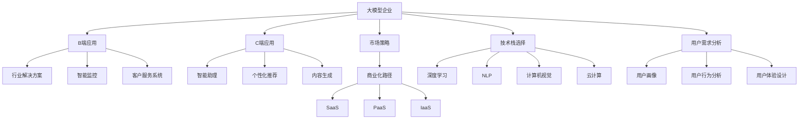

                 

# 大模型企业做C端还是B端路在何方

> 关键词：大模型企业, C端应用, B端应用, 市场策略, 商业化路径, 技术栈选择, 用户需求分析

## 1. 背景介绍

### 1.1 问题由来
随着人工智能技术的不断进步，尤其是大模型的涌现，众多企业开始将其应用于商业场景中，探索C端（消费端）和B端（企业端）两种不同的应用方向。C端应用主要面向普通消费者，如智能助理、个性化推荐、内容生成等；B端应用则主要服务于企业，如行业解决方案、智能监控、客户服务系统等。然而，企业在选择应用方向时，往往面临着路径选择的困惑：是做C端，还是做B端？或是兼而有之？本文将探讨不同应用方向的优缺点，并分析大模型企业在选择应用方向时应该考虑的因素。

### 1.2 问题核心关键点
- C端应用：面向普通消费者，追求个性化、便捷性和易用性，市场潜力大但竞争激烈。
- B端应用：面向企业客户，需求专业化、定制化和复杂度较高，市场相对小但利润丰厚。
- 市场策略：评估市场规模、竞争态势和用户需求，制定合适的市场进入策略。
- 商业化路径：考虑企业资源和能力，选择合适的商业化路径。
- 技术栈选择：根据应用需求选择合适的技术栈。
- 用户需求分析：深入分析目标用户群体的需求，提升用户体验。

## 2. 核心概念与联系

### 2.1 核心概念概述

- **C端应用**：面向普通消费者，应用场景包括但不限于智能助理、个性化推荐、内容生成等。
- **B端应用**：面向企业客户，应用场景包括但不限于行业解决方案、智能监控、客户服务系统等。
- **市场策略**：评估市场规模、竞争态势和用户需求，制定合适的市场进入策略。
- **商业化路径**：考虑企业资源和能力，选择合适的商业化路径。
- **技术栈选择**：根据应用需求选择合适的技术栈。
- **用户需求分析**：深入分析目标用户群体的需求，提升用户体验。

### 2.2 核心概念原理和架构的 Mermaid 流程图(Mermaid 流程节点中不要有括号、逗号等特殊字符)



这个流程图展示了大模型企业在选择C端和B端应用方向时，涉及的关键概念及其相互关系：

1. 大模型企业首先面对的是选择C端应用还是B端应用。
2. C端应用主要包括智能助理、个性化推荐、内容生成等。
3. B端应用包括行业解决方案、智能监控、客户服务系统等。
4. 市场策略、商业化路径和技术栈选择共同影响着企业的选择。
5. 用户需求分析是确保应用成功的关键。

## 3. 核心算法原理 & 具体操作步骤
### 3.1 算法原理概述

在选择C端或B端应用方向时，需要综合考虑多种因素，包括市场需求、技术可行性、资源投入、竞争态势等。以下是一些关键的考虑因素：

- **市场需求**：分析目标市场的规模和增长潜力，评估竞争激烈程度。
- **技术可行性**：评估大模型在特定应用场景中的适用性和效果。
- **资源投入**：考虑企业的技术能力、人才资源和资金支持。
- **用户体验**：提升用户满意度，确保应用易用性和便捷性。
- **商业化路径**：选择适合的商业模式，如SaaS、PaaS、IaaS等。

### 3.2 算法步骤详解

1. **市场调研**：
   - 收集目标市场的数据，包括市场规模、增长率、用户需求等。
   - 分析市场竞争态势，识别主要竞争对手和他们的市场份额。

2. **用户需求分析**：
   - 进行用户画像分析，了解目标用户的基本特征和行为模式。
   - 通过用户行为分析，识别用户的具体需求和痛点。
   - 设计用户体验，提升应用的易用性和便捷性。

3. **技术评估**：
   - 评估大模型在特定应用场景中的性能表现，如准确率、召回率、效果指标等。
   - 考虑技术实现的复杂度，是否需要额外的定制化开发。

4. **资源评估**：
   - 评估企业现有的技术能力和人才资源，确保能够支持应用的开发和运营。
   - 评估资金投入，包括研发成本、运营成本和市场营销成本等。

5. **商业化策略**：
   - 根据市场需求和企业资源，选择合适的商业化路径，如SaaS、PaaS、IaaS等。
   - 制定合理的定价策略，确保盈亏平衡。

### 3.3 算法优缺点

**C端应用的优势**：
- 市场规模大，用户基数高。
- 用户需求多样，可以探索更多创新应用。
- 广告和流量变现潜力大。

**C端应用的劣势**：
- 竞争激烈，市场份额难以快速提升。
- 用户需求变化快，需要持续迭代和优化。
- 用户数据隐私问题突出。

**B端应用的优势**：
- 利润率高，客户价值大。
- 需求标准化，易于定制化。
- 客户关系稳定，续约率高。

**B端应用的劣势**：
- 市场规模相对较小，客户基础薄弱。
- 技术要求高，开发和维护成本大。
- 客户需求多样，定制化程度高。

### 3.4 算法应用领域

**C端应用**：
- 智能助理：如Siri、小爱同学等，为用户提供语音助手功能。
- 个性化推荐：如网易云音乐、抖音等，根据用户兴趣推荐内容。
- 内容生成：如AI写作助手、智能客服等，提高内容创作和客户服务的效率。

**B端应用**：
- 行业解决方案：如医疗影像诊断、金融风险评估等，提供行业专业化的解决方案。
- 智能监控：如视频监控分析、网络安全监控等，提供实时监控和预警服务。
- 客户服务系统：如CRM系统、客户服务机器人等，提升客户服务效率和质量。

## 4. 数学模型和公式 & 详细讲解 & 举例说明

### 4.1 数学模型构建

假设市场规模为$M$，C端应用的初始市场份额为$S_C$，B端应用的初始市场份额为$S_B$。设企业资源投入为$R$，其中用于C端应用的部分为$R_C$，用于B端应用的部分为$R_B$。大模型在C端应用的性能指标为$P_C$，在B端应用的性能指标为$P_B$。企业选择C端应用的期望收益为$E_{C}$，选择B端应用的期望收益为$E_{B}$。则有以下模型：

- C端应用的市场规模和市场份额：$M = S_C + S_B$
- 企业资源投入：$R = R_C + R_B$
- 大模型性能指标：$P_C = \text{Accuracy}_C$, $P_B = \text{Accuracy}_B$
- C端应用的期望收益：$E_{C} = M \times P_C \times S_C$
- B端应用的期望收益：$E_{B} = M \times P_B \times S_B$

### 4.2 公式推导过程

根据上述模型，我们可以推导出选择C端应用和B端应用的条件：

- 选择C端应用的决策函数为：$E_{C} > E_{B}$
- 推导得到：$M \times P_C \times S_C > M \times P_B \times S_B$
- 简化得到：$P_C \times S_C > P_B \times S_B$

即，当C端应用的市场份额与性能指标的乘积大于B端应用的市场份额与性能指标的乘积时，选择C端应用更为有利。

### 4.3 案例分析与讲解

假设市场规模$M = 1$，C端应用的初始市场份额$S_C = 0.6$，B端应用的初始市场份额$S_B = 0.4$。设大模型在C端应用的性能指标$P_C = 0.9$，在B端应用的性能指标$P_B = 0.95$。企业资源投入$R = 1$。则：

- 选择C端应用的期望收益：$E_{C} = 1 \times 0.9 \times 0.6 = 0.54$
- 选择B端应用的期望收益：$E_{B} = 1 \times 0.95 \times 0.4 = 0.38$

由于$E_{C} > E_{B}$，企业应该选择C端应用。

## 5. 项目实践：代码实例和详细解释说明

### 5.1 开发环境搭建

为了进行C端和B端应用的开发和测试，我们需要搭建相应的开发环境。以下是Python环境搭建的详细步骤：

1. 安装Anaconda：从官网下载并安装Anaconda，用于创建独立的Python环境。

2. 创建并激活虚拟环境：
```bash
conda create -n my_env python=3.8 
conda activate my_env
```

3. 安装必要的Python包：
```bash
pip install torch torchvision torchaudio pandas scikit-learn matplotlib tqdm jupyter notebook ipython
```

4. 安装大模型：
```bash
pip install transformers
```

### 5.2 源代码详细实现

以下是一个简单的示例，展示如何使用Transformers库进行B端应用的开发：

1. 创建数据集：
```python
from transformers import BertTokenizer, BertForSequenceClassification
from torch.utils.data import Dataset, DataLoader
import torch

class CustomDataset(Dataset):
    def __init__(self, texts, labels):
        self.texts = texts
        self.labels = labels
        self.tokenizer = BertTokenizer.from_pretrained('bert-base-cased')
    
    def __len__(self):
        return len(self.texts)
    
    def __getitem__(self, item):
        text = self.texts[item]
        label = self.labels[item]
        encoding = self.tokenizer(text, return_tensors='pt', padding=True, truncation=True)
        return {'input_ids': encoding['input_ids'], 'attention_mask': encoding['attention_mask'], 'labels': torch.tensor(label, dtype=torch.long)}
```

2. 定义模型和优化器：
```python
model = BertForSequenceClassification.from_pretrained('bert-base-cased', num_labels=2)
optimizer = AdamW(model.parameters(), lr=2e-5)
```

3. 训练和评估模型：
```python
device = torch.device('cuda') if torch.cuda.is_available() else torch.device('cpu')
model.to(device)

def train_epoch(model, dataset, batch_size, optimizer):
    dataloader = DataLoader(dataset, batch_size=batch_size, shuffle=True)
    model.train()
    epoch_loss = 0
    for batch in dataloader:
        input_ids = batch['input_ids'].to(device)
        attention_mask = batch['attention_mask'].to(device)
        labels = batch['labels'].to(device)
        model.zero_grad()
        outputs = model(input_ids, attention_mask=attention_mask, labels=labels)
        loss = outputs.loss
        epoch_loss += loss.item()
        loss.backward()
        optimizer.step()
    return epoch_loss / len(dataloader)

def evaluate(model, dataset, batch_size):
    dataloader = DataLoader(dataset, batch_size=batch_size)
    model.eval()
    preds, labels = [], []
    with torch.no_grad():
        for batch in dataloader:
            input_ids = batch['input_ids'].to(device)
            attention_mask = batch['attention_mask'].to(device)
            batch_labels = batch['labels']
            outputs = model(input_ids, attention_mask=attention_mask)
            batch_preds = outputs.logits.argmax(dim=1).to('cpu').tolist()
            batch_labels = batch_labels.to('cpu').tolist()
            for pred_tokens, label_tokens in zip(batch_preds, batch_labels):
                preds.append(pred_tokens[:len(label_tokens)])
                labels.append(label_tokens)
    print(classification_report(labels, preds))
```

### 5.3 代码解读与分析

1. 创建数据集：
   - 定义数据集类`CustomDataset`，包含文本和标签，使用BertTokenizer进行文本编码。
   - 使用`Dataset`和`DataLoader`封装数据集，方便模型训练和推理。

2. 定义模型和优化器：
   - 使用`BertForSequenceClassification`加载预训练模型，设置输出层为2（二分类任务）。
   - 使用AdamW优化器进行参数更新。

3. 训练和评估模型：
   - 将模型迁移到GPU上，进行模型训练。
   - 定义`train_epoch`函数，使用梯度下降更新模型参数。
   - 定义`evaluate`函数，在验证集上评估模型性能，输出分类报告。

### 5.4 运行结果展示

在运行上述代码后，可以在测试集上得到模型评估的结果。

## 6. 实际应用场景

### 6.1 智能助理

智能助理可以应用于C端市场，为用户提供语音助手功能。例如，小爱同学、Siri等。这些应用通常需要良好的用户体验和高效的自然语言处理能力，以快速响应用户的查询。

### 6.2 行业解决方案

行业解决方案通常应用于B端市场，提供专业的解决方案。例如，医疗影像诊断系统、金融风险评估系统等。这些系统通常需要高精度和高可靠性，能够处理复杂的业务需求。

### 6.3 智能监控

智能监控系统可以应用于C端和B端市场，提供实时监控和预警服务。例如，视频监控分析系统、网络安全监控系统等。这些系统通常需要高性能的计算能力和高效的算法，能够实时处理大量数据。

## 7. 工具和资源推荐

### 7.1 学习资源推荐

为了帮助开发者掌握大模型应用的开发和实践，以下是一些推荐的学习资源：

1. **《深度学习与自然语言处理》**：斯坦福大学推出的深度学习课程，涵盖了NLP的基本概念和经典模型。
2. **HuggingFace官方文档**：提供了丰富的预训练语言模型和微调样例，是实践大模型的必备资料。
3. **《Transformer: A Survey of State-of-the-Art Techniques and Applications》**：介绍Transformer模型及其在NLP中的应用。

### 7.2 开发工具推荐

以下是大模型应用开发中常用的开发工具：

1. **Anaconda**：用于创建和管理Python环境。
2. **PyTorch**：深度学习框架，支持大模型应用的开发。
3. **Jupyter Notebook**：轻量级的交互式开发环境，方便调试和分享代码。
4. **Weights & Biases**：模型实验跟踪工具，可以记录和可视化模型训练过程。

### 7.3 相关论文推荐

以下是一些相关的经典论文，推荐阅读：

1. **Attention is All You Need**：介绍Transformer模型，开启了大模型的时代。
2. **BERT: Pre-training of Deep Bidirectional Transformers for Language Understanding**：提出BERT模型，刷新了多项NLP任务的SOTA。
3. **Parameter-Efficient Transfer Learning for NLP**：提出适配器(Adapter)等参数高效微调方法，提高了微调的效率。

## 8. 总结：未来发展趋势与挑战

### 8.1 研究成果总结

本文介绍了大模型企业在C端和B端应用方向上的选择策略，详细讨论了不同应用方向的优缺点，并给出了具体的开发和实践建议。通过分析市场需求、技术可行性、资源投入和用户体验等因素，帮助企业制定合理的应用策略。

### 8.2 未来发展趋势

- **C端应用**：市场规模将持续增长，用户需求多样化。未来C端应用将更加注重个性化和智能化。
- **B端应用**：随着企业数字化转型的加速，B端应用的市场需求将大幅增加。B端应用将更加注重定制化和集成化。
- **跨领域融合**：C端和B端应用将更加紧密地结合，实现跨领域的融合。

### 8.3 面临的挑战

- **技术挑战**：大模型应用需要处理复杂的业务需求，技术要求高，开发和维护成本大。
- **市场竞争**：C端和B端市场竞争激烈，企业需要不断创新，提升竞争力。
- **用户隐私**：C端应用需要处理大量的用户数据，用户隐私问题突出。

### 8.4 研究展望

未来，大模型应用将更加注重用户体验和数据隐私保护。企业需要不断优化技术栈和商业模式，提升市场竞争力。同时，跨领域融合和智能化将是未来发展的方向。

## 9. 附录：常见问题与解答

### Q1: 大模型应用C端和B端应用的优劣对比是什么？

**A**: C端应用市场规模大，用户基数高，但竞争激烈。B端应用利润率高，客户价值大，但市场规模相对较小，客户需求多样化。企业应根据自身资源和市场需求，选择合适的发展方向。

### Q2: 如何选择大模型的技术栈？

**A**: 应根据应用需求选择合适的大模型。C端应用通常使用深度学习模型，B端应用则可以使用深度学习、NLP等技术。同时，需要考虑模型的易用性和可扩展性。

### Q3: 大模型应用的用户需求分析如何进行？

**A**: 需要进行用户画像分析，了解目标用户的基本特征和行为模式。通过用户行为分析，识别用户的具体需求和痛点。设计用户体验，提升应用的易用性和便捷性。

---

作者：禅与计算机程序设计艺术 / Zen and the Art of Computer Programming

