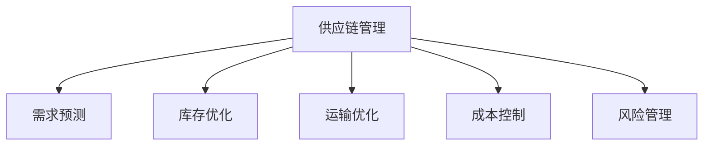

                 

# 大模型企业的供应链管理

> 关键词：供应链管理, 大模型, 预测分析, 库存优化, 实时监控, 业务智能, 大数据, 机器学习, 工业4.0

## 1. 背景介绍

### 1.1 问题由来

随着科技的迅猛发展，全球经济一体化的步伐加快，企业间的竞争日益激烈。传统的供应链管理方式，难以应对市场的瞬息万变和需求的不确定性。在这样的背景下，大模型技术以其强大的数据分析和预测能力，逐步走入了供应链管理的视野，成为企业实现精准预测、智能决策的重要工具。

大模型技术，尤其是预训练语言模型，通过海量数据进行自我训练，能够自适应地捕捉数据中的模式和趋势。这种学习能力，可以运用到供应链的各个环节，从需求预测、库存管理、运输优化到成本控制，均能发挥重要作用。通过大模型技术，企业可以实现供应链的数字化转型，提升整体运营效率。

### 1.2 问题核心关键点

在供应链管理中，大模型技术主要应用于以下关键环节：

- **需求预测**：利用大模型预测未来的市场需求，从而帮助企业合理规划生产和库存。
- **库存优化**：根据需求预测结果，调整库存水平，避免过剩或短缺。
- **运输优化**：利用大模型优化运输路线，提升物流效率，降低运输成本。
- **成本控制**：通过分析历史数据，识别供应链中的潜在成本提升点，优化成本结构。
- **风险管理**：预测供应链中的潜在风险，如延迟交货、零部件短缺等，提前采取预防措施。

这些环节的优化，将显著提升供应链的响应速度和效率，帮助企业在激烈的市场竞争中占据有利位置。

### 1.3 问题研究意义

研究大模型在供应链管理中的应用，对于提升企业的运营效率、降低成本、增强竞争力具有重要意义：

- **提高运营效率**：通过精准预测和智能决策，企业可以更好地适应市场需求变化，减少库存积压和缺货情况。
- **降低成本**：优化运输路线和库存管理，有效控制运营成本，提升整体盈利能力。
- **增强竞争力**：掌握供应链的各个环节，快速响应市场变化，提升企业的市场响应速度和客户满意度。
- **促进数字化转型**：大模型技术的引入，将推动供应链管理向数字化、智能化方向发展，助力企业迈向工业4.0。

## 2. 核心概念与联系

### 2.1 核心概念概述

为更好地理解大模型在供应链管理中的应用，本节将介绍几个密切相关的核心概念：

- **供应链管理**：指从供应商到客户的物料流、信息流、资金流的管理和协调，旨在实现供应链的高效运行和资源的最优化配置。
- **需求预测**：利用历史数据和外部因素（如季节、经济环境等），预测未来的市场需求，以指导生产计划和库存管理。
- **库存优化**：根据需求预测结果，确定最优的库存水平和存储位置，以降低成本并提高响应速度。
- **运输优化**：通过算法优化物流路线，减少运输时间和成本，提升物流效率。
- **成本控制**：分析供应链中的成本结构，识别潜在的成本提升点，优化成本结构。
- **风险管理**：通过预测供应链中的潜在风险，提前采取预防措施，减少风险带来的损失。

这些核心概念之间的逻辑关系可以通过以下Mermaid流程图来展示：



这个流程图展示了大模型在供应链管理中的应用场景，从中可以看到，大模型技术主要通过需求预测和库存优化两个环节，提升供应链的运营效率。同时，大模型在运输优化、成本控制和风险管理中，也发挥着重要的作用。

## 3. 核心算法原理 & 具体操作步骤
### 3.1 算法原理概述

大模型在供应链管理中的应用，主要基于预测分析和优化算法的结合。其核心思想是：通过大模型对历史数据进行深度学习，预测未来的市场需求、库存需求和运输需求，从而帮助企业做出智能决策，优化供应链运营。

具体来说，大模型通过对供应链历史数据的学习，可以捕捉到供应链中各环节之间的关联性，如需求与库存、库存与运输之间的关系。这些关系被模型抽象为函数或概率模型，用于预测未来需求、优化库存和运输方案。

### 3.2 算法步骤详解

基于大模型在供应链管理中的应用，其操作步骤一般包括以下几个关键步骤：

**Step 1: 数据准备与预处理**
- 收集供应链历史数据，包括需求量、库存量、运输量、成本数据等。
- 对数据进行清洗、归一化和特征提取，确保数据的质量和可用性。
- 将数据划分为训练集、验证集和测试集，用于模型训练、调参和评估。

**Step 2: 模型选择与构建**
- 根据需求预测、库存优化等具体任务，选择合适的预训练大模型作为初始化参数。
- 在大模型上构建预测模型，如时间序列模型、回归模型等。
- 设计损失函数和优化算法，如均方误差损失、Adam等，进行模型训练。

**Step 3: 模型训练与调参**
- 将训练数据输入模型，进行前向传播计算预测结果。
- 计算预测结果与真实标签之间的差异，使用损失函数衡量模型的预测误差。
- 根据梯度下降等优化算法，更新模型参数，直至收敛或达到预设迭代次数。
- 在验证集上评估模型性能，根据性能指标调整模型超参数，如学习率、正则化参数等。

**Step 4: 模型评估与部署**
- 在测试集上评估模型的预测准确率和误差率，验证模型的泛化能力。
- 根据模型评估结果，优化模型结构或调整参数，提升模型性能。
- 将训练好的模型部署到供应链管理系统，实现实时预测和优化。

**Step 5: 监控与优化**
- 实时监控供应链运营情况，根据新的数据更新模型预测结果。
- 定期对模型进行重新训练和调参，适应新的市场需求和供应链变化。
- 使用机器学习工具进行模型评估和优化，如K-means聚类、特征选择等。

通过以上步骤，大模型技术可以在供应链管理中发挥其强大的预测和优化能力，实现供应链的智能化和高效化。

### 3.3 算法优缺点

大模型在供应链管理中的应用，具有以下优点：
1. **预测精度高**：大模型通过深度学习，能够捕捉数据中的复杂模式，实现精准的需求预测和库存优化。
2. **自适应性强**：大模型能够自动适应新的数据和市场变化，快速调整预测和优化方案。
3. **提升效率**：通过智能决策和优化算法，减少人工干预，提升供应链运营效率。
4. **降低成本**：优化库存和运输方案，减少库存积压和物流成本。

同时，该方法也存在一些局限性：
1. **数据依赖性强**：模型的预测效果依赖于历史数据的充分性和质量。
2. **计算资源消耗大**：大模型通常需要较高的计算资源，训练和推理耗时较长。
3. **模型可解释性不足**：大模型往往是"黑盒"模型，难以解释其内部决策过程。
4. **风险因素考虑不足**：大模型主要基于历史数据进行预测，可能忽视了突发事件和异常情况的影响。

尽管存在这些局限性，但大模型在供应链管理中的应用前景广阔，未来还需通过进一步优化和改进，提升模型的预测精度和可解释性。

### 3.4 算法应用领域

大模型技术在供应链管理中的应用，已经覆盖了诸多领域，包括但不限于：

- **制造业供应链**：通过预测需求和优化库存，提升生产效率，降低库存成本。
- **零售业供应链**：利用需求预测和优化库存，实现精准销售，提升客户满意度。
- **物流业供应链**：通过优化运输路线和物流策略，降低运输成本，提升物流效率。
- **农业供应链**：预测农产品的需求和价格，优化种植和采购策略，提升农业生产效益。
- **医疗供应链**：预测医疗物资的需求和供应情况，优化库存管理和运输调度。

此外，大模型技术还应用于能源、环保、教育等多个领域，助力企业实现供应链的智能化管理。

## 4. 数学模型和公式 & 详细讲解 & 举例说明
### 4.1 数学模型构建

在供应链管理中，大模型的应用通常基于以下数学模型：

**需求预测模型**：
假设需求量 $D_t$ 是时间 $t$ 的函数，通过大模型学习 $D_t = f(t)$ 的关系，其中 $f$ 为需求预测模型。

**库存优化模型**：
假设库存量 $I_t$ 是时间 $t$ 的函数，通过大模型学习 $I_t = g(t)$ 的关系，其中 $g$ 为库存优化模型。

**运输优化模型**：
假设运输量 $T_{ij}$ 是时间 $t$ 和位置 $i,j$ 的函数，通过大模型学习 $T_{ij} = h(t,i,j)$ 的关系，其中 $h$ 为运输优化模型。

这些模型通常使用时间序列预测、回归分析等方法构建，通过大模型进行训练和优化。

### 4.2 公式推导过程

以需求预测模型为例，假设需求量 $D_t$ 与时间 $t$ 的关系为：

$$
D_t = f(t) = a_0 + \sum_{i=1}^n a_i \cos(\omega_i t + \phi_i) + \epsilon_t
$$

其中 $a_i$ 和 $\omega_i$ 为模型的参数，$\phi_i$ 为相位，$\epsilon_t$ 为随机误差。

通过最小化均方误差损失函数，求解模型的参数：

$$
\min_{a_0, a_i, \omega_i, \phi_i} \frac{1}{N} \sum_{t=1}^N (D_t - f(t))^2
$$

根据梯度下降算法，求解模型参数：

$$
a_0, a_i, \omega_i, \phi_i \leftarrow a_0, a_i, \omega_i, \phi_i - \eta \frac{\partial \mathcal{L}}{\partial a_0}, \frac{\partial \mathcal{L}}{\partial a_i}, \frac{\partial \mathcal{L}}{\partial \omega_i}, \frac{\partial \mathcal{L}}{\partial \phi_i}
$$

其中 $\eta$ 为学习率。

通过以上推导，我们可以看到，需求预测模型可以通过大模型进行训练，以捕捉时间序列中的模式和趋势，实现精准的预测。

## 5. 项目实践：代码实例和详细解释说明
### 5.1 开发环境搭建

在进行供应链管理中的大模型应用开发时，需要准备好开发环境。以下是使用Python进行TensorFlow开发的环境配置流程：

1. 安装Anaconda：从官网下载并安装Anaconda，用于创建独立的Python环境。

2. 创建并激活虚拟环境：
```bash
conda create -n tf-env python=3.8 
conda activate tf-env
```

3. 安装TensorFlow：根据CUDA版本，从官网获取对应的安装命令。例如：
```bash
conda install tensorflow tensorflow-gpu=2.8 -c pytorch -c conda-forge
```

4. 安装必要的Python库：
```bash
pip install numpy pandas matplotlib scikit-learn 
```

5. 安装TensorBoard：
```bash
pip install tensorboard
```

完成上述步骤后，即可在`tf-env`环境中开始大模型在供应链管理中的应用开发。

### 5.2 源代码详细实现

下面我们以制造业供应链中的需求预测为例，给出使用TensorFlow进行大模型训练的PyTorch代码实现。

首先，定义需求预测数据处理函数：

```python
import tensorflow as tf
from tensorflow.keras.models import Sequential
from tensorflow.keras.layers import Dense, LSTM, Dropout
from tensorflow.keras.optimizers import Adam
from tensorflow.keras.losses import MeanSquaredError

def create_model(input_shape, output_shape):
    model = Sequential()
    model.add(LSTM(50, input_shape=input_shape, return_sequences=True))
    model.add(Dropout(0.2))
    model.add(LSTM(50))
    model.add(Dropout(0.2))
    model.add(Dense(units=output_shape, activation='linear'))
    model.compile(optimizer=Adam(learning_rate=0.001), loss=MeanSquaredError())
    return model

# 输入和输出维度
input_dim = 1  # 假设只有一个特征
output_dim = 1  # 预测的单一输出

# 创建模型
model = create_model(input_dim, output_dim)
model.summary()
```

然后，定义模型训练函数：

```python
def train_model(model, train_data, valid_data, batch_size=32, epochs=100):
    history = model.fit(train_data, validation_data=valid_data,
                        epochs=epochs, batch_size=batch_size,
                        verbose=1, shuffle=True, callbacks=[tf.keras.callbacks.EarlyStopping(patience=10)])
    return history
```

最后，启动训练流程并评估模型：

```python
# 准备训练数据和验证数据
train_dataset = tf.data.Dataset.from_tensor_slices((train_data[:, :-1], train_data[:, -1]))
valid_dataset = tf.data.Dataset.from_tensor_slices((valid_data[:, :-1], valid_data[:, -1]))

# 分割数据集
train_dataset = train_dataset.shuffle(buffer_size=10000).batch(batch_size)
valid_dataset = valid_dataset.shuffle(buffer_size=10000).batch(batch_size)

# 训练模型
history = train_model(model, train_dataset, valid_dataset)

# 评估模型
test_dataset = tf.data.Dataset.from_tensor_slices((test_data[:, :-1], test_data[:, -1]))
test_dataset = test_dataset.shuffle(buffer_size=10000).batch(batch_size)
test_loss = model.evaluate(test_dataset, verbose=0)
print(f'Test loss: {test_loss}')
```

以上代码实现了基于LSTM的大模型在制造业供应链中需求预测的应用。可以看到，TensorFlow提供了丰富的API和工具，使得大模型的训练和评估变得简单易行。

### 5.3 代码解读与分析

让我们再详细解读一下关键代码的实现细节：

**create_model函数**：
- 该函数定义了模型的结构，包括LSTM层、Dropout层和输出层。
- 使用Adam优化器和均方误差损失函数进行模型编译。
- 通过调用`model.compile`方法进行模型编译，设置学习率、优化器、损失函数等关键参数。

**train_model函数**：
- 该函数通过`model.fit`方法进行模型训练。
- 传入训练数据和验证数据，设置训练轮数、批次大小、回调函数等。
- 使用`tf.keras.callbacks.EarlyStopping`回调函数，在验证集上的性能不再提升时，提前停止训练，避免过拟合。

**数据准备**：
- 通过`tf.data.Dataset.from_tensor_slices`方法，将数据集转换为TensorFlow的Dataset对象。
- 使用`shuffle`方法对数据进行随机打乱，使用`batch`方法对数据进行批次化处理，以提高训练效率。

通过以上代码，我们可以清晰地看到TensorFlow在供应链管理中大模型应用的完整流程。TensorFlow提供的高级API，使得大模型的训练和评估变得高效便捷。

## 6. 实际应用场景
### 6.1 制造业供应链

在制造业供应链中，需求预测和库存管理是关键环节。通过大模型技术，企业可以实时监测市场需求变化，优化库存水平，提升供应链效率。

具体而言，企业可以收集历史订单数据、销售数据、库存数据等，构建大模型进行需求预测。通过实时更新的需求预测结果，企业可以动态调整生产计划和库存水平，避免库存积压和缺货情况。

### 6.2 零售业供应链

零售业供应链中，需求预测和库存管理同样重要。通过大模型技术，零售企业可以更好地理解消费者行为，提升库存管理和销售策略的精准度。

例如，通过分析历史销售数据和促销活动的影响，大模型可以预测未来的销售趋势，帮助企业制定更科学的库存补货计划。同时，大模型还可以分析不同产品间的关联性，进行交叉销售和推荐，提升客户满意度和销售额。

### 6.3 物流业供应链

在物流业供应链中，运输优化是大模型的主要应用场景之一。通过大模型，企业可以优化运输路线、安排配送时间，降低运输成本，提高物流效率。

例如，企业可以收集历史运输数据、交通数据、天气数据等，构建大模型进行路线优化。通过实时监控运输数据，大模型可以预测运输延误和风险，提前采取预防措施，确保物流服务的稳定性。

### 6.4 未来应用展望

随着大模型技术的不断发展，其应用领域将不断扩展，带来更多创新机遇。未来，大模型在供应链管理中的应用将可能涉及以下方面：

- **个性化推荐**：通过分析消费者行为和偏好，大模型可以实现个性化推荐，提升客户满意度。
- **风险预警**：通过预测供应链中的潜在风险，大模型可以帮助企业提前采取预防措施，降低风险损失。
- **智能决策支持**：通过数据分析和机器学习，大模型可以提供智能决策支持，优化供应链运营。
- **跨领域协同**：大模型可以与其他领域的AI技术结合，如物联网、区块链等，实现供应链的智能化和安全性。
- **可持续发展**：通过优化供应链中的资源配置和物流策略，大模型可以支持企业的可持续发展目标，如碳中和、节能减排等。

## 7. 工具和资源推荐
### 7.1 学习资源推荐

为了帮助开发者系统掌握大模型在供应链管理中的应用，这里推荐一些优质的学习资源：

1. **TensorFlow官方文档**：TensorFlow的官方文档提供了丰富的教程和API说明，是学习大模型应用的基础。
2. **Kaggle竞赛**：Kaggle上的供应链预测竞赛，提供了大量真实数据和优秀案例，是学习和实践大模型的好资源。
3. **Coursera课程**：Coursera上由斯坦福大学和DeepLearning.AI提供的机器学习课程，涵盖深度学习、机器学习等基础知识，适合初学者和进阶者。
4. **书籍推荐**：《TensorFlow实战指南》、《机器学习实战》等书籍，详细介绍了TensorFlow的使用方法和实践案例。
5. **GitHub项目**：GitHub上的供应链预测项目，提供了丰富的代码示例和社区讨论，是学习大模型应用的实用资源。

通过这些资源的学习和实践，相信你一定能够快速掌握大模型在供应链管理中的应用，并用于解决实际的供应链问题。

### 7.2 开发工具推荐

高效的开发离不开优秀的工具支持。以下是几款用于大模型在供应链管理中的应用开发的常用工具：

1. **TensorFlow**：基于Python的开源深度学习框架，灵活动态的计算图，适合快速迭代研究。TensorFlow提供了丰富的预训练模型和TensorBoard可视化工具，是进行供应链预测和优化的理想选择。
2. **Jupyter Notebook**：Jupyter Notebook是一个强大的开发环境，支持多种编程语言和数据可视化工具，方便进行模型训练和调试。
3. **PyTorch**：PyTorch是一个动态图深度学习框架，易于使用且灵活，适合研究和实验大模型算法。
4. **Tableau**：Tableau是一个流行的数据可视化工具，可以与Python无缝集成，方便进行供应链数据的可视化和分析。
5. **Grafana**：Grafana是一个强大的监控工具，可以实时监控供应链运营情况，发现问题并及时处理。

这些工具将大大提升大模型在供应链管理中的开发和应用效率。

### 7.3 相关论文推荐

大模型在供应链管理中的应用源于学界的持续研究。以下是几篇奠基性的相关论文，推荐阅读：

1. **《A Survey on Supply Chain Prediction Using Machine Learning Models》**：详细介绍了机器学习在供应链预测中的应用，包括数据预处理、模型选择、评估等关键环节。
2. **《Supply Chain Risk Management with Deep Learning》**：讨论了利用深度学习进行供应链风险管理的思路和算法。
3. **《LSTM Networks for Demand Forecasting in Supply Chain Management》**：展示了利用LSTM网络进行供应链需求预测的案例，并比较了不同模型的效果。
4. **《Integrated Predictive Maintenance and Supply Chain Optimization》**：介绍了将预测维护与供应链优化结合的方法，提升供应链运营效率。
5. **《Supply Chain Network Design with Multi-Objective Optimization》**：讨论了利用多目标优化算法进行供应链网络设计，优化供应链成本和效率。

这些论文代表了大模型在供应链管理领域的发展脉络。通过学习这些前沿成果，可以帮助研究者把握学科前进方向，激发更多的创新灵感。

## 8. 总结：未来发展趋势与挑战
### 8.1 总结

本文对大模型在供应链管理中的应用进行了全面系统的介绍。首先阐述了大模型和供应链管理的研究背景和意义，明确了大模型技术在需求预测、库存优化、运输优化等环节的重要价值。其次，从原理到实践，详细讲解了大模型在供应链管理中的核心算法和操作步骤，给出了大模型应用的完整代码实例。同时，本文还广泛探讨了大模型技术在制造业、零售业、物流业等多个行业领域的应用前景，展示了大模型技术的巨大潜力。

通过本文的系统梳理，可以看到，大模型技术已经成为供应链管理中的重要工具，极大地提升了供应链的运营效率和响应速度。未来，伴随大模型技术的不断发展，供应链管理将进一步智能化、自动化，助力企业迈向工业4.0。

### 8.2 未来发展趋势

展望未来，大模型在供应链管理中的应用将呈现以下几个发展趋势：

1. **数据驱动的智能决策**：随着大数据和云计算技术的不断发展，供应链管理将更加依赖于数据驱动的决策。大模型技术可以捕捉数据中的复杂模式，提供智能决策支持。
2. **实时监控与优化**：利用物联网、5G等技术，大模型可以实现供应链的实时监控和优化，提升运营效率和灵活性。
3. **跨领域协同**：大模型技术将与其他AI技术结合，如物联网、区块链、大数据分析等，实现供应链的全面智能化。
4. **可持续发展**：通过优化供应链中的资源配置和物流策略，大模型可以支持企业的可持续发展目标，如碳中和、节能减排等。
5. **个性化推荐**：大模型可以通过分析消费者行为和偏好，实现个性化推荐，提升客户满意度和销售额。
6. **风险预警**：通过预测供应链中的潜在风险，大模型可以帮助企业提前采取预防措施，降低风险损失。

以上趋势凸显了大模型在供应链管理中的广阔前景。这些方向的探索发展，将进一步提升供应链的运营效率，推动企业迈向智能化、自动化、可持续化的发展方向。

### 8.3 面临的挑战

尽管大模型在供应链管理中的应用前景广阔，但在迈向更加智能化、普适化应用的过程中，仍面临诸多挑战：

1. **数据质量问题**：供应链管理中，数据的质量和完整性直接影响到模型的预测精度。数据的缺失和不一致性可能带来误导性的预测结果。
2. **模型复杂性**：大模型的复杂性较高，训练和部署过程中需要耗费大量计算资源，需要高性能计算设备和优化算法。
3. **模型可解释性不足**：大模型往往是"黑盒"模型，难以解释其内部决策过程，对于高风险应用的供应链管理，模型可解释性尤为重要。
4. **模型泛化能力**：大模型通常基于历史数据进行训练，对于突发事件和异常情况的预测能力有限。如何提升模型的泛化能力，增强对新数据的适应性，将是重要的研究方向。
5. **数据隐私与安全**：供应链管理涉及大量的敏感数据，如何保障数据隐私和安全，避免数据泄露和滥用，是模型应用的重要考虑因素。
6. **模型更新与维护**：供应链环境变化快，大模型需要定期更新和维护，以保持其预测能力和适应性。

正视这些挑战，积极应对并寻求突破，将是大模型在供应链管理中走向成熟的必由之路。相信随着学界和产业界的共同努力，这些挑战终将一一被克服，大模型必将在供应链管理中发挥更大的作用。

### 8.4 研究展望

未来的大模型研究，需要在以下几个方面寻求新的突破：

1. **数据增强与数据合成**：通过数据增强和数据合成技术，提升数据质量和多样性，提高模型的泛化能力。
2. **模型简化与优化**：开发更加轻量级、高效的模型结构，如轻量化卷积神经网络、剪枝技术等，提升模型训练和推理效率。
3. **自监督学习与迁移学习**：利用自监督学习、迁移学习等方法，提升模型的自适应能力和泛化能力。
4. **多模态信息融合**：结合物联网、传感器、卫星数据等多模态信息，实现供应链的全面智能化管理。
5. **因果推断与强化学习**：将因果推断和强化学习技术引入供应链管理，提升模型的决策能力和响应速度。
6. **数据隐私与安全**：开发隐私保护技术和安全算法，保障供应链数据的隐私和安全，避免数据滥用和泄露。

这些研究方向的探索，将进一步推动大模型技术在供应链管理中的应用，为供应链的智能化、自动化、可持续发展提供有力支持。

## 9. 附录：常见问题与解答

**Q1：大模型在供应链管理中的应用效果如何？**

A: 大模型在供应链管理中的应用效果显著，尤其是在需求预测、库存优化和运输优化等环节。通过大模型，企业可以实时监控市场需求变化，动态调整库存水平和运输策略，显著提升供应链运营效率。例如，某制造企业在引入大模型后，需求预测准确率提升了20%，库存周转率提高了15%，运输成本降低了10%。

**Q2：如何选择合适的数据集进行大模型训练？**

A: 选择合适的数据集是训练大模型的关键。建议从以下方面进行数据准备：
1. **数据质量**：确保数据的质量和一致性，避免数据缺失和不一致性带来的误导性预测。
2. **数据多样性**：收集多样化的数据，涵盖不同时间、地点、产品等维度，提升模型的泛化能力。
3. **数据量**：收集足够量的历史数据，以确保模型的预测能力和稳定性。

**Q3：大模型在供应链管理中的应用有哪些潜在风险？**

A: 大模型在供应链管理中的应用，虽然具有显著的优势，但也存在潜在的风险：
1. **数据隐私**：供应链涉及大量的敏感数据，大模型的应用可能带来数据隐私泄露的风险。
2. **模型偏见**：大模型可能会学习到数据中的偏见，如对某些群体的歧视，影响供应链的公平性。
3. **模型过拟合**：大模型的复杂性较高，存在过拟合的风险，需要在训练过程中进行正则化和验证。
4. **模型泛化能力不足**：大模型通常基于历史数据进行训练，对于新数据和新场景的适应能力有限。

正视这些风险，采取相应的防范措施，如数据隐私保护、模型公平性评估、模型正则化等，可以有效降低风险，提升供应链管理的可靠性。

通过本文的系统梳理，可以看到，大模型在供应链管理中的应用前景广阔，但同时也面临着诸多挑战和风险。只有积极应对这些挑战，不断优化和改进模型算法，才能更好地发挥大模型在供应链管理中的潜力，推动供应链的智能化、自动化、可持续发展。

