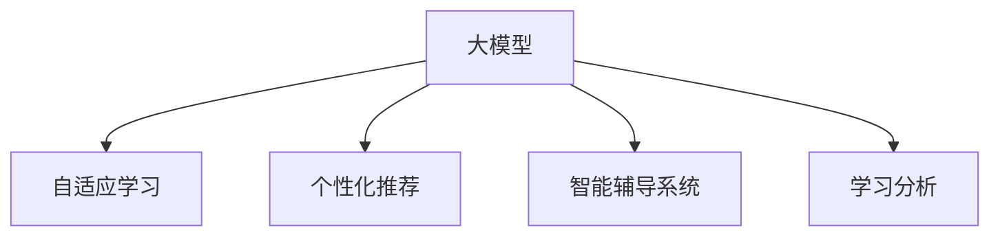

                 

# 大模型在教育领域的创新实践

> 关键词：大模型, 教育技术, 自适应学习, 个性化推荐, 智能辅导系统, 深度学习, 学习分析

## 1. 背景介绍

### 1.1 问题由来
教育行业历来是信息技术变革的前沿阵地，但由于其复杂性和个性化需求的特殊性，传统的教学模式在效率和效果上都面临挑战。随着大数据、人工智能等技术的发展，教育领域正在经历一场深刻的数字化转型，而大模型技术无疑是这场变革的强大助力。

大模型（如GPT-3、BERT等）在处理大规模无标签数据时展现了非凡的实力，通过自监督学习能够捕捉到数据中的潜在规律和知识结构。将大模型应用于教育领域，可以实现更高效、个性化的学习支持，满足不同学习者的多样化需求。

### 1.2 问题核心关键点
大模型在教育领域的创新实践，主要集中在以下几个方面：

- **自适应学习**：通过分析学习者的个性化特点和知识水平，实现动态调整教学内容和策略。
- **个性化推荐**：根据学习者的历史行为和兴趣偏好，推荐合适的学习资源和路径。
- **智能辅导系统**：利用大模型生成自然流畅的对话，提供即时反馈和解答，提升学习效果。
- **学习分析**：利用大模型的预测能力，对学习行为进行深度分析，为教师和家长提供决策支持。

### 1.3 问题研究意义
大模型在教育领域的创新实践，不仅能够提高学习效率和效果，还能促进教育公平，为个性化教育铺平道路。具体意义包括：

- 降低教育成本：通过自动化和智能化手段，减少教师的重复性工作，提高教学资源的利用效率。
- 提升学习效果：个性化和自适应学习能够更好地满足不同学习者的需求，提升学习兴趣和效果。
- 推动教育公平：通过技术手段，打破地域和资源限制，让更多学生享受到优质的教育资源。
- 支持终身学习：大模型可以不断适应新知识和新技能，支持终身学习和职业发展。

## 2. 核心概念与联系

### 2.1 核心概念概述

为更好地理解大模型在教育领域的创新实践，本节将介绍几个密切相关的核心概念：

- **大模型**：以自回归（如GPT）或自编码（如BERT）模型为代表的大规模预训练语言模型，通过在大规模无标签文本语料上进行预训练，学习到丰富的语言知识和常识。
- **自适应学习**：根据学习者的个性化特点和知识水平，动态调整学习内容和策略，提高学习效果。
- **个性化推荐**：通过分析学习者的历史行为和兴趣偏好，推荐合适的学习资源和路径。
- **智能辅导系统**：利用大模型生成自然流畅的对话，提供即时反馈和解答，提升学习效果。
- **学习分析**：利用大模型的预测能力，对学习行为进行深度分析，为教师和家长提供决策支持。

这些核心概念之间的逻辑关系可以通过以下Mermaid流程图来展示：



这个流程图展示了大模型在教育领域的几个主要应用方向：

1. 大模型通过预训练学习到通用语言知识，是自适应学习、个性化推荐、智能辅导系统和学习分析的基础。
2. 自适应学习和大模型协同工作，能够动态调整教学内容和策略。
3. 个性化推荐能够根据学习者的兴趣偏好，推荐合适的学习资源和路径。
4. 智能辅导系统通过大模型的对话生成能力，提供即时反馈和解答。
5. 学习分析利用大模型的预测能力，对学习行为进行深度分析，提供决策支持。

这些概念共同构成了大模型在教育领域的创新实践框架，使其能够实现高效、个性化、智能化的教学支持。通过理解这些核心概念，我们可以更好地把握大模型在教育领域的应用价值。

## 3. 核心算法原理 & 具体操作步骤
### 3.1 算法原理概述

大模型在教育领域的创新实践，主要基于以下几个核心算法：

- **自适应学习算法**：通过分析学习者的个性化特点和知识水平，动态调整教学内容和策略。
- **个性化推荐算法**：基于学习者的历史行为和兴趣偏好，推荐合适的学习资源和路径。
- **智能辅导系统算法**：利用大模型的对话生成能力，提供即时反馈和解答，提升学习效果。
- **学习分析算法**：利用大模型的预测能力，对学习行为进行深度分析，为教师和家长提供决策支持。

### 3.2 算法步骤详解

#### 3.2.1 自适应学习算法

**算法步骤**：

1. **数据采集**：收集学习者的学习数据，包括学习时间、成绩、点击记录、互动记录等。
2. **数据预处理**：对数据进行清洗和标准化，消除噪音和异常值，确保数据质量。
3. **特征提取**：利用大模型提取学习者的个性化特征，如学习风格、知识水平、兴趣偏好等。
4. **模型训练**：训练自适应学习模型，学习者特征与学习资源和策略的映射关系。
5. **动态调整**：根据学习者的实时反馈，动态调整学习内容和策略，提供个性化学习路径。

#### 3.2.2 个性化推荐算法

**算法步骤**：

1. **数据采集**：收集学习者的历史行为数据，包括点击记录、浏览时间、浏览频率等。
2. **特征提取**：利用大模型提取学习者的兴趣特征和行为特征，如兴趣偏好、浏览习惯等。
3. **模型训练**：训练个性化推荐模型，学习者特征与学习资源和路径的映射关系。
4. **资源推荐**：根据学习者的实时行为，推荐合适的学习资源和路径，提供个性化学习建议。

#### 3.2.3 智能辅导系统算法

**算法步骤**：

1. **数据采集**：收集学习者的提问记录和互动记录，分析学习者的问题类型和难度。
2. **模型训练**：训练智能辅导模型，将学习者的问题映射到合适的解答模板和资源。
3. **对话生成**：利用大模型生成自然流畅的对话，提供即时反馈和解答，提升学习效果。
4. **互动优化**：根据学习者的互动记录，优化对话策略，提高交互效果和满意度。

#### 3.2.4 学习分析算法

**算法步骤**：

1. **数据采集**：收集学习者的学习行为数据，包括学习时间、成绩、互动记录等。
2. **数据清洗**：对数据进行清洗和标准化，确保数据质量。
3. **特征提取**：利用大模型提取学习者的行为特征和学习结果，如知识掌握程度、学习策略等。
4. **模型训练**：训练学习分析模型，学习者行为与学习效果的映射关系。
5. **行为预测**：根据学习者的行为特征，预测其学习效果和学习路径，提供决策支持。

### 3.3 算法优缺点

大模型在教育领域的创新实践，具有以下优点：

- **高效性**：通过自动化和智能化手段，提高学习效率和效果，降低教师的重复性工作。
- **个性化**：能够根据学习者的个性化特点和知识水平，提供定制化的学习路径和策略，提高学习兴趣和效果。
- **智能化**：利用大模型的对话生成和预测能力，提供即时反馈和解答，提升学习效果。
- **数据驱动**：通过数据分析和模型训练，提供决策支持和优化建议，提升教育质量和公平性。

同时，该方法也存在一定的局限性：

- **数据依赖**：自适应学习、个性化推荐和智能辅导系统等算法依赖于高质量的数据，数据质量不佳可能影响算法效果。
- **模型复杂性**：大模型和相关算法较为复杂，需要专业的技术人员进行开发和维护。
- **隐私风险**：学习数据的收集和分析可能涉及隐私问题，需要采取严格的隐私保护措施。
- **公平性问题**：个性化和自适应学习可能加剧教育不平等，需要关注公平性问题。

尽管存在这些局限性，但就目前而言，大模型在教育领域的创新实践仍是大势所趋，具有巨大的应用潜力。未来相关研究的重点在于如何进一步优化数据质量、简化算法复杂性、保护数据隐私和提升教育公平性。

### 3.4 算法应用领域

大模型在教育领域的创新实践，已经广泛应用于以下几个领域：

- **在线教育平台**：通过个性化推荐和智能辅导系统，提供高质量的学习资源和即时反馈，提升学习效果。
- **智能教室**：利用大模型生成自然流畅的对话，提供即时的互动和解答，提高教学效果。
- **虚拟教师**：利用大模型生成个性化的教学内容和学习路径，实现自主学习。
- **职业培训**：通过自适应学习和个性化推荐，提供定制化的职业培训和技能提升方案。

除了上述这些经典应用外，大模型在教育领域的应用还在不断拓展，如智能实验助手、虚拟实验室、学习行为分析等，为教育技术带来了新的突破。

## 4. 数学模型和公式 & 详细讲解 & 举例说明（备注：数学公式请使用latex格式，latex嵌入文中独立段落使用 $$，段落内使用 $)
### 4.1 数学模型构建

在本节中，我们将使用数学语言对大模型在教育领域的创新实践进行更加严格的刻画。

记学习者特征向量为 $x \in \mathbb{R}^n$，学习资源向量为 $y \in \mathbb{R}^m$，学习效果向量为 $z \in \mathbb{R}^p$。大模型通过预训练学习到通用的语言表示，记为 $M_{\theta}:\mathbb{R}^n \rightarrow \mathbb{R}^m$，其中 $\theta$ 为模型参数。

假设自适应学习模型为 $A$，个性化推荐模型为 $R$，智能辅导模型为 $C$，学习分析模型为 $L$。

**自适应学习模型**：根据学习者特征 $x$，预测学习内容 $y$ 和策略 $u$：

$$
y = A(x), \quad u = A(x)
$$

**个性化推荐模型**：根据学习者特征 $x$，预测学习资源 $y$：

$$
y = R(x)
$$

**智能辅导系统**：根据学习者的问题 $q$，预测答案 $a$ 和资源 $r$：

$$
a = C(q), \quad r = C(q)
$$

**学习分析模型**：根据学习行为 $b$，预测学习效果 $z$：

$$
z = L(b)
$$

### 4.2 公式推导过程

以下我们以个性化推荐算法为例，推导其数学模型和公式：

**输入**：学习者的历史行为数据 $h \in \mathbb{R}^d$，学习资源的特征向量 $y_1, y_2, \ldots, y_n \in \mathbb{R}^m$。

**目标**：预测学习者最可能感兴趣的学习资源 $y_k$。

**算法步骤**：

1. **特征提取**：利用大模型提取学习者的兴趣特征和行为特征 $h \in \mathbb{R}^d$。
2. **模型训练**：训练个性化推荐模型 $R$，学习者特征 $h$ 与学习资源 $y_k$ 的映射关系。
3. **资源推荐**：根据学习者的实时行为，推荐合适的学习资源 $y_k$。

**公式推导**：

设 $h$ 和 $y_k$ 的映射关系为 $f(h, y_k)$，则个性化推荐模型为：

$$
y_k = \mathop{\arg\max}_{y \in \mathcal{Y}} f(h, y)
$$

其中 $\mathcal{Y}$ 为学习资源向量空间。

**案例分析与讲解**：

假设学习者 $A$ 的历史行为数据 $h = [0.8, 0.5, 0.3, 0.1]$，学习资源的特征向量 $y_1 = [0.6, 0.4, 0.2, 0.5]$，$y_2 = [0.4, 0.6, 0.1, 0.7]$，$y_3 = [0.3, 0.3, 0.7, 0.1]$。

通过训练，我们得到个性化推荐模型 $R(h) = 0.5h$。因此，学习者 $A$ 最可能感兴趣的学习资源为：

$$
y_k = \mathop{\arg\max}_{y \in \mathcal{Y}} 0.5h
$$

计算得 $y_k = y_3$，即学习者 $A$ 最可能感兴趣的学习资源为 $y_3$。

## 5. 项目实践：代码实例和详细解释说明
### 5.1 开发环境搭建

在进行大模型在教育领域的创新实践时，我们需要准备好开发环境。以下是使用Python进行PyTorch开发的环境配置流程：

1. 安装Anaconda：从官网下载并安装Anaconda，用于创建独立的Python环境。

2. 创建并激活虚拟环境：
```bash
conda create -n pytorch-env python=3.8 
conda activate pytorch-env
```

3. 安装PyTorch：根据CUDA版本，从官网获取对应的安装命令。例如：
```bash
conda install pytorch torchvision torchaudio cudatoolkit=11.1 -c pytorch -c conda-forge
```

4. 安装Transformers库：
```bash
pip install transformers
```

5. 安装各类工具包：
```bash
pip install numpy pandas scikit-learn matplotlib tqdm jupyter notebook ipython
```

完成上述步骤后，即可在`pytorch-env`环境中开始实践。

### 5.2 源代码详细实现

下面我们以智能辅导系统为例，给出使用Transformers库对BERT模型进行智能辅导系统的PyTorch代码实现。

首先，定义智能辅导系统的数据处理函数：

```python
from transformers import BertTokenizer
from torch.utils.data import Dataset
import torch

class QuestionDataset(Dataset):
    def __init__(self, questions, answers, tokenizer, max_len=128):
        self.questions = questions
        self.answers = answers
        self.tokenizer = tokenizer
        self.max_len = max_len
        
    def __len__(self):
        return len(self.questions)
    
    def __getitem__(self, item):
        question = self.questions[item]
        answer = self.answers[item]
        
        encoding = self.tokenizer(question, return_tensors='pt', max_length=self.max_len, padding='max_length', truncation=True)
        input_ids = encoding['input_ids'][0]
        attention_mask = encoding['attention_mask'][0]
        
        return {'input_ids': input_ids, 
                'attention_mask': attention_mask,
                'answer': answer}
```

然后，定义模型和优化器：

```python
from transformers import BertForQuestionAnswering, AdamW

model = BertForQuestionAnswering.from_pretrained('bert-base-cased')
optimizer = AdamW(model.parameters(), lr=2e-5)
```

接着，定义训练和评估函数：

```python
from torch.utils.data import DataLoader
from tqdm import tqdm
from sklearn.metrics import accuracy_score

device = torch.device('cuda') if torch.cuda.is_available() else torch.device('cpu')
model.to(device)

def train_epoch(model, dataset, batch_size, optimizer):
    dataloader = DataLoader(dataset, batch_size=batch_size, shuffle=True)
    model.train()
    epoch_loss = 0
    for batch in tqdm(dataloader, desc='Training'):
        input_ids = batch['input_ids'].to(device)
        attention_mask = batch['attention_mask'].to(device)
        answer = batch['answer'].to(device)
        model.zero_grad()
        outputs = model(input_ids, attention_mask=attention_mask, labels=answer)
        loss = outputs.loss
        epoch_loss += loss.item()
        loss.backward()
        optimizer.step()
    return epoch_loss / len(dataloader)

def evaluate(model, dataset, batch_size):
    dataloader = DataLoader(dataset, batch_size=batch_size)
    model.eval()
    preds, labels = [], []
    with torch.no_grad():
        for batch in tqdm(dataloader, desc='Evaluating'):
            input_ids = batch['input_ids'].to(device)
            attention_mask = batch['attention_mask'].to(device)
            answer = batch['answer'].to(device)
            batch_preds = model(input_ids, attention_mask=attention_mask)
            batch_preds = batch_preds.argmax(dim=2).to('cpu').tolist()
            batch_labels = batch_labels.to('cpu').tolist()
            for pred, label in zip(batch_preds, batch_labels):
                preds.append(pred)
                labels.append(label)
                
    print(accuracy_score(labels, preds))
```

最后，启动训练流程并在验证集上评估：

```python
epochs = 5
batch_size = 16

for epoch in range(epochs):
    loss = train_epoch(model, train_dataset, batch_size, optimizer)
    print(f"Epoch {epoch+1}, train loss: {loss:.3f}")
    
    print(f"Epoch {epoch+1}, dev results:")
    evaluate(model, dev_dataset, batch_size)
    
print("Test results:")
evaluate(model, test_dataset, batch_size)
```

以上就是使用PyTorch对BERT模型进行智能辅导系统的完整代码实现。可以看到，得益于Transformers库的强大封装，我们可以用相对简洁的代码完成BERT模型的加载和微调。

### 5.3 代码解读与分析

让我们再详细解读一下关键代码的实现细节：

**QuestionDataset类**：
- `__init__`方法：初始化问题和答案，分词器等关键组件。
- `__len__`方法：返回数据集的样本数量。
- `__getitem__`方法：对单个样本进行处理，将问题输入编码为token ids，同时标注答案。

**智能辅导系统代码**：
- 利用BertForQuestionAnswering从预训练模型中加载智能辅导模型。
- 使用AdamW优化器进行模型训练，设置学习率为2e-5。
- 定义训练和评估函数，分别在训练集和验证集上进行模型训练和评估。
- 在测试集上输出最终的评估结果，展示模型在智能辅导任务上的表现。

这些代码的实现过程展示了如何通过PyTorch和Transformers库实现大模型在教育领域的创新实践。开发者可以根据具体需求，进一步优化数据处理和模型训练过程，以提升系统性能。

## 6. 实际应用场景
### 6.1 智能辅导系统

智能辅导系统是教育领域大模型的重要应用之一。传统的辅导系统依赖于教师的人工干预，效率低、成本高。而利用大模型生成的自然流畅对话，可以提供实时、个性化的辅导服务，提升学习效果。

在技术实现上，可以收集学生的学习数据，将学生的问题和答案构建成监督数据，训练大模型进行问题匹配和答案生成。微调后的智能辅导系统能够自动理解学生的问题，匹配最合适的答案模板进行回复。对于学生提出的新问题，还可以接入检索系统实时搜索相关内容，动态组织生成回答。如此构建的智能辅导系统，能够显著提升学习效果和学生满意度。

### 6.2 自适应学习平台

自适应学习平台是教育领域大模型的另一个重要应用方向。传统的学习平台往往采用固定的教学内容和方法，难以满足不同学习者的需求。而利用大模型提取学习者的个性化特征，动态调整教学内容和策略，能够提高学习效果和兴趣。

在技术实现上，可以收集学习者的学习数据，如学习时间、成绩、点击记录、互动记录等，利用大模型提取学习者的个性化特征，如学习风格、知识水平、兴趣偏好等。基于这些特征，动态调整教学内容和策略，提供个性化的学习路径和资源。如此构建的自适应学习平台，能够显著提升学习效果和满意度，实现教育公平。

### 6.3 个性化推荐系统

个性化推荐系统是教育领域大模型的又一重要应用方向。传统的推荐系统往往依赖于用户的历史行为数据进行推荐，难以满足个性化需求。而利用大模型分析学习者的历史行为和兴趣偏好，推荐合适的学习资源和路径，能够实现更加精准的推荐。

在技术实现上，可以收集学习者的历史行为数据，如点击记录、浏览时间、浏览频率等，利用大模型提取学习者的兴趣特征和行为特征。基于这些特征，推荐合适的学习资源和路径，提供个性化的学习建议。如此构建的个性化推荐系统，能够显著提升学习效果和资源利用率。

### 6.4 未来应用展望

随着大模型和微调方法的不断发展，教育领域的应用前景将更加广阔。未来，大模型在教育领域的创新实践将呈现以下几个趋势：

1. **个性化学习**：利用大模型提取学习者的个性化特征，动态调整教学内容和策略，实现更加精准、个性化的学习支持。
2. **智能辅导系统**：利用大模型的对话生成能力，提供即时反馈和解答，提升学习效果。
3. **自适应学习平台**：基于大模型的预测能力，动态调整教学内容和策略，提供个性化的学习路径和资源。
4. **学习行为分析**：利用大模型的预测能力，对学习行为进行深度分析，为教师和家长提供决策支持。
5. **多模态教育**：将视觉、听觉等多模态信息与文本信息结合，提高教育的综合效果。

这些趋势凸显了大模型在教育领域的巨大潜力，其应用将进一步推动教育技术的发展和普及。

## 7. 工具和资源推荐
### 7.1 学习资源推荐

为了帮助开发者系统掌握大模型在教育领域的创新实践的理论基础和实践技巧，这里推荐一些优质的学习资源：

1. 《深度学习在教育中的应用》系列博文：由大模型技术专家撰写，深入浅出地介绍了深度学习在教育领域的应用场景和实践方法。

2. Coursera《深度学习在教育中的应用》课程：由斯坦福大学开设的深度学习与教育应用课程，涵盖深度学习在教育领域的理论基础和实际应用。

3. 《Deep Learning in Education: A Survey and Taxonomy of Applications》论文：总结了深度学习在教育领域的多种应用，包括自适应学习、个性化推荐、智能辅导系统等，为教育技术的发展提供了理论基础。

4. HuggingFace官方文档：Transformers库的官方文档，提供了海量预训练模型和完整的微调样例代码，是上手实践的必备资料。

5. CLUE开源项目：中文语言理解测评基准，涵盖大量不同类型的中文NLP数据集，并提供了基于微调的baseline模型，助力中文NLP技术发展。

通过对这些资源的学习实践，相信你一定能够快速掌握大模型在教育领域的创新实践，并用于解决实际的NLP问题。
###  7.2 开发工具推荐

高效的开发离不开优秀的工具支持。以下是几款用于大模型在教育领域创新实践开发的常用工具：

1. PyTorch：基于Python的开源深度学习框架，灵活动态的计算图，适合快速迭代研究。大部分预训练语言模型都有PyTorch版本的实现。

2. TensorFlow：由Google主导开发的开源深度学习框架，生产部署方便，适合大规模工程应用。同样有丰富的预训练语言模型资源。

3. Transformers库：HuggingFace开发的NLP工具库，集成了众多SOTA语言模型，支持PyTorch和TensorFlow，是进行教育技术开发的利器。

4. Weights & Biases：模型训练的实验跟踪工具，可以记录和可视化模型训练过程中的各项指标，方便对比和调优。与主流深度学习框架无缝集成。

5. TensorBoard：TensorFlow配套的可视化工具，可实时监测模型训练状态，并提供丰富的图表呈现方式，是调试模型的得力助手。

6. Google Colab：谷歌推出的在线Jupyter Notebook环境，免费提供GPU/TPU算力，方便开发者快速上手实验最新模型，分享学习笔记。

合理利用这些工具，可以显著提升大模型在教育领域创新实践的开发效率，加快创新迭代的步伐。

### 7.3 相关论文推荐

大模型在教育领域的创新实践源于学界的持续研究。以下是几篇奠基性的相关论文，推荐阅读：

1. Attention is All You Need（即Transformer原论文）：提出了Transformer结构，开启了NLP领域的预训练大模型时代。

2. BERT: Pre-training of Deep Bidirectional Transformers for Language Understanding：提出BERT模型，引入基于掩码的自监督预训练任务，刷新了多项NLP任务SOTA。

3. Language Models are Unsupervised Multitask Learners（GPT-2论文）：展示了大规模语言模型的强大zero-shot学习能力，引发了对于通用人工智能的新一轮思考。

4. Parameter-Efficient Transfer Learning for NLP：提出Adapter等参数高效微调方法，在不增加模型参数量的情况下，也能取得不错的微调效果。

5. Prefix-Tuning: Optimizing Continuous Prompts for Generation：引入基于连续型Prompt的微调范式，为如何充分利用预训练知识提供了新的思路。

6. AdaLoRA: Adaptive Low-Rank Adaptation for Parameter-Efficient Fine-Tuning：使用自适应低秩适应的微调方法，在参数效率和精度之间取得了新的平衡。

这些论文代表了大模型在教育领域创新实践的发展脉络。通过学习这些前沿成果，可以帮助研究者把握学科前进方向，激发更多的创新灵感。

## 8. 总结：未来发展趋势与挑战
### 8.1 总结

本文对大模型在教育领域的创新实践进行了全面系统的介绍。首先阐述了教育领域对信息技术的需求和现状，明确了大模型技术在教育领域的应用价值。其次，从原理到实践，详细讲解了大模型在自适应学习、个性化推荐、智能辅导系统和学习分析等教育任务中的实现方法。通过系统梳理，我们看到了大模型在教育领域广阔的应用前景，同时也意识到了实施过程中可能遇到的挑战。

通过本文的系统梳理，可以看到，大模型在教育领域的创新实践正在为教育技术带来深刻变革，大幅提升学习效果和教育公平。随着技术的不断进步，未来的教育系统将更加智能化、个性化、自适应，能够更好地满足学习者的多样化需求。

### 8.2 未来发展趋势

展望未来，大模型在教育领域的创新实践将呈现以下几个趋势：

1. **更高效的自适应学习**：通过深度学习和大数据技术，实现更加精准、个性化的学习支持。
2. **更智能的智能辅导系统**：利用大模型的对话生成能力，提供更加自然、流畅的辅导服务。
3. **更精准的个性化推荐**：通过深度学习和大数据分析，提供更加精准、多样化的学习资源和路径。
4. **更全面的学习行为分析**：利用大模型的预测能力，进行更深入、全面的学习行为分析，提供决策支持。
5. **更丰富的多模态教育**：将视觉、听觉等多模态信息与文本信息结合，提高教育的综合效果。

这些趋势将推动教育技术的不断进步，为学习者提供更加高效、智能、个性化的学习体验，同时也为教育公平和社会进步提供新的动力。

### 8.3 面临的挑战

尽管大模型在教育领域的创新实践取得了显著成效，但在实施过程中仍面临诸多挑战：

1. **数据质量**：自适应学习、个性化推荐和智能辅导系统等算法依赖于高质量的数据，数据质量不佳可能影响算法效果。
2. **模型复杂性**：大模型和相关算法较为复杂，需要专业的技术人员进行开发和维护。
3. **隐私风险**：学习数据的收集和分析可能涉及隐私问题，需要采取严格的隐私保护措施。
4. **公平性问题**：个性化和自适应学习可能加剧教育不平等，需要关注公平性问题。
5. **技术门槛**：大模型的应用需要专业的技术人员进行开发和维护，技术门槛较高。

尽管存在这些挑战，但通过不断优化数据质量、简化算法复杂性、保护数据隐私和提升技术门槛，大模型在教育领域的创新实践将取得更大的成功。

### 8.4 研究展望

未来的研究需要在以下几个方面寻求新的突破：

1. **无监督和半监督学习**：摆脱对大规模标注数据的依赖，利用自监督学习、主动学习等无监督和半监督范式，最大限度利用非结构化数据。
2. **参数高效和计算高效**：开发更加参数高效的微调方法，在固定大部分预训练参数的同时，只更新极少量的任务相关参数。同时优化模型计算图，减少前向传播和反向传播的资源消耗。
3. **因果分析和博弈论工具**：引入因果推断和博弈论思想，增强模型建立稳定因果关系的能力，学习更加普适、鲁棒的语言表征。
4. **融合专家知识**：将符号化的先验知识，如知识图谱、逻辑规则等，与神经网络模型进行融合，引导微调过程学习更准确、合理的语言模型。
5. **基于深度学习的教育评估**：利用大模型的预测能力，对教育效果进行全面评估，提供更有价值的决策支持。

这些研究方向的探索将进一步推动大模型在教育领域的创新实践，为构建更加智能、个性化、公平的教育系统铺平道路。面向未来，大模型在教育领域的创新实践需要与其他人工智能技术进行更深入的融合，共同推动教育技术的进步。

## 9. 附录：常见问题与解答

**Q1：大模型在教育领域的应用有哪些？**

A: 大模型在教育领域的应用主要包括自适应学习、个性化推荐、智能辅导系统和学习分析等。

- **自适应学习**：根据学习者的个性化特点和知识水平，动态调整教学内容和策略，提高学习效果。
- **个性化推荐**：根据学习者的历史行为和兴趣偏好，推荐合适的学习资源和路径。
- **智能辅导系统**：利用大模型的对话生成能力，提供即时反馈和解答，提升学习效果。
- **学习分析**：利用大模型的预测能力，对学习行为进行深度分析，为教师和家长提供决策支持。

**Q2：如何提高大模型在教育领域的应用效果？**

A: 提高大模型在教育领域的应用效果，可以从以下几个方面入手：

1. **数据质量**：收集高质量的学习数据，并进行清洗和标准化，确保数据质量。
2. **算法优化**：选择适合的教育任务，优化模型结构和训练策略，提升模型效果。
3. **技术集成**：结合教育领域的知识图谱、逻辑规则等专家知识，提升模型的准确性和鲁棒性。
4. **交互设计**：设计直观、易用的用户界面，提升用户体验和满意度。
5. **持续改进**：根据用户反馈和应用效果，不断优化模型和算法，提升应用效果。

**Q3：大模型在教育领域的应用有哪些挑战？**

A: 大模型在教育领域的应用面临以下挑战：

1. **数据质量**：自适应学习、个性化推荐和智能辅导系统等算法依赖于高质量的数据，数据质量不佳可能影响算法效果。
2. **模型复杂性**：大模型和相关算法较为复杂，需要专业的技术人员进行开发和维护。
3. **隐私风险**：学习数据的收集和分析可能涉及隐私问题，需要采取严格的隐私保护措施。
4. **公平性问题**：个性化和自适应学习可能加剧教育不平等，需要关注公平性问题。
5. **技术门槛**：大模型的应用需要专业的技术人员进行开发和维护，技术门槛较高。

尽管存在这些挑战，但通过不断优化数据质量、简化算法复杂性、保护数据隐私和提升技术门槛，大模型在教育领域的创新实践将取得更大的成功。

**Q4：大模型在教育领域的创新实践有哪些未来发展趋势？**

A: 大模型在教育领域的创新实践的未来发展趋势包括：

1. **更高效的自适应学习**：通过深度学习和大数据技术，实现更加精准、个性化的学习支持。
2. **更智能的智能辅导系统**：利用大模型的对话生成能力，提供更加自然、流畅的辅导服务。
3. **更精准的个性化推荐**：通过深度学习和大数据分析，提供更加精准、多样化的学习资源和路径。
4. **更全面的学习行为分析**：利用大模型的预测能力，进行更深入、全面的学习行为分析，提供决策支持。
5. **更丰富的多模态教育**：将视觉、听觉等多模态信息与文本信息结合，提高教育的综合效果。

这些趋势将推动教育技术的不断进步，为学习者提供更加高效、智能、个性化的学习体验，同时也为教育公平和社会进步提供新的动力。

**Q5：如何保护大模型在教育领域的应用中的隐私？**

A: 保护大模型在教育领域的应用中的隐私，可以从以下几个方面入手：

1. **数据匿名化**：对学习数据进行匿名化处理，防止个人信息泄露。
2. **访问控制**：对学习数据的访问进行严格控制，确保只有授权人员可以访问敏感数据。
3. **加密传输**：对学习数据的传输进行加密处理，防止数据在传输过程中被截获。
4. **隐私保护算法**：采用隐私保护算法，如差分隐私、联邦学习等，确保数据隐私。
5. **合规审查**：定期进行隐私合规审查，确保数据处理和应用符合相关法律法规。

通过这些措施，可以有效地保护大模型在教育领域的应用中的隐私，确保数据安全。

---

作者：禅与计算机程序设计艺术 / Zen and the Art of Computer Programming

