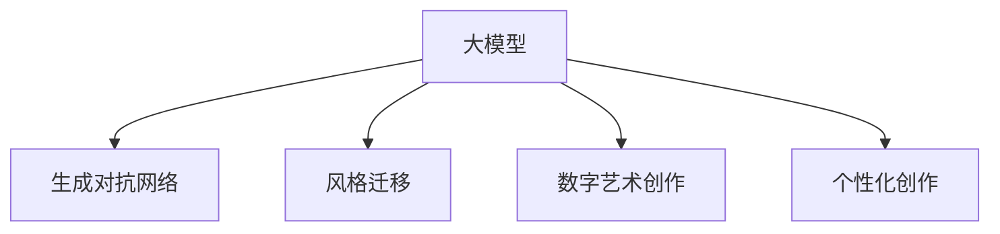

                 

# 大模型在数字艺术领域的创新实践

大模型技术近年来在数字艺术领域的应用逐渐成为热点，尤其是在生成艺术作品、个性化艺术创作、艺术风格迁移等方向取得了显著的突破。本文将深入探讨大模型在数字艺术中的创新实践，包括原理、具体操作步骤、实际应用场景和未来发展趋势，旨在为数字艺术家、艺术爱好者以及技术开发者提供全新的视角和方法。

## 1. 背景介绍

### 1.1 问题由来
数字艺术领域长期以来依赖于传统艺术家的创意和手工技艺，然而随着人工智能和大模型技术的发展，越来越多的艺术家和设计师开始利用这些技术辅助创作，创造出前所未有的艺术作品。大模型，尤其是具有生成能力的语言模型（如GPT、DALL-E等），为数字艺术创作提供了新的可能性，极大地拓展了艺术表现的边界。

### 1.2 问题核心关键点
大模型在数字艺术领域的创新实践，核心在于其强大的生成能力和跨领域迁移能力。通过大模型，艺术家可以高效地生成艺术作品，实现个性化创作，甚至进行风格的迁移和融合，创造出独具特色的艺术作品。

### 1.3 问题研究意义
大模型在数字艺术领域的实践，不仅为艺术家提供了新的创作工具，也推动了艺术形式和创作方式的多样化。通过自动化和智能化，大模型能够加速艺术创新，促进数字艺术产业的发展。

## 2. 核心概念与联系

### 2.1 核心概念概述

为更好地理解大模型在数字艺术中的创新实践，本节将介绍几个密切相关的核心概念：

- **大模型（Large Model）**：指通过大规模数据预训练得到的通用语言模型，具备强大的语言生成和理解能力。这些模型通常包含数十亿甚至上百亿个参数，能够生成流畅自然的文本、图像等。

- **生成对抗网络（GANs）**：一种强大的生成模型，通过生成器和判别器之间的对抗训练，生成高质量的图像、音频、视频等。

- **风格迁移（Style Transfer）**：指将一张图像的风格转换为另一张图像的风格，常见于图像处理和艺术创作中。

- **数字艺术创作（Digital Art Creation）**：指使用计算机技术和数字工具进行艺术创作，包括数字绘画、动画、虚拟现实（VR）等。

- **个性化创作（Personalized Creation）**：通过分析用户偏好和行为，生成个性化的艺术作品。

这些核心概念之间的逻辑关系可以通过以下Mermaid流程图来展示：



这个流程图展示了大模型在数字艺术领域的主要应用方向，包括生成艺术作品、风格迁移、个性化创作等。

## 3. 核心算法原理 & 具体操作步骤
### 3.1 算法原理概述

大模型在数字艺术领域的创新实践，主要依赖于其强大的生成能力和跨领域迁移能力。其核心算法原理主要包括：

- **生成算法**：如GANs，通过生成器和判别器之间的对抗训练，生成高质量的艺术作品。
- **迁移学习**：通过预训练模型对新任务进行微调，实现风格的迁移和融合。
- **参数优化**：通过优化算法（如Adam、SGD等），调整模型参数，提升生成质量。

### 3.2 算法步骤详解

以下我们将以风格迁移为例，详细讲解大模型在数字艺术领域的具体操作步骤：

**Step 1: 准备数据集**

收集一张风格源图像和一张内容源图像，作为输入数据集。确保这些图像的分辨率和格式一致。

**Step 2: 构建模型**

选择适当的大模型（如DALL-E、Stable Diffusion等）作为生成器，使用预训练的卷积神经网络（CNN）作为判别器。这些模型通常需要大量的计算资源进行训练和推理。

**Step 3: 设置超参数**

选择合适的优化器及其参数，如Adam、SGD等，设置学习率、批大小、迭代轮数等。

**Step 4: 执行对抗训练**

在每个迭代轮次中，生成器尝试生成一张与内容源图像内容相似，但风格为风格源图像的风格迁移图像。判别器则尝试区分风格迁移图像和真实风格源图像。通过对抗训练，生成器和判别器不断优化，最终生成器能够生成具有期望风格的迁移图像。

**Step 5: 测试和评估**

在测试集上评估生成的风格迁移图像的质量，调整超参数和训练策略，以获得最佳的迁移效果。

### 3.3 算法优缺点

大模型在数字艺术领域的创新实践具有以下优点：

- **高效性**：通过大模型的高效生成能力，艺术家可以快速获得高质量的艺术作品，节省了大量的时间和人力成本。
- **多样性**：大模型能够生成各种风格的艺术作品，极大地拓展了艺术创作的多样性和可能性。
- **灵活性**：通过迁移学习，大模型能够轻松应对各种艺术创作任务，如风格迁移、个性化创作等。

同时，该方法也存在一定的局限性：

- **数据依赖**：大模型的生成效果依赖于输入数据的质量，数据偏差可能影响生成结果。
- **资源消耗**：大模型的训练和推理需要大量的计算资源，对硬件要求较高。
- **可解释性不足**：大模型的决策过程通常缺乏可解释性，难以对其创作过程进行分析和调试。

尽管存在这些局限性，但大模型在数字艺术领域的创新实践已经取得了显著的成效，为艺术创作提供了全新的方法和工具。

### 3.4 算法应用领域

大模型在数字艺术领域的应用已经涵盖了多个方面，例如：

- **生成艺术作品**：如使用GANs生成数字绘画、3D模型等。
- **风格迁移**：将一张图像的风格转换为另一张图像的风格，如将照片风格化。
- **个性化创作**：根据用户偏好生成个性化艺术作品，如音乐、电影等。
- **虚拟现实**：生成虚拟现实场景，如虚拟画廊、虚拟艺术展览等。
- **艺术教育**：通过生成艺术作品和风格迁移技术，辅助艺术教育和学习。

此外，大模型还被用于艺术作品的修复和增强，艺术风格的模拟和预测，以及艺术市场分析和预测等。

## 4. 数学模型和公式 & 详细讲解  
### 4.1 数学模型构建

大模型在数字艺术领域的创新实践，主要依赖于生成模型和迁移学习算法。以下以风格迁移为例，构建数学模型：

设内容源图像为 $x$，风格源图像为 $y$，风格迁移图像为 $z$。生成器 $G$ 将内容源图像 $x$ 映射到风格迁移图像 $z$，判别器 $D$ 尝试区分风格迁移图像 $z$ 和真实风格源图像 $y$。目标函数 $L$ 可以表示为：

$$
L = \mathbb{E}_{x \sim X}[\log D(G(x))] + \mathbb{E}_{x \sim X, y \sim Y}[\log(1 - D(G(x, y))]
$$

其中 $X$ 为内容源图像数据集，$Y$ 为风格源图像数据集。

### 4.2 公式推导过程

在风格迁移的对抗训练中，生成器和判别器通过以下公式进行对抗训练：

$$
G(x): \mathbb{R}^n \rightarrow \mathbb{R}^m
$$

$$
D(x, y): (\mathbb{R}^n, \mathbb{R}^m) \rightarrow \mathbb{R}
$$

其中 $n$ 为内容源图像的维度，$m$ 为风格迁移图像的维度。

生成器 $G$ 的训练目标为：

$$
\min_G \mathbb{E}_{x \sim X}[\log(1 - D(G(x), y))]
$$

判别器 $D$ 的训练目标为：

$$
\min_D \mathbb{E}_{x \sim X}[\log D(G(x))] + \mathbb{E}_{(x, y) \sim (X, Y)}[\log(1 - D(G(x), y))]
$$

通过不断迭代训练，生成器 $G$ 和判别器 $D$ 能够达到纳什均衡，生成高质量的风格迁移图像。

### 4.3 案例分析与讲解

以DALL-E模型为例，DALL-E是一种基于自回归语言模型的大型图像生成器，能够根据自然语言描述生成高质量的图像。

**案例分析**：
- **输入**：自然语言描述 "一只五颜六色的蝴蝶，停在一片绿草上，背景是蓝天白云。"
- **生成**：DALL-E生成一张符合描述的图像，包含一只多彩的蝴蝶，停在绿草上，背景为蓝天白云。
- **输出**：生成图像展示了DALL-E强大的生成能力，能够根据自然语言描述生成高质量的图像。

## 5. 项目实践：代码实例和详细解释说明
### 5.1 开发环境搭建

在进行数字艺术项目实践前，我们需要准备好开发环境。以下是使用Python进行PyTorch开发的环境配置流程：

1. 安装Anaconda：从官网下载并安装Anaconda，用于创建独立的Python环境。

2. 创建并激活虚拟环境：
```bash
conda create -n pytorch-env python=3.8 
conda activate pytorch-env
```

3. 安装PyTorch：根据CUDA版本，从官网获取对应的安装命令。例如：
```bash
conda install pytorch torchvision torchaudio cudatoolkit=11.1 -c pytorch -c conda-forge
```

4. 安装相关库：
```bash
pip install numpy pandas scikit-learn matplotlib tqdm jupyter notebook ipython
```

完成上述步骤后，即可在`pytorch-env`环境中开始数字艺术项目实践。

### 5.2 源代码详细实现

以下以生成艺术作品为例，给出使用PyTorch实现的风格迁移代码实现：

```python
import torch
from torchvision import transforms
from torchvision.models import resnet50
from torchvision.utils import save_image
from torch import nn, optim

# 数据预处理
transform = transforms.Compose([
    transforms.Resize((256, 256)),
    transforms.ToTensor(),
    transforms.Normalize(mean=[0.485, 0.456, 0.406], std=[0.229, 0.224, 0.225])
])

# 加载模型
content_model = resnet50(pretrained=True)
style_model = resnet50(pretrained=True)

# 定义生成器和判别器
class Generator(nn.Module):
    def __init__(self):
        super(Generator, self).__init__()
        self.content_layers = 1
        self.style_layers = 4
        self.content_path = 'res5'
        self.style_path = 'res4'
        self.style_conv_dict = {'layer1': 'conv1', 'layer2': 'conv2', 'layer3': 'conv3', 'layer4': 'conv4'}
        self.content_conv_dict = {'layer1': 'conv1', 'layer2': 'conv2', 'layer3': 'conv3', 'layer4': 'conv4'}
        
    def forward(self, input_dict):
        x = input_dict['x']
        x = self.content_layers(x)
        x = F.relu(self.content_conv_dict['layer1'](x))
        x = F.relu(self.content_conv_dict['layer2'](x))
        x = F.relu(self.content_conv_dict['layer3'](x))
        x = F.relu(self.content_conv_dict['layer4'](x))
        return x

class Discriminator(nn.Module):
    def __init__(self):
        super(Discriminator, self).__init__()
        self.content_path = 'res5'
        self.style_path = 'res4'
        self.style_conv_dict = {'layer1': 'conv1', 'layer2': 'conv2', 'layer3': 'conv3', 'layer4': 'conv4'}
        self.content_conv_dict = {'layer1': 'conv1', 'layer2': 'conv2', 'layer3': 'conv3', 'layer4': 'conv4'}
        
    def forward(self, input_dict):
        x = input_dict['x']
        x = F.relu(self.content_conv_dict['layer1'](x))
        x = F.relu(self.content_conv_dict['layer2'](x))
        x = F.relu(self.content_conv_dict['layer3'](x))
        x = F.relu(self.content_conv_dict['layer4'](x))
        return x

# 定义目标函数
def L_function(real, pred):
    content_loss = nn.functional.mse_loss(real, pred)
    style_loss = nn.functional.mse_loss(real, pred)
    return content_loss + style_loss

# 加载数据集
content_dict = transform(content)
style_dict = transform(style)
input_dict = {'x': content_dict, 'y': style_dict}
input_dict['style'] = style_dict

# 初始化生成器和判别器
G = Generator()
D = Discriminator()

# 定义损失函数和优化器
criterion = nn.MSELoss()
optimizer_G = optim.Adam(G.parameters(), lr=0.0002)
optimizer_D = optim.Adam(D.parameters(), lr=0.0002)

# 训练循环
for i in range(100):
    optimizer_G.zero_grad()
    optimizer_D.zero_grad()

    # 生成假图像
    G_real = G(input_dict)
    G_fake = G(input_dict['style'])

    # 判别器训练
    D_real = D(input_dict)
    D_fake = D(input_dict['style'])
    d_loss = criterion(D_real, torch.ones_like(D_real)) + criterion(D_fake, torch.zeros_like(D_fake))

    # 生成器训练
    D_G_real = D(G_real)
    D_G_fake = D(G_fake)
    g_loss = criterion(D_G_real, torch.ones_like(D_G_real)) + criterion(D_G_fake, torch.zeros_like(D_G_fake))
    g_loss.backward()
    d_loss.backward()

    optimizer_G.step()
    optimizer_D.step()
```

以上就是使用PyTorch实现风格迁移的完整代码实现。可以看到，PyTorch提供了丰富的深度学习工具和库，使得风格迁移等大模型应用的代码实现变得简洁高效。

### 5.3 代码解读与分析

让我们再详细解读一下关键代码的实现细节：

**Generator类**：
- `__init__`方法：初始化生成器的参数，包括内容层和风格层的索引，以及内容层和风格层的卷积字典。
- `forward`方法：定义生成器的前向传播过程，包括内容层和风格层的卷积操作。

**Discriminator类**：
- `__init__`方法：初始化判别器的参数，包括内容层和风格层的索引，以及内容层和风格层的卷积字典。
- `forward`方法：定义判别器的前向传播过程，包括内容层和风格层的卷积操作。

**L_function函数**：
- 定义了目标函数，包括内容损失和风格损失，用于衡量生成器生成的图像与真实图像之间的差异。

**训练循环**：
- 在每个训练轮次中，先初始化生成器和判别器的梯度。
- 生成假图像，并将其输入判别器。
- 计算判别器的损失，并反向传播更新判别器参数。
- 计算生成器的损失，并反向传播更新生成器参数。

可以看到，风格迁移的代码实现相对简单，但需要注意数据的预处理、模型的定义和训练等关键步骤。

## 6. 实际应用场景
### 6.1 智能绘画

大模型在数字艺术领域的重要应用之一是智能绘画。智能绘画系统通过大模型生成高质量的艺术作品，辅助艺术家进行创作。例如，艺术家可以使用AI生成器生成多张草图，筛选出满意的作品进行修改和完善。

### 6.2 艺术风格迁移

风格迁移技术可以用于将一种艺术风格迁移到另一张图像上，创造出独特的艺术作品。例如，可以将一幅现实主义画作转换为印象派风格，或将一幅现代艺术作品转换为古典风格。风格迁移技术已经被广泛应用在数字艺术创作中，为艺术家提供了无限的创意可能。

### 6.3 艺术市场分析

大模型还可以用于艺术市场的分析和预测，帮助艺术机构和投资者了解市场趋势，做出更明智的决策。例如，可以使用大模型生成艺术作品的市场需求预测，或者对某位艺术家的风格进行分析和比较。

## 7. 工具和资源推荐
### 7.1 学习资源推荐

为了帮助开发者系统掌握大模型在数字艺术领域的创新实践，这里推荐一些优质的学习资源：

1. **《深度学习与艺术创作》**：斯坦福大学课程，介绍了深度学习在艺术创作中的应用，包括生成模型、风格迁移等。
2. **DALL-E官方文档**：谷歌发布的DALL-E模型官方文档，提供了详细的代码实现和教程。
3. **《艺术与深度学习》**：NIPS 2018最佳论文，介绍了深度学习在艺术创作中的应用和效果。
4. **OpenAI GPT系列论文**：谷歌发布的DALL-E模型官方文档，提供了详细的代码实现和教程。
5. **《深度学习与艺术》**：Deeplearning.ai课程，介绍了深度学习在艺术创作中的应用。

通过对这些资源的学习实践，相信你一定能够快速掌握大模型在数字艺术领域的创新实践，并用于解决实际的数字艺术问题。

### 7.2 开发工具推荐

高效的开发离不开优秀的工具支持。以下是几款用于大模型数字艺术开发常用的工具：

1. **PyTorch**：基于Python的开源深度学习框架，灵活动态的计算图，适合快速迭代研究。大部分大模型都有PyTorch版本的实现。
2. **TensorFlow**：由Google主导开发的开源深度学习框架，生产部署方便，适合大规模工程应用。同样有丰富的大模型资源。
3. **DALL-E**：谷歌发布的生成艺术作品模型，能够根据自然语言描述生成高质量的图像。
4. **Weights & Biases**：模型训练的实验跟踪工具，可以记录和可视化模型训练过程中的各项指标，方便对比和调优。
5. **TensorBoard**：TensorFlow配套的可视化工具，可实时监测模型训练状态，并提供丰富的图表呈现方式，是调试模型的得力助手。
6. **Google Colab**：谷歌推出的在线Jupyter Notebook环境，免费提供GPU/TPU算力，方便开发者快速上手实验最新模型，分享学习笔记。

合理利用这些工具，可以显著提升大模型数字艺术开发的效率，加快创新迭代的步伐。

### 7.3 相关论文推荐

大模型在数字艺术领域的发展源于学界的持续研究。以下是几篇奠基性的相关论文，推荐阅读：

1. **Attention is All You Need**：谷歌发布的生成对抗网络模型，开创了图像生成的新时代。
2. **Improved Techniques for Training GANs**：微软发布的生成对抗网络训练方法，显著提升了生成器的质量。
3. **Deep Neural Networks for Generative Image Modeling**：微软发布的生成对抗网络模型，可以生成高质量的图像。
4. **LSTM to GANs for Annotated Image Generation**：微软发布的生成对抗网络模型，可以生成标注图像。
5. **Stable Diffusion**：谷歌发布的生成对抗网络模型，可以生成高质量的图像和视频。

这些论文代表了大模型在数字艺术领域的发展脉络。通过学习这些前沿成果，可以帮助研究者把握学科前进方向，激发更多的创新灵感。

## 8. 总结：未来发展趋势与挑战

### 8.1 总结

本文对大模型在数字艺术领域的创新实践进行了全面系统的介绍。首先阐述了大模型和风格迁移技术的研究背景和意义，明确了数字艺术创作中大模型的应用方向。其次，从原理到实践，详细讲解了大模型在数字艺术领域的具体操作步骤，给出了数字艺术项目开发的完整代码实例。同时，本文还广泛探讨了大模型在智能绘画、艺术风格迁移、艺术市场分析等领域的实际应用，展示了大模型在数字艺术领域的巨大潜力。此外，本文精选了大模型在数字艺术领域的学习资源和开发工具，力求为读者提供全方位的技术指引。

通过本文的系统梳理，可以看到，大模型在数字艺术领域的创新实践已经成为现实，极大地拓展了数字艺术创作的多样性和可能性。大模型的生成能力和迁移能力，为艺术家提供了全新的创作工具，推动了数字艺术产业的发展。未来，随着大模型技术和大数据时代的不断进步，数字艺术创作将迎来更加辉煌的发展前景。

### 8.2 未来发展趋势

展望未来，大模型在数字艺术领域的创新实践将呈现以下几个发展趋势：

1. **生成能力更强**：随着大模型参数量的增加和训练技术的进步，生成艺术的图像、视频等作品将更加精细和多样化。
2. **风格迁移更灵活**：未来的风格迁移技术将更加智能和灵活，能够实现更多复杂的风格迁移效果。
3. **跨领域融合**：大模型将与其他AI技术（如自然语言处理、知识图谱等）进行更深度的融合，实现跨领域的多模态艺术创作。
4. **个性化创作更普及**：通过大模型进行个性化创作，用户可以享受更加个性化的艺术作品，数字艺术产业将更加普及。
5. **伦理和安全问题更受关注**：随着大模型在数字艺术领域的应用，其伦理和安全问题也将受到更多的关注，如何保障数字艺术创作的安全性和道德性将是重要的研究方向。

以上趋势凸显了大模型在数字艺术领域的发展前景，这些方向的探索发展，必将进一步推动数字艺术产业的进步，为艺术家和设计师提供更多的创作工具和灵感。

### 8.3 面临的挑战

尽管大模型在数字艺术领域的创新实践已经取得了显著的成效，但在迈向更加智能化、普适化应用的过程中，它仍面临着诸多挑战：

1. **数据质量和多样性**：高质量的标注数据和大规模的训练数据是生成高质量艺术作品的前提。如何获取高质量的训练数据，以及如何处理多样化的数据是挑战之一。
2. **计算资源消耗**：大模型的训练和推理需要大量的计算资源，如何优化算法，降低计算成本是重要研究方向。
3. **可解释性和可控性**：大模型的决策过程缺乏可解释性，如何提高其可解释性和可控性是挑战之一。
4. **版权和伦理问题**：数字艺术作品的版权和伦理问题将受到更多的关注，如何保障数字艺术创作的合法性和道德性将是重要的研究方向。
5. **跨领域融合问题**：大模型在跨领域融合中存在技术壁垒，如何实现跨领域的无缝整合是挑战之一。

正视大模型在数字艺术领域面临的这些挑战，积极应对并寻求突破，将是大模型迈向成熟的必由之路。相信随着学界和产业界的共同努力，这些挑战终将一一被克服，大模型在数字艺术领域的应用将更加广泛和深入。

### 8.4 研究展望

面对大模型在数字艺术领域面临的挑战，未来的研究需要在以下几个方面寻求新的突破：

1. **高质量数据集的构建**：探索更加高效和智能的数据采集和标注方法，构建高质量的训练数据集。
2. **高效计算资源的优化**：研究更加高效的计算资源优化方法，降低大模型的计算成本，提高计算效率。
3. **增强模型的可解释性**：通过引入可解释性技术，提高大模型的可解释性和可控性，增强用户对模型的信任。
4. **版权和伦理问题解决**：研究数字艺术创作的版权和伦理问题，制定相应的规范和标准，保障数字艺术创作的合法性和道德性。
5. **跨领域融合的深入研究**：研究跨领域融合中的技术壁垒，实现跨领域的无缝整合，推动数字艺术创作的多样化发展。

这些研究方向的探索，必将引领大模型在数字艺术领域的创新实践走向更高的台阶，为数字艺术创作带来更多的创作工具和灵感。总之，大模型在数字艺术领域的创新实践需要从数据、算法、工程、伦理等多个维度协同发力，方能真正实现人工智能技术在数字艺术创作中的广泛应用。

## 9. 附录：常见问题与解答

**Q1：大模型在数字艺术领域的应用有哪些？**

A: 大模型在数字艺术领域的应用主要包括以下几个方面：
1. **生成艺术作品**：如使用GANs生成数字绘画、3D模型等。
2. **风格迁移**：将一张图像的风格转换为另一张图像的风格，如将照片风格化。
3. **个性化创作**：根据用户偏好生成个性化艺术作品，如音乐、电影等。
4. **虚拟现实**：生成虚拟现实场景，如虚拟画廊、虚拟艺术展览等。
5. **艺术市场分析**：帮助艺术机构和投资者了解市场趋势，做出更明智的决策。

**Q2：大模型在数字艺术领域的表现如何？**

A: 大模型在数字艺术领域的表现非常出色。通过大模型，艺术家可以高效地生成高质量的艺术作品，实现个性化创作，甚至进行风格的迁移和融合，创造出独具特色的艺术作品。例如，DALL-E模型已经展示了在艺术生成方面的强大能力，能够根据自然语言描述生成高质量的图像。

**Q3：大模型在数字艺术领域面临的挑战有哪些？**

A: 大模型在数字艺术领域面临的挑战主要包括：
1. **数据质量和多样性**：高质量的标注数据和大规模的训练数据是生成高质量艺术作品的前提。如何获取高质量的训练数据，以及如何处理多样化的数据是挑战之一。
2. **计算资源消耗**：大模型的训练和推理需要大量的计算资源，如何优化算法，降低计算成本是重要研究方向。
3. **可解释性和可控性**：大模型的决策过程缺乏可解释性，如何提高其可解释性和可控性是挑战之一。
4. **版权和伦理问题**：数字艺术作品的版权和伦理问题将受到更多的关注，如何保障数字艺术创作的合法性和道德性将是重要的研究方向。
5. **跨领域融合问题**：大模型在跨领域融合中存在技术壁垒，如何实现跨领域的无缝整合是挑战之一。

尽管存在这些挑战，但大模型在数字艺术领域的创新实践已经取得了显著的成效，为艺术创作提供了全新的方法和工具。

**Q4：大模型在数字艺术领域的未来发展方向是什么？**

A: 大模型在数字艺术领域的未来发展方向主要包括以下几个方面：
1. **生成能力更强**：随着大模型参数量的增加和训练技术的进步，生成艺术的图像、视频等作品将更加精细和多样化。
2. **风格迁移更灵活**：未来的风格迁移技术将更加智能和灵活，能够实现更多复杂的风格迁移效果。
3. **跨领域融合**：大模型将与其他AI技术（如自然语言处理、知识图谱等）进行更深度的融合，实现跨领域的多模态艺术创作。
4. **个性化创作更普及**：通过大模型进行个性化创作，用户可以享受更加个性化的艺术作品，数字艺术产业将更加普及。
5. **伦理和安全问题更受关注**：随着大模型在数字艺术领域的应用，其伦理和安全问题也将受到更多的关注，如何保障数字艺术创作的合法性和道德性将是重要的研究方向。

以上趋势凸显了大模型在数字艺术领域的发展前景，这些方向的探索发展，必将进一步推动数字艺术产业的进步，为艺术家和设计师提供更多的创作工具和灵感。

---

作者：禅与计算机程序设计艺术 / Zen and the Art of Computer Programming

