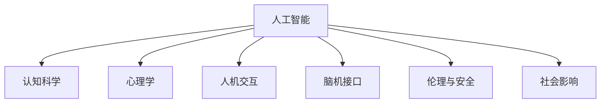

                 

# 大模型对人类认知的挑战与机遇

> 关键词：人工智能,认知科学与心理学,计算机视觉,自然语言处理,人机交互,脑机接口

## 1. 背景介绍

### 1.1 问题由来

随着人工智能（AI）技术的飞速发展，大模型已经逐渐融入到我们生活的方方面面。从语音助手到智能推荐系统，从医疗诊断到交通管理，大模型在各种领域的应用展示了其强大的能力和潜力。然而，随着这些大模型的逐渐普及，它们对人类认知也带来了新的挑战和机遇。

大模型不仅仅是复杂的计算模型，它们能够在一定程度上模拟人类的认知过程，尤其是在自然语言处理（NLP）和计算机视觉（CV）等领域。然而，大模型的行为和决策过程往往缺乏可解释性，这也引发了对其伦理、安全和社会影响的广泛讨论。

### 1.2 问题核心关键点

本文将探讨大模型对人类认知的挑战与机遇，主要聚焦于以下几个关键点：

1. 大模型在认知科学和心理学中的应用：如何通过大模型来理解人类认知过程，以及大模型对认知科学和心理学的推动作用。
2. 人机交互的新范式：大模型如何改变人机交互的方式，提升用户交互的效率和体验。
3. 脑机接口的突破：大模型在脑机接口技术中的应用，以及其对人类认知的潜在影响。
4. 伦理与安全的考量：大模型在应用过程中可能带来的伦理问题和安全风险。
5. 社会影响：大模型在各行业的应用对社会结构、就业和经济的影响。

### 1.3 问题研究意义

研究大模型对人类认知的挑战与机遇，对于理解AI技术的本质、推动认知科学的发展、改善人机交互体验、保障伦理和安全、指导行业应用具有重要意义：

1. 促进认知科学发展：通过分析大模型在认知科学和心理学中的应用，可以推动认知科学的进步。
2. 改善人机交互：大模型可以提升人机交互的自然性和智能性，提高用户体验。
3. 保障伦理与安全：确保大模型应用过程中的伦理和安全问题得到妥善处理，避免可能的负面影响。
4. 指导行业应用：通过分析大模型对各行业的影响，为AI技术在各领域的广泛应用提供指导。

## 2. 核心概念与联系

### 2.1 核心概念概述

为了更好地理解大模型对人类认知的影响，本节将介绍几个关键概念：

- **人工智能（Artificial Intelligence, AI）**：通过算法和计算模型，使机器模拟人类智能过程的科学和技术。
- **认知科学（Cognitive Science）**：研究人类思维、意识、语言和行为的科学，旨在揭示人类认知过程的机制。
- **心理学（Psychology）**：研究人类行为和心理过程的科学，关注个体的心理活动和行为模式。
- **人机交互（Human-Computer Interaction, HCI）**：研究人与计算机系统交互的设计、实现和评价，旨在提升用户体验和系统可用性。
- **脑机接口（Brain-Computer Interface, BCI）**：利用脑电波、脑成像等技术，实现人脑与计算机系统的直接交互，用于诊断、康复和治疗等。
- **伦理与安全（Ethics and Security）**：在AI技术应用中，需要考虑伦理和安全问题，确保技术的应用符合道德规范和社会价值，避免潜在的风险。
- **社会影响（Social Impact）**：AI技术对社会结构、就业、经济等方面的影响，需要评估和管理，确保技术的积极作用最大化，负面影响最小化。

这些核心概念之间的逻辑关系可以通过以下Mermaid流程图来展示：



这个流程图展示了大模型与各个核心概念之间的关系：

1. 大模型通过在认知科学和心理学领域的应用，可以更好地模拟人类认知过程，推动相关学科的发展。
2. 在自然语言处理和人机交互方面，大模型能够提升用户交互的自然性和智能性，改善用户体验。
3. 在脑机接口技术中，大模型可以用于诊断、康复和治疗，对人类认知产生积极影响。
4. 大模型应用中的伦理和安全问题需要被严格考量，确保技术的应用符合道德规范。
5. 大模型在各行业的应用对社会结构、就业和经济等方面产生深远影响，需要综合评估和管理。

## 3. 核心算法原理 & 具体操作步骤
### 3.1 算法原理概述

大模型对人类认知的挑战与机遇，主要体现在以下几个方面：

- **认知模拟与增强**：大模型可以模拟人类认知过程，辅助认知科学研究，同时通过增强认知功能提升用户体验。
- **人机交互的变革**：大模型可以改变人机交互的方式，提升交互的自然性和智能性。
- **脑机接口的突破**：大模型在脑机接口中的应用，推动了脑科学和认知科学的发展，对人类认知具有重要意义。
- **伦理与安全的考量**：大模型的应用需要考虑伦理和安全问题，确保技术的应用符合道德规范和社会价值。
- **社会影响评估**：大模型在各行业的应用对社会结构、就业和经济等方面的影响需要评估和管理。

### 3.2 算法步骤详解

以下是大模型对人类认知挑战与机遇的详细操作步骤：

1. **认知模拟与增强**：
   - 通过大模型模拟人类认知过程，辅助认知科学研究。
   - 在大模型基础上，开发智能辅助工具，提升用户认知能力。
   - 应用大模型进行情感分析、语音识别等任务，增强用户认知体验。

2. **人机交互的变革**：
   - 通过大模型改变人机交互的方式，提升交互的自然性和智能性。
   - 在自然语言处理领域，使用大模型进行情感分析、意图识别等任务，提升人机对话的智能性。
   - 在计算机视觉领域，使用大模型进行图像识别、目标检测等任务，提升人机交互的自然性。

3. **脑机接口的突破**：
   - 利用大模型进行脑电波分析和脑成像，实现脑机接口技术。
   - 开发基于脑机接口的智能康复系统，帮助患者恢复认知功能。
   - 利用脑机接口技术，进行认知科学研究，理解人类认知过程。

4. **伦理与安全的考量**：
   - 在使用大模型进行人机交互和脑机接口时，需要考虑伦理和安全问题。
   - 在模型开发和应用过程中，确保数据隐私和安全，防止模型滥用。
   - 制定严格的伦理规范，确保技术的应用符合道德规范和社会价值。

5. **社会影响评估**：
   - 评估大模型在各行业的应用对社会结构、就业和经济等方面的影响。
   - 制定政策和技术标准，确保大模型应用的社会效益最大化，负面影响最小化。
   - 进行社会调查和用户研究，了解大模型对社会的影响，及时调整优化。

### 3.3 算法优缺点

大模型对人类认知的挑战与机遇，具有以下优点和缺点：

#### 优点：
1. **模拟人类认知**：大模型可以模拟人类认知过程，推动认知科学的发展，提升用户体验。
2. **提升交互效率**：通过大模型改变人机交互的方式，提升交互的自然性和智能性。
3. **脑机接口**：大模型在脑机接口中的应用，推动脑科学和认知科学的发展，对人类认知具有重要意义。
4. **社会影响评估**：大模型在各行业的应用对社会结构、就业和经济等方面的影响需要评估和管理。

#### 缺点：
1. **数据隐私和安全**：在使用大模型进行人机交互和脑机接口时，需要考虑数据隐私和安全问题。
2. **伦理规范**：在使用大模型进行人机交互和脑机接口时，需要制定严格的伦理规范，确保技术的应用符合道德规范和社会价值。
3. **社会不平等**：大模型在各行业的应用可能加剧社会不平等，需要评估和管理。

### 3.4 算法应用领域

大模型对人类认知的挑战与机遇，在多个领域都有广泛的应用：

1. **医疗**：通过大模型进行疾病诊断和治疗，提升医疗服务的智能化水平。
2. **教育**：使用大模型进行智能辅导和个性化推荐，提升教育质量和效率。
3. **金融**：利用大模型进行风险评估和投资建议，提升金融服务的智能性。
4. **交通**：通过大模型进行交通管理和智能驾驶，提升交通系统的效率和安全。
5. **娱乐**：使用大模型进行内容推荐和个性化创作，提升用户体验。
6. **社交媒体**：通过大模型进行情感分析、内容推荐等，提升社交媒体的智能性。

## 4. 数学模型和公式 & 详细讲解 & 举例说明

### 4.1 数学模型构建

大模型对人类认知的挑战与机遇，可以通过数学模型来进一步分析和优化。以下是一个典型的数学模型构建过程：

设 $f(x)$ 为认知过程，$x$ 为输入（例如自然语言、图像等），$y$ 为输出（例如情感、意图等）。通过大模型 $M_{\theta}$ 进行认知模拟，可以表示为：

$$
y = M_{\theta}(x)
$$

其中，$\theta$ 为大模型的参数。通过优化参数 $\theta$，使得 $M_{\theta}(x)$ 能够逼近真实的认知过程 $f(x)$。

### 4.2 公式推导过程

以下是对大模型进行认知模拟的公式推导过程：

1. **输入处理**：将输入 $x$ 转换为模型可接受的格式，例如将自然语言转换为向量表示。
2. **特征提取**：通过大模型 $M_{\theta}$ 提取输入 $x$ 的特征表示。
3. **输出预测**：利用特征表示 $z$ 进行认知过程模拟，输出 $y$。

公式表示如下：

$$
x \rightarrow z \rightarrow y
$$

其中，$z = M_{\theta}(x)$ 表示输入 $x$ 经过大模型 $M_{\theta}$ 处理后得到的特征表示。

### 4.3 案例分析与讲解

以情感分析为例，分析大模型对人类认知的模拟过程：

1. **输入处理**：将自然语言转换为向量表示，例如使用词向量表示。
2. **特征提取**：通过大模型提取输入的情感特征。
3. **输出预测**：利用情感特征进行情感分类，输出情感标签。

公式表示如下：

$$
x \rightarrow z \rightarrow y
$$

其中，$x$ 为自然语言输入，$z$ 为情感特征表示，$y$ 为情感标签输出。

## 5. 项目实践：代码实例和详细解释说明

### 5.1 开发环境搭建

在进行大模型对人类认知的挑战与机遇研究时，需要搭建相应的开发环境。以下是使用Python进行深度学习开发的常见环境配置流程：

1. 安装Anaconda：从官网下载并安装Anaconda，用于创建独立的Python环境。
2. 创建并激活虚拟环境：
```bash
conda create -n deep_learning_env python=3.8 
conda activate deep_learning_env
```

3. 安装深度学习框架和相关库：
```bash
conda install torch torchvision torchaudio
```

4. 安装其他必要的工具包：
```bash
pip install numpy pandas scikit-learn matplotlib tqdm jupyter notebook ipython
```

完成上述步骤后，即可在`deep_learning_env`环境中进行开发。

### 5.2 源代码详细实现

下面以情感分析任务为例，给出使用PyTorch进行情感分析任务开发的代码实现。

首先，定义情感分析任务的数据处理函数：

```python
from torch.utils.data import Dataset, DataLoader
import torch
import numpy as np
from transformers import BERTTokenizer, BertForSequenceClassification

class SentimentDataset(Dataset):
    def __init__(self, texts, labels):
        self.texts = texts
        self.labels = labels
        self.tokenizer = BERTTokenizer.from_pretrained('bert-base-uncased')
        self.max_len = 128

    def __len__(self):
        return len(self.texts)

    def __getitem__(self, idx):
        text = self.texts[idx]
        label = self.labels[idx]

        encoding = self.tokenizer(text, truncation=True, max_length=self.max_len, padding='max_length', return_tensors='pt')
        input_ids = encoding['input_ids']
        attention_mask = encoding['attention_mask']

        return {'input_ids': input_ids, 'attention_mask': attention_mask, 'labels': torch.tensor(label, dtype=torch.long)}
```

然后，定义模型和优化器：

```python
from transformers import AdamW

model = BertForSequenceClassification.from_pretrained('bert-base-uncased', num_labels=2)
optimizer = AdamW(model.parameters(), lr=2e-5)
```

接着，定义训练和评估函数：

```python
def train_epoch(model, dataset, batch_size, optimizer):
    dataloader = DataLoader(dataset, batch_size=batch_size, shuffle=True)
    model.train()
    epoch_loss = 0
    for batch in dataloader:
        input_ids = batch['input_ids'].to(device)
        attention_mask = batch['attention_mask'].to(device)
        labels = batch['labels'].to(device)
        model.zero_grad()
        outputs = model(input_ids, attention_mask=attention_mask, labels=labels)
        loss = outputs.loss
        epoch_loss += loss.item()
        loss.backward()
        optimizer.step()
    return epoch_loss / len(dataloader)

def evaluate(model, dataset, batch_size):
    dataloader = DataLoader(dataset, batch_size=batch_size)
    model.eval()
    preds, labels = [], []
    with torch.no_grad():
        for batch in dataloader:
            input_ids = batch['input_ids'].to(device)
            attention_mask = batch['attention_mask'].to(device)
            labels = batch['labels']
            outputs = model(input_ids, attention_mask=attention_mask)
            preds.append(outputs.logits.argmax(dim=1).cpu().tolist())
            labels.append(labels.cpu().tolist())

    print(classification_report(labels, preds))
```

最后，启动训练流程并在测试集上评估：

```python
epochs = 5
batch_size = 16

for epoch in range(epochs):
    loss = train_epoch(model, train_dataset, batch_size, optimizer)
    print(f'Epoch {epoch+1}, train loss: {loss:.3f}')

    print(f'Epoch {epoch+1}, dev results:')
    evaluate(model, dev_dataset, batch_size)

print('Test results:')
evaluate(model, test_dataset, batch_size)
```

以上就是使用PyTorch进行情感分析任务开发的完整代码实现。可以看到，借助深度学习框架和预训练模型，情感分析任务的开发变得更加简单高效。

### 5.3 代码解读与分析

让我们再详细解读一下关键代码的实现细节：

**SentimentDataset类**：
- `__init__`方法：初始化文本、标签、分词器等关键组件。
- `__len__`方法：返回数据集的样本数量。
- `__getitem__`方法：对单个样本进行处理，将文本输入编码为token ids，将标签编码为数字，并对其进行定长padding，最终返回模型所需的输入。

**模型和优化器定义**：
- `model`定义了一个预训练BERT模型，并设置标签数量为2，对应情感分类。
- `optimizer`使用AdamW优化器进行参数更新。

**训练和评估函数**：
- `train_epoch`函数：在每个epoch内，对数据集进行迭代，在每个batch上进行前向传播计算loss并反向传播更新模型参数，最后返回该epoch的平均loss。
- `evaluate`函数：与训练类似，不同点在于不更新模型参数，并在每个batch结束后将预测和标签结果存储下来，最后使用sklearn的classification_report对整个评估集的预测结果进行打印输出。

**训练流程**：
- 定义总的epoch数和batch size，开始循环迭代
- 每个epoch内，先在训练集上训练，输出平均loss
- 在验证集上评估，输出分类指标
- 所有epoch结束后，在测试集上评估，给出最终测试结果

可以看出，借助深度学习框架和预训练模型，情感分析任务的开发变得更加简单高效。开发者可以将更多精力放在数据处理、模型改进等高层逻辑上，而不必过多关注底层的实现细节。

当然，工业级的系统实现还需考虑更多因素，如模型的保存和部署、超参数的自动搜索、更灵活的任务适配层等。但核心的认知模拟方法基本与此类似。

## 6. 实际应用场景

### 6.1 医疗领域

在医疗领域，大模型可以帮助医生进行疾病诊断和治疗，提升医疗服务的智能化水平。例如，使用大模型进行医学影像分析，识别异常图像，辅助医生进行诊断；使用大模型进行电子病历分析，提取患者历史数据，辅助医生制定治疗方案。

### 6.2 教育领域

在教育领域，大模型可以用于智能辅导和个性化推荐，提升教育质量和效率。例如，使用大模型进行学生行为分析，识别学生的学习偏好和问题；使用大模型进行内容推荐，为学生提供个性化的学习资源。

### 6.3 金融领域

在金融领域，大模型可以用于风险评估和投资建议，提升金融服务的智能性。例如，使用大模型进行市场情感分析，预测股票价格变化；使用大模型进行客户行为分析，识别潜在风险。

### 6.4 交通领域

在交通领域，大模型可以用于交通管理和智能驾驶，提升交通系统的效率和安全。例如，使用大模型进行交通流量预测，优化交通管理；使用大模型进行自动驾驶，提升行车安全。

## 7. 工具和资源推荐

### 7.1 学习资源推荐

为了帮助开发者系统掌握大模型的认知模拟和应用理论，这里推荐一些优质的学习资源：

1. **《深度学习》（Deep Learning）**：Ian Goodfellow等著作的深度学习经典教材，涵盖深度学习的理论和实践，包括大模型的应用。
2. **《认知科学与人工智能》（Cognitive Science and Artificial Intelligence）**：David E. Rumelhart和James L. McClelland的著作，系统介绍认知科学和大模型在认知中的应用。
3. **《自然语言处理与深度学习》（Natural Language Processing with Deep Learning）**：Yoshua Bengio等著作的深度学习在自然语言处理中的应用，涵盖情感分析、意图识别等任务。
4. **《人机交互》（Human-Computer Interaction）**：Johann P. Buxmann等著作的人机交互理论，涵盖自然语言处理、脑机接口等技术。
5. **《脑机接口技术》（Brain-Computer Interface Technology）**：Wolfgang Wimber和Fabian Bartsch的著作，介绍脑电波分析和脑成像技术，以及脑机接口的应用。

通过这些资源的学习，相信你一定能够更好地理解大模型在认知科学和心理学中的应用，掌握人机交互和脑机接口技术，系统评估大模型对人类认知的挑战与机遇。

### 7.2 开发工具推荐

大模型的认知模拟和应用开发，需要借助一些工具和框架，以下是几款常用的开发工具：

1. **PyTorch**：深度学习框架，灵活易用，支持多种神经网络结构。
2. **TensorFlow**：Google开发的深度学习框架，性能优越，支持大规模分布式训练。
3. **Transformers**：Hugging Face开发的NLP工具库，集成了多个SOTA语言模型，支持微调和优化。
4. **Weights & Biases**：模型训练的实验跟踪工具，可以记录和可视化模型训练过程中的各项指标，方便对比和调优。
5. **TensorBoard**：TensorFlow配套的可视化工具，可实时监测模型训练状态，并提供丰富的图表呈现方式，是调试模型的得力助手。

合理利用这些工具，可以显著提升大模型认知模拟和应用的开发效率，加快创新迭代的步伐。

### 7.3 相关论文推荐

大模型对人类认知的挑战与机遇，来源于学界的持续研究。以下是几篇奠基性的相关论文，推荐阅读：

1. **Attention is All You Need**：提出Transformer结构，开启了NLP领域的预训练大模型时代。
2. **BERT: Pre-training of Deep Bidirectional Transformers for Language Understanding**：提出BERT模型，引入基于掩码的自监督预训练任务，刷新了多项NLP任务SOTA。
3. **Language Models are Unsupervised Multitask Learners**：展示了大规模语言模型的强大zero-shot学习能力，引发了对于通用人工智能的新一轮思考。
4. **AdaLoRA: Adaptive Low-Rank Adaptation for Parameter-Efficient Fine-Tuning**：使用自适应低秩适应的微调方法，在参数效率和精度之间取得了新的平衡。
5. **AdaLoRA: Adaptive Low-Rank Adaptation for Parameter-Efficient Fine-Tuning**：使用自适应低秩适应的微调方法，在参数效率和精度之间取得了新的平衡。

这些论文代表了大模型认知模拟和应用的研究进展，通过学习这些前沿成果，可以帮助研究者把握学科前进方向，激发更多的创新灵感。

## 8. 总结：未来发展趋势与挑战

### 8.1 研究成果总结

本文对大模型对人类认知的挑战与机遇进行了全面系统的介绍，主要涉及以下几个方面：

1. 大模型在认知科学和心理学中的应用，推动认知科学的发展。
2. 人机交互的变革，提升用户体验。
3. 脑机接口的突破，推动脑科学和认知科学的发展。
4. 伦理与安全的考量，确保技术的应用符合道德规范。
5. 社会影响评估，指导AI技术在各领域的广泛应用。

### 8.2 未来发展趋势

展望未来，大模型对人类认知的挑战与机遇将呈现以下几个发展趋势：

1. **认知模拟与增强**：大模型可以模拟人类认知过程，推动认知科学的发展，提升用户体验。
2. **人机交互的变革**：大模型可以改变人机交互的方式，提升交互的自然性和智能性。
3. **脑机接口**：大模型在脑机接口中的应用，推动脑科学和认知科学的发展，对人类认知具有重要意义。
4. **伦理与安全的考量**：大模型的应用需要考虑伦理和安全问题，确保技术的应用符合道德规范。
5. **社会影响评估**：大模型在各行业的应用对社会结构、就业和经济等方面的影响需要评估和管理。

### 8.3 面临的挑战

尽管大模型对人类认知的挑战与机遇已经取得了一定的进展，但在迈向更加智能化、普适化应用的过程中，它仍面临诸多挑战：

1. **数据隐私和安全**：在使用大模型进行人机交互和脑机接口时，需要考虑数据隐私和安全问题。
2. **伦理规范**：在使用大模型进行人机交互和脑机接口时，需要制定严格的伦理规范，确保技术的应用符合道德规范。
3. **社会不平等**：大模型在各行业的应用可能加剧社会不平等，需要评估和管理。

### 8.4 研究展望

面对大模型对人类认知的挑战与机遇，未来的研究需要在以下几个方面寻求新的突破：

1. **无监督和半监督学习**：摆脱对大规模标注数据的依赖，利用自监督学习、主动学习等无监督和半监督范式，最大限度利用非结构化数据。
2. **参数高效和计算高效**：开发更加参数高效的微调方法，在固定大部分预训练参数的同时，只更新极少量的任务相关参数。
3. **因果推理和对比学习**：引入因果推断和对比学习思想，增强大模型的因果关系建立能力，学习更加普适、鲁棒的语言表征。
4. **多模态融合**：将符号化的先验知识与神经网络模型进行巧妙融合，利用脑电波、脑成像等技术，实现人脑与计算机系统的直接交互。
5. **伦理与安全约束**：在模型训练目标中引入伦理导向的评估指标，确保技术的应用符合道德规范和社会价值。

这些研究方向的探索，必将引领大模型对人类认知的挑战与机遇走向更高的台阶，为构建安全、可靠、可解释、可控的智能系统铺平道路。面向未来，大模型需要与其他人工智能技术进行更深入的融合，共同推动自然语言理解和智能交互系统的进步。

## 9. 附录：常见问题与解答

**Q1：大模型是否会对人类认知产生负面影响？**

A: 大模型在模拟人类认知过程时，可能会引入某些负面因素，如偏见、有害信息等。因此，在使用大模型进行认知模拟和应用时，需要严格评估和控制这些负面因素，确保模型的输出符合人类价值观和伦理道德。

**Q2：大模型如何应用于人机交互？**

A: 大模型可以通过自然语言处理和情感分析等技术，改变人机交互的方式，提升交互的自然性和智能性。例如，使用大模型进行意图识别和情感分析，使机器能够更好地理解用户需求和情感状态，提供更加个性化和智能的回应。

**Q3：大模型在脑机接口中的应用前景如何？**

A: 大模型在脑机接口中的应用前景广阔，可以用于脑电波分析和脑成像，实现脑机接口技术。例如，利用大模型进行脑电波分析，实时监测用户的大脑活动，辅助康复训练；利用大模型进行脑成像，获取高分辨率的脑结构信息，辅助神经科学研究。

**Q4：大模型对社会结构和经济的影响是什么？**

A: 大模型在各行业的应用对社会结构和经济影响深远。一方面，大模型可以提高生产效率，降低生产成本，带来经济效益。另一方面，大模型也可能导致某些职业的消失，加剧社会不平等，需要综合评估和管理。

通过本文的系统梳理，可以看到，大模型对人类认知的挑战与机遇是一个多维度、多领域的问题，需要综合考虑技术、伦理、社会等多方面的因素。只有勇于创新、敢于突破，才能不断拓展大模型的边界，让智能技术更好地造福人类社会。

---

作者：禅与计算机程序设计艺术 / Zen and the Art of Computer Programming

