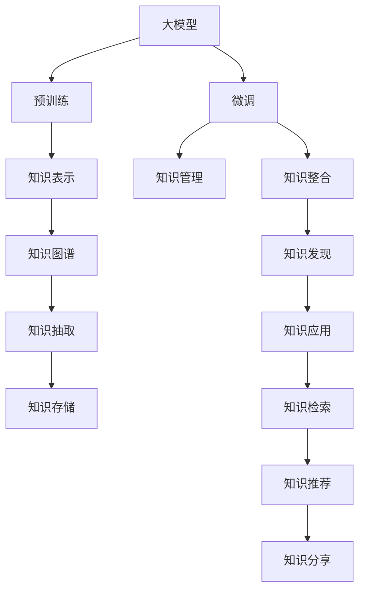

                 

# 大模型对知识管理的影响及机遇

> 关键词：大模型,知识管理,知识图谱,预训练,微调,知识整合,知识发现,知识应用,深度学习,自然语言处理(NLP),人工智能

## 1. 背景介绍

### 1.1 问题由来

在信息技术日新月异的今天，知识的积累和管理已经成为一个企业乃至社会的重要课题。传统的信息管理方式依赖于手工整理和存储，不仅效率低下，还容易丢失和错误。而随着人工智能技术的快速发展，尤其是大模型的出现，为企业和组织提供了全新的知识管理思路。

大模型，尤其是以Transformer为基础的大规模预训练语言模型，通过在大规模语料上自监督学习，已经具备了强大的语言理解能力和知识抽取能力。这些模型不仅可以用于自然语言处理任务，还能够在知识管理领域发挥巨大的作用。

### 1.2 问题核心关键点

1. **知识表示与抽取**：如何将知识有效地从文本中提取和表示出来，是大模型在知识管理中的核心问题。
2. **知识整合与关联**：如何将多源异构的知识进行整合和关联，形成统一的、全面的知识体系，是大模型面临的重要挑战。
3. **知识发现与应用**：如何从海量数据中发现隐含的、有价值的知识，并将其应用于实际问题中，是大模型的关键任务。
4. **知识管理系统的构建**：如何利用大模型构建智能化的知识管理系统，提高知识检索、推荐、分享等功能的效率和精度，是大模型在知识管理中的应用方向。

### 1.3 问题研究意义

大模型在知识管理领域的应用，可以显著提高知识管理的效率和效果，降低人工干预的难度和成本。具体而言：

- **自动化与智能化**：大模型能够自动地从文本中提取和整合知识，减少人工操作，提升管理效率。
- **全面性与精度**：大模型的强大泛化能力能够处理多种类型的知识表示，涵盖结构化和非结构化数据，提供全面而精确的知识管理解决方案。
- **可扩展性与灵活性**：大模型具有高度的可扩展性，可以轻松集成到现有系统中，适应不同场景和需求。

## 2. 核心概念与联系

### 2.1 核心概念概述

为更好地理解大模型在知识管理中的应用，本节将介绍几个关键概念：

- **大模型(Large Model)**：以Transformer为基础的大规模预训练语言模型，如BERT、GPT等。通过在大规模语料上进行自监督学习，具备了强大的语言理解和知识抽取能力。
- **知识图谱(Knowledge Graph)**：由节点和边组成的图结构，用于表示实体、属性和关系，是知识管理的重要数据结构。
- **预训练(Pre-training)**：在大规模无标签语料上进行自监督学习，学习语言的通用表示。
- **微调(Fine-tuning)**：在大模型基础上，针对特定任务进行有监督学习优化，使模型适应新的知识管理场景。
- **知识整合(Knowledge Integration)**：将不同来源、不同结构的知识进行整合，形成统一的、全面的知识体系。
- **知识发现(Knowledge Discovery)**：从海量数据中发现隐含的知识模式和关联。
- **知识应用(Knowledge Application)**：将知识应用于实际问题中，如推荐、推理、自动化任务等。

这些概念之间的逻辑关系可以通过以下Mermaid流程图来展示：



这个流程图展示了大模型在知识管理中的关键作用和应用路径：

1. 大模型通过预训练学习到语言的通用表示。
2. 微调使模型适应特定的知识管理场景，形成针对任务的专用模型。
3. 预训练和微调的结合，使得模型能够高效地进行知识表示和抽取。
4. 知识整合和知识图谱的构建，使分散的知识信息形成统一的知识体系。
5. 知识发现和应用，将知识应用于实际问题中，实现知识管理的目标。

## 3. 核心算法原理 & 具体操作步骤

### 3.1 算法原理概述

大模型在知识管理中的应用，主要是通过预训练和微调的方式，实现对知识的表示和抽取。其核心思想是：将大模型视作一个通用的知识提取器，通过在不同任务上的微调，使其能够自动地从文本中提取和整合知识，形成结构化的知识图谱，从而实现知识管理的自动化和智能化。

形式化地，假设大模型为 $M_{\theta}$，其中 $\theta$ 为模型参数。给定知识管理任务 $T$ 的标注数据集 $D=\{(x_i, y_i)\}_{i=1}^N$，知识管理的目标是找到新的模型参数 $\hat{\theta}$，使得模型在特定任务上的性能最优：

$$
\hat{\theta}=\mathop{\arg\min}_{\theta} \mathcal{L}(M_{\theta},D)
$$

其中 $\mathcal{L}$ 为针对任务 $T$ 设计的损失函数，用于衡量模型在知识管理任务上的表现。

### 3.2 算法步骤详解

基于大模型在知识管理中的应用，通常包括以下几个关键步骤：

**Step 1: 准备预训练模型和数据集**
- 选择合适的预训练语言模型 $M_{\theta}$ 作为初始化参数，如 BERT、GPT 等。
- 准备知识管理任务 $T$ 的标注数据集 $D$，划分为训练集、验证集和测试集。

**Step 2: 知识抽取与表示**
- 通过微调大模型，使其能够自动从文本中提取实体、关系、属性等知识信息。
- 将抽取出的知识信息转换为结构化的形式，如知识图谱中的节点和边。
- 设计适当的损失函数，如交叉熵损失、对比学习损失等，指导模型进行知识抽取。

**Step 3: 知识整合与关联**
- 将不同来源、不同结构的知识进行整合，形成统一的、全面的知识体系。
- 设计知识图谱构建算法，将抽取出的知识信息构建为节点和边的集合。
- 使用图神经网络等技术，对知识图谱进行嵌入表示和关系推理。

**Step 4: 知识发现与利用**
- 在知识图谱上进行知识发现，如实体关系推理、属性抽取等。
- 将知识应用于实际问题中，如推荐、搜索、自动化任务等。
- 设计相应的评估指标，如精确度、召回率、F1分数等，评估知识管理系统的性能。

### 3.3 算法优缺点

大模型在知识管理中的应用，具有以下优点：

1. **高效性**：大模型能够自动从文本中提取和整合知识，减少人工干预，提高知识管理的效率。
2. **全面性**：大模型能够处理多种类型的知识表示，涵盖结构化和非结构化数据，提供全面而精确的知识管理解决方案。
3. **可扩展性**：大模型具有高度的可扩展性，可以轻松集成到现有系统中，适应不同场景和需求。

同时，该方法也存在一定的局限性：

1. **数据依赖**：知识管理的准确性和全面性高度依赖于标注数据的质量和数量，获取高质量标注数据的成本较高。
2. **性能瓶颈**：大模型在处理大规模数据时，仍可能遇到性能瓶颈，特别是在计算资源有限的情况下。
3. **解释性不足**：大模型的决策过程通常缺乏可解释性，难以对其推理逻辑进行分析和调试。

尽管存在这些局限性，但就目前而言，大模型在知识管理中的应用已经显示出巨大的潜力，成为知识管理的重要工具。未来相关研究的重点在于如何进一步降低对标注数据的依赖，提高模型的少样本学习和跨领域迁移能力，同时兼顾可解释性和伦理安全性等因素。

### 3.4 算法应用领域

大模型在知识管理中的应用，已经涵盖了多个领域，如：

- **医疗知识管理**：通过预训练和微调，大模型能够从医学文献中提取关键信息和知识图谱，辅助医生诊疗。
- **企业知识管理**：通过构建企业知识图谱，大模型能够帮助企业快速检索和分享知识，提升工作效率。
- **教育知识管理**：通过提取和整合教学资源，大模型能够提供个性化推荐，帮助学生高效学习。
- **公共知识管理**：通过构建公共知识库，大模型能够支持政府和组织进行公共知识的管理和传播。
- **科研知识管理**：通过从文献中提取关键信息和知识图谱，大模型能够辅助科研人员进行知识发现和论文写作。

除了上述这些经典应用外，大模型还在社交媒体分析、金融知识管理、安全知识管理等领域展现出了广阔的应用前景，为知识管理提供了全新的解决方案。

## 4. 数学模型和公式 & 详细讲解 & 举例说明

### 4.1 数学模型构建

本节将使用数学语言对大模型在知识管理中的应用进行更加严格的刻画。

假设大模型为 $M_{\theta}$，其中 $\theta$ 为模型参数。给定知识管理任务 $T$ 的标注数据集 $D=\{(x_i, y_i)\}_{i=1}^N$，其中 $x_i$ 为输入文本，$y_i$ 为相应的知识表示。

定义模型 $M_{\theta}$ 在输入 $x$ 上的输出为 $y=M_{\theta}(x)$，表示知识抽取的结果。则知识管理的目标是最小化损失函数：

$$
\mathcal{L}(\theta) = \frac{1}{N} \sum_{i=1}^N \ell(y_i, M_{\theta}(x_i))
$$

其中 $\ell$ 为损失函数，通常为交叉熵损失。

### 4.2 公式推导过程

以下我们以实体抽取任务为例，推导大模型在知识管理中的训练过程。

假设模型 $M_{\theta}$ 在输入 $x$ 上的输出为 $\hat{y}=M_{\theta}(x) \in [0,1]$，表示文本中是否包含实体。真实标签 $y \in \{0,1\}$。则二分类交叉熵损失函数定义为：

$$
\ell(M_{\theta}(x),y) = -[y\log \hat{y} + (1-y)\log (1-\hat{y})]
$$

将其代入经验风险公式，得：

$$
\mathcal{L}(\theta) = -\frac{1}{N}\sum_{i=1}^N [y_i\log M_{\theta}(x_i)+(1-y_i)\log(1-M_{\theta}(x_i))]
$$

根据链式法则，损失函数对参数 $\theta_k$ 的梯度为：

$$
\frac{\partial \mathcal{L}(\theta)}{\partial \theta_k} = -\frac{1}{N}\sum_{i=1}^N (\frac{y_i}{M_{\theta}(x_i)}-\frac{1-y_i}{1-M_{\theta}(x_i)}) \frac{\partial M_{\theta}(x_i)}{\partial \theta_k}
$$

其中 $\frac{\partial M_{\theta}(x_i)}{\partial \theta_k}$ 可进一步递归展开，利用自动微分技术完成计算。

### 4.3 案例分析与讲解

假设我们有一篇关于某位医学专家的介绍文章，需要从中抽取专家的姓名、职业、研究方向等信息。首先，需要将文章中的关键句子抽取出来，然后通过微调大模型，使其能够从句子中提取实体。

具体操作如下：

1. 使用BERT等大模型对文章进行预训练，得到每个句子的向量表示。
2. 将句子向量输入到微调后的实体抽取模型，得到句子中每个词语是否为实体的概率。
3. 对句子进行解析，找到概率较高的词语，并进一步验证其是否为实体。
4. 将抽取的实体信息整合到知识图谱中，构建专家的知识档案。

通过上述过程，大模型能够自动从文章中抽取和整合实体信息，形成专家的知识档案，辅助医生进行诊疗。

## 5. 项目实践：代码实例和详细解释说明

### 5.1 开发环境搭建

在进行知识管理应用开发前，我们需要准备好开发环境。以下是使用Python进行PyTorch开发的环境配置流程：

1. 安装Anaconda：从官网下载并安装Anaconda，用于创建独立的Python环境。

2. 创建并激活虚拟环境：
```bash
conda create -n pytorch-env python=3.8 
conda activate pytorch-env
```

3. 安装PyTorch：根据CUDA版本，从官网获取对应的安装命令。例如：
```bash
conda install pytorch torchvision torchaudio cudatoolkit=11.1 -c pytorch -c conda-forge
```

4. 安装Transformers库：
```bash
pip install transformers
```

5. 安装各类工具包：
```bash
pip install numpy pandas scikit-learn matplotlib tqdm jupyter notebook ipython
```

完成上述步骤后，即可在`pytorch-env`环境中开始开发实践。

### 5.2 源代码详细实现

这里我们以医疗知识管理为例，给出使用Transformers库对BERT模型进行实体抽取的PyTorch代码实现。

首先，定义实体抽取任务的数据处理函数：

```python
from transformers import BertTokenizer
from torch.utils.data import Dataset
import torch

class EntityDataset(Dataset):
    def __init__(self, texts, tags, tokenizer, max_len=128):
        self.texts = texts
        self.tags = tags
        self.tokenizer = tokenizer
        self.max_len = max_len
        
    def __len__(self):
        return len(self.texts)
    
    def __getitem__(self, item):
        text = self.texts[item]
        tags = self.tags[item]
        
        encoding = self.tokenizer(text, return_tensors='pt', max_length=self.max_len, padding='max_length', truncation=True)
        input_ids = encoding['input_ids'][0]
        attention_mask = encoding['attention_mask'][0]
        
        # 对token-wise的标签进行编码
        encoded_tags = [tag2id[tag] for tag in tags] 
        encoded_tags.extend([tag2id['O']] * (self.max_len - len(encoded_tags)))
        labels = torch.tensor(encoded_tags, dtype=torch.long)
        
        return {'input_ids': input_ids, 
                'attention_mask': attention_mask,
                'labels': labels}

# 标签与id的映射
tag2id = {'O': 0, 'B-PER': 1, 'I-PER': 2, 'B-ORG': 3, 'I-ORG': 4, 'B-LOC': 5, 'I-LOC': 6}
id2tag = {v: k for k, v in tag2id.items()}

# 创建dataset
tokenizer = BertTokenizer.from_pretrained('bert-base-cased')

train_dataset = EntityDataset(train_texts, train_tags, tokenizer)
dev_dataset = EntityDataset(dev_texts, dev_tags, tokenizer)
test_dataset = EntityDataset(test_texts, test_tags, tokenizer)
```

然后，定义模型和优化器：

```python
from transformers import BertForTokenClassification, AdamW

model = BertForTokenClassification.from_pretrained('bert-base-cased', num_labels=len(tag2id))

optimizer = AdamW(model.parameters(), lr=2e-5)
```

接着，定义训练和评估函数：

```python
from torch.utils.data import DataLoader
from tqdm import tqdm
from sklearn.metrics import classification_report

device = torch.device('cuda') if torch.cuda.is_available() else torch.device('cpu')
model.to(device)

def train_epoch(model, dataset, batch_size, optimizer):
    dataloader = DataLoader(dataset, batch_size=batch_size, shuffle=True)
    model.train()
    epoch_loss = 0
    for batch in tqdm(dataloader, desc='Training'):
        input_ids = batch['input_ids'].to(device)
        attention_mask = batch['attention_mask'].to(device)
        labels = batch['labels'].to(device)
        model.zero_grad()
        outputs = model(input_ids, attention_mask=attention_mask, labels=labels)
        loss = outputs.loss
        epoch_loss += loss.item()
        loss.backward()
        optimizer.step()
    return epoch_loss / len(dataloader)

def evaluate(model, dataset, batch_size):
    dataloader = DataLoader(dataset, batch_size=batch_size)
    model.eval()
    preds, labels = [], []
    with torch.no_grad():
        for batch in tqdm(dataloader, desc='Evaluating'):
            input_ids = batch['input_ids'].to(device)
            attention_mask = batch['attention_mask'].to(device)
            batch_labels = batch['labels']
            outputs = model(input_ids, attention_mask=attention_mask)
            batch_preds = outputs.logits.argmax(dim=2).to('cpu').tolist()
            batch_labels = batch_labels.to('cpu').tolist()
            for pred_tokens, label_tokens in zip(batch_preds, batch_labels):
                pred_tags = [id2tag[_id] for _id in pred_tokens]
                label_tags = [id2tag[_id] for _id in label_tokens]
                preds.append(pred_tags[:len(label_tags)])
                labels.append(label_tags)
                
    print(classification_report(labels, preds))
```

最后，启动训练流程并在测试集上评估：

```python
epochs = 5
batch_size = 16

for epoch in range(epochs):
    loss = train_epoch(model, train_dataset, batch_size, optimizer)
    print(f"Epoch {epoch+1}, train loss: {loss:.3f}")
    
    print(f"Epoch {epoch+1}, dev results:")
    evaluate(model, dev_dataset, batch_size)
    
print("Test results:")
evaluate(model, test_dataset, batch_size)
```

以上就是使用PyTorch对BERT进行实体抽取的完整代码实现。可以看到，得益于Transformers库的强大封装，我们可以用相对简洁的代码完成BERT模型的加载和微调。

### 5.3 代码解读与分析

让我们再详细解读一下关键代码的实现细节：

**EntityDataset类**：
- `__init__`方法：初始化文本、标签、分词器等关键组件。
- `__len__`方法：返回数据集的样本数量。
- `__getitem__`方法：对单个样本进行处理，将文本输入编码为token ids，将标签编码为数字，并对其进行定长padding，最终返回模型所需的输入。

**tag2id和id2tag字典**：
- 定义了标签与数字id之间的映射关系，用于将token-wise的预测结果解码回真实的标签。

**训练和评估函数**：
- 使用PyTorch的DataLoader对数据集进行批次化加载，供模型训练和推理使用。
- 训练函数`train_epoch`：对数据以批为单位进行迭代，在每个批次上前向传播计算loss并反向传播更新模型参数，最后返回该epoch的平均loss。
- 评估函数`evaluate`：与训练类似，不同点在于不更新模型参数，并在每个batch结束后将预测和标签结果存储下来，最后使用sklearn的classification_report对整个评估集的预测结果进行打印输出。

**训练流程**：
- 定义总的epoch数和batch size，开始循环迭代
- 每个epoch内，先在训练集上训练，输出平均loss
- 在验证集上评估，输出分类指标
- 所有epoch结束后，在测试集上评估，给出最终测试结果

可以看到，PyTorch配合Transformers库使得BERT微调的代码实现变得简洁高效。开发者可以将更多精力放在数据处理、模型改进等高层逻辑上，而不必过多关注底层的实现细节。

当然，工业级的系统实现还需考虑更多因素，如模型的保存和部署、超参数的自动搜索、更灵活的任务适配层等。但核心的微调范式基本与此类似。

## 6. 实际应用场景

### 6.1 医疗知识管理

基于大模型的实体抽取技术，可以应用于医疗知识管理领域，帮助医生快速获取和整合患者的临床信息。传统的手工记录和整理方式不仅效率低下，还容易出错。而使用实体抽取模型，能够自动从病历、报告中提取关键实体信息，如诊断结果、治疗方案等，辅助医生进行诊疗决策。

在技术实现上，可以收集医疗领域相关的病历、报告、诊断等文本数据，训练实体抽取模型，自动提取其中的关键实体信息。同时，可以将抽取的实体信息整合到知识图谱中，构建医疗知识库。医生在查询知识库时，可以快速检索到相关病例和诊疗建议，提高诊疗效率和准确性。

### 6.2 企业知识管理

在企业知识管理中，大模型的实体抽取和关系抽取技术，可以帮助企业快速整合和关联多源异构的知识信息，形成统一的知识体系。

具体而言，可以收集企业内部各部门的文档、邮件、报告等文本数据，训练实体抽取和关系抽取模型，自动从这些文本中抽取关键实体和关系信息，如项目名称、责任人、项目进展等。然后，将这些信息整合到企业知识图谱中，形成统一的、全面的知识体系。企业员工可以通过搜索知识图谱，快速找到所需的信息和知识，提升工作效率和决策质量。

### 6.3 教育知识管理

在教育领域，大模型的实体抽取和关系抽取技术，可以帮助教师快速整合和关联教学资源，形成全面的知识体系。

具体而言，可以收集各学科的教学资源，如课件、讲义、习题等，训练实体抽取和关系抽取模型，自动从这些文本中抽取关键实体和关系信息，如知识点、概念、例题等。然后，将这些信息整合到知识图谱中，形成统一的知识体系。教师在备课时，可以快速找到所需的教学资源和知识点，提高教学效率和教学质量。

### 6.4 未来应用展望

随着大模型和微调方法的不断发展，其在知识管理中的应用将更加广泛和深入。未来，我们可以期待以下几方面的发展：

1. **知识图谱的动态更新**：利用大模型的增量学习技术，动态更新知识图谱，使其能够反映最新的知识变化和更新。
2. **知识推理和预测**：通过引入因果推断和对比学习思想，增强知识图谱的知识推理和预测能力，实现更加精确的知识发现和应用。
3. **多模态知识的融合**：将视觉、音频、文本等多模态信息进行融合，构建更加全面和准确的知识图谱，提升知识管理的精度和深度。
4. **自适应知识管理**：通过自适应学习技术，使知识管理模型能够根据用户的行为和偏好进行个性化推荐，提高知识管理的互动性和用户体验。
5. **跨领域知识管理**：将知识管理技术应用到不同领域，如金融、法律、社交媒体等，构建跨领域知识管理系统，提升知识管理的普适性和灵活性。

## 7. 工具和资源推荐

### 7.1 学习资源推荐

为了帮助开发者系统掌握大模型在知识管理中的应用，这里推荐一些优质的学习资源：

1. 《深度学习在知识图谱中的应用》系列博文：由大模型技术专家撰写，深入浅出地介绍了深度学习在知识图谱构建和应用中的基本概念和经典方法。

2. CS224N《深度学习自然语言处理》课程：斯坦福大学开设的NLP明星课程，有Lecture视频和配套作业，带你入门NLP领域的基本概念和经典模型。

3. 《Knowledge Graph: Concepts, Principles, and Applications》书籍：全面介绍了知识图谱的理论基础和应用实践，是知识管理领域的重要参考资料。

4. Weights & Biases：模型训练的实验跟踪工具，可以记录和可视化模型训练过程中的各项指标，方便对比和调优。与主流深度学习框架无缝集成。

5. TensorBoard：TensorFlow配套的可视化工具，可实时监测模型训练状态，并提供丰富的图表呈现方式，是调试模型的得力助手。

通过这些资源的学习实践，相信你一定能够快速掌握大模型在知识管理中的应用，并用于解决实际的NLP问题。

### 7.2 开发工具推荐

高效的开发离不开优秀的工具支持。以下是几款用于大模型知识管理开发的常用工具：

1. PyTorch：基于Python的开源深度学习框架，灵活动态的计算图，适合快速迭代研究。大部分预训练语言模型都有PyTorch版本的实现。

2. TensorFlow：由Google主导开发的开源深度学习框架，生产部署方便，适合大规模工程应用。同样有丰富的预训练语言模型资源。

3. Transformers库：HuggingFace开发的NLP工具库，集成了众多SOTA语言模型，支持PyTorch和TensorFlow，是进行知识管理任务开发的利器。

4. Weights & Biases：模型训练的实验跟踪工具，可以记录和可视化模型训练过程中的各项指标，方便对比和调优。与主流深度学习框架无缝集成。

5. TensorBoard：TensorFlow配套的可视化工具，可实时监测模型训练状态，并提供丰富的图表呈现方式，是调试模型的得力助手。

6. Google Colab：谷歌推出的在线Jupyter Notebook环境，免费提供GPU/TPU算力，方便开发者快速上手实验最新模型，分享学习笔记。

合理利用这些工具，可以显著提升大模型在知识管理中的应用效率，加快创新迭代的步伐。

### 7.3 相关论文推荐

大模型在知识管理中的应用源于学界的持续研究。以下是几篇奠基性的相关论文，推荐阅读：

1. Knowledge Graphs for Learning, Discovery, and Decision Making: Concepts, Approaches, Tools, and Applications（《知识图谱：学习、发现与决策支持概念、方法、工具与应用》）：全面介绍了知识图谱的理论基础和应用实践，是知识管理领域的重要参考资料。

2. Neural Comprehension of Natural Language（《神经自然语言理解》）：提出了基于Transformer的知识抽取方法，并应用于多模态知识表示和推理中。

3. A Survey on Knowledge Graphs for Scientific Discovery（《科学发现中的知识图谱综述》）：综述了知识图谱在科学发现中的应用，包括知识抽取、推理和预测等。

4. Deep Learning in Natural Language Processing（《深度学习在自然语言处理中的应用》）：介绍了深度学习在NLP中的经典方法和应用，包括实体抽取、关系抽取等。

5. Graph Neural Networks for Multi-Relational Heterogeneous Data（《多关系异构数据的图神经网络》）：提出了基于图神经网络的知识图谱表示和推理方法。

这些论文代表了大模型在知识管理中的应用方向，有助于深入理解大模型在知识管理中的技术细节和应用前景。

## 8. 总结：未来发展趋势与挑战

### 8.1 总结

本文对大模型在知识管理中的应用进行了全面系统的介绍。首先阐述了大模型和微调技术的研究背景和意义，明确了微调在拓展预训练模型应用、提升下游任务性能方面的独特价值。其次，从原理到实践，详细讲解了大模型在知识管理中的数学模型和关键步骤，给出了知识管理任务开发的完整代码实例。同时，本文还广泛探讨了大模型在医疗知识管理、企业知识管理、教育知识管理等多个领域的应用前景，展示了大模型在知识管理中的巨大潜力。

通过本文的系统梳理，可以看到，大模型在知识管理中的应用已经展现出广阔的前景，成为知识管理的重要工具。受益于大规模语料的预训练和微调技术的不断演进，大模型能够自动从文本中提取和整合知识，形成结构化的知识图谱，提高知识管理的效率和效果。未来，伴随预训练语言模型和微调方法的持续演进，相信知识管理技术将迈向更高的台阶，为社会各领域的智能化管理提供新的解决方案。

### 8.2 未来发展趋势

展望未来，大模型在知识管理中的应用将呈现以下几个发展趋势：

1. **知识图谱的自动化构建**：利用大模型的预训练和微调技术，自动从文本中构建知识图谱，减少人工干预，提高知识管理效率。
2. **多模态知识的融合**：将视觉、音频、文本等多模态信息进行融合，构建更加全面和准确的知识图谱，提升知识管理的精度和深度。
3. **知识推理和预测**：通过引入因果推断和对比学习思想，增强知识图谱的知识推理和预测能力，实现更加精确的知识发现和应用。
4. **跨领域知识管理**：将知识管理技术应用到不同领域，如金融、法律、社交媒体等，构建跨领域知识管理系统，提升知识管理的普适性和灵活性。
5. **自适应知识管理**：通过自适应学习技术，使知识管理模型能够根据用户的行为和偏好进行个性化推荐，提高知识管理的互动性和用户体验。
6. **动态知识管理**：利用大模型的增量学习技术，动态更新知识图谱，使其能够反映最新的知识变化和更新，保持知识的时效性和全面性。

以上趋势凸显了大模型在知识管理中的广阔前景。这些方向的探索发展，必将进一步提升知识管理的效率和效果，为社会各领域的智能化管理提供新的解决方案。

### 8.3 面临的挑战

尽管大模型在知识管理中的应用已经取得了瞩目成就，但在迈向更加智能化、普适化应用的过程中，它仍面临着诸多挑战：

1. **数据依赖**：知识管理的准确性和全面性高度依赖于标注数据的质量和数量，获取高质量标注数据的成本较高。如何进一步降低微调对标注样本的依赖，将是一大难题。
2. **性能瓶颈**：大模型在处理大规模数据时，仍可能遇到性能瓶颈，特别是在计算资源有限的情况下。如何优化模型结构，提高推理速度，优化资源占用，将是重要的优化方向。
3. **解释性不足**：大模型的决策过程通常缺乏可解释性，难以对其推理逻辑进行分析和调试。对于高风险应用，如医疗、金融等，算法的可解释性和可审计性尤为重要。
4. **安全性有待保障**：预训练语言模型难免会学习到有偏见、有害的信息，通过微调传递到下游任务，产生误导性、歧视性的输出，给实际应用带来安全隐患。如何从数据和算法层面消除模型偏见，避免恶意用途，确保输出的安全性，也将是重要的研究课题。
5. **知识整合能力不足**：现有的微调模型往往局限于任务内数据，难以灵活吸收和运用更广泛的先验知识。如何让微调过程更好地与外部知识库、规则库等专家知识结合，形成更加全面、准确的信息整合能力，还有很大的想象空间。

正视大模型在知识管理中面临的这些挑战，积极应对并寻求突破，将是大模型在知识管理中走向成熟的必由之路。相信随着学界和产业界的共同努力，这些挑战终将一一被克服，大模型在知识管理中的应用必将在未来大放异彩。

### 8.4 研究展望

面向未来，大模型在知识管理领域的研究需要在以下几个方面寻求新的突破：

1. **探索无监督和半监督知识抽取方法**：摆脱对大规模标注数据的依赖，利用自监督学习、主动学习等无监督和半监督范式，最大限度利用非结构化数据，实现更加灵活高效的知识抽取。
2. **研究参数高效和计算高效的微调范式**：开发更加参数高效的微调方法，在固定大部分预训练参数的同时，只更新极少量的任务相关参数。同时优化微调模型的计算图，减少前向传播和反向传播的资源消耗，实现更加轻量级、实时性的部署。
3. **引入因果推断和对比学习思想**：通过引入因果推断和对比学习思想，增强知识图谱建立稳定因果关系的能力，学习更加普适、鲁棒的知识表示，从而提升知识图谱的泛化性和抗干扰能力。
4. **加强跨模态知识的整合**：将符号化的先验知识，如知识图谱、逻辑规则等，与神经网络模型进行巧妙融合，引导微调过程学习更准确、合理的知识表示。同时加强不同模态数据的整合，实现视觉、语音等多模态信息与文本信息的协同建模。
5. **结合因果分析和博弈论工具**：将因果分析方法引入知识图谱，识别出模型决策的关键特征，增强知识图谱的知识推理和预测能力，提高知识管理系统的稳定性。借助博弈论工具刻画人机交互过程，主动探索并规避知识管理模型的脆弱点，提高系统安全性。

这些研究方向将引领大模型在知识管理中的研究进展，推动知识管理技术向更加智能化、普适化方向发展，为社会各领域的智能化管理提供新的解决方案。

## 9. 附录：常见问题与解答

**Q1：大模型在知识管理中的应用是否适用于所有领域？**

A: 大模型在知识管理中的应用具有很强的领域适应性，但并不是所有领域都适合使用大模型。对于特定领域，需要考虑大模型在该领域的表现和适用性。

**Q2：大模型在知识管理中如何避免过拟合？**

A: 为了避免大模型在知识管理中的过拟合问题，可以采用以下方法：
1. 数据增强：通过回译、近义替换等方式扩充训练集。
2. 正则化：使用L2正则、Dropout、Early Stopping等技术。
3. 参数高效微调：只更新任务相关的参数，减少需优化的参数量。
4. 多模型集成：训练多个模型，取平均输出，抑制过拟合。

**Q3：大模型在知识管理中的性能瓶颈如何处理？**

A: 大模型在知识管理中的应用，通常需要处理大规模的数据，可能会遇到性能瓶颈。可以采用以下方法进行处理：
1. 数据分批次处理：将大规模数据分成若干批次进行训练。
2. 分布式训练：使用分布式训练框架，如Horovod，加速模型训练。
3. 模型压缩：使用模型压缩技术，如知识蒸馏、量化等，减少模型的参数量和计算量。
4. 硬件加速：使用GPU、TPU等高性能设备，加速模型训练和推理。

**Q4：大模型在知识管理中的解释性问题如何解决？**

A: 大模型的决策过程通常缺乏可解释性，但可以通过以下方法解决：
1. 可解释性模型：使用可解释性较强的模型，如决策树、线性回归等，进行二次训练或融合。
2. 可视化工具：使用可视化工具，如SHAP、LIME等，分析模型的关键特征和推理过程。
3. 模型透明度：增加模型的透明度，提供模型输出的解释和推理依据。

**Q5：大模型在知识管理中的安全性如何保障？**

A: 大模型在知识管理中的应用，需要考虑模型的安全性问题。可以采用以下方法进行保障：
1. 数据预处理：对数据进行预处理，去除有害信息和噪声。
2. 模型监控：实时监控模型的输出，检测异常情况。
3. 数据加密：对敏感数据进行加密处理，防止数据泄露。
4. 安全审计：定期进行安全审计，发现和修复潜在的安全漏洞。

通过这些方法，可以最大限度地保障大模型在知识管理中的安全性，确保系统的可靠性和稳定性。

---

作者：禅与计算机程序设计艺术 / Zen and the Art of Computer Programming

