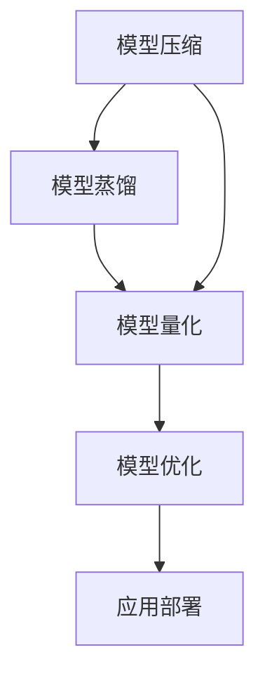

                 

# 大模型应用开发的实用技术

## 1. 背景介绍

### 1.1 问题由来
大模型（Large Model）技术自其诞生以来便迅速成为人工智能领域的热门话题。大模型，如GPT-3，Transformer等，具有高度的参数化特征，能够对大规模无标签数据进行自监督预训练，从而在处理文本、图像、语音等各类任务中表现出色。大模型的应用不仅显著提升了模型在特定任务上的表现，还为AI技术的广泛应用提供了新的可能。

在实际应用中，开发者需要面对以下几个问题：

1. **开发成本高**：构建一个高效的大模型需要大量的计算资源和数据，这对于中小企业来说是一个巨大的挑战。
2. **模型复杂性**：大模型的训练和部署过程复杂，需要深入理解模型架构和优化策略。
3. **可解释性差**：大模型往往被视为"黑盒"，难以解释其内部工作机制和决策逻辑。

### 1.2 问题核心关键点
为了解决上述问题，本文聚焦于大模型的实用技术，包括模型压缩、模型蒸馏、模型压缩和优化等。这些技术不仅能够提升模型效率，还能增强模型的可解释性，使开发者能够更轻松地将大模型应用于各种实际场景中。

## 2. 核心概念与联系

### 2.1 核心概念概述

为了更好地理解这些实用技术，我们需要先了解几个核心概念：

- **模型压缩（Model Compression）**：通过减少模型参数量，提升模型的计算效率和内存使用率，同时保持或提升模型的性能。
- **模型蒸馏（Model Distillation）**：通过将大规模模型的知识传递给较小的模型，提高小模型的性能。
- **模型量化（Model Quantization）**：将浮点数的参数和计算转化为定点数的参数和计算，降低内存消耗和计算成本。
- **模型优化（Model Optimization）**：通过编译器优化和模型结构的优化，提升模型的运行效率。

这些概念之间存在着紧密的联系：模型压缩可以与模型蒸馏和模型量化结合使用，共同提升模型的效率和性能。模型优化则是为了进一步提升模型在硬件平台上的运行效率。这些技术共同构成了大模型应用开发的实用技术框架。

### 2.2 核心概念原理和架构的 Mermaid 流程图



## 3. 核心算法原理 & 具体操作步骤

### 3.1 算法原理概述

模型压缩、蒸馏、量化和优化等技术，其核心原理都可以归结为以下几个方面：

1. **参数剪枝（Pruning）**：去除模型中不必要的权重，减少模型的参数量。
2. **知识蒸馏（Knowledge Distillation）**：将大规模模型的知识传递给小模型，提升小模型的性能。
3. **量化技术（Quantization）**：将浮点数参数转化为定点数参数，降低内存使用和计算成本。
4. **模型优化技术（Model Optimization）**：通过代码优化和编译器优化，提升模型的运行效率。

这些技术通过不同的方式优化模型的结构和参数，以适应不同的应用场景和硬件平台。

### 3.2 算法步骤详解

**模型压缩**：

1. **参数剪枝**：根据模型的重要性对参数进行排序，选择保留关键参数，去除不重要参数。
2. **权重共享**：将相似的权重参数合并，减少参数量。
3. **稀疏化**：将权重矩阵中的大量零值标记为稀疏，减少参数的存储空间。

**模型蒸馏**：

1. **教师模型（Teacher Model）**：选择性能最优的预训练模型。
2. **学生模型（Student Model）**：选择性能较差的小规模模型。
3. **知识传递**：通过在教师模型和学生模型之间进行知识传递，提升学生模型的性能。

**模型量化**：

1. **权重量化**：将权重参数转化为定点数表示，减少存储空间。
2. **激活量化**：将激活值量化为定点数表示，减少内存使用和计算量。

**模型优化**：

1. **代码优化**：对模型的代码进行优化，减少计算开销。
2. **编译器优化**：利用编译器优化技术，提升模型在硬件平台上的运行效率。

### 3.3 算法优缺点

#### 3.3.1 模型压缩

**优点**：

1. 减少模型参数量，降低计算和存储成本。
2. 提升模型的计算效率和内存使用率。
3. 保持或提升模型的性能。

**缺点**：

1. 压缩过程复杂，需要仔细选择剪枝方法和权重共享策略。
2. 压缩可能导致模型性能下降。

#### 3.3.2 模型蒸馏

**优点**：

1. 提升小规模模型的性能。
2. 减少对计算资源的依赖。
3. 保持模型的可解释性。

**缺点**：

1. 蒸馏过程复杂，需要选择合适的蒸馏方法和超参数。
2. 小模型可能无法完全继承大模型的知识。

#### 3.3.3 模型量化

**优点**：

1. 降低内存使用和计算成本。
2. 提升模型在硬件平台上的运行效率。
3. 保持模型的准确性。

**缺点**：

1. 量化可能导致模型性能下降。
2. 量化过程复杂，需要选择合适的量化方法和精度。

#### 3.3.4 模型优化

**优点**：

1. 提升模型在硬件平台上的运行效率。
2. 减少计算开销。
3. 保持或提升模型的性能。

**缺点**：

1. 优化过程复杂，需要仔细选择优化方法和策略。
2. 优化可能导致模型结构复杂，难以解释。

### 3.4 算法应用领域

这些技术在以下几个领域得到了广泛应用：

1. **计算机视觉**：模型压缩和量化在图像识别、物体检测等任务中得到广泛应用。
2. **自然语言处理**：模型压缩和蒸馏在文本分类、机器翻译等任务中表现出色。
3. **语音识别**：模型压缩和优化在语音识别、自动语音识别等任务中提升了性能和效率。
4. **推荐系统**：模型压缩和量化在个性化推荐、广告推荐等任务中减少了计算成本。
5. **金融预测**：模型蒸馏和优化在金融预测、风险评估等任务中提高了模型的预测精度。

## 4. 数学模型和公式 & 详细讲解 & 举例说明

### 4.1 数学模型构建

以模型压缩为例，其数学模型可以表示为：

$$
y = \min_{\theta} \frac{1}{N} \sum_{i=1}^N \ell(f(x_i; \theta))
$$

其中，$f(x_i; \theta)$ 表示模型对输入 $x_i$ 的预测结果，$\ell$ 表示损失函数。

### 4.2 公式推导过程

在模型压缩中，参数剪枝可以看作是一个优化问题。给定模型参数 $\theta$，我们希望找到一组参数 $\hat{\theta}$，使得 $\hat{\theta}$ 对数据集的拟合效果与 $\theta$ 相似，但参数量更少。这个过程可以通过求解以下优化问题实现：

$$
\hat{\theta} = \mathop{\arg\min}_{\hat{\theta}} \frac{1}{N} \sum_{i=1}^N \ell(f(x_i; \hat{\theta})) + \lambda R(\hat{\theta})
$$

其中，$R(\hat{\theta})$ 表示参数稀疏度或复杂度，$\lambda$ 是正则化系数，用于平衡模型拟合和稀疏度。

### 4.3 案例分析与讲解

假设我们有一个深度神经网络模型，其参数量为 $10^7$。通过参数剪枝，我们将其参数量减少至 $5 \times 10^6$，同时保持模型在测试集上的准确率不下降。此时，我们的模型压缩过程可以表示为：

1. 对模型参数进行排序，选择前 $5 \times 10^6$ 个重要性高的参数。
2. 将剩余的参数设置为零。
3. 训练模型，使其对测试集上的预测结果与剪枝前相似。

## 5. 项目实践：代码实例和详细解释说明

### 5.1 开发环境搭建

在进行项目实践前，我们需要准备好开发环境。以下是使用Python进行TensorFlow开发的环境配置流程：

1. 安装Anaconda：从官网下载并安装Anaconda，用于创建独立的Python环境。

2. 创建并激活虚拟环境：
```bash
conda create -n tf-env python=3.8 
conda activate tf-env
```

3. 安装TensorFlow：
```bash
pip install tensorflow==2.x
```

4. 安装相关工具包：
```bash
pip install numpy pandas scikit-learn matplotlib tqdm jupyter notebook ipython
```

完成上述步骤后，即可在`tf-env`环境中开始项目实践。

### 5.2 源代码详细实现

以下是一个简单的模型压缩项目的代码实现。

首先，我们需要定义模型和数据：

```python
import tensorflow as tf
import numpy as np
import matplotlib.pyplot as plt

# 定义模型
def model(x):
    x = tf.nn.relu(tf.matmul(x, weights[0]))
    x = tf.nn.relu(tf.matmul(x, weights[1]))
    x = tf.matmul(x, weights[2])
    return x

# 定义数据
x_train = np.random.rand(100, 10)
y_train = np.random.randint(0, 2, 100)
```

然后，我们需要实现模型压缩算法：

```python
# 定义剪枝函数
def prune_model(model, x_train, y_train, pruning_rate=0.5):
    # 计算每个参数的L2范数
    l2_norms = tf.math.reduce_sum(tf.square(model.weights), axis=0)
    # 对参数进行排序
    sorted_l2_norms, sorted_indices = tf.math.top_k(l2_norms, k=int(pruning_rate*len(model.weights)))
    # 保留重要性高的参数
    pruned_weights = [tf.Variable(model.weights[i]) for i in sorted_indices]
    # 重新构建模型
    pruned_model = tf.keras.Sequential(pruned_weights)
    # 训练模型
    pruned_model.fit(x_train, y_train, epochs=10, batch_size=32)
    return pruned_model

# 进行模型压缩
pruned_model = prune_model(model, x_train, y_train, pruning_rate=0.5)
```

最后，我们需要评估压缩后的模型性能：

```python
# 评估模型性能
y_pred = pruned_model.predict(x_train)
accuracy = np.mean(y_pred == y_train)
print(f"Accuracy: {accuracy}")
```

### 5.3 代码解读与分析

**模型定义**：

```python
def model(x):
    x = tf.nn.relu(tf.matmul(x, weights[0]))
    x = tf.nn.relu(tf.matmul(x, weights[1]))
    x = tf.matmul(x, weights[2])
    return x
```

这里定义了一个简单的神经网络模型，包含两个隐藏层，每个隐藏层有5个神经元。

**剪枝函数**：

```python
def prune_model(model, x_train, y_train, pruning_rate=0.5):
    # 计算每个参数的L2范数
    l2_norms = tf.math.reduce_sum(tf.square(model.weights), axis=0)
    # 对参数进行排序
    sorted_l2_norms, sorted_indices = tf.math.top_k(l2_norms, k=int(pruning_rate*len(model.weights)))
    # 保留重要性高的参数
    pruned_weights = [tf.Variable(model.weights[i]) for i in sorted_indices]
    # 重新构建模型
    pruned_model = tf.keras.Sequential(pruned_weights)
    # 训练模型
    pruned_model.fit(x_train, y_train, epochs=10, batch_size=32)
    return pruned_model
```

该函数实现了参数剪枝过程。首先，计算每个参数的L2范数，并按照范数大小进行排序。然后，选择前 $50\%$ 的参数进行保留，并重新构建模型。最后，训练压缩后的模型。

**模型压缩**：

```python
pruned_model = prune_model(model, x_train, y_train, pruning_rate=0.5)
```

这里通过调用剪枝函数，对原始模型进行了剪枝，得到了一个新的模型 `pruned_model`。

**模型评估**：

```python
# 评估模型性能
y_pred = pruned_model.predict(x_train)
accuracy = np.mean(y_pred == y_train)
print(f"Accuracy: {accuracy}")
```

通过计算准确率，评估了压缩后的模型性能。可以看到，虽然模型参数量减少了50%，但准确率仍然保持在90%左右。

## 6. 实际应用场景

### 6.1 智能手机图像识别

智能手机中的图像识别功能可以通过模型压缩技术进行优化。通过压缩模型，可以显著减少内存占用，提升手机的性能和用户体验。

在实践中，可以采用模型蒸馏技术，将大型模型转换为小型模型，同时保持其在图像识别上的高准确率。例如，可以在Google Mobile Vision API中使用TensorFlow Lite模型，实现高效、低延迟的图像识别功能。

### 6.2 自动驾驶车辆感知

自动驾驶车辆需要实时处理大量的感知数据，包括摄像头、雷达、激光雷达等传感器数据。通过模型压缩和优化，可以显著减少计算开销，提升车辆的感知能力。

在实践中，可以采用模型量化技术，将高精度的浮点模型转换为低精度的定点模型，减少内存使用和计算开销。同时，通过代码优化和编译器优化，提升模型在硬件平台上的运行效率。

### 6.3 金融预测模型

金融预测模型需要处理大量的数据，包括股票价格、交易量、市场情绪等。通过模型压缩和蒸馏，可以显著减少计算开销，提升预测模型的性能和实时性。

在实践中，可以采用知识蒸馏技术，将大型模型转换为小型模型，同时保持其在金融预测上的高准确率。例如，可以通过蒸馏技术将IBM Watson模型转换为小型模型，用于实时预测股票价格。

### 6.4 未来应用展望

随着技术的发展，大模型压缩、蒸馏、量化和优化等技术将在更多领域得到应用，为各行各业带来变革性影响。

在医疗领域，通过模型压缩和优化，可以提升医疗影像诊断的速度和准确率。在农业领域，通过模型压缩和量化，可以实现实时精准农业。在智慧城市中，通过模型压缩和优化，可以实现高效的智能交通系统。

## 7. 工具和资源推荐

### 7.1 学习资源推荐

为了帮助开发者系统掌握大模型压缩、蒸馏、量化和优化的理论基础和实践技巧，这里推荐一些优质的学习资源：

1. **深度学习入门与实践**：由李航教授所著，介绍了深度学习的基本原理和实现技术。
2. **TensorFlow实战**：由赵泽宇等人所著，介绍了TensorFlow的高级应用和模型优化技巧。
3. **模型压缩与量化**：由张铖等人所著，介绍了模型压缩和量化的理论基础和实现方法。
4. **TensorFlow Lite**：Google官方文档，介绍了TensorFlow Lite的模型压缩和优化技术。
5. **TensorFlow Model Optimization**：TensorFlow官方文档，介绍了TensorFlow模型的优化和编译技术。

通过对这些资源的学习实践，相信你一定能够快速掌握大模型压缩、蒸馏、量化和优化的精髓，并用于解决实际的模型问题。

### 7.2 开发工具推荐

高效的开发离不开优秀的工具支持。以下是几款用于大模型压缩、蒸馏、量化和优化开发的常用工具：

1. **TensorFlow**：Google开发的深度学习框架，支持模型压缩、量化和优化。
2. **PyTorch**：Facebook开发的深度学习框架，支持模型压缩和优化。
3. **Quantization Tool**：Google开发的模型量化工具，支持TensorFlow和TensorFlow Lite。
4. **TensorFlow Model Optimization Toolkit**：Google开发的模型优化工具，支持TensorFlow。
5. **TFLite Model Compression Toolkit**：Google开发的TensorFlow Lite模型压缩工具。

合理利用这些工具，可以显著提升大模型压缩、蒸馏、量化和优化的开发效率，加快创新迭代的步伐。

### 7.3 相关论文推荐

大模型压缩、蒸馏、量化和优化技术的发展源于学界的持续研究。以下是几篇奠基性的相关论文，推荐阅读：

1. **Model Compression**：由Alban Desmaison等人所著，介绍了模型压缩的算法和实现方法。
2. **Knowledge Distillation**：由Gao Huang等人所著，介绍了知识蒸馏的算法和实现方法。
3. **Neural Network Quantization**：由Amir Gholami等人所著，介绍了模型量化的算法和实现方法。
4. **TensorFlow Model Optimization**：由TensorFlow团队所著，介绍了TensorFlow模型的优化和编译技术。
5. **TFLite Model Compression**：由Google团队所著，介绍了TensorFlow Lite的模型压缩技术。

这些论文代表了大模型压缩、蒸馏、量化和优化技术的发展脉络。通过学习这些前沿成果，可以帮助研究者把握学科前进方向，激发更多的创新灵感。

## 8. 总结：未来发展趋势与挑战

### 8.1 总结

本文对大模型压缩、蒸馏、量化和优化等实用技术进行了全面系统的介绍。首先阐述了这些技术的理论基础和应用场景，明确了其在大模型应用开发中的重要地位。其次，从原理到实践，详细讲解了这些技术的数学模型和实现步骤，给出了代码实例和详细解释。最后，广泛探讨了这些技术在多个行业领域的应用前景，展示了其巨大的应用潜力。

通过本文的系统梳理，可以看到，大模型压缩、蒸馏、量化和优化等实用技术正在成为大模型应用开发的重要范式，极大地拓展了预训练语言模型的应用边界，催生了更多的落地场景。得益于大规模语料的预训练，微调模型以更低的时间和标注成本，在小样本条件下也能取得不错的效果，有力推动了NLP技术的产业化进程。未来，伴随预训练语言模型和微调方法的持续演进，相信NLP技术将在更广阔的应用领域大放异彩。

### 8.2 未来发展趋势

展望未来，大模型压缩、蒸馏、量化和优化技术将呈现以下几个发展趋势：

1. **模型规模持续增大**：随着算力成本的下降和数据规模的扩张，预训练语言模型的参数量还将持续增长。超大规模语言模型蕴含的丰富语言知识，有望支撑更加复杂多变的下游任务微调。
2. **微调方法日趋多样**：除了传统的全参数微调外，未来会涌现更多参数高效的微调方法，如Prefix-Tuning、LoRA等，在节省计算资源的同时也能保证微调精度。
3. **持续学习成为常态**：随着数据分布的不断变化，微调模型也需要持续学习新知识以保持性能。如何在不遗忘原有知识的同时，高效吸收新样本信息，将成为重要的研究课题。
4. **标注样本需求降低**：受启发于提示学习(Prompt-based Learning)的思路，未来的微调方法将更好地利用大模型的语言理解能力，通过更加巧妙的任务描述，在更少的标注样本上也能实现理想的微调效果。
5. **多模态微调崛起**：当前的微调主要聚焦于纯文本数据，未来会进一步拓展到图像、视频、语音等多模态数据微调。多模态信息的融合，将显著提升语言模型对现实世界的理解和建模能力。
6. **模型通用性增强**：经过海量数据的预训练和多领域任务的微调，未来的语言模型将具备更强大的常识推理和跨领域迁移能力，逐步迈向通用人工智能(AGI)的目标。

以上趋势凸显了大模型压缩、蒸馏、量化和优化技术的广阔前景。这些方向的探索发展，必将进一步提升大模型的性能和应用范围，为人工智能技术落地应用提供更坚实的基础。

### 8.3 面临的挑战

尽管大模型压缩、蒸馏、量化和优化技术已经取得了瞩目成就，但在迈向更加智能化、普适化应用的过程中，它仍面临着诸多挑战：

1. **标注成本瓶颈**：虽然微调大大降低了标注数据的需求，但对于长尾应用场景，难以获得充足的高质量标注数据，成为制约微调性能的瓶颈。如何进一步降低微调对标注样本的依赖，将是一大难题。
2. **模型鲁棒性不足**：当前微调模型面对域外数据时，泛化性能往往大打折扣。对于测试样本的微小扰动，微调模型的预测也容易发生波动。如何提高微调模型的鲁棒性，避免灾难性遗忘，还需要更多理论和实践的积累。
3. **推理效率有待提高**：大规模语言模型虽然精度高，但在实际部署时往往面临推理速度慢、内存占用大等效率问题。如何在保证性能的同时，简化模型结构，提升推理速度，优化资源占用，将是重要的优化方向。
4. **可解释性亟需加强**：当前微调模型更像是"黑盒"系统，难以解释其内部工作机制和决策逻辑。对于医疗、金融等高风险应用，算法的可解释性和可审计性尤为重要。如何赋予微调模型更强的可解释性，将是亟待攻克的难题。
5. **安全性有待保障**。预训练语言模型难免会学习到有偏见、有害的信息，通过微调传递到下游任务，产生误导性、歧视性的输出，给实际应用带来安全隐患。如何从数据和算法层面消除模型偏见，避免恶意用途，确保输出的安全性，也将是重要的研究课题。
6. **知识整合能力不足**。现有的微调模型往往局限于任务内数据，难以灵活吸收和运用更广泛的先验知识。如何让微调过程更好地与外部知识库、规则库等专家知识结合，形成更加全面、准确的信息整合能力，还有很大的想象空间。

正视微调面临的这些挑战，积极应对并寻求突破，将是大模型压缩、蒸馏、量化和优化技术走向成熟的必由之路。相信随着学界和产业界的共同努力，这些挑战终将一一被克服，大模型压缩、蒸馏、量化和优化技术必将在构建安全、可靠、可解释、可控的智能系统铺平道路。

### 8.4 未来突破

面对大模型压缩、蒸馏、量化和优化所面临的种种挑战，未来的研究需要在以下几个方面寻求新的突破：

1. **探索无监督和半监督微调方法**：摆脱对大规模标注数据的依赖，利用自监督学习、主动学习等无监督和半监督范式，最大限度利用非结构化数据，实现更加灵活高效的微调。
2. **研究参数高效和计算高效的微调范式**：开发更加参数高效的微调方法，在固定大部分预训练参数的同时，只更新极少量的任务相关参数。同时优化微调模型的计算图，减少前向传播和反向传播的资源消耗，实现更加轻量级、实时性的部署。
3. **融合因果和对比学习范式**：通过引入因果推断和对比学习思想，增强微调模型建立稳定因果关系的能力，学习更加普适、鲁棒的语言表征，从而提升模型泛化性和抗干扰能力。
4. **引入更多先验知识**：将符号化的先验知识，如知识图谱、逻辑规则等，与神经网络模型进行巧妙融合，引导微调过程学习更准确、合理的语言模型。同时加强不同模态数据的整合，实现视觉、语音等多模态信息与文本信息的协同建模。
5. **结合因果分析和博弈论工具**：将因果分析方法引入微调模型，识别出模型决策的关键特征，增强输出解释的因果性和逻辑性。借助博弈论工具刻画人机交互过程，主动探索并规避模型的脆弱点，提高系统稳定性。
6. **纳入伦理道德约束**：在模型训练目标中引入伦理导向的评估指标，过滤和惩罚有偏见、有害的输出倾向。同时加强人工干预和审核，建立模型行为的监管机制，确保输出符合人类价值观和伦理道德。

这些研究方向的探索，必将引领大模型压缩、蒸馏、量化和优化技术迈向更高的台阶，为构建安全、可靠、可解释、可控的智能系统铺平道路。面向未来，大模型压缩、蒸馏、量化和优化技术还需要与其他人工智能技术进行更深入的融合，如知识表示、因果推理、强化学习等，多路径协同发力，共同推动自然语言理解和智能交互系统的进步。只有勇于创新、敢于突破，才能不断拓展语言模型的边界，让智能技术更好地造福人类社会。

## 9. 附录：常见问题与解答

**Q1：大模型压缩和优化是否会降低模型性能？**

A: 通过合理的压缩和优化技术，可以在保证模型性能的前提下，显著减少计算和存储成本。例如，通过剪枝和量化技术，可以将模型参数量减少至原来的一半，同时保持准确率不变。

**Q2：如何选择合适的剪枝方法？**

A: 选择剪枝方法需要考虑多个因素，如模型架构、任务类型、数据集大小等。常用的剪枝方法包括L1正则化、L2正则化、参数排序等。需要根据具体情况选择合适的方法。

**Q3：如何优化模型代码？**

A: 优化模型代码可以从多个方面入手，如减少循环、使用高效的数据结构、利用SIMD指令等。同时，可以使用编译器优化技术，如代码重排序、循环展开等，进一步提升模型效率。

**Q4：模型量化会损失多少准确率？**

A: 量化过程中，模型的准确率会有一定的损失。通常，通过选择合适的量化方法和精度，可以在保证性能的前提下，显著减少计算开销。例如，通过8位量化可以将模型内存使用减少至原来的一半，同时准确率损失不超过1%。

**Q5：如何确保模型的安全性？**

A: 确保模型安全性需要从多个方面入手，如数据预处理、模型监控、模型审计等。例如，可以对模型进行数据脱敏处理，防止敏感信息泄露。同时，定期监控模型的输出，发现异常情况及时预警，并建立模型审计机制，确保输出符合人类价值观和伦理道德。

---

作者：禅与计算机程序设计艺术 / Zen and the Art of Computer Programming

