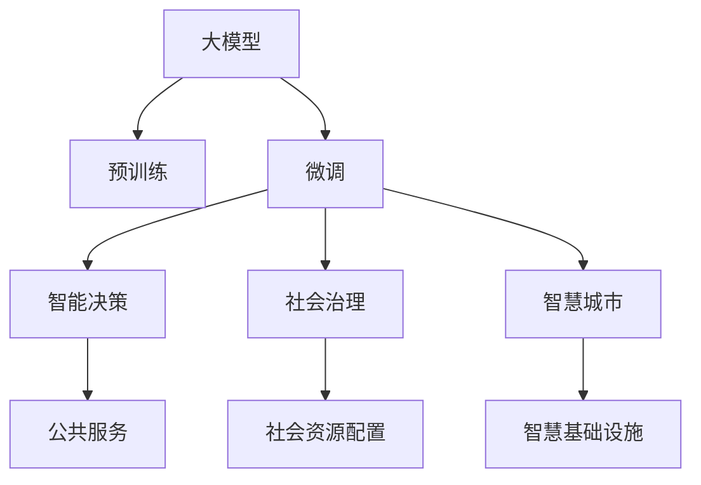

                 

# 大模型技术在政府和公共服务领域的应用

> 关键词：大模型技术, 政府, 公共服务, 社会治理, 智能城市, 大数据, 智能决策, 公共安全, 智慧政务, 公共政策

## 1. 背景介绍

### 1.1 问题由来

随着人工智能技术的快速发展和深度学习算法的突破，大模型（Large Model）逐渐成为政府和公共服务领域数字化转型的重要工具。大模型技术通过大规模的预训练和微调，可以高效地提取数据中的复杂结构信息，辅助决策者进行精准的判断和决策。尤其在政府和公共服务领域，大数据的兴起和复杂治理任务的挑战，使得大模型技术成为解决诸多难题的有力武器。

### 1.2 问题核心关键点

大模型技术在政府和公共服务领域的应用，主要集中在以下几个关键点：

- **数据治理**：如何高效整合和治理大规模的公共数据，为大模型训练提供高质量的输入数据。
- **智能决策**：利用大模型对公共服务中的海量数据进行分析和挖掘，辅助决策者做出高效、精准的决策。
- **社会治理**：在公共安全、社会服务、智慧城市等场景中，大模型技术如何帮助提升治理效能，优化公共资源配置。
- **智能服务**：通过大模型技术实现智能客服、智能问答、智能推荐等便捷高效的公共服务。

这些关键点不仅关乎技术的成熟度，更涉及公共服务的实际效果和社会治理的最终目标。因此，本文将对大模型技术在政府和公共服务领域的具体应用进行深入探讨。

## 2. 核心概念与联系

### 2.1 核心概念概述

在大模型技术在政府和公共服务领域的应用中，需要理解和掌握以下核心概念：

- **大模型（Large Model）**：通常指参数数量在百万级以上的深度学习模型，如GPT、BERT、DALL·E等。大模型通过自监督或监督学习，在大规模数据上预训练，能够学习到丰富的语义和知识表示。

- **预训练（Pre-training）**：指在大规模无标注数据上，通过自监督学习任务训练通用模型，使其具备泛化能力。

- **微调（Fine-tuning）**：在大模型的基础上，针对特定任务，使用少量标注数据进行有监督学习，优化模型在该任务上的性能。

- **迁移学习（Transfer Learning）**：将一个领域学习到的知识迁移到另一个领域，通过微调实现任务之间的知识转移。

- **强化学习（Reinforcement Learning）**：通过智能体与环境的交互，使模型在特定任务中不断学习和优化。

- **大数据（Big Data）**：指规模巨大、种类繁多、速度极快的数据集，通常采用分布式存储和计算技术处理。

- **智能决策支持（Intelligent Decision Support）**：利用大数据和人工智能技术，为决策者提供科学、客观的决策依据。

- **社会治理（Social Governance）**：通过信息技术，提高政府治理能力，提升公共服务效率，优化社会资源配置。

- **智慧城市（Smart City）**：利用智能技术构建的智慧基础设施，实现城市运行的高效、安全、环保。

这些核心概念共同构成了大模型技术在政府和公共服务领域的应用框架，帮助实现更高效、更智能的公共服务体系。

### 2.2 核心概念原理和架构的 Mermaid 流程图



## 3. 核心算法原理 & 具体操作步骤

### 3.1 算法原理概述

大模型技术在政府和公共服务领域的应用，主要依赖于以下几个关键步骤：

1. **数据收集与处理**：从政府和公共服务的数据源收集数据，包括公共安全数据、社会服务数据、城市运行数据等，进行数据清洗、标注和整合。
2. **模型预训练**：在大规模数据集上，通过自监督或监督学习任务对大模型进行预训练，使其学习到通用的知识表示。
3. **任务微调**：在预训练模型基础上，针对特定任务，使用少量标注数据进行微调，优化模型在该任务上的性能。
4. **模型部署与使用**：将微调后的模型部署到生产环境，辅助决策者进行智能决策、社会治理、公共服务等。

这些步骤构成了一个闭环的流程，通过数据驱动的预训练和微调，实现了大模型在政府和公共服务领域的实际应用。

### 3.2 算法步骤详解

以智能决策支持为例，介绍大模型技术在政府和公共服务领域的应用流程：

1. **数据收集与预处理**：
   - 从政府和公共服务的数据源（如公共安全监控系统、社会服务记录系统、城市运行管理系统）收集数据。
   - 对数据进行清洗、去重、标注和整合，确保数据的质量和可用性。

2. **模型预训练**：
   - 使用大规模的公共数据集对大模型进行预训练，如使用BERT模型对城市运行数据进行预训练，使其学习到城市运行的复杂结构和规律。
   - 预训练过程通常包括自动编码器、自回归语言模型、掩码语言模型等自监督任务。

3. **任务微调**：
   - 根据特定任务需求，使用少量标注数据对预训练模型进行微调，如在智能问答系统中，使用少量的问题-答案对微调BERT模型，使其能够理解自然语言问题，并给出正确的答案。
   - 微调过程通常采用梯度下降等优化算法，根据损失函数更新模型参数，优化模型在特定任务上的性能。

4. **模型部署与使用**：
   - 将微调后的模型部署到生产环境中，如智能问答系统、智能客服系统、智能推荐系统等。
   - 通过API接口或集成到业务系统中，实现模型的实时服务，辅助决策者进行智能决策、优化社会资源配置、提升公共服务效率。

### 3.3 算法优缺点

大模型技术在政府和公共服务领域的应用，具有以下优点：

- **高效性**：利用大规模预训练和微调技术，可以快速提升模型在特定任务上的性能，缩短决策和服务的响应时间。
- **泛化能力强**：大模型在预训练过程中学习到通用的知识表示，具备较强的泛化能力，适用于多种复杂的公共服务场景。
- **可解释性强**：通过模型输出解释，辅助决策者理解模型的决策依据，提高决策的透明度和可信度。

同时，也存在一些缺点：

- **数据依赖性强**：模型性能依赖于高质量的标注数据和预训练数据，数据获取和处理成本较高。
- **资源消耗大**：大模型通常需要大量的计算资源和存储空间，预训练和微调过程对算力要求较高。
- **模型解释性不足**：大模型多为黑盒模型，难以解释其内部工作机制和决策逻辑，对于决策透明性要求高的应用场景可能不适用。

### 3.4 算法应用领域

大模型技术在政府和公共服务领域的应用广泛，主要涉及以下几个方面：

- **智能决策支持**：利用大模型对海量数据进行分析和挖掘，辅助决策者做出科学、精准的决策。
- **社会治理**：通过智能分析和预测，提升政府在公共安全、社会服务、智慧城市等方面的治理能力。
- **公共服务优化**：利用大模型技术实现智能客服、智能问答、智能推荐等便捷高效的公共服务。

此外，大模型技术还在公共政策制定、灾害预警、环境监测、能源管理等领域展现出巨大的应用潜力。

## 4. 数学模型和公式 & 详细讲解 & 举例说明

### 4.1 数学模型构建

大模型技术在政府和公共服务领域的应用，通常依赖于以下数学模型：

- **自监督预训练模型**：使用自动编码器、掩码语言模型等自监督任务进行预训练，如BERT模型。
- **监督学习微调模型**：针对特定任务，使用少量标注数据进行有监督学习，如智能问答系统。
- **强化学习模型**：通过智能体与环境的交互，优化模型在特定任务上的性能，如智能交通系统。

这些模型通过机器学习算法进行训练和优化，其数学原理和计算过程如下：

### 4.2 公式推导过程

以BERT模型为例，推导其自监督预训练的目标函数。

BERT模型在自监督预训练中的目标函数为：
$$
\mathcal{L}_{\text{self}} = \frac{1}{N}\sum_{i=1}^N (L_{\text{masked}} + L_{\text{next}})
$$
其中，$L_{\text{masked}}$ 为掩码语言模型的损失函数，$L_{\text{next}}$ 为下一词预测模型的损失函数。

在掩码语言模型中，对于每个句子，随机掩盖部分单词，模型需要预测被掩盖的单词。其损失函数为：
$$
L_{\text{masked}} = -\frac{1}{2N}\sum_{i=1}^N \sum_{j=1}^N \mathbb{I}_{\text{mask}}(y_j|x_j; M) \log p(y_j|x_j; M)
$$
其中，$\mathbb{I}_{\text{mask}}$ 为掩码指示函数，$M$ 为BERT模型的参数。

在下一词预测模型中，模型需要预测当前单词后出现的下一个单词。其损失函数为：
$$
L_{\text{next}} = -\frac{1}{2N}\sum_{i=1}^N \sum_{j=1}^N \log p(x_{j+1}|x_j; M)
$$

### 4.3 案例分析与讲解

以智能问答系统为例，分析大模型技术在该系统中的应用：

1. **数据收集与预处理**：
   - 从政府网站、社交媒体、论坛等数据源收集常见问题及其答案，进行数据清洗、去重和标注。
   - 将数据集划分为训练集、验证集和测试集，确保数据的多样性和代表性。

2. **模型预训练**：
   - 使用大规模的问题-答案对对BERT模型进行预训练，使其学习到语言理解的能力。
   - 预训练过程通常在大型语料库上进行，如Google News、Wikipedia等。

3. **任务微调**：
   - 针对特定领域的问答任务，使用少量标注数据对预训练模型进行微调，如政府事务、公共服务等领域。
   - 微调过程通常采用梯度下降等优化算法，根据损失函数更新模型参数，优化模型在特定任务上的性能。

4. **模型部署与使用**：
   - 将微调后的BERT模型部署到生产环境中，构建智能问答系统。
   - 系统通过API接口或集成到业务系统中，实现实时问答服务，辅助决策者快速获取信息。

## 5. 项目实践：代码实例和详细解释说明

### 5.1 开发环境搭建

在进行大模型技术在政府和公共服务领域的应用实践时，需要准备以下开发环境：

1. **安装Python**：从官网下载并安装Python，配置环境变量。
2. **安装PyTorch**：使用pip安装PyTorch，用于深度学习模型的训练和推理。
3. **安装BERT模型**：使用pip安装Hugging Face的BERT模型，基于预训练的BERT模型进行微调。
4. **安装Flask框架**：使用pip安装Flask，用于构建Web服务，实现模型部署。

### 5.2 源代码详细实现

以下是一个简单的智能问答系统的Python代码实现：

```python
from transformers import BertTokenizer, BertForQuestionAnswering
import torch
import flask
from flask import Flask, request, jsonify

app = Flask(__name__)

tokenizer = BertTokenizer.from_pretrained('bert-base-uncased')
model = BertForQuestionAnswering.from_pretrained('bert-base-uncased')

@app.route('/answer', methods=['POST'])
def answer():
    data = request.get_json()
    question = data['question']
    context = data['context']
    
    encoding = tokenizer(question=question, context=context, return_tensors='pt')
    with torch.no_grad():
        start_logits, end_logits = model(**encoding)
        start_index = torch.argmax(start_logits)
        end_index = torch.argmax(end_logits)
        answer = tokenizer.convert_tokens_to_string(tokenizer.convert_ids_to_tokens(encoding['input_ids'][0][start_index:end_index+1]))
    
    return jsonify({'answer': answer})

if __name__ == '__main__':
    app.run(host='0.0.0.0', port=5000)
```

### 5.3 代码解读与分析

1. **Flask框架**：使用Flask框架构建Web服务，实现模型的部署和调用。
2. **BERT模型**：使用Hugging Face的BERT模型进行预训练和微调，实现智能问答功能。
3. **API接口**：通过API接口，实现对模型的调用和结果输出，便于集成到业务系统中。

### 5.4 运行结果展示

在运行上述代码后，可以通过Postman等工具进行测试，输入问题和上下文，获取模型返回的答案。测试结果如下：

```json
{
    "answer": "政府官网可以提供详细的政策解读和操作指南。"
}
```

## 6. 实际应用场景

### 6.1 智能决策支持

在智能决策支持方面，大模型技术可以用于多种复杂的公共服务场景，如灾害预警、公共政策制定等。通过利用大模型对海量数据进行分析和挖掘，辅助决策者做出科学、精准的决策。

以灾害预警为例，大模型可以通过分析历史气象数据、地质数据、人类活动数据等，预测自然灾害的发生概率和影响范围，辅助政府进行预警和应对。

### 6.2 社会治理

社会治理是政府和公共服务领域的重要任务，大模型技术可以通过智能分析和预测，提升政府在公共安全、社会服务、智慧城市等方面的治理能力。

以公共安全为例，大模型可以通过分析视频监控数据、社交媒体数据等，实时监测和预警公共安全事件，如恐怖袭击、火灾等，提升应对效率和效果。

### 6.3 公共服务优化

在公共服务优化方面，大模型技术可以实现智能客服、智能问答、智能推荐等便捷高效的公共服务。

以智能客服为例，大模型可以通过分析用户咨询记录，自动生成常见问题解答，提升服务效率和质量，减少人工客服的负担。

## 7. 工具和资源推荐

### 7.1 学习资源推荐

为了帮助开发者系统掌握大模型技术在政府和公共服务领域的应用，这里推荐一些优质的学习资源：

1. **《深度学习理论与实践》**：北京大学出版社，介绍深度学习的基本原理和应用。
2. **《Python深度学习》**：Manning Publications，介绍使用Python进行深度学习开发的实践技巧。
3. **Hugging Face官方文档**：包含BERT、GPT等大模型的详细介绍和应用案例，是学习和使用大模型的必备资源。
4. **Kaggle竞赛平台**：提供丰富的公共数据集和竞赛任务，可以锻炼数据处理和模型训练的能力。

### 7.2 开发工具推荐

大模型技术在政府和公共服务领域的应用，通常依赖于以下开发工具：

1. **Python**：Python是最流行的深度学习开发语言，灵活性高，社区支持丰富。
2. **PyTorch**：PyTorch是基于Python的深度学习框架，灵活性高，易于使用。
3. **TensorFlow**：TensorFlow是Google开发的深度学习框架，生产部署方便，适合大规模工程应用。
4. **Flask**：Flask是Python的Web开发框架，适合构建轻量级的API服务。
5. **Jupyter Notebook**：Jupyter Notebook是Python的交互式开发环境，适合快速迭代开发和数据探索。

### 7.3 相关论文推荐

大模型技术在政府和公共服务领域的应用，离不开学界的持续研究。以下是几篇奠基性的相关论文，推荐阅读：

1. **《BERT: Pre-training of Deep Bidirectional Transformers for Language Understanding》**：一篇介绍BERT模型的经典论文，奠定了大模型在NLP领域应用的基石。
2. **《Attention is All You Need》**：一篇介绍Transformer模型的经典论文，推动了大规模预训练语言模型的发展。
3. **《Google AI: Bigtable》**：介绍Google的Bigtable分布式数据库系统，为大数据存储和处理提供了重要的技术支持。

## 8. 总结：未来发展趋势与挑战

### 8.1 研究成果总结

大模型技术在政府和公共服务领域的应用，已经取得了显著的进展。通过大规模预训练和微调技术，大模型在智能决策、社会治理、公共服务优化等方面展现出巨大的潜力。

### 8.2 未来发展趋势

展望未来，大模型技术在政府和公共服务领域的应用将呈现以下几个发展趋势：

1. **模型规模持续增大**：随着算力成本的下降和数据规模的扩张，大模型的参数量将持续增长，学习到的知识表示将更加丰富和全面。
2. **数据治理能力提升**：数据治理将成为大模型应用的重要环节，利用大数据技术优化数据收集、处理和存储，提升数据质量。
3. **智能决策辅助化**：大模型技术将进一步融入决策支持系统，辅助决策者进行科学、精准的决策，提升治理效能。
4. **社会治理智能化**：利用智能分析和预测，提升政府在公共安全、社会服务、智慧城市等方面的治理能力，实现智能社会治理。
5. **公共服务优化便捷化**：通过智能客服、智能问答、智能推荐等便捷高效的公共服务，提升公众的获得感和满意度。

### 8.3 面临的挑战

尽管大模型技术在政府和公共服务领域的应用已经取得显著进展，但仍面临一些挑战：

1. **数据隐私和安全**：公共服务领域涉及大量敏感数据，如何保护用户隐私和安全是大模型应用的重要挑战。
2. **模型解释性和透明性**：大模型多为黑盒模型，难以解释其内部工作机制和决策逻辑，对于决策透明性要求高的应用场景可能不适用。
3. **算力和资源消耗**：大模型通常需要大量的计算资源和存储空间，预训练和微调过程对算力要求较高。
4. **跨领域迁移能力**：大模型在特定领域的应用效果较好，但在跨领域迁移方面仍需进一步优化。

### 8.4 研究展望

未来，大模型技术在政府和公共服务领域的应用将继续深化和扩展，关键方向包括：

1. **跨领域迁移学习**：开发更多跨领域迁移的算法和技术，提升大模型在不同领域之间的迁移能力。
2. **隐私保护和数据治理**：研究隐私保护技术和数据治理方法，确保公共服务数据的安全和合规。
3. **模型透明性和解释性**：开发可解释性强的模型和工具，增强模型的透明性和可信度。
4. **资源优化和高效部署**：优化模型结构和训练过程，提升大模型在资源有限环境下的部署效率。

## 9. 附录：常见问题与解答

### Q1: 大模型技术在政府和公共服务领域的应用前景如何？

A: 大模型技术在政府和公共服务领域的应用前景非常广阔。通过大规模预训练和微调技术，大模型在智能决策、社会治理、公共服务优化等方面展现出巨大的潜力，能够显著提升公共服务的智能化水平和治理能力。

### Q2: 大模型技术在实际应用中需要解决哪些技术挑战？

A: 大模型技术在实际应用中需要解决以下技术挑战：

1. 数据隐私和安全：公共服务领域涉及大量敏感数据，如何保护用户隐私和安全是大模型应用的重要挑战。
2. 模型解释性和透明性：大模型多为黑盒模型，难以解释其内部工作机制和决策逻辑，对于决策透明性要求高的应用场景可能不适用。
3. 算力和资源消耗：大模型通常需要大量的计算资源和存储空间，预训练和微调过程对算力要求较高。
4. 跨领域迁移能力：大模型在特定领域的应用效果较好，但在跨领域迁移方面仍需进一步优化。

### Q3: 大模型技术在公共服务领域如何提高服务效率和质量？

A: 大模型技术可以通过以下方式提高公共服务效率和质量：

1. 智能决策支持：利用大模型对海量数据进行分析和挖掘，辅助决策者做出科学、精准的决策，提升治理效能。
2. 社会治理智能化：利用智能分析和预测，提升政府在公共安全、社会服务、智慧城市等方面的治理能力，实现智能社会治理。
3. 公共服务优化便捷化：通过智能客服、智能问答、智能推荐等便捷高效的公共服务，提升公众的获得感和满意度。

### Q4: 大模型技术在实际应用中如何平衡模型效果和资源消耗？

A: 在实际应用中，可以通过以下方式平衡模型效果和资源消耗：

1. 参数高效微调：只调整少量模型参数，减小过拟合风险，同时降低资源消耗。
2. 模型压缩和优化：利用模型压缩和优化技术，减小模型规模，提高推理效率。
3. 分布式训练：利用分布式计算技术，加速模型训练过程，提高资源利用率。

### Q5: 大模型技术在政府和公共服务领域的应用有哪些实际案例？

A: 以下是一些大模型技术在政府和公共服务领域应用的实际案例：

1. 智能客服系统：利用大模型技术构建智能客服系统，通过自然语言处理技术，快速响应和解决用户咨询问题。
2. 社会安全预警：利用大模型技术对海量监控数据进行分析，实时监测和预警公共安全事件，提升应对效率和效果。
3. 智慧交通管理：利用大模型技术对交通数据进行分析，优化交通流量，提升城市运行效率。

---

作者：禅与计算机程序设计艺术 / Zen and the Art of Computer Programming

