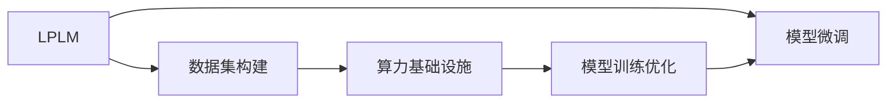

                 

# 大模型时代创业新挑战：数据壁垒与算力瓶颈

在大模型时代，数据和算力已成为人工智能创业企业不可忽视的关键瓶颈。本文将深入探讨大模型对数据和算力的依赖，并提出一系列应对策略，帮助创业者在数据壁垒与算力瓶颈面前破局前行。

## 1. 背景介绍

### 1.1 问题由来
随着深度学习技术的快速发展，大规模预训练语言模型（Large Pre-trained Language Models, LPLMs）在自然语言处理（NLP）领域取得了显著进展。这些模型在处理语言任务时表现优异，但同时也对数据和算力提出了极高的要求。数据壁垒与算力瓶颈已成为制约LPLM在大规模落地应用中的两大关键问题。

### 1.2 问题核心关键点
数据壁垒与算力瓶颈的核心问题在于：

1. **数据获取难度**：构建高质量的预训练数据集，需要大量人工标注和处理，成本高昂。小规模创业企业难以承担。
2. **数据多样性不足**：由于小企业缺乏数据多样性，导致模型泛化能力弱，难以在特定应用场景中取得理想效果。
3. **算力成本高昂**：训练大模型需要高性能GPU或TPU等设备，小企业难以负担高额的算力成本。
4. **计算资源竞争激烈**：顶级公司如Google、OpenAI等拥有垄断性的计算资源，小型企业难以与其竞争。

这些问题严重制约了人工智能创业企业的成长和竞争力，因此需要找到有效的应对策略。

## 2. 核心概念与联系

### 2.1 核心概念概述

为了更好地理解如何应对数据壁垒与算力瓶颈，本节将介绍几个关键概念及其联系：

- **大规模预训练语言模型(LPLM)**：如BERT、GPT系列模型，通过在大规模无标签文本上自监督学习，获取丰富的语言知识。
- **数据集构建**：涉及数据获取、清洗、标注等步骤，是构建高质量预训练数据集的基础。
- **算力基础设施**：包括GPU、TPU等高性能计算设备，以及云平台等计算资源。
- **模型训练优化**：涉及模型结构优化、超参数调优、分布式训练等方法，以提高模型训练效率和性能。

这些概念之间的逻辑关系可以通过以下Mermaid流程图来展示：



这个流程图展示了LPLM的构建流程，其中数据集构建是基础，算力基础设施是支撑，模型训练优化是关键，模型微调是应用。

## 3. 核心算法原理 & 具体操作步骤
### 3.1 算法原理概述

LPLM的训练和应用主要依赖于两个关键步骤：预训练和微调。

1. **预训练**：在大规模无标签文本上，通过自监督任务（如掩码语言模型、下一句预测等）训练LPLM，使其学习到丰富的语言知识。
2. **微调**：在特定任务的标注数据上，通过有监督学习任务训练LPLM，使其适应特定任务的需求。

### 3.2 算法步骤详解

预训练和微调的具体操作步骤如下：

1. **数据准备**：收集大规模无标签文本，进行预处理和标注。
2. **模型选择**：选择合适的LPLM作为初始化参数，如BERT、GPT等。
3. **预训练**：在大规模文本数据上，通过自监督任务进行预训练，如语言模型、掩码预测等。
4. **微调**：在特定任务的标注数据上，通过有监督任务进行微调，如分类、生成等。
5. **测试和部署**：在测试集上评估模型性能，并将模型部署到实际应用中。

### 3.3 算法优缺点

预训练和微调方法具有以下优点：

1. **模型性能提升**：通过大规模预训练，LPLM能够学习到丰富的语言知识，微调后进一步提升模型在特定任务上的表现。
2. **通用性**：预训练模型可以在不同任务上微调，具有良好的泛化能力。
3. **计算效率高**：微调通常只调整顶层或少量参数，减少了计算资源的消耗。

但同时也存在一些缺点：

1. **数据依赖性高**：微调性能依赖于标注数据的质量和数量，获取高质量数据成本高。
2. **模型复杂度高**：LPLM参数量大，训练和推理耗时长。
3. **模型迁移能力有限**：当目标任务与预训练任务差异较大时，微调效果有限。
4. **计算资源需求高**：训练LPLM需要高性能GPU或TPU等设备。

## 4. 数学模型和公式 & 详细讲解
### 4.1 数学模型构建

LPLM的训练过程可以形式化为以下数学模型：

设预训练模型为 $M_{\theta}$，其中 $\theta$ 为预训练参数。给定预训练任务 $T_{pre}$ 的训练集 $D_{pre}$，预训练的目标为最小化经验风险：

$$
\mathcal{L}_{pre}(\theta) = \frac{1}{N} \sum_{i=1}^N \ell(M_{\theta}(x_i),y_i)
$$

其中 $\ell$ 为预训练任务的损失函数。

微调目标是在下游任务 $T_{task}$ 上优化模型，最小化经验风险：

$$
\mathcal{L}_{task}(\theta) = \frac{1}{N} \sum_{i=1}^N \ell(M_{\theta}(x_i),y_i)
$$

其中 $\ell$ 为下游任务的损失函数。

### 4.2 公式推导过程

以下以BERT模型为例，推导其在分类任务上的微调公式。

设BERT模型在输入 $x$ 上的输出为 $h=M_{\theta}(x)$，在预测分类任务 $T_{task}$ 上，输出 $y$ 的概率为 $p(y|h)$。微调的目标是最大化分类任务上的对数似然：

$$
\mathcal{L}_{task}(\theta) = -\sum_{i=1}^N \log p(y_i|h(x_i))
$$

在训练过程中，可以使用交叉熵损失函数：

$$
\ell(y_i,h(x_i)) = -y_i \log p(y_i|h(x_i)) - (1-y_i)\log p(1-y_i|h(x_i))
$$

通过反向传播计算梯度，更新模型参数 $\theta$。

### 4.3 案例分析与讲解

以情感分析任务为例，假设有一个标注数据集，其中包含文章和其情感标签（正、负、中性）。通过微调BERT模型，可以使其在情感分析任务上取得较好表现。具体步骤如下：

1. 收集情感分析数据集，进行标注和清洗。
2. 使用BERT模型作为预训练模型，在其顶层添加分类器。
3. 选择适当的学习率、批量大小等参数。
4. 在标注数据集上执行微调，最小化分类任务上的交叉熵损失。
5. 在测试集上评估模型性能。

## 5. 项目实践：代码实例和详细解释说明
### 5.1 开发环境搭建

在使用LPLM进行项目实践前，需要准备相应的开发环境。以下是使用Python进行TensorFlow开发的环境配置流程：

1. 安装Anaconda：从官网下载并安装Anaconda，用于创建独立的Python环境。

2. 创建并激活虚拟环境：
```bash
conda create -n tf-env python=3.8 
conda activate tf-env
```

3. 安装TensorFlow：根据CUDA版本，从官网获取对应的安装命令。例如：
```bash
conda install tensorflow tensorflow-gpu -c conda-forge
```

4. 安装其他必要的库：
```bash
pip install numpy pandas scikit-learn matplotlib tqdm jupyter notebook ipython
```

完成上述步骤后，即可在`tf-env`环境中开始项目实践。

### 5.2 源代码详细实现

以BERT模型在情感分析任务上的微调为例，给出使用TensorFlow进行微调的PyTorch代码实现。

```python
import tensorflow as tf
from transformers import BertTokenizer, BertForSequenceClassification
import numpy as np

# 加载模型和分词器
model = BertForSequenceClassification.from_pretrained('bert-base-cased', num_labels=3)
tokenizer = BertTokenizer.from_pretrained('bert-base-cased')

# 准备数据集
train_texts, train_labels = ...
dev_texts, dev_labels = ...
test_texts, test_labels = ...

# 定义模型参数
learning_rate = 2e-5
batch_size = 32
epochs = 3

# 定义训练函数
def train_epoch(model, dataset, batch_size, optimizer):
    dataset = tf.data.Dataset.from_tensor_slices((texts, labels))
    dataset = dataset.shuffle(buffer_size=1024).batch(batch_size)
    for epoch in range(epochs):
        model.train()
        for batch in dataset:
            inputs = tokenizer(batch['text'], return_tensors='tf')
            outputs = model(inputs['input_ids'], attention_mask=inputs['attention_mask'])
            loss = outputs.loss
            optimizer.apply_gradients(zip(outputs.gradients, model.trainable_variables))
    return loss.numpy().mean()

# 训练模型
optimizer = tf.keras.optimizers.Adam(learning_rate=learning_rate)
model.compile(optimizer=optimizer, loss='binary_crossentropy', metrics=['accuracy'])
model.fit(train_dataset, epochs=epochs, validation_data=dev_dataset)

# 评估模型
model.evaluate(test_dataset)

# 测试模型
test_loss, test_acc = model.evaluate(test_dataset)
print('Test loss:', test_loss)
print('Test accuracy:', test_acc)
```

以上就是使用TensorFlow对BERT模型进行情感分析任务微调的完整代码实现。可以看到，得益于TensorFlow的强大封装，代码实现相对简洁。

### 5.3 代码解读与分析

让我们再详细解读一下关键代码的实现细节：

**train_epoch函数**：
- 定义了模型训练函数，首先定义数据集，并进行随机化与批次划分。
- 在每个epoch内，对数据集进行迭代，计算损失并反向传播更新模型参数。
- 返回该epoch的平均损失。

**模型训练与评估**：
- 定义模型优化器，并使用交叉熵损失进行模型编译。
- 在训练数据集上执行模型训练，并在验证集上评估模型性能。
- 在测试集上测试模型性能。

可以看到，TensorFlow和Transformer库使得BERT微调的代码实现变得简洁高效。开发者可以将更多精力放在数据处理、模型改进等高层逻辑上，而不必过多关注底层的实现细节。

当然，工业级的系统实现还需考虑更多因素，如模型的保存和部署、超参数的自动搜索、更灵活的任务适配层等。但核心的微调范式基本与此类似。

## 6. 实际应用场景
### 6.1 智能客服系统

基于LPLM的微调技术，可以广泛应用于智能客服系统的构建。传统客服往往需要配备大量人力，高峰期响应缓慢，且一致性和专业性难以保证。使用微调后的LPLM，可以7x24小时不间断服务，快速响应客户咨询，用自然流畅的语言解答各类常见问题。

在技术实现上，可以收集企业内部的历史客服对话记录，将问题和最佳答复构建成监督数据，在此基础上对预训练LPLM进行微调。微调后的LPLM能够自动理解用户意图，匹配最合适的答案模板进行回复。对于客户提出的新问题，还可以接入检索系统实时搜索相关内容，动态组织生成回答。如此构建的智能客服系统，能大幅提升客户咨询体验和问题解决效率。

### 6.2 金融舆情监测

金融机构需要实时监测市场舆论动向，以便及时应对负面信息传播，规避金融风险。传统的人工监测方式成本高、效率低，难以应对网络时代海量信息爆发的挑战。基于LPLM的文本分类和情感分析技术，为金融舆情监测提供了新的解决方案。

具体而言，可以收集金融领域相关的新闻、报道、评论等文本数据，并对其进行主题标注和情感标注。在此基础上对预训练LPLM进行微调，使其能够自动判断文本属于何种主题，情感倾向是正面、中性还是负面。将微调后的LPLM应用到实时抓取的网络文本数据，就能够自动监测不同主题下的情感变化趋势，一旦发现负面信息激增等异常情况，系统便会自动预警，帮助金融机构快速应对潜在风险。

### 6.3 个性化推荐系统

当前的推荐系统往往只依赖用户的历史行为数据进行物品推荐，无法深入理解用户的真实兴趣偏好。基于LPLM的微调技术，个性化推荐系统可以更好地挖掘用户行为背后的语义信息，从而提供更精准、多样的推荐内容。

在实践中，可以收集用户浏览、点击、评论、分享等行为数据，提取和用户交互的物品标题、描述、标签等文本内容。将文本内容作为模型输入，用户的后续行为（如是否点击、购买等）作为监督信号，在此基础上微调预训练LPLM。微调后的模型能够从文本内容中准确把握用户的兴趣点。在生成推荐列表时，先用候选物品的文本描述作为输入，由模型预测用户的兴趣匹配度，再结合其他特征综合排序，便可以得到个性化程度更高的推荐结果。

### 6.4 未来应用展望

随着LPLM和微调方法的不断发展，基于微调范式将在更多领域得到应用，为传统行业带来变革性影响。

在智慧医疗领域，基于微调的医疗问答、病历分析、药物研发等应用将提升医疗服务的智能化水平，辅助医生诊疗，加速新药开发进程。

在智能教育领域，微调技术可应用于作业批改、学情分析、知识推荐等方面，因材施教，促进教育公平，提高教学质量。

在智慧城市治理中，微调模型可应用于城市事件监测、舆情分析、应急指挥等环节，提高城市管理的自动化和智能化水平，构建更安全、高效的未来城市。

此外，在企业生产、社会治理、文娱传媒等众多领域，基于LPLM的微调人工智能应用也将不断涌现，为经济社会发展注入新的动力。相信随着技术的日益成熟，微调方法将成为人工智能落地应用的重要范式，推动人工智能技术在垂直行业的规模化落地。总之，LPLM微调技术需要在数据、算法、工程、业务等多个维度协同发力，才能真正实现人工智能技术在垂直行业的规模化落地。

## 7. 工具和资源推荐
### 7.1 学习资源推荐

为了帮助开发者系统掌握LPLM微调的理论基础和实践技巧，这里推荐一些优质的学习资源：

1. 《深度学习》系列博文：由大模型技术专家撰写，深入浅出地介绍了深度学习原理和应用。

2. 《NLP与深度学习》课程：斯坦福大学开设的NLP明星课程，有Lecture视频和配套作业，带你入门NLP领域的基本概念和经典模型。

3. 《深度学习与自然语言处理》书籍：清华大学出版社的深度学习与自然语言处理教材，全面介绍了深度学习在NLP领域的应用。

4. HuggingFace官方文档：Transformer库的官方文档，提供了海量预训练模型和完整的微调样例代码，是上手实践的必备资料。

5. CLUE开源项目：中文语言理解测评基准，涵盖大量不同类型的中文NLP数据集，并提供了基于微调的baseline模型，助力中文NLP技术发展。

通过对这些资源的学习实践，相信你一定能够快速掌握LPLM微调的精髓，并用于解决实际的NLP问题。

### 7.2 开发工具推荐

高效的开发离不开优秀的工具支持。以下是几款用于LPLM微调开发的常用工具：

1. TensorFlow：基于Python的开源深度学习框架，灵活动态的计算图，适合快速迭代研究。大部分预训练语言模型都有TensorFlow版本的实现。

2. PyTorch：基于Python的开源深度学习框架，具有动态计算图，适合灵活的设计与调试。同样有丰富的预训练语言模型资源。

3. Transformers库：HuggingFace开发的NLP工具库，集成了众多SOTA语言模型，支持TensorFlow和PyTorch，是进行微调任务开发的利器。

4. Weights & Biases：模型训练的实验跟踪工具，可以记录和可视化模型训练过程中的各项指标，方便对比和调优。与主流深度学习框架无缝集成。

5. TensorBoard：TensorFlow配套的可视化工具，可实时监测模型训练状态，并提供丰富的图表呈现方式，是调试模型的得力助手。

6. Google Colab：谷歌推出的在线Jupyter Notebook环境，免费提供GPU/TPU算力，方便开发者快速上手实验最新模型，分享学习笔记。

合理利用这些工具，可以显著提升LPLM微调任务的开发效率，加快创新迭代的步伐。

### 7.3 相关论文推荐

LPLM和微调技术的发展源于学界的持续研究。以下是几篇奠基性的相关论文，推荐阅读：

1. Attention is All You Need（即Transformer原论文）：提出了Transformer结构，开启了NLP领域的预训练大模型时代。

2. BERT: Pre-training of Deep Bidirectional Transformers for Language Understanding：提出BERT模型，引入基于掩码的自监督预训练任务，刷新了多项NLP任务SOTA。

3. Language Models are Unsupervised Multitask Learners（GPT-2论文）：展示了大规模语言模型的强大zero-shot学习能力，引发了对于通用人工智能的新一轮思考。

4. Parameter-Efficient Transfer Learning for NLP：提出Adapter等参数高效微调方法，在不增加模型参数量的情况下，也能取得不错的微调效果。

5. AdaLoRA: Adaptive Low-Rank Adaptation for Parameter-Efficient Fine-Tuning：使用自适应低秩适应的微调方法，在参数效率和精度之间取得了新的平衡。

6. AdaFactor: Single-Stream Adaptive Optimization beyond Layerwise Adaptive Learning Rates：提出AdaFactor优化器，支持更高效的单流自适应优化。

这些论文代表了大模型微调技术的发展脉络。通过学习这些前沿成果，可以帮助研究者把握学科前进方向，激发更多的创新灵感。

## 8. 总结：未来发展趋势与挑战
### 8.1 总结

本文对LPLM微调方法进行了全面系统的介绍。首先阐述了LPLM和微调技术的研究背景和意义，明确了微调在拓展预训练模型应用、提升下游任务性能方面的独特价值。其次，从原理到实践，详细讲解了LPLM微调的数学原理和关键步骤，给出了微调任务开发的完整代码实例。同时，本文还广泛探讨了LPLM微调方法在智能客服、金融舆情、个性化推荐等多个行业领域的应用前景，展示了LPLM微调范式的巨大潜力。此外，本文精选了LPLM微调技术的各类学习资源，力求为读者提供全方位的技术指引。

通过本文的系统梳理，可以看到，LPLM微调方法在大规模落地应用中的重要作用。利用这一方法，能够快速构建高性能的NLP应用，提升数据处理和模型训练效率，推动人工智能技术的广泛应用。未来，伴随LPLM和微调方法的持续演进，相信NLP技术必将在更广阔的应用领域大放异彩，深刻影响人类的生产生活方式。

### 8.2 未来发展趋势

展望未来，LPLM微调技术将呈现以下几个发展趋势：

1. 模型规模持续增大。随着算力成本的下降和数据规模的扩张，LPLM参数量还将持续增长。超大规模LPLM蕴含的丰富语言知识，有望支撑更加复杂多变的下游任务微调。

2. 微调方法日趋多样。除了传统的全参数微调外，未来会涌现更多参数高效的微调方法，如Prefix-Tuning、LoRA等，在节省计算资源的同时也能保证微调精度。

3. 持续学习成为常态。随着数据分布的不断变化，LPLM微调模型也需要持续学习新知识以保持性能。如何在不遗忘原有知识的同时，高效吸收新样本信息，将成为重要的研究课题。

4. 标注样本需求降低。受启发于提示学习(Prompt-based Learning)的思路，未来的微调方法将更好地利用LPLM的语言理解能力，通过更加巧妙的任务描述，在更少的标注样本上也能实现理想的微调效果。

5. 多模态微调崛起。当前的微调主要聚焦于纯文本数据，未来会进一步拓展到图像、视频、语音等多模态数据微调。多模态信息的融合，将显著提升LPLM对现实世界的理解和建模能力。

6. 模型通用性增强。经过海量数据的预训练和多领域任务的微调，未来的LPLM将具备更强大的常识推理和跨领域迁移能力，逐步迈向通用人工智能(AGI)的目标。

以上趋势凸显了LPLM微调技术的广阔前景。这些方向的探索发展，必将进一步提升LPLM系统的性能和应用范围，为人类认知智能的进化带来深远影响。

### 8.3 面临的挑战

尽管LPLM微调技术已经取得了瞩目成就，但在迈向更加智能化、普适化应用的过程中，它仍面临着诸多挑战：

1. 标注成本瓶颈。虽然微调大大降低了标注数据的需求，但对于长尾应用场景，难以获得充足的高质量标注数据，成为制约微调性能的瓶颈。如何进一步降低微调对标注样本的依赖，将是一大难题。

2. 模型鲁棒性不足。当前微调模型面对域外数据时，泛化性能往往大打折扣。对于测试样本的微小扰动，微调模型的预测也容易发生波动。如何提高微调模型的鲁棒性，避免灾难性遗忘，还需要更多理论和实践的积累。

3. 推理效率有待提高。大规模LPLM虽然精度高，但在实际部署时往往面临推理速度慢、内存占用大等效率问题。如何在保证性能的同时，简化模型结构，提升推理速度，优化资源占用，将是重要的优化方向。

4. 可解释性亟需加强。当前微调模型更像是"黑盒"系统，难以解释其内部工作机制和决策逻辑。对于医疗、金融等高风险应用，算法的可解释性和可审计性尤为重要。如何赋予LPLM更强的可解释性，将是亟待攻克的难题。

5. 安全性有待保障。预训练LPLM难免会学习到有偏见、有害的信息，通过微调传递到下游任务，产生误导性、歧视性的输出，给实际应用带来安全隐患。如何从数据和算法层面消除模型偏见，避免恶意用途，确保输出的安全性，也将是重要的研究课题。

6. 知识整合能力不足。现有的微调模型往往局限于任务内数据，难以灵活吸收和运用更广泛的先验知识。如何让微调过程更好地与外部知识库、规则库等专家知识结合，形成更加全面、准确的信息整合能力，还有很大的想象空间。

正视LPLM微调面临的这些挑战，积极应对并寻求突破，将是大模型微调走向成熟的必由之路。相信随着学界和产业界的共同努力，这些挑战终将一一被克服，LPLM微调必将在构建人机协同的智能时代中扮演越来越重要的角色。

### 8.4 未来突破

面对LPLM微调所面临的种种挑战，未来的研究需要在以下几个方面寻求新的突破：

1. 探索无监督和半监督微调方法。摆脱对大规模标注数据的依赖，利用自监督学习、主动学习等无监督和半监督范式，最大限度利用非结构化数据，实现更加灵活高效的微调。

2. 研究参数高效和计算高效的微调范式。开发更加参数高效的微调方法，在固定大部分预训练参数的同时，只更新极少量的任务相关参数。同时优化LPLM的计算图，减少前向传播和反向传播的资源消耗，实现更加轻量级、实时性的部署。

3. 融合因果和对比学习范式。通过引入因果推断和对比学习思想，增强LPLM建立稳定因果关系的能力，学习更加普适、鲁棒的语言表征，从而提升模型泛化性和抗干扰能力。

4. 引入更多先验知识。将符号化的先验知识，如知识图谱、逻辑规则等，与神经网络模型进行巧妙融合，引导LPLM学习更准确、合理的语言模型。同时加强不同模态数据的整合，实现视觉、语音等多模态信息与文本信息的协同建模。

5. 结合因果分析和博弈论工具。将因果分析方法引入LPLM，识别出模型决策的关键特征，增强输出解释的因果性和逻辑性。借助博弈论工具刻画人机交互过程，主动探索并规避模型的脆弱点，提高系统稳定性。

6. 纳入伦理道德约束。在模型训练目标中引入伦理导向的评估指标，过滤和惩罚有偏见、有害的输出倾向。同时加强人工干预和审核，建立模型行为的监管机制，确保输出符合人类价值观和伦理道德。

这些研究方向的探索，必将引领LPLM微调技术迈向更高的台阶，为构建安全、可靠、可解释、可控的智能系统铺平道路。面向未来，LPLM微调技术还需要与其他人工智能技术进行更深入的融合，如知识表示、因果推理、强化学习等，多路径协同发力，共同推动自然语言理解和智能交互系统的进步。只有勇于创新、敢于突破，才能不断拓展LPLM的边界，让智能技术更好地造福人类社会。

## 9. 附录：常见问题与解答

**Q1：LPLM的训练和微调过程中，如何选择数据集和优化器？**

A: 选择数据集和优化器需要考虑以下几个因素：

1. **数据集选择**：数据集应包含广泛覆盖目标任务的真实场景，且标注质量高。对于小企业，可以通过开源数据集或自建小规模数据集进行初步微调。

2. **优化器选择**：常用优化器包括SGD、Adam、AdaFactor等。Adam因其易于调整和学习率自适应调整的特性，常用于大规模模型的微调。AdaFactor则支持更高效的单流自适应优化。

**Q2：LPLM微调过程中如何处理数据不平衡问题？**

A: 数据不平衡是指不同类别的样本数量差异较大。解决数据不平衡问题的方法包括：

1. 数据重采样：通过欠采样、过采样等方法平衡数据集。欠采样指删除多数类样本，过采样指增加少数类样本。

2. 类别权重调整：在损失函数中对少数类样本赋予更高的权重，以减少类别不平衡的影响。

3. 集成学习：将多个微调模型进行集成，以提高模型对不平衡数据的鲁棒性。

4. 数据增强：对少数类样本进行数据增强，生成更多训练样本。

5. 模型调整：使用不同的模型架构或参数设置，以适应不同类别的数据分布。

通过这些方法，可以有效缓解LPLM微调过程中面临的数据不平衡问题。

**Q3：LPLM微调时如何处理过拟合问题？**

A: 过拟合是微调过程中常见的问题，以下是几种解决过拟合的方法：

1. 正则化：使用L2正则化、Dropout等方法，防止模型过度拟合训练数据。

2. 早停法：在验证集上监测模型性能，一旦性能不再提升，则停止训练。

3. 批量归一化：在模型层间引入归一化操作，增强模型的泛化能力。

4. 数据增强：通过对输入数据进行旋转、缩放、裁剪等变换，生成更多训练样本。

5. 学习率调整：在训练过程中动态调整学习率，避免过拟合。

6. 模型简化：使用更简单的模型架构或减少模型层数，以降低过拟合风险。

通过这些方法，可以有效缓解LPLM微调过程中的过拟合问题，提升模型泛化性能。

**Q4：LPLM微调后如何评估模型性能？**

A: 评估模型性能通常需要以下几个步骤：

1. 划分训练集、验证集和测试集。使用验证集监测模型性能，避免过拟合。

2. 在验证集上调整超参数，如学习率、批量大小等。

3. 在测试集上评估模型性能，使用指标如准确率、召回率、F1分数等。

4. 对比微调前后的模型性能，确定微调效果。

5. 使用混淆矩阵、ROC曲线等可视化工具，更直观地展示模型性能。

通过这些步骤，可以有效评估LPLM微调后的模型性能，确保模型在新数据上的表现。

**Q5：LPLM微调过程中如何优化推理速度？**

A: 优化推理速度的方法包括：

1. 模型压缩：使用模型剪枝、量化等技术，减少模型大小。

2. 硬件优化：使用GPU、TPU等高性能设备，加速推理计算。

3. 分布式推理：将模型并行部署到多个设备上，并行计算。

4. 模型优化：使用如TF Lite等模型优化工具，生成轻量级推理模型。

5. 推理加速器：使用专门的推理加速器，如TensorRT，加速模型推理。

通过这些方法，可以有效提升LPLM在实际应用中的推理速度，满足实时性的需求。

---

作者：禅与计算机程序设计艺术 / Zen and the Art of Computer Programming

