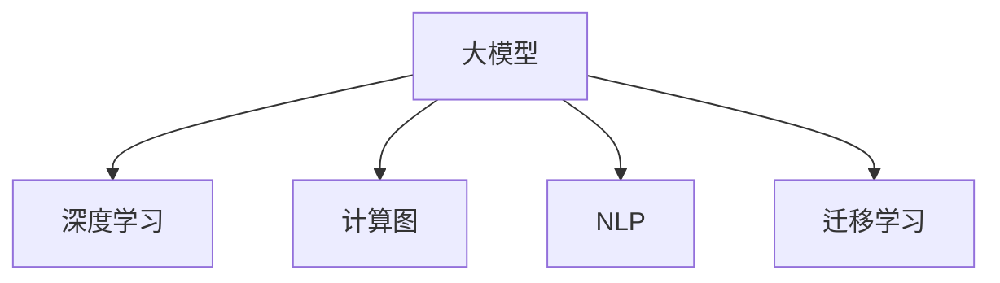

                 

# 大模型时代的创业者职业发展：持续学习与能力提升

> 关键词：大模型, 创业, 持续学习, 能力提升, 数据科学, 人工智能, 深度学习, 自然语言处理(NLP), 计算图, 机器学习

## 1. 背景介绍

### 1.1 问题由来

当前，大模型正以惊人的速度渗透到各行各业，其广泛的应用范围和显著的性能提升，让越来越多的创业者看到了新的机遇。然而，大模型技术的复杂性和技术壁垒，对创业者的技术能力和知识储备提出了更高的要求。如何在大模型时代迅速提升自身能力，抓住新的发展机遇，是每个创业者面临的挑战。

### 1.2 问题核心关键点

要在大模型时代持续发展，创业者需要不断更新知识，掌握新技术，并积极应对新的挑战。主要核心关键点包括：

- 掌握大模型的基本原理和应用。
- 理解大模型背后的算法原理和实现细节。
- 熟练使用各种深度学习框架和工具。
- 具备解决实际业务问题的能力。
- 了解大模型在创业项目中的实际应用。

### 1.3 问题研究意义

研究大模型时代创业者的职业发展，对于提升创业者的技术能力、抓住新的发展机遇、推动产业升级具有重要意义：

- 提升创业项目的技术竞争力。
- 加速新技术在产业中的应用。
- 促进大模型技术的普及和落地。
- 培养更多技术专家，加速技术迭代。
- 助力新行业发展，创造更多商业价值。

## 2. 核心概念与联系

### 2.1 核心概念概述

为更好地理解大模型时代创业者的职业发展，本节将介绍几个密切相关的核心概念：

- **大模型(Large Model)**：以自回归模型（如GPT系列）或自编码模型（如BERT）为代表的深度学习模型，其参数量通常以亿计，能够进行复杂的自然语言处理任务。
- **深度学习(Deep Learning)**：基于神经网络的机器学习技术，通过多层次的抽象表达，实现对数据的高效建模和预测。
- **计算图(Computational Graph)**：深度学习模型的核心，用于描述模型的结构和计算流程，通过反向传播算法进行参数更新。
- **自然语言处理(NLP)**：研究如何让计算机理解、处理和生成自然语言的学科，是大模型技术的主要应用领域之一。
- **迁移学习(Transfer Learning)**：将一个领域学到的知识迁移到另一个领域，通过预训练模型在小样本条件下获得更好的性能。

这些核心概念之间的逻辑关系可以通过以下Mermaid流程图来展示：



这个流程图展示了大模型的核心概念及其之间的关系：

1. 大模型建立在深度学习和计算图的基础之上。
2. 大模型在自然语言处理领域得到广泛应用。
3. 迁移学习是大模型从预训练到微调的关键技术。

## 3. 核心算法原理 & 具体操作步骤

### 3.1 算法原理概述

大模型时代创业者需要掌握的核心算法原理包括深度学习的基本概念、大模型的架构设计和训练过程。以下将从这三方面进行详细介绍：

#### 3.1.1 深度学习

深度学习是一种通过构建多层神经网络模型，实现对数据高效建模和预测的技术。其核心在于利用反向传播算法，通过前向传播计算损失函数，反向传播更新参数，不断迭代优化模型性能。

#### 3.1.2 大模型架构设计

大模型通常由多个自注意力层（Transformer层）构成，这些层可以并行计算，大大提升了模型的计算效率。以BERT为例，其架构主要由输入嵌入层、Transformer编码器、输出层等组成，能够高效处理文本数据。

#### 3.1.3 训练过程

大模型的训练通常采用分布式并行计算，通过梯度积累、混合精度训练等技术，大幅度提升训练效率。训练过程分为以下几个关键步骤：

1. **数据预处理**：将原始数据转换为模型可以处理的格式，如分词、标记等。
2. **模型初始化**：将预训练模型加载到计算图中，并设置优化器及其参数。
3. **前向传播**：将数据输入模型，计算输出。
4. **反向传播**：计算损失函数，通过反向传播算法更新参数。
5. **模型保存**：保存训练好的模型权重和参数，以便后续使用。

### 3.2 算法步骤详解

大模型时代创业者的核心操作流程包括：

#### 3.2.1 项目准备

- **环境搭建**：选择合适的深度学习框架（如PyTorch、TensorFlow等），安装必要的依赖库。
- **数据集准备**：收集和预处理数据集，确保数据质量和多样性。
- **模型选择**：根据项目需求，选择合适的大模型（如GPT-3、BERT等）。

#### 3.2.2 模型训练

- **模型构建**：使用预训练模型，并进行必要的任务适配层（如全连接层、分类器等）。
- **数据加载**：使用DataLoader加载数据，进行批次化处理。
- **训练迭代**：设置训练轮数、学习率、优化器等参数，进行多轮迭代训练。
- **模型评估**：在验证集上评估模型性能，及时调整训练参数。
- **模型保存**：保存训练好的模型和参数，便于后续使用。

#### 3.2.3 应用部署

- **模型导出**：将训练好的模型导出为标准格式，如TensorFlow SavedModel、ONNX等。
- **应用集成**：将模型集成到实际应用中，如web服务、移动应用等。
- **性能优化**：对模型进行优化，提升推理速度和内存占用。
- **监控告警**：实时监控模型性能，设置异常告警机制。

### 3.3 算法优缺点

大模型时代创业者的核心算法具有以下优点：

- **高效性能**：大模型能够高效处理大规模数据，提升模型性能。
- **灵活适应**：大模型具备较强的迁移学习能力，适应多种任务和场景。
- **广泛应用**：大模型在自然语言处理、计算机视觉、语音识别等领域具有广泛的应用前景。

同时，大模型也存在以下缺点：

- **高计算资源需求**：大模型需要大量的计算资源进行训练和推理，成本较高。
- **数据依赖**：大模型的性能依赖于训练数据的质量和数量，数据收集和标注成本高。
- **模型复杂性**：大模型的结构复杂，参数量大，调试和维护难度大。
- **鲁棒性不足**：大模型面对未知或异常数据，鲁棒性可能不足，容易过拟合。

### 3.4 算法应用领域

大模型时代创业者的核心算法主要应用于以下几个领域：

- **自然语言处理(NLP)**：如文本分类、情感分析、机器翻译、对话系统等。
- **计算机视觉**：如图像识别、目标检测、图像生成等。
- **语音识别**：如语音转文本、语音情感分析等。
- **推荐系统**：如个性化推荐、内容推荐等。
- **金融科技**：如风险评估、信用评分等。

## 4. 数学模型和公式 & 详细讲解 & 举例说明

### 4.1 数学模型构建

大模型时代创业者的核心数学模型包括损失函数、优化器等。以下将对核心数学模型进行详细介绍：

#### 4.1.1 损失函数

损失函数用于衡量模型输出与真实标签之间的差异。以分类任务为例，常用的损失函数包括交叉熵损失：

$$
\mathcal{L} = -\frac{1}{N}\sum_{i=1}^N \sum_{j=1}^C y_{i,j}\log p_{i,j}
$$

其中 $y_{i,j}$ 为真实标签，$p_{i,j}$ 为模型输出的概率。

#### 4.1.2 优化器

优化器用于更新模型参数，以最小化损失函数。常用的优化器包括SGD、Adam、Adagrad等。以Adam优化器为例，其更新公式为：

$$
\theta_{t+1} = \theta_t - \eta \frac{m_t}{\sqrt{v_t}+\epsilon}
$$

其中 $m_t$ 和 $v_t$ 为动量和平方根动量，$\eta$ 为学习率，$\epsilon$ 为小常数，防止除数为0。

### 4.2 公式推导过程

大模型时代创业者的核心数学推导包括损失函数的推导和优化器的更新公式。以下将详细推导：

#### 4.2.1 交叉熵损失函数推导

对于分类任务，常用的损失函数为交叉熵损失。设模型输出为 $p(y|x)$，真实标签为 $y$，则交叉熵损失函数为：

$$
\mathcal{L}(p,y) = -\frac{1}{N}\sum_{i=1}^N \sum_{j=1}^C y_{i,j}\log p_{i,j}
$$

其推导过程如下：

1. **期望公式**：

$$
P(Y|X) = \frac{P(X|Y)P(Y)}{P(X)}
$$

2. **对数公式**：

$$
\log P(Y|X) = \log \frac{P(X|Y)P(Y)}{P(X)} = \log P(X|Y) + \log P(Y) - \log P(X)
$$

3. **交叉熵公式**：

$$
\mathcal{L}(p,y) = -\sum_{i=1}^N\sum_{j=1}^C y_{i,j}\log p_{i,j}
$$

### 4.3 案例分析与讲解

以BERT模型为例，详细分析其训练过程。BERT模型由Transformer编码器和全连接输出层组成。训练过程包括：

1. **数据预处理**：将原始文本转换为token ids，并进行padding和truncation。
2. **模型初始化**：将预训练模型加载到计算图中。
3. **前向传播**：将数据输入模型，计算输出。
4. **反向传播**：计算损失函数，通过反向传播算法更新参数。
5. **模型保存**：保存训练好的模型和参数。

## 5. 项目实践：代码实例和详细解释说明

### 5.1 开发环境搭建

在大模型时代，创业者需要掌握各种深度学习框架和工具。以下推荐几款常用的工具：

1. **PyTorch**：基于Python的开源深度学习框架，灵活动态的计算图，适合快速迭代研究。
2. **TensorFlow**：由Google主导开发的开源深度学习框架，生产部署方便，适合大规模工程应用。
3. **Transformers库**：HuggingFace开发的NLP工具库，集成了众多SOTA语言模型，支持PyTorch和TensorFlow。

### 5.2 源代码详细实现

以下以BERT模型进行文本分类任务为例，给出使用PyTorch和Transformers库进行微调的代码实现：

```python
from transformers import BertForSequenceClassification, BertTokenizer, AdamW
import torch
import torch.nn as nn

# 数据准备
tokenizer = BertTokenizer.from_pretrained('bert-base-uncased')
train_data = ['This is a positive sentence', 'This is a negative sentence']
train_labels = [1, 0]
dev_data = ['This is a neutral sentence']
dev_labels = [0]

# 模型加载
model = BertForSequenceClassification.from_pretrained('bert-base-uncased', num_labels=2)
device = torch.device('cuda' if torch.cuda.is_available() else 'cpu')
model.to(device)

# 模型训练
def train_epoch(model, data, labels, batch_size):
    model.train()
    optimizer = AdamW(model.parameters(), lr=2e-5)
    total_loss = 0
    for batch in DataLoader(list(zip(data, labels)), batch_size):
        inputs, labels = [item.to(device) for item in batch]
        outputs = model(inputs)
        loss = outputs.loss
        optimizer.zero_grad()
        loss.backward()
        optimizer.step()
        total_loss += loss.item()
    return total_loss / len(data)

def evaluate(model, data, labels, batch_size):
    model.eval()
    total_loss = 0
    for batch in DataLoader(list(zip(data, labels)), batch_size):
        inputs, labels = [item.to(device) for item in batch]
        outputs = model(inputs)
        loss = outputs.loss
        total_loss += loss.item()
    return total_loss / len(data)

# 训练过程
for epoch in range(10):
    train_loss = train_epoch(model, train_data, train_labels, batch_size=4)
    dev_loss = evaluate(model, dev_data, dev_labels, batch_size=4)
    print(f'Epoch {epoch+1}, train loss: {train_loss:.3f}, dev loss: {dev_loss:.3f}')

# 模型评估
test_data = ['This is a positive sentence', 'This is a neutral sentence']
test_labels = [1, 0]
test_loss = evaluate(model, test_data, test_labels, batch_size=4)
print(f'Test loss: {test_loss:.3f}')
```

### 5.3 代码解读与分析

上述代码实现详细解析如下：

1. **数据预处理**：使用BERT Tokenizer将文本转换为token ids，并进行padding和truncation。
2. **模型加载**：使用Transformers库加载BERT模型和Tokenizer，并设置计算设备。
3. **模型训练**：定义训练函数，使用AdamW优化器进行梯度下降更新参数，并在验证集上评估模型性能。
4. **模型评估**：定义评估函数，在测试集上评估模型性能。
5. **训练循环**：进行多轮迭代训练，输出训练和验证集的损失。

## 6. 实际应用场景

### 6.1 自然语言处理(NLP)

大模型时代创业者可以应用自然语言处理技术解决诸多实际问题。例如：

- **文本分类**：如情感分析、主题分类等。
- **命名实体识别**：识别文本中的人名、地名、机构名等特定实体。
- **关系抽取**：从文本中抽取实体之间的语义关系。
- **问答系统**：对自然语言问题给出答案。
- **机器翻译**：将源语言文本翻译成目标语言。
- **文本摘要**：将长文本压缩成简短摘要。
- **对话系统**：使机器能够与人自然对话。

### 6.2 计算机视觉

大模型时代创业者可以应用计算机视觉技术解决诸多实际问题。例如：

- **图像识别**：如物体识别、场景识别等。
- **目标检测**：如人脸检测、车辆检测等。
- **图像生成**：如图像风格转换、图像修复等。
- **增强现实**：如AR游戏、AR导航等。

### 6.3 推荐系统

大模型时代创业者可以应用推荐系统技术解决诸多实际问题。例如：

- **个性化推荐**：如电商推荐、视频推荐等。
- **内容推荐**：如新闻推荐、音乐推荐等。
- **广告推荐**：如在线广告推荐等。

### 6.4 金融科技

大模型时代创业者可以应用金融科技技术解决诸多实际问题。例如：

- **风险评估**：如信用评分、贷款审批等。
- **智能投顾**：如智能理财、投资建议等。
- **金融市场分析**：如情感分析、舆情监测等。

## 7. 工具和资源推荐

### 7.1 学习资源推荐

为了帮助大模型时代创业者系统掌握大模型的技术基础和实践技巧，这里推荐一些优质的学习资源：

1. **《深度学习》**：Ian Goodfellow等人所著的深度学习经典教材，详细介绍了深度学习的基本概念和算法原理。
2. **《自然语言处理入门》**：斯坦福大学提供的NLP入门课程，有视频和讲义，适合初学者入门。
3. **《Transformer》**：Jurgen Schmidhuber等人所著的Transformer技术书籍，全面介绍了Transformer的原理和应用。
4. **《Python深度学习》**：Francois Chollet所著的深度学习实战书籍，详细介绍了深度学习在Python中的应用。
5. **《自然语言处理综述》**：Russellumbs等人所著的NLP综述书籍，涵盖了NLP领域的经典技术和最新进展。

### 7.2 开发工具推荐

大模型时代创业者需要掌握各种开发工具。以下推荐几款常用的工具：

1. **PyTorch**：基于Python的开源深度学习框架，灵活动态的计算图，适合快速迭代研究。
2. **TensorFlow**：由Google主导开发的开源深度学习框架，生产部署方便，适合大规模工程应用。
3. **Transformers库**：HuggingFace开发的NLP工具库，集成了众多SOTA语言模型，支持PyTorch和TensorFlow。
4. **Weights & Biases**：模型训练的实验跟踪工具，可以记录和可视化模型训练过程中的各项指标，方便对比和调优。
5. **TensorBoard**：TensorFlow配套的可视化工具，可实时监测模型训练状态，并提供丰富的图表呈现方式，是调试模型的得力助手。
6. **Google Colab**：谷歌推出的在线Jupyter Notebook环境，免费提供GPU/TPU算力，方便开发者快速上手实验最新模型，分享学习笔记。

### 7.3 相关论文推荐

大模型时代创业者需要不断学习前沿的科研论文，了解最新的技术进展。以下是几篇奠基性的相关论文，推荐阅读：

1. **Attention is All You Need**：提出Transformer结构，开启了NLP领域的预训练大模型时代。
2. **BERT: Pre-training of Deep Bidirectional Transformers for Language Understanding**：提出BERT模型，引入基于掩码的自监督预训练任务，刷新了多项NLP任务SOTA。
3. **Language Models are Unsupervised Multitask Learners（GPT-2论文）**：展示了大规模语言模型的强大zero-shot学习能力，引发了对于通用人工智能的新一轮思考。
4. **Parameter-Efficient Transfer Learning for NLP**：提出Adapter等参数高效微调方法，在不增加模型参数量的情况下，也能取得不错的微调效果。
5. **Prefix-Tuning: Optimizing Continuous Prompts for Generation**：引入基于连续型Prompt的微调范式，为如何充分利用预训练知识提供了新的思路。
6. **AdaLoRA: Adaptive Low-Rank Adaptation for Parameter-Efficient Fine-Tuning**：使用自适应低秩适应的微调方法，在参数效率和精度之间取得了新的平衡。

## 8. 总结：未来发展趋势与挑战

### 8.1 总结

本文对大模型时代创业者的职业发展进行了全面系统的介绍。首先阐述了大模型的基本原理和应用场景，明确了创业者在大模型时代所面临的挑战和机遇。其次，从算法原理到实践操作，详细讲解了深度学习的基本概念和核心算法，并给出了具体的代码实现。同时，本文还广泛探讨了大模型在自然语言处理、计算机视觉、推荐系统等领域的实际应用，展示了其在创业项目中的广泛价值。

通过本文的系统梳理，可以看到，大模型时代创业者需要不断更新知识，掌握新技术，并积极应对新的挑战。只有通过持续学习和实践，才能在竞争激烈的市场中占据优势，实现自身和项目的可持续发展。

### 8.2 未来发展趋势

展望未来，大模型时代创业者的职业发展将呈现以下几个趋势：

1. **技术能力不断提升**：随着深度学习技术的不断演进，创业者的技术能力也将不断提升，能够更好地应对新的挑战和机遇。
2. **应用场景不断扩展**：大模型技术的应用场景将不断扩展，创业者需要不断拓展自身的应用领域，提高技术水平。
3. **数据驱动不断增强**：在大模型时代，数据驱动的思维将更加重要，创业者需要更加注重数据的收集和处理，提升数据驱动的能力。
4. **跨学科融合不断加强**：大模型技术将与更多学科进行融合，创业者需要具备跨学科的知识和能力，提高综合竞争力。
5. **国际化水平不断提升**：大模型技术的应用将不断国际化，创业者需要具备国际化的视野和能力，开拓全球市场。

### 8.3 面临的挑战

尽管大模型时代提供了诸多发展机遇，但创业者也面临诸多挑战：

1. **技术复杂性不断提升**：大模型的技术复杂性不断提升，需要创业者具备更强的技术能力。
2. **数据获取难度不断增加**：获取高质量数据变得更加困难，需要创业者具备更强的数据获取和处理能力。
3. **模型训练成本不断增加**：大模型的训练成本不断增加，需要创业者具备更强的资源配置和优化能力。
4. **市场竞争不断加剧**：市场竞争不断加剧，需要创业者具备更强的市场敏感度和应变能力。
5. **产品落地难度不断增加**：将大模型技术落地到实际应用中变得更加困难，需要创业者具备更强的产品实现和优化能力。

### 8.4 研究展望

面对大模型时代所面临的挑战，未来的研究需要在以下几个方面寻求新的突破：

1. **提升模型效率**：通过技术优化和算法创新，提高大模型的训练和推理效率，降低资源消耗。
2. **增强模型鲁棒性**：通过数据增强、正则化等技术，增强大模型的鲁棒性和泛化能力，提高模型性能。
3. **提高模型可解释性**：通过模型解释技术，提高大模型的可解释性和透明度，增强用户信任。
4. **优化模型效果**：通过超参数调优、模型压缩等技术，优化大模型的效果和性能。
5. **加强多学科融合**：将大模型技术与更多学科进行融合，提升跨学科应用能力，推动技术创新。

通过不断学习和探索，大模型时代的创业者将能够更好地应对挑战，抓住机遇，实现自身和项目的可持续发展。只有积极面对未来，不断突破自我，才能在激烈的市场竞争中脱颖而出。

## 9. 附录：常见问题与解答

**Q1：如何选择合适的深度学习框架？**

A: 选择深度学习框架需要考虑以下几个因素：
1. 框架的可扩展性：框架是否支持大规模数据处理和高并发计算。
2. 框架的易用性：框架是否提供易于使用的API，是否提供丰富的文档和示例。
3. 框架的性能：框架在性能方面是否具有优势，如GPU/TPU支持等。
4. 框架的社区支持：框架是否有活跃的社区支持，是否有丰富的第三方库和插件。

综上所述，PyTorch和TensorFlow是目前最流行的深度学习框架，适合不同的应用场景。

**Q2：如何提高深度学习模型的泛化能力？**

A: 提高深度学习模型的泛化能力需要考虑以下几个方面：
1. 数据质量：使用高质量的数据进行训练，避免过拟合。
2. 模型复杂度：选择适合任务复杂度的模型，避免过度拟合。
3. 正则化技术：使用L2正则、Dropout等技术，避免过拟合。
4. 数据增强：通过数据增强技术，增加数据多样性，提高模型泛化能力。
5. 模型迁移学习：通过迁移学习，利用预训练模型在小样本条件下获得更好的性能。

综上所述，通过数据质量提升、模型复杂度控制、正则化技术应用、数据增强和迁移学习等手段，可以有效提高深度学习模型的泛化能力。

**Q3：如何提高深度学习模型的训练效率？**

A: 提高深度学习模型的训练效率需要考虑以下几个方面：
1. 模型并行：使用模型并行技术，将模型分解为多个子模型并行训练，提高训练效率。
2. 混合精度训练：使用混合精度训练技术，将模型参数转换为低精度格式，提高训练效率。
3. 模型剪枝：使用模型剪枝技术，去除不必要的参数，减小模型大小，提高训练效率。
4. 优化器选择：选择合适的优化器，如Adam、Adagrad等，提高训练效率。
5. 学习率调优：选择合适的学习率，使用学习率调优技术，提高训练效率。

综上所述，通过模型并行、混合精度训练、模型剪枝、优化器选择和学习率调优等手段，可以有效提高深度学习模型的训练效率。

---

作者：禅与计算机程序设计艺术 / Zen and the Art of Computer Programming

