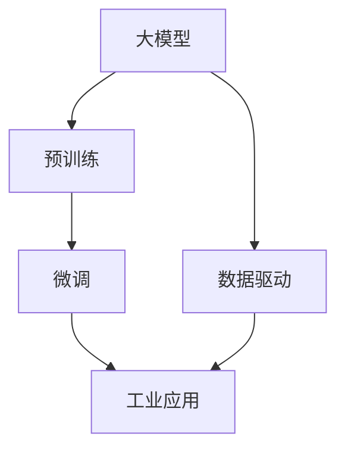

                 

# 大模型的市场推广与技术发展

> 关键词：大模型, 市场推广, 技术发展, 预训练, 微调, 超大规模模型, 数据驱动, 工业应用

## 1. 背景介绍

随着人工智能技术的迅猛发展，特别是深度学习模型的突破性进展，大模型（Big Models）正在成为推动AI技术进步的关键力量。大模型，尤其是基于Transformer架构的预训练语言模型（如GPT-3、BERT等），以其在海量数据上的卓越表现和广泛应用前景，吸引了越来越多的企业、研究机构和开发者投入其中。然而，如何高效推广大模型技术，将其转化为商业价值，同时不断推进技术迭代和创新，是一个需要深入探讨的重要议题。本文将从市场推广和技术发展的双重维度，深入剖析大模型这一新兴技术领域的现状、挑战和未来趋势。

## 2. 核心概念与联系

### 2.1 核心概念概述

为了更好地理解大模型及其推广和技术发展，首先需要明确几个关键概念：

- **大模型（Big Models）**：指使用超大规模数据集进行预训练，参数量通常在亿级别以上的深度学习模型。这些模型通常在处理复杂自然语言处理（NLP）任务上表现优异。

- **预训练（Pre-training）**：指在大规模无标签数据上，通过自监督学习任务（如语言模型、掩码语言模型等）训练模型，学习通用的语言表示。预训练是构建大模型的关键步骤。

- **微调（Fine-tuning）**：指在大模型基础上，通过有监督学习任务（如分类、生成等）进一步训练模型，使模型适应特定应用场景。微调是大模型推广的关键技术手段。

- **超大规模模型（Huge Models）**：参数量超过亿级别的模型，具有强大的语言理解和生成能力，广泛应用于各种NLP任务。

- **数据驱动（Data-driven）**：依赖大规模数据进行训练和优化，从而提升模型的性能和泛化能力。

- **工业应用（Industrial Application）**：将大模型技术应用于实际商业场景，如智能客服、金融舆情监测、个性化推荐等，创造实际价值。

### 2.2 核心概念原理和架构的 Mermaid 流程图



这个流程图展示了大模型的核心概念及其之间的联系。大模型通过预训练学习通用的语言表示，再通过微调适应特定应用场景，最终在数据驱动下不断优化，应用于工业应用中，创造出商业价值。

## 3. 核心算法原理 & 具体操作步骤

### 3.1 算法原理概述

大模型的推广和技术发展，从根本上依赖于其在各种NLP任务上的优异表现。预训练-微调是大模型推广的核心技术手段。预训练模型通常在大规模无标签数据上通过自监督任务进行训练，学习到丰富的语言知识。微调则是在特定任务上，通过有标签数据进一步训练，使模型适应特定应用场景，提升任务性能。

大模型的推广和技术发展，主要涉及以下几个关键步骤：

1. **数据预处理**：收集和处理大规模数据，确保数据质量和多样性。
2. **模型构建**：选择或构建合适的模型架构，如Transformer等。
3. **预训练**：在大规模无标签数据上训练模型，学习通用的语言表示。
4. **微调**：在特定任务上，使用少量有标签数据进行微调，提升模型在该任务上的性能。
5. **评估与优化**：在实际应用场景中评估模型性能，根据反馈进行模型优化。

### 3.2 算法步骤详解

大模型的推广和技术发展可以分为以下几个详细步骤：

**Step 1: 数据收集与预处理**

- **数据收集**：根据应用场景收集和整理大规模数据集，数据类型可以包括文本、图像、音频等。
- **数据清洗**：对收集的数据进行清洗，去除噪音和无用数据，确保数据质量。
- **数据标注**：对部分数据进行人工标注，为后续微调提供监督信号。

**Step 2: 模型构建与预训练**

- **模型选择**：选择或构建合适的预训练模型架构，如BERT、GPT等。
- **预训练任务**：设计自监督学习任务，如语言模型、掩码语言模型等，在大规模无标签数据上进行预训练。
- **预训练流程**：在预训练过程中，选择合适的优化器和超参数，使用GPU/TPU等高性能设备进行训练，监控模型性能。

**Step 3: 微调与优化**

- **任务适配**：根据具体应用场景，设计合适的任务适配层，调整模型输出层和损失函数。
- **微调流程**：使用少量有标签数据对模型进行微调，选择合适学习率、优化器和正则化技术，避免过拟合。
- **评估与优化**：在实际应用场景中评估模型性能，根据反馈进行模型优化，提升模型效果。

### 3.3 算法优缺点

大模型的推广和技术发展具有以下优点：

- **强大的泛化能力**：通过预训练-微调流程，大模型能够在各种NLP任务上取得优异性能。
- **高效推广**：通过微调，大模型能够快速适应特定应用场景，推广成本较低。
- **广泛的适用性**：大模型适用于各种NLP任务，如分类、匹配、生成等。
- **技术成熟**：预训练-微调技术已经相对成熟，可以在短时间内取得显著成果。

同时，大模型的推广和技术发展也存在以下缺点：

- **数据依赖**：微调过程依赖于有标签数据，数据获取成本较高。
- **资源消耗大**：预训练和微调过程需要大量的计算资源和存储空间。
- **模型复杂**：大模型通常具有较高的复杂度，需要精细的超参数调优。
- **解释性不足**：大模型往往缺乏解释性，难以理解其内部决策机制。

### 3.4 算法应用领域

大模型的推广和技术发展已经在多个领域得到了广泛应用，例如：

- **智能客服**：使用大模型进行对话生成，提升客服响应速度和质量。
- **金融舆情监测**：通过分析海量金融新闻和社交媒体数据，提供舆情分析服务。
- **个性化推荐**：基于用户行为数据，生成个性化推荐内容，提升用户体验。
- **医疗诊断**：通过分析医学文献和患者记录，辅助医生进行疾病诊断和治疗方案推荐。
- **自然语言理解**：利用大模型进行文本分类、实体识别、情感分析等任务，提升自然语言处理能力。
- **自动摘要**：通过大模型生成文章摘要，提高文本处理效率。

## 4. 数学模型和公式 & 详细讲解 & 举例说明

### 4.1 数学模型构建

大模型的推广和技术发展，涉及多个数学模型和公式。以下将重点介绍预训练和微调的数学模型。

**预训练模型的数学模型**：

大模型通常基于Transformer架构进行预训练。以BERT为例，其预训练模型的数学模型可以表示为：

$$
\mathbf{H} = \text{BERT}(\mathbf{X}, \mathbf{P})
$$

其中 $\mathbf{X}$ 表示输入的文本序列，$\mathbf{P}$ 表示模型参数。预训练过程包括语言模型预测和掩码语言模型预测两个步骤。以语言模型预测为例，其数学模型可以表示为：

$$
\mathcal{L} = -\frac{1}{N}\sum_{i=1}^N \sum_{j=1}^{T_i} \log P(y_j|\mathbf{X}_j)
$$

其中 $N$ 表示训练样本数量，$T_i$ 表示第 $i$ 个样本的长度。$P(y_j|\mathbf{X}_j)$ 表示在给定输入文本 $\mathbf{X}_j$ 的情况下，第 $j$ 个位置的预测概率。

**微调模型的数学模型**：

微调模型的数学模型可以表示为：

$$
\mathbf{H} = \text{BERT}_{finetuned}(\mathbf{X}, \mathbf{P}_{finetuned})
$$

其中 $\mathbf{P}_{finetuned}$ 表示微调后的模型参数。微调过程通过有标签数据进行训练，其数学模型可以表示为：

$$
\mathcal{L} = -\frac{1}{N}\sum_{i=1}^N \sum_{j=1}^{T_i} \log P(y_j|\mathbf{X}_j)
$$

其中 $P(y_j|\mathbf{X}_j)$ 表示在给定输入文本 $\mathbf{X}_j$ 的情况下，第 $j$ 个位置的预测概率。

### 4.2 公式推导过程

预训练和微调模型的公式推导过程，可以概括如下：

1. **预训练模型推导**：通过语言模型预测和掩码语言模型预测，推导出预训练模型的数学模型。
2. **微调模型推导**：通过有标签数据进行微调，推导出微调模型的数学模型。
3. **结合推导**：将预训练和微调模型结合，得到最终的大模型数学模型。

### 4.3 案例分析与讲解

以BERT模型为例，其预训练和微调的具体流程如下：

**预训练**：

- **数据准备**：使用大规模无标签数据，如维基百科、新闻等，进行预训练。
- **模型训练**：在预训练过程中，使用语言模型预测和掩码语言模型预测，优化模型参数。
- **模型评估**：在验证集上评估模型性能，调整超参数，确保模型泛化能力。

**微调**：

- **数据准备**：准备有标签数据，如情感分析、问答等数据集。
- **模型适配**：在微调过程中，根据任务类型，适配合适的输出层和损失函数。
- **模型训练**：使用少量有标签数据进行微调，优化模型参数。
- **模型评估**：在测试集上评估模型性能，调整模型参数，提升模型效果。

## 5. 项目实践：代码实例和详细解释说明

### 5.1 开发环境搭建

为了进行大模型的推广和技术发展，需要搭建合适的开发环境。以下是一个基本的开发环境搭建流程：

1. **安装Python**：下载并安装Python 3.7及以上版本，推荐使用Anaconda进行环境管理。
2. **安装PyTorch**：使用pip安装PyTorch，支持CUDA设备加速。
3. **安装Transformers库**：使用pip安装Transformers库，支持预训练模型的加载和微调。
4. **安装TensorBoard**：使用pip安装TensorBoard，用于模型训练过程中的可视化。
5. **配置数据**：准备好训练数据和测试数据，分为训练集、验证集和测试集。

### 5.2 源代码详细实现

以下是一个基于BERT模型进行情感分析任务的Python代码实现：

```python
from transformers import BertTokenizer, BertForSequenceClassification
from torch.utils.data import Dataset, DataLoader
from torch import nn, optim
import torch.nn.functional as F

class TextDataset(Dataset):
    def __init__(self, texts, labels, tokenizer):
        self.texts = texts
        self.labels = labels
        self.tokenizer = tokenizer
    
    def __len__(self):
        return len(self.texts)
    
    def __getitem__(self, idx):
        text = self.texts[idx]
        label = self.labels[idx]
        
        encoding = self.tokenizer(text, truncation=True, padding='max_length', max_length=512)
        input_ids = encoding['input_ids']
        attention_mask = encoding['attention_mask']
        
        return {
            'input_ids': input_ids,
            'attention_mask': attention_mask,
            'labels': torch.tensor(label)
        }

tokenizer = BertTokenizer.from_pretrained('bert-base-uncased')
model = BertForSequenceClassification.from_pretrained('bert-base-uncased', num_labels=2)
device = torch.device('cuda' if torch.cuda.is_available() else 'cpu')
model.to(device)

# 定义训练过程
def train_epoch(model, dataset, optimizer):
    model.train()
    epoch_loss = 0
    epoch_acc = 0
    for batch in DataLoader(dataset, batch_size=16):
        inputs = {k: v.to(device) for k, v in batch.items()}
        labels = inputs.pop('labels')
        
        outputs = model(**inputs)
        loss = outputs.loss
        logits = outputs.logits
        probs = F.softmax(logits, dim=1)
        epoch_loss += loss.item()
        epoch_acc += (probs.argmax(dim=1) == labels).float().sum().item()
    
    return epoch_loss / len(dataset), epoch_acc / len(dataset)

# 定义评估过程
def evaluate(model, dataset):
    model.eval()
    acc = 0
    for batch in DataLoader(dataset, batch_size=16):
        inputs = {k: v.to(device) for k, v in batch.items()}
        labels = inputs.pop('labels')
        
        outputs = model(**inputs)
        probs = F.softmax(outputs.logits, dim=1)
        acc += (probs.argmax(dim=1) == labels).float().sum().item()
    
    return acc / len(dataset)

# 训练模型
optimizer = optim.AdamW(model.parameters(), lr=2e-5)
for epoch in range(5):
    train_loss, train_acc = train_epoch(model, train_dataset, optimizer)
    val_acc = evaluate(model, val_dataset)
    print(f'Epoch {epoch+1}, train loss: {train_loss:.3f}, train acc: {train_acc:.3f}, val acc: {val_acc:.3f}')

# 测试模型
test_acc = evaluate(model, test_dataset)
print(f'Test acc: {test_acc:.3f}')
```

### 5.3 代码解读与分析

该代码实现包括以下关键步骤：

1. **数据处理**：定义一个`TextDataset`类，用于处理文本数据和标签数据。
2. **模型加载**：使用`BertForSequenceClassification`加载预训练的BERT模型，适配情感分析任务。
3. **训练和评估**：定义`train_epoch`和`evaluate`函数，用于训练和评估模型性能。
4. **训练循环**：在训练过程中，调整模型参数，监控训练损失和准确率，并使用验证集评估模型效果。
5. **测试**：在测试集上评估模型性能，输出最终结果。

## 6. 实际应用场景

### 6.1 智能客服系统

大模型的推广在智能客服系统中的应用非常广泛。传统客服系统需要大量人力和物力，难以应对高峰期的需求。通过微调大模型，客服系统可以24小时不间断工作，并提供更智能、更高效的客户服务。

**具体实现**：

- **数据收集**：收集客服中心的聊天记录，标注出用户意图和对话内容。
- **模型微调**：使用BERT等预训练模型进行微调，适配客服对话生成任务。
- **系统集成**：将微调后的模型集成到客服系统中，自动生成回复。

### 6.2 金融舆情监测

在金融领域，舆情监测是风险控制的重要环节。传统的舆情监测需要人工分析，难以满足实时性要求。通过微调大模型，金融舆情监测系统可以自动分析网络舆情，及时发现风险信号。

**具体实现**：

- **数据准备**：收集金融领域的新闻、评论等数据，进行情感标注和主题标注。
- **模型微调**：使用BERT等预训练模型进行微调，适配情感分析和主题分类任务。
- **系统集成**：将微调后的模型集成到金融舆情监测系统中，实时分析舆情变化。

### 6.3 个性化推荐系统

个性化推荐系统是电子商务、内容平台等领域的核心功能。传统的推荐系统依赖用户行为数据，难以准确理解用户偏好。通过微调大模型，推荐系统可以更深入地理解用户需求，提供个性化推荐服务。

**具体实现**：

- **数据准备**：收集用户浏览、点击、购买等行为数据，标注出物品属性和用户偏好。
- **模型微调**：使用BERT等预训练模型进行微调，适配个性化推荐任务。
- **系统集成**：将微调后的模型集成到推荐系统中，生成个性化推荐结果。

### 6.4 未来应用展望

随着大模型技术的不断进步，其在各个领域的推广将更加广泛和深入。以下是大模型推广和应用的一些未来展望：

- **智慧医疗**：通过微调大模型，辅助医生进行疾病诊断和治疗方案推荐，提升医疗服务质量。
- **智能教育**：通过微调大模型，进行作业批改、学情分析、知识推荐等，提升教学效果。
- **智慧城市治理**：通过微调大模型，进行城市事件监测、舆情分析、应急指挥等，提升城市管理水平。
- **企业生产管理**：通过微调大模型，进行生产流程优化、质量控制、设备维护等，提升企业竞争力。
- **社会治理**：通过微调大模型，进行舆情分析、事件监测、公共安全管理等，提升社会治理能力。

## 7. 工具和资源推荐

### 7.1 学习资源推荐

为了帮助开发者掌握大模型的推广和技术发展，以下是一些优质的学习资源：

1. **《Transformer from Zero to Hero》**：由大模型专家撰写，全面介绍Transformer结构和微调技术的书籍。
2. **《深度学习自然语言处理》（CS224N）**：斯坦福大学开设的NLP课程，涵盖NLP基本概念和前沿模型。
3. **《Natural Language Processing with Transformers》**：Transformers库作者所著，介绍预训练模型的实际应用。
4. **Transformers官方文档**：详细文档和样例代码，涵盖模型加载和微调等关键技术。
5. **CLUE开源项目**：中文语言理解测评基准，包含大量中文NLP数据集和预训练模型。

### 7.2 开发工具推荐

为了高效推广大模型技术，以下是一些推荐的开发工具：

1. **PyTorch**：基于Python的开源深度学习框架，支持CUDA设备加速。
2. **TensorFlow**：Google主导的深度学习框架，支持大规模分布式训练。
3. **TensorBoard**：TensorFlow配套的可视化工具，实时监控模型训练过程。
4. **Weights & Biases**：模型训练的实验跟踪工具，记录和可视化模型性能。
5. **HuggingFace**：预训练模型和微调工具库，支持多种深度学习框架。
6. **Google Colab**：免费的GPU/TPU环境，支持在线Jupyter Notebook。

### 7.3 相关论文推荐

大模型的推广和技术发展，得益于学界的不懈探索。以下是一些具有代表性的论文：

1. **Attention is All You Need**：提出Transformer结构，奠定大模型的基础。
2. **BERT: Pre-training of Deep Bidirectional Transformers for Language Understanding**：提出BERT模型，开创预训练语言模型时代。
3. **Language Models are Unsupervised Multitask Learners**：展示大模型的zero-shot学习能力。
4. **Parameter-Efficient Transfer Learning for NLP**：提出Adapter等参数高效微调方法。
5. **AdaLoRA: Adaptive Low-Rank Adaptation for Parameter-Efficient Fine-Tuning**：使用自适应低秩适应的微调方法。
6. **AdaLM: Adaptive Learning Rate for Parameter-Efficient Fine-Tuning**：提出自适应学习率的微调方法。

## 8. 总结：未来发展趋势与挑战

### 8.1 研究成果总结

大模型的推广和技术发展取得了显著成果，主要体现在以下几个方面：

- **模型性能**：通过预训练-微调流程，大模型在NLP任务上取得了卓越的性能。
- **应用范围**：大模型已经广泛应用于智能客服、金融舆情监测、个性化推荐等多个领域。
- **技术创新**：大模型推动了NLP技术的快速迭代和创新，催生了提示学习、少样本学习等新方向。
- **商业价值**：大模型推广为各行各业带来了新的发展机遇，推动了人工智能的产业化进程。

### 8.2 未来发展趋势

大模型的推广和技术发展将呈现以下几个趋势：

- **模型规模扩大**：预训练模型参数量将继续增长，超大规模模型将带来更强的语言理解和生成能力。
- **技术手段丰富**：未来的推广将融合更多技术手段，如因果推断、对比学习等，提升模型性能。
- **数据驱动发展**：数据获取和处理技术将更加成熟，数据驱动的推广方式将更加普及。
- **应用场景扩展**：大模型将拓展到更多垂直领域，如智慧医疗、智能教育、智慧城市等。
- **伦理和社会影响**：大模型推广将更加注重伦理和社会影响，确保模型的公平性和安全性。

### 8.3 面临的挑战

大模型的推广和技术发展仍然面临诸多挑战：

- **数据获取困难**：微调过程依赖于高质量标注数据，数据获取成本较高。
- **计算资源消耗大**：预训练和微调过程需要大量计算资源，难以满足大规模部署需求。
- **模型复杂度高**：大模型结构复杂，超参数调优难度大。
- **解释性和可控性不足**：大模型缺乏解释性，难以理解和控制其内部决策机制。
- **偏见和歧视问题**：大模型可能学习到偏见和歧视，需要加强伦理约束和监管。

### 8.4 研究展望

为了克服这些挑战，未来的研究需要在以下几个方向进行探索：

- **无监督和半监督学习**：探索无监督和半监督学习范式，减少对标注数据的依赖。
- **参数高效微调**：开发更高效的微调方法，如Prefix-Tuning、LoRA等，提升模型参数效率。
- **因果推理和对比学习**：引入因果推理和对比学习思想，提升模型鲁棒性和泛化能力。
- **先验知识融合**：将符号化的先验知识与神经网络模型结合，提升模型知识整合能力。
- **伦理和社会影响**：加强大模型的伦理约束，确保模型的公平性和安全性。

## 9. 附录：常见问题与解答

### 9.1 Q1：大模型是否适用于所有NLP任务？

A：大模型在大多数NLP任务上表现优异，但在某些特定领域（如医学、法律等），可能需要进一步在特定领域语料上进行预训练和微调。

### 9.2 Q2：如何选择合适的学习率？

A：预训练模型的学习率通常比微调模型的学习率小，一般建议从1e-5开始调参，逐步减小学习率。

### 9.3 Q3：如何缓解微调过程中的过拟合问题？

A：可以通过数据增强、正则化、对抗训练等手段缓解微调过程中的过拟合问题。

### 9.4 Q4：大模型推广时需要注意哪些问题？

A：推广大模型时需要注意数据获取、计算资源消耗、模型复杂度、模型解释性和可控性等问题。

### 9.5 Q5：如何提高大模型的鲁棒性？

A：可以通过对抗训练、模型压缩、知识融合等手段提高大模型的鲁棒性。

---

作者：禅与计算机程序设计艺术 / Zen and the Art of Computer Programming

