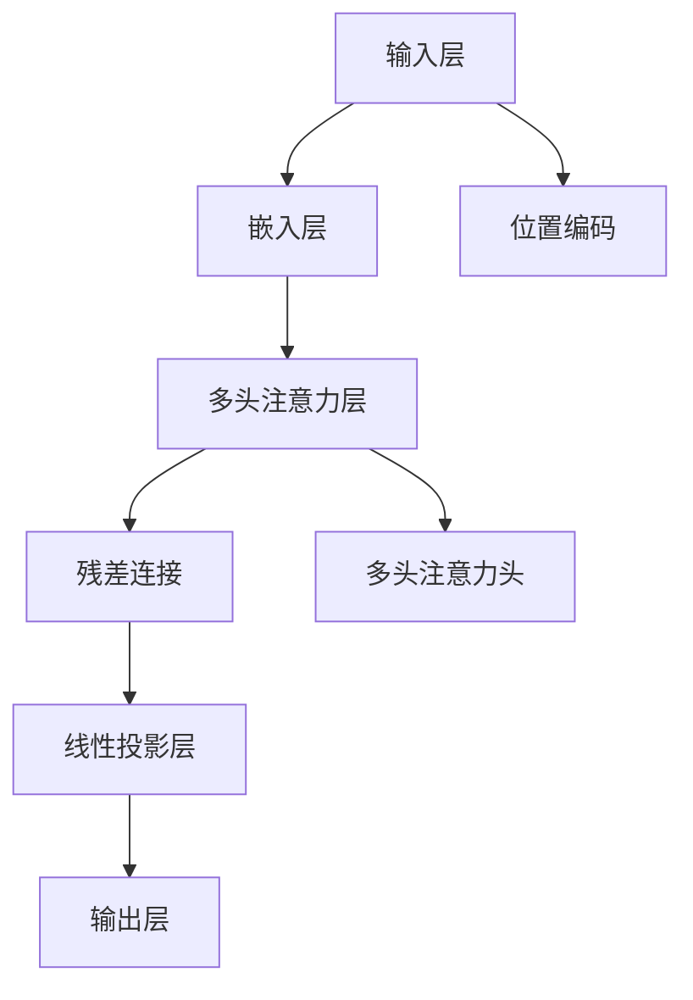

                 

# 大模型的市场需求与技术潜力

## 1. 背景介绍

### 1.1 问题由来
随着人工智能技术的快速发展，大模型在各个领域的应用愈发广泛。无论是语音识别、计算机视觉、自然语言处理(NLP)，还是自动驾驶、推荐系统、医疗诊断等领域，大模型都展现了强大的技术潜力和市场前景。

大模型之所以受到广泛关注，主要基于以下几个原因：
1. **高效学习**：大模型能够高效地利用海量的数据进行训练，学习到广泛的特征表示，具备强大的泛化能力。
2. **跨领域适应**：大模型通过自监督学习，能够跨领域地迁移应用，适应不同的任务和场景。
3. **解决长尾需求**：大模型能够处理小样本、长尾需求，提升小众任务的性能。
4. **工业部署**：大模型能够快速部署到生产环境，支持实时计算和在线服务。
5. **开源与开放**：大模型通常采用开源和开放的平台和工具，便于开发者使用和研究。

### 1.2 问题核心关键点
大模型市场需求和技术潜力主要体现在以下几个方面：

- **数据驱动**：大模型利用大规模数据进行训练，从而在多个领域中取得优异表现。
- **跨领域适用**：大模型在多个领域间具有高度的适应性，能够通过微调和迁移学习进行任务定制。
- **灵活部署**：大模型支持多种部署方式，从服务器端到移动端，从云计算到边缘计算，都能高效运行。
- **技术演进**：大模型的技术演进包括模型架构、训练方法、优化技术等，推动了AI技术的前沿发展。
- **商业应用**：大模型在商业应用中具有广泛的前景，能够提升企业竞争力，带来显著的经济效益。

为了更好地理解大模型的市场需求与技术潜力，本节将对大模型的核心概念、技术架构和应用场景进行详细阐述。

## 2. 核心概念与联系

### 2.1 核心概念概述

为了深入理解大模型的市场需求与技术潜力，首先需要明确以下几个核心概念：

- **大模型(大规模模型)**：指的是在数据驱动下，具有庞大参数量、广泛应用领域的模型。常见的大模型包括BERT、GPT、XLNet、T5等。
- **自监督学习(Self-Supervised Learning)**：指在没有标注数据的情况下，利用大规模无标注数据进行训练，学习模型自身的特征表示。
- **迁移学习(Transfer Learning)**：指在已有的大规模数据上进行训练，然后将其迁移到目标任务上进行微调，以适应新的应用场景。
- **微调(Fine-Tuning)**：指在预训练大模型的基础上，使用小规模标注数据进行有监督的微调，提升模型在特定任务上的性能。
- **参数高效微调(Parameter-Efficient Fine-Tuning, PEFT)**：指在微调过程中，仅更新模型中少量的参数，而保留大部分预训练参数，以提高微调效率。
- **少样本学习(Few-Shot Learning)**：指在只有少量标注样本的情况下，模型仍能学习新任务。
- **零样本学习(Zero-Shot Learning)**：指模型在未见过的样本上也能进行推理和预测。
- **强化学习(Reinforcement Learning, RL)**：指通过与环境的交互，不断优化模型行为，学习最优策略。

这些概念之间的逻辑关系可以通过以下Mermaid流程图来展示：

```mermaid
graph TB
    A[大模型] --> B[自监督学习]
    A --> C[迁移学习]
    C --> D[微调]
    D --> E[参数高效微调(PEFT)]
    D --> F[少样本学习]
    D --> G[零样本学习]
    A --> H[强化学习]
    H --> I[迁移学习]
    H --> J[微调]
    H --> K[少样本学习]
    H --> L[零样本学习]
```

这个流程图展示了大模型的核心概念及其之间的关系：

1. 大模型通过自监督学习获得基础特征表示。
2. 迁移学习是连接大模型与下游任务的桥梁，通过微调进行任务适配。
3. 微调是在大模型基础上，通过有监督训练提高特定任务性能。
4. 参数高效微调和少样本/零样本学习是微调的补充和提升。
5. 强化学习通过交互优化模型，形成更加精准的行为策略。

### 2.2 核心概念原理和架构的 Mermaid 流程图

由于篇幅限制，本节将仅提供大模型架构的简要说明。大模型通常采用Transformer模型架构，通过多头注意力机制、残差连接、位置编码等技术实现高效的特征表示和推理。以下是Transformer架构的Mermaid流程图：



该流程图展示了大模型中的数据流向：输入文本经过嵌入层转换成向量表示，通过多头注意力机制提取特征，残差连接增加信息传递，线性投影层输出最终结果，位置编码确保模型对不同位置的信息进行处理。

## 3. 核心算法原理 & 具体操作步骤

### 3.1 算法原理概述

大模型的核心算法原理包括自监督学习、迁移学习、微调等。其中，自监督学习是构建大模型的基础，迁移学习和大模型微调则是在此基础上进一步提升模型性能的方法。

自监督学习利用大规模无标注数据进行训练，通过数据中的潜在关系和结构信息，学习到丰富的特征表示。常见的自监督任务包括语言建模、掩码语言模型、对偶训练等。这些任务能够利用大数据的优势，让模型学习到广泛的语义和语法知识，提升模型的泛化能力。

迁移学习是在已有的大规模数据上进行训练，然后将其迁移到目标任务上进行微调。这种方法能够利用已有模型的知识，加速新任务的学习。常见的迁移学习方法包括微调、知识蒸馏、多任务学习等。这些方法通过在目标任务上微调部分层或完全迁移模型，实现对新任务的适配。

微调是在预训练大模型的基础上，使用小规模标注数据进行有监督训练，提升模型在特定任务上的性能。微调可以调整模型的部分或全部参数，以适应新任务的要求。微调方法的优点在于能够快速提升模型性能，特别是在小样本数据的情况下。

### 3.2 算法步骤详解

大模型的训练和微调流程通常包括以下几个关键步骤：

**Step 1: 数据预处理和标注**

- 收集大规模无标注数据，进行数据清洗和预处理。
- 选择合适的预训练任务，如语言建模、掩码语言模型等，进行自监督学习。
- 收集目标任务的标注数据，划分为训练集、验证集和测试集。

**Step 2: 模型训练**

- 选择合适的预训练模型，如BERT、GPT等。
- 将无标注数据输入模型，进行自监督学习。
- 在验证集上监测模型性能，调整超参数（如学习率、批大小等）。
- 在训练集上反复训练，直至模型收敛。

**Step 3: 微调**

- 选择合适的下游任务，如分类、匹配、生成等。
- 添加任务适配层，如线性分类器、解码器等。
- 使用目标任务的标注数据，对模型进行有监督微调。
- 在验证集上监测模型性能，调整超参数。
- 在测试集上评估模型性能，进行模型部署。

### 3.3 算法优缺点

大模型微调具有以下优点：

- **高效性**：大模型能够快速适应新任务，特别是在小样本数据的情况下。
- **泛化能力**：大模型通过自监督学习获得了广泛的特征表示，具有较强的泛化能力。
- **跨领域适用**：大模型能够跨领域迁移应用，适用于多个领域和任务。

同时，大模型微调也存在以下缺点：

- **计算资源需求高**：大模型的参数量庞大，训练和推理需要大量的计算资源。
- **数据标注成本高**：微调需要大量的标注数据，数据标注成本较高。
- **过拟合风险**：在微调过程中，如果学习率过大，容易过拟合，导致泛化性能下降。

### 3.4 算法应用领域

大模型的微调方法已经广泛应用于多个领域，以下是一些典型应用场景：

- **自然语言处理(NLP)**：在文本分类、命名实体识别、关系抽取、机器翻译、问答系统等任务上进行微调。
- **计算机视觉(CV)**：在图像分类、目标检测、图像生成、图像分割等任务上进行微调。
- **语音识别(SR)**：在语音识别、说话人识别、语音合成等任务上进行微调。
- **推荐系统**：在商品推荐、用户推荐、内容推荐等任务上进行微调。
- **医疗诊断**：在医学图像分析、疾病诊断、药物研发等任务上进行微调。
- **金融分析**：在股票预测、风险评估、信用评分等任务上进行微调。

## 4. 数学模型和公式 & 详细讲解

### 4.1 数学模型构建

以自然语言处理(NLP)任务为例，大模型微调的数学模型可以表示为：

- **输入层**：将输入文本转换为向量表示。
- **嵌入层**：将向量表示输入模型，进行特征提取。
- **注意力层**：通过多头注意力机制，提取输入中的关键信息。
- **全连接层**：将注意力层的输出进行线性变换，得到最终输出。

### 4.2 公式推导过程

以下以BERT模型为例，推导微调的数学公式：

设BERT模型的输入为 $x$，输出为 $y$，目标函数为 $L(y, \hat{y})$，则微调的目标为最小化损失函数 $L(y, \hat{y})$：

$$
\hat{y} = f_{BERT}(x)
$$

其中 $f_{BERT}$ 为BERT模型的预测函数。

假设目标任务为文本分类，标签 $y$ 为类别编号，则目标函数 $L(y, \hat{y})$ 可以表示为交叉熵损失函数：

$$
L(y, \hat{y}) = -\frac{1}{N}\sum_{i=1}^N [y_i\log \hat{y}_i+(1-y_i)\log (1-\hat{y}_i)]
$$

微调的优化目标是：

$$
\hat{\theta} = \mathop{\arg\min}_{\theta} \mathcal{L}(\theta)
$$

其中 $\theta$ 为模型参数，$\mathcal{L}$ 为损失函数，$\hat{\theta}$ 为最小化后的模型参数。

### 4.3 案例分析与讲解

以BERT模型为例，以下是微调训练过程的详细步骤：

**Step 1: 准备数据集**

- 收集目标任务的标注数据，分为训练集、验证集和测试集。
- 将文本数据进行分词和向量表示。

**Step 2: 设置模型和参数**

- 选择合适的预训练模型BERT，加载模型参数。
- 设置学习率、批大小、迭代次数等超参数。

**Step 3: 训练模型**

- 将训练集数据输入模型，计算损失函数。
- 反向传播更新模型参数，最小化损失函数。
- 在验证集上监测模型性能，调整超参数。
- 在测试集上评估模型性能。

**Step 4: 微调模型**

- 添加任务适配层，如线性分类器。
- 将目标任务的标注数据输入模型，进行微调训练。
- 在验证集上监测模型性能，调整超参数。
- 在测试集上评估模型性能。

## 5. 项目实践：代码实例和详细解释说明

### 5.1 开发环境搭建

在进行大模型微调的实践前，需要准备好开发环境。以下是使用Python进行PyTorch开发的环境配置流程：

1. 安装Anaconda：从官网下载并安装Anaconda，用于创建独立的Python环境。
2. 创建并激活虚拟环境：
```bash
conda create -n pytorch-env python=3.8 
conda activate pytorch-env
```

3. 安装PyTorch：根据CUDA版本，从官网获取对应的安装命令。例如：
```bash
conda install pytorch torchvision torchaudio cudatoolkit=11.1 -c pytorch -c conda-forge
```

4. 安装Transformers库：
```bash
pip install transformers
```

5. 安装各类工具包：
```bash
pip install numpy pandas scikit-learn matplotlib tqdm jupyter notebook ipython
```

完成上述步骤后，即可在`pytorch-env`环境中开始微调实践。

### 5.2 源代码详细实现

这里我们以BERT模型在IMDB情感分类任务上的微调为例，给出使用Transformers库对BERT模型进行微调的PyTorch代码实现。

首先，定义情感分类任务的数据处理函数：

```python
from transformers import BertTokenizer
from torch.utils.data import Dataset
import torch

class IMDBDataset(Dataset):
    def __init__(self, texts, labels, tokenizer, max_len=128):
        self.texts = texts
        self.labels = labels
        self.tokenizer = tokenizer
        self.max_len = max_len
        
    def __len__(self):
        return len(self.texts)
    
    def __getitem__(self, item):
        text = self.texts[item]
        label = self.labels[item]
        
        encoding = self.tokenizer(text, return_tensors='pt', max_length=self.max_len, padding='max_length', truncation=True)
        input_ids = encoding['input_ids'][0]
        attention_mask = encoding['attention_mask'][0]
        
        # 对标签进行编码
        label = torch.tensor(label, dtype=torch.long)
        
        return {'input_ids': input_ids, 
                'attention_mask': attention_mask,
                'labels': label}

# 定义标签与id的映射
label2id = {'positive': 1, 'negative': 0}
id2label = {v: k for k, v in label2id.items()}

# 创建dataset
tokenizer = BertTokenizer.from_pretrained('bert-base-uncased')

train_dataset = IMDBDataset(train_texts, train_labels, tokenizer)
dev_dataset = IMDBDataset(dev_texts, dev_labels, tokenizer)
test_dataset = IMDBDataset(test_texts, test_labels, tokenizer)
```

然后，定义模型和优化器：

```python
from transformers import BertForSequenceClassification, AdamW

model = BertForSequenceClassification.from_pretrained('bert-base-uncased', num_labels=2)

optimizer = AdamW(model.parameters(), lr=2e-5)
```

接着，定义训练和评估函数：

```python
from torch.utils.data import DataLoader
from tqdm import tqdm
from sklearn.metrics import accuracy_score

device = torch.device('cuda') if torch.cuda.is_available() else torch.device('cpu')
model.to(device)

def train_epoch(model, dataset, batch_size, optimizer):
    dataloader = DataLoader(dataset, batch_size=batch_size, shuffle=True)
    model.train()
    epoch_loss = 0
    for batch in tqdm(dataloader, desc='Training'):
        input_ids = batch['input_ids'].to(device)
        attention_mask = batch['attention_mask'].to(device)
        labels = batch['labels'].to(device)
        model.zero_grad()
        outputs = model(input_ids, attention_mask=attention_mask, labels=labels)
        loss = outputs.loss
        epoch_loss += loss.item()
        loss.backward()
        optimizer.step()
    return epoch_loss / len(dataloader)

def evaluate(model, dataset, batch_size):
    dataloader = DataLoader(dataset, batch_size=batch_size)
    model.eval()
    preds, labels = [], []
    with torch.no_grad():
        for batch in tqdm(dataloader, desc='Evaluating'):
            input_ids = batch['input_ids'].to(device)
            attention_mask = batch['attention_mask'].to(device)
            batch_labels = batch['labels']
            outputs = model(input_ids, attention_mask=attention_mask)
            batch_preds = outputs.logits.argmax(dim=1).to('cpu').tolist()
            batch_labels = batch_labels.to('cpu').tolist()
            for pred, label in zip(batch_preds, batch_labels):
                preds.append(pred)
                labels.append(label)
                
    print('Accuracy:', accuracy_score(labels, preds))
```

最后，启动训练流程并在测试集上评估：

```python
epochs = 5
batch_size = 16

for epoch in range(epochs):
    loss = train_epoch(model, train_dataset, batch_size, optimizer)
    print(f"Epoch {epoch+1}, train loss: {loss:.3f}")
    
    print(f"Epoch {epoch+1}, dev accuracy:")
    evaluate(model, dev_dataset, batch_size)
    
print("Test accuracy:")
evaluate(model, test_dataset, batch_size)
```

以上就是使用PyTorch对BERT进行情感分类任务微调的完整代码实现。可以看到，得益于Transformers库的强大封装，我们可以用相对简洁的代码完成BERT模型的加载和微调。

### 5.3 代码解读与分析

让我们再详细解读一下关键代码的实现细节：

**IMDBDataset类**：
- `__init__`方法：初始化文本、标签、分词器等关键组件。
- `__len__`方法：返回数据集的样本数量。
- `__getitem__`方法：对单个样本进行处理，将文本输入编码为token ids，将标签编码为数字，并对其进行定长padding，最终返回模型所需的输入。

**label2id和id2label字典**：
- 定义了标签与数字id之间的映射关系，用于将预测结果解码回真实的标签。

**训练和评估函数**：
- 使用PyTorch的DataLoader对数据集进行批次化加载，供模型训练和推理使用。
- 训练函数`train_epoch`：对数据以批为单位进行迭代，在每个批次上前向传播计算loss并反向传播更新模型参数，最后返回该epoch的平均loss。
- 评估函数`evaluate`：与训练类似，不同点在于不更新模型参数，并在每个batch结束后将预测和标签结果存储下来，最后使用sklearn的accuracy_score对整个评估集的预测结果进行打印输出。

**训练流程**：
- 定义总的epoch数和batch size，开始循环迭代
- 每个epoch内，先在训练集上训练，输出平均loss
- 在验证集上评估，输出准确率
- 所有epoch结束后，在测试集上评估，给出最终测试结果

可以看到，PyTorch配合Transformers库使得BERT微调的代码实现变得简洁高效。开发者可以将更多精力放在数据处理、模型改进等高层逻辑上，而不必过多关注底层的实现细节。

当然，工业级的系统实现还需考虑更多因素，如模型的保存和部署、超参数的自动搜索、更灵活的任务适配层等。但核心的微调范式基本与此类似。

## 6. 实际应用场景

### 6.1 智能客服系统

基于大模型微调的对话技术，可以广泛应用于智能客服系统的构建。传统客服往往需要配备大量人力，高峰期响应缓慢，且一致性和专业性难以保证。而使用微调后的对话模型，可以7x24小时不间断服务，快速响应客户咨询，用自然流畅的语言解答各类常见问题。

在技术实现上，可以收集企业内部的历史客服对话记录，将问题和最佳答复构建成监督数据，在此基础上对预训练对话模型进行微调。微调后的对话模型能够自动理解用户意图，匹配最合适的答案模板进行回复。对于客户提出的新问题，还可以接入检索系统实时搜索相关内容，动态组织生成回答。如此构建的智能客服系统，能大幅提升客户咨询体验和问题解决效率。

### 6.2 金融舆情监测

金融机构需要实时监测市场舆论动向，以便及时应对负面信息传播，规避金融风险。传统的人工监测方式成本高、效率低，难以应对网络时代海量信息爆发的挑战。基于大语言模型微调的文本分类和情感分析技术，为金融舆情监测提供了新的解决方案。

具体而言，可以收集金融领域相关的新闻、报道、评论等文本数据，并对其进行主题标注和情感标注。在此基础上对预训练语言模型进行微调，使其能够自动判断文本属于何种主题，情感倾向是正面、中性还是负面。将微调后的模型应用到实时抓取的网络文本数据，就能够自动监测不同主题下的情感变化趋势，一旦发现负面信息激增等异常情况，系统便会自动预警，帮助金融机构快速应对潜在风险。

### 6.3 个性化推荐系统

当前的推荐系统往往只依赖用户的历史行为数据进行物品推荐，无法深入理解用户的真实兴趣偏好。基于大语言模型微调技术，个性化推荐系统可以更好地挖掘用户行为背后的语义信息，从而提供更精准、多样的推荐内容。

在实践中，可以收集用户浏览、点击、评论、分享等行为数据，提取和用户交互的物品标题、描述、标签等文本内容。将文本内容作为模型输入，用户的后续行为（如是否点击、购买等）作为监督信号，在此基础上微调预训练语言模型。微调后的模型能够从文本内容中准确把握用户的兴趣点。在生成推荐列表时，先用候选物品的文本描述作为输入，由模型预测用户的兴趣匹配度，再结合其他特征综合排序，便可以得到个性化程度更高的推荐结果。

### 6.4 未来应用展望

随着大模型和微调方法的不断发展，基于微调范式将在更多领域得到应用，为传统行业带来变革性影响。

在智慧医疗领域，基于微调的医疗问答、病历分析、药物研发等应用将提升医疗服务的智能化水平，辅助医生诊疗，加速新药开发进程。

在智能教育领域，微调技术可应用于作业批改、学情分析、知识推荐等方面，因材施教，促进教育公平，提高教学质量。

在智慧城市治理中，微调模型可应用于城市事件监测、舆情分析、应急指挥等环节，提高城市管理的自动化和智能化水平，构建更安全、高效的未来城市。

此外，在企业生产、社会治理、文娱传媒等众多领域，基于大模型微调的人工智能应用也将不断涌现，为经济社会发展注入新的动力。相信随着技术的日益成熟，微调方法将成为人工智能落地应用的重要范式，推动人工智能技术在更广阔的领域大放异彩。

## 7. 工具和资源推荐
### 7.1 学习资源推荐

为了帮助开发者系统掌握大模型的市场需求与技术潜力，这里推荐一些优质的学习资源：

1. 《Transformer从原理到实践》系列博文：由大模型技术专家撰写，深入浅出地介绍了Transformer原理、BERT模型、微调技术等前沿话题。

2. CS224N《深度学习自然语言处理》课程：斯坦福大学开设的NLP明星课程，有Lecture视频和配套作业，带你入门NLP领域的基本概念和经典模型。

3. 《Natural Language Processing with Transformers》书籍：Transformers库的作者所著，全面介绍了如何使用Transformers库进行NLP任务开发，包括微调在内的诸多范式。

4. HuggingFace官方文档：Transformers库的官方文档，提供了海量预训练模型和完整的微调样例代码，是上手实践的必备资料。

5. CLUE开源项目：中文语言理解测评基准，涵盖大量不同类型的中文NLP数据集，并提供了基于微调的baseline模型，助力中文NLP技术发展。

通过对这些资源的学习实践，相信你一定能够快速掌握大模型的市场需求与技术潜力，并用于解决实际的NLP问题。
###  7.2 开发工具推荐

高效的开发离不开优秀的工具支持。以下是几款用于大模型微调开发的常用工具：

1. PyTorch：基于Python的开源深度学习框架，灵活动态的计算图，适合快速迭代研究。大部分预训练语言模型都有PyTorch版本的实现。

2. TensorFlow：由Google主导开发的开源深度学习框架，生产部署方便，适合大规模工程应用。同样有丰富的预训练语言模型资源。

3. Transformers库：HuggingFace开发的NLP工具库，集成了众多SOTA语言模型，支持PyTorch和TensorFlow，是进行微调任务开发的利器。

4. Weights & Biases：模型训练的实验跟踪工具，可以记录和可视化模型训练过程中的各项指标，方便对比和调优。与主流深度学习框架无缝集成。

5. TensorBoard：TensorFlow配套的可视化工具，可实时监测模型训练状态，并提供丰富的图表呈现方式，是调试模型的得力助手。

6. Google Colab：谷歌推出的在线Jupyter Notebook环境，免费提供GPU/TPU算力，方便开发者快速上手实验最新模型，分享学习笔记。

合理利用这些工具，可以显著提升大模型微调的开发效率，加快创新迭代的步伐。

### 7.3 相关论文推荐

大模型和微调技术的发展源于学界的持续研究。以下是几篇奠基性的相关论文，推荐阅读：

1. Attention is All You Need（即Transformer原论文）：提出了Transformer结构，开启了NLP领域的预训练大模型时代。

2. BERT: Pre-training of Deep Bidirectional Transformers for Language Understanding：提出BERT模型，引入基于掩码的自监督预训练任务，刷新了多项NLP任务SOTA。

3. Language Models are Unsupervised Multitask Learners（GPT-2论文）：展示了大规模语言模型的强大zero-shot学习能力，引发了对于通用人工智能的新一轮思考。

4. Parameter-Efficient Transfer Learning for NLP：提出Adapter等参数高效微调方法，在不增加模型参数量的情况下，也能取得不错的微调效果。

5. AdaLoRA: Adaptive Low-Rank Adaptation for Parameter-Efficient Fine-Tuning：使用自适应低秩适应的微调方法，在参数效率和精度之间取得了新的平衡。

6. Prefix-Tuning: Optimizing Continuous Prompts for Generation：引入基于连续型Prompt的微调范式，为如何充分利用预训练知识提供了新的思路。

这些论文代表了大模型微调技术的发展脉络。通过学习这些前沿成果，可以帮助研究者把握学科前进方向，激发更多的创新灵感。

## 8. 总结：未来发展趋势与挑战

### 8.1 总结

本文对大模型的市场需求与技术潜力进行了全面系统的介绍。首先阐述了大模型的背景和重要性，明确了其在多个领域的应用前景和价值。其次，从原理到实践，详细讲解了大模型的核心算法和微调方法。最后，探讨了微调技术在实际应用中的多种场景，展示了其广泛的应用潜力。

通过本文的系统梳理，可以看到，大模型微调技术已经成为AI领域的核心范式，在NLP、CV、SR、推荐系统等众多领域取得显著进展。伴随技术的不断演进，大模型微调方法将进一步拓展应用的广度和深度，推动人工智能技术向更广泛、更深入的领域发展。

### 8.2 未来发展趋势

展望未来，大模型微调技术将呈现以下几个发展趋势：

1. **模型规模持续增大**：随着计算资源的丰富和大数据的积累，大模型的参数量将继续增加，学习到的特征表示将更加丰富。

2. **跨领域迁移能力提升**：未来的大模型将具备更强的跨领域迁移能力，能够在不同领域间无缝切换，提升模型泛化性能。

3. **微调方法的优化**：未来的微调方法将更加高效，参数更新策略、正则化技术、对抗训练等将被进一步优化，提高微调效果和效率。

4. **微调应用的拓展**：微调技术将在更多领域得到应用，如智能制造、智慧农业、智能交通等，推动各个行业的数字化转型。

5. **智能接口的发展**：未来的微调模型将与各种智能接口结合，形成更加自然的交互方式，提升用户体验。

6. **多模态融合**：大模型将更多地与图像、视频、音频等多模态数据结合，提升对复杂任务的建模能力。

以上趋势凸显了大模型微调技术的广阔前景。这些方向的探索发展，必将进一步提升AI技术的性能和应用范围，为人类认知智能的进化带来深远影响。

### 8.3 面临的挑战

尽管大模型微调技术已经取得了显著进展，但在实际应用中仍面临一些挑战：

1. **计算资源需求高**：大模型训练和推理需要大量的计算资源，当前硬件设备尚未完全支持其高效运行。

2. **数据标注成本高**：微调需要大量的标注数据，数据标注成本较高，尤其在长尾需求和高专业性领域，标注数据获取困难。

3. **模型鲁棒性不足**：大模型在面对复杂和噪声数据时，鲁棒性有待提升，容易出现过拟合和泛化性能下降的情况。

4. **伦理与公平性问题**：大模型可能学习到偏见和有害信息，需要通过模型训练和数据处理的公平性约束，确保模型输出符合伦理标准。

5. **安全性和隐私保护**：大模型在处理敏感信息时，需要确保数据隐私和模型安全，防止数据泄露和模型攻击。

6. **可解释性和透明性**：大模型往往被视为"黑箱"，缺乏解释能力，需要开发更多可解释的模型和工具，增强模型的透明性和可信度。

以上挑战需要在技术、工程和管理等多个层面协同解决，才能进一步推动大模型微调技术的发展和应用。

### 8.4 研究展望

未来，大模型微调技术的研究将聚焦于以下几个方面：

1. **自监督学习的优化**：通过改进自监督学习任务和数据生成方法，提升模型的特征表示能力和泛化性能。

2. **微调方法的创新**：开发更多参数高效和计算高效的微调方法，如Prefix-Tuning、LoRA等，提升微调效率和效果。

3. **模型推理和部署的优化**：通过模型压缩、剪枝、量化等技术，提升大模型推理速度和部署效率，降低计算成本。

4. **多模态融合**：探索大模型与图像、视频、音频等多模态数据的结合，提升模型的跨模态建模能力。

5. **智能接口的设计**：开发更加自然、友好的智能接口，提升用户交互体验，拓展应用场景。

6. **伦理与公平性保障**：研究和制定大模型的伦理约束和公平性标准，确保模型输出的公正性和透明性。

这些研究方向的探索，将进一步推动大模型微调技术的发展，为人类社会带来更多的智能应用和服务。

## 9. 附录：常见问题与解答

**Q1：大模型微调是否适用于所有NLP任务？**

A: 大模型微调在大多数NLP任务上都能取得不错的效果，特别是对于数据量较小的任务。但对于一些特定领域的任务，如医学、法律等，仅仅依靠通用语料预训练的模型可能难以很好地适应。此时需要在特定领域语料上进一步预训练，再进行微调，才能获得理想效果。此外，对于一些需要时效性、个性化很强的任务，如对话、推荐等，微调方法也需要针对性的改进优化。

**Q2：微调过程中如何选择合适的学习率？**

A: 微调的学习率一般要比预训练时小1-2个数量级，如果使用过大的学习率，容易破坏预训练权重，导致过拟合。一般建议从1e-5开始调参，逐步减小学习率，直至收敛。也可以使用warmup策略，在开始阶段使用较小的学习率，再逐渐过渡到预设值。需要注意的是，不同的优化器(如AdamW、Adafactor等)以及不同的学习率调度策略，可能需要设置不同的学习率阈值。

**Q3：采用大模型微调时会面临哪些资源瓶颈？**

A: 目前主流的预训练大模型动辄以亿计的参数规模，对算力、内存、存储都提出了很高的要求。GPU/TPU等高性能设备是必不可少的，但即便如此，超大批次的训练和推理也可能遇到显存不足的问题。因此需要采用一些资源优化技术，如梯度积累、混合精度训练、模型并行等，来突破硬件瓶颈。同时，模型的存储和读取也可能占用大量时间和空间，需要采用模型压缩、稀疏化存储等方法进行优化。

**Q4：如何缓解微调过程中的过拟合问题？**

A: 过拟合是微调面临的主要挑战，尤其是在标注数据不足的情况下。常见的缓解策略包括：
1. 数据增强：通过回译、近义替换等方式扩充训练集
2. 正则化：使用L2正则、Dropout、Early Stopping等避免过拟合
3. 对抗训练：引入对抗样本，提高模型鲁棒性
4. 参数高效微调：只调整模型中少量的任务相关参数
5. 多模型集成：训练多个微调模型，取平均输出，抑制过拟合

这些策略往往需要根据具体任务和数据特点进行灵活组合。只有在数据、模型、训练、推理等各环节进行全面优化，才能最大限度地发挥大模型微调的威力。

**Q5：微调模型在落地部署时需要注意哪些问题？**

A: 将微调模型转化为实际应用，还需要考虑以下因素：
1. 模型裁剪：去除不必要的层和参数，减小模型尺寸，加快推理速度
2. 量化加速：将浮点模型转为定点模型，压缩存储空间，提高计算效率
3. 服务化封装：将模型封装为标准化服务接口，便于集成调用
4. 弹性伸缩：根据请求流量动态调整资源配置，平衡服务质量和成本
5. 监控告警：实时采集系统指标，设置异常告警阈值，确保服务稳定性
6. 安全防护：采用访问鉴权、数据脱敏等措施，保障数据和模型安全

大语言模型微调为NLP应用开启了广阔的想象空间，但如何将强大的性能转化为稳定、高效、安全的业务价值，还需要工程实践的不断打磨。唯有从数据、算法、工程、业务等多个维度协同发力，才能真正实现人工智能技术在垂直行业的规模化落地。总之，微调需要开发者根据具体任务，不断迭代和优化模型、数据和算法，方能得到理想的效果。

---

作者：禅与计算机程序设计艺术 / Zen and the Art of Computer Programming

