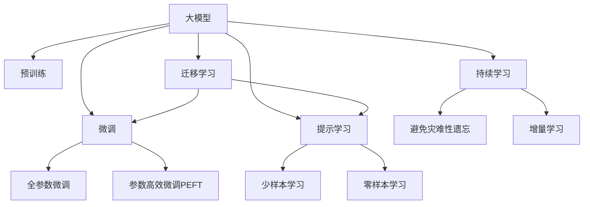

                 

# 大模型：未来商业的智能化发展

在过去的几年里，人工智能（AI）技术取得了飞速的发展，尤其是大模型（Large Models）的崛起，正在重塑商业领域的智能化发展路径。本文将从背景介绍、核心概念、算法原理、项目实践、应用场景、工具推荐、总结展望以及常见问题解答等多个方面，全面阐述大模型在未来商业智能化中的重要性和实践方法。

## 1. 背景介绍

### 1.1 问题由来
人工智能技术的迅猛发展，尤其是深度学习算法在图像识别、自然语言处理、语音识别等领域的突破，使得大模型逐渐成为商业智能化的新引擎。这些大模型，如OpenAI的GPT系列、Google的BERT等，通过在大规模无标签数据上预训练，具备了强大的泛化能力和语言生成能力，能够处理复杂的业务场景。

然而，大模型的发展也带来了新的挑战。如何高效利用这些大模型，提升商业决策的智能化水平，成为了业内关注的焦点。特别是在商业环境中，对大模型应用的灵活性和可操作性有更高的要求。

### 1.2 问题核心关键点
大模型在商业智能化应用中具有以下核心关键点：
- **规模庞大**：大模型的参数量级动辄上亿，能够在海量数据上学习到丰富的知识。
- **泛化能力强**：在大规模数据上的预训练，使得模型具备较强的泛化能力，能够在各种业务场景下进行智能预测和生成。
- **应用场景广泛**：从客户服务、风险管理、市场营销到生产管理，大模型可以应用于商业智能化的多个方面。

## 2. 核心概念与联系

### 2.1 核心概念概述

为了更好地理解大模型在商业智能化中的应用，本节将介绍几个关键概念及其联系：

- **大模型（Large Models）**：如GPT、BERT等，是具有庞大参数量和复杂网络结构的大型深度学习模型。通过在大规模数据上进行预训练，大模型可以学习到广泛的通用知识和领域特定的知识。
- **预训练（Pre-training）**：指在大规模无标签数据上训练模型，学习通用的语言表示。大模型通常采用自监督学习任务，如语言模型预测等，进行预训练。
- **微调（Fine-tuning）**：指在预训练模型基础上，使用小规模标注数据进行有监督学习，优化模型在特定业务场景中的应用。微调可以提升模型在特定任务上的精度和泛化能力。
- **迁移学习（Transfer Learning）**：指在预训练模型的基础上，利用已学习到的知识进行新任务的训练。大模型的迁移学习能力使得其可以在不同业务场景中进行快速适配。
- **参数高效微调（Parameter-Efficient Fine-tuning, PEFT）**：指在微调过程中，只更新模型中与特定任务相关的少量参数，以提高微调的效率和模型的泛化能力。
- **提示学习（Prompt Learning）**：通过设计特定的提示（Prompt），引导大模型进行特定任务的推理和生成。提示学习可以进一步提升模型的灵活性和可操作性。
- **少样本学习（Few-shot Learning）**：指在仅有少量样本的情况下，模型仍然能够进行有效的学习和预测。少样本学习使得大模型在商业环境中可以高效地处理新任务。
- **零样本学习（Zero-shot Learning）**：指模型在完全未见过的数据上进行预测，只依赖于输入的数据和预训练的知识。零样本学习可以提升模型在未知领域的表现。

这些概念之间的联系可以通过以下Mermaid流程图来展示：



这个流程图展示了核心概念之间的逻辑关系：

1. 大模型通过预训练获得基础能力。
2. 微调是对预训练模型进行任务特定的优化，可以分为全参数微调和参数高效微调（PEFT）。
3. 提示学习是一种不更新模型参数的方法，可以实现少样本学习和零样本学习。
4. 迁移学习是连接预训练模型与下游任务的桥梁，可以通过微调或提示学习来实现。
5. 持续学习旨在使模型能够不断学习新知识，同时避免遗忘旧知识。

这些概念共同构成了大模型在商业智能化中的应用框架，使其能够适应各种业务场景，提升商业决策的智能化水平。

## 3. 核心算法原理 & 具体操作步骤

### 3.1 算法原理概述

大模型在商业智能化中的应用，本质上是利用其在预训练过程中学习到的泛化能力和领域知识，通过微调和迁移学习，对特定业务场景进行优化。其核心思想是：

1. **预训练**：在大规模无标签数据上进行自监督学习，学习通用的语言表示。
2. **微调**：在特定业务场景的标注数据上进行有监督学习，优化模型在特定任务上的性能。
3. **迁移学习**：将预训练模型应用于新的业务场景，通过微调或提示学习，提升模型在特定任务上的表现。

### 3.2 算法步骤详解

基于大模型在商业智能化中的应用，其微调步骤通常包括以下几个关键步骤：

**Step 1: 准备预训练模型和数据集**
- 选择合适的预训练模型，如GPT、BERT等，作为初始化参数。
- 准备业务场景的标注数据集，划分为训练集、验证集和测试集。

**Step 2: 添加任务适配层**
- 根据业务场景，在预训练模型顶层设计合适的输出层和损失函数。
- 对于分类任务，通常在顶层添加线性分类器和交叉熵损失函数。
- 对于生成任务，通常使用语言模型的解码器输出概率分布，并以负对数似然为损失函数。

**Step 3: 设置微调超参数**
- 选择合适的优化算法及其参数，如AdamW、SGD等，设置学习率、批大小、迭代轮数等。
- 设置正则化技术及强度，包括权重衰减、Dropout、Early Stopping等。
- 确定冻结预训练参数的策略，如仅微调顶层，或全部参数都参与微调。

**Step 4: 执行梯度训练**
- 将训练集数据分批次输入模型，前向传播计算损失函数。
- 反向传播计算参数梯度，根据设定的优化算法和学习率更新模型参数。
- 周期性在验证集上评估模型性能，根据性能指标决定是否触发Early Stopping。
- 重复上述步骤直到满足预设的迭代轮数或Early Stopping条件。

**Step 5: 测试和部署**
- 在测试集上评估微调后模型，对比微调前后的精度提升。
- 使用微调后的模型对新数据进行推理预测，集成到实际的应用系统中。
- 持续收集新的数据，定期重新微调模型，以适应数据分布的变化。

以上是基于大模型在商业智能化中的应用的一般流程。在实际应用中，还需要针对具体业务场景的特点，对微调过程的各个环节进行优化设计，如改进训练目标函数，引入更多的正则化技术，搜索最优的超参数组合等，以进一步提升模型性能。

### 3.3 算法优缺点

基于大模型的商业智能化应用，具有以下优点：
1. **泛化能力强**：大模型通过预训练学习到广泛的通用知识和领域特定的知识，能够在各种业务场景下进行智能预测和生成。
2. **灵活性强**：通过微调和提示学习，大模型可以适应不同的业务需求，提升模型的灵活性和可操作性。
3. **高效性**：相较于从头训练模型，微调和迁移学习可以显著降低训练成本和开发时间，提高业务效率。

同时，该方法也存在一定的局限性：
1. **数据依赖性高**：微调和迁移学习的效果很大程度上取决于标注数据的质量和数量，获取高质量标注数据的成本较高。
2. **泛化能力受限**：当目标任务与预训练数据的分布差异较大时，微调的性能提升有限。
3. **复杂度较高**：大模型的设计和实现较为复杂，需要专业的知识和经验。
4. **解释性不足**：大模型的决策过程通常缺乏可解释性，难以对其推理逻辑进行分析和调试。

尽管存在这些局限性，但就目前而言，基于大模型的微调方法仍是商业智能化应用的主流范式。未来相关研究的重点在于如何进一步降低对标注数据的依赖，提高模型的泛化能力，同时兼顾可解释性和伦理安全性等因素。

### 3.4 算法应用领域

基于大模型的微调方法在商业智能化中的应用领域极为广泛，包括但不限于：

- **客户服务**：通过微调大模型，构建智能客服系统，提供24/7的客户咨询服务，提升客户满意度。
- **市场营销**：利用大模型进行客户行为分析、广告投放优化等，提升营销效果和ROI。
- **风险管理**：通过微调大模型，进行信用评分、欺诈检测等，提升金融风险管理能力。
- **供应链管理**：利用大模型进行需求预测、库存管理等，优化供应链效率。
- **智能制造**：通过微调大模型，进行设备预测性维护、质量控制等，提升生产效率和质量。

除了上述这些经典应用外，大模型微调还在诸多新兴领域得到了创新应用，如可控文本生成、情感分析、知识图谱构建等，为商业智能化带来了新的突破。随着预训练模型和微调方法的不断进步，相信商业智能化将在更多领域得到应用，为各行各业带来新的增长动力。

## 4. 数学模型和公式 & 详细讲解  
### 4.1 数学模型构建

本节将使用数学语言对大模型在商业智能化中的微调过程进行更加严格的刻画。

记大模型为 $M_{\theta}$，其中 $\theta$ 为预训练得到的模型参数。假设商业智能化任务 $T$ 的训练集为 $D=\{(x_i,y_i)\}_{i=1}^N, x_i \in \mathcal{X}, y_i \in \mathcal{Y}$。

定义模型 $M_{\theta}$ 在数据样本 $(x,y)$ 上的损失函数为 $\ell(M_{\theta}(x),y)$，则在数据集 $D$ 上的经验风险为：

$$
\mathcal{L}(\theta) = \frac{1}{N} \sum_{i=1}^N \ell(M_{\theta}(x_i),y_i)
$$

微调的优化目标是最小化经验风险，即找到最优参数：

$$
\theta^* = \mathop{\arg\min}_{\theta} \mathcal{L}(\theta)
$$

在实践中，我们通常使用基于梯度的优化算法（如SGD、Adam等）来近似求解上述最优化问题。设 $\eta$ 为学习率，$\lambda$ 为正则化系数，则参数的更新公式为：

$$
\theta \leftarrow \theta - \eta \nabla_{\theta}\mathcal{L}(\theta) - \eta\lambda\theta
$$

其中 $\nabla_{\theta}\mathcal{L}(\theta)$ 为损失函数对参数 $\theta$ 的梯度，可通过反向传播算法高效计算。

### 4.2 公式推导过程

以下我们以分类任务为例，推导交叉熵损失函数及其梯度的计算公式。

假设模型 $M_{\theta}$ 在输入 $x$ 上的输出为 $\hat{y}=M_{\theta}(x) \in [0,1]$，表示样本属于正类的概率。真实标签 $y \in \{0,1\}$。则二分类交叉熵损失函数定义为：

$$
\ell(M_{\theta}(x),y) = -[y\log \hat{y} + (1-y)\log (1-\hat{y})]
$$

将其代入经验风险公式，得：

$$
\mathcal{L}(\theta) = -\frac{1}{N}\sum_{i=1}^N [y_i\log M_{\theta}(x_i)+(1-y_i)\log(1-M_{\theta}(x_i))]
$$

根据链式法则，损失函数对参数 $\theta_k$ 的梯度为：

$$
\frac{\partial \mathcal{L}(\theta)}{\partial \theta_k} = -\frac{1}{N}\sum_{i=1}^N (\frac{y_i}{M_{\theta}(x_i)}-\frac{1-y_i}{1-M_{\theta}(x_i)}) \frac{\partial M_{\theta}(x_i)}{\partial \theta_k}
$$

其中 $\frac{\partial M_{\theta}(x_i)}{\partial \theta_k}$ 可进一步递归展开，利用自动微分技术完成计算。

在得到损失函数的梯度后，即可带入参数更新公式，完成模型的迭代优化。重复上述过程直至收敛，最终得到适应商业智能化任务的最优模型参数 $\theta^*$。

## 5. 项目实践：代码实例和详细解释说明
### 5.1 开发环境搭建

在进行商业智能化的大模型微调实践前，我们需要准备好开发环境。以下是使用Python进行PyTorch开发的环境配置流程：

1. 安装Anaconda：从官网下载并安装Anaconda，用于创建独立的Python环境。

2. 创建并激活虚拟环境：
```bash
conda create -n pytorch-env python=3.8 
conda activate pytorch-env
```

3. 安装PyTorch：根据CUDA版本，从官网获取对应的安装命令。例如：
```bash
conda install pytorch torchvision torchaudio cudatoolkit=11.1 -c pytorch -c conda-forge
```

4. 安装Transformers库：
```bash
pip install transformers
```

5. 安装各类工具包：
```bash
pip install numpy pandas scikit-learn matplotlib tqdm jupyter notebook ipython
```

完成上述步骤后，即可在`pytorch-env`环境中开始微调实践。

### 5.2 源代码详细实现

下面我们以客户服务智能问答系统为例，给出使用Transformers库对BERT模型进行商业智能化微调的PyTorch代码实现。

首先，定义客户服务智能问答系统的数据处理函数：

```python
from transformers import BertTokenizer
from torch.utils.data import Dataset
import torch

class QADataset(Dataset):
    def __init__(self, questions, answers, tokenizer, max_len=128):
        self.questions = questions
        self.answers = answers
        self.tokenizer = tokenizer
        self.max_len = max_len
        
    def __len__(self):
        return len(self.questions)
    
    def __getitem__(self, item):
        question = self.questions[item]
        answer = self.answers[item]
        
        encoding = self.tokenizer(question, return_tensors='pt', max_length=self.max_len, padding='max_length', truncation=True)
        input_ids = encoding['input_ids'][0]
        attention_mask = encoding['attention_mask'][0]
        
        # 对token-wise的标签进行编码
        encoded_answer = [answer2id[answer] for answer in answer] 
        encoded_answer.extend([answer2id['<eos>']] * (self.max_len - len(encoded_answer)))
        labels = torch.tensor(encoded_answer, dtype=torch.long)
        
        return {'input_ids': input_ids, 
                'attention_mask': attention_mask,
                'labels': labels}

# 标签与id的映射
answer2id = {'<eos>': 0, 'bestAnswer': 1, 'correctAnswer': 2, 'worstAnswer': 3}
id2answer = {v: k for k, v in answer2id.items()}

# 创建dataset
tokenizer = BertTokenizer.from_pretrained('bert-base-cased')

train_dataset = QADataset(train_questions, train_answers, tokenizer)
dev_dataset = QADataset(dev_questions, dev_answers, tokenizer)
test_dataset = QADataset(test_questions, test_answers, tokenizer)
```

然后，定义模型和优化器：

```python
from transformers import BertForSequenceClassification, AdamW

model = BertForSequenceClassification.from_pretrained('bert-base-cased', num_labels=len(answer2id))

optimizer = AdamW(model.parameters(), lr=2e-5)
```

接着，定义训练和评估函数：

```python
from torch.utils.data import DataLoader
from tqdm import tqdm
from sklearn.metrics import classification_report

device = torch.device('cuda') if torch.cuda.is_available() else torch.device('cpu')
model.to(device)

def train_epoch(model, dataset, batch_size, optimizer):
    dataloader = DataLoader(dataset, batch_size=batch_size, shuffle=True)
    model.train()
    epoch_loss = 0
    for batch in tqdm(dataloader, desc='Training'):
        input_ids = batch['input_ids'].to(device)
        attention_mask = batch['attention_mask'].to(device)
        labels = batch['labels'].to(device)
        model.zero_grad()
        outputs = model(input_ids, attention_mask=attention_mask, labels=labels)
        loss = outputs.loss
        epoch_loss += loss.item()
        loss.backward()
        optimizer.step()
    return epoch_loss / len(dataloader)

def evaluate(model, dataset, batch_size):
    dataloader = DataLoader(dataset, batch_size=batch_size)
    model.eval()
    preds, labels = [], []
    with torch.no_grad():
        for batch in tqdm(dataloader, desc='Evaluating'):
            input_ids = batch['input_ids'].to(device)
            attention_mask = batch['attention_mask'].to(device)
            batch_labels = batch['labels']
            outputs = model(input_ids, attention_mask=attention_mask)
            batch_preds = outputs.logits.argmax(dim=2).to('cpu').tolist()
            batch_labels = batch_labels.to('cpu').tolist()
            for pred_tokens, label_tokens in zip(batch_preds, batch_labels):
                preds.append(pred_tokens[:len(label_tokens)])
                labels.append(label_tokens)
                
    print(classification_report(labels, preds))
```

最后，启动训练流程并在测试集上评估：

```python
epochs = 5
batch_size = 16

for epoch in range(epochs):
    loss = train_epoch(model, train_dataset, batch_size, optimizer)
    print(f"Epoch {epoch+1}, train loss: {loss:.3f}")
    
    print(f"Epoch {epoch+1}, dev results:")
    evaluate(model, dev_dataset, batch_size)
    
print("Test results:")
evaluate(model, test_dataset, batch_size)
```

以上就是使用PyTorch对BERT进行客户服务智能问答系统微调的完整代码实现。可以看到，得益于Transformers库的强大封装，我们可以用相对简洁的代码完成BERT模型的加载和微调。

### 5.3 代码解读与分析

让我们再详细解读一下关键代码的实现细节：

**QADataset类**：
- `__init__`方法：初始化问题和答案、分词器等关键组件。
- `__len__`方法：返回数据集的样本数量。
- `__getitem__`方法：对单个样本进行处理，将问题和答案输入编码为token ids，将答案编码为数字，并对其进行定长padding，最终返回模型所需的输入。

**answer2id和id2answer字典**：
- 定义了问题和答案与数字id之间的映射关系，用于将token-wise的预测结果解码回真实答案。

**训练和评估函数**：
- 使用PyTorch的DataLoader对数据集进行批次化加载，供模型训练和推理使用。
- 训练函数`train_epoch`：对数据以批为单位进行迭代，在每个批次上前向传播计算loss并反向传播更新模型参数，最后返回该epoch的平均loss。
- 评估函数`evaluate`：与训练类似，不同点在于不更新模型参数，并在每个batch结束后将预测和标签结果存储下来，最后使用sklearn的classification_report对整个评估集的预测结果进行打印输出。

**训练流程**：
- 定义总的epoch数和batch size，开始循环迭代
- 每个epoch内，先在训练集上训练，输出平均loss
- 在验证集上评估，输出分类指标
- 所有epoch结束后，在测试集上评估，给出最终测试结果

可以看到，PyTorch配合Transformers库使得BERT微调的代码实现变得简洁高效。开发者可以将更多精力放在数据处理、模型改进等高层逻辑上，而不必过多关注底层的实现细节。

当然，工业级的系统实现还需考虑更多因素，如模型的保存和部署、超参数的自动搜索、更灵活的任务适配层等。但核心的微调范式基本与此类似。

## 6. 实际应用场景
### 6.1 智能客服系统

基于大模型的客户服务智能问答系统，可以广泛应用于智能客服系统的构建。传统客服往往需要配备大量人力，高峰期响应缓慢，且一致性和专业性难以保证。而使用微调后的对话模型，可以7x24小时不间断服务，快速响应客户咨询，用自然流畅的语言解答各类常见问题。

在技术实现上，可以收集企业内部的历史客服对话记录，将问题和最佳答复构建成监督数据，在此基础上对预训练对话模型进行微调。微调后的对话模型能够自动理解用户意图，匹配最合适的答案模板进行回复。对于客户提出的新问题，还可以接入检索系统实时搜索相关内容，动态组织生成回答。如此构建的智能客服系统，能大幅提升客户咨询体验和问题解决效率。

### 6.2 金融舆情监测

金融机构需要实时监测市场舆论动向，以便及时应对负面信息传播，规避金融风险。传统的人工监测方式成本高、效率低，难以应对网络时代海量信息爆发的挑战。基于大模型的文本分类和情感分析技术，为金融舆情监测提供了新的解决方案。

具体而言，可以收集金融领域相关的新闻、报道、评论等文本数据，并对其进行主题标注和情感标注。在此基础上对预训练语言模型进行微调，使其能够自动判断文本属于何种主题，情感倾向是正面、中性还是负面。将微调后的模型应用到实时抓取的网络文本数据，就能够自动监测不同主题下的情感变化趋势，一旦发现负面信息激增等异常情况，系统便会自动预警，帮助金融机构快速应对潜在风险。

### 6.3 个性化推荐系统

当前的推荐系统往往只依赖用户的历史行为数据进行物品推荐，无法深入理解用户的真实兴趣偏好。基于大模型微调技术，个性化推荐系统可以更好地挖掘用户行为背后的语义信息，从而提供更精准、多样的推荐内容。

在实践中，可以收集用户浏览、点击、评论、分享等行为数据，提取和用户交互的物品标题、描述、标签等文本内容。将文本内容作为模型输入，用户的后续行为（如是否点击、购买等）作为监督信号，在此基础上微调预训练语言模型。微调后的模型能够从文本内容中准确把握用户的兴趣点。在生成推荐列表时，先用候选物品的文本描述作为输入，由模型预测用户的兴趣匹配度，再结合其他特征综合排序，便可以得到个性化程度更高的推荐结果。

### 6.4 未来应用展望

随着大模型和微调方法的不断发展，基于微调范式将在更多领域得到应用，为传统行业带来变革性影响。

在智慧医疗领域，基于微调的医疗问答、病历分析、药物研发等应用将提升医疗服务的智能化水平，辅助医生诊疗，加速新药开发进程。

在智能教育领域，微调技术可应用于作业批改、学情分析、知识推荐等方面，因材施教，促进教育公平，提高教学质量。

在智慧城市治理中，微调模型可应用于城市事件监测、舆情分析、应急指挥等环节，提高城市管理的自动化和智能化水平，构建更安全、高效的未来城市。

此外，在企业生产、社会治理、文娱传媒等众多领域，基于大模型微调的人工智能应用也将不断涌现，为经济社会发展注入新的动力。相信随着技术的日益成熟，微调方法将成为人工智能落地应用的重要范式，推动人工智能技术在垂直行业的规模化落地。总之，大模型微调技术正在成为商业智能化应用的基石，其应用范围和深度将进一步拓展，为商业决策提供更强大的智能支持。

## 7. 工具和资源推荐
### 7.1 学习资源推荐

为了帮助开发者系统掌握大模型在商业智能化中的应用，这里推荐一些优质的学习资源：

1. 《Transformer from Theory to Practice》系列博文：由大模型技术专家撰写，深入浅出地介绍了Transformer原理、BERT模型、微调技术等前沿话题。

2. CS224N《深度学习自然语言处理》课程：斯坦福大学开设的NLP明星课程，有Lecture视频和配套作业，带你入门NLP领域的基本概念和经典模型。

3. 《Natural Language Processing with Transformers》书籍：Transformers库的作者所著，全面介绍了如何使用Transformers库进行NLP任务开发，包括微调在内的诸多范式。

4. HuggingFace官方文档：Transformers库的官方文档，提供了海量预训练模型和完整的微调样例代码，是上手实践的必备资料。

5. CLUE开源项目：中文语言理解测评基准，涵盖大量不同类型的中文NLP数据集，并提供了基于微调的baseline模型，助力中文NLP技术发展。

通过对这些资源的学习实践，相信你一定能够快速掌握大模型在商业智能化中的精髓，并用于解决实际的NLP问题。
###  7.2 开发工具推荐

高效的开发离不开优秀的工具支持。以下是几款用于大模型在商业智能化应用的开发工具：

1. PyTorch：基于Python的开源深度学习框架，灵活动态的计算图，适合快速迭代研究。大部分预训练语言模型都有PyTorch版本的实现。

2. TensorFlow：由Google主导开发的开源深度学习框架，生产部署方便，适合大规模工程应用。同样有丰富的预训练语言模型资源。

3. Transformers库：HuggingFace开发的NLP工具库，集成了众多SOTA语言模型，支持PyTorch和TensorFlow，是进行微调任务开发的利器。

4. Weights & Biases：模型训练的实验跟踪工具，可以记录和可视化模型训练过程中的各项指标，方便对比和调优。与主流深度学习框架无缝集成。

5. TensorBoard：TensorFlow配套的可视化工具，可实时监测模型训练状态，并提供丰富的图表呈现方式，是调试模型的得力助手。

6. Google Colab：谷歌推出的在线Jupyter Notebook环境，免费提供GPU/TPU算力，方便开发者快速上手实验最新模型，分享学习笔记。

合理利用这些工具，可以显著提升大模型在商业智能化应用中的开发效率，加快创新迭代的步伐。

### 7.3 相关论文推荐

大模型和微调技术的发展源于学界的持续研究。以下是几篇奠基性的相关论文，推荐阅读：

1. Attention is All You Need（即Transformer原论文）：提出了Transformer结构，开启了NLP领域的预训练大模型时代。

2. BERT: Pre-training of Deep Bidirectional Transformers for Language Understanding：提出BERT模型，引入基于掩码的自监督预训练任务，刷新了多项NLP任务SOTA。

3. Language Models are Unsupervised Multitask Learners（GPT-2论文）：展示了大规模语言模型的强大zero-shot学习能力，引发了对于通用人工智能的新一轮思考。

4. Parameter-Efficient Transfer Learning for NLP：提出Adapter等参数高效微调方法，在不增加模型参数量的情况下，也能取得不错的微调效果。

5. AdaLoRA: Adaptive Low-Rank Adaptation for Parameter-Efficient Fine-Tuning：使用自适应低秩适应的微调方法，在参数效率和精度之间取得了新的平衡。

这些论文代表了大模型在商业智能化应用的发展脉络。通过学习这些前沿成果，可以帮助研究者把握学科前进方向，激发更多的创新灵感。

## 8. 总结：未来发展趋势与挑战

### 8.1 总结

本文对大模型在商业智能化中的应用进行了全面系统的介绍。首先阐述了大模型和微调技术的研究背景和意义，明确了微调在拓展预训练模型应用、提升商业决策智能化水平方面的独特价值。其次，从原理到实践，详细讲解了微调过程的数学原理和关键步骤，给出了微调任务开发的完整代码实例。同时，本文还广泛探讨了微调方法在智能客服、金融舆情、个性化推荐等多个领域的应用前景，展示了微调范式的巨大潜力。此外，本文精选了微调技术的各类学习资源，力求为读者提供全方位的技术指引。

通过本文的系统梳理，可以看到，大模型在商业智能化中的应用前景广阔，具有泛化能力强、灵活性高、效率高等优势。通过微调和迁移学习，大模型可以在各种商业场景下进行智能预测和生成，极大地提升了商业决策的智能化水平。未来，伴随大模型和微调方法的持续演进，相信商业智能化将在更多领域得到应用，为各行各业带来新的增长动力。

### 8.2 未来发展趋势

展望未来，大模型在商业智能化中的应用将呈现以下几个发展趋势：

1. **规模进一步增大**：随着算力成本的下降和数据规模的扩张，预训练语言模型的参数量还将持续增长。超大规模语言模型蕴含的丰富语言知识，有望支撑更加复杂多变的商业场景。

2. **模型应用场景更广**：大模型不仅可以应用于传统的文本处理任务，如文本分类、问答系统等，还可以拓展到视频、语音等多模态数据处理。多模态信息的融合，将显著提升大模型在商业智能中的应用范围和效果。

3. **个性化推荐技术发展**：基于大模型的推荐系统能够更好地理解用户多维度的兴趣和行为，提供更加精准、个性化的推荐服务，进一步提升用户体验。

4. **智能客服系统优化**：通过微调和改进对话模型，提升智能客服的交互自然度和问题解决能力，实现更高效、人性化的客户服务。

5. **商业决策支持系统优化**：大模型在商业决策支持系统中，可以提供更准确的预测和决策建议，辅助企业进行更科学的商业决策。

6. **数据安全和隐私保护**：随着大模型在商业应用中的普及，数据安全和隐私保护问题愈发重要。未来的商业智能化应用将更加注重数据隐私保护，引入联邦学习、差分隐私等技术，确保数据安全。

### 8.3 面临的挑战

尽管大模型在商业智能化应用中展示了巨大的潜力，但在迈向更加智能化、普适化应用的过程中，仍面临以下挑战：

1. **标注数据成本高**：微调和迁移学习的效果很大程度上取决于标注数据的质量和数量，获取高质量标注数据的成本较高。如何降低微调对标注样本的依赖，是未来的一个重要研究方向。

2. **泛化能力不足**：当目标任务与预训练数据的分布差异较大时，微调的性能提升有限。如何提升大模型的泛化能力，使其在不同商业场景下都能表现优异，仍然是一个挑战。

3. **模型鲁棒性差**：商业智能化应用中，模型需要面对各种未知或异常的数据输入。如何提高大模型的鲁棒性和稳定性，避免在异常输入下出现决策失误，是另一个重要课题。

4. **解释性和可控性不足**：大模型的决策过程通常缺乏可解释性，难以对其推理逻辑进行分析和调试。如何在提升模型性能的同时，增强模型的解释性和可控性，需要进一步的研究和实践。

5. **伦理和隐私问题**：随着大模型在商业应用中的普及，伦理和隐私问题也愈发突出。如何构建公平、透明的商业智能化系统，避免偏见和歧视，是未来需要重点解决的问题。

### 8.4 研究展望

面对大模型在商业智能化应用中面临的挑战，未来的研究需要在以下几个方面寻求新的突破：

1. **无监督和半监督学习**：探索利用无监督和半监督学习的方法，降低对标注数据的需求，提高模型在各种商业场景下的泛化能力。

2. **参数高效微调**：开发更加参数高效的微调方法，如 Adapter、LoRA等，在固定大部分预训练参数的同时，只更新极少量的任务相关参数。

3. **多模态融合**：将视觉、语音、文本等多模态数据进行融合，提升大模型在商业智能化中的表现和适应性。

4. **因果推理和对比学习**：引入因果推理和对比学习思想，增强模型的推理能力和泛化性能，避免在未知或异常输入下出现决策失误。

5. **知识图谱和逻辑推理**：将符号化的先验知识，如知识图谱、逻辑规则等，与神经网络模型进行融合，提升模型的推理能力和泛化性能。

6. **数据隐私保护**：引入差分隐私、联邦学习等技术，保护用户数据隐私，确保商业智能化的伦理和法律合规。

通过这些研究方向的探索，相信大模型在商业智能化中的应用将更加广泛和深入，为各行各业带来新的增长动力和价值提升。未来，随着技术的不断进步和应用的不断深化，大模型在商业智能化中将发挥更加重要的作用，推动商业智能化的快速发展和普及。

## 9. 附录：常见问题与解答

**Q1：大模型在商业智能化中是否适用于所有商业场景？**

A: 大模型在商业智能化中具有较强的泛化能力，适用于大多数商业场景。但对于一些需要高度定制化、实时性要求极高或数据隐私保护的商业场景，可能存在一定的局限性。在这些场景中，可能需要结合领域知识进行定制化开发，或采用联邦学习等技术进行隐私保护。

**Q2：微调大模型时如何选择合适的学习率？**

A: 微调大模型的学习率通常要比预训练时小1-2个数量级，使用过大的学习率容易破坏预训练权重，导致过拟合。一般建议从1e-5开始调参，逐步减小学习率，直至收敛。也可以使用warmup策略，在开始阶段使用较小的学习率，再逐渐过渡到预设值。需要注意的是，不同的优化器(如AdamW、Adafactor等)以及不同的学习率调度策略，可能需要设置不同的学习率阈值。

**Q3：微调大模型时如何避免过拟合？**

A: 微调大模型时，过拟合是一个常见的问题。以下是一些缓解过拟合的方法：
1. 数据增强：通过对训练样本改写、回译等方式丰富训练集多样性。
2. 正则化技术：如L2正则、Dropout、Early Stopping等，防止模型过度适应小规模训练集。
3. 参数高效微调：只更新模型的顶层或与特定任务相关的参数，避免更新过多无关参数。
4. 对抗训练：加入对抗样本，提高模型鲁棒性。
5. 多模型集成：训练多个微调模型，取平均输出，抑制过拟合。

这些策略往往需要根据具体任务和数据特点进行灵活组合。只有在数据、模型、训练、推理等各环节进行全面优化，才能最大限度地发挥大模型微调的威力。

**Q4：大模型在商业智能化中如何进行迁移学习？**

A: 大模型在商业智能化中的应用通常需要进行迁移学习，即将预训练模型应用于新的商业场景。以下是进行迁移学习的一般步骤：
1. 选择合适的预训练模型，如BERT、GPT等，作为初始化参数。
2. 收集新的商业场景的标注数据集，划分为训练集、验证集和测试集。
3. 在预训练模型的基础上，添加任务适配层，如分类器、生成器等，进行微调。
4. 使用优化算法进行微调，更新模型参数，最小化损失函数。
5. 在验证集上评估模型性能，根据性能调整参数和策略。
6. 在测试集上评估模型性能，确保模型在新商业场景中的表现。

迁移学习可以使得大模型快速适应新的商业场景，提升模型的泛化能力和应用效果。

**Q5：如何在大模型中引入因果推理？**

A: 因果推理是大模型在商业智能化中提升决策能力的重要方法。以下是一些引入因果推理的方法：
1. 引入因果图结构，明确因果关系。
2. 使用因果推断算法，如Do-calculus，推理因果关系。
3. 引入时间序列数据，考虑时间因果关系。
4. 引入对比学习，学习因果特征。
5. 使用对抗样本，增强模型鲁棒性，避免因果偏差。

因果推理可以使得大模型更好地理解因果关系，提升在商业场景中的决策能力。

通过上述问题解答，相信你对大模型在商业智能化中的应用有了更全面的理解。未来，随着技术的不断进步和应用的不断深化，大模型在商业智能化中将发挥更加重要的作用，推动商业智能化的快速发展和普及。

