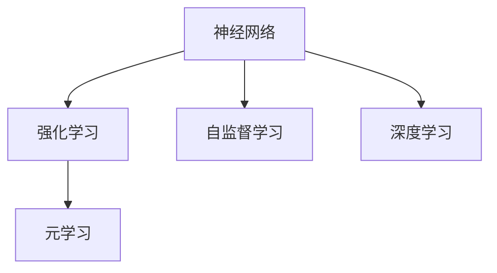

                 

## 1. 背景介绍

神经科学研究表明，大脑在执行各种认知任务时，通常会根据行为结果给予奖励信号。这种奖励机制被称为“强化学习”（Reinforcement Learning, RL），在AI领域有广泛应用。然而，传统的神经网络结构并未设计成强化学习框架，这使得其缺乏对奖励信号的响应。本文将探讨大脑如何通过奖励机制进行学习，以及如何在神经网络中引入类似的奖励机制，从而提升其学习和决策能力。

## 2. 核心概念与联系

### 2.1 核心概念概述

- **强化学习**（Reinforcement Learning, RL）：通过在环境中进行试错，学习在特定状态下采取某种行动以最大化长期奖励的机制。
- **神经网络**：由人工神经元组成的网络结构，用于执行复杂的任务，如图像识别、语音识别等。
- **自监督学习**（Supervised Learning）：通过无监督学习算法自动地生成或收集标签，从而实现监督学习的效果。
- **深度学习**（Deep Learning）：利用多层神经网络进行复杂任务训练的机器学习方法。
- **元学习**（Meta-Learning）：学习如何学习，即通过少量样本进行快速适应新任务的能力。

这些概念之间的联系可以通过以下Mermaid流程图来展示：



这个流程图展示了几类机器学习方法和它们之间的关系：

1. 神经网络作为基础模型，支持深度学习和自监督学习。
2. 强化学习通过行为奖励进行模型训练，是神经网络的重要训练方式之一。
3. 元学习指导模型快速适应新任务，强化学习可以通过不断试错，实现类似效果。

## 3. 核心算法原理 & 具体操作步骤

### 3.1 算法原理概述

在强化学习中，智能体（Agent）通过与环境交互，采取行动（Action），并根据行动结果获得奖励（Reward）。通过不断地试错和奖励反馈，智能体学习到最佳行动策略。这种学习机制被称为“强化学习”。

在神经网络中，传统的反向传播算法（Backpropagation）主要用于监督学习，即通过标签数据训练模型。而强化学习则是一种无标签的训练方式，通过奖励信号引导模型优化。

### 3.2 算法步骤详解

强化学习的核心步骤包括：

1. **环境设定**：定义一个环境，智能体在该环境中进行行动。环境可以是一个游戏、机器人控制等。
2. **状态空间**：定义环境的当前状态，状态可以是连续的向量或离散的状态。
3. **行动空间**：定义智能体可以采取的行动，可以是连续的向量或离散的行动。
4. **奖励函数**：定义在状态和行动下，环境给予的奖励。奖励可以是正值（正向激励）或负值（负向惩罚）。
5. **策略更新**：根据奖励信号，更新智能体的策略（行动选择），以便在未来的状态中采取更好的行动。

### 3.3 算法优缺点

强化学习的优点包括：

1. **无标签数据训练**：强化学习可以无标签地进行训练，适合大规模数据集。
2. **泛化能力强**：通过试错和奖励反馈，模型能够学习到更泛化的知识。
3. **动态调整**：智能体可以根据环境变化动态调整策略。

缺点包括：

1. **奖励设计困难**：奖励函数设计复杂，需要考虑长期奖励和短期奖励的平衡。
2. **探索与利用冲突**：智能体需要在探索新行动和利用已有知识之间找到平衡。
3. **高维度空间**：状态和行动空间通常维度很高，难以优化。

### 3.4 算法应用领域

强化学习在以下领域有广泛应用：

1. **游戏AI**：通过奖励机制训练AI玩家，使其能够在复杂游戏中胜出。
2. **机器人控制**：通过强化学习训练机器人执行特定任务，如避障、抓取等。
3. **推荐系统**：通过用户反馈的奖励信号，优化推荐算法，提高推荐效果。
4. **自然语言处理**：通过对话交互的奖励信号，训练对话系统，提高对话质量。

## 4. 数学模型和公式 & 详细讲解 & 举例说明

### 4.1 数学模型构建

强化学习的数学模型通常包括：

1. 状态空间 $S$，行动空间 $A$，奖励函数 $R$。
2. 状态转移概率 $P(s'|s,a)$，描述在当前状态 $s$ 下采取行动 $a$ 后，转移到下一个状态 $s'$ 的概率。
3. 价值函数 $V(s)$ 和策略 $\pi(a|s)$，描述在状态 $s$ 下采取行动 $a$ 的价值和策略。

### 4.2 公式推导过程

以简单的单步决策为例，强化学习的目标是最小化长期奖励：

$$
J(\pi) = \mathbb{E}\left[\sum_{t=0}^{T} \gamma^t r_t \right]
$$

其中 $r_t$ 为状态-行动下环境的即时奖励，$\gamma$ 为折扣因子，表示奖励在未来时间点的价值衰减程度。

强化学习的核心是求解最优策略 $\pi^*$：

$$
\pi^* = \mathop{\arg\min}_{\pi} J(\pi)
$$

常用的求解方法包括：

- **Q-learning**：通过贝尔曼方程求解最优策略，即 $Q^*(s,a) = r + \gamma \max_a Q^*(s',a')$。
- **策略梯度方法**：通过梯度上升法优化策略函数，即 $\pi^* = \mathop{\arg\max}_{\pi} \mathbb{E}[\sum_{t=0}^{T} \gamma^t r_t]$。
- **深度强化学习**：利用神经网络逼近价值函数或策略函数，从而优化决策过程。

### 4.3 案例分析与讲解

考虑一个简单的迷宫问题，智能体需要从起点到达终点。状态空间 $S$ 表示当前位置，行动空间 $A$ 表示向上、下、左、右四个方向。奖励函数 $R$ 设置为在到达终点时获得正奖励，否则获得负奖励。智能体通过在迷宫中试错，学习到最优行动策略。

## 5. 项目实践：代码实例和详细解释说明

### 5.1 开发环境搭建

在开始实践前，需要准备以下开发环境：

1. Python：安装最新版本的Python，推荐使用Anaconda或PyCharm。
2. TensorFlow或PyTorch：选择一个流行的深度学习框架，如TensorFlow或PyTorch。
3. 相关库：安装OpenAI Gym和TensorFlow或PyTorch的深度强化学习库。

### 5.2 源代码详细实现

以下是一个简单的Q-learning实现，用于解决迷宫问题：

```python
import gym
import numpy as np
import tensorflow as tf

# 定义迷宫环境
env = gym.make('Maze')
env.reset()

# 定义神经网络
model = tf.keras.Sequential([
    tf.keras.layers.Dense(64, activation='relu', input_shape=(4,)),
    tf.keras.layers.Dense(4, activation='linear')
])

# 定义Q-learning算法
def q_learning(model, env, num_episodes=100, epsilon=0.1, alpha=0.2, gamma=0.9):
    for episode in range(num_episodes):
        state = env.reset()
        done = False
        while not done:
            if np.random.rand() < epsilon:
                action = env.action_space.sample()
            else:
                action = np.argmax(model.predict(np.array([state])))
            
            next_state, reward, done, _ = env.step(action)
            next_q_value = model.predict(np.array([next_state]))
            current_q_value = model.predict(np.array([state]))
            target_q_value = reward + gamma * np.max(next_q_value)
            current_q_value[action] = target_q_value
            
            model.fit(np.array([state]), np.array([current_q_value]), epochs=1, verbose=0)
            
            state = next_state

# 训练模型
q_learning(model, env)
```

### 5.3 代码解读与分析

该代码中，我们使用了Gym库定义了迷宫环境，并使用TensorFlow实现了Q-learning算法。具体步骤如下：

1. 定义迷宫环境。
2. 定义神经网络模型，使用ReLU激活函数和线性输出层。
3. 实现Q-learning算法，通过在迷宫中试错学习最优行动策略。
4. 在训练过程中，根据奖励和状态转移概率更新神经网络的Q值。

### 5.4 运行结果展示

训练结束后，我们可以在迷宫环境中测试模型，验证其是否学会了最优行动策略。

## 6. 实际应用场景

强化学习在实际应用中有着广泛的应用，以下是几个典型的应用场景：

### 6.1 游戏AI

在《星际争霸II》和《Dota 2》等游戏中，强化学习已经取得了令人瞩目的成绩。例如，AlphaGo通过强化学习掌握了围棋的复杂策略，击败了世界围棋冠军。

### 6.2 机器人控制

强化学习可以用于训练机器人执行特定任务，如避障、抓取等。通过不断试错和奖励反馈，机器人可以逐渐掌握复杂动作，实现自主控制。

### 6.3 推荐系统

推荐系统可以通过用户反馈的奖励信号，优化推荐算法，提高推荐效果。例如，Netflix利用强化学习优化其推荐算法，提高了用户满意度和留存率。

### 6.4 自然语言处理

强化学习可以用于训练对话系统，提高对话质量。例如，GPT-3通过对话交互的奖励信号，训练出高质量的对话模型。

## 7. 工具和资源推荐

### 7.1 学习资源推荐

1. 《强化学习》（Reinforcement Learning）：由Richard S. Sutton和Andrew G. Barto合著的经典书籍，详细介绍了强化学习的理论基础和实践方法。
2. 《深度强化学习》（Deep Reinforcement Learning）：由Ian Goodfellow等人合著的书籍，介绍了深度学习和强化学习的结合方法。
3. 《PyTorch深度学习实战》：一本针对PyTorch深度学习的实战书籍，涵盖深度学习和强化学习的实践内容。
4. OpenAI Gym：一个用于研究强化学习的Python库，提供了多种环境，方便进行强化学习实验。
5. TensorFlow Agents：一个用于深度强化学习的Python库，支持多种强化学习算法和环境。

### 7.2 开发工具推荐

1. PyTorch和TensorFlow：两个流行的深度学习框架，支持深度学习和强化学习的实现。
2. Jupyter Notebook：一个交互式的编程环境，方便进行代码调试和实验展示。
3. Google Colab：一个免费的在线Jupyter Notebook环境，支持GPU计算，方便进行大规模实验。
4. Visual Studio Code：一个流行的编程工具，支持多种语言和框架的开发。

### 7.3 相关论文推荐

1. Q-learning：由DeepMind团队发表的经典论文，介绍了一种简单的Q-learning算法，用于解决迷宫问题。
2. AlphaGo：DeepMind团队发表的论文，介绍了一种深度强化学习算法，用于解决围棋问题。
3. Deep Reinforcement Learning for Atari Games：由Google DeepMind团队发表的论文，介绍了一种深度强化学习算法，用于解决Atari游戏问题。
4. Multi-Agent Deep Reinforcement Learning：由MIT团队发表的论文，介绍了一种多智能体深度强化学习算法，用于解决复杂的协作任务。

## 8. 总结：未来发展趋势与挑战

### 8.1 研究成果总结

本文探讨了大脑如何通过奖励机制进行学习，并介绍了在神经网络中引入强化学习的算法原理和操作步骤。通过案例分析和代码实现，展示了强化学习在实际应用中的具体应用。

### 8.2 未来发展趋势

1. **多智能体强化学习**：未来的研究将更多地关注多智能体环境中的强化学习，探索如何协调多个智能体的行为。
2. **自适应强化学习**：研究如何根据环境变化动态调整策略，提高适应性。
3. **深度强化学习**：利用深度神经网络逼近价值函数或策略函数，提高模型性能。
4. **强化学习的伦理和安全问题**：强化学习在决策过程中可能会产生不良行为，需要考虑伦理和安全问题。

### 8.3 面临的挑战

1. **奖励函数设计**：奖励函数设计复杂，需要考虑长期奖励和短期奖励的平衡。
2. **高维度空间**：状态和行动空间通常维度很高，难以优化。
3. **探索与利用冲突**：智能体需要在探索新行动和利用已有知识之间找到平衡。
4. **模型鲁棒性**：强化学习模型容易受到环境变化的影响，需要提高模型鲁棒性。

### 8.4 研究展望

未来的研究需要在以下几个方向进行探索：

1. **多智能体强化学习**：研究如何在多智能体环境中进行优化和协作。
2. **自适应强化学习**：研究如何根据环境变化动态调整策略，提高适应性。
3. **深度强化学习**：利用深度神经网络逼近价值函数或策略函数，提高模型性能。
4. **强化学习的伦理和安全问题**：研究如何确保强化学习模型不会产生不良行为，保障系统安全。

总之，强化学习是一种有前途的机器学习方法，未来的研究将进一步提高其性能和应用范围，解决实际问题。

## 9. 附录：常见问题与解答

**Q1：强化学习与深度学习有什么区别？**

A: 强化学习和深度学习都是机器学习的方法，但强化学习通过行为奖励进行模型训练，而深度学习通常通过标签数据进行监督学习。

**Q2：强化学习中如何选择奖励函数？**

A: 奖励函数的设计需要考虑长期奖励和短期奖励的平衡，通常需要根据具体问题进行设计。

**Q3：强化学习中的探索与利用冲突如何解决？**

A: 可以通过ε-贪心策略、 softmax 策略等方法解决探索与利用冲突，平衡探索新行动和利用已有知识。

**Q4：强化学习的训练过程复杂吗？**

A: 强化学习的训练过程相对复杂，需要设计合适的算法和策略，但在实践中可以通过优化和改进，提高训练效率。

**Q5：强化学习在实际应用中有哪些挑战？**

A: 强化学习在实际应用中面临奖励函数设计、高维度空间优化、探索与利用冲突等挑战，需要进一步研究解决。

---

作者：禅与计算机程序设计艺术 / Zen and the Art of Computer Programming

