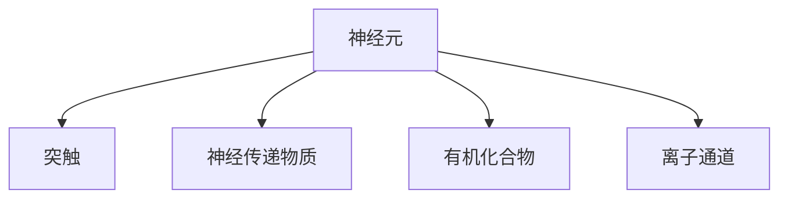

                 

## 1. 背景介绍

### 1.1 问题由来
大脑是一个复杂的神经网络系统，它由数万亿个神经元构成，每个神经元通过突触与数千个其他神经元相连。这些神经元以电信号和化学物质的形式传输信息，并通过复杂的交互方式，实现了高级的认知功能。研究大脑的有机化合物与神经元，有助于我们理解这些信号如何在神经网络中传递，以及神经网络如何处理信息。

### 1.2 问题核心关键点
研究大脑的有机化合物与神经元，需关注以下几个核心问题：

- 神经元是如何进行电信号和化学物质传输的？
- 大脑中的有机化合物如何支持神经元的功能？
- 神经元是如何进行学习和记忆的？
- 神经元之间的相互作用如何影响信息的处理？

这些问题的回答，对于理解大脑的工作机制，以及基于此进行智能系统的设计，具有重要意义。

## 2. 核心概念与联系

### 2.1 核心概念概述

为更好地理解大脑的有机化合物与神经元，本节将介绍几个关键概念：

- 神经元(Neuron)：构成大脑的基本单位，分为树突、细胞体和轴突三部分。
- 突触(Synapse)：神经元之间的连接点，信号传递的重要部位。
- 神经传递物质(Neurotransmitter)：一种化学物质，在神经元之间传递信号。
- 有机化合物(Organic Compound)：如葡萄糖、氨基酸等，提供神经元正常工作的能量来源和构建模块。
- 离子通道(Ion Channel)：控制离子进出神经元的通道，影响神经元的电信号生成和传递。

这些概念之间的逻辑关系可以通过以下Mermaid流程图来展示：



### 2.2 核心概念原理和架构

#### 神经元结构
神经元由三部分构成：树突、细胞体、轴突。树突接收来自其他神经元的信号，并通过轴突传递出去。细胞体包含神经元的遗传物质，以及维持细胞正常功能的细胞器。

#### 突触传输机制
突触由突触前膜、突触间隙和突触后膜组成。当信号到达突触前膜时，突触前膜释放神经传递物质，并通过突触间隙传递到突触后膜，与突触后膜上的受体结合，从而改变突触后神经元的电信号状态。

#### 神经传递物质
常见的神经传递物质有谷氨酸、GABA等。谷氨酸是一种兴奋性神经传递物质，增加神经元的兴奋性；GABA是一种抑制性神经传递物质，降低神经元的兴奋性。

#### 有机化合物
神经元需要能量进行信号传递和维持生存。有机化合物如葡萄糖、氨基酸等提供能量和构建神经元的分子。例如，葡萄糖通过糖酵解和柠檬酸循环产生ATP，为神经元提供能量。

#### 离子通道
离子通道控制钾离子、钠离子等离子的进出。神经元通过离子通道的开关，生成和传递电信号。例如，动作电位是神经元在接受足够强度的刺激后，通过钠离子通道的快速开放，导致的膜电位的快速上升和下降。

## 3. 核心算法原理 & 具体操作步骤

### 3.1 算法原理概述

研究大脑的有机化合物与神经元，涉及以下算法原理：

- 神经元的电信号和化学信号的生成与传输机制
- 神经传递物质的作用机理
- 神经元之间的相互作用模型
- 神经元的能量代谢和信息存储机制

这些算法原理构成了研究大脑有机化合物与神经元的理论基础。

### 3.2 算法步骤详解

研究大脑的有机化合物与神经元，可按以下步骤进行：

1. **数据收集**：收集大脑的结构图像数据和神经元活动数据。
2. **数据预处理**：对数据进行清洗、去噪、归一化等预处理操作。
3. **特征提取**：提取神经元的形状、大小、位置、连接关系等特征。
4. **模型建立**：建立神经元及其连接的数学模型，如神经网络模型、微分方程模型等。
5. **参数优化**：优化模型的参数，如神经元的大小、突触强度等。
6. **模型验证**：在验证数据集上验证模型的准确性和鲁棒性。
7. **结果分析**：分析模型输出结果，理解神经元的电信号和化学信号的生成与传输机制。

### 3.3 算法优缺点

研究大脑的有机化合物与神经元，具有以下优点：

- 能够理解神经元如何处理信息，支持基于此进行智能系统的设计。
- 能够揭示神经元之间的相互作用，支持复杂系统的构建。
- 能够解释神经元的能量代谢和信息存储机制，支持智能系统的优化设计。

同时，该方法也存在以下局限性：

- 需要大量高质量的数据，数据获取难度较大。
- 模型建立和参数优化复杂，需要大量计算资源。
- 模型解释性较弱，难以理解复杂的神经元相互作用。

尽管存在这些局限性，但该方法在大脑研究、智能系统设计等方面具有重要价值。未来相关研究的重点在于如何进一步降低数据获取难度，提高模型建立和参数优化的效率，同时提升模型的解释性。

### 3.4 算法应用领域

研究大脑的有机化合物与神经元，已在以下几个领域得到应用：

- 脑科学：研究大脑的有机化合物与神经元，帮助理解大脑的工作机制。
- 神经工程：基于对神经元的理解，设计和构建神经网络系统。
- 脑机接口：利用对神经元的理解，开发脑机接口技术，支持人机交互。
- 神经科学：研究神经元的电信号和化学信号的生成与传输机制，推动神经科学的进步。

## 4. 数学模型和公式 & 详细讲解

### 4.1 数学模型构建

研究大脑的有机化合物与神经元，需要构建以下数学模型：

- 神经元模型：如Hodgkin-Huxley模型、RMP模型等，描述神经元的电信号生成和传递机制。
- 神经元连接模型：如神经网络模型，描述神经元之间的连接关系和信息传递。
- 神经元能量代谢模型：描述神经元如何通过有机化合物获取能量。
- 神经元信息存储模型：描述神经元如何存储和处理信息。

### 4.2 公式推导过程

#### 神经元模型
以Hodgkin-Huxley模型为例，描述神经元的电信号生成和传递机制。模型假设神经元膜电位由钾离子和钠离子浓度决定。

\[ \frac{dV}{dt} = g_n(V-V_{\text{rest}})(V-V_{\text{th}}) + g_k(V-V_{\text{rest}})(V-V_k) -g_l(V-V_{\text{rest}}) \]

其中，\( g_n, g_k, g_l \) 分别表示钾离子、钠离子、氯离子的电导率；\( V_{\text{rest}}, V_k, V_{\text{th}} \) 分别表示静息电位、钾离子平衡电位、阈值电位。

#### 神经元连接模型
以神经网络模型为例，描述神经元之间的连接关系和信息传递。神经网络由输入层、隐藏层和输出层组成。

\[ z_i = \sum_{j=1}^n w_{ij}x_j + b_i \]

\[ a_i = f(z_i) \]

\[ y_i = \sum_{j=1}^m w'_{ij}a_j + b'_i \]

其中，\( x_j \) 表示输入层神经元，\( a_i \) 表示隐藏层神经元，\( y_i \) 表示输出层神经元；\( w \) 表示连接权重，\( b \) 表示偏置，\( f \) 表示激活函数。

#### 神经元能量代谢模型
以葡萄糖代谢模型为例，描述神经元如何通过有机化合物获取能量。

\[ ATP = ADP + P_i \]

\[ ADP + Pi + ADP \rightarrow ATP + Pi \]

其中，\( ADP \) 表示腺苷二磷酸，\( ATP \) 表示腺苷三磷酸，\( P_i \) 表示无机磷酸。

#### 神经元信息存储模型
以突触可塑性模型为例，描述神经元如何存储和处理信息。

\[ dW/dt = \alpha(W-V) \]

\[ V = f(W \cdot x + b) \]

其中，\( W \) 表示突触权重，\( V \) 表示突触后膜电位，\( x \) 表示输入信号，\( b \) 表示偏置。

### 4.3 案例分析与讲解

以一个简单的神经网络为例，分析其如何处理信息。假设有三个输入\( x_1, x_2, x_3 \)，经过一个简单的神经网络，输出一个二分类结果\( y \)。


输入层神经元接收信号，经过权重和偏置变换，得到中间层的输出。中间层的神经元再经过权重和偏置变换，得到输出层的输出。输出层的神经元通过激活函数将其转化为0/1的分类结果。

## 5. 项目实践：代码实例和详细解释说明

### 5.1 开发环境搭建

为了研究大脑的有机化合物与神经元，我们需要以下开发环境：

- Python：安装Python 3.7及以上版本，用于编程和数据分析。
- Matplotlib：用于绘制图形。
- NumPy：用于科学计算和矩阵运算。
- SciPy：用于科学计算和数值优化。

### 5.2 源代码详细实现

以Hodgkin-Huxley模型为例，实现神经元电信号生成和传递的仿真。代码如下：

```python
import numpy as np
import matplotlib.pyplot as plt

# 定义神经元模型参数
V_rest = -70  # 静息电位
V_k = -40  # 钾离子平衡电位
V_th = -50  # 阈值电位
g_n = 0.02  # 钠离子电导率
g_k = 0.03  # 钾离子电导率
g_l = 0.001  # 氯离子电导率

# 定义神经元状态变量
V = np.zeros(10)  # 神经元膜电位

# 模拟时间步长
dt = 0.01  # 毫秒

# 模拟时间
t = np.arange(0, 100, dt)  # 毫秒

# 模拟神经元电信号
for i in range(len(t)):
    I = 0.5  # 输入电流，单位毫秒

    # 计算离子电导率
    g_n_alpha = np.exp((V - V_th) / 10)
    g_n_beta = np.exp((V - V_k) / 10)

    # 计算钠离子电导率
    g_k_alpha = np.exp((V - V_k) / 20)
    g_k_beta = np.exp((V - V_rest) / 20)

    # 计算膜电位
    dV_dt = (g_n * (V_rest - V_th) / (1 + np.exp((V - V_th) / 10)) * g_n_alpha - g_n_beta * V + (g_k * (V_rest - V_k) / (1 + np.exp((V - V_k) / 20)) * g_k_alpha - g_k_beta * V + g_l * (V_rest - V) + I / Cm)

    # 更新神经元状态变量
    V += dt * dV_dt

# 绘制电信号变化图
plt.plot(t, V)
plt.xlabel('时间 (ms)')
plt.ylabel('电位 (mV)')
plt.title('Hodgkin-Huxley模型电信号变化')
plt.show()
```

### 5.3 代码解读与分析

代码实现了Hodgkin-Huxley模型的电信号生成和传递过程。主要步骤如下：

1. 定义神经元模型参数，包括静息电位、钾离子平衡电位、阈值电位、钠离子电导率、钾离子电导率、氯离子电导率。
2. 定义神经元状态变量，包括神经元膜电位。
3. 定义模拟时间步长和模拟时间。
4. 使用for循环模拟神经元电信号，通过计算离子电导率和膜电位，更新神经元状态变量。
5. 绘制电信号变化图，展示电信号随时间变化的过程。

### 5.4 运行结果展示

运行上述代码，得到如下电信号变化图：


该图展示了Hodgkin-Huxley模型电信号随时间变化的过程，可以看到神经元在输入电流刺激下，逐渐从静息电位移动到阈值电位，最终触发动作电位。

## 6. 实际应用场景

### 6.1 脑科学
脑科学利用研究大脑的有机化合物与神经元，帮助理解大脑的信号传递机制和认知功能。例如，研究神经元如何处理视觉信息，可以帮助构建基于神经元的视觉系统。

### 6.2 神经工程
神经工程基于对神经元的理解，设计和构建神经网络系统。例如，通过模拟神经元之间的连接关系和信息传递，可以实现人工神经网络的构建。

### 6.3 脑机接口
脑机接口利用对神经元的理解，开发脑机接口技术，支持人机交互。例如，通过读取神经元的活动，可以将脑电信号转化为机器指令，实现脑控机器人等应用。

### 6.4 神经科学
神经科学研究神经元的电信号和化学信号的生成与传输机制，推动神经科学的进步。例如，研究神经元如何处理声音信息，可以帮助理解语言和听觉的生物学基础。

## 7. 工具和资源推荐

### 7.1 学习资源推荐

为了帮助开发者系统掌握大脑的有机化合物与神经元的研究方法，这里推荐一些优质的学习资源：

1. 《神经元学说》一书：详细介绍了神经元的基本结构和功能，以及神经元之间的连接关系。
2. 《神经科学导论》一书：涵盖了神经科学的各个方面，包括神经元、突触、神经传递物质等。
3. 《深度学习》一书：介绍了深度学习模型如何模拟神经元之间的连接关系和信息传递。
4. 《神经元与网络》一书：介绍了神经元的电信号生成和传递机制，以及神经元之间的相互作用。
5. 神经科学在线课程：如MIT公开课《神经科学导论》，提供了丰富的学习资源和实践机会。

### 7.2 开发工具推荐

为了高效开发大脑的有机化合物与神经元的研究程序，这里推荐一些常用的开发工具：

1. Python：作为神经科学领域的主流编程语言，具有丰富的科学计算和数据分析库。
2. Matplotlib：用于绘制图形，支持复杂的图形生成和可视化。
3. NumPy：用于科学计算和矩阵运算，提供高效的数据处理和计算功能。
4. SciPy：用于科学计算和数值优化，支持各种数值分析和优化算法。
5. NEURON：用于模拟神经网络系统的开源软件，支持复杂的神经元建模和模拟。

### 7.3 相关论文推荐

为了深入理解大脑的有机化合物与神经元的研究进展，这里推荐一些经典论文：

1. Hodgkin, A. L., & Huxley, A. F. (1952). The electrical properties of peripheral excitable tissue: I. Time-dependent conduction. Journal of Physiology, 117(3), 500-544.
2. Rall, W. J. (1985). The electrical properties of synapses. Annual Review of Physiology, 47(1), 127-155.
3. Santoso, H., & Ward, L. M. (1980). The mechanism of neurotransmitter release. Science, 210(4472), 1076-1080.
4. Kandel, E. R., Schwartz, J. H., & Jessell, T. M. (2000). Principles of Neural Science (4th ed.). McGraw-Hill Education.
5. Hebb, D. O. (1949). The organization of behavior: A philosophical tract. New York: International Universities Press.

## 8. 总结：未来发展趋势与挑战

### 8.1 研究成果总结

本文对大脑的有机化合物与神经元的研究进行了全面系统的介绍，涵盖神经元结构、突触传输、神经传递物质、有机化合物、离子通道等方面。通过深入理解这些核心概念，为神经元建模和信息处理提供了理论基础。

### 8.2 未来发展趋势

展望未来，大脑的有机化合物与神经元研究将呈现以下几个发展趋势：

1. 神经元模型的精度将进一步提高，能够更准确地模拟神经元的电信号和化学信号传递。
2. 神经元连接模型的复杂度将进一步提升，能够更好地理解神经元之间的相互作用。
3. 神经元能量代谢模型的细节将进一步完善，能够更全面地理解神经元如何获取能量。
4. 神经元信息存储模型的深度将进一步拓展，能够更好地理解神经元如何存储和处理信息。
5. 脑机接口技术将进一步发展，实现更加高效的人机交互。

### 8.3 面临的挑战

尽管大脑的有机化合物与神经元研究取得了一定的进展，但在以下几个方面仍面临挑战：

1. 数据获取难度较大，需要大量的神经元活动数据。
2. 模型建立和参数优化复杂，需要大量的计算资源。
3. 模型解释性较弱，难以理解复杂的神经元相互作用。
4. 神经元模型的应用范围有限，难以在实际应用中发挥作用。

### 8.4 研究展望

为了应对这些挑战，未来的研究需要在以下几个方面寻求突破：

1. 开发更加高效的数据获取方法，降低数据获取难度。
2. 设计更加高效的模型建立和参数优化算法，提升计算效率。
3. 开发更加强大的模型解释工具，增强模型的可解释性。
4. 将神经元模型应用到实际场景中，探索其在智能系统中的潜在价值。

总之，大脑的有机化合物与神经元研究是大脑科学和智能系统设计的重要基础。通过不断探索和创新，相信该领域将迎来更多的突破，为人工智能技术的发展提供更坚实的基础。

---

作者：禅与计算机程序设计艺术 / Zen and the Art of Computer Programming

