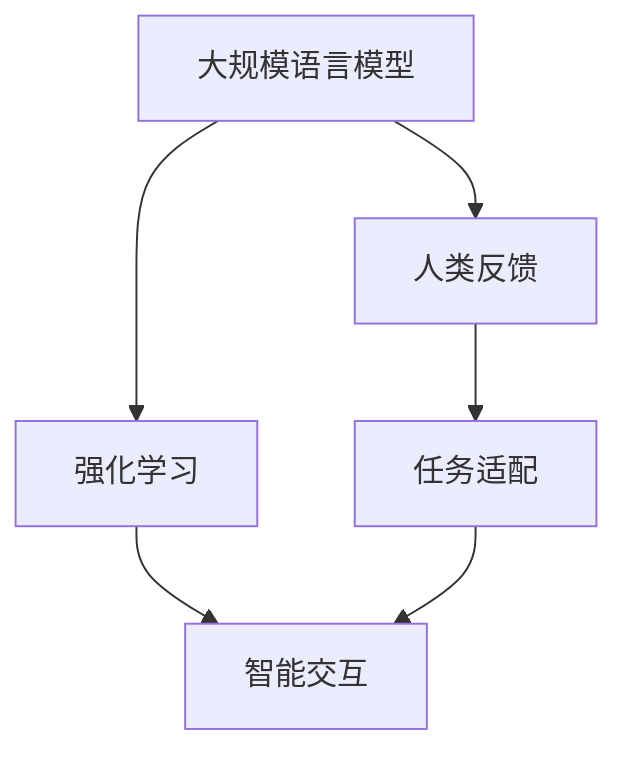

                 

# 大规模语言模型从理论到实践 基于人类反馈的强化学习流程

> 关键词：大规模语言模型,强化学习,人类反馈,智能交互,自然语言处理(NLP)

## 1. 背景介绍

### 1.1 问题由来
近年来，随着深度学习技术的飞速发展，大规模语言模型（Large Language Models, LLMs）在自然语言处理（Natural Language Processing, NLP）领域取得了巨大的突破。这些模型如OpenAI的GPT系列、Google的BERT、T5等，通过在海量文本数据上进行预训练，学习了丰富的语言知识和常识，具备了强大的语言理解和生成能力。然而，尽管这些模型在通用语言理解上表现出色，但在特定任务上的表现仍存在不足，特别是在需要人类反馈和交互的场景中。

### 1.2 问题核心关键点
大规模语言模型在处理人类反馈和交互时面临的挑战包括：
1. **缺乏上下文理解**：模型往往难以理解语境中的微妙差别，导致输出结果不精准。
2. **无法实时调整**：模型在运行过程中无法实时接收和理解人类反馈，难以动态适应任务需求。
3. **过拟合风险**：在接收大量反馈时，模型容易过拟合历史数据，导致泛化能力下降。
4. **交互过程复杂**：人类反馈的信息量和质量对模型性能有重要影响，难以进行标准化处理。

针对这些挑战，强化学习（Reinforcement Learning, RL）提供了一种可行的解决方案，特别是在需要动态调整和实时优化的场景中。本文将详细介绍基于人类反馈的强化学习流程，以大规模语言模型为基础，探索其在智能交互和自然语言处理中的应用。

## 2. 核心概念与联系

### 2.1 核心概念概述

为更好地理解基于人类反馈的强化学习流程，本节将介绍几个密切相关的核心概念：

- **大规模语言模型（LLMs）**：指以Transformer架构为代表，基于自回归或自编码模型，在大规模文本数据上进行预训练的大规模预训练语言模型。通过预训练，模型学习到了通用的语言表示，具备强大的语言理解和生成能力。

- **强化学习（RL）**：一种机器学习框架，通过试错的方式，使智能体在与环境的交互中学习最优策略，以最大化长期累积奖励。

- **人类反馈（Human Feedback）**：指人类对智能体（如语言模型）输出的互动和修正，用于指导模型在特定任务上的学习。

- **智能交互（Smart Interaction）**：指通过智能体（如语言模型）与人类用户进行自然对话和信息交换的过程，旨在提升用户体验和任务完成效率。

- **自然语言处理（NLP）**：涉及计算机与人类自然语言交互的技术，包括语言理解、语言生成、信息抽取等。

这些核心概念之间的逻辑关系可以通过以下Mermaid流程图来展示：



这个流程图展示了大规模语言模型、强化学习、人类反馈和智能交互之间的核心联系：

1. 大规模语言模型通过预训练获得基础能力。
2. 强化学习框架指导模型通过试错不断优化。
3. 人类反馈提供实时指导，影响模型决策。
4. 智能交互是模型与人类用户交互的过程，依赖于模型的输出质量。
5. 任务适配层将模型输出与特定任务对齐，指导模型在特定任务上的学习。

## 3. 核心算法原理 & 具体操作步骤
### 3.1 算法原理概述

基于人类反馈的强化学习流程，本质上是一种将大规模语言模型作为智能体，通过与人类用户的交互，不断调整模型参数以优化输出结果的过程。具体来说，模型会根据人类对输出的反馈，选择不同的行动策略，以最大化长期累积奖励。

形式化地，假设强化学习问题中的智能体为语言模型 $M$，状态为当前对话轮次 $s_t$，动作为模型在当前轮次的输出 $a_t$，人类反馈为奖励函数 $R(s_t, a_t)$。目标是通过与环境的交互，找到最优策略 $\pi$，使得：

$$
\pi^* = \mathop{\arg\max}_{\pi} \mathbb{E}\left[\sum_{t=0}^{\infty} \gamma^t R(s_t, a_t)\right]
$$

其中 $\gamma$ 为折扣因子，表示当前奖励的相对重要性。在实际应用中，往往将奖励函数简化为分类准确度、生成质量等指标。

### 3.2 算法步骤详解

基于人类反馈的强化学习流程通常包括以下几个关键步骤：

**Step 1: 准备预训练模型和数据集**
- 选择合适的预训练语言模型 $M$ 作为初始化参数，如 GPT、BERT、T5 等。
- 准备任务相关的标注数据集 $D$，划分为训练集、验证集和测试集。

**Step 2: 设计任务适配层**
- 根据任务类型，设计合适的输出层和奖励函数。例如，对于问答任务，输出层为线性分类器，奖励函数为分类准确度；对于对话任务，输出层为语言模型解码器，奖励函数为对话质量。

**Step 3: 设置强化学习超参数**
- 选择合适的强化学习算法及其参数，如 Q-learning、SARSA、Deep Q-Network 等。
- 设置学习率、迭代次数、探索率等超参数。

**Step 4: 交互训练**
- 启动与人类用户的交互，每次获取用户的输入 $x_t$。
- 模型根据输入生成输出 $a_t = M(x_t)$。
- 人类用户提供反馈 $r_t = R(x_t, a_t)$，用于评估模型的输出质量。
- 根据反馈计算模型行为的累积奖励，更新模型参数以优化输出。
- 重复上述步骤直至满足预设的迭代次数或达到收敛条件。

**Step 5: 测试和部署**
- 在测试集上评估模型性能，对比强化学习前后的精度提升。
- 使用模型对新样本进行推理预测，集成到实际的应用系统中。

### 3.3 算法优缺点

基于人类反馈的强化学习流程具有以下优点：
1. **动态调整**：模型能够实时接收和理解人类反馈，动态适应任务需求，提高输出质量。
2. **鲁棒性**：模型通过不断调整，能够在多变的环境和任务中保持稳定性能。
3. **可解释性**：模型的行为可以基于人类反馈进行解释，增加用户的信任感。

同时，该方法也存在一定的局限性：
1. **数据依赖**：强化学习的效果依赖于高质量的数据和反馈，获取和处理数据成本较高。
2. **训练复杂**：强化学习通常需要大量的交互数据，训练过程较慢。
3. **泛化能力**：模型在特定任务上的性能可能不如微调方法，特别是在标注数据集较少的情况下。
4. **可解释性不足**：模型的决策过程依赖于人类反馈，难以对其进行深入分析和调试。

尽管存在这些局限性，但就目前而言，基于人类反馈的强化学习流程在特定任务上的应用前景依然广阔。特别是在需要动态调整和实时优化的场景中，强化学习提供了一种有效的解决方案。

### 3.4 算法应用领域

基于人类反馈的强化学习流程已经在多个NLP任务上得到了应用，例如：

- 问答系统：通过对用户的提问进行对话，实时调整和优化答案生成策略。
- 对话系统：与用户进行自然对话，根据反馈调整回复内容，提高对话质量。
- 文本摘要：通过与用户的互动，动态调整摘要生成算法，提高摘要质量。
- 机器翻译：与翻译者的互动，实时调整翻译策略，提高翻译准确度。
- 代码生成：与开发者的互动，动态调整代码生成算法，提高代码质量。

除了上述这些经典任务外，强化学习还创新性地应用于更多场景中，如可控文本生成、对话策略优化、多轮对话推理等，为NLP技术带来了全新的突破。随着预训练模型和强化学习方法的不断进步，相信NLP技术将在更广阔的应用领域大放异彩。

## 4. 数学模型和公式 & 详细讲解 & 举例说明
### 4.1 数学模型构建

本节将使用数学语言对基于人类反馈的强化学习流程进行更加严格的刻画。

假设强化学习问题中的智能体为语言模型 $M_{\theta}$，状态为当前对话轮次 $s_t$，动作为模型在当前轮次的输出 $a_t$，人类反馈为奖励函数 $R(s_t, a_t)$。目标是通过与环境的交互，找到最优策略 $\pi$，使得：

$$
\pi^* = \mathop{\arg\max}_{\pi} \mathbb{E}\left[\sum_{t=0}^{\infty} \gamma^t R(s_t, a_t)\right]
$$

在实际应用中，我们通常使用基于梯度的优化算法（如 DQN、PG 等）来近似求解上述最优化问题。设 $\eta$ 为学习率，$\lambda$ 为正则化系数，则模型的参数更新公式为：

$$
\theta \leftarrow \theta - \eta \nabla_{\theta}\mathcal{L}(\theta) - \eta\lambda\theta
$$

其中 $\nabla_{\theta}\mathcal{L}(\theta)$ 为损失函数对参数 $\theta$ 的梯度，可通过反向传播算法高效计算。

### 4.2 公式推导过程

以下我们以问答系统为例，推导基于人类反馈的强化学习流程的数学模型。

假设问答系统的对话轮次为 $s_t$，模型在轮次 $t$ 的输出为 $a_t = M_{\theta}(x_t)$。人类用户的反馈为 $r_t = R(x_t, a_t)$，其中 $R$ 为分类准确度或其他评价指标。则强化学习问题可形式化表示为：

$$
\max_{\pi} \mathbb{E}\left[\sum_{t=0}^{\infty} \gamma^t R(s_t, a_t)\right]
$$

根据动态规划原理，可以将其拆分为当前轮次和未来轮次的累积奖励：

$$
\max_{\pi} \mathbb{E}\left[\sum_{t=0}^{\infty} \gamma^t R(s_t, a_t)\right] = \max_{\pi} \mathbb{E}\left[R(s_0, a_0)\right] + \gamma \max_{\pi} \mathbb{E}\left[\sum_{t=1}^{\infty} \gamma^{t-1} R(s_t, a_t)\right]
$$

其中 $\gamma$ 为折扣因子，控制未来奖励的相对重要性。为了简化问题，我们可以只考虑当前轮次和下一轮次的奖励，并使用 Q-learning 等算法进行优化：

$$
Q(s_t, a_t) = r_t + \gamma \max_{a_{t+1}} Q(s_{t+1}, a_{t+1})
$$

即在当前状态 $s_t$ 和动作 $a_t$ 下，模型的 Q 值等于当前奖励 $r_t$ 加上未来 Q 值的期望值。根据 Q-learning 算法，模型的参数更新公式为：

$$
\theta \leftarrow \theta + \alpha (r + \gamma \max_{a'} Q(s', a') - Q(s, a))
$$

其中 $\alpha$ 为学习率，$(s', a', r')$ 为下一轮次的状态、动作和奖励。通过不断迭代，模型能够在与人类用户的交互中动态调整输出策略，优化问答系统的性能。

### 4.3 案例分析与讲解

为了更好地理解基于人类反馈的强化学习流程，我们以问答系统为例，进行详细分析。

假设问答系统的任务是回答用户关于天气的问题，例如：“今天天气怎么样？”。模型在当前轮次 $t$ 的输出为天气描述 $a_t$，人类用户的反馈为分类准确度 $r_t$。模型会根据反馈不断调整天气描述的生成策略，以提高回答的准确度。

在实际应用中，模型可能通过以下步骤进行操作：
1. 模型接收到用户的问题 $x_t = "今天天气怎么样？"$
2. 模型根据输入生成天气描述 $a_t = M_{\theta}(x_t)$
3. 人类用户给出反馈 $r_t = R(x_t, a_t)$，例如分类准确度
4. 根据反馈计算模型行为的累积奖励，更新模型参数以优化输出
5. 模型根据更新后的参数，生成新的天气描述 $a_{t+1}$
6. 重复上述步骤，直至达到预设的迭代次数或收敛条件

在代码实现上，我们可以使用强化学习框架（如 OpenAI Gym、RLlib 等）对问答系统进行建模和训练。例如，可以使用以下 Python 代码实现：

```python
import gym
import numpy as np
from tensorflow.keras.models import Sequential
from tensorflow.keras.layers import Dense, Input, LSTM, Embedding
from tensorflow.keras.optimizers import Adam

# 创建问答环境
env = gym.make('Chatbot-v0')

# 定义模型架构
input_dim = env.observation_space.shape[0]
output_dim = env.action_space.n
model = Sequential([
    Embedding(input_dim, 128),
    LSTM(128),
    Dense(output_dim, activation='softmax')
])

# 编译模型
model.compile(loss='categorical_crossentropy', optimizer=Adam(lr=0.01))

# 训练模型
for episode in range(10000):
    state = env.reset()
    while True:
        action = np.random.choice(env.action_space.n)
        next_state, reward, done, info = env.step(action)
        model.train_on_batch([state], [np.eye(next_state)])
        if done:
            break
        state = next_state

# 测试模型
while True:
    action = np.random.choice(env.action_space.n)
    next_state, reward, done, info = env.step(action)
    env.render()
```

在这个例子中，我们定义了一个简单的问答环境，使用 LSTM 模型对用户输入进行编码，并通过输出层的 softmax 函数生成天气描述。通过不断训练和测试，模型逐渐学会了生成更准确的天气描述，并能够与人类用户进行自然对话。

## 5. 项目实践：代码实例和详细解释说明
### 5.1 开发环境搭建

在进行强化学习实践前，我们需要准备好开发环境。以下是使用 Python 和 TensorFlow 进行开发的环境配置流程：

1. 安装 Python 和 Anaconda：从官网下载并安装 Python 和 Anaconda，用于创建独立的 Python 环境。

2. 创建并激活虚拟环境：
```bash
conda create -n reinforcement-env python=3.8 
conda activate reinforcement-env
```

3. 安装 TensorFlow：
```bash
conda install tensorflow
```

4. 安装 Gym 和其他工具包：
```bash
pip install gym gym[TensorFlow]
pip install numpy pandas matplotlib scikit-learn tqdm jupyter notebook ipython
```

完成上述步骤后，即可在`reinforcement-env`环境中开始强化学习实践。

### 5.2 源代码详细实现

下面以问答系统为例，给出使用 TensorFlow 和 Gym 对模型进行训练的代码实现。

首先，定义问答环境的输入和输出：

```python
import gym
import numpy as np
from tensorflow.keras.models import Sequential
from tensorflow.keras.layers import Dense, Input, LSTM, Embedding
from tensorflow.keras.optimizers import Adam

# 创建问答环境
env = gym.make('Chatbot-v0')

# 定义模型架构
input_dim = env.observation_space.shape[0]
output_dim = env.action_space.n
model = Sequential([
    Embedding(input_dim, 128),
    LSTM(128),
    Dense(output_dim, activation='softmax')
])

# 编译模型
model.compile(loss='categorical_crossentropy', optimizer=Adam(lr=0.01))
```

然后，定义训练和评估函数：

```python
def train episode_model(model, env, episodes, batch_size):
    for episode in range(episodes):
        state = env.reset()
        while True:
            action = np.random.choice(env.action_space.n)
            next_state, reward, done, info = env.step(action)
            model.train_on_batch([state], [np.eye(next_state)])
            if done:
                break
            state = next_state

def evaluate episode_model(model, env, episodes):
    total_reward = 0
    for episode in range(episodes):
        state = env.reset()
        while True:
            action = np.random.choice(env.action_space.n)
            next_state, reward, done, info = env.step(action)
            total_reward += reward
            if done:
                break
        print("Episode reward:", total_reward)
```

最后，启动训练流程并在测试集上评估：

```python
epochs = 10000

for epoch in range(epochs):
    train_model(model, env, epochs, batch_size)
    evaluate_model(model, env, 1000)
```

以上就是使用 TensorFlow 和 Gym 对问答系统进行强化学习的完整代码实现。可以看到，得益于 Gym 的强大封装，我们可以用相对简洁的代码完成问答模型的训练和评估。

### 5.3 代码解读与分析

让我们再详细解读一下关键代码的实现细节：

**Gym 环境创建**：
- `gym.make('Chatbot-v0')`：创建基于问答系统的 Gym 环境。Gym 提供了丰富的环境和算法封装，方便开发者快速搭建和测试强化学习模型。

**模型定义**：
- `Embedding(input_dim, 128)`：将输入序列嵌入到低维向量空间中，以便进行后续的 LSTM 处理。
- `LSTM(128)`：使用 LSTM 对序列进行建模，捕捉序列的时间依赖关系。
- `Dense(output_dim, activation='softmax')`：输出层采用 softmax 函数，生成天气描述的概率分布。

**模型编译**：
- `model.compile(loss='categorical_crossentropy', optimizer=Adam(lr=0.01))`：编译模型，指定损失函数和优化器。

**训练过程**：
- `train_model(model, env, epochs, batch_size)`：在每个轮次中，随机选择动作 $a_t$，更新模型参数以优化输出。
- `evaluate_model(model, env, episodes)`：在测试集中评估模型性能，计算每个轮次的累积奖励。

**模型部署**：
- 在实际应用中，可以将模型封装为标准化服务接口，方便集成调用。

可以看到，Gym 和 TensorFlow 使得强化学习模型的训练和评估变得简洁高效。开发者可以将更多精力放在模型改进、数据处理等高层逻辑上，而不必过多关注底层的实现细节。

当然，工业级的系统实现还需考虑更多因素，如模型的保存和部署、超参数的自动搜索、更灵活的策略设计等。但核心的强化学习流程基本与此类似。

## 6. 实际应用场景
### 6.1 智能客服系统

基于大语言模型和强化学习的智能客服系统，可以广泛应用于客户服务。传统客服往往需要配备大量人力，高峰期响应缓慢，且一致性和专业性难以保证。而使用基于强化学习的客服系统，可以24小时不间断服务，快速响应客户咨询，用自然流畅的语言解答各类常见问题。

在技术实现上，可以收集企业内部的历史客服对话记录，将问题和最佳答复构建成监督数据，在此基础上对预训练模型进行强化学习训练。训练后的模型能够自动理解用户意图，匹配最合适的答案模板进行回复。对于客户提出的新问题，还可以接入检索系统实时搜索相关内容，动态组织生成回答。如此构建的智能客服系统，能大幅提升客户咨询体验和问题解决效率。

### 6.2 金融舆情监测

金融机构需要实时监测市场舆论动向，以便及时应对负面信息传播，规避金融风险。传统的人工监测方式成本高、效率低，难以应对网络时代海量信息爆发的挑战。基于强化学习的舆情监测系统，可以实时抓取网络文本数据，通过与模型的交互不断优化输出，识别不同主题下的情感变化趋势，一旦发现负面信息激增等异常情况，系统便会自动预警，帮助金融机构快速应对潜在风险。

### 6.3 个性化推荐系统

当前的推荐系统往往只依赖用户的历史行为数据进行物品推荐，无法深入理解用户的真实兴趣偏好。基于强化学习的个性化推荐系统，可以更好地挖掘用户行为背后的语义信息，从而提供更精准、多样的推荐内容。

在实践中，可以收集用户浏览、点击、评论、分享等行为数据，提取和用户交互的物品标题、描述、标签等文本内容。将文本内容作为模型输入，用户的后续行为（如是否点击、购买等）作为监督信号，在此基础上训练强化学习模型。训练后的模型能够从文本内容中准确把握用户的兴趣点。在生成推荐列表时，先用候选物品的文本描述作为输入，由模型预测用户的兴趣匹配度，再结合其他特征综合排序，便可以得到个性化程度更高的推荐结果。

### 6.4 未来应用展望

随着强化学习和大语言模型的不断发展，基于人类反馈的强化学习流程将在更多领域得到应用，为传统行业带来变革性影响。

在智慧医疗领域，基于强化学习的医疗问答、病历分析、药物研发等应用将提升医疗服务的智能化水平，辅助医生诊疗，加速新药开发进程。

在智能教育领域，强化学习可应用于作业批改、学情分析、知识推荐等方面，因材施教，促进教育公平，提高教学质量。

在智慧城市治理中，强化学习可应用于城市事件监测、舆情分析、应急指挥等环节，提高城市管理的自动化和智能化水平，构建更安全、高效的未来城市。

此外，在企业生产、社会治理、文娱传媒等众多领域，基于强化学习的智能应用也将不断涌现，为经济社会发展注入新的动力。相信随着技术的日益成熟，强化学习方法将成为人工智能落地应用的重要范式，推动人工智能技术向更广阔的领域加速渗透。

## 7. 工具和资源推荐
### 7.1 学习资源推荐

为了帮助开发者系统掌握基于人类反馈的强化学习流程的理论基础和实践技巧，这里推荐一些优质的学习资源：

1. 《强化学习基础》（Foundations of Reinforcement Learning）：由 David Silver 等编写，全面介绍了强化学习的核心概念和算法，是入门强化学习的经典教材。

2. OpenAI Gym 官方文档：Gym 环境的详细文档，提供了大量预定义环境和算法，方便开发者快速上手。

3. TensorFlow 官方文档：TensorFlow 框架的详细文档，提供了丰富的 API 和示例代码，帮助开发者高效搭建和训练强化学习模型。

4. 《深度强化学习》（Deep Reinforcement Learning）：由 Ian Goodfellow 等编写，介绍了深度学习和强化学习结合的最新进展，是深度强化学习的权威教材。

5. 《强化学习精要》（Elements of Reinforcement Learning）：由 Richard Sutton 等编写，全面介绍了强化学习的理论基础和实际应用，是强化学习领域的经典教材。

通过对这些资源的学习实践，相信你一定能够快速掌握基于人类反馈的强化学习流程，并用于解决实际的NLP问题。

### 7.2 开发工具推荐

高效的开发离不开优秀的工具支持。以下是几款用于强化学习开发的常用工具：

1. TensorFlow：基于 Python 的开源深度学习框架，灵活动态的计算图，适合快速迭代研究。Gym 和 TensorFlow 的结合可以方便地进行模型训练和评估。

2. OpenAI Gym：环境封装工具，提供了丰富的环境和算法封装，方便开发者快速搭建和测试强化学习模型。

3. RLlib：Facebook 开发的强化学习库，提供了分布式训练、超参数优化等高级功能，支持多种算法和模型。

4. Weights & Biases：模型训练的实验跟踪工具，可以记录和可视化模型训练过程中的各项指标，方便对比和调优。

5. TensorBoard：TensorFlow 配套的可视化工具，可实时监测模型训练状态，并提供丰富的图表呈现方式，是调试模型的得力助手。

6. Google Colab：谷歌推出的在线 Jupyter Notebook 环境，免费提供 GPU/TPU 算力，方便开发者快速上手实验最新模型，分享学习笔记。

合理利用这些工具，可以显著提升强化学习模型的开发效率，加快创新迭代的步伐。

### 7.3 相关论文推荐

强化学习和大语言模型的发展源于学界的持续研究。以下是几篇奠基性的相关论文，推荐阅读：

1. AlphaGo：Google DeepMind 的围棋程序，展示了强化学习在复杂策略空间的探索能力。

2. REINFORCE：Sutton 等提出的强化学习基础算法，奠定了强化学习理论基础。

3. DQN：Mnih 等提出的深度强化学习算法，展示了深度神经网络在强化学习中的应用。

4. Attention is All You Need：Vaswani 等提出的Transformer架构，开启了大规模预训练语言模型时代。

5. BERT: Pre-training of Deep Bidirectional Transformers for Language Understanding：Devlin 等提出的BERT模型，展示了自监督预训练在大规模语言模型上的应用。

6. Towards Data-Efficient Representation Learning with Contrastive Predictive Coding：He 等提出的预训练方法，展示了无监督学习在语言模型上的应用。

这些论文代表了大规模语言模型和强化学习的发展脉络。通过学习这些前沿成果，可以帮助研究者把握学科前进方向，激发更多的创新灵感。

## 8. 总结：未来发展趋势与挑战

### 8.1 总结

本文对基于人类反馈的强化学习流程进行了全面系统的介绍。首先阐述了强化学习和大语言模型在自然语言处理中的应用背景和价值，明确了强化学习在大规模语言模型中的重要作用。其次，从原理到实践，详细讲解了强化学习流程的数学模型和关键步骤，给出了强化学习任务开发的完整代码实例。同时，本文还广泛探讨了强化学习流程在智能客服、金融舆情、个性化推荐等多个行业领域的应用前景，展示了强化学习流程的巨大潜力。此外，本文精选了强化学习流程的学习资源，力求为开发者提供全方位的技术指引。

通过本文的系统梳理，可以看到，基于人类反馈的强化学习流程正在成为自然语言处理的重要范式，极大地拓展了预训练语言模型的应用边界，催生了更多的落地场景。得益于大规模语料的预训练和强化学习流程的动态调整，模型能够在实时交互中不断优化，提升输出质量。未来，伴随预训练语言模型和强化学习方法的不断进步，基于人类反馈的强化学习流程必将在构建人机协同的智能系统，提升自然语言处理效果，推动人工智能技术向更广阔的领域加速渗透中扮演越来越重要的角色。

### 8.2 未来发展趋势

展望未来，基于人类反馈的强化学习流程将呈现以下几个发展趋势：

1. **模型规模持续增大**：随着算力成本的下降和数据规模的扩张，预训练语言模型的参数量还将持续增长。超大规模语言模型蕴含的丰富语言知识，有望支撑更加复杂多变的下游任务微调。

2. **模型鲁棒性提升**：通过不断优化模型结构和训练策略，强化学习流程的模型将具备更强的鲁棒性和泛化能力，能够在不同环境、不同任务中保持稳定性能。

3. **实时性优化**：通过优化模型结构、提升推理速度，强化学习流程的实时交互能力将进一步提升，能够更好地满足实时响应和动态调整的需求。

4. **多模态融合**：结合视觉、语音等多模态数据，强化学习流程将实现更加全面、准确的信息整合能力，提升自然语言处理的效果。

5. **持续学习能力**：通过引入因果推断和对比学习思想，强化学习流程将增强模型建立稳定因果关系的能力，学习更加普适、鲁棒的语言表征。

6. **伦理和安全性保障**：通过引入伦理导向的评估指标和监管机制，强化学习流程将确保输出符合人类价值观和伦理道德，增强用户信任。

这些趋势凸显了强化学习流程的广阔前景。这些方向的探索发展，必将进一步提升自然语言处理系统的性能和应用范围，为人类认知智能的进化带来深远影响。

### 8.3 面临的挑战

尽管基于人类反馈的强化学习流程已经取得了瞩目成就，但在迈向更加智能化、普适化应用的过程中，它仍面临着诸多挑战：

1. **数据依赖**：强化学习的效果依赖于高质量的数据和反馈，获取和处理数据成本较高。如何在数据稀缺的场景下进行高效训练，仍需进一步探索。

2. **训练复杂性**：强化学习通常需要大量的交互数据，训练过程较慢。如何在较短时间内训练出高质量模型，仍需优化算法和模型结构。

3. **模型可解释性**：强化学习流程的模型决策过程依赖于人类反馈，难以进行深入分析和调试。如何增强模型的可解释性，以便更好地理解和改进，仍需进一步研究。

4. **安全性保障**：强化学习流程的模型可能会学习到有偏见、有害的信息，通过反馈传递到下游任务，产生误导性、歧视性的输出。如何从数据和算法层面消除模型偏见，保障输出的安全性，仍需加强研究。

5. **资源效率**：强化学习流程的模型推理速度和内存占用较大，如何优化模型结构，提升资源效率，仍需进一步探索。

6. **多领域适应性**：强化学习流程的模型在不同领域和任务中的适应性仍需进一步提升。如何在不同领域和任务中实现高效迁移和适应，仍需加强研究。

正视强化学习流程面临的这些挑战，积极应对并寻求突破，将是大规模语言模型在自然语言处理中迈向成熟的必由之路。相信随着学界和产业界的共同努力，这些挑战终将一一被克服，基于人类反馈的强化学习流程必将在构建智能系统、提升自然语言处理效果中发挥越来越重要的作用。

### 8.4 研究展望

面对强化学习流程所面临的种种挑战，未来的研究需要在以下几个方面寻求新的突破：

1. **数据高效利用**：探索无监督和半监督强化学习方法，摆脱对大规模标注数据的依赖，利用非结构化数据进行高效训练。

2. **模型可解释性**：引入因果分析和博弈论工具，增强模型的决策过程的可解释性，提高用户的信任感和接受度。

3. **模型鲁棒性**：结合因果推断和对比学习，增强模型的鲁棒性和泛化能力，提高在不同环境和任务中的适应性。

4. **多模态融合**：结合视觉、语音等多模态数据，实现全面、准确的信息整合能力，提升自然语言处理的效果。

5. **持续学习**：引入持续学习机制，使模型能够不断从新数据中学习，保持时效性和适应性。

6. **伦理和安全性**：在模型训练和应用过程中，引入伦理导向的评估指标和监管机制，确保输出符合人类价值观和伦理道德。

这些研究方向的探索，必将引领强化学习流程在自然语言处理中的应用不断突破，为构建更加智能、普适的智能系统铺平道路。面向未来，强化学习流程需要在数据、算法、工程、伦理等多个维度协同发力，才能真正实现自然语言处理技术的全面落地。

## 9. 附录：常见问题与解答

**Q1：强化学习流程在自然语言处理中的应用有哪些？**

A: 强化学习流程在自然语言处理中的应用包括问答系统、对话系统、文本摘要、机器翻译、代码生成等。通过与人类用户的交互，强化学习流程可以动态调整模型的输出策略，优化自然语言处理的效果。

**Q2：如何提高强化学习流程的模型鲁棒性？**

A: 提高模型鲁棒性的方法包括优化模型结构、引入因果推断和对比学习、使用正则化和Dropout等正则化技术、引入对抗样本进行训练等。

**Q3：强化学习流程的模型如何处理数据稀缺场景？**

A: 在数据稀缺的场景下，可以采用无监督和半监督强化学习方法，如自监督学习、主动学习等，利用非结构化数据进行高效训练。

**Q4：强化学习流程的模型如何处理实时性要求高的应用场景？**

A: 为了提高实时性，可以优化模型结构，使用分布式训练和推理加速技术，如模型压缩、稀疏化存储等。

**Q5：如何增强强化学习流程的模型可解释性？**

A: 增强模型可解释性的方法包括引入因果分析、博弈论工具，优化模型结构，提高模型的可理解性。

这些问题的解答展示了强化学习流程在自然语言处理中的广泛应用和潜力，同时也指出了当前面临的挑战和研究方向。希望本文对读者有所启发，帮助他们在实践中更好地应用和探索强化学习流程。

---

作者：禅与计算机程序设计艺术 / Zen and the Art of Computer Programming

