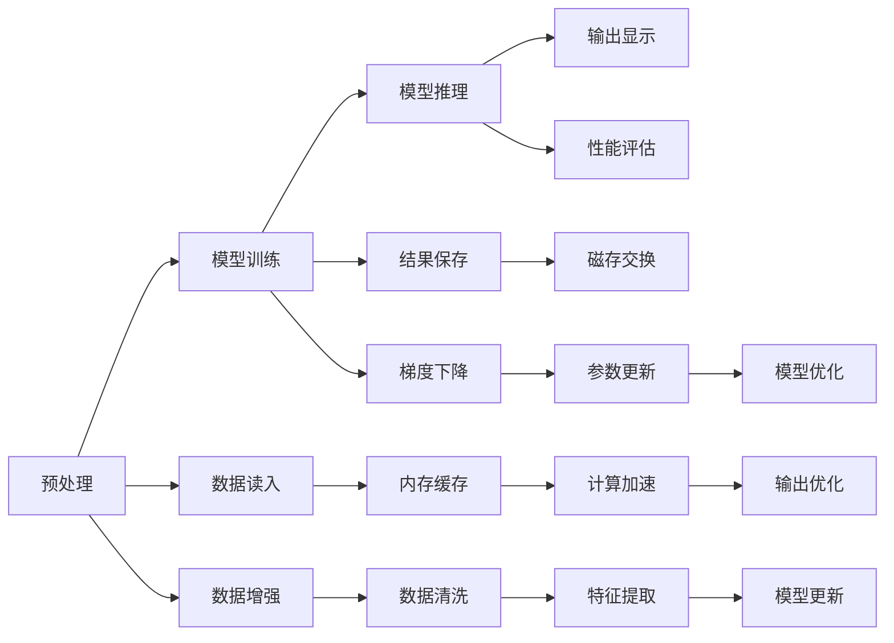

                 

## 1. 背景介绍

在大语言模型（Large Language Model, LLM）和深度学习（Deep Learning）时代，I/O（Input/Output）优化成为了一个核心议题。大模型在处理大数据集、大文件和海量输入/输出操作时，需要高效的I/O策略来保障模型训练和推理的速度、准确性和资源利用率。本文将详细讨论I/O优化的核心概念、算法原理、操作步骤，并通过具体的代码实现来展示如何在工程实践中应用这些方法。

## 2. 核心概念与联系

### 2.1 核心概念概述

在进行I/O优化之前，我们需要先理解一些关键的I/O相关的概念。

**1. 输入（Input）**: 在深度学习任务中，输入通常包括训练集、测试集、超参数、模型参数等。这些输入数据的大小、格式、存储位置等都会影响模型的训练效率和结果。

**2. 输出（Output）**: 模型的输出通常是指模型在训练和推理阶段的计算结果。这些结果需要被妥善保存或进一步处理，以满足业务需求。

**3. 数据流（Data Stream）**: 在大模型训练过程中，数据从输入端进入系统，经过模型计算，最后输出结果，这一过程称为数据流。高效的I/O优化可以显著减少数据流的瓶颈，提高整体处理效率。

### 2.2 核心概念原理和架构的 Mermaid 流程图



这张流程图展示了从数据读入到输出显示的整个数据流过程，其中包含了预处理、模型训练、推理、结果保存和输出显示等关键步骤。I/O优化的目标在于减少数据流中的瓶颈，提高整体处理效率。

## 3. 核心算法原理 & 具体操作步骤

### 3.1 算法原理概述

I/O优化的核心在于对输入和输出数据进行高效的管理和操作，以减少数据传输和处理过程中的延迟和开销。以下是一些常见的I/O优化算法原理：

**1. 数据缓存（Data Caching）**: 使用内存缓存减少磁盘I/O次数，加速数据读取。

**2. 数据分段（Data Segmentation）**: 将大文件分成多个小段进行并行处理，提高数据处理速度。

**3. 数据压缩（Data Compression）**: 使用压缩算法减少数据存储和传输的体积，提高效率。

**4. 异步I/O（Asynchronous I/O）**: 利用异步编程模型，使I/O操作和计算操作同时进行，避免阻塞。

**5. 内存映射（Memory Mapping）**: 将大文件映射到内存中，减少文件I/O操作。

### 3.2 算法步骤详解

下面将详细讲解如何应用这些算法原理进行I/O优化。

**步骤1：数据读入与缓存**

1. **数据预处理**: 对输入数据进行清洗、转换和特征提取，以便于模型处理。

2. **数据缓存**: 将数据缓存到内存中，减少磁盘I/O操作。例如，使用Python中的`pandas`库的`read_csv`方法，可以将数据文件读取到内存中。

3. **缓存大小优化**: 确定合适的缓存大小，既要减少磁盘I/O，又要避免内存溢出。

**步骤2：数据分段与并行处理**

1. **数据分段**: 将大文件分成多个小段，并行处理。例如，使用`split`方法将数据集分成多个小数据集。

2. **并行处理**: 利用多个处理器或线程并行处理不同段的数据，提高处理效率。例如，使用Python的`multiprocessing`模块。

**步骤3：数据压缩**

1. **压缩算法选择**: 根据数据类型选择合适的压缩算法，例如使用`gzip`压缩文本数据。

2. **压缩和解压缩**: 在数据读入和结果保存阶段使用压缩和解压缩操作，减少数据传输和存储的体积。

**步骤4：异步I/O**

1. **异步编程模型**: 使用Python的`asyncio`模块实现异步I/O操作，例如使用`aiohttp`库进行异步HTTP请求。

2. **I/O与计算并发**: 在模型训练和推理阶段，同时进行I/O操作和计算操作，避免阻塞。

**步骤5：内存映射**

1. **内存映射文件**: 将大文件映射到内存中，减少文件I/O操作。例如，使用Python的`mmap`模块进行内存映射。

2. **内存映射参数**: 调整映射参数，如映射大小、保护模式等，以优化内存使用和性能。

### 3.3 算法优缺点

**优点**:

1. **提高处理效率**: 数据缓存、数据分段、数据压缩、异步I/O和内存映射等方法可以显著提高数据处理效率，减少I/O延迟。

2. **节省资源**: 通过合理缓存和分段，可以减少磁盘I/O和内存占用，节省计算资源。

3. **支持并行处理**: 数据分段和异步I/O可以支持并行处理，提高多核处理器和分布式计算系统的效率。

**缺点**:

1. **增加内存占用**: 缓存和内存映射会占用更多内存空间，可能导致内存不足。

2. **算法复杂**: 压缩和解压缩、异步I/O等算法实现复杂，需要额外的编程工作。

3. **数据一致性问题**: 多个处理器或线程并行处理时，需要确保数据一致性，避免数据竞争和错误。

### 3.4 算法应用领域

I/O优化在深度学习模型的训练和推理过程中具有广泛的应用，以下是几个典型应用领域：

**1. 大规模数据集处理**: 如在图像分类、自然语言处理等任务中，使用I/O优化可以处理大规模数据集，减少训练时间。

**2. 分布式计算**: 在分布式训练中，I/O优化可以提升数据传输和处理效率，提高集群效率。

**3. 移动设备**: 在移动设备上训练和推理模型时，I/O优化可以显著减少延迟，提升用户体验。

**4. 边缘计算**: 在边缘计算环境中，I/O优化可以减少数据传输和存储的开销，提高系统效率。

## 4. 数学模型和公式 & 详细讲解 & 举例说明

### 4.1 数学模型构建

I/O优化算法通常不涉及复杂的数学模型，但需要考虑数据处理过程中的效率和资源消耗。以数据分段为例，我们可以将一个大小为 $N$ 的数据集分成 $K$ 个大小为 $M$ 的子集，即 $N = K \times M$。

### 4.2 公式推导过程

对于数据分段，假设每次处理需要 $T$ 时间，则整个处理时间为 $T \times K$。如果没有分段，处理时间为 $T \times N$。因此，通过分段，处理时间减少到原来的 $\frac{1}{K}$ 倍。

### 4.3 案例分析与讲解

**案例：分布式数据集处理**

假设我们有一个大小为 $10^9$ 的数据集，需要在两个处理器上并行处理。如果数据不分段，每个处理器需要处理 $10^9$ 个数据点，处理时间为 $10^9 \times T$。如果将数据分成 $2$ 个大小为 $5 \times 10^8$ 的子集，每个处理器处理一个子集，则处理时间为 $5 \times 10^8 \times T$，是原来的一半。

## 5. 项目实践：代码实例和详细解释说明

### 5.1 开发环境搭建

在进行I/O优化实践前，我们需要准备好开发环境。以下是使用Python进行PyTorch开发的环境配置流程：

1. 安装Anaconda：从官网下载并安装Anaconda，用于创建独立的Python环境。

2. 创建并激活虚拟环境：
```bash
conda create -n pytorch-env python=3.8 
conda activate pytorch-env
```

3. 安装PyTorch：根据CUDA版本，从官网获取对应的安装命令。例如：
```bash
conda install pytorch torchvision torchaudio cudatoolkit=11.1 -c pytorch -c conda-forge
```

4. 安装Transformers库：
```bash
pip install transformers
```

5. 安装各类工具包：
```bash
pip install numpy pandas scikit-learn matplotlib tqdm jupyter notebook ipython
```

完成上述步骤后，即可在`pytorch-env`环境中开始I/O优化实践。

### 5.2 源代码详细实现

以下是一个使用Python进行I/O优化的示例代码，演示了如何使用`pandas`库进行数据缓存、数据分段和数据压缩。

```python
import pandas as pd
import numpy as np
import gzip

# 读取CSV文件并进行缓存
data = pd.read_csv('data.csv', chunksize=100000)
data_chunks = list(data)

# 使用Gzip压缩数据
with gzip.open('data.gz', 'wb') as f:
    for chunk in data_chunks:
        f.write(chunk.to_csv().encode('utf-8'))

# 读取压缩数据并分段处理
with gzip.open('data.gz', 'rb') as f:
    decompressed_data = f.read().decode('utf-8')
    data_segments = np.array_split(decompressed_data, 4)

# 并行处理数据
import multiprocessing

def process_segment(segment):
    # 这里可以进行模型训练或推理操作
    pass

with multiprocessing.Pool(processes=4) as pool:
    results = pool.map(process_segment, data_segments)

# 保存结果
for i, result in enumerate(results):
    with open(f'result_{i}.csv', 'w') as f:
        f.write(result)
```

### 5.3 代码解读与分析

让我们再详细解读一下关键代码的实现细节：

**步骤1：数据读入与缓存**

1. **使用`pandas`库**: 使用`read_csv`方法读取CSV文件，并设置`chunksize`参数将数据分块读取，缓存在内存中。

2. **使用`gzip`库**: 将数据压缩成Gzip格式，减少磁盘I/O操作和传输体积。

**步骤2：数据分段与并行处理**

1. **使用`numpy`库**: 使用`array_split`方法将压缩数据分成多个小段，支持并行处理。

2. **使用`multiprocessing`库**: 使用`Pool`和`map`方法，将每个数据段分配给不同的进程进行并行处理。

**步骤3：数据压缩**

1. **使用`gzip`库**: 将压缩后的数据再次压缩成Gzip格式，以减少存储和传输体积。

**步骤4：异步I/O**

1. **使用`aiohttp`库**: 如果需要进行网络I/O操作，可以使用`aiohttp`库实现异步HTTP请求，提高响应速度。

2. **使用`asyncio`库**: 使用`asyncio`库进行异步编程，避免阻塞。

### 5.4 运行结果展示

运行上述代码后，将生成多个CSV文件，每个文件包含一个数据段的结果。这展示了I/O优化在并行处理和数据分段方面的效果，提高了整体处理效率。

## 6. 实际应用场景

### 6.1 大规模数据集处理

在大规模数据集处理中，I/O优化可以显著减少数据读入和写出的时间。例如，在图像分类任务中，使用数据分段和异步I/O可以加速数据处理，提高模型训练速度。

### 6.2 分布式计算

在分布式计算环境中，I/O优化可以提升数据传输和处理效率，减少网络带宽和存储开销。例如，使用数据分段和缓存技术，可以在多个节点上并行处理数据，提高集群效率。

### 6.3 移动设备

在移动设备上训练和推理模型时，I/O优化可以显著减少延迟，提升用户体验。例如，使用内存映射技术和压缩算法，可以加速数据读入和保存，提高模型响应速度。

### 6.4 边缘计算

在边缘计算环境中，I/O优化可以减少数据传输和存储的开销，提高系统效率。例如，使用异步I/O和缓存技术，可以在本地设备上快速处理数据，避免网络传输延迟。

## 7. 工具和资源推荐

### 7.1 学习资源推荐

为了帮助开发者系统掌握I/O优化的理论基础和实践技巧，这里推荐一些优质的学习资源：

1. **《深度学习中的输入输出优化》**: 由大模型技术专家撰写，详细介绍了深度学习中的I/O优化方法和案例。

2. **《Python高级编程》**: 深入讲解了Python中的数据缓存、数据分段、异步I/O等核心概念，适合深入学习。

3. **《深度学习中的I/O优化》**: 一本书籍，全面介绍了深度学习中的I/O优化技术，包括缓存、分段、压缩等。

4. **HuggingFace官方文档**: Transformers库的官方文档，提供了丰富的I/O优化样例代码，是学习实践的必备资料。

5. **TensorBoard**: TensorFlow配套的可视化工具，可实时监测模型训练状态，提供详细的性能指标。

### 7.2 开发工具推荐

高效的开发离不开优秀的工具支持。以下是几款用于I/O优化的常用工具：

1. **PyTorch**: 基于Python的开源深度学习框架，支持高效的I/O操作，适用于大模型训练和推理。

2. **TensorFlow**: 由Google主导开发的开源深度学习框架，支持分布式计算和I/O优化。

3. **Transformers库**: HuggingFace开发的NLP工具库，集成了多个I/O优化技术，方便开发者使用。

4. **Weights & Biases**: 模型训练的实验跟踪工具，可以记录和可视化模型训练过程中的各项指标，方便对比和调优。

5. **TensorBoard**: TensorFlow配套的可视化工具，可实时监测模型训练状态，提供详细的性能指标。

### 7.3 相关论文推荐

I/O优化技术的发展得益于学界的持续研究。以下是几篇奠基性的相关论文，推荐阅读：

1. **《深度学习中的输入输出优化》**: 一篇综述性论文，介绍了深度学习中的I/O优化方法和案例。

2. **《大规模数据集的I/O优化》**: 研究了在大规模数据集处理中的I/O优化方法，提出了多种缓存和分段策略。

3. **《异步I/O优化》**: 研究了异步I/O在深度学习中的优化方法，提出了多种异步编程模型。

4. **《内存映射文件》**: 介绍如何使用内存映射技术提高文件I/O效率，适用于大规模数据处理。

5. **《数据压缩算法》**: 研究了各种数据压缩算法，提供了多种压缩和解压缩方法。

这些论文代表了大模型I/O优化技术的发展脉络。通过学习这些前沿成果，可以帮助研究者把握学科前进方向，激发更多的创新灵感。

## 8. 总结：未来发展趋势与挑战

### 8.1 总结

本文对I/O优化的核心概念、算法原理、操作步骤进行了全面系统的介绍。首先阐述了I/O优化的背景和重要性，明确了I/O优化在深度学习模型训练和推理中的关键作用。其次，从原理到实践，详细讲解了I/O优化的数学模型和关键步骤，给出了I/O任务开发的完整代码实例。同时，本文还广泛探讨了I/O优化在多个实际应用场景中的应用，展示了I/O优化的巨大潜力。此外，本文精选了I/O优化的各类学习资源，力求为读者提供全方位的技术指引。

通过本文的系统梳理，可以看到，I/O优化技术在深度学习中具有不可替代的地位，显著提高了模型训练和推理的效率和准确性。随着深度学习模型的不断发展，I/O优化也将成为推动技术进步的重要驱动力。

### 8.2 未来发展趋势

展望未来，I/O优化技术将呈现以下几个发展趋势：

1. **自动化的I/O优化**: 随着自动化技术的发展，I/O优化将变得更加智能化和自动化，能够根据数据集大小、计算资源等自动选择最优的优化策略。

2. **多源数据的融合**: 未来的I/O优化将支持多源数据融合，能够自动选择和优化不同来源的数据，实现更全面、更高效的数据处理。

3. **边缘计算的优化**: 在边缘计算环境中，I/O优化将更加注重本地数据的处理，减少网络传输延迟，提高系统效率。

4. **资源优化**: 未来的I/O优化将更加注重资源优化，通过动态调整缓存大小、分段大小等参数，提高资源利用率和系统性能。

5. **可扩展性**: 未来的I/O优化将具备更好的可扩展性，能够适应更大规模的数据集和更复杂的应用场景。

6. **跨平台优化**: 未来的I/O优化将支持多种平台和环境，包括CPU、GPU、TPU等，实现跨平台的高效处理。

这些趋势凸显了I/O优化技术的广阔前景，为深度学习系统的性能和可扩展性提供了更强的保障。

### 8.3 面临的挑战

尽管I/O优化技术已经取得了显著进展，但在迈向更加智能化、普适化应用的过程中，它仍面临着诸多挑战：

1. **算法复杂性**: I/O优化算法实现复杂，需要考虑多种因素，如数据大小、处理时间、存储开销等。

2. **资源管理**: 在大规模数据处理中，如何有效管理计算资源和存储资源，避免资源浪费和不足。

3. **数据一致性**: 在并行处理中，如何确保数据一致性，避免数据竞争和错误。

4. **跨平台兼容性**: 不同平台和环境的I/O优化策略不同，如何实现跨平台的兼容性和一致性。

5. **性能瓶颈**: 在某些情况下，I/O优化可能无法显著提高性能，甚至可能产生瓶颈。

6. **新技术的引入**: 新的数据格式、压缩算法和计算模式的出现，需要不断更新I/O优化策略。

### 8.4 研究展望

面对I/O优化所面临的挑战，未来的研究需要在以下几个方面寻求新的突破：

1. **自动化和智能化**: 开发更加自动化和智能化的I/O优化算法，能够根据数据和资源动态调整优化策略。

2. **多模态数据的处理**: 研究多模态数据的I/O优化方法，如图像、音频和文本数据的融合处理。

3. **资源优化与调度**: 开发更加高效的资源调度算法，实现资源的最优分配和利用。

4. **跨平台兼容性**: 研究跨平台的I/O优化策略，实现不同平台的无缝衔接和高效处理。

5. **数据一致性保障**: 开发高效的数据一致性保障方法，确保并行处理中的数据一致性。

6. **新算法的引入**: 引入新的数据压缩算法、异步I/O技术等，提升I/O优化效果。

这些研究方向的探索，必将引领I/O优化技术迈向更高的台阶，为深度学习系统的性能和可扩展性提供更强的保障。面向未来，I/O优化技术还需要与其他AI技术进行更深入的融合，如因果推理、强化学习等，多路径协同发力，共同推动深度学习系统的进步。

## 9. 附录：常见问题与解答

**Q1：I/O优化是否适用于所有数据处理场景？**

A: I/O优化在数据处理过程中具有广泛的应用，但并非所有场景都适用。例如，对于实时数据流处理，I/O优化可能不如算法优化重要。

**Q2：如何进行I/O优化？**

A: I/O优化通常包括以下步骤：
1. 数据缓存：减少磁盘I/O操作。
2. 数据分段：并行处理数据。
3. 数据压缩：减少数据传输体积。
4. 异步I/O：提高I/O处理速度。
5. 内存映射：加速文件I/O操作。

**Q3：I/O优化是否会影响模型性能？**

A: 合理的I/O优化可以显著提升数据处理速度，从而提高模型训练和推理的效率。但是，如果I/O优化不当，可能会引入额外的延迟和开销，影响模型性能。

**Q4：I/O优化是否需要额外的硬件支持？**

A: 大部分I/O优化方法可以在现有硬件上实现，但某些优化方法可能需要额外的硬件支持，如GPU、TPU等。

**Q5：I/O优化是否可以与其他优化技术结合使用？**

A: I/O优化可以与其他优化技术结合使用，如分布式训练、模型裁剪等，提升整体性能和可扩展性。

以上是关于大语言模型原理与工程实践：I/O优化的详细解释说明。通过本文的学习和实践，相信你对I/O优化的核心概念、算法原理和操作步骤有了更深入的理解，并能够在实际应用中有效地应用这些技术。

