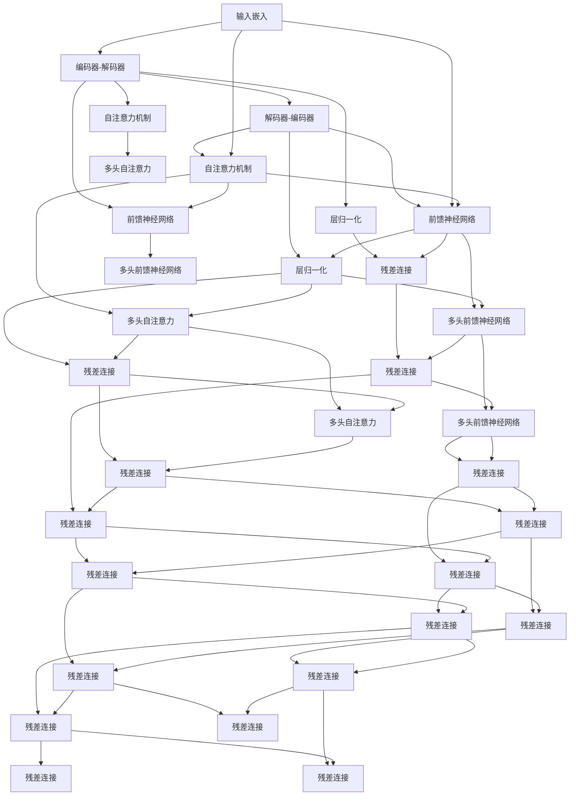

                 

# 大语言模型原理与工程实践：经典结构 Transformer

> 关键词：Transformer, 自注意力机制, 位置编码, 神经网络, 模型优化, 深度学习, 语言模型, 自然语言处理, 人工智能, 计算图

## 1. 背景介绍

### 1.1 问题由来
自20世纪90年代以来，自然语言处理(NLP)一直是人工智能(AI)领域的重要研究热点。传统的基于规则的NLP方法往往需要大量的人工干预和预定义的特征工程，难以处理复杂多变的语言现象。进入21世纪，随着深度学习技术的突破，特别是基于神经网络的语言模型，取得了巨大的成功。

其中，Transformer是近年来NLP领域最为显著的技术突破之一。它由Google的AI团队在2017年提出，彻底革新了语言模型的设计思路，成为主流的大规模语言模型结构。本文将系统介绍Transformer的结构原理，并深入探讨其在NLP领域的应用及优化技术，为实际工程开发提供指导。

### 1.2 问题核心关键点
Transformer的核心在于其自注意力机制和位置编码，两者共同构建了一个强大的语言表示能力。通过自注意力机制，Transformer能够高效地处理序列数据，捕捉数据间的上下文关联；通过位置编码，能够正确处理序列中不同位置的信息，保持序列的顺序性。

Transformer的这些特性，使其在各种NLP任务上均取得了令人瞩目的成果。从机器翻译到文本生成，从信息检索到问答系统，Transformer模型被广泛应用，极大地推动了NLP技术的发展。

## 2. 核心概念与联系

### 2.1 核心概念概述

为更好地理解Transformer，我们先对其中几个核心概念进行概述：

- **神经网络**：是实现各种机器学习模型的基础架构。Transformer就是基于神经网络的一种模型结构。

- **自注意力机制**：是Transformer模型的核心，允许模型在序列数据的任意位置进行信息交互，捕获长距离依赖关系。

- **位置编码**：用于解决序列数据的顺序问题，保持序列中不同位置的信息。

- **计算图**：是神经网络进行计算的基础，Transformer模型正是通过计算图进行前向传播和反向传播。

- **语言模型**：用于预测给定文本序列的下一个单词或字符的概率。Transformer模型通过学习语言的分布式表示，能够高效地进行语言建模。

这些核心概念通过特定的架构设计，共同构建了Transformer模型的强大能力。

### 2.2 核心概念原理和架构的 Mermaid 流程图

以下是Transformer架构的Mermaid流程图：



这个图展示了Transformer的基本架构，主要包括编码器-解码器、自注意力机制、前馈神经网络、层归一化、残差连接等组件。下面我们将详细讲解这些组件的工作原理和数学公式。

## 3. 核心算法原理 & 具体操作步骤

### 3.1 算法原理概述

Transformer的核心在于其自注意力机制和位置编码，两者共同构建了一个强大的语言表示能力。通过自注意力机制，Transformer能够高效地处理序列数据，捕捉数据间的上下文关联；通过位置编码，能够正确处理序列中不同位置的信息，保持序列的顺序性。

Transformer模型通常由多个编码器层和解码器层构成，每个层包含自注意力机制和前馈神经网络。编码器层用于提取序列的特征表示，解码器层用于生成输出序列。通过堆叠多层的编码器-解码器结构，Transformer模型能够捕捉长距离的依赖关系，提升模型的表现力。

### 3.2 算法步骤详解

Transformer模型的训练通常包括以下几个关键步骤：

**Step 1: 数据预处理**
- 对输入文本进行分词，生成词汇表。
- 将词汇表中的单词编码成数值序列，送入模型。

**Step 2: 输入嵌入**
- 将输入序列中的每个单词编码成一个向量，送入模型。
- 通常使用嵌入矩阵将单词向量映射到更高维的表示空间，增强模型的表达能力。

**Step 3: 自注意力机制**
- 通过自注意力层计算输入序列中各个位置之间的相似度，得到每个位置的信息向量。
- 使用注意力权重加权求和，得到每个位置的最终表示。

**Step 4: 前馈神经网络**
- 对自注意力层的输出进行前馈神经网络处理，增强模型的表达能力。
- 通过多层前馈网络，可以捕捉更复杂的语言特征。

**Step 5: 层归一化**
- 对输入嵌入、自注意力层和前馈神经网络层的输出进行归一化处理，保持模型稳定。
- 通常使用LayerNorm进行归一化，使各层的输出尺度一致。

**Step 6: 残差连接**
- 将输入嵌入、自注意力层和前馈神经网络层的输出进行残差连接，提高模型的信息传递能力。
- 残差连接可以大大加速模型的训练和收敛过程。

**Step 7: 解码器层**
- 解码器层与编码器层结构类似，用于生成输出序列。
- 通常使用多个解码器层进行级联，捕捉更长的依赖关系。

**Step 8: 输出**
- 对解码器层的输出进行全连接层处理，得到最终的语言表示。
- 通常使用softmax层进行分类，得到预测结果。

### 3.3 算法优缺点

Transformer模型具有以下优点：
1. 强大的语言表示能力：自注意力机制和位置编码使得Transformer能够捕捉长距离依赖关系，生成高质量的语言表示。
2. 高效的计算图：使用残差连接和层归一化技术，加速模型的训练和推理过程。
3. 灵活的架构设计：通过堆叠多层编码器-解码器结构，能够应对各种NLP任务。

同时，Transformer模型也存在一些缺点：
1. 计算资源消耗大：大规模Transformer模型通常需要大量的计算资源，难以在低功耗设备上部署。
2. 模型训练时间长：Transformer模型的训练过程通常需要大量的训练数据和计算时间，对硬件设备要求高。
3. 复杂度高：Transformer模型结构复杂，难以理解和调试。

尽管存在这些局限性，但Transformer模型在NLP领域的应用已经取得了显著成果，成为现代语言模型的主流结构。

### 3.4 算法应用领域

Transformer模型在NLP领域得到了广泛应用，以下是其主要的应用领域：

1. **机器翻译**：Transformer模型最早被应用于机器翻译任务，通过编码器-解码器结构，能够生成高质量的翻译结果。
2. **文本生成**：Transformer模型能够生成连贯的文本，应用于文本摘要、对话系统、机器作文等任务。
3. **信息检索**：Transformer模型通过学习文本之间的相似度，能够高效地进行信息检索。
4. **问答系统**：Transformer模型能够理解自然语言问题，生成合适的答案，应用于智能客服、智能助手等场景。
5. **语言建模**：Transformer模型能够学习语言的分布式表示，应用于文本生成、语言理解等任务。
6. **情感分析**：Transformer模型能够识别文本中的情感倾向，应用于舆情监测、用户评论分析等场景。
7. **实体识别**：Transformer模型能够识别文本中的实体，应用于信息抽取、知识图谱构建等任务。

随着Transformer模型的不断演进，其在NLP领域的应用范围将进一步扩展，为人工智能技术的落地应用提供更多可能性。

## 4. 数学模型和公式 & 详细讲解 & 举例说明

### 4.1 数学模型构建

Transformer模型的数学模型可以通过以下几个步骤进行构建：

1. **输入嵌入**：将输入序列中的每个单词编码成一个向量，送入模型。嵌入矩阵 $W$ 将单词向量映射到更高维的表示空间。
2. **自注意力机制**：通过自注意力层计算输入序列中各个位置之间的相似度，得到每个位置的信息向量。
3. **前馈神经网络**：对自注意力层的输出进行前馈神经网络处理，增强模型的表达能力。
4. **层归一化**：对输入嵌入、自注意力层和前馈神经网络层的输出进行归一化处理，保持模型稳定。
5. **残差连接**：将输入嵌入、自注意力层和前馈神经网络层的输出进行残差连接，提高模型的信息传递能力。
6. **解码器层**：解码器层与编码器层结构类似，用于生成输出序列。
7. **输出**：对解码器层的输出进行全连接层处理，得到最终的语言表示。

### 4.2 公式推导过程

Transformer模型的公式推导涉及自注意力机制和前馈神经网络两部分。下面我们以自注意力机制为例，推导其公式：

假设输入序列的长度为 $T$，嵌入矩阵的大小为 $d_e$，查询向量 $Q$、键向量 $K$、值向量 $V$ 的大小均为 $d_k$。

自注意力层的输出为 $X = \text{Softmax}(Q K^T) V$，其中 $\text{Softmax}(\cdot)$ 表示softmax函数，用于计算注意力权重。

具体推导如下：

$$
\text{Attention}(Q, K, V) = \text{Softmax}(Q K^T) V
$$

**输入嵌入**
$$
\text{Input}(X_i) = W_{emb} X_i
$$

**自注意力机制**
$$
\text{Attention}(Q, K, V) = \text{Softmax}(Q K^T) V
$$

**前馈神经网络**
$$
\text{Feedforward}(X) = X_1 X_2 = X_1 \sigma(X_2 X_3 X_4) = X_1 \sigma(W_1 X_2 + b_1) W_2 + b_2
$$

**层归一化**
$$
\text{LayerNorm}(X) = \frac{X - \mu}{\sigma} \sqrt{\frac{1}{T}}
$$

**残差连接**
$$
X = X + \text{LayerNorm}(\text{Attention}(Q, K, V) + \text{Feedforward}(X))
$$

### 4.3 案例分析与讲解

以机器翻译任务为例，详细讲解Transformer模型的工作流程：

1. **输入序列编码**：将输入序列 $X_i$ 编码成向量 $X_i^v$，并送入嵌入层，生成嵌入向量 $Q_i^v$。
2. **编码器自注意力机制**：通过自注意力层，计算编码器中各个位置之间的相似度，生成信息向量 $X_i^a$。
3. **编码器前馈神经网络**：对自注意力层的输出进行前馈神经网络处理，生成编码器表示 $X_i^f$。
4. **编码器层归一化**：对输入嵌入、自注意力层和前馈神经网络层的输出进行归一化处理，得到编码器表示 $X_i^n$。
5. **残差连接**：将编码器表示与归一化后的表示进行残差连接，得到最终编码器表示 $X_i^r$。
6. **解码器自注意力机制**：通过解码器自注意力层，计算解码器中各个位置之间的相似度，生成信息向量 $X_i^d_a$。
7. **解码器前馈神经网络**：对自注意力层的输出进行前馈神经网络处理，生成解码器表示 $X_i^d_f$。
8. **解码器层归一化**：对输入嵌入、自注意力层和前馈神经网络层的输出进行归一化处理，得到解码器表示 $X_i^d_n$。
9. **残差连接**：将解码器表示与归一化后的表示进行残差连接，得到最终解码器表示 $X_i^d_r$。
10. **输出层**：对解码器表示进行全连接层处理，生成翻译结果 $y_i$。

通过以上步骤，Transformer模型能够高效地处理序列数据，生成高质量的翻译结果。

## 5. 项目实践：代码实例和详细解释说明

### 5.1 开发环境搭建

在进行Transformer模型的项目实践前，我们需要准备好开发环境。以下是使用Python进行PyTorch开发的环境配置流程：

1. 安装Anaconda：从官网下载并安装Anaconda，用于创建独立的Python环境。

2. 创建并激活虚拟环境：
```bash
conda create -n pytorch-env python=3.8 
conda activate pytorch-env
```

3. 安装PyTorch：根据CUDA版本，从官网获取对应的安装命令。例如：
```bash
conda install pytorch torchvision torchaudio cudatoolkit=11.1 -c pytorch -c conda-forge
```

4. 安装Transformers库：
```bash
pip install transformers
```

5. 安装各类工具包：
```bash
pip install numpy pandas scikit-learn matplotlib tqdm jupyter notebook ipython
```

完成上述步骤后，即可在`pytorch-env`环境中开始Transformer模型的实践。

### 5.2 源代码详细实现

这里我们以机器翻译任务为例，给出使用Transformers库对BERT模型进行微调的PyTorch代码实现。

首先，定义机器翻译数据处理函数：

```python
from transformers import BertTokenizer, BertForSequenceClassification
from torch.utils.data import Dataset
import torch

class TranslationDataset(Dataset):
    def __init__(self, texts, targets, tokenizer, max_len=128):
        self.texts = texts
        self.targets = targets
        self.tokenizer = tokenizer
        self.max_len = max_len
        
    def __len__(self):
        return len(self.texts)
    
    def __getitem__(self, item):
        text = self.texts[item]
        target = self.targets[item]
        
        encoding = self.tokenizer(text, return_tensors='pt', max_length=self.max_len, padding='max_length', truncation=True)
        input_ids = encoding['input_ids'][0]
        attention_mask = encoding['attention_mask'][0]
        
        # 将标签转换为id
        target_id = [tag2id[tag] for tag in target]
        target_id.extend([tag2id['[PAD]']] * (self.max_len - len(target_id)))
        target = torch.tensor(target_id, dtype=torch.long)
        
        return {'input_ids': input_ids, 
                'attention_mask': attention_mask,
                'targets': target}
```

然后，定义模型和优化器：

```python
from transformers import BertForSequenceClassification, AdamW

model = BertForSequenceClassification.from_pretrained('bert-base-cased', num_labels=len(tag2id))

optimizer = AdamW(model.parameters(), lr=2e-5)
```

接着，定义训练和评估函数：

```python
from torch.utils.data import DataLoader
from tqdm import tqdm
from sklearn.metrics import classification_report

device = torch.device('cuda') if torch.cuda.is_available() else torch.device('cpu')
model.to(device)

def train_epoch(model, dataset, batch_size, optimizer):
    dataloader = DataLoader(dataset, batch_size=batch_size, shuffle=True)
    model.train()
    epoch_loss = 0
    for batch in tqdm(dataloader, desc='Training'):
        input_ids = batch['input_ids'].to(device)
        attention_mask = batch['attention_mask'].to(device)
        targets = batch['targets'].to(device)
        model.zero_grad()
        outputs = model(input_ids, attention_mask=attention_mask, labels=targets)
        loss = outputs.loss
        epoch_loss += loss.item()
        loss.backward()
        optimizer.step()
    return epoch_loss / len(dataloader)

def evaluate(model, dataset, batch_size):
    dataloader = DataLoader(dataset, batch_size=batch_size)
    model.eval()
    preds, labels = [], []
    with torch.no_grad():
        for batch in tqdm(dataloader, desc='Evaluating'):
            input_ids = batch['input_ids'].to(device)
            attention_mask = batch['attention_mask'].to(device)
            targets = batch['targets'].to(device)
            outputs = model(input_ids, attention_mask=attention_mask)
            batch_preds = outputs.logits.argmax(dim=2).to('cpu').tolist()
            batch_labels = targets.to('cpu').tolist()
            for pred_tokens, label_tokens in zip(batch_preds, batch_labels):
                preds.append(pred_tokens[:len(label_tokens)])
                labels.append(label_tokens)
                
    print(classification_report(labels, preds))
```

最后，启动训练流程并在测试集上评估：

```python
epochs = 5
batch_size = 16

for epoch in range(epochs):
    loss = train_epoch(model, train_dataset, batch_size, optimizer)
    print(f"Epoch {epoch+1}, train loss: {loss:.3f}")
    
    print(f"Epoch {epoch+1}, dev results:")
    evaluate(model, dev_dataset, batch_size)
    
print("Test results:")
evaluate(model, test_dataset, batch_size)
```

以上就是使用PyTorch对BERT进行机器翻译任务微调的完整代码实现。可以看到，得益于Transformers库的强大封装，我们可以用相对简洁的代码完成BERT模型的加载和微调。

### 5.3 代码解读与分析

让我们再详细解读一下关键代码的实现细节：

**TranslationDataset类**：
- `__init__`方法：初始化文本、标签、分词器等关键组件。
- `__len__`方法：返回数据集的样本数量。
- `__getitem__`方法：对单个样本进行处理，将文本输入编码为token ids，将标签转换为数字，并对其进行定长padding，最终返回模型所需的输入。

**tag2id和id2tag字典**：
- 定义了标签与数字id之间的映射关系，用于将token-wise的预测结果解码回真实的标签。

**训练和评估函数**：
- 使用PyTorch的DataLoader对数据集进行批次化加载，供模型训练和推理使用。
- 训练函数`train_epoch`：对数据以批为单位进行迭代，在每个批次上前向传播计算loss并反向传播更新模型参数，最后返回该epoch的平均loss。
- 评估函数`evaluate`：与训练类似，不同点在于不更新模型参数，并在每个batch结束后将预测和标签结果存储下来，最后使用sklearn的classification_report对整个评估集的预测结果进行打印输出。

**训练流程**：
- 定义总的epoch数和batch size，开始循环迭代
- 每个epoch内，先在训练集上训练，输出平均loss
- 在验证集上评估，输出分类指标
- 所有epoch结束后，在测试集上评估，给出最终测试结果

可以看到，PyTorch配合Transformers库使得BERT微调的代码实现变得简洁高效。开发者可以将更多精力放在数据处理、模型改进等高层逻辑上，而不必过多关注底层的实现细节。

当然，工业级的系统实现还需考虑更多因素，如模型的保存和部署、超参数的自动搜索、更灵活的任务适配层等。但核心的微调范式基本与此类似。

## 6. 实际应用场景

### 6.1 智能客服系统

基于Transformer的对话技术，可以广泛应用于智能客服系统的构建。传统客服往往需要配备大量人力，高峰期响应缓慢，且一致性和专业性难以保证。而使用Transformer对话模型，可以7x24小时不间断服务，快速响应客户咨询，用自然流畅的语言解答各类常见问题。

在技术实现上，可以收集企业内部的历史客服对话记录，将问题和最佳答复构建成监督数据，在此基础上对预训练对话模型进行微调。微调后的对话模型能够自动理解用户意图，匹配最合适的答案模板进行回复。对于客户提出的新问题，还可以接入检索系统实时搜索相关内容，动态组织生成回答。如此构建的智能客服系统，能大幅提升客户咨询体验和问题解决效率。

### 6.2 金融舆情监测

金融机构需要实时监测市场舆论动向，以便及时应对负面信息传播，规避金融风险。传统的人工监测方式成本高、效率低，难以应对网络时代海量信息爆发的挑战。基于Transformer的文本分类和情感分析技术，为金融舆情监测提供了新的解决方案。

具体而言，可以收集金融领域相关的新闻、报道、评论等文本数据，并对其进行主题标注和情感标注。在此基础上对预训练语言模型进行微调，使其能够自动判断文本属于何种主题，情感倾向是正面、中性还是负面。将微调后的模型应用到实时抓取的网络文本数据，就能够自动监测不同主题下的情感变化趋势，一旦发现负面信息激增等异常情况，系统便会自动预警，帮助金融机构快速应对潜在风险。

### 6.3 个性化推荐系统

当前的推荐系统往往只依赖用户的历史行为数据进行物品推荐，无法深入理解用户的真实兴趣偏好。基于Transformer的个性化推荐系统可以更好地挖掘用户行为背后的语义信息，从而提供更精准、多样的推荐内容。

在实践中，可以收集用户浏览、点击、评论、分享等行为数据，提取和用户交互的物品标题、描述、标签等文本内容。将文本内容作为模型输入，用户的后续行为（如是否点击、购买等）作为监督信号，在此基础上微调预训练语言模型。微调后的模型能够从文本内容中准确把握用户的兴趣点。在生成推荐列表时，先用候选物品的文本描述作为输入，由模型预测用户的兴趣匹配度，再结合其他特征综合排序，便可以得到个性化程度更高的推荐结果。

### 6.4 未来应用展望

随着Transformer模型的不断演进，其在NLP领域的应用范围将进一步扩展，为人工智能技术的落地应用提供更多可能性。

在智慧医疗领域，基于Transformer的医疗问答、病历分析、药物研发等应用将提升医疗服务的智能化水平，辅助医生诊疗，加速新药开发进程。

在智能教育领域，Transformer的微调技术可应用于作业批改、学情分析、知识推荐等方面，因材施教，促进教育公平，提高教学质量。

在智慧城市治理中，Transformer的微调模型可应用于城市事件监测、舆情分析、应急指挥等环节，提高城市管理的自动化和智能化水平，构建更安全、高效的未来城市。

此外，在企业生产、社会治理、文娱传媒等众多领域，Transformer微调方法也将不断涌现，为传统行业数字化转型升级提供新的技术路径。相信随着技术的日益成熟，Transformer微调技术将成为人工智能技术落地的重要范式，推动人工智能技术向更广阔的领域加速渗透。

## 7. 工具和资源推荐

### 7.1 学习资源推荐

为了帮助开发者系统掌握Transformer的结构原理和实践技巧，这里推荐一些优质的学习资源：

1. 《Transformer from Scratch》系列博文：由Transformer的作者撰写，深入浅出地介绍了Transformer的原理、实现和应用。

2. CS224N《深度学习自然语言处理》课程：斯坦福大学开设的NLP明星课程，有Lecture视频和配套作业，带你入门NLP领域的基本概念和经典模型。

3. 《Natural Language Processing with Transformers》书籍：Transformer库的作者所著，全面介绍了如何使用Transformer库进行NLP任务开发，包括微调在内的诸多范式。

4. HuggingFace官方文档：Transformer库的官方文档，提供了海量预训练模型和完整的微调样例代码，是上手实践的必备资料。

5. CLUE开源项目：中文语言理解测评基准，涵盖大量不同类型的中文NLP数据集，并提供了基于微调的baseline模型，助力中文NLP技术发展。

通过对这些资源的学习实践，相信你一定能够快速掌握Transformer模型的精髓，并用于解决实际的NLP问题。

### 7.2 开发工具推荐

高效的开发离不开优秀的工具支持。以下是几款用于Transformer模型开发和优化训练的常用工具：

1. PyTorch：基于Python的开源深度学习框架，灵活动态的计算图，适合快速迭代研究。大部分预训练语言模型都有PyTorch版本的实现。

2. TensorFlow：由Google主导开发的开源深度学习框架，生产部署方便，适合大规模工程应用。同样有丰富的预训练语言模型资源。

3. Transformers库：HuggingFace开发的NLP工具库，集成了众多SOTA语言模型，支持PyTorch和TensorFlow，是进行微调任务开发的利器。

4. Weights & Biases：模型训练的实验跟踪工具，可以记录和可视化模型训练过程中的各项指标，方便对比和调优。与主流深度学习框架无缝集成。

5. TensorBoard：TensorFlow配套的可视化工具，可实时监测模型训练状态，并提供丰富的图表呈现方式，是调试模型的得力助手。

6. Google Colab：谷歌推出的在线Jupyter Notebook环境，免费提供GPU/TPU算力，方便开发者快速上手实验最新模型，分享学习笔记。

合理利用这些工具，可以显著提升Transformer模型的开发效率，加快创新迭代的步伐。

### 7.3 相关论文推荐

Transformer模型的提出源于学界的持续研究。以下是几篇奠基性的相关论文，推荐阅读：

1. Attention is All You Need：提出了Transformer结构，开启了NLP领域的预训练大模型时代。

2. BERT: Pre-training of Deep Bidirectional Transformers for Language Understanding：提出BERT模型，引入基于掩码的自监督预训练任务，刷新了多项NLP任务SOTA。

3. Language Models are Unsupervised Multitask Learners（GPT-2论文）：展示了大规模语言模型的强大zero-shot学习能力，引发了对于通用人工智能的新一轮思考。

4. Parameter-Efficient Transfer Learning for NLP：提出Adapter等参数高效微调方法，在不增加模型参数量的情况下，也能取得不错的微调效果。

5. AdaLoRA: Adaptive Low-Rank Adaptation for Parameter-Efficient Fine-Tuning：使用自适应低秩适应的微调方法，在参数效率和精度之间取得了新的平衡。

这些论文代表了大语言模型微调技术的发展脉络。通过学习这些前沿成果，可以帮助研究者把握学科前进方向，激发更多的创新灵感。

## 8. 总结：未来发展趋势与挑战

### 8.1 总结

本文对Transformer模型的结构原理和实际工程应用进行了全面系统的介绍。首先阐述了Transformer模型在NLP领域的重要性，明确了其强大的语言表示能力和高效的计算图设计。其次，从原理到实践，详细讲解了Transformer模型的自注意力机制、前馈神经网络、层归一化、残差连接等关键组件的工作原理和数学公式。最后，介绍了Transformer模型在机器翻译、文本生成、信息检索、问答系统等NLP任务上的应用，并提供了微调训练和优化的一些实际案例。

通过本文的系统梳理，可以看到，Transformer模型已经成为现代语言模型的主流结构，极大地推动了NLP技术的发展。未来，伴随Transformer模型的不断演进，其在NLP领域的应用范围将进一步扩展，为人工智能技术的落地应用提供更多可能性。

### 8.2 未来发展趋势

展望未来，Transformer模型的发展将呈现以下几个趋势：

1. **多模态学习**：Transformer模型将不仅仅局限于文本数据，还会拓展到图像、视频、语音等多模态数据的处理，实现更全面的跨模态学习和表示。

2. **自监督学习**：在缺乏标注数据的情况下，通过自监督学习任务（如掩码语言模型、next token prediction等），使模型能够高效地进行预训练，提升模型的泛化能力和鲁棒性。

3. **联邦学习**：在分布式计算环境下，通过联邦学习技术，使模型能够在保护数据隐私的前提下，联合多个设备进行训练，提升模型性能。

4. **量化与加速**：针对大规模Transformer模型，开发更高效的模型量化与加速技术，如剪枝、量化、硬件优化等，提升模型的部署效率和性能。

5. **混合架构**：结合深度神经网络和传统知识表示方法，开发混合架构模型，提升模型的解释能力和知识表示能力。

6. **认知智能**：将Transformer模型与认知科学理论相结合，构建具有认知智能的模型，提升模型的理解能力和推理能力。

这些趋势将推动Transformer模型向更高效、更全面、更智能的方向发展，为人工智能技术的落地应用提供更多可能性。

### 8.3 面临的挑战

尽管Transformer模型已经取得了显著的成果，但在迈向更加智能化、普适化应用的过程中，它仍面临着诸多挑战：

1. **计算资源需求大**：大规模Transformer模型通常需要大量的计算资源，难以在低功耗设备上部署。

2. **训练时间长**：Transformer模型的训练过程通常需要大量的训练数据和计算时间，对硬件设备要求高。

3. **模型复杂度高**：Transformer模型的结构复杂，难以理解和调试。

4. **过拟合风险高**：在缺乏标注数据的情况下，Transformer模型容易过拟合，导致泛化性能下降。

5. **模型鲁棒性不足**：面对域外数据时，Transformer模型的泛化性能往往大打折扣，难以应对复杂多变的场景。

6. **知识整合能力不足**：现有的Transformer模型往往局限于任务内数据，难以灵活吸收和运用更广泛的先验知识。

7. **伦理与安全问题**：Transformer模型可能会学习到有害信息和偏见，传播误导性内容，带来伦理与安全问题。

8. **模型可解释性差**：Transformer模型的决策过程缺乏可解释性，难以对其进行分析和调试。

9. **数据隐私保护**：在联邦学习等分布式计算环境下，如何保护数据隐私，是一个亟待解决的问题。

10. **大规模模型的维护**：大规模模型的维护和更新需要大量的资源和人力，难以在企业级应用中快速迭代。

这些挑战使得Transformer模型在大规模落地应用中仍面临诸多困难，需要更多的研究与实践才能逐步解决。

### 8.4 研究展望

面对Transformer模型面临的挑战，未来的研究需要在以下几个方面寻求新的突破：

1. **高效计算与加速技术**：开发更高效的模型量化与加速技术，如剪枝、量化、硬件优化等，提升模型的部署效率和性能。

2. **自监督学习与预训练**：通过自监督学习任务，使模型能够高效地进行预训练，提升模型的泛化能力和鲁棒性。

3. **混合架构与知识融合**：结合深度神经网络和传统知识表示方法，开发混合架构模型，提升模型的解释能力和知识表示能力。

4. **认知智能与推理能力**：将Transformer模型与认知科学理论相结合，构建具有认知智能的模型，提升模型的理解能力和推理能力。

5. **联邦学习与分布式计算**：在分布式计算环境下，通过联邦学习技术，使模型能够在保护数据隐私的前提下，联合多个设备进行训练，提升模型性能。

6. **伦理与安全保护**：在模型训练过程中，引入伦理导向的评估指标，过滤和惩罚有害信息和偏见，确保模型输出符合人类价值观和伦理道德。

这些研究方向的探索，必将引领Transformer模型向更高效、更全面、更智能的方向发展，为构建安全、可靠、可解释、可控的智能系统铺平道路。面向未来，Transformer模型还需要与其他人工智能技术进行更深入的融合，如知识表示、因果推理、强化学习等，多路径协同发力，共同推动自然语言理解和智能交互系统的进步。只有勇于创新、敢于突破，才能不断拓展语言模型的边界，让智能技术更好地造福人类社会。

## 9. 附录：常见问题与解答

**Q1：Transformer模型的自注意力机制如何工作？**

A: Transformer模型的自注意力机制通过计算输入序列中各个位置之间的相似度，得到每个位置的信息向量。具体而言，自注意力层将输入序列 $X$ 通过线性变换得到查询向量 $Q$、键向量 $K$、值向量 $V$，然后计算 $Q$ 和 $K$ 的注意力权重，最后通过注意力权重加权求和得到每个位置的信息向量 $X_a$。

**Q2：Transformer模型的层归一化和残差连接如何实现？**

A: 层归一化和残差连接是Transformer模型中常用的优化技术，用于提升模型的稳定性与训练效率。层归一化通过将输入嵌入、自注意力层和前馈神经网络层的输出进行归一化处理，保持模型稳定。残差连接将输入嵌入、自注意力层和前馈神经网络层的输出进行残差连接，提高模型的信息传递能力。

**Q3：Transformer模型的训练数据如何准备？**

A: 在Transformer模型的训练过程中，需要准备好标注数据。标注数据通常包括输入序列 $X$ 和对应的目标序列 $Y$，其中 $Y$ 是机器翻译任务中的目标语言序列，或者是分类任务中的标签序列。标注数据的准备通常涉及文本预处理、序列填充、分词等操作。

**Q4：Transformer模型的超参数如何调优？**

A: Transformer模型的超参数包括学习率、批量大小、训练轮数、层数等。调优超参数通常需要结合模型性能和计算资源进行综合考虑。通常建议从小批量开始，逐步增大批量大小，并根据模型在验证集上的表现调整超参数。

**Q5：Transformer模型如何实现零样本学习？**

A: 在零样本学习任务中，模型仅靠输入序列 $X$ 和任务描述 $T$ 即可生成输出序列 $Y$。Transformer模型可以通过引入基于连续型Prompt的微调范式，实现零样本学习。例如，在机器翻译任务中，通过给模型提供少量示例，引导模型进行翻译。

这些常见问题与解答，为读者提供了Transformer模型的详细解答，帮助其深入理解Transformer模型的原理和实践。希望通过本文的学习，你能够更好地掌握Transformer模型，并将其应用于实际的NLP项目中。

---

作者：禅与计算机程序设计艺术 / Zen and the Art of Computer Programming

