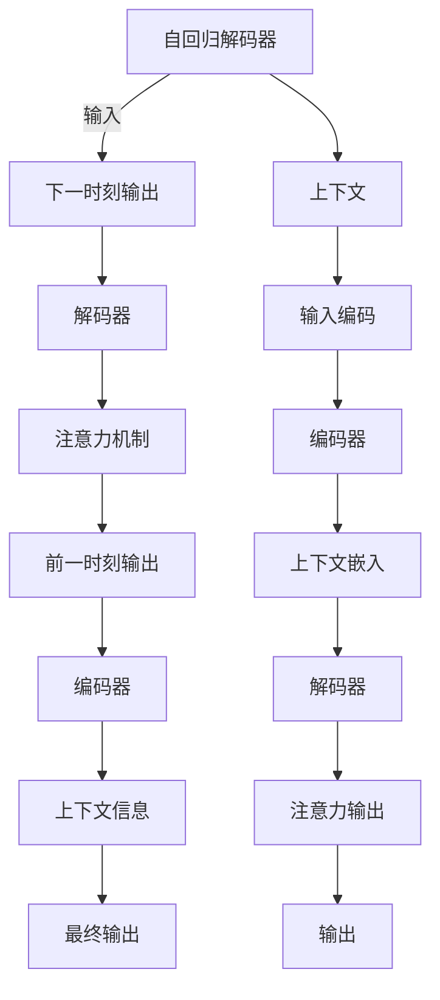

                 

# 大语言模型原理与工程实践：解码器

> 关键词：大语言模型, 解码器, 自回归模型, 自编码模型, 预训练, 微调, 注意力机制

## 1. 背景介绍

### 1.1 问题由来

近年来，深度学习技术取得了飞速发展，大规模语言模型（Large Language Models, LLMs）在自然语言处理（Natural Language Processing, NLP）领域取得了显著进展。这些大语言模型通常以自回归模型（如GPT系列）或自编码模型（如BERT系列）为架构，通过在大规模无标签文本数据上进行预训练，学习到丰富的语言知识和常识。预训练模型已经展现出在各种NLP任务上的出色性能，但这些模型仍然存在一些局限性，如资源消耗大、推理效率低等，这些因素限制了它们在实际应用中的部署。为了克服这些挑战，研究者们提出了多种解码器架构，以实现更高效的推理和更广泛的应用场景。

### 1.2 问题核心关键点

解码器在大语言模型的推理过程中扮演着重要角色，它接收输入的文本，并根据模型学到的知识生成输出。常见的解码器包括自回归解码器（如GPT系列）和自编码解码器（如BERT系列）。自回归解码器基于当前输入预测下一个输出，适用于生成任务，而自编码解码器则基于输入和目标输出预测上下文，适用于分类和回归任务。解码器的选择和优化直接影响模型的性能和应用场景。

本文将详细介绍解码器在大语言模型中的应用，涵盖自回归和自编码解码器的原理、工程实践和实际应用，帮助读者理解这些技术如何使大语言模型在实际应用中更加高效和普适。

## 2. 核心概念与联系

### 2.1 核心概念概述

在深入探讨解码器之前，我们先简要介绍几个关键概念：

- **大语言模型**：以自回归（如GPT）或自编码（如BERT）模型为架构的预训练语言模型，通过在大规模无标签文本数据上进行预训练，学习到语言的通用表示。
- **自回归解码器**：基于当前输入预测下一个输出的解码器，适用于生成任务。
- **自编码解码器**：基于输入和目标输出预测上下文的解码器，适用于分类和回归任务。
- **注意力机制**：用于捕捉输入文本中不同部分与目标输出之间的关系，提高模型的理解和推理能力。

### 2.2 核心概念原理和架构的 Mermaid 流程图

以下是一个简化的Mermaid流程图，展示了自回归解码器与自编码解码器的工作原理：



这个图展示了自回归解码器的基本流程，即利用当前输入预测下一个输出，同时通过注意力机制捕捉上下文信息，最终生成输出。自编码解码器的流程与此类似，但在目标输出部分使用的是分类或回归任务的目标标签。

## 3. 核心算法原理 & 具体操作步骤

### 3.1 算法原理概述

解码器是大语言模型中实现推理的重要组成部分。它接收输入文本，并根据模型学到的知识生成输出。解码器的工作原理可以分为以下几个步骤：

1. **输入编码**：将输入文本转换为模型可以理解的向量表示。
2. **上下文嵌入**：结合当前输入和上下文信息，生成上下文嵌入向量。
3. **注意力机制**：计算输入文本中不同部分与目标输出之间的关系，集中注意力在重要部分。
4. **解码器预测**：根据上下文嵌入和注意力输出，预测下一个输出。
5. **输出解码**：将解码器的预测转换为最终输出。

解码器的具体实现形式和参数配置对模型的性能和应用场景有着重要影响。

### 3.2 算法步骤详解

以自回归解码器为例，其详细步骤如下：

**Step 1: 输入编码**

将输入文本$x$转换为模型可以理解的向量表示$h_0$。对于自回归模型，$h_0$通常通过预训练语言模型（如BERT）得到。

**Step 2: 上下文嵌入**

结合当前输入$h_t$和上下文信息$g_t$，生成上下文嵌入向量$c_t$。

**Step 3: 注意力机制**

计算输入文本中不同部分与目标输出之间的关系，生成注意力向量$a_t$。自回归模型的注意力机制通常基于当前输出$y_t$和上下文向量$c_t$。

**Step 4: 解码器预测**

根据上下文嵌入$c_t$和注意力输出$a_t$，预测下一个输出$y_{t+1}$。预测过程通常包括激活函数和非线性变换。

**Step 5: 输出解码**

将解码器的预测$y_{t+1}$转换为最终输出。对于自回归模型，输出通常是生成文本的下一个字符。

### 3.3 算法优缺点

解码器在大语言模型中的应用具有以下优点和缺点：

**优点：**

- 适用于各种NLP任务，包括生成、分类、回归等。
- 能够利用上下文信息，提高模型的推理能力。
- 注意力机制使模型能够自动捕捉输入文本中的关键信息。

**缺点：**

- 资源消耗大，尤其是自回归模型，推理过程中需要保存所有历史信息。
- 推理速度较慢，尤其是自回归模型，每个输出都需要重新计算。
- 训练和推理过程复杂，需要精心调参。

### 3.4 算法应用领域

解码器在大语言模型的应用领域广泛，涵盖了自然语言生成、机器翻译、文本分类、情感分析等多个任务。以下是几个典型的应用场景：

- **自然语言生成**：生成文本、对话、摘要等。
- **机器翻译**：将一种语言的文本翻译成另一种语言。
- **文本分类**：对文本进行分类，如情感分析、主题分类等。
- **问答系统**：回答用户提出的自然语言问题。

## 4. 数学模型和公式 & 详细讲解 & 举例说明

### 4.1 数学模型构建

解码器的数学模型通常基于自回归或自编码的框架。以下是一个简单的自回归解码器的数学模型：

$$
y_t = \mathcal{G}(h_t, a_t)
$$

其中$y_t$为下一个输出，$h_t$为当前输入编码，$a_t$为注意力输出。自回归模型的预测过程可以表示为：

$$
y_{t+1} = \mathcal{G}(h_{t+1}, a_t)
$$

自编码解码器的数学模型通常基于分类或回归任务的目标标签$y_t$：

$$
y_t = \mathcal{G}(h_t, g_t)
$$

其中$g_t$为目标输出编码。

### 4.2 公式推导过程

以自回归解码器为例，其推理过程可以表示为：

1. 输入编码：$h_0 = \mathcal{E}(x)$
2. 上下文嵌入：$c_t = \mathcal{C}(h_t, g_t)$
3. 注意力机制：$a_t = \mathcal{A}(y_{t-1}, c_t)$
4. 解码器预测：$y_t = \mathcal{D}(c_t, a_t)$
5. 输出解码：$y_{t+1} = \mathcal{O}(y_t)$

对于自编码解码器，其推理过程类似，但目标输出编码$g_t$通常需要与输入编码$h_t$和上下文嵌入$c_t$一起输入到解码器。

### 4.3 案例分析与讲解

以机器翻译为例，自回归解码器的工作流程如下：

1. 输入编码：将源语言文本$x$编码为向量$h_0$。
2. 上下文嵌入：将当前输出$y_{t-1}$和编码向量$h_t$结合，生成上下文嵌入向量$c_t$。
3. 注意力机制：计算源语言文本和目标语言文本之间的关系，生成注意力向量$a_t$。
4. 解码器预测：根据上下文嵌入$c_t$和注意力输出$a_t$，预测下一个目标语言单词$y_{t+1}$。
5. 输出解码：将解码器的预测转换为目标语言文本。

## 5. 项目实践：代码实例和详细解释说明

### 5.1 开发环境搭建

为了进行解码器的开发，需要安装Python、PyTorch等深度学习框架，以及相关的NLP库。

```bash
conda create -n pytorch-env python=3.8 
conda activate pytorch-env
pip install torch transformers datasets transformers
```

### 5.2 源代码详细实现

以下是一个简单的自回归解码器的实现示例：

```python
import torch
from transformers import BertModel, BertTokenizer

tokenizer = BertTokenizer.from_pretrained('bert-base-uncased')
model = BertModel.from_pretrained('bert-base-uncased')

def generate_text(input_text, max_length):
    input_ids = tokenizer.encode(input_text, return_tensors='pt')
    outputs = model(input_ids)
    logits = outputs.logits
    probs = torch.softmax(logits, dim=-1)
    tokens = []
    for i in range(1, max_length):
        prob, token_id = probs[0, i].argmax().item(), tokenizer.decode(token_id)
        tokens.append(token_id)
        probs = probs[0][:i] @ logits[0][:i]
    return ''.join(tokens)

input_text = "Hello, my name is Alice"
output_text = generate_text(input_text, 20)
print(output_text)
```

该示例中，我们使用了Bert模型和Bert Tokenizer进行文本生成。`generate_text`函数接收输入文本和最大长度，返回生成的文本。在每一轮生成过程中，模型根据当前生成的文本和上下文嵌入向量，预测下一个单词的概率，选择概率最大的单词作为下一个生成的文本，并重新计算模型的权重矩阵，继续下一轮的生成。

### 5.3 代码解读与分析

在上述代码中，我们使用了Bert模型和Bert Tokenizer进行文本生成。`generate_text`函数接收输入文本和最大长度，返回生成的文本。在每一轮生成过程中，模型根据当前生成的文本和上下文嵌入向量，预测下一个单词的概率，选择概率最大的单词作为下一个生成的文本，并重新计算模型的权重矩阵，继续下一轮的生成。

## 6. 实际应用场景

### 6.1 智能客服系统

智能客服系统可以采用解码器架构，实现自动回复功能。系统通过预训练语言模型对历史客服对话数据进行微调，得到一个解码器模型，用于自动回复用户提出的问题。系统根据用户的问题，生成最合适的回复。

### 6.2 金融舆情监测

金融舆情监测系统可以采用解码器架构，实现自动化舆情分析。系统通过预训练语言模型对金融领域的新闻、报道等文本数据进行微调，得到一个解码器模型，用于分析舆情趋势。系统根据舆情分析结果，实时监控市场动态，预警潜在风险。

### 6.3 个性化推荐系统

个性化推荐系统可以采用解码器架构，实现用户兴趣的个性化推荐。系统通过预训练语言模型对用户浏览、点击等行为数据进行微调，得到一个解码器模型，用于预测用户对物品的兴趣。系统根据用户的兴趣，推荐最合适的物品。

### 6.4 未来应用展望

随着解码器架构的不断发展和优化，其在NLP领域的应用将会更加广泛。未来，解码器将与更多先进技术结合，如知识图谱、因果推理、多模态学习等，提升模型的理解和推理能力，拓展应用场景。

## 7. 工具和资源推荐

### 7.1 学习资源推荐

为了深入了解解码器的原理和应用，以下是一些推荐的学习资源：

1. 《深度学习与自然语言处理》课程：斯坦福大学开设的NLP经典课程，系统介绍了解码器的原理和应用。
2. 《Sequence to Sequence Learning with Neural Networks》论文：介绍了解码器在机器翻译、文本生成等任务中的应用。
3. 《Bert: Pre-training of Deep Bidirectional Transformers for Language Understanding》论文：介绍了Bert解码器的原理和应用。
4. HuggingFace官方文档：提供了丰富的解码器实现和应用案例。
5. 《Transformers》书籍：介绍了解码器在大语言模型中的应用。

### 7.2 开发工具推荐

为了高效地开发解码器模型，以下是一些推荐的开发工具：

1. PyTorch：深度学习框架，提供了丰富的NLP库和解码器实现。
2. TensorFlow：深度学习框架，支持多种解码器架构。
3. Transformers库：提供了丰富的解码器实现和应用案例。
4. Weights & Biases：模型训练的实验跟踪工具，可以实时监测模型训练过程。
5. TensorBoard：深度学习框架的可视化工具，可以实时展示模型训练状态。

### 7.3 相关论文推荐

为了深入了解解码器的研究和应用，以下是一些推荐的论文：

1. Attention Is All You Need：提出了注意力机制，提高了解码器的推理能力。
2. Transformer-XL：提出了长序列解码器，解决了长序列中的注意力机制问题。
3. BERT: Pre-training of Deep Bidirectional Transformers for Language Understanding：介绍了Bert解码器的原理和应用。
4. Multi-Head Attention for Neural Machine Translation：提出了多头注意力机制，提升了机器翻译的质量。

## 8. 总结：未来发展趋势与挑战

### 8.1 总结

本文对解码器在大语言模型中的应用进行了全面系统的介绍。我们首先阐述了解码器在大语言模型中的作用，然后详细讲解了自回归和自编码解码器的原理、实现和应用。通过这些介绍，读者可以更好地理解解码器在大语言模型中的应用，并掌握其实现方法。

### 8.2 未来发展趋势

未来，解码器将面临以下发展趋势：

1. **参数效率提升**：随着解码器架构的不断优化，未来解码器将更加参数高效，支持更多层和更多的训练样本。
2. **计算效率提升**：解码器将通过优化推理过程，提高计算效率，支持更大规模的文本生成和更实时的应用。
3. **多模态融合**：解码器将与更多模态的数据结合，提升模型的推理能力和应用场景。
4. **自监督学习**：解码器将更多采用自监督学习的方法，减少对标注数据的依赖，提升模型的泛化能力。
5. **分布式训练**：解码器将支持分布式训练，提高训练速度和模型的可扩展性。

### 8.3 面临的挑战

尽管解码器在大语言模型中的应用已经取得了显著进展，但仍面临以下挑战：

1. **计算资源消耗大**：解码器需要保存历史信息，资源消耗较大。
2. **推理速度慢**：解码器的推理速度较慢，难以支持实时应用。
3. **模型鲁棒性不足**：解码器在面对噪声和干扰时，鲁棒性较弱。
4. **模型泛化能力不足**：解码器在面对不同领域和任务时，泛化能力较弱。
5. **模型可解释性不足**：解码器的输出结果难以解释，难以用于需要高可解释性的场景。

### 8.4 研究展望

为了解决这些挑战，未来研究需要从以下几个方面进行突破：

1. **优化解码器架构**：进一步优化解码器架构，提高参数效率和计算效率。
2. **引入自监督学习**：采用自监督学习的方法，减少对标注数据的依赖。
3. **引入多模态学习**：将解码器与其他模态的数据结合，提升模型的推理能力。
4. **提高模型鲁棒性**：提高解码器的鲁棒性，使其在噪声和干扰的情况下依然能够稳定工作。
5. **提高模型泛化能力**：提升解码器的泛化能力，使其在面对不同领域和任务时仍然能够表现良好。
6. **提高模型可解释性**：提升解码器的可解释性，使其输出结果更容易被理解和接受。

## 9. 附录：常见问题与解答

### Q1: 解码器在大语言模型中有什么作用？

A: 解码器在大语言模型中负责将输入的文本转换为目标输出。它接收输入文本，并根据模型学到的知识生成输出。解码器的工作原理可以分为输入编码、上下文嵌入、注意力机制、解码器预测和输出解码等步骤。

### Q2: 解码器有哪些优点和缺点？

A: 解码器的优点包括适用于各种NLP任务，能够利用上下文信息，提高模型的推理能力，注意力机制使模型能够自动捕捉输入文本中的关键信息。缺点包括资源消耗大，推理速度较慢，训练和推理过程复杂。

### Q3: 解码器在实际应用中有哪些场景？

A: 解码器在实际应用中有多种场景，如自然语言生成、机器翻译、文本分类、情感分析等。例如，在机器翻译中，解码器可以接收源语言文本，并生成目标语言文本；在自然语言生成中，解码器可以生成对话、摘要等文本。

### Q4: 如何优化解码器的性能？

A: 优化解码器的性能可以从以下几个方面进行：
1. 优化解码器架构，提高参数效率和计算效率。
2. 引入自监督学习，减少对标注数据的依赖。
3. 引入多模态学习，提升模型的推理能力。
4. 提高模型的鲁棒性，使其在噪声和干扰的情况下依然能够稳定工作。
5. 提高模型的泛化能力，使其在面对不同领域和任务时仍然能够表现良好。
6. 提高模型的可解释性，使其输出结果更容易被理解和接受。

### Q5: 解码器在实际应用中需要注意哪些问题？

A: 解码器在实际应用中需要注意以下几个问题：
1. 计算资源消耗大，需要优化解码器架构和推理过程。
2. 推理速度较慢，需要优化解码器架构和推理过程。
3. 模型鲁棒性不足，需要引入鲁棒性训练方法。
4. 模型泛化能力不足，需要引入泛化训练方法。
5. 模型可解释性不足，需要引入可解释性训练方法。

总之，解码器在大语言模型中的应用具有广泛的前景，但同时也面临着一些挑战。通过不断优化解码器架构和训练方法，可以进一步提升其性能和应用效果。

