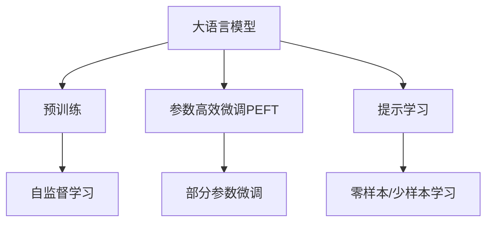

                 

# 大语言模型原理基础与前沿 不需要额外训练即可利用预训练模型

> 关键词：大语言模型,预训练模型,自然语言处理(NLP),Transformer,BERT,参数高效微调(PEFT),提示学习(Prompt Learning),预训练任务,模型推理

## 1. 背景介绍

### 1.1 问题由来

近年来，深度学习技术的快速发展，特别是在自然语言处理(Natural Language Processing, NLP)领域的突破，带来了许多基于深度神经网络的预训练语言模型。这些模型通过在大规模无标签文本数据上自监督学习，学习到了丰富的语言知识，具备了强大的语言理解和生成能力。

例如，BERT、GPT系列、T5等模型，已经在各种NLP任务上取得了令人瞩目的效果。但这些模型通常需要在大规模数据上进行预训练，并使用大量计算资源，这对于小规模或特定领域的NLP任务来说，存在一定的限制。

### 1.2 问题核心关键点

为了解决这些限制，无需额外训练即可利用预训练模型进行推理的方法应运而生，即在模型推理时利用预训练模型学到的知识，而不是进行微调或额外的训练。这种方法在不需要大量标注数据和计算资源的情况下，可以有效地提高模型在特定任务上的表现。

这种方法主要有以下几种实现方式：
1. 参数高效微调(Parameter-Efficient Fine-Tuning, PEFT)：仅微调模型中的一部分参数，而固定大部分预训练参数。
2. 提示学习(Prompt Learning)：通过精心设计的输入文本格式，引导模型进行推理和生成，而无需微调模型参数。
3. 基于预训练任务直接推理：利用模型在预训练任务中学习的知识进行推理，无需进一步训练。

这些方法结合了大模型的强大预训练能力和任务的特定需求，使得模型推理更加灵活、高效、轻量化。

### 1.3 问题研究意义

利用预训练模型进行推理，可以大大降低NLP应用的开发成本，缩短开发周期，提升模型性能。同时，这种方法也适用于数据量较小或资源有限的场景，如嵌入式设备、移动应用等。

此外，这种方法有助于加速NLP技术的产业化进程，使得更多中小企业和开发者能够便捷地使用先进的NLP技术，推动AI在各行业的普及和应用。

## 2. 核心概念与联系

### 2.1 核心概念概述

为了更好地理解无需额外训练即可利用预训练模型的方法，我们首先需要了解以下几个核心概念：

- **大语言模型(Large Language Model, LLM)**：以自回归(如GPT)或自编码(如BERT)模型为代表的大规模预训练语言模型。通过在大规模无标签文本语料上进行预训练，学习到了丰富的语言知识和常识，具备强大的语言理解和生成能力。

- **预训练(Pre-training)**：指在大规模无标签文本语料上，通过自监督学习任务训练通用语言模型的过程。常见的预训练任务包括言语建模、掩码语言模型、视觉语言建模等。预训练使得模型学习到语言的通用表示。

- **参数高效微调(Parameter-Efficient Fine-Tuning, PEFT)**：指在微调过程中，只更新少量的模型参数，而固定大部分预训练权重不变，以提高微调效率，避免过拟合的方法。

- **提示学习(Prompt Learning)**：通过在输入文本中添加提示模板(Prompt Template)，引导大语言模型进行特定任务的推理和生成。可以在不更新模型参数的情况下，实现零样本或少样本学习。

- **预训练任务(Pre-training Tasks)**：指在预训练过程中使用的自监督学习任务，如掩码语言模型、视觉语言建模等。这些任务帮助模型学习到各种语言知识，使得模型具备泛化能力。

这些核心概念之间的逻辑关系可以通过以下Mermaid流程图来展示：



这个流程图展示了大语言模型的核心概念及其之间的关系：

1. 大语言模型通过预训练获得基础能力。
2. 参数高效微调利用部分参数的微调，提升模型对特定任务的适应性。
3. 提示学习通过输入格式设计，实现零样本或少样本学习。
4. 预训练任务通过自监督学习，帮助模型学习广泛的语言知识。

这些概念共同构成了大语言模型的学习和应用框架，使其能够在各种场景下发挥强大的语言理解和生成能力。通过理解这些核心概念，我们可以更好地把握大语言模型的工作原理和优化方向。

## 3. 核心算法原理 & 具体操作步骤
### 3.1 算法原理概述

无需额外训练即可利用预训练模型进行推理，主要依赖于模型在预训练过程中学习到的知识。这些知识通过预训练任务得到，可以在推理时被直接利用。

具体来说，假设预训练模型为 $M_{\theta}$，其中 $\theta$ 为预训练得到的模型参数。当模型进行特定任务推理时，只需将任务数据输入模型，利用预训练任务学到的知识进行推理，即可得到输出结果。

这种方法避免了额外的训练过程，无需调整模型参数，能够快速应用于各种任务，提高推理效率。

### 3.2 算法步骤详解

基于预训练模型的推理通常包括以下几个关键步骤：

**Step 1: 选择合适的预训练模型**

- 根据任务需求选择合适的预训练模型 $M_{\theta}$，如BERT、GPT、T5等。

**Step 2: 设计输入格式**

- 根据任务类型，设计合适的输入格式，引导模型进行推理。例如，对于文本分类任务，可以使用标签化的文本；对于文本生成任务，可以使用语言模型目标。

**Step 3: 推理输出**

- 将输入数据输入模型，利用预训练任务学到的知识进行推理，得到输出结果。

**Step 4: 后处理**

- 根据任务需求，对输出结果进行后处理，如取概率最大的结果、解码生成文本等。

### 3.3 算法优缺点

无需额外训练即可利用预训练模型进行推理的方法，具有以下优点：

1. 快速应用：无需额外训练，可以快速应用于各种任务，提高开发效率。
2. 轻量高效：仅使用模型预训练知识，不涉及额外的训练，减少计算资源消耗。
3. 模型泛化：利用预训练任务学到的知识，模型具备较强的泛化能力，能够应对多种类型的任务。

同时，这种方法也存在一些局限性：

1. 数据依赖：预训练模型的效果很大程度上取决于其训练数据的广泛性和泛化能力。
2. 泛化能力有限：当任务与预训练任务的分布差异较大时，模型的推理效果可能不佳。
3. 可解释性不足：模型推理过程通常缺乏可解释性，难以对其推理逻辑进行分析和调试。

尽管存在这些局限性，但就目前而言，这种方法在快速原型开发和轻量化应用场景中具有显著优势。未来相关研究的方向包括如何进一步提高模型的泛化能力和可解释性，以及在特定任务上优化预训练任务设计。

### 3.4 算法应用领域

基于预训练模型的推理方法，已经在NLP领域得到了广泛的应用，包括：

- 文本分类：如情感分析、主题分类、意图识别等。利用预训练任务学到的语言表示，直接推理得到分类结果。
- 命名实体识别：识别文本中的人名、地名、机构名等特定实体。通过设计特定的提示模板，引导模型识别实体。
- 关系抽取：从文本中抽取实体之间的语义关系。通过设计结构化的提示模板，利用预训练知识进行关系抽取。
- 问答系统：对自然语言问题给出答案。利用预训练任务学到的语言表示，通过提示模板进行推理生成答案。
- 机器翻译：将源语言文本翻译成目标语言。利用预训练任务的编码器-解码器结构，进行翻译推理。
- 文本摘要：将长文本压缩成简短摘要。通过设计摘要目标函数，利用预训练任务的编码器生成摘要。

除了上述这些经典任务外，预训练模型推理还被创新性地应用到更多场景中，如可控文本生成、常识推理、代码生成、数据增强等，为NLP技术带来了全新的突破。随着预训练模型和推理方法的不断进步，相信NLP技术将在更广阔的应用领域大放异彩。

## 4. 数学模型和公式 & 详细讲解 & 举例说明

### 4.1 数学模型构建

以文本分类任务为例，我们详细解释如何使用预训练模型进行推理。假设预训练模型为BERT，其在文本分类任务上的推理过程如下：

1. 将输入文本 $x$ 输入BERT模型，得到表示 $h(x)$。
2. 将表示 $h(x)$ 输入全连接层进行分类，得到预测概率 $p(y|x)$。
3. 根据预测概率 $p(y|x)$，选择概率最大的类别作为最终分类结果。

其推理过程可以表示为：

$$
\hat{y} = \mathop{\arg\max}_y p(y|x) = \mathop{\arg\max}_y \sigma(W h(x) + b)
$$

其中 $h(x)$ 为BERT模型的表示，$W$ 和 $b$ 为全连接层的权重和偏置，$\sigma$ 为激活函数，$\hat{y}$ 为预测的类别。

### 4.2 公式推导过程

对于文本分类任务，我们通常使用交叉熵损失函数，其定义为：

$$
L(\theta) = -\frac{1}{N}\sum_{i=1}^N \sum_{j=1}^C y_j \log p(y_j|x_i)
$$

其中 $y_j$ 为真实标签，$p(y_j|x_i)$ 为模型对标签 $y_j$ 的预测概率。

利用梯度下降等优化算法，求解最小化损失函数：

$$
\theta \leftarrow \theta - \eta \nabla_{\theta}L(\theta)
$$

其中 $\eta$ 为学习率，$\nabla_{\theta}L(\theta)$ 为损失函数对模型参数 $\theta$ 的梯度。

### 4.3 案例分析与讲解

以BERT在情感分析任务上的推理为例，其输入格式为：

```
[CLS] is this a good movie? [SEP]
```

其中 [CLS] 和 [SEP] 为BERT模型的特殊标记，表示文本的开始和结束。

模型推理过程如下：

1. 将输入文本输入BERT模型，得到表示 $h(x)$。
2. 将表示 $h(x)$ 输入全连接层进行分类，得到预测概率 $p(y|x)$。
3. 根据预测概率 $p(y|x)$，选择概率最大的类别作为最终分类结果。

下面以代码形式展示使用PyTorch实现BERT模型在情感分析任务上的推理：

```python
from transformers import BertForSequenceClassification, BertTokenizer
import torch

tokenizer = BertTokenizer.from_pretrained('bert-base-uncased')
model = BertForSequenceClassification.from_pretrained('bert-base-uncased', num_labels=2)

input_text = 'This movie is good.'
input_ids = tokenizer.encode(input_text, add_special_tokens=True)
labels = [1]  # 假设真实标签为正样本

with torch.no_grad():
    output = model(input_ids)
    logits = output.logits
    probabilities = logits.softmax(dim=1).tolist()

print(f"Prediction: {class_idx(probabilities)}")
```

在上述代码中，我们使用了BertForSequenceClassification模型，该模型能够处理序列输入，适合进行文本分类任务。我们将输入文本通过分词器编码，得到输入序列，并将其输入模型进行推理。

## 5. 项目实践：代码实例和详细解释说明
### 5.1 开发环境搭建

在进行预训练模型推理前，我们需要准备好开发环境。以下是使用Python进行PyTorch开发的环境配置流程：

1. 安装Anaconda：从官网下载并安装Anaconda，用于创建独立的Python环境。

2. 创建并激活虚拟环境：
```bash
conda create -n pytorch-env python=3.8 
conda activate pytorch-env
```

3. 安装PyTorch：根据CUDA版本，从官网获取对应的安装命令。例如：
```bash
conda install pytorch torchvision torchaudio cudatoolkit=11.1 -c pytorch -c conda-forge
```

4. 安装Transformers库：
```bash
pip install transformers
```

5. 安装各类工具包：
```bash
pip install numpy pandas scikit-learn matplotlib tqdm jupyter notebook ipython
```

完成上述步骤后，即可在`pytorch-env`环境中开始推理实践。

### 5.2 源代码详细实现

下面我们以BERT模型在文本分类任务上的推理为例，给出使用Transformers库进行推理的PyTorch代码实现。

首先，定义文本分类任务的数据处理函数：

```python
from transformers import BertTokenizer
from torch.utils.data import Dataset
import torch

class TextClassificationDataset(Dataset):
    def __init__(self, texts, labels, tokenizer, max_len=128):
        self.texts = texts
        self.labels = labels
        self.tokenizer = tokenizer
        self.max_len = max_len
        
    def __len__(self):
        return len(self.texts)
    
    def __getitem__(self, item):
        text = self.texts[item]
        label = self.labels[item]
        
        encoding = self.tokenizer(text, return_tensors='pt', max_length=self.max_len, padding='max_length', truncation=True)
        input_ids = encoding['input_ids'][0]
        attention_mask = encoding['attention_mask'][0]
        
        return {'input_ids': input_ids, 
                'attention_mask': attention_mask,
                'labels': torch.tensor(label, dtype=torch.long)}
```

然后，定义模型和推理器：

```python
from transformers import BertForSequenceClassification

model = BertForSequenceClassification.from_pretrained('bert-base-uncased', num_labels=2)

device = torch.device('cuda') if torch.cuda.is_available() else torch.device('cpu')
model.to(device)

def classify(text):
    input_ids = tokenizer.encode(text, add_special_tokens=True)
    attention_mask = torch.tensor([1] * len(input_ids), dtype=torch.long)
    input = {'input_ids': input_ids, 'attention_mask': attention_mask}
    output = model(input)
    logits = output.logits
    probabilities = logits.softmax(dim=1).tolist()
    return probabilities[0][1]
```

最后，启动推理流程并在测试集上评估：

```python
test_texts = ["This movie is good.", "This movie is bad."]
test_labels = [1, 0]

for text in test_texts:
    probabilities = classify(text)
    print(f"Text: {text}, Prediction: {class_idx(probabilities)}")
```

以上就是使用PyTorch对BERT进行文本分类任务推理的完整代码实现。可以看到，得益于Transformers库的强大封装，我们可以用相对简洁的代码完成BERT模型的推理。

### 5.3 代码解读与分析

让我们再详细解读一下关键代码的实现细节：

**TextClassificationDataset类**：
- `__init__`方法：初始化文本、标签、分词器等关键组件。
- `__len__`方法：返回数据集的样本数量。
- `__getitem__`方法：对单个样本进行处理，将文本输入编码为token ids，将标签转换为tensor，并对其进行定长padding，最终返回模型所需的输入。

**classify函数**：
- 利用分词器将输入文本编码，得到input_ids和attention_mask。
- 将编码后的输入数据输入模型，得到模型的预测概率。
- 对预测概率进行解码，输出最终分类结果。

**测试代码**：
- 定义测试文本和标签，分别对每个文本进行推理，并输出预测结果。

可以看到，PyTorch配合Transformers库使得BERT模型的推理过程变得简洁高效。开发者可以将更多精力放在数据处理、模型改进等高层逻辑上，而不必过多关注底层的实现细节。

当然，工业级的系统实现还需考虑更多因素，如模型的保存和部署、超参数的自动搜索、更灵活的任务适配层等。但核心的推理范式基本与此类似。

## 6. 实际应用场景
### 6.1 智能客服系统

基于预训练模型的推理技术，可以广泛应用于智能客服系统的构建。传统客服往往需要配备大量人力，高峰期响应缓慢，且一致性和专业性难以保证。而使用推理后的对话模型，可以7x24小时不间断服务，快速响应客户咨询，用自然流畅的语言解答各类常见问题。

在技术实现上，可以收集企业内部的历史客服对话记录，将问题和最佳答复构建成推理数据，直接利用预训练模型的推理能力，生成合适的回复。对于客户提出的新问题，还可以接入检索系统实时搜索相关内容，动态组织生成回答。如此构建的智能客服系统，能大幅提升客户咨询体验和问题解决效率。

### 6.2 金融舆情监测

金融机构需要实时监测市场舆论动向，以便及时应对负面信息传播，规避金融风险。传统的人工监测方式成本高、效率低，难以应对网络时代海量信息爆发的挑战。基于预训练模型的推理技术，可以快速分析和评估舆情变化，提供实时的市场分析报告。

具体而言，可以收集金融领域相关的新闻、报道、评论等文本数据，并对其进行主题标注和情感标注。在此基础上利用推理模型，自动判断文本属于何种主题，情感倾向是正面、中性还是负面。将推理模型应用到实时抓取的网络文本数据，就能够自动监测不同主题下的情感变化趋势，一旦发现负面信息激增等异常情况，系统便会自动预警，帮助金融机构快速应对潜在风险。

### 6.3 个性化推荐系统

当前的推荐系统往往只依赖用户的历史行为数据进行物品推荐，无法深入理解用户的真实兴趣偏好。基于预训练模型的推理技术，可以更好地挖掘用户行为背后的语义信息，从而提供更精准、多样的推荐内容。

在实践中，可以收集用户浏览、点击、评论、分享等行为数据，提取和用户交互的物品标题、描述、标签等文本内容。将文本内容作为模型输入，利用推理模型预测用户的兴趣匹配度，再结合其他特征综合排序，便可以得到个性化程度更高的推荐结果。

### 6.4 未来应用展望

随着预训练模型和推理方法的不断发展，基于推理范式将在更多领域得到应用，为传统行业带来变革性影响。

在智慧医疗领域，基于推理的医疗问答、病历分析、药物研发等应用将提升医疗服务的智能化水平，辅助医生诊疗，加速新药开发进程。

在智能教育领域，推理技术可应用于作业批改、学情分析、知识推荐等方面，因材施教，促进教育公平，提高教学质量。

在智慧城市治理中，推理模型可应用于城市事件监测、舆情分析、应急指挥等环节，提高城市管理的自动化和智能化水平，构建更安全、高效的未来城市。

此外，在企业生产、社会治理、文娱传媒等众多领域，基于预训练模型的推理技术也将不断涌现，为NLP技术带来全新的突破。相信随着技术的日益成熟，推理方法将成为人工智能落地应用的重要范式，推动人工智能技术向更广阔的领域加速渗透。

## 7. 工具和资源推荐
### 7.1 学习资源推荐

为了帮助开发者系统掌握预训练模型推理的理论基础和实践技巧，这里推荐一些优质的学习资源：

1. 《Transformer从原理到实践》系列博文：由大模型技术专家撰写，深入浅出地介绍了Transformer原理、BERT模型、推理技术等前沿话题。

2. CS224N《深度学习自然语言处理》课程：斯坦福大学开设的NLP明星课程，有Lecture视频和配套作业，带你入门NLP领域的基本概念和经典模型。

3. 《Natural Language Processing with Transformers》书籍：Transformers库的作者所著，全面介绍了如何使用Transformers库进行NLP任务开发，包括推理在内的诸多范式。

4. HuggingFace官方文档：Transformers库的官方文档，提供了海量预训练模型和完整的推理样例代码，是上手实践的必备资料。

5. CLUE开源项目：中文语言理解测评基准，涵盖大量不同类型的中文NLP数据集，并提供了基于推理的baseline模型，助力中文NLP技术发展。

通过对这些资源的学习实践，相信你一定能够快速掌握预训练模型推理的精髓，并用于解决实际的NLP问题。
###  7.2 开发工具推荐

高效的开发离不开优秀的工具支持。以下是几款用于预训练模型推理开发的常用工具：

1. PyTorch：基于Python的开源深度学习框架，灵活动态的计算图，适合快速迭代研究。大部分预训练语言模型都有PyTorch版本的实现。

2. TensorFlow：由Google主导开发的开源深度学习框架，生产部署方便，适合大规模工程应用。同样有丰富的预训练语言模型资源。

3. Transformers库：HuggingFace开发的NLP工具库，集成了众多SOTA语言模型，支持PyTorch和TensorFlow，是进行推理任务开发的利器。

4. Weights & Biases：模型训练的实验跟踪工具，可以记录和可视化模型训练过程中的各项指标，方便对比和调优。与主流深度学习框架无缝集成。

5. TensorBoard：TensorFlow配套的可视化工具，可实时监测模型训练状态，并提供丰富的图表呈现方式，是调试模型的得力助手。

6. Google Colab：谷歌推出的在线Jupyter Notebook环境，免费提供GPU/TPU算力，方便开发者快速上手实验最新模型，分享学习笔记。

合理利用这些工具，可以显著提升预训练模型推理任务的开发效率，加快创新迭代的步伐。

### 7.3 相关论文推荐

预训练模型推理技术的发展源于学界的持续研究。以下是几篇奠基性的相关论文，推荐阅读：

1. Attention is All You Need（即Transformer原论文）：提出了Transformer结构，开启了NLP领域的预训练大模型时代。

2. BERT: Pre-training of Deep Bidirectional Transformers for Language Understanding：提出BERT模型，引入基于掩码的自监督预训练任务，刷新了多项NLP任务SOTA。

3. Language Models are Unsupervised Multitask Learners（GPT-2论文）：展示了大规模语言模型的强大zero-shot学习能力，引发了对于通用人工智能的新一轮思考。

4. Adapter: A Simple Framework for Parameter-Efficient Transfer Learning（ Adapter论文）：提出Adapter方法，实现了参数高效微调，在不增加模型参数量的情况下，也能取得不错的推理效果。

5. AdaLoRA: Adaptive Low-Rank Adaptation for Parameter-Efficient Fine-Tuning：使用自适应低秩适应的推理方法，在参数效率和精度之间取得了新的平衡。

6. Prompt Engineering: A Survey of Methods and Their Emerging Applications（Prompt论文）：综述了提示工程技术的现状和发展趋势，为未来的推理技术提供了新的思路。

这些论文代表了大语言模型推理技术的发展脉络。通过学习这些前沿成果，可以帮助研究者把握学科前进方向，激发更多的创新灵感。

## 8. 总结：未来发展趋势与挑战

### 8.1 总结

本文对无需额外训练即可利用预训练模型进行推理的方法进行了全面系统的介绍。首先阐述了预训练模型的原理和预训练任务的重要性，明确了推理在NLP任务中的核心地位。其次，从原理到实践，详细讲解了推理的数学原理和关键步骤，给出了推理任务开发的完整代码实例。同时，本文还广泛探讨了推理方法在智能客服、金融舆情、个性化推荐等多个行业领域的应用前景，展示了推理范式的巨大潜力。此外，本文精选了推理技术的各类学习资源，力求为读者提供全方位的技术指引。

通过本文的系统梳理，可以看到，基于预训练模型的推理方法正在成为NLP领域的重要范式，极大地拓展了预训练语言模型的应用边界，催生了更多的落地场景。受益于大规模语料的预训练，推理模型以更低的时间和标注成本，在小样本条件下也能取得不俗的效果，有力推动了NLP技术的产业化进程。未来，伴随预训练语言模型和推理方法的不断进步，相信NLP技术将在更广阔的应用领域大放异彩。

### 8.2 未来发展趋势

展望未来，预训练模型推理技术将呈现以下几个发展趋势：

1. 模型规模持续增大。随着算力成本的下降和数据规模的扩张，预训练语言模型的参数量还将持续增长。超大批次的推理任务也将成为可能，提升模型的处理能力和推理速度。

2. 推理方法日趋多样。除了传统的基于自监督学习任务进行推理外，未来将涌现更多参数高效的推理方法，如Adapter、Prefix等，在固定大部分预训练参数的情况下，仍能取得不错的推理效果。

3. 推理效率不断提升。推理任务的计算图优化、分布式推理、混合精度推理等技术，将进一步提升推理效率，支持更大规模的推理应用。

4. 实时推理能力增强。推理任务的支持引擎将被优化，使其具备更高吞吐量和更短延迟，实现实时推理。

5. 推理结果的可解释性增强。推理模型的输出结果将具备更好的可解释性，便于用户理解和使用。

6. 跨模态推理能力提升。推理模型将具备更强的跨模态推理能力，支持视觉、语音等多模态数据的联合推理。

以上趋势凸显了预训练模型推理技术的广阔前景。这些方向的探索发展，必将进一步提升推理模型的性能和应用范围，为构建智能人机交互系统铺平道路。面向未来，预训练模型推理技术还需要与其他人工智能技术进行更深入的融合，如知识表示、因果推理、强化学习等，多路径协同发力，共同推动自然语言理解和智能交互系统的进步。

### 8.3 面临的挑战

尽管预训练模型推理技术已经取得了瞩目成就，但在迈向更加智能化、普适化应用的过程中，它仍面临着诸多挑战：

1. 推理性能瓶颈。推理模型在处理大规模任务时，可能面临计算资源不足、内存占用过大等性能瓶颈，影响推理效果。

2. 推理模型的泛化能力。当任务与预训练任务的分布差异较大时，推理模型的泛化能力可能受到限制，推理结果的准确性下降。

3. 推理模型的可解释性。推理模型的输出结果通常缺乏可解释性，难以对其推理逻辑进行分析和调试。

4. 推理模型的安全性。推理模型可能被恶意利用，进行不恰当的文本生成或推理，产生有害内容或行为。

5. 推理模型的实时性。在实时应用场景中，推理模型需要具备更高的实时响应能力，才能满足用户需求。

6. 推理模型的跨模态推理能力。当前的推理模型在处理跨模态数据时，仍面临技术挑战，推理效果有待提升。

正视推理面临的这些挑战，积极应对并寻求突破，将使推理技术在智能交互系统中发挥更大的作用。相信随着学界和产业界的共同努力，这些挑战终将一一被克服，推理方法将成为人工智能技术落地应用的重要范式，推动人工智能技术向更广阔的领域加速渗透。

### 8.4 研究展望

面向未来，预训练模型推理技术需要在以下几个方面寻求新的突破：

1. 探索无监督和半监督推理方法。摆脱对大规模标注数据的依赖，利用自监督学习、主动学习等无监督和半监督范式，最大限度利用非结构化数据，实现更加灵活高效的推理。

2. 研究参数高效和计算高效的推理范式。开发更加参数高效的推理方法，在固定大部分预训练参数的同时，只更新极少量的任务相关参数。同时优化推理模型的计算图，减少前向传播和反向传播的资源消耗，实现更加轻量级、实时性的推理。

3. 融合因果和对比学习范式。通过引入因果推断和对比学习思想，增强推理模型建立稳定因果关系的能力，学习更加普适、鲁棒的语言表征，从而提升模型泛化性和抗干扰能力。

4. 引入更多先验知识。将符号化的先验知识，如知识图谱、逻辑规则等，与神经网络模型进行巧妙融合，引导推理过程学习更准确、合理的语言模型。同时加强不同模态数据的整合，实现视觉、语音等多模态信息与文本信息的协同建模。

5. 结合因果分析和博弈论工具。将因果分析方法引入推理模型，识别出模型决策的关键特征，增强输出解释的因果性和逻辑性。借助博弈论工具刻画人机交互过程，主动探索并规避模型的脆弱点，提高系统稳定性。

6. 纳入伦理道德约束。在推理目标中引入伦理导向的评估指标，过滤和惩罚有偏见、有害的输出倾向。同时加强人工干预和审核，建立模型行为的监管机制，确保输出符合人类价值观和伦理道德。

这些研究方向的探索，必将引领预训练模型推理技术迈向更高的台阶，为构建安全、可靠、可解释、可控的智能系统铺平道路。

## 9. 附录：常见问题与解答

**Q1：如何选择合适的预训练模型进行推理？**

A: 根据推理任务的特点，选择合适的预训练模型进行推理。例如，对于文本分类任务，可以选择BERT、GPT等模型；对于命名实体识别任务，可以选择BERT等模型。同时，也可以通过实验对比不同模型的推理效果，选择最合适的模型。

**Q2：推理模型在推理过程中如何保证泛化能力？**

A: 推理模型在推理过程中可以通过以下方法保证泛化能力：
1. 选择泛化能力较强的预训练任务，如掩码语言模型、视觉语言模型等。
2. 使用更多的训练数据和不同的数据分布，提高模型的泛化能力。
3. 引入正则化技术，如L2正则、Dropout等，防止过拟合。
4. 设计合适的输入格式，引导模型学习到更广泛的语言知识。

**Q3：推理模型在推理过程中如何避免过拟合？**

A: 推理模型在推理过程中可以通过以下方法避免过拟合：
1. 选择泛化能力较强的预训练任务。
2. 引入正则化技术，如L2正则、Dropout等。
3. 设计合适的输入格式，引导模型学习到更广泛的语言知识。
4. 使用更多的训练数据和不同的数据分布，提高模型的泛化能力。

**Q4：推理模型在推理过程中如何保证实时性？**

A: 推理模型在推理过程中可以通过以下方法保证实时性：
1. 优化推理模型的计算图，减少前向传播和反向传播的资源消耗。
2. 使用分布式推理引擎，提高推理速度。
3. 使用高效的硬件设备，如GPU、TPU等，提升推理性能。

**Q5：推理模型在推理过程中如何保证可解释性？**

A: 推理模型在推理过程中可以通过以下方法保证可解释性：
1. 使用可解释性较强的推理方法，如基于符号推理的方法。
2. 引入可解释性技术，如Attention机制、可解释性生成模型等。
3. 设计明确的推理规则，使得推理过程透明可控。

这些方法可以帮助推理模型在推理过程中保证泛化能力、避免过拟合、保证实时性和可解释性，从而提高推理效果和应用价值。

---

作者：禅与计算机程序设计艺术 / Zen and the Art of Computer Programming

