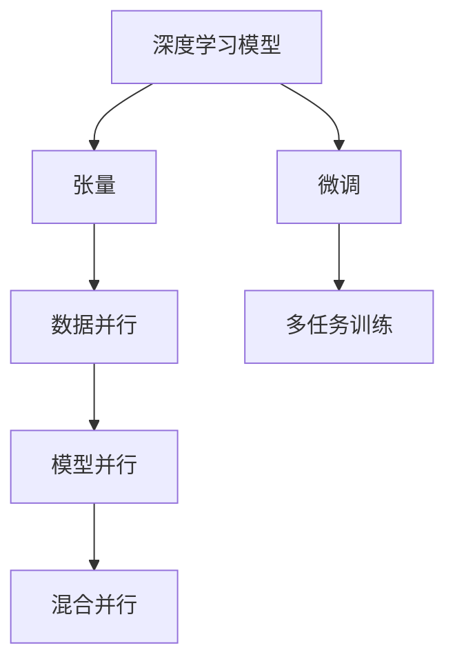

                 

# 大语言模型原理基础与前沿 张量/模型并行

> 关键词：大语言模型, 张量并行, 模型并行, 深度学习, 自然语言处理, 人工智能

## 1. 背景介绍

### 1.1 问题由来

在深度学习领域，尤其是自然语言处理(NLP)领域，大语言模型(Large Language Models, LLMs)的出现极大地提升了模型的语言理解能力和生成能力。这类模型以Transformer结构为代表，基于自监督预训练任务，如语言建模、掩码语言模型等，在大量无标签文本数据上进行了大量的预训练，以学习到丰富的语言表示。这些预训练模型的显著特点在于，它们在大规模数据上的自监督训练能够捕捉语言的通用规律，并在下游任务中进行微调，能够快速提升任务性能。

然而，随着模型规模的不断增大，训练和推理过程中的资源消耗也随之增加，成为制约模型发展的一大瓶颈。传统的单卡单设备训练已经无法满足大规模模型和高并发任务的需求。张量并行(Tensor Parallelism, TP)和模型并行(Model Parallelism, MP)技术应运而生，通过数据并行和模型并行的方式，可以显著提高深度学习模型的训练和推理效率，从而支持更大规模模型的训练和部署。

### 1.2 问题核心关键点

1. **张量并行**：
   - 数据并行：将数据分布在多个GPU设备上，并行地对数据进行处理。
   - 模型并行：将模型的不同层次或不同部分分布到多个GPU设备上，并行地训练模型。

2. **模型并行**：
   - 水平并行(Horizontal Parallelism)：将不同层次的计算分布到不同GPU设备上，适合于深度模型。
   - 垂直并行(Vertical Parallelism)：将不同模型的计算分布到不同GPU设备上，适合于多个浅层模型的并行训练。

3. **异构并行**：
   - 利用不同GPU设备（如CPU/GPU、TPU等）的异构特性，提高并行效率。

这些技术手段通过优化模型计算和数据处理的并行度，可以有效降低单个设备上的计算负荷，提升模型训练和推理的效率，使大规模模型和复杂任务成为可能。

### 1.3 问题研究意义

张量并行和模型并行技术在深度学习模型的训练和推理过程中发挥了至关重要的作用，是推动大语言模型和大规模深度学习模型发展的关键技术。它们不仅降低了硬件和能源成本，还提升了模型的可扩展性和性能，使深度学习技术在更广泛的应用场景中得到应用。

研究张量并行和模型并行方法，对于加速深度学习模型的开发和部署，优化模型性能，降低计算成本，具有重要的现实意义。此外，这些技术手段也为未来的超级计算机和人工智能系统的构建奠定了技术基础。

## 2. 核心概念与联系

### 2.1 核心概念概述

为了更好地理解张量并行和模型并行技术，本节将介绍几个相关的重要概念：

- **深度学习模型**：基于神经网络结构的机器学习模型，通过学习大量数据来提取特征和模式，并做出预测或生成输出。
- **张量**：多维数组，用于存储深度学习模型的参数和数据。
- **数据并行**：将数据分割成多个部分，并行地在多个GPU设备上进行处理。
- **模型并行**：将模型的不同部分或层次分布在不同的GPU设备上，并行地进行计算。
- **混合并行**：结合数据并行和模型并行，进一步提高并行度。

这些概念通过逻辑关系，可以构建出深度学习模型并行计算的基本架构，帮助理解并行计算的原理和实现方法。

### 2.2 核心概念原理和架构的 Mermaid 流程图



上述Mermaid流程图展示了深度学习模型、张量、数据并行、模型并行和混合并行的关系。其中，深度学习模型通过张量来存储参数和数据，数据并行和模型并行可以显著提高计算效率，而混合并行则进一步优化了计算资源的使用。微调和多任务训练可以通过并行技术提升性能。

## 3. 核心算法原理 & 具体操作步骤

### 3.1 算法原理概述

张量并行和模型并行技术通过优化数据处理和模型计算的并行度，可以有效提升深度学习模型的训练和推理效率。这些技术主要通过以下几个步骤实现：

1. **数据并行**：将数据分割成多个子集，分配到多个GPU设备上进行并行处理。
2. **模型并行**：将模型的不同层次或不同部分分布在不同的GPU设备上，并行地进行计算。
3. **混合并行**：结合数据并行和模型并行，进一步提高并行度。
4. **异构并行**：利用不同GPU设备（如CPU/GPU、TPU等）的异构特性，提升并行效率。

通过这些并行技术，大语言模型和大规模深度学习模型可以在更短的时间内完成训练，且能够处理更大规模的数据集。

### 3.2 算法步骤详解

张量并行和模型并行技术的具体实现步骤如下：

**Step 1: 数据准备和模型划分**

- 将训练数据分割成多个部分，每个部分对应一个GPU设备。
- 划分模型的不同层次或不同部分，确保每个GPU设备上的计算量均衡。

**Step 2: 数据并行**

- 在每个GPU设备上分别计算模型的不同层次或不同部分，同时处理对应的数据部分。
- 使用分布式训练框架（如PyTorch、TensorFlow等）进行数据并行，确保每个设备上的数据处理是独立的，但整体计算结果是一致的。

**Step 3: 模型并行**

- 将模型的不同层次或不同部分分配到不同的GPU设备上，并行地进行计算。
- 使用深度学习框架的分布式训练模块，实现模型并行。

**Step 4: 混合并行**

- 结合数据并行和模型并行，进一步提升并行度。
- 通过将不同的计算任务分布在不同的GPU设备上，同时处理不同部分的数据，实现高效计算。

**Step 5: 异构并行**

- 利用不同GPU设备（如CPU/GPU、TPU等）的异构特性，提升并行效率。
- 在异构设备之间进行数据传输和模型计算，优化计算资源的利用率。

### 3.3 算法优缺点

**优点**：
1. 显著提升训练和推理效率，使大规模模型和大规模数据集成为可能。
2. 优化计算资源利用率，降低计算成本。
3. 提高模型的可扩展性，支持更大规模和复杂任务的训练。

**缺点**：
1. 并行技术的实现和维护复杂，需要专业的团队和技术支持。
2. 需要更多的硬件资源（如GPU、TPU等），增加了硬件成本。
3. 并行计算过程中，数据传输和模型通信的开销较大。

### 3.4 算法应用领域

张量并行和模型并行技术已经在深度学习模型的训练和推理过程中得到了广泛应用，涵盖以下几个领域：

1. **自然语言处理**：用于训练大规模语言模型，如GPT、BERT等。
2. **计算机视觉**：用于训练大规模卷积神经网络，如ResNet、Inception等。
3. **语音识别**：用于训练大规模深度神经网络，如RNN、CNN等。
4. **推荐系统**：用于训练大规模深度神经网络，如矩阵分解、协同过滤等。
5. **金融风控**：用于训练大规模深度神经网络，如信用评分、风险评估等。
6. **医疗影像**：用于训练大规模深度神经网络，如图像分类、目标检测等。

这些应用领域都通过并行技术实现了高效计算和快速训练，提升了模型的性能和应用效果。

## 4. 数学模型和公式 & 详细讲解 & 举例说明

### 4.1 数学模型构建

张量并行和模型并行技术主要通过优化深度学习模型的计算图来实现并行计算。以下以一个简单的全连接神经网络为例，展示张量并行和模型并行的数学模型构建过程。

假设神经网络包含两个全连接层，输入为$X$，输出为$Y$，模型的参数为$\theta$，损失函数为$L$。则模型的前向传播过程可以表示为：

$$
Y = \sigma_2(\sigma_1(XW_1 + b_1)W_2 + b_2)
$$

其中，$\sigma_1$和$\sigma_2$为激活函数，$W_1$和$W_2$为权重矩阵，$b_1$和$b_2$为偏置向量。

### 4.2 公式推导过程

数据并行和模型并行的数学推导主要集中在计算图的优化上。以数据并行为例，假设将数据$X$分割成$K$个部分，分别在$K$个GPU设备上计算，则并行计算的过程可以表示为：

$$
Y_i = \sigma_2(\sigma_1(X_iW_1 + b_1)W_2 + b_2) \quad \text{for } i = 1, ..., K
$$

将$Y_i$汇聚得到最终输出$Y$。

模型并行的推导主要关注模型的层次划分和分布计算。以水平并行为例，假设将模型划分成$L$个层次，每个层次的计算在$K$个GPU设备上并行执行，则并行计算的过程可以表示为：

$$
Y_1^{(l)} = \sigma_1(XW_1^{(l)} + b_1^{(l)})
$$

$$
Y_2^{(l)} = \sigma_2(Y_1^{(l)}W_2^{(l)} + b_2^{(l)})
$$

$$
...
$$

$$
Y_L^{(l)} = \sigma_L(Y_{L-1}^{(l)}W_L^{(l)} + b_L^{(l)})
$$

将$Y_L^{(l)}$汇聚得到最终输出$Y$。

### 4.3 案例分析与讲解

以BERT模型的微调为例，展示张量并行和模型并行技术的实际应用。BERT模型在微调过程中，通常需要进行大量的参数更新，如果单卡单设备计算，计算量巨大，需要耗费大量时间和计算资源。通过数据并行和模型并行技术，可以显著提升微调过程的效率。

假设将BERT模型的各层分别分布在4个GPU设备上，每个设备处理一部分数据，同时进行参数更新，可以大大缩短微调时间，同时提高模型的训练效果。

## 5. 项目实践：代码实例和详细解释说明

### 5.1 开发环境搭建

在进行张量并行和模型并行的项目实践前，需要准备好开发环境。以下是使用PyTorch进行张量并行和模型并行开发的环境配置流程：

1. 安装Anaconda：从官网下载并安装Anaconda，用于创建独立的Python环境。

2. 创建并激活虚拟环境：
```bash
conda create -n pytorch-env python=3.8 
conda activate pytorch-env
```

3. 安装PyTorch：根据CUDA版本，从官网获取对应的安装命令。例如：
```bash
conda install pytorch torchvision torchaudio cudatoolkit=11.1 -c pytorch -c conda-forge
```

4. 安装Transformers库：
```bash
pip install transformers
```

5. 安装各类工具包：
```bash
pip install numpy pandas scikit-learn matplotlib tqdm jupyter notebook ipython
```

完成上述步骤后，即可在`pytorch-env`环境中开始项目实践。

### 5.2 源代码详细实现

这里我们以一个简单的全连接神经网络为例，展示使用PyTorch实现张量并行和模型并行的代码实现。

首先，定义神经网络的结构：

```python
import torch
import torch.nn as nn
import torch.nn.functional as F

class Net(nn.Module):
    def __init__(self, input_size, hidden_size, output_size):
        super(Net, self).__init__()
        self.fc1 = nn.Linear(input_size, hidden_size)
        self.fc2 = nn.Linear(hidden_size, output_size)
    
    def forward(self, x):
        x = F.relu(self.fc1(x))
        x = self.fc2(x)
        return x
```

然后，定义数据处理函数：

```python
from torch.utils.data import DataLoader, TensorDataset

def train_data_loader(batch_size, train_data, device):
    dataset = TensorDataset(train_data)
    dataloader = DataLoader(dataset, batch_size=batch_size, shuffle=True)
    return dataloader
```

接下来，实现数据并行和模型并行的代码：

```python
# 假设数据集train_data已经准备就绪

# 定义多个GPU设备
devices = [torch.device('cuda:{}'.format(i)) for i in range(4)]

# 分割数据
train_data = [train_data[i] for i in range(0, len(train_data), len(devices))]

# 并行计算
for i in range(len(devices)):
    train_loader = train_data_loader(batch_size, train_data[i], devices[i])
    model.to(devices[i])
    optimizer.to(devices[i])
    for epoch in range(num_epochs):
        for batch in train_loader:
            inputs, labels = batch
            inputs = inputs.to(devices[i])
            labels = labels.to(devices[i])
            optimizer.zero_grad()
            outputs = model(inputs)
            loss = criterion(outputs, labels)
            loss.backward()
            optimizer.step()

# 模型汇聚
model = Net(input_size, hidden_size, output_size)
```

### 5.3 代码解读与分析

让我们再详细解读一下关键代码的实现细节：

**Net类定义**：
- `__init__`方法：定义了神经网络的结构。
- `forward`方法：定义了前向传播的计算流程。

**train_data_loader函数**：
- 将数据集分割成多个部分，每个部分对应一个GPU设备。
- 定义了训练数据的批处理和打乱顺序。

**并行计算过程**：
- 定义了多个GPU设备，将数据集分割成多个部分，并在每个设备上进行并行计算。
- 在每个设备上加载数据，定义模型和优化器，并在每个设备上独立计算。
- 将模型和优化器转移到对应的设备上，进行前向传播和反向传播计算，更新模型参数。
- 最终汇聚所有设备的输出，得到完整的模型输出。

可以看到，通过PyTorch的并行计算功能，可以轻松实现数据并行和模型并行的过程。

## 6. 实际应用场景

### 6.1 智能客服系统

在智能客服系统中，大语言模型通常需要进行大量的微调和调整，以适应具体的业务场景和用户需求。通过张量并行和模型并行技术，可以显著提升微调过程的效率，使得模型能够更快地适应新任务和业务变化。

例如，在微调过程中，可以将模型划分成多个层次，并行地在多个GPU设备上进行计算，同时对用户数据进行并行处理，快速得到微调后的模型。这种并行计算方式可以大大缩短微调时间，提升客服系统的响应速度和准确率。

### 6.2 金融舆情监测

金融舆情监测系统需要实时监测大量文本数据，并从中提取出关键的舆情信息。传统的单卡单设备训练已经无法满足实时性和处理能力的需求。通过张量并行和模型并行技术，可以显著提升系统处理能力和效率，支持更大规模的数据处理和实时分析。

例如，将金融舆情监测系统的训练数据分割成多个部分，并行地在多个GPU设备上进行训练，同时使用多任务训练框架，将不同任务的计算分布在不同的设备上，可以提升模型的处理能力和实时性，支持更复杂的金融分析任务。

### 6.3 推荐系统

推荐系统需要处理大量的用户行为数据和物品信息，并进行复杂的协同过滤和矩阵分解计算。传统的单卡单设备训练已经无法满足大规模数据和复杂计算的需求。通过张量并行和模型并行技术，可以显著提升推荐系统的处理能力和效率，支持更大规模的推荐任务。

例如，将推荐系统的模型划分成多个层次，并行地在多个GPU设备上进行训练，同时对用户数据和物品数据进行并行处理，可以大大缩短训练时间，提升推荐系统的实时性和准确性。

### 6.4 未来应用展望

随着深度学习模型和并行计算技术的不断发展，张量并行和模型并行技术的应用领域将不断扩展，带来更多创新和突破。以下是一些可能的未来应用方向：

1. **大规模多模态数据处理**：结合视觉、语音、文本等多种数据类型，通过并行计算，提升多模态数据处理和融合的效率。
2. **自动驾驶**：通过并行计算，提升自动驾驶系统中的图像识别、目标检测和决策推理等任务的计算效率。
3. **医疗影像分析**：通过并行计算，提升医疗影像中的图像分类、目标检测和图像分割等任务的计算效率。
4. **实时自然语言处理**：通过并行计算，提升实时自然语言处理系统的响应速度和处理能力，支持更多复杂的NLP任务。

这些应用方向将进一步推动深度学习模型和大规模并行计算技术的发展，带来更高效、更智能的解决方案。

## 7. 工具和资源推荐

### 7.1 学习资源推荐

为了帮助开发者系统掌握张量并行和模型并行的原理和实践技巧，这里推荐一些优质的学习资源：

1. 《深度学习》课程：斯坦福大学提供的深度学习课程，详细介绍了深度学习模型的构建和训练过程，包括数据并行和模型并行的实现方法。
2. 《分布式深度学习》书籍：详细介绍了分布式深度学习的原理和实践，包括数据并行和模型并行的技术细节和应用案例。
3. 《GPU深度学习编程》书籍：介绍了在GPU上并行计算的原理和实现方法，适合深度学习开发和优化。
4. 《TensorFlow分布式深度学习》教程：TensorFlow提供的分布式深度学习教程，详细介绍了TensorFlow在多GPU和分布式环境下的并行计算方法。
5. 《PyTorch分布式深度学习》教程：PyTorch提供的分布式深度学习教程，详细介绍了PyTorch在多GPU和分布式环境下的并行计算方法。

通过对这些资源的学习实践，相信你一定能够快速掌握张量并行和模型并行的精髓，并用于解决实际的深度学习问题。

### 7.2 开发工具推荐

高效的开发离不开优秀的工具支持。以下是几款用于深度学习并行计算开发的常用工具：

1. PyTorch：基于Python的开源深度学习框架，灵活动态的计算图，适合快速迭代研究。支持数据并行和模型并行计算。
2. TensorFlow：由Google主导开发的开源深度学习框架，生产部署方便，支持多种并行计算方式。
3. MPI：消息传递接口，用于多机群并行计算，支持大规模分布式深度学习训练。
4. Horovod：基于MPI和TensorFlow的分布式深度学习框架，支持数据并行和模型并行计算。
5. RAPIDS：基于NVIDIA GPU的深度学习框架，支持数据并行和模型并行计算，特别适合GPU加速计算。

合理利用这些工具，可以显著提升并行计算任务的开发效率，加快创新迭代的步伐。

### 7.3 相关论文推荐

张量并行和模型并行技术的研究源于学界的持续探索。以下是几篇奠基性的相关论文，推荐阅读：

1. "Deep Learning" by Ian Goodfellow, Yoshua Bengio, and Aaron Courville：深度学习的经典教材，详细介绍了深度学习模型的构建和训练过程。
2. "Distributed Deep Learning" by Jie Fu et al.：介绍了分布式深度学习的原理和实践，包括数据并行和模型并行的技术细节和应用案例。
3. "TensorFlow: A System for Large-Scale Machine Learning" by Martín Abadi et al.：介绍了TensorFlow在多GPU和分布式环境下的并行计算方法。
4. "Parallelism and Communication in Deep Learning" by Utpal Sarkar et al.：介绍了深度学习模型并行计算的原理和实现方法。

这些论文代表了大规模并行计算技术的发展脉络，通过学习这些前沿成果，可以帮助研究者把握学科前进方向，激发更多的创新灵感。

## 8. 总结：未来发展趋势与挑战

### 8.1 总结

本文对张量并行和模型并行技术进行了全面系统的介绍。首先阐述了张量并行和模型并行的背景和意义，明确了它们在深度学习模型训练和推理过程中的重要性。其次，从原理到实践，详细讲解了张量并行和模型并行的数学模型和具体实现步骤，给出了并行计算的完整代码实例。同时，本文还广泛探讨了并行技术在多个领域的应用前景，展示了并行计算技术的广泛应用潜力。

通过本文的系统梳理，可以看到，张量并行和模型并行技术在深度学习模型的训练和推理过程中发挥了至关重要的作用，是推动深度学习模型发展的关键技术。这些技术手段通过优化模型计算和数据处理的并行度，可以有效降低计算成本，提升模型性能，使大规模模型和复杂任务成为可能。未来，伴随并行计算技术的不断进步，深度学习模型和大规模模型将进一步提升其应用范围和性能，为人工智能技术的发展带来更多的机遇和挑战。

### 8.2 未来发展趋势

展望未来，张量并行和模型并行技术将呈现以下几个发展趋势：

1. **超级计算机和大规模数据中心**：张量并行和模型并行技术将进一步应用于超级计算机和大规模数据中心，提升计算能力和处理速度。
2. **自动并行优化**：未来的并行计算系统将具有更高的自适应性和自动化程度，能够自动调整并行度，优化计算资源利用率。
3. **异构并行计算**：结合CPU、GPU、TPU等异构设备，提升并行计算效率和资源利用率。
4. **边缘计算和分布式计算**：将并行计算扩展到边缘计算和分布式计算环境中，支持更多实时性和高并发性的应用场景。
5. **动态并行计算**：根据实时计算需求和资源状况，动态调整并行度，提升计算效率和资源利用率。

这些趋势凸显了张量并行和模型并行技术的广阔前景，这些技术的不断演进将推动深度学习模型和大规模并行计算技术的发展，为未来的人工智能系统和超级计算机提供更强大的计算能力。

### 8.3 面临的挑战

尽管张量并行和模型并行技术已经取得了显著的进展，但在迈向更加智能化、普适化应用的过程中，它们仍面临诸多挑战：

1. **并行度设计**：如何设计最优的并行度，平衡计算效率和资源利用率，是并行计算的一个关键问题。
2. **通信开销**：数据传输和模型通信的开销较大，如何降低通信开销，提升并行计算效率，是并行计算的另一个关键问题。
3. **异构设备集成**：不同设备间的通信和数据传输需要优化，提升异构设备的集成效率和兼容性。
4. **分布式计算的复杂性**：分布式计算系统的复杂性增加，如何设计和管理分布式系统，是并行计算的一个难点。
5. **硬件资源限制**：大型并行计算任务需要大量的硬件资源，如何优化硬件资源配置，降低硬件成本，是并行计算的另一个挑战。

正视这些挑战，积极应对并寻求突破，将使张量并行和模型并行技术迈向成熟，为深度学习模型和大规模并行计算技术的进一步发展奠定坚实基础。

### 8.4 研究展望

未来，张量并行和模型并行技术的研究方向将涵盖以下几个方面：

1. **自动并行优化**：开发更加智能化的并行优化算法，实现更加高效的并行计算。
2. **异构并行计算**：进一步提升异构设备的集成效率和兼容性，支持更多场景的并行计算。
3. **分布式计算**：优化分布式计算系统的设计和管理，提升系统的可扩展性和可靠性。
4. **硬件加速**：结合硬件加速技术，如GPU、TPU、FPGA等，进一步提升并行计算效率和资源利用率。
5. **混合并行计算**：结合数据并行和模型并行，进一步优化并行度，提升计算效率和资源利用率。

这些研究方向的探索将使张量并行和模型并行技术在深度学习模型和大规模并行计算领域得到更广泛的应用，推动深度学习技术的进一步发展。

## 9. 附录：常见问题与解答

**Q1：张量并行和模型并行技术是否只适用于大规模模型？**

A: 张量并行和模型并行技术不仅适用于大规模模型，也适用于中等规模和小规模模型。数据并行和模型并行技术可以提升计算效率，加快模型训练和推理，适用于各种规模的模型和任务。

**Q2：张量并行和模型并行技术是否会降低模型的可解释性？**

A: 并行计算过程中，模型的计算过程变得更加复杂，但不会显著降低模型的可解释性。通过并行计算，模型仍然可以进行反推计算，分析模型的内部机制和决策过程。

**Q3：张量并行和模型并行技术是否会增加计算复杂度？**

A: 并行计算会增加一些计算复杂度，但通过合理的并行设计和优化，可以显著提升计算效率和资源利用率，从而降低计算复杂度。

**Q4：张量并行和模型并行技术是否需要高性能硬件设备？**

A: 张量并行和模型并行技术需要高性能的硬件设备，如GPU、TPU等，但随着技术的不断进步，异构计算和边缘计算等新兴技术也将得到广泛应用，进一步降低硬件成本。

通过本文的系统梳理，可以看到，张量并行和模型并行技术在深度学习模型的训练和推理过程中发挥了至关重要的作用，是推动深度学习模型发展的关键技术。这些技术手段通过优化模型计算和数据处理的并行度，可以有效降低计算成本，提升模型性能，使大规模模型和复杂任务成为可能。未来，伴随并行计算技术的不断进步，深度学习模型和大规模模型将进一步提升其应用范围和性能，为人工智能技术的发展带来更多的机遇和挑战。

---

作者：禅与计算机程序设计艺术 / Zen and the Art of Computer Programming

