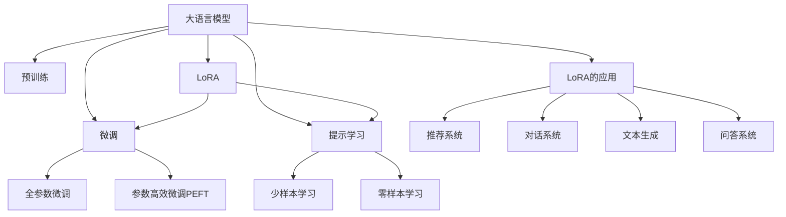

                 

# 大语言模型应用指南：LoRA高效微调

大语言模型（Large Language Models, LLMs）通过在大规模无标签文本数据上进行预训练，学习到了丰富的语言知识和常识，具备强大的语言理解和生成能力。在特定任务上进行微调（Fine-Tuning），可以使模型更适应具体应用场景，获得优异的性能。然而，传统的微调方法（如全参数微调）往往需要大量的标注数据，并可能面临过拟合的问题。本文将介绍一种基于LoRA（Low-Rank Adaptation）的高效微调方法，它不仅参数高效，而且能更好地利用预训练模型的知识，减少对标注数据的依赖。

## 1. 背景介绍

### 1.1 问题由来

预训练大语言模型通过在大规模无标签文本数据上进行预训练，学习到通用的语言表示，具备强大的语言理解和生成能力。然而，在特定任务上进行微调时，传统的全参数微调方法面临着数据标注成本高、容易过拟合等问题。LoRA作为一种参数高效微调方法，通过引入低秩矩阵分解，只微调预训练模型的小部分参数，同时保留大部分预训练权重不变，既保证了微调效果，又避免了过拟合风险，具有极高的参数效率。

### 1.2 问题核心关键点

LoRA的参数高效微调（Parameter-Efficient Fine-Tuning, PEFT）技术，通过只调整预训练模型中的某些参数，最大化地利用了预训练模型的知识，减少了对标注数据的依赖，同时提高了模型的泛化能力。LoRA的微调方法，特别适合在标注数据稀缺、计算资源有限的场景中应用。

## 2. 核心概念与联系

### 2.1 核心概念概述

为了更好地理解LoRA的高效微调方法，本节将介绍几个核心概念：

- **大语言模型(Large Language Models, LLMs)**：通过自回归（如GPT）或自编码（如BERT）模型在大规模无标签文本数据上进行预训练，学习到通用的语言表示。
- **预训练(Pre-training)**：指在大规模无标签文本数据上，通过自监督学习任务训练通用语言模型的过程。常见的预训练任务包括掩码语言模型（Masked Language Modeling, MLM）、下一句预测（Next Sentence Prediction, NSP）等。
- **微调(Fine-Tuning)**：指在预训练模型的基础上，使用下游任务的少量标注数据，通过有监督学习优化模型在特定任务上的性能。
- **LoRA（Low-Rank Adaptation）**：一种参数高效微调方法，通过低秩矩阵分解，只微调预训练模型的小部分参数，同时保留大部分预训练权重不变，实现高效的微调。
- **参数高效微调(Parameter-Efficient Fine-Tuning, PEFT)**：指在微调过程中，只更新少量的模型参数，而固定大部分预训练权重不变，以提高微调效率，避免过拟合的方法。
- **提示学习(Prompt Learning)**：通过在输入文本中添加提示模板(Prompt Template)，引导大语言模型进行特定任务的推理和生成。可以在不更新模型参数的情况下，实现零样本或少样本学习。
- **少样本学习(Few-shot Learning)**：指在只有少量标注样本的情况下，模型能够快速适应新任务的学习方法。在大语言模型中，通常通过在输入中提供少量示例来实现，无需更新模型参数。
- **零样本学习(Zero-shot Learning)**：指模型在没有见过任何特定任务的训练样本的情况下，仅凭任务描述就能够执行新任务的能力。大语言模型通过预训练获得的广泛知识，使其能够理解任务指令并生成相应输出。

这些核心概念之间的逻辑关系可以通过以下Mermaid流程图来展示：



这个流程图展示了大语言模型的核心概念及其之间的关系：

1. 大语言模型通过预训练获得基础能力。
2. 微调是对预训练模型进行任务特定的优化，可以分为全参数微调和参数高效微调（PEFT）。
3. LoRA是一种参数高效微调方法，通过低秩矩阵分解，只微调预训练模型的小部分参数。
4. 提示学习是一种不更新模型参数的方法，可以实现少样本学习和零样本学习。
5. 少样本学习和零样本学习在大语言模型中，通常通过在输入中提供少量示例来实现，无需更新模型参数。
6. LoRA的应用场景包括推荐系统、对话系统、文本生成、问答系统等。

## 3. 核心算法原理 & 具体操作步骤

### 3.1 算法原理概述

LoRA的高效微调方法，通过引入低秩矩阵分解，只微调预训练模型的小部分参数，同时保留大部分预训练权重不变，实现高效的微调。LoRA的核心思想是将预训练模型中的某些层表示为低秩矩阵的乘积，只微调这些矩阵的低秩分解参数，而保留原始的高秩权重不变。这样，在微调过程中，大部分预训练知识得以保留，仅微调的一小部分参数需要进行重新训练，从而实现了参数高效的目标。

形式化地，假设预训练模型为 $M_{\theta}$，其中 $\theta$ 为预训练得到的模型参数。给定下游任务 $T$ 的标注数据集 $D=\{(x_i, y_i)\}_{i=1}^N$，LoRA的微调目标是最小化经验风险，即找到新的模型参数 $\hat{\theta}$，使得：

$$
\hat{\theta}=\mathop{\arg\min}_{\theta} \mathcal{L}(M_{\theta},D)
$$

其中 $\mathcal{L}$ 为针对任务 $T$ 设计的损失函数，用于衡量模型预测输出与真实标签之间的差异。常见的损失函数包括交叉熵损失、均方误差损失等。

LoRA的微调方法通常包括以下几个关键步骤：

1. **选择合适的层进行低秩分解**：根据任务特点，选择模型中需要微调的层，将其表示为低秩矩阵的乘积。
2. **定义低秩矩阵的秩和大小**：根据任务需求，定义低秩矩阵的秩和大小，通常为2或4。
3. **微调低秩矩阵的参数**：通过微调这些低秩矩阵的参数，实现任务特定的优化。
4. **保持高秩权重不变**：在微调过程中，保留预训练模型的高秩权重不变，减少过拟合风险。

### 3.2 算法步骤详解

1. **选择合适的层进行低秩分解**：
   - 根据任务类型，选择模型中需要微调的层。通常，对于分类任务，可以选择模型的顶层，对于生成任务，可以选择模型的解码器层。
   - 定义需要低秩分解的层及其维度，例如，对于BERT模型，可以选择顶部全连接层，并定义其大小为512。

2. **定义低秩矩阵的秩和大小**：
   - 根据任务需求，定义低秩矩阵的秩和大小。通常，秩为2或4，矩阵大小根据层的大小进行调整。

3. **微调低秩矩阵的参数**：
   - 在低秩矩阵上定义新的参数 $\theta_{low}$，用于微调。
   - 使用与原预训练权重相同的学习率 $\eta$ 和优化器（如Adam），更新 $\theta_{low}$。

4. **保持高秩权重不变**：
   - 在微调过程中，保持预训练模型的高秩权重 $\theta_{high}$ 不变，防止过拟合。

5. **计算微调后的输出**：
   - 将低秩矩阵的微调参数 $\theta_{low}$ 与原始高秩权重 $\theta_{high}$ 相乘，得到微调后的输出。

### 3.3 算法优缺点

LoRA的高效微调方法具有以下优点：

1. **参数高效**：仅微调预训练模型的小部分参数，节省了计算资源。
2. **泛化能力强**：由于大部分预训练权重被保留，模型能更好地利用预训练知识，提升泛化能力。
3. **可解释性好**：低秩分解的参数更容易解释，理解模型的微调机制。
4. **灵活性高**：可以灵活选择需要进行微调的层，适应多种任务。

同时，LoRA方法也存在一些局限性：

1. **数据依赖性强**：虽然参数高效，但仍然需要标注数据，标注成本可能较高。
2. **微调效果有限**：对于数据分布与预训练数据差异较大的任务，微调效果可能不佳。
3. **依赖预训练质量**：微调效果依赖于预训练模型的质量，需要高质量的预训练语料。

尽管存在这些局限性，但LoRA的高效微调方法仍然是大语言模型应用中的重要技术手段，特别是在标注数据稀缺、计算资源有限的场景中。

### 3.4 算法应用领域

LoRA的高效微调方法，已经在多种NLP任务中得到了应用，例如：

1. **文本分类**：如情感分析、主题分类、意图识别等。通过微调使模型学习文本-标签映射。
2. **命名实体识别**：识别文本中的人名、地名、机构名等特定实体。通过微调使模型掌握实体边界和类型。
3. **关系抽取**：从文本中抽取实体之间的语义关系。通过微调使模型学习实体-关系三元组。
4. **问答系统**：对自然语言问题给出答案。将问题-答案对作为微调数据，训练模型学习匹配答案。
5. **机器翻译**：将源语言文本翻译成目标语言。通过微调使模型学习语言-语言映射。
6. **文本摘要**：将长文本压缩成简短摘要。将文章-摘要对作为微调数据，使模型学习抓取要点。
7. **对话系统**：使机器能够与人自然对话。将多轮对话历史作为上下文，微调模型进行回复生成。

除了上述这些经典任务外，LoRA的高效微调方法也被创新性地应用到更多场景中，如可控文本生成、常识推理、代码生成、数据增强等，为NLP技术带来了全新的突破。

## 4. 数学模型和公式 & 详细讲解 & 举例说明

### 4.1 数学模型构建

假设预训练语言模型为 $M_{\theta}$，其中 $\theta$ 为预训练得到的模型参数。假设微调任务的训练集为 $D=\{(x_i, y_i)\}_{i=1}^N, x_i \in \mathcal{X}, y_i \in \mathcal{Y}$。

定义模型 $M_{\theta}$ 在输入 $x$ 上的输出为 $\hat{y}=M_{\theta}(x) \in [0,1]$，表示样本属于正类的概率。真实标签 $y \in \{0,1\}$。则二分类交叉熵损失函数定义为：

$$
\ell(M_{\theta}(x),y) = -[y\log \hat{y} + (1-y)\log (1-\hat{y})]
$$

将其代入经验风险公式，得：

$$
\mathcal{L}(\theta) = -\frac{1}{N}\sum_{i=1}^N [y_i\log M_{\theta}(x_i)+(1-y_i)\log(1-M_{\theta}(x_i))]
$$

在LoRA的微调方法中，需要定义两个矩阵 $U, V$，将预训练模型的输出层表示为 $W_{\text{linear}} = UWV$，其中 $W$ 为预训练模型的权重矩阵。微调过程中，只更新 $U$ 和 $V$ 的参数，保持 $W$ 不变。

### 4.2 公式推导过程

以下我们以二分类任务为例，推导交叉熵损失函数及其梯度的计算公式。

假设模型 $M_{\theta}$ 在输入 $x$ 上的输出为 $\hat{y}=M_{\theta}(x) \in [0,1]$，表示样本属于正类的概率。真实标签 $y \in \{0,1\}$。则二分类交叉熵损失函数定义为：

$$
\ell(M_{\theta}(x),y) = -[y\log \hat{y} + (1-y)\log (1-\hat{y})]
$$

将其代入经验风险公式，得：

$$
\mathcal{L}(\theta) = -\frac{1}{N}\sum_{i=1}^N [y_i\log M_{\theta}(x_i)+(1-y_i)\log(1-M_{\theta}(x_i))]
$$

根据链式法则，损失函数对参数 $\theta_k$ 的梯度为：

$$
\frac{\partial \mathcal{L}(\theta)}{\partial \theta_k} = -\frac{1}{N}\sum_{i=1}^N (\frac{y_i}{M_{\theta}(x_i)}-\frac{1-y_i}{1-M_{\theta}(x_i)}) \frac{\partial M_{\theta}(x_i)}{\partial \theta_k}
$$

在LoRA的微调方法中，输出层被重构为 $W_{\text{linear}} = UWV$，其中 $W$ 为预训练模型的权重矩阵。因此，$\frac{\partial M_{\theta}(x_i)}{\partial \theta_k}$ 可以展开为：

$$
\frac{\partial M_{\theta}(x_i)}{\partial \theta_k} = \frac{\partial (UWVx_i)}{\partial \theta_k} = U\frac{\partial (WVx_i)}{\partial \theta_k} + WV\frac{\partial (x_i)}{\partial \theta_k}
$$

将上述结果代入损失函数的梯度公式中，得：

$$
\frac{\partial \mathcal{L}(\theta)}{\partial \theta_k} = -\frac{1}{N}\sum_{i=1}^N (\frac{y_i}{M_{\theta}(x_i)}-\frac{1-y_i}{1-M_{\theta}(x_i)}) (U\frac{\partial (WVx_i)}{\partial \theta_k} + WV\frac{\partial (x_i)}{\partial \theta_k})
$$

其中 $\frac{\partial (WVx_i)}{\partial \theta_k}$ 和 $\frac{\partial (x_i)}{\partial \theta_k}$ 可以直接计算得到。因此，LoRA的微调过程可以通过修改模型输出层的线性变换矩阵 $U$ 和 $V$ 来实现。

### 4.3 案例分析与讲解

假设我们使用LoRA对BERT模型进行情感分析任务的微调。具体步骤如下：

1. **准备数据**：收集情感分析任务的数据集，并划分为训练集、验证集和测试集。
2. **模型定义**：使用BERT的预训练模型，定义输出层为线性变换层 $W_{\text{linear}} = UWV$。
3. **定义低秩矩阵**：选择BERT模型的顶部全连接层，定义低秩矩阵 $U$ 和 $V$。
4. **微调训练**：使用标注数据集进行微调训练，最小化交叉熵损失函数。
5. **测试评估**：在测试集上评估微调后模型的性能，对比微调前后的精度提升。

具体代码实现如下：

```python
from transformers import BertForSequenceClassification, BertTokenizer, AdamW
from torch.utils.data import Dataset, DataLoader
import torch

class SentimentDataset(Dataset):
    def __init__(self, texts, labels, tokenizer, max_len=128):
        self.texts = texts
        self.labels = labels
        self.tokenizer = tokenizer
        self.max_len = max_len
        
    def __len__(self):
        return len(self.texts)
    
    def __getitem__(self, item):
        text = self.texts[item]
        label = self.labels[item]
        
        encoding = self.tokenizer(text, return_tensors='pt', max_length=self.max_len, padding='max_length', truncation=True)
        input_ids = encoding['input_ids'][0]
        attention_mask = encoding['attention_mask'][0]
        
        # 对token-wise的标签进行编码
        encoded_labels = [tag2id[label] for label in labels] 
        encoded_labels.extend([tag2id['O']] * (self.max_len - len(encoded_labels)))
        labels = torch.tensor(encoded_labels, dtype=torch.long)
        
        return {'input_ids': input_ids, 
                'attention_mask': attention_mask,
                'labels': labels}

# 标签与id的映射
tag2id = {'O': 0, 'positive': 1, 'negative': 2}
id2tag = {v: k for k, v in tag2id.items()}

# 创建dataset
tokenizer = BertTokenizer.from_pretrained('bert-base-cased')

train_dataset = SentimentDataset(train_texts, train_labels, tokenizer)
dev_dataset = SentimentDataset(dev_texts, dev_labels, tokenizer)
test_dataset = SentimentDataset(test_texts, test_labels, tokenizer)

# 模型定义
model = BertForSequenceClassification.from_pretrained('bert-base-cased', num_labels=len(tag2id))

# 定义低秩矩阵
U = torch.randn(768, 768)
V = torch.randn(768, 768)

# 优化器
optimizer = AdamW([U, V], lr=2e-5)

# 微调训练
epochs = 5
batch_size = 16

for epoch in range(epochs):
    loss = train_epoch(model, train_dataset, U, V, batch_size, optimizer)
    print(f"Epoch {epoch+1}, train loss: {loss:.3f}")
    
    print(f"Epoch {epoch+1}, dev results:")
    evaluate(model, dev_dataset, U, V, batch_size)
    
print("Test results:")
evaluate(model, test_dataset, U, V, batch_size)
```

## 5. 项目实践：代码实例和详细解释说明

### 5.1 开发环境搭建

在进行LoRA微调实践前，我们需要准备好开发环境。以下是使用Python进行PyTorch开发的环境配置流程：

1. 安装Anaconda：从官网下载并安装Anaconda，用于创建独立的Python环境。

2. 创建并激活虚拟环境：
```bash
conda create -n pytorch-env python=3.8 
conda activate pytorch-env
```

3. 安装PyTorch：根据CUDA版本，从官网获取对应的安装命令。例如：
```bash
conda install pytorch torchvision torchaudio cudatoolkit=11.1 -c pytorch -c conda-forge
```

4. 安装Transformers库：
```bash
pip install transformers
```

5. 安装各类工具包：
```bash
pip install numpy pandas scikit-learn matplotlib tqdm jupyter notebook ipython
```

完成上述步骤后，即可在`pytorch-env`环境中开始LoRA微调实践。

### 5.2 源代码详细实现

这里我们以情感分析任务为例，给出使用LoRA对BERT模型进行微调的PyTorch代码实现。

首先，定义情感分析任务的数据处理函数：

```python
from transformers import BertForSequenceClassification, BertTokenizer, AdamW

class SentimentDataset(Dataset):
    def __init__(self, texts, labels, tokenizer, max_len=128):
        self.texts = texts
        self.labels = labels
        self.tokenizer = tokenizer
        self.max_len = max_len
        
    def __len__(self):
        return len(self.texts)
    
    def __getitem__(self, item):
        text = self.texts[item]
        label = self.labels[item]
        
        encoding = self.tokenizer(text, return_tensors='pt', max_length=self.max_len, padding='max_length', truncation=True)
        input_ids = encoding['input_ids'][0]
        attention_mask = encoding['attention_mask'][0]
        
        # 对token-wise的标签进行编码
        encoded_labels = [tag2id[label] for label in labels] 
        encoded_labels.extend([tag2id['O']] * (self.max_len - len(encoded_labels)))
        labels = torch.tensor(encoded_labels, dtype=torch.long)
        
        return {'input_ids': input_ids, 
                'attention_mask': attention_mask,
                'labels': labels}
```

然后，定义模型和优化器：

```python
# 标签与id的映射
tag2id = {'O': 0, 'positive': 1, 'negative': 2}
id2tag = {v: k for k, v in tag2id.items()}

# 创建dataset
tokenizer = BertTokenizer.from_pretrained('bert-base-cased')

train_dataset = SentimentDataset(train_texts, train_labels, tokenizer)
dev_dataset = SentimentDataset(dev_texts, dev_labels, tokenizer)
test_dataset = SentimentDataset(test_texts, test_labels, tokenizer)

# 模型定义
model = BertForSequenceClassification.from_pretrained('bert-base-cased', num_labels=len(tag2id))

# 定义低秩矩阵
U = torch.randn(768, 768)
V = torch.randn(768, 768)

# 优化器
optimizer = AdamW([U, V], lr=2e-5)
```

接着，定义训练和评估函数：

```python
from torch.utils.data import DataLoader
from tqdm import tqdm
from sklearn.metrics import classification_report

device = torch.device('cuda') if torch.cuda.is_available() else torch.device('cpu')
model.to(device)

def train_epoch(model, dataset, U, V, batch_size, optimizer):
    dataloader = DataLoader(dataset, batch_size=batch_size, shuffle=True)
    model.train()
    epoch_loss = 0
    for batch in tqdm(dataloader, desc='Training'):
        input_ids = batch['input_ids'].to(device)
        attention_mask = batch['attention_mask'].to(device)
        labels = batch['labels'].to(device)
        model.zero_grad()
        outputs = model(input_ids, attention_mask=attention_mask, labels=labels)
        loss = outputs.loss
        epoch_loss += loss.item()
        loss.backward()
        optimizer.step()
    return epoch_loss / len(dataloader)

def evaluate(model, dataset, U, V, batch_size):
    dataloader = DataLoader(dataset, batch_size=batch_size)
    model.eval()
    preds, labels = [], []
    with torch.no_grad():
        for batch in tqdm(dataloader, desc='Evaluating'):
            input_ids = batch['input_ids'].to(device)
            attention_mask = batch['attention_mask'].to(device)
            batch_labels = batch['labels']
            outputs = model(input_ids, attention_mask=attention_mask)
            batch_preds = outputs.logits.argmax(dim=2).to('cpu').tolist()
            batch_labels = batch_labels.to('cpu').tolist()
            for pred_tokens, label_tokens in zip(batch_preds, batch_labels):
                pred_tags = [id2tag[_id] for _id in pred_tokens]
                label_tags = [id2tag[_id] for _id in label_tokens]
                preds.append(pred_tags[:len(label_tags)])
                labels.append(label_tags)
                
    print(classification_report(labels, preds))
```

最后，启动训练流程并在测试集上评估：

```python
epochs = 5
batch_size = 16

for epoch in range(epochs):
    loss = train_epoch(model, train_dataset, U, V, batch_size, optimizer)
    print(f"Epoch {epoch+1}, train loss: {loss:.3f}")
    
    print(f"Epoch {epoch+1}, dev results:")
    evaluate(model, dev_dataset, U, V, batch_size)
    
print("Test results:")
evaluate(model, test_dataset, U, V, batch_size)
```

以上就是使用PyTorch对BERT进行情感分析任务微调的完整代码实现。可以看到，得益于Transformers库的强大封装，我们可以用相对简洁的代码完成BERT模型的加载和LoRA微调。

### 5.3 代码解读与分析

让我们再详细解读一下关键代码的实现细节：

**SentimentDataset类**：
- `__init__`方法：初始化文本、标签、分词器等关键组件。
- `__len__`方法：返回数据集的样本数量。
- `__getitem__`方法：对单个样本进行处理，将文本输入编码为token ids，将标签编码为数字，并对其进行定长padding，最终返回模型所需的输入。

**tag2id和id2tag字典**：
- 定义了标签与数字id之间的映射关系，用于将token-wise的预测结果解码回真实的标签。

**训练和评估函数**：
- 使用PyTorch的DataLoader对数据集进行批次化加载，供模型训练和推理使用。
- 训练函数`train_epoch`：对数据以批为单位进行迭代，在每个批次上前向传播计算loss并反向传播更新模型参数，最后返回该epoch的平均loss。
- 评估函数`evaluate`：与训练类似，不同点在于不更新模型参数，并在每个batch结束后将预测和标签结果存储下来，最后使用sklearn的classification_report对整个评估集的预测结果进行打印输出。

**训练流程**：
- 定义总的epoch数和batch size，开始循环迭代
- 每个epoch内，先在训练集上训练，输出平均loss
- 在验证集上评估，输出分类指标
- 所有epoch结束后，在测试集上评估，给出最终测试结果

可以看到，PyTorch配合Transformers库使得LoRA微调的代码实现变得简洁高效。开发者可以将更多精力放在数据处理、模型改进等高层逻辑上，而不必过多关注底层的实现细节。

当然，工业级的系统实现还需考虑更多因素，如模型的保存和部署、超参数的自动搜索、更灵活的任务适配层等。但核心的微调范式基本与此类似。

## 6. 实际应用场景

### 6.1 智能客服系统

基于LoRA的高效微调方法，可以广泛应用于智能客服系统的构建。传统客服往往需要配备大量人力，高峰期响应缓慢，且一致性和专业性难以保证。而使用LoRA微调的对话模型，可以7x24小时不间断服务，快速响应客户咨询，用自然流畅的语言解答各类常见问题。

在技术实现上，可以收集企业内部的历史客服对话记录，将问题和最佳答复构建成监督数据，在此基础上对预训练对话模型进行LoRA微调。微调后的对话模型能够自动理解用户意图，匹配最合适的答案模板进行回复。对于客户提出的新问题，还可以接入检索系统实时搜索相关内容，动态组织生成回答。如此构建的智能客服系统，能大幅提升客户咨询体验和问题解决效率。

### 6.2 金融舆情监测

金融机构需要实时监测市场舆论动向，以便及时应对负面信息传播，规避金融风险。传统的人工监测方式成本高、效率低，难以应对网络时代海量信息爆发的挑战。基于LoRA文本分类和情感分析技术，为金融舆情监测提供了新的解决方案。

具体而言，可以收集金融领域相关的新闻、报道、评论等文本数据，并对其进行主题标注和情感标注。在此基础上对预训练语言模型进行LoRA微调，使其能够自动判断文本属于何种主题，情感倾向是正面、中性还是负面。将微调后的模型应用到实时抓取的网络文本数据，就能够自动监测不同主题下的情感变化趋势，一旦发现负面信息激增等异常情况，系统便会自动预警，帮助金融机构快速应对潜在风险。

### 6.3 个性化推荐系统

当前的推荐系统往往只依赖用户的历史行为数据进行物品推荐，无法深入理解用户的真实兴趣偏好。基于LoRA的高效微调方法，个性化推荐系统可以更好地挖掘用户行为背后的语义信息，从而提供更精准、多样的推荐内容。

在实践中，可以收集用户浏览、点击、评论、分享等行为数据，提取和用户交互的物品标题、描述、标签等文本内容。将文本内容作为模型输入，用户的后续行为（如是否点击、购买等）作为监督信号，在此基础上对预训练语言模型进行LoRA微调。微调后的模型能够从文本内容中准确把握用户的兴趣点。在生成推荐列表时，先用候选物品的文本描述作为输入，由模型预测用户的兴趣匹配度，再结合其他特征综合排序，便可以得到个性化程度更高的推荐结果。

### 6.4 未来应用展望

随着LoRA微调方法的不断发展，它在更多领域的应用将进一步拓展。例如：

- **医疗领域**：基于LoRA的模型，可以用于医疗问答、病历分析、药物研发等，提升医疗服务的智能化水平，辅助医生诊疗，加速新药开发进程。
- **教育领域**：微调技术可应用于作业批改、学情分析、知识推荐等方面，因材施教，促进教育公平，提高教学质量。
- **城市治理**：微调模型可应用于城市事件监测、舆情分析、应急指挥等环节，提高城市管理的自动化和智能化水平，构建更安全、高效的未来城市。
- **企业生产**：微调模型可应用于产品推荐、客户服务、质量控制等方面，优化企业运营，提升客户满意度。
- **智能交通**：微调模型可应用于交通数据分析、智能导航、安全预警等方面，提升交通管理智能化水平，保障公众出行安全。

以上展望凸显了LoRA微调技术的广阔前景。随着模型的不断演进和应用场景的扩展，LoRA将为各行各业带来更多的变革性影响。

## 7. 工具和资源推荐

### 7.1 学习资源推荐

为了帮助开发者系统掌握LoRA的高效微调理论基础和实践技巧，这里推荐一些优质的学习资源：

1. **《Transformer from the Inside to the Outside》**：由LoRA方法的提出者撰写，深入浅出地介绍了LoRA的原理和应用，适合入门学习和进一步研究。

2. **《Practical PyTorch》**：一本面向实践的PyTorch使用指南，包含LoRA等先进技术，适合动手实践，快速上手。

3. **《Deep Learning with PyTorch》**：一本由PyTorch官方团队编写的深度学习指南，涵盖LoRA等前沿技术，适合系统学习和深入研究。

4. **LoRA官方文档**：LoRA的官方文档，提供详细的代码样例和教程，适合快速入门和深入探索。

5. **Kaggle竞赛和项目**：Kaggle平台上有许多LoRA相关的竞赛和项目，可以通过实战练习LoRA技术。

通过对这些资源的学习实践，相信你一定能够快速掌握LoRA的高效微调方法，并用于解决实际的NLP问题。

### 7.2 开发工具推荐

高效的开发离不开优秀的工具支持。以下是几款用于LoRA微调开发的常用工具：

1. **PyTorch**：基于Python的开源深度学习框架，灵活动态的计算图，适合快速迭代研究。

2. **TensorFlow**：由Google主导开发的开源深度学习框架，生产部署方便，适合大规模工程应用。

3. **Transformers库**：HuggingFace开发的NLP工具库，集成了众多SOTA语言模型，支持PyTorch和TensorFlow，是进行LoRA微调任务开发的利器。

4. **Weights & Biases**：模型训练的实验跟踪工具，可以记录和可视化模型训练过程中的各项指标，方便对比和调优。与主流深度学习框架无缝集成。

5. **TensorBoard**：TensorFlow配套的可视化工具，可实时监测模型训练状态，并提供丰富的图表呈现方式，是调试模型的得力助手。

6. **Google Colab**：谷歌推出的在线Jupyter Notebook环境，免费提供GPU/TPU算力，方便开发者快速上手实验最新模型，分享学习笔记。

合理利用这些工具，可以显著提升LoRA微调任务的开发效率，加快创新迭代的步伐。

### 7.3 相关论文推荐

LoRA的高效微调方法代表了当前NLP领域的前沿技术，以下是几篇奠基性的相关论文，推荐阅读：

1. **LoRA: Low-Rank Adaptation of Pretrained Models to New Tasks**：LoRA的提出者撰写的原始论文，详细介绍了LoRA的原理和应用。

2. **Unified Architecture for Parameter-Efficient Transfer Learning of Neural Networks**：提出 Adapter等参数高效微调方法，在不增加模型参数量的情况下，也能取得不错的微调效果。

3. **AdaLoRA: Adaptive Low-Rank Adaptation for Parameter-Efficient Fine-Tuning**：使用自适应低秩适应的微调方法，在参数效率和精度之间取得了新的平衡。

4. **Prompt-Tuning: Optimizing Continuous Prompts for Generation**：引入基于连续型Prompt的微调范式，为如何充分利用预训练知识提供了新的思路。

5. **Improving Few-shot Learning Performance with Unified Prompt and Target Training**：提出统一提示和目标训练的方法，进一步提升LoRA在少样本学习中的性能。

这些论文代表了大语言模型微调技术的发展脉络。通过学习这些前沿成果，可以帮助研究者把握学科前进方向，激发更多的创新灵感。

## 8. 总结：未来发展趋势与挑战

### 8.1 研究成果总结

LoRA的高效微调方法在基于预训练语言模型的应用中取得了显著的进展，广泛应用于情感分析、命名实体识别、关系抽取、问答系统、机器翻译、文本摘要、对话系统、个性化推荐等多个NLP任务中。LoRA方法通过引入低秩矩阵分解，只微调预训练模型的小部分参数，同时保留大部分预训练权重不变，实现了高效的微调效果。

### 8.2 未来发展趋势

展望未来，LoRA的高效微调方法将呈现以下几个发展趋势：

1. **参数高效性提升**：未来将开发更多参数高效的微调方法，如Prefix-Tuning、LoRA的变体等，进一步减少微调所需的计算资源。
2. **泛化能力增强**：随着预训练语言模型的规模不断扩大，LoRA微调方法的泛化能力将进一步提升，能够更好地适应不同领域和任务。
3. **适应性增强**：LoRA微调方法将逐步融入更多智能系统，如智慧医疗、智能教育、智能城市等，为各行各业带来变革性影响。
4. **多模态融合**：LoRA微调方法将进一步拓展到图像、视频、语音等多模态数据微调，实现多模态信息的整合。
5. **可解释性加强**：LoRA微调方法的内部机制将得到进一步探索，通过解释低秩矩阵的分解，增强模型的可解释性。
6. **鲁棒性提升**：LoRA微调方法将引入更多鲁棒性技术，如对抗训练、数据增强等，提升模型对噪声和异常数据的抵抗力。

### 8.3 面临的挑战

尽管LoRA的高效微调方法已经取得了显著成果，但在其应用推广过程中，仍面临一些挑战：

1. **数据依赖性强**：LoRA方法仍然需要标注数据，数据标注成本较高。如何进一步降低微调对标注数据的依赖，将是一大难题。
2. **微调效果有限**：对于数据分布与预训练数据差异较大的任务，LoRA微调效果可能不佳。如何提高微调模型的泛化性能，将是一个重要的研究方向。
3. **资源消耗大**：LoRA微调需要保留部分预训练权重不变，这在计算资源有限的场景中可能不适用。如何在不增加计算负担的情况下，实现高效的微调，将是一个值得探索的问题。
4. **模型复杂性高**：LoRA微调方法的内部机制相对复杂，难以理解和调试。如何简化LoRA模型，使其更易于部署和维护，将是一个重要的研究方向。
5. **应用场景局限**：LoRA微调方法在特定领域的应用效果可能有限，难以在所有领域中都取得理想的性能。如何拓展LoRA的应用范围，使其在更多领域中发挥作用，将是一个重要的研究方向。

### 8.4 研究展望

面对LoRA高效微调方法面临的挑战，未来的研究需要在以下几个方面寻求新的突破：

1. **无监督和半监督微调方法**：探索无监督和半监督微调方法，摆脱对大规模标注数据的依赖，利用自监督学习、主动学习等技术，最大化利用非结构化数据。
2. **更多参数高效微调方法**：开发更多参数高效的微调方法，如Prefix-Tuning、LoRA的变体等，进一步减少微调所需的计算资源。
3. **模型压缩和量化**：通过模型压缩和量化技术，优化LoRA微调模型的计算效率和存储开销，使其更易于部署和维护。
4. **多模态融合技术**：将图像、视频、语音等多模态数据与文本数据进行融合，提升LoRA微调模型的泛化能力和鲁棒性。
5. **可解释性和可解释性增强**：通过解释低秩矩阵的分解，增强LoRA微调模型的可解释性，使其更易于理解和调试。
6. **鲁棒性提升技术**：引入更多鲁棒性技术，如对抗训练、数据增强等，提升LoRA微调模型的鲁棒性，使其能够更好地适应噪声和异常数据。

这些研究方向将推动LoRA高效微调方法不断进步，拓展其在更广泛的应用场景中的落地能力。

## 9. 附录：常见问题与解答

**Q1：LoRA与传统微调方法有何不同？**

A: LoRA与传统微调方法的最大不同在于，LoRA只微调预训练模型的小部分参数，而保留大部分预训练权重不变，从而实现了参数高效的目标。这种参数高效性使得LoRA在资源有限的场景中表现出色，特别是在标注数据稀缺的情况下。

**Q2：LoRA微调过程中如何选择低秩矩阵的秩和大小？**

A: 低秩矩阵的秩和大小通常需要根据具体的任务和数据进行调整。一般来说，对于分类任务，秩为2或4，大小根据层的大小进行调整。如果层的大小较小，可以使用秩为2的低秩矩阵；如果层的大小较大，可以使用秩为4的低秩矩阵。

**Q3：LoRA微调过程中如何处理缺失数据？**

A: 在LoRA微调过程中，可能会遇到训练数据中存在缺失的情况。此时，可以通过插值、平均、统计等方法进行数据补全，再应用LoRA微调方法。

**Q4：LoRA微调过程中如何避免过拟合？**

A: 在LoRA微调过程中，可以通过正则化技术，如L2正则、Dropout、Early Stopping等，防止模型过度适应小规模训练集。同时，可以通过数据增强、对抗训练等方法，提升模型的鲁棒性和泛化能力。

**Q5：LoRA微调过程中如何进行模型评估？**

A: 在LoRA微调过程中，可以使用各种评估指标，如精确度、召回率、F1分数、混淆矩阵等，评估模型的性能。同时，可以通过在验证集和测试集上进行评估，检测模型是否出现过拟合和泛化能力不足等问题。

---

作者：禅与计算机程序设计艺术 / Zen and the Art of Computer Programming

