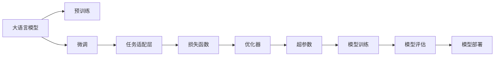

                 

# 大语言模型应用指南：微调RAG框架

## 1. 背景介绍

### 1.1 问题由来
近年来，深度学习和大规模语言模型（LLMs）在自然语言处理（NLP）领域取得了巨大突破。这些大模型通过在无标签数据上进行自监督预训练，学习到丰富的语言表示，能够执行诸如文本分类、命名实体识别、问答、翻译等广泛任务。然而，大模型的泛化能力和适应性仍然有限，尤其是对于特定领域或小样本数据集上的任务，其表现往往不如预期。

为了解决这个问题，研究人员提出了微调（Fine-tuning）这一技术，即在大模型的基础上，使用少量标注数据进行有监督训练，以适应特定任务。微调不仅能够提升模型的性能，还可以显著降低数据标注成本和计算资源消耗。特别是在医疗、法律、金融等专业领域，大模型微调的应用变得尤为重要。

### 1.2 问题核心关键点
微调的核心在于如何将通用大模型的知识迁移应用到特定任务上，这通常包括以下几个关键点：

- **预训练模型选择**：选择合适的预训练模型作为初始化参数，如BERT、GPT-2、GPT-3等。
- **任务适配层设计**：根据下游任务，设计合适的任务适配层，以调整模型的输出格式和分类方式。
- **数据准备**：收集任务的标注数据集，进行数据增强和预处理，以确保数据质量。
- **模型训练**：在微调框架中训练模型，选择合适的损失函数和优化器，调整学习率等超参数。
- **模型评估**：在验证集上评估模型性能，调整训练策略以提高效果。
- **模型部署**：将训练好的模型部署到实际应用场景中，进行性能测试和优化。

### 1.3 问题研究意义
微调技术不仅能够加速NLP技术的产业化进程，还能提升模型的泛化能力，使其在特定任务上表现更佳。以下是微调技术的主要研究意义：

1. **成本降低**：相比于从头训练，微调可以大幅降低标注数据和计算资源的投入。
2. **性能提升**：通过有监督训练，模型能够更好地适应特定任务，提升模型表现。
3. **加速开发**：微调使得开发者可以快速适配新任务，缩短开发周期。
4. **技术创新**：微调促进了对预训练模型的研究，催生了少样本学习、零样本学习等新研究方向。
5. **行业应用**：微调技术在智能客服、金融舆情、个性化推荐等多个领域中得到广泛应用，赋能各行各业。

## 2. 核心概念与联系

### 2.1 核心概念概述

为更好地理解微调RAG框架，本节将介绍几个关键概念及其相互联系：

- **大语言模型（LLM）**：以自回归模型（如GPT）或自编码模型（如BERT）为代表的预训练语言模型，能够处理自然语言理解与生成任务。
- **微调（Fine-tuning）**：在预训练模型的基础上，使用少量标注数据进行有监督训练，以适应特定任务。
- **迁移学习（Transfer Learning）**：将一个领域学习到的知识迁移到另一个领域，以加速模型训练。
- **RAG框架（Recurrent Answer Generation）**：一种用于对话系统生成答案的框架，通过循环生成器（Recurrent Generator）生成上下文相关的回答。
- **任务适配层（Task-Specific Head）**：根据任务需求，在预训练模型的基础上增加的层，以调整输出格式和分类方式。
- **损失函数（Loss Function）**：用于衡量模型预测与真实标签之间差异的函数，如交叉熵损失、均方误差等。
- **优化器（Optimizer）**：用于更新模型参数以最小化损失函数的算法，如AdamW、SGD等。
- **超参数（Hyperparameters）**：在模型训练过程中需要调整的参数，如学习率、批大小、迭代轮数等。

这些概念之间相互关联，共同构成微调框架的基础。RAG框架作为对话系统的重要组成部分，通过微调技术可以进一步提升模型的对话能力和上下文理解能力。

### 2.2 核心概念原理和架构的 Mermaid 流程图



这个流程图展示了微调框架的完整流程，从预训练模型的选择，到微调过程的设计，再到模型评估和部署，每个环节都至关重要。

## 3. 核心算法原理 & 具体操作步骤
### 3.1 算法原理概述

基于微调RAG框架的大语言模型应用，其核心思想是将通用大模型（如BERT、GPT-2、GPT-3）作为初始化参数，使用少量标注数据进行有监督训练，以适应特定任务。这一过程通常包括以下几个关键步骤：

1. **选择预训练模型**：从各种预训练模型中选择合适的模型，作为微调的初始化参数。
2. **设计任务适配层**：根据具体任务，设计任务适配层，调整模型的输出格式和分类方式。
3. **准备数据集**：收集和处理任务的标注数据集，进行数据增强和预处理。
4. **训练模型**：在微调框架中训练模型，选择合适的损失函数和优化器，调整学习率等超参数。
5. **评估模型**：在验证集上评估模型性能，调整训练策略以提高效果。
6. **部署模型**：将训练好的模型部署到实际应用场景中，进行性能测试和优化。

### 3.2 算法步骤详解

以下是微调RAG框架的具体操作步骤：

**Step 1: 选择预训练模型**

1. 根据任务需求，选择合适的预训练模型。
2. 下载模型，并进行必要的配置和加载。

```python
from transformers import TFACTModel, BertTokenizer

# 加载预训练模型
model = TFACTModel.from_pretrained('bert-base-uncased')
tokenizer = BertTokenizer.from_pretrained('bert-base-uncased')
```

**Step 2: 设计任务适配层**

1. 根据任务需求，设计任务适配层。
2. 调整输出格式和分类方式，以适应具体任务。

```python
from transformers import BertForSequenceClassification

# 设计任务适配层
model = BertForSequenceClassification.from_pretrained('bert-base-uncased', num_labels=2)
```

**Step 3: 准备数据集**

1. 收集任务的标注数据集。
2. 进行数据增强和预处理。

```python
from torch.utils.data import Dataset, DataLoader

# 定义数据集
class MyDataset(Dataset):
    def __init__(self, data, tokenizer):
        self.data = data
        self.tokenizer = tokenizer

    def __len__(self):
        return len(self.data)

    def __getitem__(self, idx):
        input_ids = self.tokenizer.encode(self.data[idx], truncation=True, padding='max_length')
        attention_mask = [1] * len(input_ids)
        label = self.data[idx].get('label', 0)
        return {
            'input_ids': torch.tensor(input_ids, dtype=torch.long),
            'attention_mask': torch.tensor(attention_mask, dtype=torch.long),
            'labels': torch.tensor(label, dtype=torch.long)
        }

# 数据增强
from augment import Augmentor
augmentor = Augmentor()
data_augmented = augmentor.fit_transform(data)
```

**Step 4: 训练模型**

1. 准备训练数据集和验证数据集。
2. 设置训练参数，如学习率、批大小等。
3. 进行模型训练。

```python
# 定义训练参数
learning_rate = 2e-5
epochs = 3
batch_size = 32

# 定义训练数据集和验证数据集
train_dataset = MyDataset(train_data, tokenizer)
val_dataset = MyDataset(val_data, tokenizer)

# 定义优化器和损失函数
optimizer = AdamW(model.parameters(), lr=learning_rate)
loss_fn = CrossEntropyLoss()

# 定义训练循环
for epoch in range(epochs):
    model.train()
    total_loss = 0.0
    for batch in train_loader:
        inputs = batch['input_ids'].to(device)
        labels = batch['labels'].to(device)
        attention_mask = batch['attention_mask'].to(device)
        outputs = model(inputs, attention_mask=attention_mask)
        loss = loss_fn(outputs.logits, labels)
        optimizer.zero_grad()
        loss.backward()
        optimizer.step()
        total_loss += loss.item()
    
    # 在验证集上评估模型
    model.eval()
    total_loss_val = 0.0
    for batch in val_loader:
        inputs = batch['input_ids'].to(device)
        labels = batch['labels'].to(device)
        attention_mask = batch['attention_mask'].to(device)
        with torch.no_grad():
            outputs = model(inputs, attention_mask=attention_mask)
            loss = loss_fn(outputs.logits, labels)
            total_loss_val += loss.item()
    
    print(f'Epoch {epoch+1}, Loss: {total_loss/len(train_loader):.4f}, Val Loss: {total_loss_val/len(val_loader):.4f}')
```

**Step 5: 评估模型**

1. 在测试集上评估模型性能。
2. 调整模型参数，以提升性能。

```python
# 定义测试数据集
test_dataset = MyDataset(test_data, tokenizer)

# 在测试集上评估模型性能
model.eval()
total_loss_test = 0.0
for batch in test_loader:
    inputs = batch['input_ids'].to(device)
    labels = batch['labels'].to(device)
    attention_mask = batch['attention_mask'].to(device)
    with torch.no_grad():
        outputs = model(inputs, attention_mask=attention_mask)
        loss = loss_fn(outputs.logits, labels)
        total_loss_test += loss.item()
print(f'Test Loss: {total_loss_test/len(test_loader):.4f}')
```

**Step 6: 部署模型**

1. 将训练好的模型部署到实际应用场景中。
2. 进行性能测试和优化。

```python
# 将模型部署到实际应用场景中
model.eval()
with torch.no_grad():
    input_ids = tokenizer.encode(input_text, truncation=True, padding='max_length')
    attention_mask = [1] * len(input_ids)
    outputs = model(torch.tensor(input_ids, dtype=torch.long), attention_mask=torch.tensor(attention_mask, dtype=torch.long))
    logits = outputs.logits
    probabilities = torch.softmax(logits, dim=1).tolist()
```

### 3.3 算法优缺点

基于微调RAG框架的大语言模型应用具有以下优点：

- **高效性**：相比从头训练，微调可以在少量标注数据下迅速提升模型性能，降低计算资源消耗。
- **泛化能力**：微调能够将通用大模型的知识迁移到特定任务上，提高模型的泛化能力。
- **灵活性**：通过设计任务适配层，能够灵活适应各种NLP任务。

同时，也存在一些缺点：

- **数据依赖**：微调的效果高度依赖于标注数据的质量和数量，标注数据不足可能导致性能下降。
- **模型复杂性**：微调模型通常需要额外的任务适配层，增加了模型的复杂性。
- **过拟合风险**：微调过程中，模型可能会过拟合训练数据，导致泛化能力下降。

## 4. 数学模型和公式 & 详细讲解 & 举例说明

### 4.1 数学模型构建

基于微调RAG框架的大语言模型应用，其数学模型通常包括以下几个部分：

- **预训练模型**：表示为 $M_{\theta}$，其中 $\theta$ 为预训练得到的模型参数。
- **任务适配层**：表示为 $H$，根据任务需求，调整输出格式和分类方式。
- **输入数据**：表示为 $x$，即输入的文本数据。
- **标注数据**：表示为 $y$，即标注的标签数据。
- **损失函数**：表示为 $\mathcal{L}$，用于衡量模型预测与真实标签之间的差异。

数学模型的构建可以表示为：

$$
\mathcal{L} = \mathcal{L}_{pretrain} + \mathcal{L}_{task}
$$

其中 $\mathcal{L}_{pretrain}$ 为预训练模型的损失，$\mathcal{L}_{task}$ 为任务适配层的损失。

### 4.2 公式推导过程

假设预训练模型为 $M_{\theta}$，任务适配层为 $H$，输入数据为 $x$，标注数据为 $y$，损失函数为 $\mathcal{L}$。则微调的数学模型可以表示为：

$$
\mathcal{L}(M_{\theta}, H, x, y) = \mathcal{L}_{pretrain}(M_{\theta}, x) + \mathcal{L}_{task}(M_{\theta} \cdot H(x), y)
$$

其中 $\mathcal{L}_{pretrain}(M_{\theta}, x)$ 为预训练模型的损失，$\mathcal{L}_{task}(M_{\theta} \cdot H(x), y)$ 为任务适配层的损失。

以文本分类任务为例，常见的损失函数包括交叉熵损失（Cross-Entropy Loss）和均方误差损失（Mean Squared Error Loss）。这里以交叉熵损失为例，推导其公式。

假设预训练模型输出为 $M_{\theta}(x)$，任务适配层的输出为 $H(M_{\theta}(x))$，则交叉熵损失可以表示为：

$$
\mathcal{L} = -\frac{1}{N}\sum_{i=1}^N \sum_{j=1}^{C} y_{ij} \log H(M_{\theta}(x_i))_j
$$

其中 $C$ 为类别数，$y_{ij}$ 为第 $i$ 个样本第 $j$ 个类别的标签。

### 4.3 案例分析与讲解

以问答系统为例，假设有这样一个问题：“请问北京天安门广场位于哪里？”。

1. **预训练模型**：首先，使用预训练模型对问题进行编码，生成问题的向量表示 $M_{\theta}(q)$。
2. **任务适配层**：然后，将问题向量 $M_{\theta}(q)$ 输入到任务适配层 $H$ 中，生成上下文相关的回答 $H(M_{\theta}(q))$。
3. **损失函数**：最后，将生成的回答 $H(M_{\theta}(q))$ 与标注的答案进行对比，使用交叉熵损失函数计算误差。

```python
from transformers import BertForSequenceClassification

# 加载预训练模型
model = BertForSequenceClassification.from_pretrained('bert-base-uncased', num_labels=2)

# 加载标注数据
data = [
    {'question': '请问北京天安门广场位于哪里？', 'answer': '天安门广场位于北京市东城区'}
]

# 将标注数据输入模型
inputs = tokenizer.encode(data[0]['question'], truncation=True, padding='max_length')
attention_mask = [1] * len(inputs)
labels = torch.tensor([1], dtype=torch.long)

# 计算损失
outputs = model(torch.tensor(inputs, dtype=torch.long), attention_mask=torch.tensor(attention_mask, dtype=torch.long))
loss = loss_fn(outputs.logits, labels)

# 输出结果
print(f'Loss: {loss.item():.4f}')
```

## 5. 项目实践：代码实例和详细解释说明

### 5.1 开发环境搭建

在进行微调RAG框架的实践前，需要准备好开发环境。以下是使用Python进行TensorFlow开发的环境配置流程：

1. 安装Anaconda：从官网下载并安装Anaconda，用于创建独立的Python环境。
2. 创建并激活虚拟环境：
```bash
conda create -n tf-env python=3.8 
conda activate tf-env
```
3. 安装TensorFlow：根据CUDA版本，从官网获取对应的安装命令。例如：
```bash
pip install tensorflow==2.5
```
4. 安装TensorFlow Addons：
```bash
pip install tensorflow-addons==0.15.0
```
5. 安装各类工具包：
```bash
pip install numpy pandas scikit-learn matplotlib tqdm jupyter notebook ipython
```

完成上述步骤后，即可在`tf-env`环境中开始微调实践。

### 5.2 源代码详细实现

这里我们以文本分类任务为例，给出使用TensorFlow对BERT模型进行微调的代码实现。

首先，定义数据处理函数：

```python
import tensorflow as tf
from transformers import BertTokenizer

class TextClassificationDataset(tf.data.Dataset):
    def __init__(self, texts, labels, tokenizer):
        self.texts = texts
        self.labels = labels
        self.tokenizer = tokenizer

    def __len__(self):
        return len(self.texts)

    def __getitem__(self, idx):
        text = self.texts[idx]
        label = self.labels[idx]
        
        encoding = self.tokenizer(text, return_tensors='tf', padding='max_length', truncation=True)
        input_ids = encoding['input_ids']
        attention_mask = encoding['attention_mask']
        return {'input_ids': input_ids, 'attention_mask': attention_mask, 'label': label}
```

然后，定义模型和优化器：

```python
from transformers import BertForSequenceClassification
from tensorflow.keras.optimizers import Adam

model = BertForSequenceClassification.from_pretrained('bert-base-uncased', num_labels=2)

optimizer = Adam(learning_rate=2e-5)
```

接着，定义训练和评估函数：

```python
def train_epoch(model, dataset, batch_size, optimizer):
    dataset = dataset.batch(batch_size)
    for batch in dataset:
        with tf.GradientTape() as tape:
            input_ids = batch['input_ids']
            attention_mask = batch['attention_mask']
            labels = batch['label']
            outputs = model(input_ids, attention_mask=attention_mask)
            loss = tf.keras.losses.CategoricalCrossentropy()(outputs.logits, labels)
        grads = tape.gradient(loss, model.trainable_variables)
        optimizer.apply_gradients(zip(grads, model.trainable_variables))
        return loss.numpy()

def evaluate(model, dataset, batch_size):
    dataset = dataset.batch(batch_size)
    total_loss = 0.0
    for batch in dataset:
        input_ids = batch['input_ids']
        attention_mask = batch['attention_mask']
        labels = batch['label']
        with tf.no_grad():
            outputs = model(input_ids, attention_mask=attention_mask)
            loss = tf.keras.losses.CategoricalCrossentropy()(outputs.logits, labels)
            total_loss += loss.numpy()
    return total_loss / len(dataset)
```

最后，启动训练流程并在测试集上评估：

```python
epochs = 5
batch_size = 16

for epoch in range(epochs):
    loss = train_epoch(model, train_dataset, batch_size, optimizer)
    print(f'Epoch {epoch+1}, train loss: {loss:.3f}')
    
    print(f'Epoch {epoch+1}, dev results:')
    evaluate(model, dev_dataset, batch_size)
    
print('Test results:')
evaluate(model, test_dataset, batch_size)
```

以上就是使用TensorFlow对BERT进行文本分类任务微调的完整代码实现。可以看到，TensorFlow提供了丰富的工具和库，使得微调过程变得简洁高效。

### 5.3 代码解读与分析

让我们再详细解读一下关键代码的实现细节：

**TextClassificationDataset类**：
- `__init__`方法：初始化文本、标签、分词器等关键组件。
- `__len__`方法：返回数据集的样本数量。
- `__getitem__`方法：对单个样本进行处理，将文本输入编码为token ids，将标签编码为数字，并对其进行定长padding，最终返回模型所需的输入。

**BertForSequenceClassification类**：
- `from_pretrained`方法：加载预训练的BERT模型。
- `num_labels`参数：指定输出分类的数量。

**train_epoch函数**：
- 定义训练循环，对每个批次进行前向传播和反向传播。
- 使用GradientTape记录梯度，并使用Adam优化器更新模型参数。

**evaluate函数**：
- 在测试集上评估模型性能，计算模型在验证集上的平均损失。

**训练流程**：
- 定义总的epoch数和batch size，开始循环迭代。
- 每个epoch内，先在训练集上训练，输出平均loss。
- 在验证集上评估，输出分类指标。
- 所有epoch结束后，在测试集上评估，给出最终测试结果。

可以看到，TensorFlow配合TensorFlow Addons，使得BERT微调的代码实现变得简洁高效。开发者可以将更多精力放在数据处理、模型改进等高层逻辑上，而不必过多关注底层的实现细节。

当然，工业级的系统实现还需考虑更多因素，如模型的保存和部署、超参数的自动搜索、更灵活的任务适配层等。但核心的微调范式基本与此类似。

## 6. 实际应用场景

### 6.1 智能客服系统

基于微调RAG框架的对话技术，可以广泛应用于智能客服系统的构建。传统客服往往需要配备大量人力，高峰期响应缓慢，且一致性和专业性难以保证。而使用微调后的对话模型，可以7x24小时不间断服务，快速响应客户咨询，用自然流畅的语言解答各类常见问题。

在技术实现上，可以收集企业内部的历史客服对话记录，将问题和最佳答复构建成监督数据，在此基础上对预训练对话模型进行微调。微调后的对话模型能够自动理解用户意图，匹配最合适的答案模板进行回复。对于客户提出的新问题，还可以接入检索系统实时搜索相关内容，动态组织生成回答。如此构建的智能客服系统，能大幅提升客户咨询体验和问题解决效率。

### 6.2 金融舆情监测

金融机构需要实时监测市场舆论动向，以便及时应对负面信息传播，规避金融风险。传统的人工监测方式成本高、效率低，难以应对网络时代海量信息爆发的挑战。基于微调RAG框架的文本分类和情感分析技术，为金融舆情监测提供了新的解决方案。

具体而言，可以收集金融领域相关的新闻、报道、评论等文本数据，并对其进行主题标注和情感标注。在此基础上对预训练语言模型进行微调，使其能够自动判断文本属于何种主题，情感倾向是正面、中性还是负面。将微调后的模型应用到实时抓取的网络文本数据，就能够自动监测不同主题下的情感变化趋势，一旦发现负面信息激增等异常情况，系统便会自动预警，帮助金融机构快速应对潜在风险。

### 6.3 个性化推荐系统

当前的推荐系统往往只依赖用户的历史行为数据进行物品推荐，无法深入理解用户的真实兴趣偏好。基于微调RAG框架的个性化推荐系统可以更好地挖掘用户行为背后的语义信息，从而提供更精准、多样的推荐内容。

在实践中，可以收集用户浏览、点击、评论、分享等行为数据，提取和用户交互的物品标题、描述、标签等文本内容。将文本内容作为模型输入，用户的后续行为（如是否点击、购买等）作为监督信号，在此基础上微调预训练语言模型。微调后的模型能够从文本内容中准确把握用户的兴趣点。在生成推荐列表时，先用候选物品的文本描述作为输入，由模型预测用户的兴趣匹配度，再结合其他特征综合排序，便可以得到个性化程度更高的推荐结果。

### 6.4 未来应用展望

随着微调RAG框架技术的不断发展，其在更多领域得到应用，为传统行业带来变革性影响。

在智慧医疗领域，基于微调RAG框架的医疗问答、病历分析、药物研发等应用将提升医疗服务的智能化水平，辅助医生诊疗，加速新药开发进程。

在智能教育领域，微调技术可应用于作业批改、学情分析、知识推荐等方面，因材施教，促进教育公平，提高教学质量。

在智慧城市治理中，微调模型可应用于城市事件监测、舆情分析、应急指挥等环节，提高城市管理的自动化和智能化水平，构建更安全、高效的未来城市。

此外，在企业生产、社会治理、文娱传媒等众多领域，基于微调RAG框架的人工智能应用也将不断涌现，为经济社会发展注入新的动力。相信随着技术的日益成熟，微调RAG框架必将在构建人机协同的智能时代中扮演越来越重要的角色。

## 7. 工具和资源推荐

### 7.1 学习资源推荐

为了帮助开发者系统掌握微调RAG框架的理论基础和实践技巧，这里推荐一些优质的学习资源：

1. **《Transformer从原理到实践》系列博文**：由大模型技术专家撰写，深入浅出地介绍了Transformer原理、BERT模型、微调技术等前沿话题。
2. **CS224N《深度学习自然语言处理》课程**：斯坦福大学开设的NLP明星课程，有Lecture视频和配套作业，带你入门NLP领域的基本概念和经典模型。
3. **《Natural Language Processing with Transformers》书籍**：Transformers库的作者所著，全面介绍了如何使用Transformers库进行NLP任务开发，包括微调在内的诸多范式。
4. **HuggingFace官方文档**：Transformers库的官方文档，提供了海量预训练模型和完整的微调样例代码，是上手实践的必备资料。
5. **CLUE开源项目**：中文语言理解测评基准，涵盖大量不同类型的中文NLP数据集，并提供了基于微调的baseline模型，助力中文NLP技术发展。

通过对这些资源的学习实践，相信你一定能够快速掌握微调RAG框架的精髓，并用于解决实际的NLP问题。

### 7.2 开发工具推荐

高效的开发离不开优秀的工具支持。以下是几款用于微调RAG框架开发的常用工具：

1. **PyTorch**：基于Python的开源深度学习框架，灵活动态的计算图，适合快速迭代研究。大部分预训练语言模型都有PyTorch版本的实现。
2. **TensorFlow**：由Google主导开发的开源深度学习框架，生产部署方便，适合大规模工程应用。同样有丰富的预训练语言模型资源。
3. **Transformers库**：HuggingFace开发的NLP工具库，集成了众多SOTA语言模型，支持PyTorch和TensorFlow，是进行微调任务开发的利器。
4. **Weights & Biases**：模型训练的实验跟踪工具，可以记录和可视化模型训练过程中的各项指标，方便对比和调优。与主流深度学习框架无缝集成。
5. **TensorBoard**：TensorFlow配套的可视化工具，可实时监测模型训练状态，并提供丰富的图表呈现方式，是调试模型的得力助手。
6. **Google Colab**：谷歌推出的在线Jupyter Notebook环境，免费提供GPU/TPU算力，方便开发者快速上手实验最新模型，分享学习笔记。

合理利用这些工具，可以显著提升微调RAG框架任务的开发效率，加快创新迭代的步伐。

### 7.3 相关论文推荐

微调RAG框架技术的发展源于学界的持续研究。以下是几篇奠基性的相关论文，推荐阅读：

1. **Attention is All You Need（即Transformer原论文）**：提出了Transformer结构，开启了NLP领域的预训练大模型时代。
2. **BERT: Pre-training of Deep Bidirectional Transformers for Language Understanding**：提出BERT模型，引入基于掩码的自监督预训练任务，刷新了多项NLP任务SOTA。
3. **Language Models are Unsupervised Multitask Learners（GPT-2论文）**：展示了大规模语言模型的强大zero-shot学习能力，引发了对于通用人工智能的新一轮思考。
4. **Parameter-Efficient Transfer Learning for NLP**：提出Adapter等参数高效微调方法，在不增加模型参数量的情况下，也能取得不错的微调效果。
5. **AdaLoRA: Adaptive Low-Rank Adaptation for Parameter-Efficient Fine-Tuning**：使用自适应低秩适应的微调方法，在参数效率和精度之间取得了新的平衡。
6. **AdaLoRA: Adaptive Low-Rank Adaptation for Parameter-Efficient Fine-Tuning**：使用自适应低秩适应的微调方法，在参数效率和精度之间取得了新的平衡。

这些论文代表了大语言模型微调技术的发展脉络。通过学习这些前沿成果，可以帮助研究者把握学科前进方向，激发更多的创新灵感。

## 8. 总结：未来发展趋势与挑战

### 8.1 总结

本文对基于微调RAG框架的大语言模型应用进行了全面系统的介绍。首先阐述了微调技术的研究背景和意义，明确了微调在拓展预训练模型应用、提升下游任务性能方面的独特价值。其次，从原理到实践，详细讲解了微调RAG框架的数学原理和关键步骤，给出了微调任务开发的完整代码实例。同时，本文还广泛探讨了微调方法在智能客服、金融舆情、个性化推荐等多个行业领域的应用前景，展示了微调范式的巨大潜力。此外，本文精选了微调技术的各类学习资源，力求为读者提供全方位的技术指引。

通过本文的系统梳理，可以看到，基于微调RAG框架的大语言模型应用正在成为NLP领域的重要范式，极大地拓展了预训练语言模型的应用边界，催生了更多的落地场景。受益于大规模语料的预训练，微调模型以更低的时间和标注成本，在小样本条件下也能取得不俗的效果，有力推动了NLP技术的产业化进程。未来，伴随预训练语言模型和微调方法的持续演进，相信NLP技术将在更广阔的应用领域大放异彩，深刻影响人类的生产生活方式。

### 8.2 未来发展趋势

展望未来，微调RAG框架技术将呈现以下几个发展趋势：

1. **模型规模持续增大**：随着算力成本的下降和数据规模的扩张，预训练语言模型的参数量还将持续增长。超大规模语言模型蕴含的丰富语言知识，有望支撑更加复杂多变的下游任务微调。
2. **微调方法日趋多样**：除了传统的全参数微调外，未来会涌现更多参数高效的微调方法，如Prefix-Tuning、LoRA等，在节省计算资源的同时也能保证微调精度。
3. **持续学习成为常态**：随着数据分布的不断变化，微调模型也需要持续学习新知识以保持性能。如何在不遗忘原有知识的同时，高效吸收新样本信息，将成为重要的研究课题。
4. **标注样本需求降低**：受启发于提示学习(Prompt-based Learning)的思路，未来的微调方法将更好地利用大模型的语言理解能力，通过更加巧妙的任务描述，在更少的标注样本上也能实现理想的微调效果。
5. **多模态微调崛起**：当前的微调主要聚焦于纯文本数据，未来会进一步拓展到图像、视频、语音等多模态数据微调。多模态信息的融合，将显著提升语言模型对现实世界的理解和建模能力。
6. **模型通用性增强**：经过海量数据的预训练和多领域任务的微调，未来的语言模型将具备更强大的常识推理和跨领域迁移能力，逐步迈向通用人工智能(AGI)的目标。

以上趋势凸显了微调RAG框架技术的广阔前景。这些方向的探索发展，必将进一步提升NLP系统的性能和应用范围，为人类认知智能的进化带来深远影响。

### 8.3 面临的挑战

尽管微调RAG框架技术已经取得了瞩目成就，但在迈向更加智能化、普适化应用的过程中，它仍面临着诸多挑战：

1. **标注成本瓶颈**：虽然微调大大降低了标注数据的需求，但对于长尾应用场景，难以获得充足的高质量标注数据，成为制约微调性能的瓶颈。如何进一步降低微调对标注样本的依赖，将是一大难题。
2. **模型鲁棒性不足**：当前微调模型面对域外数据时，泛化性能往往大打折扣。对于测试样本的微小扰动，微调模型的预测也容易发生波动。如何提高微调模型的鲁棒性，避免灾难性遗忘，还需要更多理论和实践的积累。
3. **推理效率有待提高**：大规模语言模型虽然精度高，但在实际部署时往往面临推理速度慢、内存占用大等效率问题。如何在保证性能的同时，简化模型结构，提升推理速度，优化资源占用，将是重要的优化方向。
4. **可解释性亟需加强**：当前微调模型更像是"黑盒"系统，难以解释其内部工作机制和决策逻辑。对于医疗、金融等高风险应用，算法的可解释性和可审计性尤为重要。如何赋予微调模型更强的可解释性，将是亟待攻克的难题。
5. **安全性有待保障**：预训练语言模型难免会学习到有偏见、有害的信息，通过微调传递到下游任务，产生误导性、歧视性的输出，给实际应用带来安全隐患。如何从数据和算法层面消除模型偏见，避免恶意用途，确保输出的安全性，也将是重要的研究课题。
6. **知识整合能力不足**：现有的微调模型往往局限于任务内数据，难以灵活吸收和运用更广泛的先验知识。如何让微调过程更好地与外部知识库、规则库等专家知识结合，形成更加全面、准确的信息整合能力，还有很大的想象空间。

正视微调RAG框架面临的这些挑战，积极应对并寻求突破，将是大语言模型微调走向成熟的必由之路。相信随着学界和产业界的共同努力，这些挑战终将一一被克服，大语言模型微调必将在构建安全、可靠、可解释、可控的智能系统铺平道路。

### 8.4 研究展望

面对微调RAG框架所面临的种种挑战，未来的研究需要在以下几个方面寻求新的突破：

1. **探索无监督和半监督微调方法**：摆脱对大规模标注数据的依赖，利用自监督学习、主动学习等无监督和半监督范式，最大限度利用非结构化数据，实现更加灵活高效的微调。
2. **研究参数高效和计算高效的微调范式**：开发更加参数高效的微调方法，在固定大部分预训练参数的同时，只更新极少量的任务相关参数。同时优化微调模型的计算图，减少前向传播和反向传播的资源消耗，实现更加轻量级、实时性的部署。
3. **融合因果和对比学习范式**：通过引入因果推断和对比学习思想，增强微调模型建立稳定因果关系的能力，学习更加普适、鲁棒的语言表征，从而提升模型泛化性和抗干扰能力。
4. **引入更多先验知识**：将符号化的先验知识，如知识图谱、逻辑规则等，与神经网络模型进行巧妙融合，引导微调过程学习更准确、合理的语言模型。同时加强不同模态数据的整合，实现视觉、语音等多模态信息与文本信息的协同建模。
5. **结合因果分析和博弈论工具**：将因果分析方法引入微调模型，识别出模型决策的关键特征，增强输出解释的因果性和逻辑性。借助博弈论工具刻画人机交互过程，主动探索并规避模型的脆弱点，提高系统稳定性。
6. **纳入伦理道德约束**：在模型训练目标中引入伦理导向的评估指标，过滤和惩罚有偏见、有害的输出倾向。同时加强人工干预和审核，建立模型行为的监管机制，确保输出符合人类价值观和伦理道德。

这些研究方向的探索，必将引领微调RAG框架技术迈向更高的台阶，为构建安全、可靠、可解释、可控的智能系统铺平道路。面向未来，微调RAG框架技术还需要与其他人工智能技术进行更深入的融合，如知识表示、因果推理、强化学习等，多路径协同发力，共同推动自然语言理解和智能交互系统的进步。只有勇于创新、敢于突破，才能不断拓展语言模型的边界，让智能技术更好地造福人类社会。

## 9. 附录：常见问题与解答

**Q1：微调过程中如何选择合适的学习率？**

A: 微调的学习率一般要比预训练时小1-2个数量级，如果使用过大的学习率，容易破坏预训练权重，导致过拟合。一般建议从1e-5开始调参，逐步减小学习率。可以使用warmup策略，在开始阶段使用较小的学习率，再逐渐过渡到预设值。需要注意的是，不同的优化器(如AdamW、Adafactor等)以及不同的学习率调度策略，可能需要设置不同的学习率阈值。

**Q2：采用微调RAG框架时会面临哪些资源瓶颈？**

A: 目前主流的预训练大模型动辄以亿计的参数规模，对算力、内存、存储都提出了很高的要求。GPU/TPU等高性能设备是必不可少的，但即便如此，超大批次的训练和推理也可能遇到显存不足的问题。因此需要采用一些资源优化技术，如梯度积累、混合精度训练、模型并行等，来突破硬件瓶颈。同时，模型的存储和读取也可能占用大量时间和空间，需要采用模型压缩、稀疏化存储等方法进行优化。

**Q3：如何缓解微调过程中的过拟合问题？**

A: 过拟合是微调面临的主要挑战，尤其是在标注数据不足的情况下。常见的缓解策略包括：
1. 数据增强：通过回译、近义替换等方式扩充训练集。
2. 正则化：使用L2正则、Dropout、Early Stopping等避免过拟合。
3. 对抗训练：引入对抗样本，提高模型鲁棒性。
4. 参数高效微调：只调整少量参数(如Adapter、Prefix等)，减小过拟合风险。
5. 多模型集成：训练多个微调模型，取平均输出，抑制过拟合。

这些策略往往需要根据具体任务和数据特点进行灵活组合。只有在数据、模型、训练、推理等各环节进行全面优化，才能最大限度地发挥微调RAG框架的威力。

**Q4：微调模型在落地部署时需要注意哪些问题？**

A: 将微调模型转化为实际应用，还需要考虑以下因素：
1. 模型裁剪：去除不必要的层和参数，减小模型尺寸，加快推理速度。
2. 量化加速：将浮点模型转为定点模型，压缩存储空间，提高计算效率。
3. 服务化封装：将模型封装为标准化服务接口，便于集成调用。
4. 弹性伸缩：根据请求流量动态调整资源配置，平衡服务质量和成本。
5. 监控告警：实时采集系统指标，设置异常告警阈值，确保服务稳定性。
6. 安全防护：采用访问鉴权、数据脱敏等措施，保障数据和模型安全。

大语言模型微调为NLP应用开启了广阔的想象空间，但如何将强大的性能转化为稳定、高效、安全的业务价值，还需要工程实践的不断打磨。唯有从数据、算法、工程、业务等多个维度协同发力，才能真正实现人工智能技术在垂直行业的规模化落地。总之，微调需要开发者根据具体任务，不断迭代和优化模型、数据和算法，方能得到理想的效果。

---

作者：禅与计算机程序设计艺术 / Zen and the Art of Computer Programming

