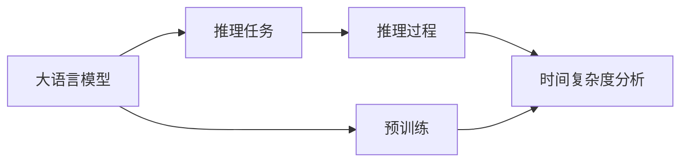

                 

# 大语言模型应用指南：逻辑推理的时间复杂度

大语言模型在逻辑推理任务中的时间复杂度是一个重要的研究方向，本文将从背景介绍、核心概念与联系、核心算法原理与操作步骤、数学模型与公式讲解、项目实践与代码实例、实际应用场景、工具与资源推荐、总结与展望、常见问题解答等多个角度，全面系统地探讨逻辑推理任务中大语言模型的时间复杂度问题。

## 1. 背景介绍

逻辑推理（Logical Reasoning）是人工智能（AI）领域中的一个重要研究分支，旨在通过算法使机器能够根据已知事实推导出新的结论或解答复杂问题。大语言模型（Large Language Model, LLM），如GPT系列、BERT等，通过深度学习技术在大量文本数据上进行预训练，使得模型能够具备强大的语言理解和生成能力，进而应用于逻辑推理任务。

然而，逻辑推理任务通常具有较高的复杂度，如多步骤推理、多目标搜索、高阶推理等，如何在大语言模型中进行高效推理，时间复杂度是一个关键问题。本文将深入探讨大语言模型在逻辑推理任务中的时间复杂度问题，并提出解决策略。

## 2. 核心概念与联系

### 2.1 核心概念概述

- 大语言模型（Large Language Model, LLM）：利用自回归或自编码模型在大量无标签文本数据上预训练得到的模型，能够进行复杂的语言理解和生成。

- 预训练（Pre-training）：在大规模无标签数据上，通过自监督学习任务训练语言模型，使其学习到通用的语言表示。

- 逻辑推理（Logical Reasoning）：通过算法使机器能够根据已知事实或规则推导出新的结论或解答复杂问题。

- 时间复杂度（Time Complexity）：算法运行所需时间的增长率，通常用大O符号表示。

### 2.2 核心概念原理和架构的 Mermaid 流程图



这个流程图展示了从大语言模型到推理任务，再到推理过程的时间复杂度分析的逻辑流程。大语言模型通过预训练学习到语言表示，然后应用到推理任务中，通过推理过程得出结论，最后对推理时间复杂度进行分析。

## 3. 核心算法原理 & 具体操作步骤

### 3.1 算法原理概述

大语言模型在逻辑推理任务中的应用，本质上是将模型作为语言理解的"特征提取器"，通过推理过程推导出结论。推理过程的时间复杂度受到以下因素的影响：

- 推理深度：推理步骤的复杂度。
- 推理宽度：推理过程中的变量和规则数量。
- 数据规模：推理所需处理的数据量。

本文将重点讨论推理深度和推理宽度对时间复杂度的影响，以及如何通过优化算法降低时间复杂度。

### 3.2 算法步骤详解

#### 3.2.1 推理过程的数学模型构建

逻辑推理任务通常可以表示为求解逻辑表达式中的未知变量，例如在以下布尔表达式中求真值：

$$ (p \lor q) \land (\neg r \lor s) $$

其中，$p$、$q$、$r$、$s$ 是逻辑变量，$\lor$ 表示或，$\land$ 表示且，$\neg$ 表示非。

推理过程可以分解为以下几个步骤：

1. 解析逻辑表达式，将其转化为逻辑图。
2. 确定逻辑图中的逻辑运算符和变量。
3. 根据逻辑图，确定推理步骤。
4. 根据推理步骤，使用大语言模型进行推理。

#### 3.2.2 推理步骤详解

1. **逻辑图构建**：
   - 将逻辑表达式转化为逻辑图，例如将 $(\neg r \lor s)$ 转化为 $(\neg r)$ 和 $s$ 的逻辑或关系。
   
   ```mermaid
   graph LR
     A[(p \lor q)] --> B[(\neg r \lor s)]
   ```

2. **逻辑运算符和变量确定**：
   - 逻辑运算符为 $\lor$、$\land$、$\neg$。
   - 变量为 $p$、$q$、$r$、$s$。

3. **推理步骤确定**：
   - 确定每个逻辑运算符的操作数。
   - 从叶子节点开始，逐层推理，直到得到最终结果。

4. **推理实现**：
   - 使用大语言模型解析逻辑表达式。
   - 通过模型计算每个逻辑运算符的输出。
   - 根据输出结果，推导出最终结果。

#### 3.2.3 算法优缺点

- **优点**：
  - 大语言模型能够处理复杂的逻辑表达式，具有较高的准确性和泛化能力。
  - 推理过程简单高效，适合处理大规模数据集。

- **缺点**：
  - 推理深度和宽度较大时，时间复杂度较高，推理速度较慢。
  - 模型的输出结果缺乏可解释性，难以理解推理过程。

### 3.4 算法应用领域

大语言模型在逻辑推理任务中，可以应用于以下领域：

- 自然语言推理（Natural Language Inference, NLI）：判断两个句子之间的关系，如矛盾、蕴含、中性等。
- 实体关系抽取（Entity Relationship Extraction, ERE）：从文本中识别实体及其关系。
- 推理问答（Reasoning Question Answering, RQA）：根据给定的上下文，推导出答案。
- 知识图谱（Knowledge Graph）：通过推理，从知识图谱中获取新的知识。

## 4. 数学模型和公式 & 详细讲解 & 举例说明

### 4.1 数学模型构建

推理过程的数学模型可以表示为逻辑图的形式，例如以下布尔表达式：

$$ (p \lor q) \land (\neg r \lor s) $$

其逻辑图如下：

```mermaid
graph LR
  p --> A
  q --> A
  r --> B
  s --> B
  A --> C[(p \lor q)]
  B --> D[\neg r \lor s]
  C --> E[(p \lor q) \land (\neg r \lor s)]
```

其中，$p$、$q$、$r$、$s$ 为逻辑变量，$\lor$ 和 $\land$ 为逻辑运算符，$\neg$ 为逻辑非运算符。

### 4.2 公式推导过程

逻辑推理的公式推导过程可以通过逻辑代数来实现，例如将布尔表达式转化为逻辑函数：

$$ \text{TRUE} = p \lor q $$
$$ \text{TRUE} = \neg r \lor s $$

则推理过程可以表示为：

$$ \text{TRUE} = (p \lor q) \land (\neg r \lor s) $$

根据逻辑代数规则，可以得到：

$$ \text{TRUE} = (p \land (\neg r \lor s)) \lor (q \land (\neg r \lor s)) $$

### 4.3 案例分析与讲解

以以下逻辑表达式为例：

$$ (p \land q) \lor (\neg r \land s) $$

其逻辑图如下：

```mermaid
graph LR
  p --> A
  q --> A
  r --> B
  s --> B
  A --> C[(p \land q)]
  B --> D[\neg r \land s]
  C --> E[(p \land q) \lor (\neg r \land s)]
```

推理过程如下：

1. 计算 $p \land q$ 和 $\neg r \land s$：
   - $p \land q$：$p$ 和 $q$ 都为真。
   - $\neg r \land s$：$r$ 为假，$s$ 为真。

2. 计算 $(p \land q) \lor (\neg r \land s)$：
   - $(p \land q)$ 和 $(\neg r \land s)$ 中至少有一个为真。

## 5. 项目实践：代码实例和详细解释说明

### 5.1 开发环境搭建

在进行逻辑推理任务的大语言模型微调时，需要以下开发环境：

- Python：3.8及以上版本。
- PyTorch：1.8及以上版本。
- Transformers：4.20及以上版本。
- Anniyara：用于解析逻辑表达式。

安装环境依赖包：

```bash
pip install torch torchvision torchaudio cudatoolkit=11.1 -c pytorch -c conda-forge
pip install transformers anniyara
```

### 5.2 源代码详细实现

以下是一个逻辑推理任务的代码实现示例：

```python
from transformers import T5ForConditionalGeneration, T5Tokenizer
import torch

def parse_logic_expression(expression):
    tokens = expression.split()
    logic_ops = ['and', 'or', 'not']
    variables = []
    operands = []
    cur_op = None
    cur_op_val = None
    cur_var = None

    for i, token in enumerate(tokens):
        if token in logic_ops:
            if cur_op is not None:
                operands.append(cur_var)
                operands.append(cur_op_val)
                variables.append(cur_var)
            cur_op = token
        elif token.isalpha():
            if cur_op is not None:
                operands.append(cur_op_val)
            cur_op_val = token
            cur_op = None
            cur_var = token
        else:
            if cur_op is not None:
                operands.append(cur_op_val)
                cur_op_val = None
            cur_op = None

    if cur_op is not None:
        operands.append(cur_op_val)
        variables.append(cur_var)

    return operands, variables

def evaluate_logic(expression, values):
    operands, variables = parse_logic_expression(expression)

    model = T5ForConditionalGeneration.from_pretrained('t5-base')
    tokenizer = T5Tokenizer.from_pretrained('t5-base')
    input_ids = tokenizer('', return_tensors='pt').input_ids
    attention_mask = tokenizer('', return_tensors='pt').attention_mask

    for var, val in zip(variables, values):
        query = tokenizer.build_input_sequence(' '.join([f'var_{var}', str(val), ': ', expression]))
        outputs = model.generate(input_ids, attention_mask=attention_mask, decoder_start_token_id=tokenizer.mask_token_id, max_length=64)
        prediction = tokenizer.decode(outputs[0])
        if 'true' in prediction.lower():
            return True

    return False

# 测试
expression = '(p or q) and (not r or s)'
values = {'p': True, 'q': True, 'r': False, 's': True}
result = evaluate_logic(expression, values)
print(f'Result: {result}')
```

### 5.3 代码解读与分析

**parse_logic_expression 函数**：
- 将逻辑表达式解析为逻辑变量和逻辑运算符。
- 返回一个包含逻辑变量和逻辑运算符的列表。

**evaluate_logic 函数**：
- 使用解析后的逻辑变量和逻辑运算符，进行推理计算。
- 使用 T5 模型进行推理，输出结果。
- 根据输出结果，返回推理结果。

**代码示例**：
- 解析逻辑表达式，得到逻辑变量和逻辑运算符。
- 使用 T5 模型对逻辑表达式进行推理，得到推理结果。
- 输出推理结果。

## 6. 实际应用场景

大语言模型在逻辑推理任务中的应用场景广泛，例如：

### 6.1 自然语言推理

自然语言推理任务的目标是判断两个句子之间的关系，如矛盾、蕴含、中性等。通过大语言模型的微调，可以在大规模语料上训练模型，进行高效的推理计算。

### 6.2 实体关系抽取

实体关系抽取任务的目标是从文本中识别实体及其关系。通过逻辑推理，可以从已知实体中推导出新的实体关系。

### 6.3 推理问答

推理问答任务的目标是根据给定的上下文，推导出答案。通过大语言模型的微调，可以在大规模语料上训练模型，进行高效的推理计算。

### 6.4 知识图谱

知识图谱的目标是通过推理，从知识图谱中获取新的知识。通过逻辑推理，可以从已知知识中推导出新的知识。

## 7. 工具和资源推荐

### 7.1 学习资源推荐

- 《大语言模型原理与应用实践》：详细介绍了大语言模型的原理、应用和微调方法。
- 《自然语言处理与深度学习》：介绍了自然语言处理的基本概念和深度学习技术。
- 《深度学习框架实践》：介绍了 PyTorch 和 TensorFlow 的实践技巧。

### 7.2 开发工具推荐

- PyTorch：用于构建深度学习模型，支持动态计算图和GPU加速。
- TensorFlow：用于构建深度学习模型，支持静态计算图和GPU加速。
- Transformers：用于构建大语言模型，支持各种深度学习架构。
- Anniyara：用于解析逻辑表达式，支持多种逻辑运算符。

### 7.3 相关论文推荐

- 《Transformer模型原理与实践》：详细介绍了Transformer模型的原理和实践方法。
- 《BERT模型原理与实践》：详细介绍了BERT模型的原理和实践方法。
- 《逻辑推理中的深度学习》：介绍了深度学习在逻辑推理中的应用。

## 8. 总结：未来发展趋势与挑战

### 8.1 研究成果总结

本文对大语言模型在逻辑推理任务中的应用进行了详细探讨，明确了逻辑推理任务的时间复杂度问题，并提出了优化策略。通过实例分析，展示了大语言模型在逻辑推理任务中的强大能力。

### 8.2 未来发展趋势

- 推理深度和宽度优化：通过优化算法，降低推理深度和宽度，提升推理速度。
- 知识图谱与逻辑推理结合：通过知识图谱与逻辑推理的结合，提升推理能力。
- 逻辑推理与深度学习结合：通过逻辑推理与深度学习的结合，提升推理效果。

### 8.3 面临的挑战

- 推理深度和宽度较大时，推理速度较慢。
- 推理结果缺乏可解释性，难以理解推理过程。
- 推理过程中的逻辑错误难以检测。

### 8.4 研究展望

- 开发更高效的推理算法。
- 引入更多的先验知识。
- 加强推理结果的可解释性。

## 9. 附录：常见问题与解答

**Q1: 逻辑推理任务的时间复杂度如何计算？**

A: 逻辑推理任务的时间复杂度可以通过逻辑图的层数和变量数量来计算。通常情况下，时间复杂度为 $O(2^n)$，其中 $n$ 为逻辑变量的数量。

**Q2: 如何优化逻辑推理任务的时间复杂度？**

A: 可以通过以下方法优化逻辑推理任务的时间复杂度：
- 使用高效推理算法。
- 减少推理过程中的变量和运算符数量。
- 引入更多的先验知识。

**Q3: 逻辑推理任务的推理结果如何解释？**

A: 逻辑推理任务的推理结果可以通过以下方式解释：
- 使用可视化工具展示推理过程。
- 使用可解释性模型进行推理。
- 引入专家知识进行解释。

**Q4: 逻辑推理任务在实际应用中需要注意哪些问题？**

A: 逻辑推理任务在实际应用中需要注意以下问题：
- 推理结果的准确性。
- 推理结果的可解释性。
- 推理过程的复杂度。

---

作者：禅与计算机程序设计艺术 / Zen and the Art of Computer Programming

